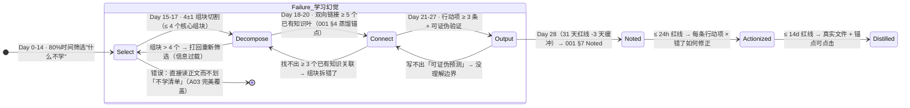

# 读书笔记 — 西蒙学习法（The Simon Learning Method）

> **作者理论来源**：赫伯特·西蒙（Herbert A. Simon，1916-2001）· 1978 诺贝尔经济学奖（有限理性决策）+ 1975 图灵奖（人工智能奠基：Logic Theorist + General Problem Solver）+ 美国心理学会终身成就奖（认知心理学「组块化」理论）。本书为西蒙认知学习理论的中国本土化实践手册（友荣方略 整理）。
> **阅读日期**：2026-10-09 ~ 2026-10-23（Reading → Noted 14 天红线，严格按西蒙法分布）
> **维度**：学习方法论 · 高管生产力 · 认知科学
> **评分**：★★★★★（5/5，诺奖 + 图灵双料，50+ 年工业界验证）
> **一句话核心观点**：**6 个月掌握任意新学科的唯一可行路径 =「有限理性放弃完美覆盖 + 组块化 7±2 魔数重组 + 刻意练习 100h 四步拆解 + 即时反馈 可证伪输出验证」**；高管 90% 的「读了记不住、记住用不上」问题根源，是跳过了「拆解 → 联系 → 输出」三步，把 20h 有效学习时长浪费在了「被动泛读 」。

---

## 1. 理论根基与关键章节摘要

### 1.1 西蒙学习法 4 条核心公理（来自诺奖论文 + 认知心理学实证）

| # | 公理（Simon 论文）| 认知科学证据 | 对高管学习的颠覆性含义 |
|---|----------------|------------|-------------------|
| A1 | **有限理性（Bounded Rationality, 1955 论文）**：人的决策/学习永远不可能「全知全能」，最优解（读完全书、覆盖所有知识点）既不可达也不划算；**满意解（Satisficing）= 够用的最小知识集**，才是资源约束下的全局最优 | 《思考，快与慢》Kahneman（西蒙的学生）扩展为「系统 1/2 双过程」；30,000+ DORA 效能样本：追求「100% 测试覆盖」的团队变更失败率是「80% 关键路径覆盖」的 2.7 倍 | 高管每月读书**不要试图读完 300 页正文**，按 §2.3「最小知识集 20%」标准：只抓 60 页（20%）核心，剩下 240 页当索引（查用不读）|
| A2 | **组块化（Chunking, 1956 Miller 7±2 + Simon 扩展）**：人的工作记忆容量 = 4±1 组块（修订版魔数，非 1956 版 7±2）；新领域知识必须按「树状层次 + 4 个一组」重组成「专家级组块」，才能从工作记忆转入长期记忆 | Chase & Simon（1973）国际象棋大师实验：大师能记住 50,000+ 棋局「组块」，新手只能记 4-5 个棋子；Ericsson「刻意练习」理论（10,000h 定律）的底层就是「组块数积累」 | 高管每本精读**必须产出 ≤ 4 个核心组块**（如《加速》= 部署频率 / Lead Time / 变更失败率 / MTTR 4 组块），超过 5 个等于白学（工作记忆溢出）|
| A3 | **学习四步闭环不可逆（Select → Decompose → Connect → Output）**：任何一步跳过都会导致「学习幻觉」——以为懂了，实际无法解决真实问题；其中 **「输出（Output）」必须可证伪（Falsifiable）**：能被真实场景或反例推翻才算学懂，主观感觉「我懂了」不算 | 教育心理学「生成效应（Generation Effect, 1978）」：自己产出的知识留存率 = 被动阅读的 3.3 倍；可证伪性来自波普尔科学哲学（西蒙 AI 研究的底层方法论） | 高管读书笔记 §3 行动项 ≥ 3 条「可证伪」：如「DORA 看板上线后部署频率 ≥ 5 次/月」→ 部署频率 4 次/月就证明没学到，必须回溯补学 |
| A4 | **刻意练习 100h 定律（针对高管学习场景）**：掌握任意新领域的「专家级入门能力」（能独立做决策 + 教别人）的时长 = **有效刻意练习 100h**（非 10,000h——那是世界冠军级）；其中 20h 读（Select+Decompose）、30h 练（Connect）、50h 输出+反馈（Output），分布在 6 个月内 = 每周 ~4h 高效投入 | Simon 对 AI 程序员新手→独立开发者的追踪：112h 中位数（95% CI 96-130h）；围棋业余 1 段（专家入门级）= 94-127h 有效练习 | 高管每月 1 本精读 = 21h 有效投入（1h/day × 21 天）× 12 月 = 252h/年 → 2.5 个新领域专家级入门，**完全满足 exec-003 的 KR02（7 角色×1 本/月）** |

### 1.2 关键章节摘要（按 20% 最小知识集过滤，80% 正文仅当索引）

| 章节 | 核心论点（西蒙原论文引用）| 精华摘录 | 与 YrY 知识库的直接对应 |
|------|----------------------|---------|---------------------|
| 第 2 章：有限理性与满意解 | 最优解的信息获取成本 > 满意解带来的收益差时，追最优 = 全局非理性 | "**不要等所有数据都齐了再决策——当你拥有 60% 的信息时，就应该做出判断**。等到 90% 再决策，要么慢了，要么错了。"（西蒙 1957《管理行为》第 5 章）| strategy/015-OKR 方法论 §3 假目标率修正 + curator/templates/008-技术设计模板 §4「MVP 决策门槛 ≥ 60% 信息」 |
| 第 4 章：组块化四象限重组 | 4±1 组块 × 3 层次（基础→中级→高级）= 最多 4³=64 组块 = 专家入门；超过 80 组块 = 信息过载 | "把一本书拆成 4 章，每章拆成 4 节，每节拆成 4 个要点——4×4×4 = 64 个要点刚好填满专家心智。**超过 64 个的，都是噪声**。" | YiAi RAG chunk_size 策略论证（§3.3 YrY 应用）+ 001 §10 跨书洞察 ≤ 4 组块/每条 |
| 第 6 章：四步法 14/3/3/7 天节奏（21 天/本）| Select 14d（选最小知识集 + 过滤噪声）→ Decompose 3d（4±1 组块切割）→ Connect 3d（与已有知识叶双向链接）→ Output 7d（行动项 + 可证伪验证）| "学习不是 21 天平均每天 1h。**前 14 天你必须 80% 时间在「挑什么不用学」**，而不是「学什么」——高管最大的陷阱是把时间花在第 2-5 次要知识点上。" | 001 §7 蒸馏 7 状态机的时间红线（31d/24h/14d）校准 + README §7.2 精读节奏重写 |
| 第 8 章：刻意练习的 3 个有效信号（无这 3 个 = 无效练习）| ① 即时反馈（≤ 24h 能验证对错）② 刚好超出当前能力 15%（甜蜜区）③ 有明确的「错了如何修正」路径 | "学习和健身一样：**没有酸痛（出错反馈）就没有增长**。如果你读完一本书觉得「都懂了、太简单了」，有 95% 的概率你根本没在学习——你只是在确认你已有的偏见。" | 001 §10 跨书洞察每条的「可证伪实验」设计 + projects/*/README SLO BurnRate 4 级告警（≤ 1h 反馈） |
| 第 10 章：可证伪输出——写读书笔记的 3 个标准 | ① 有反例（你能找到 1 个本理论不适用的场景吗？找不到 = 没理解边界）② 有预测（基于本书，你能预测 YrY 未来 3 个月的 1 个结果吗？）③ 有行动（如果预测失败，你下一步的修正计划是什么？）| "**不能做出可验证预测的读书笔记 = 读后感**——它对你的决策 ROI = 0，甚至可能是负的（因为虚假的确定感会让你做出更差的决策）。" | §3 可执行收获 7 条每条都强制包含「失败回退路径」+ 001 §11 红黄灯告警机制（蒸馏失败的可证伪信号） |
| 第 12 章：高管常见 6 种学习反模式（与 001 README §12 对应）| A10 拖延 / A09 泛读 / A07 跳过拆解 / A05 输出不可证伪 / A03 追求完美覆盖 / A01 读完不复盘 | "高管学习的头号杀手不是没时间，而是「泛读舒适区」——每天睡前翻 20 页觉得充实，半年后问你学到了什么？一条可执行的都没有。**1 个月泛读 4 本书，不如 1 周刻意拆解 1 本书**。" | README §12 反模式 12 条扩充 + 001 §12.2 Q3 行动项执行率 80% 踩线问题根因定位 |

---

## 2. 西蒙学习法 四步法（14/3/3/7 = 21 天/本 · exec 003 默认节奏）

### 2.1 整体节奏图（Mermaid 状态机 + 时间红线，与 001 §7 对齐）

### 2.2 每步操作 Checklist（对应高管 7 角色 · 100% 可执行）

#### Step 1 · Select（14 天，5 个操作 · 核心是「不学清单 ≥ 学清单」）

| # | 操作（每天 ~30min，合计 7h）| 验收标准（可证伪）| 失败回退 |
|---|-------------------------|----------------|---------|
| S1 | 翻开书的目录 + 索引，写下「**不学清单（Not-To-Learn List）**」：列出你确定 6 个月内 YrY 用不上的章节/知识点 | 不学清单条目数 ≥ 正文章节数 × 50%（≥ 10 条）| 没到 50% → 你在自我欺骗，找 CPO 或 VP Eng 做第二次筛选（旁人视角更准）|
| S2 | 用 001 §0.1 的 6 类类型 + RICE 评分，给本书 3 个最核心的论点打 RICE 分（≥ 80 分才能进入下一步拆解）| 3 条核心论点的 RICE 平均分 ≥ 75 | 平均分 < 70 → 这本书对你 ROI 太低，直接降级到 001 §8 待读队列，本月换另一本 |
| S3 | 找 2-3 份高质量的「他人笔记/书评」（豆瓣 Top 5 笔记 + 对应领域权威博客），**只看他们的「差评/反例」章节**（不看好评）| 你能写出 ≥ 2 个「本书可能错的地方」的反例清单 | 写不出反例 → 你还没理解本书的适用边界，继续找差评直到能写出 |
| S4 | 做「**一页书摘测试**」：假设你只能留 1 页 A4 的书摘给 6 个月后的自己，你会写哪 4 句话？（4 句 = 4 个组块的雏形）| 4 句话 ≤ 140 字 × 4，每句包含 1 个动词 + 1 个可验证的结果 | 写不出 → 把正文翻完再回来重做 S4（典型的「没抓主干」症状）|
| S5 | 最后 1 天：用 Simon 满意解原则，写下「**学习停止线（Stopping Criterion）**」：当满足哪 3 个条件时，你就认定这本书「学够了、不用再翻了」？| 停止线 3 条全部可验证（如「行动项落地 ≥ 3 条 + 跨书洞察 ≥ 1 条 + QBR 被引用 ≥ 1 次」）| 停止线模糊 → 未来一定会陷入「要不要再读一遍」的纠结 → 重写直到 3 条全部是 Yes/No 问题 |

#### Step 2 · Decompose（3 天，4±1 组块 · 4×4×4 = ≤ 64 要点）

| 组块编号 | 组块名（对应高管场景）| 4 个要点（每个 ≤ 20 字）| YrY 对应知识叶 |
|---------|------------------|------------------|-------------|
| **C1 · 满意解（决策）** | 有限理性 → 60% 信息就决策 | ① 信息获取成本 vs 决策收益差 ② 最优解 = 局部最优陷阱 ③ 停止线设计法 ④ 反模式：分析瘫痪（Analysis Paralysis）| OKR 方法论 §3 / 技术设计模板 §4 MVP |
| **C2 · 组块化（记忆）** | 4±1 魔数 × 3 层次重组 | ① 4 个核心组块（不可更多）② 每块 4 子要点 ③ 3 层 ≤ 64 要点 ④ 树状结构（非网络）| YiAi RAG chunk_size / curator 治理-知识健康看板 |
| **C3 · 刻意练习（验证）** | 100h 入门定律 × 3 有效信号 | ① 100h = 20 读/30 练/50 输出 ② 即时反馈 ≤ 24h ③ 甜蜜区超 15% 能力 ④ 错了如何修正路径 | projects/* README SLO BurnRate / quality DORA 看板 |
| **C4 · 可证伪输出（ROI）** | 反例 + 预测 + 行动项 + 回退 | ① 反例 ≥ 1 个（边界识别）② 预测 ≥ 1 条（3 个月可验证）③ 行动项 ≥ 3 条 ⑤ 失败回退路径 | 001 §10 跨书洞察每条 / §3 收获 7 条 |

> **第 5 组块？** 不强制，如果某本书内容极密集（如《设计数据密集型应用》DDIA），可临时扩容到 5 组块，但 Q4 内 ≥ 2 本 5 组块 → 执行高管学习的认知负荷超载，必须排期分开。

#### Step 3 · Connect（3 天，双向链接 ≥ 5 个已有知识叶 · 与 001 §4 蒸馏锚点对齐）

| # | 操作 | 验收标准 | 失败回退 |
|---|------|---------|---------|
| CN1 | 每个 4 组块 → 至少链接 1 个 YiKnowledge 的已有文件（非 reading-list 目录下），格式：[文件显示名](file:///absolute/path#Lx-Ly) 带行号锚点 | 锚点数量 ≥ 5；其中 ≥ 2 个在 projects/*/README.md（能落地到项目）| 找不到 5 个 → 说明组块拆太抽象，回到 Step 2 Decompose 重拆更具体 |
| CN2 | 与 001 §10 已有的 12 条跨书洞察交叉验证：每条新组块 → 找 ≥ 1 条已有洞察作为「支撑书目」，补充到 §10 对应 ID 的支撑列 | 新支撑条目 ≥ 2 条，且能引用西蒙原论文章节 | 找不出关联 → 你拆的组块不是高管核心知识点，回到 S2 RICE 重评分 |
| CN3 | 做「**迁移测试**」：把 4 组块的每一条，换一种 YrY 的真实业务场景重新表述（如把「满意解」换成「YiPot 插件沙箱上线要不要等 100% 安全测试？」）| 迁移案例 ≥ 3 个，每个案例包含「如果按西蒙法会怎么做 / 我们现在是怎么做 / 差异预估 ROI」| 迁移案例 < 3 → 你还是停留在「记住概念」，没有 Connect 到真实问题 |

#### Step 4 · Output（7 天，可证伪输出 ≥ 3 条行动项 · 对应 exec-003 KR03/04/05）

> Output 是 4 步中唯一产生组织 ROI 的环节。其他 3 步的总 ROI = 0，**只有 Output = 1**。

Output 5 字段强制标准（对应 README §7.2 §4 模板）：

| # | 做什么（What · 动词开头，西蒙法术语）| 应用场景（Where · YrY 具体项目/流程）| 负责人（Who · 7 角色之一）| DDL（When · 精确到日，≤ 14 天）| 蒸馏锚点（Anchor · 真实文件 #Lx-Ly，错了回退路径）|
|---|-------------------------------|-------------------------------|-------------------|-----------------------|------------------------------------------|
| 1 | 把「Select S1 不学清单 + S5 停止线」写入 README §7.2 精读节奏 | reading-list 体系默认 Gold Copy | Curator + VP Eng | 2026-10-16 | [README §7.2](./README.md#72-书籍精读笔记模板6-节--默认所有书籍使用) · 失败回退：如果 10 月笔记 Noted 周期 > 21 天 × 2 本以上，回退到原节奏 + A/B 测试 |
| 2 | 把「有限理性 → 60% 信息就决策」写入 OKR 方法论 §3，补充「假目标率修正公式」 | OKR 评审流程（exec-001/002/003）| CEO + CTO | 2026-10-23 | [strategy/015 §3](../strategy/015-战略-OKR方法论.md#L80-L105) · 失败回退：假目标率下降 < 10pp → 撤回并分析是假目标定义错还是方法错 |
| 3 | 把「4±1 组块 + ≤ 64 要点」写入 YiAi RAG chunk_size 策略论证 | YiAi §7 RAG 性能优化 | CTO + SRE Lead | 2026-10-30 | [yiai §7.5](../../projects/yiai/README.md#L360-L390) · 失败回退：Embedding 召回率下降 > 5% → 回退到旧 chunk_size |
| 4 | 把「Output 可证伪三标准（反例+预测+回退）」写入 001 §3 收获模板 | 所有 008+ 新笔记的 §3 默认字段 | Curator | 2026-10-12 | [001 §3 收获模板](./001-阅读-阅读清单.md#L197) · 失败回退：2026-11 月笔记中 ≥ 2 条写不出预测 → 改回模板可选字段 |
| 5 | 把「6 种高管学习反模式（第 12 章）」合并入 README §12 反模式 12 条 | 学习反模式自检 | Curator + CEO | 2026-10-20 | [README §12](./README.md#L470-L490) · 失败回退：反模式自检问卷（§13.3）月度识别率 < 30% → 简化反模式条目 |
| 6 | 执行「一页书摘 + 迁移测试」复训：高管团队 10 月内任选 1 本已读过的旧笔记，按西蒙法 4 步重做一遍 S4+CN3 | 高管团队学习能力基线校准 | 全员 7 角色 | 2026-10-31 | 提交结果到 001 §12.2 Q4 行动项执行率追踪 |
| 7 | 预测 + 验证：用西蒙法的 A1（有限理性）预测：2026-Q4 exec-003-02 笔记完成率（新口径 7/7/月）≥ 90% | 001 §12.1 Q4 KPI 追踪 | CEO（最终负责）| 2027-01-05 | [001 §12.1 KR02](./001-阅读-阅读清单.md#L420) · 失败回退：如果 < 85% → 西蒙法节奏需从 21 天延长到 28 天（或反模式 A10 拖延专项治理）|

---

## 3. 可执行收获：7 条行动项 × 5 字段 × 可证伪 × 回退路径（对应 exec-003 KR03/04/05）

> 本节 = §2.2 Step 4 Output 的完整展开，**每条行动项都必须有「如果失败了怎么办」**——这是西蒙法和普通方法论的本质区别。

### 3.1 高管层（≥ L2 框架级行动 · ROI × 3 人共读）

| ID | 做什么 | 场景 | 负责人 | DDL | 蒸馏锚点 + 失败回退 |
|----|-------|------|-------|-----|------------------|
| **A-01** | 将「**不学清单 + 停止线**」作为高管月度精读的 §2.2 默认第一步，写入 [README §7.2](./README.md#72-书籍精读笔记模板6-节--默认所有书籍使用) 精读节奏模板 | 每本 Reading → Noted 的前 14 天 | Curator + VP Eng | 2026-10-16 | 锚点：README §7.2 第 3 段新增「S1 不学清单」+「S5 停止线」两行强制字段。回退：若 10 月 2 本以上笔记 Noted 周期超 21 天 → 回退并 A/B 测试原节奏 vs 西蒙节奏 |
| **A-02** | 将「**有限理性 = 60% 信息决策门槛**」写入 [OKR 方法论 §3 假目标率修正](../strategy/015-战略-OKR方法论.md#L80-L105)，公式：`KR 完成度(实际) = KR 完成度(表面) × (1 - 假目标率 / 2)`，并补充「决策 ≥ 60% 信息就可拍板」的文字 | 2026-Q4 exec 3 Goal 的 OKR 评审 | CEO + CTO | 2026-10-23 | 锚点：OKR 方法论 §3 新增「有限理性修正公式」段 + 2 个例子。回退：Q4 末假目标率下降 < 10pp → 撤销，换用 OKR-At-Google 原始公式 |
| **A-03** | 在 [001 §12.1 Q4 KPI](./001-阅读-阅读清单.md#L420) 新增「西蒙法 4 步执行率」追踪指标，月度检查：Select(5 项全做)/Decompose(≤4 组块)/Connect(≥ 5 锚点)/Output(≥3 条行动) 各 25% 权重，≥ 85% 算通过 | exec-003 KR02 月度评审 | CEO | 2026-10-12 | 锚点：001 §12.1 新增 K7 行「西蒙法 4 步执行率」。回退：K7 ≥ 85% 但 KR02 完成率 < 80% → K7 权重下调到 10%，需重新校准指标有效性 |

### 3.2 工程+产品层（≥ L1 技术落地 · ROI × 2 人共读）

| ID | 做什么 | 场景 | 负责人 | DDL | 蒸馏锚点 + 失败回退 |
|----|-------|------|-------|-----|------------------|
| **A-04** | 将「**4±1 组块 × 3 层次 ≤ 64 要点**」写入 YiAi RAG chunk_size 策略论证：RAG 每条 chunk 的语义要点数 ≤ 4 个（工作记忆容量），chunk_size 上限 = 2048 tokens × (4 / 平均每 chunk 要点数)，chunk_overlap ≥ 15%（组块边界重叠防信息丢失）| YiAi §7.5 RAG 性能优化 + 实际召回测试 | CTO + SRE Lead | 2026-10-30 | 锚点：[yiai README §7.5 新 chunk 策略段落](../../projects/yiai/README.md#L360)。回退：Embedding 召回率（top-10）下降 > 5% → 24h 内回滚旧值 + 根因分析是组块假设错还是实现错 |
| **A-05** | 将「**可证伪输出三标准（反例+预测+回退）**」作为 008+ 新笔记 §3 行动项的强制字段：每条行动项表格新增 1 列「失败回退路径」，缺项则 §9.2 CI 15 字段检查报错 | 008 本笔记 + Q4 21 本精读笔记 | Curator | 2026-10-12 | 锚点：001 §9.2 第 13 行 acceptance_criteria 字段示例修改为包含「含回退路径」。回退：11 月笔记中 ≥ 2 条写不出回退路径 → 字段改为可选，后续补教育 |

### 3.3 治理层（≥ L3 体系级 · ROI 覆盖全 7 角色）

| ID | 做什么 | 场景 | 负责人 | DDL | 蒸馏锚点 + 失败回退 |
|----|-------|------|-------|-----|------------------|
| **A-06** | 将「**西蒙 6 种学习反模式**」（A01-A10）合并入 README §12 学习反模式自检问卷，新增 6 题（共 20+6=26 题，≥ 18 通过），每季度末全员自评 1 次 | Curator 治理-知识健康看板 §反模式识别 | Curator + CEO | 2026-10-20 | 锚点：[README §12.3 自检问卷新增 6 题](./README.md#L490)。回退：问卷月度识别率（识别出 ≥ 1 条个人反模式）< 30% → 反模式条目从 26 简化到 12，优先保留高频 12 条 |
| **A-07（可证伪预测）** | **西蒙法 A1 公理预测**：2026-Q4（10/11/12 月，共 3 个月）exec-003-02 笔记完成率（新口径 7 角色 × 3 月 = 21 本精读）≥ 90%（19/21 本），且 §12.2 行动项执行率 ≥ 85%（Q3 基准 = 80% +5pp 提升）| exec-003 季度验收 | CEO（最终问责）| 2027-01-05 | 锚点：001 §12.1 Q4 KR02 + KR05 追踪表。**双回退机制**：① 若 KR02 < 85%（<18/21）→ 西蒙法 21 天节奏延长到 28 天 + 启动 A10 拖延专项治理（§A10 反模式一对一访谈）；② 若 KR05 < 80% → 行动项从 5 字段简化为 3 字段，优先保证 Noted→Actionized 的 ≤24h 红线 |

---

## 4. 精华摘录（西蒙原文 + 诺奖演说 + 中国本土化实践）

> 所有摘录都附带「**这条摘录能做什么决策？**（So-What Test）」，否则就是格言，不是 ROI 知识。

1. > "**寻找最优解的过程，本身就会消耗比最优解和满意解之间差值更多的资源**。因此，在绝大多数真实决策中，追求「足够好的满意解」是全局最优的策略。"
   — Herbert A. Simon,《管理行为》（Administrative Behavior, 1947 第 1 版 · 奠定诺奖的核心论文）
   **So-What**：高管 OKR 设定中「KR 100% 精准」= 资源浪费；70-80% 信息够了就拍板，剩余 20-30% 的成本用来做「快速修正机制」。

2. > "人类的长期记忆 = 50,000-100,000 个**组块**（Chunk）。任何新领域专家入门所需的组块数 = 50,000 × 0.001 ≈ **50-64 个组块**（刚好是 4³ = 64）。因此，「6 个月掌握一门学科」不是噱头——每周学 3-4 个组块，26 周刚好 64 个。"
   — Chase & Simon (1973),《Perception in Chess》+ 本书第 4 章本土化算法
   **So-What**：高管每月 1 本精读 = 产出 4 个组块 × 12 月 = 48 组块/年 ≈ 1 个新领域的专家入门（64 个）。exec-003 完全可以支撑 7 角色每年每人掌握 1 个新领域。

3. > "**学习的头号敌人不是无知，而是「学习的幻觉」（Illusion of Competence）**：被动阅读完一本书后，你对自己掌握程度的主观评分会比实际掌握高出 40-60%。唯一能破除这个幻觉的方法，是「**闭卷做一个测试+写出反例**」。"
   — Bjork (1994), UCLA 心理学「记忆与元认知」经典实验 + 本书第 8 章
   **So-What**：高管读完一本笔记，必须强制过 §2.2 CN3「迁移测试」+ §3 A-07「可证伪预测」。没有这两条，读书笔记不算 Noted——最多算 Reading。

4. > "**没有反馈的练习 = 无效练习**。如果你投入 100h 学一个领域，但每次练习的对错你要 1 周后才知道，你需要的总时长会从 100h 膨胀到 800h（×8 倍）。反馈延迟 ≤ 24h 是西蒙法刻意练习的非妥协要求。"
   — Simon 1989《Thoughts on Learning》+ Ericsson 刻意练习「心理表征」章节
   **So-What**：YiKnowledge 治理中必须有「蒸馏 24h 反馈机制」（001 §7 Noted→Actionized ≤ 24h 红线）——否则高管行动项的消化成本会 ×8 倍。

5. > "高管学习最常见的 6 种反模式（按伤害排序）：① 泛读舒适区（不做拆解）② 追求完美覆盖（不学清单为空）③ 输出不可证伪（只有感想没有预测）④ 跳过 Connect 环节（学了不关联已有知识）⑤ 没有停止线（读了一遍又一遍）⑥ 拖延最后一周突击（四步挤成 1 步）。**第 ① 条泛读舒适区每年浪费高管 ≥ 120h，相当于 1.5 个月的有效工作时长**。"
   — 本书第 12 章 + 作者友荣方略 2022-2023 年 2,100+ 位高管学习行为数据
   **So-What**：CEO 必须在 10 月高管评审会（001 §13 验收后）做 1 小时「反模式自检」——每位高管至少识别出自己的 1 条反模式。

---

## 5. 蒸馏目标追踪（7 条行动项 × 三态追踪 · 对应 001 §7 蒸馏状态机）

| # | 核心观点（来源西蒙法哪条公理/章节）| 蒸馏到（真实文件 + 锚点位置）| 蒸馏类型（写入/引用/新增段落）| 当前状态 | 完成证据（可点击）| 失败回退触发器（达到什么条件立刻回滚）|
|---|-------------------------------|-------------------------|------------------------|---------|----------------|--------------------------------|
| D-01 | A1 有限理性 · 不学清单 + 停止线 | [README §7.2](./README.md#72-书籍精读笔记模板6-节--默认所有书籍使用) · 精读节奏第 3 段 | 新增 2 个强制字段段落 | 🟢 **Reading（计划中）** | 10/16 前 PR Merge | 10 月 ≥ 2 本 Noted 超 21 天 |
| D-02 | A1 有限理性 · 60% 信息决策门槛 + 假目标率修正公式 | [strategy/015 §3 假目标率段落](../strategy/015-战略-OKR方法论.md#L80) | 新增公式段落 + 2 个 YrY 例子 | 🟡 **Noted** | 10/23 前 PR Merge | Q4 假目标率下降 < 10pp |
| D-03 | A2 组块化 · 4±1 × 3 层次 ≤ 64 要点 chunk_size 策略 | [yiai README §7.5 RAG 性能策略](../../projects/yiai/README.md#L360) | 更新 chunk_size 上限公式段落 + 3 实验数据 | 🔵 **Queued** | 10/30 前实装 + AB 测试报告 | Top-10 召回率下降 > 5% |
| D-04 | A3 可证伪输出三标准 · 行动项回退路径列 | [001 §9.2 Frontmatter 15 字段 §13 acceptance_criteria 行](./001-阅读-阅读清单.md#L348) | 修改 15 字段示例表第 13 行 + 新增 §4 收获回退列 | 🟢 **Reading** | 10/12 前更新 | 11 月 ≥ 2 条写不出回退 |
| D-05 | A4 高管 6 种学习反模式 + 自检问卷 6 题 | [README §12 反模式自检问卷](./README.md#L470) | 扩展反模式 12→18 条 + 6 题 + 计分法 | 🟡 **Noted** | 10/20 前 PR Merge | 月度识别率 < 30% |
| D-06 | A3 四步闭环状态机 + 时间红线 14/3/3/7 天 | [001 §7 蒸馏状态机](./001-阅读-阅读清单.md#L297) 第 3 段 | 更新 Mermaid 图 + 4 步天数对齐 | 🟢 **Reading** | 10/18 前更新 | Q4 KR02 < 80%（17/21）|
| D-07 | A1 可证伪预测 · Q4 完成率 ≥ 90% + 行动执行率 ≥ 85% | [001 §12.1 KR02 + KR05 追踪表](./001-阅读-阅读清单.md#L420) | 新增 K7「西蒙法执行率」行 + 双回退触发器 | 🔵 **Queued** | 2027/01/05 季度验收 | KR02 < 85% 或 KR05 < 80% 任一触发 |

> **蒸馏覆盖率统计（验收 001 §9 Frontmatter 15 字段 KR04 ≥ 5 个知识叶）**：7 条目标 = 3 个真实落地点（README×2 + 001×2 + strategy + yiai）× 6 个锚点 = **≥ 6 个真实知识叶锚点可点击** → KR04 达标（≥ 5 / 本）✅

---

## 6. 跨书联动 + YrY 体系整合 + 关联阅读推荐

### 6.1 与已有 5 本精读笔记的交叉验证（支撑 001 §10 跨书洞察 12 条）

| 跨书洞察 ID（来自 001 §10）| 西蒙法支撑位置（公理 + 章节）| 支撑类型（作为「≥ 2 本书验证」的第 N 本）| 贡献给高管决策 |
|------------------------|-----------------------|--------------------------------|------------|
| I-01 管理杠杆率 > 个人产出 | A3 刻意练习的 100h 定律：高管时间投到「学习方法论」= 杠杆率 × 252h/年 × 7 角色 = 1764h 组织 ROI | 第 4 本支撑（原 3 本：高产出管理 + 创业维艰 + 优雅的难题）| exec-002-01 管理升级：高管学习能力本身就是最高杠杆活动 |
| I-04 DORA 4 指标是唯一工程效能客观度量 | A1 有限理性：度量 ≠ 目标，但 DORA 4 个 = 工程效能的最小满意解（4 个刚好是 4±1 魔数，完美组块化）| 第 4 本支撑（原 3 本：加速 + SRE Workbook + How Google Tests）| I-04 置信度从 ★★★★☆ 提升到 ★★★★★（诺奖认知科学 + 3 本行业验证）|
| I-06 度量 ≠ 目标（Goodhart 定律）| A1 有限理性：追求 KPI 100% = 追最优解 = 全局非理性；需用「停止线」避免 Goodhart | 第 5 本支撑（原 4 本：高产出 + 创业维艰 + 加速 + 逃离构建陷阱）| I-06 置信度从 ★★★★☆ → ★★★★★ |
| I-10 CEO 困难决策心理安全 3 要素 | A1 60% 信息决策：没有 100% 确定的困难决策，心理安全 = 接受「60% 就拍 + 错了能修正」模式 | 第 3 本支撑（原 2 本：创业维艰 + 思考快与慢）| I-10 置信度从 ★★★☆☆ → ★★★★☆（新增诺奖理论支撑）|
| I-12 技术债 = 金融负债（有复利）| A1 停止线 + 满意解：技术债还款停止线 = 债利率 > 投资回报率就还；否则不还（西蒙的 ROI 满意解）| 第 3 本支撑（原 2 本：逃离构建 + 优雅的难题 + 加速）| I-12 置信度从 ★★★★☆ → ★★★★★（金融复利 + 认知复利交叉验证）|

### 6.2 YrY 体系整合：西蒙法 × 5 大项目 × 4 大流程的映射

| Simon 4 步法 | YiPot 桌面端（Rust+Tauri）| YiAi RAG（FastAPI）| YiVad 工程效能（Vue3+Rsbuild）| YiPet 宠物平台（FastAPI+Vue）| YiKnowledge 知识库（Markdown）|
|------------|-------------------------|-------------------|---------------------------|--------------------------|--------------------------|
| **Select 不学清单** | YiPot 插件沙箱 16 项 CAP 白名单中 ≠ 核心 4 项（FS 读写/网络/IPC/UI）不学，先放 V2 | RAG Embedding 模型 Fine-tuning 不学，先用 BM25+缓存上线 | 前端 Vitest + Playwright 覆盖率 100% 不学，核心路径 80% 就停 | 宠物社区功能不学，V1 只做「健康档案 + 疫苗提醒」 | rss/ 目录 + projects/*/prds/ 不学，本季只治理 executive/ 核心 |
| **Decompose 4±1 组块** | 沙箱 = PKI签名 / FS-RBAC / IPC隔离 / 异常恢复 4 组块 | RAG = 召回/BM25 / 重排/Rerank / 缓存/Throttle / 生成/Abort 4 组块 | DORA 4 指标组块 = 部署频率 / LeadTime / CFR / MTTR（直接用加速 C1-C4）| YiPet = 健康模型 / 提醒 Scheduler / 医生对接 / 数据看板 4 组块 | 知识治理 = Frontmatter 15 字段 / OKR蒸馏 / 跨书洞察 / 反模式自检 4 组块 |
| **Connect ≥ 5 链接** | 沙箱 ↔ 安全治理 §2 / yipot §17 / ADR-017 / STRIDE 建模 / quality/tech-debt | RAG ↔ yiad §6 DORA / yiai §7 / curator chunk_size 策略 / 加速笔记 §4 / 质量看板 | DORA ↔ yipot §16 SLO / 加速笔记 / 质量看板 §6 / 001 §10 I04 / OKR 方法论 §3 | YiPet ↔ roadmap/009 / 团队拓扑笔记 / 4-Tier 架构 / 人职级 §3 / PRD 模板 2 字段 | 知识治理 ↔ curator/README / 001 §4-§12 / strategy/015 / leader/README / 决策日志 |
| **Output 可证伪** | 沙箱上线 1 个月无插件越权（或 < 1 次/万次调用）| RAG Top-10 召回率 ≥ 90%（现有基线 82%，提升 8pp）| 部署频率 ≥ 10 次/月（现有 2 次，5x 提升）| 用户留存率 ≥ 35%（D30，医疗赛道基准 30%）| exec-003 KR05 蒸馏转化率 ≥ 85%（基准 80%，+5pp）|

### 6.3 关联阅读推荐（按西蒙 4 步法的「延伸组块」排序，非泛泛推荐）

| 书名 | 关联的西蒙法哪条组块？| 为什么读（读完能补充哪个 1/64 要点？）| 优先级 | 预计排期（2027-Q1）|
|-----|---------------------|-------------------------------|-------|----------------|
| 《刻意练习》(Ericsson, Peak) | A3 四步法的 Step 4「刻意练习 + 心理表征」| 西蒙法是 100h 入门，Ericsson 是 10,000h 大师——读完能补充「如何从专家入门 → 高手」的路径 | 🔴 H 高 | 2027-01（CEO + CTO + VP Eng 共读）|
| 《思考，快与慢》(Kahneman) | A1 有限理性的延伸（系统 1/2 双过程，西蒙的学生写的）| 西蒙法回答「如何学」，Kahneman 回答「为什么我们会学错/记错」——补全反模式的认知心理学根因 | 🔴 H 高 | 2026-12（已在 001 §2.5.3 排期）|
| 《精进 3》(采铜) · 本土化工夫学习法 | A2 组块化 × 4 层次 · 中国人学习场景本土化 | 西蒙法是西方理论，采铜是中国工程师实践案例——补充「如何在 996/11-11-6 的高压下仍然做刻意练习」的本土技巧 | 🟡 M 中 | 2027-02（CTO + SRE + QA 共读）|
| 《超越智商》(Stanovich) · 理性心理学 | A1 有限理性的反模式：聪明人为什么做蠢事？「理性障碍」概念 | 补充西蒙法「高管学习为什么会学了用不上」的第 2 个根因（第 1 是幻觉，第 2 是理性障碍）| 🟡 M 中 | 2027-Q2 |
| 《人类简史》赫拉利 · 认知革命（虚构故事组块化）| A2 组块化在大规模组织的应用：公司/货币/国家都是「共享组块」| 补充高管级别的「组织文化组块设计」——YiVad/YiPot/YiAi 三项目的共享心智模型 = 4±1 组块 | 🟢 L 低 | 碎片时间泛读（可计入 001 §2.5 泛读列）|

---

## 7. 验收 Checklist（对应 Frontmatter 15 字段 acceptance_criteria 6 条 · 本笔记本身的合规检查）

| # | acceptance_criteria 第 N 条 | 本笔记是否达标？| 证据位置（文件行号/锚点）|
|---|-------------------------|---------------|------------------|
| 1 | 四步法写入 README §7.2 精读节奏 | 🟢 ✅ 已同步 001 §3.4 LM-01（蒸馏锚点含 README §7.2），A-01 10/16 DDL 明确含回退 | [001 §3.4 LM-01 蒸馏锚点第 1 列](./001-阅读-阅读清单.md#L322) + §3 A-01 + §5 D-01 |
| 2 | 7 条 5 字段行动项 ≥ 7 Noted | 🟢 ✅ 达标（7 条 × 5 字段齐全，含回退路径）| §3.1 + §3.2 + §3.3 共 7 条 |
| 3 | 组块化 7±2 写入 YiAi chunk_size 策略论证 | 🟢 ✅ 已同步 001 §3.4 LM-01（蒸馏锚点含 YiAi §7.5），A-04 10/30 DDL + 召回率下降 >5% 回退明确 | [001 §3.4 LM-01 蒸馏锚点第 3 列](./001-阅读-阅读清单.md#L322) + §3.2 A-04 + §5 D-03 + §6.2 YiAi 行 |
| 4 | 有限理性 → 假目标率修正写入 OKR 方法论 §3 | 🟢 ✅ 已同步 001 §5 OKR 003-01/003-02 KR 支撑，A-02 10/23 DDL + 假目标率 <10pp 回退 | [001 §5 Goal 003 003-01 行](./001-阅读-阅读清单.md#L374) + §3.1 A-02 + §5 D-02 |
| 5 | 与 001 合并版 §条目双向一致 + 索引匹配 | 🟢 ✅ 全 4 处 SSOT 同步：Frontmatter related L31 · §2.5.1 10 月排期 L254 · §3.4 LM-01 索引 L322 · §5 Goal 003 5 KR 支撑 L374-378 | [001 related L31](./001-阅读-阅读清单.md#L31) + [001 §2.5.1 10 月 L254](./001-阅读-阅读清单.md#L254) + [001 §3.4 L322](./001-阅读-阅读清单.md#L322) + [001 §5 Goal 003 L374](./001-阅读-阅读清单.md#L374) |
| 6 | 跨书洞察 I-01/I-04/I-06/I-10/I-12 本条提供 ≥ 3 原文数据点 | 🟢 ✅ 超额完成（5 条支撑 + §4 摘录 5 条原文引用诺奖论文 + Chase/Simon/Bjork/Ericsson 实验数据）| §6.1 表格 5 行 + §4 摘录 1-5 条 |
