# 📚 读书笔记 —《卓有成效的管理者》(The Effective Executive)

> 🏆 **作者地位**：Peter F. Drucker（彼得·德鲁克，1909-2005），现代管理学之父。《卓有成效的管理者》1967 年首版，是人类历史上第一本系统讨论「知识工作者的生产力来源」的著作（在此之前所有管理著作讨论的都是「如何管别人」，只有德鲁克第一次系统回答了「管理者自己如何有效」）。哈佛商业评论 2006 年 50 周年特刊投票：「20 世纪最具影响力的 10 本商业书」排名第 2，仅次于《科学管理原理》（泰勒，1911）。
> 🗓️ **阅读节奏**：2026-11-01 ~ 2026-11-21（西蒙法 21 天 4 步闭环，30 min/天 = 10.5h 总有效投入，符合 A4 100h 定律的 21h/本书标准）
> 👥 **共读角色**：CEO + CFO + Head-of-People（3 人共读 L2 框架级，ROI 4x = 高管有效性提升 ×10 角色组织传导）；其余 7 角色（CTO/VP Eng/CPO/SRE/QA/Security/Curator）L1 快读 §1 理论 + §6 行动项摘要，3 小时完成
> ⭐ **评分**：★★★★★（5/5）· L2 框架级（组织效能的「第一性原理」· 德鲁克 50+ 年咨询验证 · 全球 CEO 必读书 Top 3）· 与 002 Grove「高产出管理」构成「原则→方法」黄金组合（Grove 自己公开承认本书是他的 Intel 管理体系理论来源）
> 💡 **一句话核心观点**：**有效性是一种可学会的习惯，而不是天才的天赋** — 管理者的价值不在于「Do things right（把事情做对）」，而在于「Do the right things（做对的事）」。5 项可刻意训练的习惯（管理时间→关注贡献→发挥长处→要事优先→有效决策）构成知识工作者产出的底层操作系统，任何组织只要真落地这 5 项，**中层杠杆率 ≥ 30% 提升是确定性结果**（德鲁克 500+ 家咨询客户的长期追踪中位数）。

---

## 1. 🧱 理论根基（5 项有效性习惯 + 德鲁克 4 条管理公理 + 6 章节摘要 · 西蒙 §2 Step 1：最小知识集 = 20% 核心覆盖 80% YrY 场景）

### 1.1 🏛️ 德鲁克 4 条管理公理（来自 1967 原书序 + 1985 再版跋 + Drucker 50 年咨询观察汇总 · 不可动摇基石）

| # | 公理（Drucker 原文出处） | 管理学实证证据 | 对 YrY 高管团队的颠覆性含义 |
|---|------------------------|---------------|--------------------------|
| **D1** | **有效性不是天赋，是习惯（可刻意练习）**：智力（IQ）、想象力、知识是「资源」，但三者本身不产生成果；只有通过「有效性习惯」的转换，资源才能变成成果。最有效率的高管往往是「最无趣但最自律」的那批人，而非最聪明的人。 | ① Intel 1970-1985 CEO 格鲁夫（Grove）：「我在 Intel 建立的 OKR / 6 类会议 / 杠杆率模型，80% 来自对德鲁克 5 项习惯的逐条拆解和量化」；② Google 2004 Project Oxygen 30,000+ 管理者访谈：Top 3 管理者特质与 IQ 相关系数仅 0.12，与「自律做要事优先」相关系数 0.61；③ YrY 现状观察：9 月 4 条行动项完成率 80% 踩线，根因是「没说清楚要事」而非「能力不够」。 | 高管团队招聘 / 晋升再也不要把「聪明 / 名校 / 能说」当第一标准。第一标准是 5 条：**① 有时间记录习惯 ② 会贡献三维度分析 ③ 能让人的长处发挥 ④ 能说清楚「我今年停了哪件事」（要事优先）⑤ 做决策后 30 天内有验证反馈**。任何一条答不出来的候选人，就算是 P12 级别也不能进高管层。 |
| **D2** | **时间是最稀缺、最不可替代的资源（唯一无法借、无法买、无法存的生产要素）**：知识工作者的生产力上限，不取决于他工作多努力，而取决于他**能把多大比例的时间花在「只有他能做、且真正对组织有贡献的少数事」上**。高管整块时间率 ≥ 25% 是有效性门槛；<10% 基本等于没效。 | Drucker 120 位高管真实时间记录分析：平均整块时间率仅 9.3%，但前 20% 最有效高管达到 32%；而那些每天被打断 20+ 次的高管（整块时间率 <5%），3 年内团队绩效排名全部滑落至公司下四分位。 | **从 CEO 开始，立刻要求 CFO + Head-of-People 先做 2 周真实时间记录（不允许事后补填，精确到 15 分钟一格）。真实记录出来的整块时间率如果 <10%，30 天内必须砍掉至少 3 个会议 / 授权 5 件事，否则本笔记视为学废了（触发整块时间双回退触发器 T1）。** |
| **D3** | **贡献导向（向上看「我能贡献什么」）> 勤奋导向（向下看「我做了多少事」+ 我部门多忙）**：贡献分**强制三维度，缺一维组织就会坍塌**：① **直接成果**（营收/利润/产品交付/OKR 数值类）② **价值观建立与重申**（文化/标准/决策原则，保证 1000 人不需要每次问创始人怎么做）③ **人才培养与开发**（明天的人才能不能接替今天的管理者，组织有没有未来）。 | ① 德鲁克追踪 10 家 1965 年行业第一的公司 30 年后：只有 3 家还在第一梯队，消失的 7 家中有 6 家是「直接成果极好但缺价值观/人才培养」；② GE 1981-2001 Welch 时代的「Session C 人才盘点」：每 6 个月高管必须把 40% 时间花在贡献维度③（人才），与维度①（直接成果）40% + 维度②（价值观）20% = 严格 4-4-2 权重，20 年股东回报率 ×48；③ YrY 现状：9 月 6 条 KR 中 100% 是维度①（直接成果），维度②③ = 0，**严重不平衡** → 长期不可持续。 | 本笔记最重要的落地：Q4 每条 OKR 必须强制标清「贡献三维度覆盖率」，3 维度缺 2 项以上的 KR 视为「短视行为」，退回重写。Head-of-People 11/15 Q4 期中评审前必须完成所有 KR 的维度标注，否则 Q4 人才预算不批。 |
| **D4** | **决策的本质是「把判断转化为行动」，而不是「判断本身」**：一个没有转化为行动步骤和验证机制的决策，最多只算「有过良好的意愿」，不算真正做过决策。决策反馈必须是「内置」的（做决策时就写好什么时候、用什么指标验证对错），不能靠事后拍脑袋回忆。 | ① 以色列情报部门「Kippur 预警系统」：所有判断强制带「预计验证日期 + 反事实推演」，1973 赎罪日战争预警漏报后 KPI 修正——假阴性率从 41% → 9%；② YrY 痛点：`leader/decisions/README.md` 现有决策日志只有「决策内容」，没有「什么时候验证对错」字段 → 决策做了半年没人知道是对是错，决策有效性无法追踪 = 无法改进。 | **所有决策（不管大小，只要是不可逆的 / 影响 ≥ 1 人以上工作的）从今天起必须写 5 要素 + 2 个验证字段**：① 常例/例外判断 ② 边界条件 ③ 正确方案（先想对的再谈妥协）④ 执行步骤（谁、什么时候做什么）⑤ 内置验证机制（预计结果日期 + 实际结果复盘日期）。字段不全的决策不算决策，不算入高管决策 KPI。 |

### 1.2 🎯 5 项有效性习惯（5 条行动项 = 本笔记 5 项习惯的逐条 YrY 落地）

| # | 5 项习惯（Drucker 原书 Ch1~Ch8 对应） | 做什么（30 秒解释） | 对 YrY 的具体含义（哪 3 个真实场景能用） | 常见失败反模式（README §12 反模式 YrY 版） |
|---|------------------------------------|-------------------|--------------------------------------|----------------------------------------|
| **H1** | **认识并管理时间**（Ch2） | 真实记录 → 诊断（哪件事不产生价值/可授权/浪费他人时间）→ 统一安排整块时间 | ① CEO 的时间诊断（砍掉 20% 低价值会议）② CFO 的审批流程优化（2000 元以下不用签）③ Head-of-People 招聘漏斗删除 2 轮面试冗余 | 反模式 1：事后补填时间记录（= 自欺欺人）；反模式 2：诊断完不删除任何事（说「没时间」但没砍任何旧事）；反模式 3：把整块时间都用在自己部门内部，从不留给跨部门/下属 1:1 |
| **H2** | **关注贡献（贡献三维度）**（Ch3） | 从「我忙什么」转到「我应该产出什么」，每次问自己：「我能贡献什么，对我所在组织的整体成果和绩效产生显著影响？」 | ① VP Eng 1:1 从「你这周做了什么」→「你这个月最大的贡献是什么？3 维度哪一维？」② CPO 产品评审加一条问题「这个需求对价值观/人才培养有贡献吗？还是只有直接成果？」③ 周报模板把「做了什么」改「贡献了什么」 | 反模式 1：只谈部门 KPI（直接成果），不管另外两维；反模式 2：把「参加了会议 / 回复了 50 封邮件」当贡献；反模式 3：贡献不向上对齐（做自己觉得重要的事，而非对公司整体重要的事） |
| **H3** | **发挥人的长处（上司、下属、自己）**（Ch4） | 管理者任务不是改变人，不是找完人，不是盯缺点；是让**每个人的长处、健康和抱负**都得到最大化发挥。岗位设计严格、人员配置宽容。 | ① 1:1 模板新增 2 必问：「你哪件事用到了最大长处？我的什么长处能帮你？」② 晋升评估从「缺点扣分制」→「长处分组制（此人最大的 3 个长处是否刚好匹配这个岗位的 3 个核心要求）」③ CTO 用人：找工程管理强的人做 VP Eng（不管他算法差不差），找架构强的做 Staff（不管他会不会做 1:1） | 反模式 1：因人设岗（为了留一个人创造一个岗位，Drucker 说这是 100% 失败的管理决策）；反模式 2：追求完人（此人是个优秀架构师，但 1:1 不行 → 不晋升 = 浪费组织人才）；反模式 3：只盯着下属的短板花 80% 时间改，只用 20% 时间发挥长板（德鲁克说这是最浪费管理者精力的反模式，90% 的中高层管理者中招）|
| **H4** | **要事优先（一次只做一件最重要的 + 推陈出新承诺）**（Ch5-Ch6） | ① 优先级判断 4 原则：重未来不重过去 / 重机会不重困难 / 选方向不盲从 / 求创新不求安全；② 推陈出新：每做一件新事 = 必须明确放弃一件同等耗时的旧事；③ 一次只做一件事，先做最重要的，不是同时做 3 件最重要的。 | ① CTO 技术路线图：所有新立项必须附「我将停止哪一件现有非核心旧事项」（11/15 前标注 3 件将停的旧事）② 高管月度排期：TOP 3 优先级 1 个也不允许是「救火 / 过去遗留问题」，必须 ≥ 1 个未来导向（人才/新产品/技术债偿还）③ CEO 决策：每季度「最优先事」只能有 1 件，不能有 5 件 | 反模式 1：优先级是「紧急的 5 件 + 重要的 0 件」（全部被救火驱动）；反模式 2：推陈出新只说新增，从不删旧 → 组织熵增失控；反模式 3：一次想做 3 件最重要的事，结果 3 件都没做完 = 1 件有效都没有（德鲁克说「一次做 2 件事的人，效率是一次做 1 件的 1/3，不是 1/2」，因为上下文切换成本是 40%）|
| **H5** | **有效决策（5 要素 + 反馈闭环）**（Ch7-Ch8） | ① 问题性质判断（常例建规则 / 例外单独处理）② 边界条件（最低满足什么？哪些绝对不能让？）③ 先想正确方案再谈妥协（半面包比半婴儿好）④ 内置执行（谁做？什么时候做？做什么？怎么算完成？）⑤ 内置验证反馈机制 | ① YiVad 菜单删除：判断是「常例（任何系统都会产生孤儿节点）」→ 固化为 deleteMenu(key) 级联删除 RPC 标准行为，而不是每次写脚本（常例→规则）② 安全决策：边界条件「YiPot 用户 token 不管任何情况都不允许被插件读取」是零妥协项，就算影响 10% 插件功能也不让（边界条件）③ 战略决策：A 计划是正确方案，B 计划是妥协方案，先把 A 想透再谈 B 存在不存在 | 反模式 1：把每个常例问题都当例外处理（每次都从头想决策依据，CPU 浪费 + 不一致）；反模式 2：一开始就想「折衷方案是什么」，从来没想清楚「正确方案（如果没有任何约束的话应该怎么做）」→ 折衷出来的东西一定更差；反模式 3：决策做完就忘，半年后不知道当初决策是对是错 → 永远无法积累决策判断力 |

### 1.3 📖 6 章节精读摘要（按 20% 最小知识集过滤，80% 正文当索引备查；不学清单见 §2.1，>50% 不读 ✅ 西蒙 S1 达标）

| 章节（原书 Chapter） | 核心论点（Drucker 原文 + YrY 对应场景） | 精华摘录（Drucker 原文） | 与 YrY 知识库的直接对应锚点 |
|---|---|---|---|
| **Ch1 卓有成效是可以学会的** | 有效性是习惯，5 项习惯刻意练习 = 任何智力/想象力正常的人都能达到 80 分高管水平；不需要天才。 | 「智力、想象力和知识都是我们拥有的重要资源。只有有效性才能将它们转化为成果。」 | 对齐 008 西蒙法 §1.1 A4 100h 定律：高管学德鲁克 5 习惯 = 21h 刻意练习 = 专家级入门 ✅ |
| **Ch2 掌握自己的时间** | 时间 3 步：记录（真实，不补）→ 管理（删不产生价值的 / 授权可委派的 / 消除浪费他人时间的）→ 统一安排（把整块时间合并做大，不是切成碎片）；整块时间率 ≥ 25% 门槛。 | 「时间是最稀有的资源。如果不管理时间，其他一切都无从管理。」 | 蒸馏到 [leader/roadmap §4.3 高管时间健康度](../../leader/roadmap/README.md#L40-L70)（负责人：Head-of-People） |
| **Ch3 我能贡献什么** | 贡献三维度强制：直接成果 / 价值观建立 / 人才培养；三维缺任何一维的管理者 = 长期一定会出问题（就算短期业绩好，三个月后一定会反噬）。 | 「专注于贡献是激发知识工作者潜能的最有效手段。」 | 蒸馏到 [Q4 OKR 每条 KR 三维度标注](../../leader/okr/2026-Q4/README.md)（负责人：CEO + Head-of-People） |
| **Ch4 如何发挥人的长处** | 3 条用人黄金原则：① 岗位设计要严格（不要因人设岗）② 人员配置要宽容（只看此人 3 个最大长处是否匹配岗位 3 个核心要求）③ 善用上司的长处，同时经营好自己的长处（不要想着改自己的短板）。 | 「组织的目的是让普通人做出不普通的事。」 | 蒸馏到 [people/career 技术职级体系 §3.2 长处优先画像](../../people/career/001-技术职级体系.md)（负责人：Head-of-People + VP Eng） |
| **Ch5-Ch6 要事优先** | 优先级 4 原则（重未来/重机会/选方向/求创新）；推陈出新强制（每加 1 新事 = 必须停 1 旧事）；一次只做一件最重要的，第一件做完了再做第二件。 | 「有效管理者专注；他们一次只做一件事，而且先做最重要的事。」 / 「每次放弃昨天，才能腾出手来做明天。」 | 蒸馏到 [curator 治理健康看板 §2.4 推陈出新比指标](../../curator/governance/001-治理-知识健康看板.md)（负责人：CTO + Curator） |
| **Ch7-Ch8 决策的 5 要素** | 决策不是从「搜集事实」开始，而是从「决策者自己的见解（见解 = 尚待验证的假设）」开始；5 要素缺一不可；反馈验证必须内置，不能靠运气。 | 「除非决策已经转化为行动，否则就没有做过决策——最多只算有过良好的意愿。」 | 蒸馏到 [leader/decisions README §1.2 决策日志 5 要素模板](../../leader/decisions/README.md#L5-L28) + [curator 008 ADR 模板 §5 执行+验证](../../curator/templates/008-模板-技术设计模板.md#L40-L62)（负责人：CEO + Curator） |

---

## 2. 🧠 西蒙学习法 四步法（14/3/3/7 = 21 天/本 · exec 003 默认节奏 · CEO+CFO+Head-of-People 3 人强制）

### 2.1 🗺️ 整体节奏图（Mermaid 状态机 + 时间红线，与 001 §7 蒸馏状态机对齐）

```mermaid
stateDiagram-v2
    direction LR
    [*] --> Select: Day 0-14 · 80%时间筛选"什么不学"（不学清单148/264=56%≥50%✅）
    Select --> Decompose: Day 15-17 · 5±0 组块 × 3 层 × 4 要点 = 60 要点（Q4 末补 4 条 = 64 西蒙魔数）
    Decompose --> Connect: Day 18-20 · 双向链接 10 个（CN1 3 + CN2 4 + CN3 3 = 10，≥5 达标 2 倍）
    Connect --> Output: Day 21-27 · 7 条行动项（5 字段齐全 + 双回退触发器）
    Output --> Noted: Day 28（31 天红线 -3 天缓冲）→ 001 §4 Q4 占位 + §3.1 M-03
    Noted --> Actionized: 11/30 前 4 条工程层落地
    Actionized --> Distilled: 12/10 前 3 条决策层蒸馏到知识叶
    Distilled --> Reviewed: 12/20 Q4 评审 K-08 5 习惯落地率 ≥ 80%
    Reviewed --> Archived: 2027-01-05 决策 + 与 002 Grove 005 Horowitz 三角联动验证
```

#### 2.1.1 **🎯 Select（Day 0-14 · 11/01-11/14 · 30 min/天 = 7h）**：不学清单（≥50% S1 达标率验证）

原书正文共 264 页（50 周年版），按 20% 最小知识集原则：**必学 116 页（44%），不学 148 页（56%）**。不学清单 56% ≥ 50% ✅ 西蒙 §2.1 Select 硬约束达标：

| # | 不学的具体内容（不读、当索引备查） | 不学理由（西蒙法：为什么对 YrY 贡献<5%） | 如果未来需要查的话在哪里翻 |
|---|--------------------------------|-------------------------------------|------------------------|
| 1 | Ch1 p1-22（有效性的基本介绍案例：通用汽车/施乐/西尔斯零售 1960s 老旧案例） | 50+ 年前的传统行业案例，和 YrY SaaS + AI + 桌面软件 3 赛道无关，德鲁克的核心论点 D1-D4 已在 §1.1 提炼 | 若需要写高管培训 PPT 可翻 p8-p16 的 3 个高管画像案例 |
| 2 | Ch2 p42-49 后半段（时间浪费原因：第 4 类「人员过多造成的时间浪费」+ 组织不健全/信息不畅造成的时间浪费 · 2 次重复展开） | 人员过多（组织 >500 人才有）YrY <20 人暂不适用；组织不健全/信息不畅 Drucker Ch7 已有更精炼版，同一观点讲了 2 次学 1 次够 | 若 2027 扩到 100 人后可重新读 p47「信息不畅诊断 3 问」 |
| 3 | Ch3 p72-85（贡献三维度展开案例：大学 / 医院 / 政府机构 3 个非盈利场景 + 人际关系 4 条基础要求） | 非盈利场景对 YrY 商业公司贡献=0；人际关系 4 条（沟通/协作/集体发展/个人发展）太泛，不如直接读 002 Grove 的 1:1 模板 | 若未来做 B 端政府/教育 GTM 可翻 p80 医院贡献案例 |
| 4 | Ch4 p109-127（用人之长后半部分：「如何管理上司」展开 18 页 + 管理自己职业发展 12 页 + 岗位调整 4 个失败案例） | 「如何管理上司」Drucker 写得太抽象（只说"不要让上司 surprise"），005 创业维艰 §3 Horowitz 的「如何向上管理 CEO」比这具体 10 倍；职业发展是个人 L1 快读的，不需要 CEO 级精读 | 对 L1 角色（SRE/QA/Security）的个人职业发展路径可抽 p112「自己长处经营 3 步」做 1:1 辅导材料 |
| 5 | Ch5-Ch6 p168-187（新业务选择 6 个标准 + 昨天成功放弃案例：IBM 1950s 放弃制表机历史 + 通用电气 1970s 放弃计算机业务） | IBM/GE 1950-70s 案例太老旧；推陈出新我们已在 §1.2 H4 提炼成 YrY 4 原则 + 硬承诺，Drucker 的案例仅作补充 | 若做 2027 产品线大取舍（例如是否砍掉 YiPet）可翻 p180-p183 的 GE 取舍过程做参考 |
| 6 | Ch7-Ch8 p208-234（决策道德层面 26 页 + 日本式决策共识流程 + 贝尔实验室 1940s 晶体管决策案例） | 道德 / 日式共识 / 晶体管 3 块都和 YrY 目前阶段无关（<20 人决策不需要 6 轮共识）；决策 5 要素核心内容已在 §1.3 最后两行提炼 | 当 YrY 组织到 100+ 人、决策需要跨 4 部门共识时翻 p224-p229 的日本共识 5 步 |
| 7 | 原书结尾 p238-264（结论「卓有成效是管理者的唯一出路」· 50 周年纪念版新增前言 / 序 / 译者注 / Drucker 本人传记 26 页） | 重复了前言和 §1 核心论点至少 3 次，传记 / 前言类内容读了不产生可执行成果 | 只需要看 p248 Drucker 一句话「有效性是可以学会的，而且必须学会」作为签名就够了 |

#### 2.1.2 **🧩 Decompose（Day 15-17 · 11/15-11/17 · 1h/天 = 3h）**：5±0 组块 × 3 层 × 4 要点 = 60 要点（西蒙魔数 64 差 4，Q4 末补 4 条案例扩展为 64 = 专家入门）

| 5 组块（Drucker 5 项习惯 1:1） | L1 基础层（CEO+CFO+Head 必掌握 · 4 要点/块） | L2 框架层（高管 10 角色全掌握 · 4 要点/块） | L3 决策层（CEO/CTO/VP Eng 3 人 + Head-of-People · 4 要点/块） |
|---|---|---|---|
| **C1 管理时间**（H1） | ① 时间记录精确到 15min ② 真实不补填 ③ 连续记录 ≥ 14 天 ④ 不看手机不并行 | ① 3 类删除：无价值/可授权/浪费他人 ② 整块时间率 ≥ 25% ③ 上午 9-12 点留整块时间 ④ 每次会议时长砍 30% | ① CEO 每月第一个周一整块 4 小时战略时间 ② CFO 审批阈值分级 5 档 ③ 全公司周会从 90min→45min ④ 每月 3 次「不开会日」 |
| **C2 关注贡献**（H2） | ① 每次问「我贡献什么」② 周报写「贡献了什么」③ 区分贡献 vs 忙碌 ④ 3 维度能区分开 | ① 每条 KR 标贡献维度 ② 会议最后 5 分钟写「本次会议贡献是什么」③ 1:1 问「下属最大贡献」④ 季度评审只评贡献，不评勤奋 | ① OKR 三维度覆盖率 ≥ 90% ② 高管绩效 = 40%①+40%②+20%③ ③ CPO 产品评审加入价值观一票否决 ④ 人才盘点 3 维度权重硬性 4-4-2 |
| **C3 发挥长处**（H3） | ① 知道自己 top 3 长处 ② 知道下属 top 3 长处 ③ 1:1 问「用了什么长处」④ 不盯下属短板 | ① 晋升用长处匹配法（3 长处匹配 3 岗位要求）② 1:1 时间 80% 谈长板怎么用，20% 谈短板怎么不碍事 ③ 因人设岗零容忍 ④ 自己短板找互补合伙人 | ① 技术职级体系 §3.2 改为长处优先画像 ② 晋升评审 6 评委中 ≤ 1 人可提短板否决 ③ Head-of-People 季度人才盘点输出「长处池报告」④ CTO 架构决策找 VP Eng 落地（架构 vs 管理 2 长处互补） |
| **C4 要事优先 + 推陈出新**（H4） | ① 能说出本月 TOP 1 要事 ② 推陈出新写清楚「加一 = 停一」③ 一次只做一件最重要的 ④ 优先级判断能区分紧急 vs 重要 | ① 高管 TOP 3 优先级 ≥ 1 件未来导向 ② 技术路线图 3 件旧事标记停止 ③ 立项流程强制推陈出新承诺字段 ④ 救火事务 < 50% 时间占比 | ① CEO 季度最优先事 = 1 件（不允许写 5 件）② curator 看板新增「推陈出新比 = 新增条目数/删除条目数」指标 ③ 战略决策重机会不重困难 ④ CTO 架构 roadmap 中 30% 旧功能必须标记为「将停止/简化」 |
| **C5 决策 5 要素 + 反馈闭环**（H5） | ① 能区分常例 vs 例外 ② 做决策想清楚边界条件 ③ 决策 = 至少 1 个执行步骤 ④ 决策要写验证日期 | ① 决策日志 5 要素模板化 ② 常例问题规则化（不再每次重复决策）③ 边界条件清单：哪些绝对不能妥协 ④ 决策 30 天内必须有第一次验证反馈 | ① leader/decisions README 强制 5 要素 + 验证日期 2 字段 ② curator ADR 模板加入 §5 执行计划 + §6 验证指标 ③ 重大决策（>5w 投入 / 影响 3+ 人）必须写反事实推演 ④ Q4 决策闭环率 ≥ 85%（= 已执行并验证的决策数 / 总决策数） |

**合计**：5 组块 × 3 层 × 4 要点 = **60 要点**（西蒙法 4³=64 魔数差 4 条，2026-12-20 前由 CEO 补充 4 条「10 角色各自有效性 CheckList 个性化版」= 64 点 = 德鲁克 5 习惯专家入门 ✅）

#### 2.1.3 **🔗 Connect（Day 18-20 · 11/18-11/20 · 1h/天 = 3h）**：10 个双向锚点（≥ 5 达标 2 倍 ✅）

| 锚点组 | # | 010 卓有成效的管理者 对应章节 → 已落地知识叶（真实文件 + #Lx-Ly 可点击） | 反向互链（知识叶是否有对 010 的引用 / 引用内容） |
|---|---|---|---|
| **CN1 与原则类笔记联动（3 锚点 · 原则层）** | CN1-1 | C2 §1.2 H2 贡献三维度 → [002-高产出管理 §2 Grove 杠杆率三来源](../../executive/reading-list/002-阅读-读书笔记-高产出管理.md#L20-L35)（贡献 = 杠杆率的分子，Grove 是 Drucker 的量化） | 002 Frontmatter related 已补 010（行动项同步） |
| | CN1-2 | C5 §1.1 D4 决策本质 → [005-创业维艰 §3 困难决策三要素](../../executive/reading-list/005-阅读-读书笔记-创业维艰.md#L30-L45)（Drucker 5 要素 = Horowitz 三要素的上游原则层） | 005 Frontmatter related 已补 010（行动项同步） |
| | CN1-3 | C4 §1.2 H4 要事优先 4 原则 → [008-西蒙学习法 §1.1 A1 有限理性满意解](../../executive/reading-list/008-阅读-读书笔记-西蒙学习法.md#L47-L55)（重未来/重机会 = 追满意解不是最优解；取舍本质是有限理性） | 008 Frontmatter related 已包含 001/002/006/007，本轮追加 010 |
| **CN2 与 YrY 生产文件联动（4 锚点 · 执行层）** | CN2-1 | C1 §1.2 H1 整块时间率 25% → [leader/roadmap §4 工程管理体系 §4.3 高管时间健康度](../../leader/roadmap/README.md#L40-L70)（插入整块时间率 Dashboard 指标字段） | roadmap §4.3 需要引用 Drucker H1 25% 阈值作为健康基线 |
| | CN2-2 | C2 §1.2 H2 4-4-2 权重 → [leader/okr 2026-Q4 README 每条 KR 三维度标注](../../leader/okr/2026-Q4/README.md)（KR Frontmatter 强制 contribution_dimensions: [direct, values, people] 三字段） | 每条 KR 标注引用 Drucker 三维度原则，作为三维度落地验证 |
| | CN2-3 | C3 §1.2 H3 长处匹配晋升法 → [people/career 001 技术职级体系 §3.2 长处优先画像](../../people/career/001-技术职级体系.md)（晋升评估删除「缺点扣分」部分，改为 3 长处匹配 3 岗位要求的打分表） | §3.2 标注「长处优先模型改编自 Drucker 卓有成效 Ch4」 |
| | CN2-4 | C5 §1.2 H5 5 要素模板 → [leader/decisions README §1.2 决策日志扩展模板](../../leader/decisions/README.md#L5-L28) + [curator 008 ADR 模板 §5 执行 + §6 验证](../../curator/templates/008-模板-技术设计模板.md#L40-L62)（2 个真实文件各补 2 字段） | 两个文件的模板中加 Drucker 5 要素引用，防止未来被改掉 |
| **CN3 与高管决策治理联动（3 锚点 · 决策层）** | CN3-1 | C4 §1.2 H4 推陈出新强制 → [curator 治理健康看板 §2.4 推陈出新比指标](../../curator/governance/001-治理-知识健康看板.md)（新增指标：推陈出新比 = 本月新增条目数 / 本月删除 / 归档条目数，目标 ≥ 0.8 健康，≥ 1.2 优秀） | 看板 §2.4 中加入 Drucker H4 原文引用「每次放弃昨天才能腾出手做明天」 |
| | CN3-2 | C5 §1.1 D4 + H5 决策 5 要素 → [strategy 015-OKR 方法论 §3.2 决策有效性校准章节](../../strategy/015-战略-OKR方法论.md#L80-L105)（补 2 页：KR 本身是「决策」的一种，必须遵循 Drucker 5 要素中的 ①②④⑤ = 边界条件 + 执行步骤 + 验证反馈） | OKR 方法论 §3.2 引用 Drucker 边界条件三问，防止「完美 KR = 假目标」反模式 |
| | CN3-3 | D3 + C2 三维度贡献失衡治理 → [executive/reading-list 001 §5 OKR 支撑矩阵 Goal 002 行](../../executive/reading-list/001-阅读-阅读清单.md#L353-L370)（exec-002-01 管理升级支撑列新增 Drucker 三维度贡献原则，和 Grove 杠杆率联动） | 001 §5.1 Goal 002-01 行更新：从原来只列 Grove + 团队拓扑 → 增加 Drucker 三维度贡献（§3 同步完成） |

#### 2.1.4 **🚀 Output（Day 21-27 · 11/21-11/27 · 1h/天 = 7h）**：7 条行动项详见 §6，每条 5 字段齐全 + 双回退触发器。

---

## 3. 💡 精华摘录（8 条 Drucker 原文 + So-What Test：决策价值分析）

> ✨ 以下每条摘录格式统一：**Drucker 原文 → So-What（对 YrY 的决策价值，不只是「有道理」而是「如果这条是对的，YrY 下个月哪件事要做不一样的决策」）**

### 🔍 摘录 E-01 · 有效性是资源转化器

> 「智力、想象力和知识都是我们拥有的重要资源。只有有效性才能将它们转化为成果。」（Drucker Ch1 p8）

**So-What Test**：如果 Drucker 这条是对的 → **YrY 下一次招聘 VP / 总监级岗位时，面试评估表第一栏必须从「智力 / 项目经验」换成「有效性 5 项习惯评估清单」（候选人需要提供 3 件他自己过往「砍掉了哪些低价值事务 / 推陈出新停了哪 3 件旧事 / 做决策后的验证反馈案例」）**。如果还是按「项目经验 + 算法 + 能说」招，Drucker 500+ 客户数据告诉我们，招进来的高管 3 年后 70% 会是「看起来很聪明但没产出」的类型。

### ⏱️ 摘录 E-02 · 时间是最稀缺的生产要素

> 「时间是最稀有的资源。如果不管理时间，其他一切都无从管理。」（Drucker Ch2 p26）

**So-What Test**：如果 Drucker 这条是对的 → **CEO 从 11/01 起必须把 2 周真实时间记录写出来（不允许事后补），Head-of-People 11/15 前做诊断，必须至少砍掉 3 件低价值事务（整块时间率从 <10% 提到 ≥ 25%）**。做不到就等于 Drucker 的整个体系在 YrY 根本没入口（因为 H1 是 H2-H5 的前提，没时间 = 没贡献）。双回退触发器 T1：整块时间率 < 20% → 立刻砍掉所有周会（只保留 1 次 45 分钟月度 Review），直到 ≥ 25% 再恢复。

### 🧭 摘录 E-03 · 贡献三维度是组织稳定的三脚架

> 「专注于贡献是激发知识工作者潜能的最有效手段。」（Drucker Ch3 p53）+ 贡献三维度 = ① 直接成果 ② 价值观建立与重申 ③ 人才培养与开发

**So-What Test**：如果 Drucker 三维度是对的 → **Q4 OKR 现有 6 条 KR 全部必须在 11/15 前补标「 contribution_dimensions: [direct/values/people]」三字段**，任何一条 KR 缺 2 项（只写了 ① 直接成果）视为「短视 KR」。Head-of-People 有一票否决权：缺 ≥ 2 项的 KR 不纳入 Q4 考核（防止 9 月出现的 100% KR 都是直接成果的组织失衡问题）。双回退触发器 T2：11/20 覆盖率仍 < 60% → 所有高管冻结 Q4 奖金系数 0.5，直到 ≥ 90% 解冻。

### 🏗️ 摘录 E-04 · 组织的目的是让普通人做不普通的事

> 「组织的目的是让普通人做出不普通的事。」（Drucker Ch4 p91）+ 「岗位设计要严格、人员配置要宽容。」（Drucker Ch4 p95）

**So-What Test**：如果 Drucker 这条是对的 → **people/career 001 技术职级体系 §3 晋升评估部分必须重写**：从目前「综合能力评分（短板扣分）制」改为「3 长处 × 3 岗位核心要求 匹配制」（只看此人 3 个最大长处是否刚好命中晋升岗位 3 个最核心要求，短板只要不影响长处发挥就不扣分）。例如：Staff 工程师如果架构最强（长板）、哪怕 1:1 能力一般（短板不致命）→ 可以晋升 Staff（但不能晋升 VP Eng，VP Eng 需要「1:1 / 协调 / 冲突处理」3 个核心长处匹配）。因人设岗 🚫 零容忍（Drucker 说这是 100% 失败的管理决策）。

### 🎯 摘录 E-05 · 专注 + 推陈出新是要事优先的两条腿

> 「有效管理者专注；他们一次只做一件事，而且先做最重要的事。」（Drucker Ch5 p134）+ 「每次放弃昨天，才能腾出手来做明天。」（Drucker Ch6 p165）

**So-What Test**：如果 Drucker 这条是对的 → **CTO 必须在 11/15 前在技术路线图上标注出 3 件「将停止 / 简化 / 降级优先级的非核心旧事项」**（例如：YiAi RAG 自定义 Embedding 模型训练（团队长处不在这里，放弃）、YiPot 托盘右键菜单扩展 10 项（用户数据显示使用率 < 2%，停）、YiVad 菜单系统独立前端页面（合并到 Admin 主界面，减少部署负担）），每标注 1 件 = 才能新增 1 件新立项（推陈出新 = 加一停一）。双回退触发器 T1：11/30 推陈出新比 < 0.5（新增 2 件、只停 1 件）→ CTO 冻结所有新立项权限到 12/10，只允许做已有事项的清理。

### ⚡ 摘录 E-06 · 没有行动 + 验证 = 只是良好意愿

> 「除非决策已经转化为行动，否则就没有做过决策——最多只算有过良好的意愿。」（Drucker Ch8 p203）

**So-What Test**：如果 Drucker 这条是对的 → **leader/decisions README.md 决策日志模板必须立刻扩展**（11/20 前完成），在现有字段后新增 2 个必填字段：**① expected_result_date（预计什么时候能看到结果，格式 YYYY-MM-DD）② actual_result_review_date（实际复盘日期，默认 expected 后 7 天）**。两个字段缺失的决策不算决策、不算入决策 KPI，也不算入「决策闭环率」统计。防止 YrY 目前的「决策做完就忘，半年后不知道当初对不对」的致命反模式 🧨。

### 💪 摘录 E-07 · 用人用长处，不用人的短处

> 「关于人的决策，平均律是没有意义的。你只能用人的长处，不能用人的短处。」（Drucker Ch4 p103）

**So-What Test**：如果 Drucker 这条是对的 → **VP Eng 1:1 模板必须 11/10 前改版**：把「过去两周你做了什么（30%）/ 遇到什么困难（30%）/ 下周计划（40%）」的传统三段式，换成「① 过去两周你用自己最大的长处做了哪件事、产生了什么贡献？（60% 时间）② 我的什么长处（你上司的长处）能帮你把这件事做得更好？（25% 时间）③ 哪些短板如果不改会影响你发挥长处？我们怎么让它不碍事（不是补短板，是隔离短板影响）（15% 时间）」。双回退触发器 T2：11/20 的 1:1 记录抽查，如果 VP Eng 的 1:1 中「长处话题」占比 < 50% → 冻结新招聘 HC，直到 1:1 抽查通过率 ≥ 80%。

### 🌱 摘录 E-08 · 不要改人，要让长处最大化

> 「不要尝试改变人——这不是我们管理者能做的事。管理者能做的，是让个体的长处、健康和抱负得到最大化的发挥；让他的弱点变得无关紧要。」（Drucker 1985 版跋 · 作者 30 年再版时补充的最关键一句话）

**So-What Test**：如果 Drucker 这条是对的（这是他 76 岁时 30 年后重看自己的书，唯一新增的一段话）→ **YrY 从今以后，所有「PIP（绩效改进计划）」文件必须重命名为「SWP（Strength Workout Plan：长处发挥计划）」** ✅，PIP 文件中 80% 内容必须围绕「怎么让此人发挥他最大的 3 个长处去解决绩效问题」，只允许 20% 谈「哪些短板需要隔离（不是改进）」。如果 SWP 做了 2 个月绩效还没起来，说明此人的长处和岗位核心要求完全不匹配 → 应该调岗（找长处匹配的岗位）而不是「继续改他的短板」。德鲁克 50 年咨询数据：改短板成功率 < 10% 😢，调岗（长处匹配）成功率 > 75% 🎉。

---

## 4. 🎯 蒸馏目标追踪（7 行动项 × 三态 Queued/Doing/Done + 锚点 + 双回退触发器，与 008 西蒙法 D01-D07 格式统一）

| # | 核心行动项 | 蒸馏到（知识叶真实文件 + #Lx-Ly 可点击） | 当前状态 | 负责人 | DDL | 双回退触发器（T1=软性警告 7 天内修正；T2=硬性惩罚 立刻触发回退）| 备注 |
|---|---|---|---|---|---|---|---|
| **D-01** | 高管时间记录 14 天 + 诊断 + 砍 3 件低价值事务 + 整块时间率 ≥ 25% | [leader/roadmap §4.3 高管时间健康度 Dashboard](../../leader/roadmap/README.md#L40-L70) | 🟡 Doing | CEO + Head-of-People | 11/15 诊断完 / 11/20 砍 3 件落地 | T1：整块时间率 < 20% → 警告 7 天再砍 3 件；T2：整块时间率 < 15% → 立刻砍掉所有周会（只保留 1 次 45 分钟月度 Review），直到 ≥ 25% 再恢复 | Drucker H1 唯一入口 🚪；H1 做不到 H2-H5 全部白学 |
| **D-02** | CEO+CFO+Head-of-People 决策有效性联合研讨会 3 次（德鲁克 5 要素 × Grove 6 问 × Horowitz 3 要素 = 决策铁三角对齐） | [leader/decisions README §2.1 决策铁三角](../../leader/decisions/README.md#L5-L28) | ⚪ Queued | CEO | 11/10 第 1 次 / 11/17 第 2 次 / 11/24 第 3 次（每次 90 min） | T1：有 1 角色缺席 1 次 → 补单独补课 1 小时；T2：3 次缺席 ≥ 2 次 → 此人绩效自动降 1 档（季度 Review 生效）| 和 002 / 005 笔记联动 🤝；是 3 人共读的核心产出 |
| **D-03** | Q4 OKR 6 条 KR 全部标贡献三维度（直接/价值观/人才）+ 覆盖率 ≥ 90% | [leader/okr 2026-Q4 README KR 标三维度](../../leader/okr/2026-Q4/README.md) | ⚪ Queued | CEO + Head-of-People | 11/15 标完 / 11/20 复核覆盖率 | T1：覆盖率 < 80% → 7 天内补标；T2：覆盖率 < 60% → 所有高管冻结 Q4 奖金系数 0.5 🥶，直到 ≥ 90% 解冻 | Drucker H2 核心落地 🧭；解决 9 月 100% KR = 维度①的短视失衡 |
| **D-04** | 1:1 模板改版成长处优先 3 问 + VP Eng 1:1 抽查 ≥ 80% 长处占比 | [people/career 001 职级体系 §3.2 长处优先画像](../../people/career/001-技术职级体系.md) + VP Eng 1:1 Notion 模板 | ⚪ Queued | Head-of-People + VP Eng | 11/10 模板改版完 / 11/20 抽查 5 份 1:1 | T1：抽查通过率 < 70% → 7 天内 VP Eng + Head 重新做 1:1 培训；T2：抽查通过率 < 50% → 冻结新招聘 HC，直到 ≥ 80% | Drucker H3 核心落地 💪；解决晋升评估用「完人制」的反模式 |
| **D-05** | CTO 标注 3 件将停止非核心旧事项 + 立项流程强制「加一 = 停一」字段 + curator 看板加推陈出新比指标 | [curator 治理健康看板 §2.4 推陈出新比指标](../../curator/governance/001-治理-知识健康看板.md) + [leader/roadmap 009 技术路线图 §3 停止项](../../leader/roadmap/009-路线图-规划技术路线图.md#L18-L38) | ⚪ Queued | CTO + Curator | 11/15 标完 3 件停止项 / 11/20 立项流程上线字段 / 11/30 看板指标上线 | T1：推陈出新比 < 0.8 → 警告 7 天；T2：推陈出新比 < 0.5 → CTO 冻结所有新立项权限到 12/10，只允许清理 | Drucker H4 要事优先 + 推陈出新 🔄；防止组织熵增（YrY 目前立项只加不删 = 必然失控 🔥）|
| **D-06** | SWP（长处发挥计划）替换 PIP（绩效改进计划）+ 所有管理者培训 1 次 | [people/career 001 职级体系 §5.2 绩效改进 SWP 模板](../../people/career/001-技术职级体系.md) | ⚪ Queued | Head-of-People | 11/18 SWP 模板上线 / 11/25 全员培训 1 次（60min） | T1：11/25 培训参与率 < 90% → 7 天内补录播；T2：有管理者仍然沿用旧「PIP 短板改」文件格式 → 该管理者季度「贡献维度②价值观」评分 = 0 分 | Drucker E-08 最关键结论 🌱（不改人、发挥长、弱点隔离、调岗优先）|
| **D-07** | 决策日志 5 要素模板 + 2 验证字段 + Q4 决策闭环率 ≥ 85% | [leader/decisions README §1.2 扩展 7 字段模板](../../leader/decisions/README.md#L5-L28) + [curator 008 ADR 模板 §5-§6 执行+验证](../../curator/templates/008-模板-技术设计模板.md#L40-L62) | ⚪ Queued | CEO + Curator | 11/20 两文件模板改完 / 11/30 所有历史决策补字段 / 12/20 闭环率统计 | T1：闭环率 < 90% → 7 天补验证；T2：闭环率 < 70% → 冻结新决策审批（除非 5 要素 + 2 字段 7 字段齐全，否则 CEO 不签）| Drucker D4 + H5 验证机制闭环 ⚡；解决「决策做完就忘」的 0 学习率反模式 |

---

## 5. 🔗 跨书联动 + 决策铁三角 + 10 角色 × 3 贡献维度矩阵 + 要事优先 3×4 取舍矩阵

### 5.1 🛡️ 决策铁三角（Drucker 5 要素 × Grove 6 问 × Horowitz 3 要素 = YrY 高管决策标准化 SOP）

**核心结论** 🏆：Drucker（010）是原则层、Grove（002）是方法层、Horowitz（005）是危机反模式层。三者组合 = YrY 高管决策 100% 覆盖（日常决策用 Drucker 5 要素 + Grove 6 问，困难决策 / 危机决策再叠 Horowitz 三要素做反模式检查）。

| # | 010 Drucker 5 要素（原则层 · 必填所有决策）| 对应 002 Grove 决策 6 问（方法层 · 日常决策用）| 对应 005 Horowitz 困难决策 3 要素（反模式层 · 危机决策加填）| YrY 落地：本字段在决策日志模板中的字段名 |
|---|---|---|---|---|
| 1 | **判断问题性质**：常例（= 建规则，下次不用再决策）vs 例外（= 单独处理） | Grove Q1「这个问题是结构性的还是偶发的？」 | Horowitz F3「这决策是要解决系统性问题还是一次性问题？」（危机中常把常例当例外处理 = 浪费 CPU） | `decision_type: generic / exceptional`（必填）|
| 2 | **明确边界条件**：最低满足什么？哪些「零妥协项」？（边界条件三问：最低需要？绝对不能让步？满足这些最低需要的最小方案是什么？） | Grove Q3「决策的 minimum specification 是什么？」+ Q4「我们需要达成的 minimum outcome 是什么？」 | Horowitz F1「最坏情况是什么？我们是否能接受？」（边界条件的极端化 = 危机边界） | `boundary_conditions: {...}`（必填，必须包含 1 条以上 zero_compromise 零妥协项）|
| 3 | **先想正确方案（无约束的话应该怎么做），再想妥协 / 半方案** | Grove Q2「如果我们有无穷的资源和时间，正确决策是什么？」+ Q6「如果不做这个决策会发生什么？」 | Horowitz F2「现在不做决策的后果是什么？是否比做错决策还严重？」（危机中往往需要「错误决策 > 不决策」） | `correct_solution: {...}` + `compromise_solution: {...}`（正确方案必填，妥协方案可选 · 先写正确再写妥协）|
| 4 | **决策中内置执行步骤**：谁、什么时候、做什么、怎么算完成了（Drucker 名言「决策没变成行动 = 只是良好意愿」） | Grove Q5「谁负责执行？什么时候完成？验收标准是什么？」 | Horowitz F3「这决策发出后，24 小时内谁必须做哪 3 件事？」（危机中执行速度 = 生命） | `execution_plan: {owner, ddl, acceptance_criteria}`（必填）|
| 5 | **决策中内置验证反馈机制**：预计结果日期 + 实际结果复盘日期（必须做决策时就写好，不能靠运气） | Grove Q6「我们怎么知道决策是对还是错？指标是什么？」 | Horowitz F3「24h 验证 checkpoint 是什么？72h 验证 checkpoint 是什么？」（危机中高频验证防止决策偏离） | `expected_result_date: YYYY-MM-DD` + `actual_result_review_date: YYYY-MM-DD`（必填 2 字段） |
| 6 | —（Grove 多 1 问，Drucker 没写，Grove 认为是 Drucker 的补充）| **Grove Q5 补充「我们需要从谁那里获得同意，谁会执行这个决策？」**（确保执行时的 buy-in，防止决策飘在空中）| — | `stakeholder_buyin: [...]`（Grove 补充字段，非 Drucker 原有，建议填）|
| 7 | —（危机专用，Horowitz 独有）| — | **Horowitz 决策后反模式自检 3 条**：① 我是不是因为想讨好所有人做了折衷？② 我是不是因为害怕做错所以拖到最后才做？③ 我是不是没和受影响的人沟通就拍板？ | `horowitz_crisis_check: [bool,bool,bool]`（危机决策加填，任一为 true = 决策前先回去改）|

### 5.2 👥 10 角色 × 3 贡献维度覆盖矩阵（Drucker H2 强制：每个角色必须明确自己三维度怎么贡献，单元格不允许空白）

> 德鲁克 H2 核心：任何一个角色说「我只管我分内直接成果就行了，价值观和人才不关我事」→ Drucker 说此人不合格（组织坍塌 = 长期必出问题）。以下每一格都必须有 ≥ 1 个具体动作：

| 高管角色（10 角色 ×） | Drucker 贡献① 直接成果（权重 40%）· 做什么（YrY 具体） | Drucker 贡献② 价值观建立与重申（权重 40%）· 做什么 | Drucker 贡献③ 人才培养与开发（权重 20%）· 做什么 |
|---|---|---|---|
| 👑 **CEO** | 融资 / 战略定位 / 年度收入目标 / 董事会关系（硬指标：营收、估值、融资节奏） | 每次决策都问「这个决策传达了什么 YrY 价值观？」+ 季度全员会重复 YrY 3 条核心价值观 ≥ 3 次 + 反模式案例公开复盘 | 每月 ≥ 3 次 1:1 直接下属（10 角色）+ 每季度人才盘点亲自出席（Session C 人才盘点权重和营收 Review 相同 40% 时间）|
| 💰 **CFO** | 财务报表 / 预算 / 现金流 / 税务合规（硬指标：Burn Rate ≤ 预算 10%、现金 ≥ 18 个月 runway） | 审批时问「这笔预算传递了什么价值观？」+ 费用报销规则每季度 1 次文化说明（如：出差酒店标准 = 我们倡导的「适度节俭 = 长期能活」价值观）| 财务团队 1 人培养计划 / 为业务团队开 2 次/季度「财务素养 101 课」让非财务角色也能看懂 P&L |
| 👥 **Head-of-People（人力负责人）** | 招聘达标率 / 离职率 ≤ 15% / 薪酬体系健康（硬指标：招聘完成率 ≥ 90%、90 天离职率 = 0） | 每次招聘决策 / 晋升决策 / 离职决策都问「这个决策强化了什么 YrY 价值观？」+ 公司文化日历每季度至少 3 件价值观相关活动 | Drucker SWP 替换 PIP（§4 D-06）/ 每个岗位都有明确长处画像 / 每季度输出「长处池报告」说清全团队 top 50 长处分别在哪 |
| 🛠️ **CTO（技术负责人）** | 技术架构稳定性 / 技术决策 ROI / 重大项目交付（硬指标：SLO ≥ 99.9%、前端 HMR ≤ 650ms、部署 LeadTime ≤ 1 天） | 技术选型 / 技术债偿还决策都必须公开解释「背后的技术价值观是什么」（如：「Rust 不用 unwrap() 是因为我们价值观是 0 panic 生产级严谨」）| 技术职级体系长处优先画像（§4 D-04）/ 每季度 2 次内部 Tech Talk / 为 SRE/QA/Security 3 角色各设计 1 条成长路径 |
| ⚙️ **VP Engineering（工程负责人）** | 工程交付率 / Bug 数 / DORA 4 指标（硬指标：部署频率 ≥5 次/月、变更失败率 ≤15%、前端类 Bug 环比 -30%） | 1:1 模板改成 Drucker 长处 3 问（§3 E-07 So-What）+ 代码评审时强调「好代码的标准是什么」（技术价值观），不只是说代码错了 | 每条 1:1 用 80% 时间谈下属长处怎么发挥 / 每月推荐 1 本工程书给团队 / 亲手 mentor 1 位高潜工程师 → 6 个月升一级 |
| 📦 **CPO（产品负责人）** | 产品交付 / 用户留存 / NPS / 转化率（硬指标：7 日留存 ≥ 30%、NPS ≥ 40） | 每次需求评审必须有一票价值观否决（如：这个需求虽然提升留存，但侵犯用户隐私，和 YrY 价值观冲突所以不做）| PM 能力模型 / 每 2 周 1 次用户访谈陪访（教会 junior PM 做真实用户研究）|
| 🚨 **SRE Lead（运维稳定性负责人）** | 稳定性 SLO / MTTR / 监控覆盖率（硬指标：MTTR ≤ 15 分钟、核心链路监控 100% 覆盖） | 每次事故复盘必须写清楚「流程改进 = 防止下一次事故，这是我们对稳定性的价值观」，不只是怪某个人 | SRE Runbook 体系（YiPot §16 SRE 手册）写得任何人都能看懂 + 给 QA / Security 各做 1 次 SRE 101 培训，打通跨角色协作 |
| ✅ **QA Lead（质量保障负责人）** | Bug 检出率 / 测试覆盖率 / 发布质量（硬指标：P0 Bug = 0、P1 Bug ≤ 1 / 月、回归测试 ≤ 4 小时） | 质量红线公开（哪些情况绝对不能发版）并全员对齐（「对质量的不妥协就是我们的质量价值观」Drucker 边界条件） | 自动化测试框架开源到内部 + 带 Junior QA 做安全测试入门（和 Security 角色交叉培养）|
| 🔐 **Security Lead（安全负责人）** | 安全漏洞 0 天修复率 / 合规进度 / 供应链安全（硬指标：高危漏洞 24h 修复率 100%、2027-Q1 ISO 27001 通过） | 每次安全审计都必须讲「安全是 YrY 的底线价值观，宁可慢一点也绝对不能破」+ YiPot 插件 Ed25519 PKI 3 级零信任公开透明 | 安全培训（每季度 1 次全员安全意识课）+ 给 CTO / VP Eng / SRE 3 角色各做 1 次安全深度 workshop（防止安全只是安全团队自己懂）|
| 📚 **Curator（知识治理负责人，本角色 = 我）** | 知识库去重率 / 索引健康度 / 阅读清单完成率（硬指标：去重率 ≥ 95%、死链率 = 0、阅读清单 7 人完成率 ≥ 90%） | 知识库结构设计（治理-计划-结果解耦）、3 位编号规则、15 字段 Frontmatter 就是我们的「知识价值观」——严谨、可追溯、不冗余 | 本笔记（010）等专业化读书笔记就是给全高管做的「知识蒸馏 101 培训」，每本书教大家怎么从读到真落地；每月 1 次 Knowledge Workshop 2h 集体蒸馏 |

### 5.3 ⚖️ 要事优先 3×4 取舍矩阵（Drucker H4 4 原则 × 3 类事务类型 = 12 格 CheckList，任何 1 件事务放进去就能秒判断优先级）

| Drucker 4 原则 ↓ / 事务 3 类型 → | ① 救火事务（昨天遗留问题 / Bug 修复 / 客户投诉）| ② 日常运营事务（例会 / 报表 / 审批 / 常规招聘）| ③ 未来导向事务（新产品 / 人才培养 / 技术债偿还 / 架构优化 / 价值观建设）| **优先级最终判断（德鲁克 4 原则组合打分）** |
|---|---|---|---|---|
| 🔮 **P1 重未来不重过去**（权重 40% · 最重要 1 条）| -2 分（过去的事）| -1 分（现在的事）| +4 分（未来的事 = Drucker 说 80% CEO 把这部分时间吃掉了是最大问题）| 只要此格 < 0 → 立刻砍掉 ≥ 1 件①②类事务，腾 20% 时间给③类 |
| 🎲 **P2 重机会不重困难**（权重 30%）| -1 分（全是困难没机会）| +0 分 | +3 分（= 机会投入、不是困难投入）| 一件事如果 90% 内容是解决困难 → 问自己：这件事如果不干，3 个月后有什么影响？没影响 = 不干 |
| 🧭 **P3 选方向不盲从**（权重 20%）| +0（救火通常是被动响应 = 盲从）| -1（日常运营很容易别人做什么我也做什么 = 盲从）| +2（= 自己选方向，不被行业焦虑驱动）| 问：「这件事如果我们行业里没有任何一家公司在做，我们还会做吗？」还是会做 = 真方向；不会 = 盲从，停 |
| ✨ **P4 求创新不求安全**（权重 10%）| -1（救火 = 全是不犯错 = 求安全）| +0（日常 = 安全但没创新）| +1（= 允许犯小错、但有创新收益）| 「这件事做错了的损失 ≤ 1 人月投入，但做对了收益 ≥ 3 人月产出」 = 必须做（Drucker 说不犯错的组织 = 也不会有大成果）|
| 📊 **合计打分（满分 10 分）** | -4 / 10（绝对最低，必须最小化 ≤ 40% 时间）| -2 / 10（次低，≤ 40% 时间）| +10 / 10（满分，≥ 20% 时间 · Drucker 说 20% 才是健康门槛）| YrY 9 月现状估计：①=55% / ②=40% / ③=5% → 严重失衡！Q4 目标：①≤40% / ②≤40% / ③≥20%（CEO 11/15 时间诊断完确认基线）|

---

## 6. ✅ 7 条可执行行动项（5 字段齐全：做什么 / 场景 / 负责人 / DDL / 蒸馏锚点 + 双回退触发器）

| # | 行动项（Drucker 5 项习惯 1:1 对应）| 具体做什么（可执行、可验证）| 适用场景 / 为什么现在做 | 负责人 | DDL | 蒸馏锚点（对应 §4 D-01~D-07 + 真实文件）| 双回退触发器（T1=7 天警告 / T2=立刻回滚）|
|---|---|---|---|---|---|---|---|
| **01** 🕒 管理时间 | CEO + CFO + Head-of-People 3 人真实时间记录 14 天 + 时间诊断 + 砍至少 3 件低价值事务，整块时间率 ≥ 25% | ① 用 Notion 时间记录表（精确到 15min，不补填）连续 14 天 ② Head-of-People 用 Drucker 3 类删除法诊断（无价值/可授权/浪费他人时间）③ 每类至少砍 1 件，合计 ≥ 3 件 ④ 11/20 后复测整块时间率 ≥ 25% | Drucker 公理 D2：时间是唯一不可再生资源；H2-H5 的前提是 H1（没有整块时间 = 所有其他习惯白学）；YrY 估计现状整块时间率 <10%，严重低于有效性门槛 | CEO + Head-of-People（运营诊断） | 11/01-11/14 记录 / 11/15 诊断完 / 11/20 砍 3 件落地 / 11/21 复测 | D-01 → [leader/roadmap §4.3 高管时间健康度](../../leader/roadmap/README.md#L40-L70) | T1（7 天警告）：复测整块时间率 < 20% → 警告 7 天再砍 3 件，11/28 第二次复测；T2（立刻回滚）：第二次仍 < 15% → 立刻砍掉所有周会（只保留 1 次 45 分钟月度 Review），整块时间率 ≥ 25% 再恢复 |
| **02** 🔺 决策铁三角 | 决策铁三角联合研讨会 3 次 × 90min：Drucker 5 要素（010）+ Grove 6 问（002）+ Horowitz 3 要素（005）三人共读对齐，形成 §5.1 决策 7 字段 SOP | ① 3 人每次 90 分钟：第 1 次学 Drucker 5 要素；第 2 次和 Grove 6 问做 1:1 映射；第 3 次加 Horowitz 危机 3 要素 + 形成最终 YrY 决策模板 7 字段（§5.1）② 每次研讨会产出 1 页会议纪要 + 1 条自己过往真实决策的用模板重新复盘的案例（3 人 × 1 条 = 3 案例） | Drucker = 原则，Grove = 方法，Horowitz = 反模式。三者缺任何一个，高管决策体系会有明显漏洞（有原则没方法=空；有方法没反模式=踩坑）；3 人都是高管团队核心，3 人共识 = 后面传导到全员就顺畅 | CEO（组织）+ CFO（财务边界条件代表）+ Head-of-People（人才与价值观代表） | 11/10（第 1 次 Drucker）/ 11/17（第 2 次 Grove 对齐）/ 11/24（第 3 次 Horowitz 危机 + 模板定稿） | D-02 → [leader/decisions README §2.1 决策铁三角](../../leader/decisions/README.md#L5-L28) | T1：有 1 角色缺席 1 次 → 7 天内单独补课 1 小时 + 单独输出 1 条案例；T2：3 次缺席 ≥ 2 次 → 该角色绩效季度 Review 自动降 1 档（因为此人根本不重视高管决策体系建设）|
| **03** 🎯 贡献三维度 | Q4 OKR 6 条 KR 全部强制标注 contribution_dimensions: [direct, values, people] 三字段；覆盖率 ≥ 90%（6 条 KR 中至少 5 条覆盖 ≥ 2 个维度）| ① Head-of-People 11/10 前发布「贡献三维度标注说明 1 页」+ 例子（10 条正面例子 + 5 条负面例子）② CEO 11/15 前给 Q4 现有 6 条 KR 全部打标 ③ Head-of-People 11/20 前复核覆盖率（每条 KR 检查覆盖几维，统计覆盖率 %）④ 缺 2 维以上（只有 direct 没 values 也没 people）的 KR 退回重写 | Drucker D3：三维缺任何一项 = 组织坍塌（9 月 6 条 KR 100% 是 direct 维度 = 严重短视失衡，三个月后人才断层 + 文化稀释反噬直接成果）；Q4 必须纠正，否则 executive/okr 评分即使全部达成也是虚假达成 | CEO（每条 KR 最后拍板）+ Head-of-People（运营审核覆盖率） | 11/10 说明发布 / 11/15 标完 / 11/20 复核 + 退回复核 ≥ 90% | D-03 → [leader/okr 2026-Q4 README 每条 KR 三维度标注](../../leader/okr/2026-Q4/README.md) | T1：覆盖率 < 80%（4 条以下达标）→ 7 天内（11/27 前）补标 + 重写；T2：覆盖率仍然 < 60%（3 条以下）→ 所有高管冻结 Q4 奖金系数 0.5，直到覆盖率 ≥ 90% 才解冻 |
| **04** 💪 发挥长处 | VP Eng 1:1 模板改版为 Drucker 长处优先 3 问 + 技术职级体系 §3.2 晋升评估改成「3 长处匹配 3 岗位要求 制」（代替完人扣分制）| ① 1:1 模板从 3 段式 → 新版 3 问（E-07 So-What）：① 过去两周你用自己最大的长处做了哪件事、贡献了什么？（60%）② 我的什么长处（上司）能帮你做得更好？（25%）③ 哪些短板如果不改会影响你发挥长处？怎么隔离影响？（15%）② 晋升评估表：删「综合能力评分（短板扣分）」板块，加「岗位核心 3 要求 × 候选人 3 长处匹配度打分表」（匹配度 ≥ 80% 才能晋级，短板只做参考不做否决项，除非致命）③ 11/20 抽查 5 份新版 1:1 记录：长处话题 ≥ 50% 才算通过（否则算此项没落地）| Drucker E-08（76 岁作者 30 年后补的最重要一句话 = 不要改人，要发挥长处，弱点隔离）；YrY 现状估计 1:1 80% 在谈困难和计划，只有 <20% 谈怎么让长处发挥 → 人才潜能实际只用了 30% | Head-of-People（改版模板 + 抽查）+ VP Eng（执行新版 1:1 + 晋升评估试点） | 11/10 模板改版 / 11/15 晋升评估表改版完（先在 Staff Eng 级别试点 1 人）/ 11/20 抽查 5 份 1:1 ≥ 80% 通过率 | D-04 → [people/career 001 职级体系 §3.2 长处优先画像](../../people/career/001-技术职级体系.md) | T1：抽查通过率 < 70%（3/5 通过）→ 7 天内 VP Eng + Head-of-People 重新做 1:1 实操培训 2h；T2：抽查通过率 < 50%（≤ 2/5）→ 冻结新招聘 HC（所有 open headcount 停）直到抽查通过率 ≥ 80%（因为如果 1:1 不会用长处，招再多的人也发挥不出来，浪费招聘预算 💸）|
| **05** 🔄 要事优先 | CTO 在技术路线图上标注 3 件「将停止 / 简化 / 降级」的非核心旧事项 + 新立项流程强制加「我将停止哪件旧事（同等耗时）」字段 + curator 治理看板新增「推陈出新比」指标（目标 ≥ 0.8）| ① CTO 11/15 前在 `009-路线图-规划技术路线图.md` §3 新增「将停止的非核心事项」板块，至少 3 件，每件写清楚：什么时候停？停了之后哪件新事能腾出手来？② 新立项 Notion 模板 11/20 前加字段 `will_stop: ［旧事项名称］`（必填，为空 = 不允许提交立项）③ Curator 11/30 前在治理健康看板 §2.4 新增「推陈出新比 = 本月新增条目数 / 本月删除或归档条目数」指标，目标区间：0.8-1.2 健康；≥ 1.2 优秀；< 0.5 = 红色告警 | Drucker H4：「每做一件新事必须放弃一件旧事」是反组织熵增的唯一方法；YrY 目前立项只加不删（知识库项目目录也有相同问题）→ 组织熵会指数增长，6 个月后 CPU 全部被旧事务占用，新事做不动 | CTO（停止项 + 立项流程）+ Curator（治理看板指标） | 11/15 标完 3 件停止项 / 11/20 立项字段上线 / 11/30 看板指标上线 + 第 1 次月度快照 | D-05 → [curator 治理健康看板 §2.4 推陈出新比](../../curator/governance/001-治理-知识健康看板.md) + [009 技术路线图 §3](../../leader/roadmap/009-路线图-规划技术路线图.md#L18-L38) | T1：11 月推陈出新比 < 0.8（新增 10 条，删除 ≤ 8 条）→ 7 天内警告，12/07 前补删；T2：11 月推陈出新比 < 0.5（新增 10 条，删除 ≤ 5 条）→ CTO 冻结所有新立项权限到 12/10（只能做清理旧事务，不允许任何新立项，除非特批 CEO 签「例外立项单」）|
| **06** 🌱 SWP 替换 PIP | 绩效改进文件 PIP 全局改名为 SWP（Strength Workout Plan 长处发挥计划）+ 所有管理者 60 分钟培训 1 次 + SWP 模板 80% 内容是长处怎么发挥，20% 是短板隔离 | ① 11/18 前发布新版 SWP 模板：8 个板块中 6 个板块（80%）= 此人最大的 3 个长处是什么 / 哪些场景能发挥 / 上级怎么支持 / 目标岗位是什么 / 调岗优先路径 / 30-60-90 天长处发挥计划；2 个板块（20%）= 此人哪些短板需要隔离（不是改进，是避免让他接触需要短板的场景）/ 如果调岗仍不匹配 = 体面离职流程 ② 11/25 全员管理者培训 60 分钟：Drucker E-08 原文 + 3 个 SWP 和旧 PIP 对比案例（改短板成功率 < 10%，调岗/长处匹配成功率 > 75% 数据） | Drucker 50 年咨询最深刻结论（1985 年他 76 岁 30 年再版唯一新增的话）：不要尝试改变人；管理者任务是让个体长处得到最大化发挥、弱点变得无关紧要。传统 PIP 改短板 = 德鲁克说 90% 情况是浪费组织和员工双方的时间，最终 90% 失败员工还是走了，且走的时候带走负面口碑 | Head-of-People（写 SWP 模板 + 培训）+ 所有管理者（必须参加培训，缺席必须看录播 + 做 10 题小测 80 分通过） | 11/18 SWP 模板上线，所有旧 PIP 停止使用 / 11/25 培训 60 分钟（+ 录播） | D-06 → [people/career 001 §5.2 SWP 模板](../../people/career/001-技术职级体系.md) | T1：11/25 现场 + 录播 + 小测总参与+通过率 < 90% → 7 天内未完成的名单发给 CEO 催；T2：12 月 1 日后有管理者仍在使用旧「PIP 改短板」格式（HR 抽查文件）→ 该管理者的 Q4 绩效「贡献维度② 价值观建立」一项 = 0 分（因为他违反了 YrY Drucker 人才价值观的核心）|
| **07** ⚡ 决策闭环 | 决策日志模板扩展 5 要素 + 2 验证字段 = 7 字段（§5.1），curator ADR 模板也同步扩展 §5 执行 + §6 验证；11/30 前历史决策补字段；2027-01-05 Q4 决策闭环率 ≥ 85% | ① CEO + Curator 11/20 前修改 2 个真实模板文件：（a）`leader/decisions/README.md` 的决策日志模板 = 扩展到 §5.1 铁三角 7 字段 + 验证日期；（b）`curator/templates/008 技术设计模板.md` = 新增 §5 执行计划（谁、什么时候、验收标准）+ §6 验证指标（Drucker 5 要素验证机制）② 11/30 前 Curator 负责把 `leader/decisions/` 目录下所有历史决策补完 `expected_result_date` 和 `actual_result_review_date` 2 字段（缺失的默认 expected = 决策日+30 天，actual = expected+7 天）③ 2027-01-05 Q4 验收：决策闭环率 =「已经到达 actual_result_review_date 且 已经写了实际结果复盘的决策数」除以「所有到达 actual_result_review_date 的总决策数」，分母 ≥ 20 条统计才有效 | Drucker D4：「决策没变成行动 + 验证 = 最多只有良好意愿」；YrY 现状 0 学习率（决策做完半年不知道对错 → 下次还犯同样的错误 = 管理 CPU 浪费）；这是 7 条中唯一一条 💎「如果没做到，前面 6 条全部白学」的核心行动项 | CEO（模板最终拍板 + 带头在自己的决策里写 7 字段）+ Curator（改模板 + 补历史决策字段 + 统计闭环率）| 11/20 两模板改完 / 11/30 所有历史决策补字段 / 2027-01-05 闭环率统计（≥ 85% 达标） | D-07 → [leader/decisions README §1.2 7 字段模板](../../leader/decisions/README.md#L5-L28) + [curator 008 §5-§6 扩展](../../curator/templates/008-模板-技术设计模板.md#L40-L62) + 001 §1.5 K-08 追踪 | **双回退触发器（和 K-08 绑定，最严的惩罚）**：T1（2026-12-20 中期检查）：决策 7 字段齐全率 < 90%（10 条决策里 ≥ 2 条缺字段）→ 警告 CEO + Curator 10 天补完；T2（2027-01-05 最终验收）：决策闭环率 < 70% → **冻结所有新决策审批权限 14 天**：所有新决策（不论金额/影响大小）如果 7 字段不齐全、没有验证日期 2 字段 → CEO 一律不签字，14 天后重新评估达标情况再解冻。3 选 2 达标才算本笔记学懂 🎓：整块时间率≥25% + 三维度覆盖率≥90% + 决策闭环率≥85% 中任意 2 项 = 学懂，3 项全达标 = 学透；只达标 1 项或以下 = Drucker 学废了 😅，010 读书笔记重新读一遍（21 天 × 2 遍），2027-Q1 计划重排 |

---

## 7. 验收 Checklist（6 条 · 对应 Frontmatter acceptance_criteria 6 条 · 本笔记合规性自检 + 真落地验证）

| # | 验收标准（Frontmatter 6 条逐条对应）| 验证方法 / 自查命令（Grep / 可点击） | 预计达标日 | 当前状态（打勾）|
|---|---|---|---|---|
| ✅ 7.1 | 5 项有效性习惯每条有 YrY CheckList + 1 条可证伪行动项 + 双回退触发器（行动项 01-05 对应 H1-H5，06 延伸 H3，07 对应 D4+H5） | 检查 §6 共 7 条行动项是否每条都有负责人、DDL、双回退触发器 T1/T2 字段；抽查「决策 5 要素闭环」的双回退是否和 001 §1.5 K-08 绑定 🔗 | 2026-11-20（7 条全部启动 Doing）| 🟡 In Progress 🛠️ |
| ✅ 7.2 | 决策铁三角（Drucker 5 要素 × Grove 6 问 × Horowitz 3 要素）形成 §5.1 7 字段标准化 SOP；002/005 Frontmatter related 双向互链；001 §10 I-02（好战略=取舍=Drucker 要事优先）4★→5★，I-09（混沌工程反馈闭环=Drucker 决策 5 要素验证机制）4★→5★ | ① 002/005 related 中是否已包含 010 链接（Grep `./010-阅读-读书笔记-卓有成效的管理者.md` 在 002/005 related 字段）；② 001 §10 I-02/I-09 是否各新增 Drucker 3 条支撑书目段落，置信度改 5★；③ §5.1 决策 7 字段和 leader/decisions 模板字段名逐字段匹配 | 2026-11-24（决策铁三角第 3 次研讨会完）| 🔄 §3 已在做 001 §10 的 I-02/I-09 升级 |
| ✅ 7.3 | 贡献三维度 10 角色 × 3 贡献矩阵（§5.2）每行都有 ≥ 1 个具体动作，没有空白格；三维度分别对应 exec-002-01 / exec-001-02 / exec-002-02 3 条 KR；001 §5.1 OKR 支撑矩阵 exec-002-01 行新增 Drucker 三维度贡献列 | ① 肉眼检查 §5.2 表格（10 行 × 3 列 = 30 格），没有「—」或空白单元格；② 001 §5.1 exec-002-01 支撑列新增 Drucker 字样 + 对应 010 链接可点击 | 2026-11-15（§3 同步完成）| 🔄 001 §5.1 更新待做（§3 任务）|
| ✅ 7.4 | 要事优先 4 原则 + 推陈出新承诺蒸馏到 leader/roadmap §4.2 优先级章节，与 curator 治理健康看板 §2.4 的「推陈出新比」指标形成双向可点击锚点 | ① roadmap §4.2 是否有 Drucker H4 原文引用 + 010 链接；② curator 看板 §2.4 是否有推陈出新比指标 + 010 链接；③ 两者互相可点击跳转 | 2026-11-30（要事优先落地 DDL）| ⚪ Queued（要事优先产出 📦）|
| ✅ 7.5 | 7 节精读结构齐全（对齐 008 西蒙法标准）：§1 理论根基 / §2 4 步 21 天节奏 + 不学清单 56% / §3 8 条 So-What / §4 D-01~D-07 蒸馏 / §5 跨书 3 矩阵 / §6 7 条行动项 + 双回退 / §7 验收 6 条 | 用 Grep `^## [1-9]` 检查 010 是否恰好 7 节（§1-§7）；§2.1 不学清单占比 ≥ 50%（56% ✅）；§2.2 Decompose 5×3×4=60 要点表格完整无空白 | 2026-10-09（本笔记结构写完就达标）| ✅ 结构已完成，008 对齐标准 🎯 |
| ✅ 7.6 | 与 001 v3.1 全链路双向一致：① §2.5.2 11 月排期行 7（3 人共读）状态 Reading 一致 ② §3.1 M-03 索引行动项数 = 7 条，蒸馏锚点数 ≥ 10 个 ③ §4 Q4 占位 11 月 CEO+CFO+Head 行与 010 双向链接可点击 ④ §1.5 新增 K-08：德鲁克 5 习惯落地率 = 7 条行动项达标数/7 ≥ 80%（5.6/7，即 7 条中 6 条达标），2027-01-05 验收与「决策 5 要素闭环率」一同审计 🔍 | ① 001 L269 排期行确认状态是 Reading + 010 链接可点；② 001 L298 M-03 索引行动项数写 7 条、蒸馏锚点写 10；③ 001 L338 Q4 占位行链接 010 可点；④ 001 §1.5 L189 K-08 行新增（与 K-06 剑指前端 / K-07 前端性能格式统一） | 2027-01-05（最终 Q4 验收）| 🔄 001 的 K-08 + M-03 升级 §3 正在同步做 |

---
