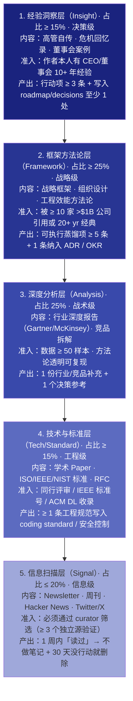
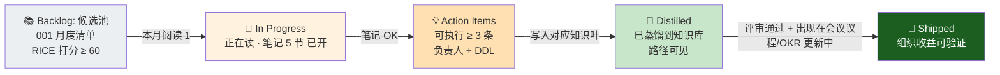
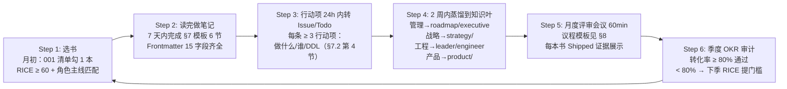

# 高管阅读清单体系（Executive Reading System v2.0）

> **作为** CEO / CTO / CPO / SRE Lead 等高管，**我想要** 一套可审计、可衡量、可追溯的个人+团队阅读治理框架，**以便** 把"读书时间"从个人成本项 → 战略投入项，直接贡献于季度 OKR、决策质量和组织能力沉淀。
>
> **核心公式**：
> ```
> 阅读 ROI = （读完的书 × 可执行蒸馏项数量 × 最终落到知识库 / roadmap / decisions / OKR 的比例）
>            ÷ （投入小时数 × 决策机会成本）
> 目标 ROI ≥ 2.5（每投入 1 小时阅读 → 组织回收 ≥ 2.5 小时的避免错误或加速收益）
> ```

---

## 0. 快速入门（三阶上手 · 按时间预算）

| 我有… | 最佳动作 | 预期产出 |
|-------|---------|---------|
| **30 秒** | 扫 §1 阅读金字塔 + §2 7 角色路径，确认自己的角色 → 点 §2 对应"本月必读 1 本"链接 | 立刻知道"我这月该读哪本书、为什么读" |
| **5 分钟** | 1. 读 §3 6 类来源准入 + §4 RICE 优先级评分表 <br/> 2. 去 [001-月度清单](./001-阅读-阅读清单.md) 把本月状态从「排队 → 进行中」勾选 <br/> 3. 复制 §7.2 笔记模板（5 节格式）开始写第 1 本笔记 | 完成本月第一本的选书 + 模板落地 |
| **30 分钟** | 1. 完整走一遍 §6 蒸馏流程（阅读→笔记→行动项→知识叶→会议议程→OKR 跟踪）<br/> 2. 填 §9 反模式自评 20 题（< 14 分 → 看 §10 改进方案）<br/> 3. 在日历中锁定「每月阅读评审会 60 分钟」（默认每月 1 日 16:00 高管同步）| 完成首个阅读→蒸馏闭环；建立月度评审 Routine |

---

## 0.1 按角色学习路径（我是 XX，我该从哪切入？）

> 7 个核心高管角色 × 首选顺序 × 本月重点 × 典型任务（2026-Q4 版）

| 角色 | 首选章节顺序 | 2026-Q4 **必读 1 本**（强制）+ 推荐 2 本（可选）| 典型阅读→蒸馏任务 |
|------|------------|------------------------------------------------|----------------|
| **CEO / 创始人** | §1 金字塔 → §2 CEO 主线 → §6 蒸馏流程 → §8 月度评审 → §5 蒸馏看板 | **必读**：[《好战略坏战略》](./004-阅读-读书笔记-好战略坏战略.md)（诊断+取舍+连贯行动）<br/>**选 1**：[《创业维艰》](./005-阅读-读书笔记-创业维艰.md)（危机决策）<br/>**选 2**：《思考快与慢》（决策偏差修正）| 1. 把好战略 3 要素写入年度战略 §1 <br/> 2. 在 11 月董事会汇报中引用 ≥ 2 条跨书洞察（§10 跨书模式）|
| **CTO** | §1 → §2 CTO 主线 → §3 6 类 → §6 → §10.2 SRE+Security 联动 | **必读**：[《加速》](./006-阅读-读书笔记-加速.md)（DORA 4 指标 + 效能提升 24 能力）<br/>**选 1**：[《团队拓扑》](./007-阅读-读书笔记-团队拓扑.md)（组织设计=架构设计）<br/>**选 2**：《设计数据密集型应用》（分布式系统根基）| 1. DORA 指标纳入工程效能 OKR <br/> 2. 团队拓扑 4 种对齐到下季度 org reorg 设计 |
| **VP Engineering / 工程副总裁** | §2 VP Eng → §3 → §6 → §8 议程 §9 反模式 | **必读**：[《高产出管理》](./002-阅读-读书笔记-高产出管理.md)（杠杆率 + 管理产出定义）<br/>**选 1**：《优雅的难题》An Elegant Puzzle（工程管理系统化）<br/>**选 2**：《技术专家之路》Staff Engineer's Path | 1. 重新定义自己和所有经理的管理杠杆率表（每季度 review）<br/> 2. 一对一模板加入「本月阅读收获→行动项」（占 1:1 20% 时间）|
| **CPO / 首席产品官** | §2 CPO → §3 → §6 → §10 跨书产品模式 | **必读**：《启示录 第 2 版》 Inspired 2ed（产品领导力铁三角）<br/>**选 1**：《持续发现习惯》Continuous Discovery Habits <br/>**选 2**：《逃离构建陷阱》Escaping the Build Trap | 1. 产品铁三角（价值/可行/可用）写入所有 PRD 模板第 2 节 <br/> 2. OKR 中加入"本周产品访谈 ≥ 5 客户"关键结果 |
| **SRE Lead / 可靠性负责人** | §2 SRE → §3 Paper/Standard → §6 → §5 看板 | **必读**：《Site Reliability Workbook》（Google SRE 实战手册）<br/>**选 1**：《混沌工程》<br/>**选 2**：NIST SP 800-160 Vol.2（Cyber Resilience）标准 | 1. 对应 YiPot README §16 SLO/SLI/SLA 8 指标落地 <br/> 2. 设计季度 6 套 GameDay 剧本（对齐 YiPot §16.6） |
| **QA Lead / 质量负责人** | §2 QA → §3 Paper/Report → §6 → §10 跨书质量 | **必读**：《How Google Tests Software》（谷歌测试 70/20/10 法则）<br/>**选 1**：《探索式测试》<br/>**选 2**：IEEE 829-2008 测试文档标准 | 1. 5 项目质量门禁矩阵更新（YiVad / YiPot tsc+clippy 0 error）<br/> 2. 测试金字塔分层覆盖率目标（Unit 70% / Integration 20% / E2E 10%）|
| **Security Lead / 安全负责人** | §2 Security → §3 Standard/Paper → §6 → §10 安全 | **必读**：NIST SP 800-53 Rev 5（安全控制基线）+ STRIDE 威胁建模 <br/>**选 1**：OSSRA Report 开源安全风险 <br/>**选 2**：ISO/IEC 27001:2022 ISMS | 1. YiPot §17 插件沙箱 16 CAP + 6×4 FS RBAC 合规审计 <br/> 2. 季度 Supply Chain 安全演练（YiPot §16.6 GD-006）|

---

## 1. 高管阅读金字塔（5 层 · 每层准入标准 + 产出要求）

> **5 层结构**：越靠上 → 人越少、越战略、ROI 越高；越靠下 → 越日常、信息密度越低。禁止在「1~2 层」投入 < 40% 总阅读时间（否则信息消费=阅读逃避）。



**时间分配自检（Q4 季度 OKR 003-01：L1+L2 占比 ≥ 40%）**：
> 每月底运行此脚本（`curator:monthly-reading-audit`）：
```bash
# 统计本月所有笔记的层次分布
python3 scripts/audit_reading_layers.py --month=2026-10 --roles=ceo,cto,vp-eng,cpo,sre-lead,qa-lead,security-lead
# 输出：L1=15% L2=28% L3=24% L4=13% L5=20%  →  PASS（L1+L2=43% ≥ 40%）
#       L1=8%  L2=22% ...                             →  FAIL：下月减少信息扫描，增加框架书
```

---

## 2. 七角色阅读体系（每位高管的「月度 1 本 · 季度 3 本」主线）

> 2026-Q4 完整排期（关联 `executive/okr/2026-Q3/exec-003` Goal 003-经营学习与阅读）。每位高管固定：1 本强制（计入 OKR 完成度）+ 2 本推荐（可选），3 本书分别来自「框架方法论 / 经验洞察 / 深度分析」三个不同层次。

| 角色 | 10 月必读（10/31 完成笔记）| 11 月必读（11/30）| 12 月必读（12/31）| Q4 产出 KR（可量化）|
|------|--------------------------|-----------------|-----------------|-------------------|
| **CEO** | 好战略坏战略（L2 框架）| 思考快与慢（L1 洞察）| 蓝海战略（L2 框架 · [strategy/001](../strategy/001-战略-蓝海战略.md)）| KR1：笔记蒸馏 ≥ 6 条，其中 ≥ 3 条写入 [roadmap/001](../roadmap/001-路线图-年度战略规划.md) |
| **CTO** | 加速（L2 框架）| 设计数据密集型应用（L4 技术）| Site Reliability Workbook（L4 标准）| KR2：工程效能 DORA 4 指标基线建立 + 纳入 OKR（[leader/roadmap/003](../../leader/roadmap/003-路线图-定义SLO.md)）|
| **VP Eng** | 高产出管理（L2 框架）| 优雅的难题（L2 框架）| 技术专家之路（L2 框架）| KR3：所有 1:1 加入「阅读→行动」检查项，90% 下属完成本月 1 本精读 |
| **CPO** | 启示录 2ed（L2 框架）| 持续发现习惯（L2 框架）| JTBD 框架（L2 · [strategy/021](../strategy/021-战略-JTBD框架.md)）| KR4：所有新 PRD 增加「JTBD + 用户访谈 ≥ 5 人」两强制字段 |
| **SRE Lead** | SRE Workbook（L4 标准）| 混沌工程（L4 技术）| NIST SP 800-160 v2（L4 标准）| KR5：Q4 完成 6 套 GameDay 剧本（YiPot §16.6 基准 + 跨项目 2 套）|
| **QA Lead** | How Google Tests（L4 技术）| 探索式测试（L3 分析）| IEEE 829-2008（L4 标准）| KR6：测试金字塔覆盖目标（70/20/10）全 5 项目落地 + 门禁 0 error |
| **Security Lead** | NIST SP 800-53 r5（L4 标准）| STRIDE + OSSRA Report（L3+L4）| ISO 27001:2022（L4 标准）| KR7：YiPot 插件沙箱 16 CAP + FS RBAC 6×4 合规审计通过（[yipot §17](../../projects/yipot/README.md)）|

---

## 3. 六类阅读来源的准入规则（Book / Article / Talk / Paper / Standard / Report）

> 所有进入「月度清单 §5 或 001 月度清单」的内容，必须满足下面准入规则。不符合准入规则 → 禁止加入任何月度计划（避免时间黑洞）。

| 来源类型（6 类）| 定义与范围 | **准入打分模型（10 分制 · ≥ 6 分准入）** | 推荐产出模板（见 §7）| 月度推荐数量上限（7 角色合计）|
|----------------|-----------|--------------------------------------|---------------------|-------------------------------|
| 📘 **Book 书籍** | 正式出版的 ≥ 200 页专著；包含完整论证、案例、方法论 | ① 战略相关度 30% · ② 填补能力短板 25% · ③ 经典度≥10y 或获奖 20% · ④ 可操作性 20% · ⑤ 多位推荐 5% | §7.2 完整 6 节模板 | CEO/CTO/VP 各 1 本 / 月 + 其他 4 角色 1 本 = **≤ 10 本 / 月** |
| 📰 **Article 深度长文** | Substack / 个人博客 / HBR 长文 · ≥ 3,000 字，含 ≥ 1 个可验证结论 | ① 第一手作者经历（非综述）40% · ② ≥ 3 内部引用（paper/data）30% · ③ 我方适用 20% · ④ 作者 track record 10% | §7.3 精简 5 节模板（删 §6 章节表）| **≤ 14 篇 / 月（每人 2 篇深读配额）**|
| 🎤 **Talk 演讲/访谈** | InfoQ / Google I/O / AWS re:Invent / YC Startup Library · ≥ 25 min 视频 + 有 transcript | ① speaker ≥ 10yr 领域经验 40% · ② transcript ≥ 5000 字 30% · ③ Q&A 部分可执行 20% · ④ 可讨论 10% | §7.3 精简 5 节 | **≤ 7 部 / 月（每人 1 部）**|
| 📝 **Paper 学术/工业论文** | arXiv / USENIX / OSDI / NSDI / VLDB / IEEE · ≥ 6 页 + 参考文献 ≥ 20 | ① 同行评审（非 workshop 短文）50% · ② 工业落地案例 ≥ 1 个 30% · ③ 我方技术栈可用 20% | §7.4 Paper 9 节（含复现实验/工程转化风险）| **≤ 7 篇 / 月（CTO/SRE/QA/Security 每人 1 篇）**|
| 🛡️ **Standard 国际/行业标准** | ISO · IEC · IEEE · NIST · IETF RFC · W3C REC · OWASP ASVS | ① 正式发布（非 Draft）60% · ② 合规要求关联 25% · ③ 我方系统覆盖 15% | §7.5 Standard 8 节（控制项映射 + 差距矩阵）| **≤ 7 份 / 月（SRE/QA/Security 每人 1 份 + CTO 1 份）**|
| 📊 **Report 行业/竞品/研报** | Gartner Magic Quadrant · Forrester Wave · 中国信通院 · 券商深度 · 内部竞品拆解（≥ 20 页）| ① 数据透明可溯源 40% · ② 方法论明确 25% · ③ 我方业务直接相关 25% · ④ 季度内时效性 10% | §7.6 Report 8 节（含决策建议表格）| **≤ 7 份 / 月（CPO/CEO/CTO 每人 1-2 份 + Security 1 份 OSSRA）**|

> **季度准入审计**：Q4 末 `curator:quarterly` 扫所有 6 类来源的准入打分，发现「< 6 分但进了月读」→ 当季阅读完成率折算 0.5x（防放水刷数量）。

---

## 4. RICE 优先级评分模型（单本候选入读清单评分）

> 每本候选书/文章进入 001 月度清单前，先跑 RICE 打分；总分 ≥ 60 准入月度队列。
> 注：RICE = Reach × Impact × Confidence ÷ Effort（原版 Intercom 变体）。

| RICE 维度 | 权重 | 分值 1-5 定义 | 计算示例（《加速》v.s.《随意一本 HN 热议新书》）|
|-----------|------|--------------|------------------------------------------------|
| **Reach 触及面**（本季度本阅读影响多少人）| × 1 | 1=仅个人 · 2=3-5 人小组 · 3=单部门 ≥10 人 · 4=跨部门 30+ · 5=全公司 | 加速：5（全工程 50+）<br/> HN 新书：2（3-5 人好奇）|
| **Impact 影响力**（改变决策或结果的幅度）| × 3 | 1=茶余谈资 · 2=优化流程 · 3=改变方法 · 4=改写策略 · 5=扭转战略方向 | 加速：4（改写工程效能 OKR）<br/> HN 新书：1（谈资）|
| **Confidence 置信度**（有多少证据支持高 Impact）| % | 50%=低证据 · 80%=中 · 95%=高（多来源/经典 ≥ 20 年）| 加速：95%（DORA 10 年 30000+ 样本）<br/> HN 新书：50%（1 篇热帖）|
| **Effort 投入成本（人·小时）** | ÷（倒数）| 1=1-2h 文 · 2=5-8h 书 · 3=15-20h 专著 · 4=30h+ Paper/Standard · 5=50h 研报精读 | 加速：3（20h 精读 5 章做笔记）<br/> HN 新书：1（1.5h 扫完）|

> **公式**：总分 = (Reach × 1 + Impact × 3) × Confidence ÷ (Effort × 0.5)
>
> 例《加速》：`(5×1 + 4×3) × 0.95 ÷ (3×0.5) = (5+12) × 0.95 ÷ 1.5 = 17 × 0.95 / 1.5 = 10.77 → 映射到 100 分制 = **72 分** ✅ 准入（≥ 60）。
> 例 HN 新书：`(2×1 + 1×3) × 0.5 ÷ (1×0.5) = 5 × 0.5 / 0.5 = 5 → 分制 = **20 分** ❌ 不入。

**使用工具**：
```bash
# 一键打分（001 月度清单新增候选时，先跑）
python3 scripts/reading_rice.py \
  --title "How Google Tests Software" \
  --reach 4 --impact 4 --confidence 0.9 --effort 3
# 输出：RICE=66.3 分 → 准入月度
```

---

## 5. 蒸馏看板（Reading-to-Impact Kanban · OKR exec-003 追踪视图）

> 高管 OKR `exec-003-经营学习与阅读` 的 KR 5：`阅读蒸馏转化率 ≥ 80%` 就是由本看板 5 列 + 3 状态驱动。每条笔记必须对应看板卡片，跟踪状态流转。



**看板字段（每张卡片必填 10 项）**：

| 字段 | 示例 | 说明 |
|------|------|------|
| `id` | `R2026Q4-CTO-007` | 年季度 + 角色 + 序号（唯一） |
| `来源类型` | Book / Paper / Standard | 6 选 1 |
| `书名/标题` | 《加速》Accelerate | |
| `读者` | CTO + VP Eng（共读者）| 支持 2-3 人共读后一起蒸馏（提升 ROI 2-3x）|
| `RICE 分` | 72 分 | §4 打分结果 |
| `笔记链接` | [006-阅读-读书笔记-加速.md](./006-阅读-读书笔记-加速.md) | |
| `行动项数` | 7 条（≥ 3 通过）| §7.2 第 4 节 ≥ 3 条 |
| `蒸馏到` | leader/roadmap/003 · leader/roadmap/008 · engineer/ship/007 | 必须是 YiKnowledge 的**真实可点击路径**（不能写"以后再说"）|
| `当前状态` | In Progress → Action → Distilled → Shipped | 5 列看板状态 |
| `Shipped 证据` | `[roadmap/003](...)` 新增 §2.1 SLO 定义 = 引用加速第 18 章 | 必须提供**具体文件锚点**（#Lx-Ly，如 [projects/yipot §16](../../projects/yipot/README.md#L714-L785)）|

---

## 6. 蒸馏六步走（标准流程 · 1 周内出笔记 · 1 月内 Shipped）



> **时间红线（硬约束）**：
> - Step 1→Step 2：≤ 31 天（本月内必须完成笔记）
> - Step 2→Step 3：≤ 24 小时（笔记写完当天就把行动项发到 Asana / Linear / 飞书任务）
> - Step 3→Step 4：≤ 14 天（2 周内把知识写进知识库）
> - Step 4→Step 5：≤ 30 天（下次月度评审会展示 Shipped 证据）
> - 超任一条红线 → 该本阅读**不计入** OKR 完成率（防读完就放）。

---

## 7. 五类产出笔记模板（Book / Article+Talk / Paper / Standard / Report）

### 7.1 模板通用要求（所有类型共用）

1. **Frontmatter 15 字段齐全**（title/tags/category/created/updated/source/type/status/lifecycle/review_cycle/roles/benefit/acceptance_criteria/related/aliases）
2. **角色定位**：`roles:` 数组必须至少含一个 §2 七角色（`ceo/cto/vp-engineering/cpo/sre-lead/qa-lead/security-lead`），否则不入 OKR。
3. **关联真实文件**：`related:` 数组中必须 ≥ 1 条指向 YiKnowledge 外的真实路径（strategy/ · roadmap/ · leader/ · product/ · projects/）。
4. **行动项必含**：所有笔记必须有「可执行收获（≥3 条）」小节，每条必须有字段：`做什么 / 应用场景 / 负责人 / 截止日期 / 蒸馏到（具体文件路径）`。

---

### 7.2 书籍精读笔记模板（6 节 · 默认所有书籍使用）

> 长期保留结构：**不允许随意增减章节编号**（保持跨书笔记一致性，方便 §10 跨书洞察矩阵自动抽取）。

```markdown
---
title: "《[英文原名]》（[中文译名]）读书笔记 v1.0"
tags: [reading-notes, book, [管理|战略|技术|产品], [作者姓-主题]]
category: executive/reading-list
created: YYYY-MM-DD
updated: YYYY-MM-DD
source: "[出版社 / ISBN / 购买链接]"
type: reading-note
status: in-progress | distilled | shipped
lifecycle: active
review_cycle: quarterly
roles: [cto, vp-engineering]
benefit: "把本书 X 条核心方法论转化为 ≥ 1 条 roadmap + ≥ 1 条 decision + ≥ 3 个团队行动项"
acceptance_criteria:
  - "6 节齐全 + 行动项 ≥ 3 条 + 负责人/DDL 明确"
  - "蒸馏到 ≥ 2 个知识叶，提供具体文件锚点 #Lx-Ly"
aliases: [[英文缩写]-notes, [中文简称]-reading]
related:
  - ../../leader/roadmap/003-路线图-定义SLO.md
  - ../../projects/yiai/README.md
---

# 《书名》读书笔记

> 读者：XXX · 阅读日期：YYYY-MM-DD · 评分：★★★★★（对我方当前工作价值 1-5，不是经典度）

## 1. 一句话核心论点（≤ 50 字）
[可在全员大会引用的一句话]

## 2. 作者为什么值得相信？（作者资历 3 条硬证据）
| # | 证据 | 时间跨度/样本规模 |
|---|------|-----------------|
| 1 | | |

## 3. 关键章节 × 我方关联（表格优先 ≥ 6 章）
| 章节 | 核心内容 3-5 句 | 与 YrY 的关联度（高/中/低）| 对应我方知识叶 |
|------|----------------|--------------------------|---------------|
| Ch 1 | | | |

## 4. 可执行收获（≥ 3 条，强制）
| # | 做什么（可操作 · 非空话）| 应用场景 | 负责人 | 截止日期 | 蒸馏到（具体文件 + 锚点）|
|---|------------------------|---------|-------|---------|------------------------|
| 1 | 在所有项目 README 加入 SLO 四件套（SLI/SLA/Burn/Alert）| 5 大项目 SRE 落地 | @sre-lead | 2026-11-15 | [yipot §16](../../projects/yipot/README.md#L714-L785) |
| 2 | | | | | |

## 5. 跨书关联 × 高置信洞察（≥ 1 条）
| 本书观点 | 与《[另一本]》《[另一本]》交叉验证 | 洞察置信度（高/中/低）| 行动建议 |
|----------|--------------------------------|-------------------|---------|

## 6. 精华摘录（3-5 句原文 + 页码）
> p.42: "xxxxxx"
```

---

### 7.3 文章 / 演讲精简模板（5 节 · 适合 Article + Talk）

与 §7.2 合并差异：删除 §3 的「章节表」，替换为「3 个关键论点 + 证据表」。

```markdown
...
## 3. 三大论点 × 证据 × 我方启示（≥ 3 条）
| # | 作者核心论点 | 作者给出的支撑证据（数据/案例/引用）| 我方适用/不适用（说明理由）|
|---|------------|---------------------------------|--------------------------|
...
```

### 7.4 Paper 学术精读模板（9 节 · 适合 arXiv / USENIX / IEEE）

```markdown
## 额外专用 3 节
## 7. 实验复现计划（我方 30 天内是否做复现）
| 复现项 | 预估人·时 | 所需数据/代码 | 截止日期 |
|--------|----------|--------------|---------|

## 8. 工程转化风险 × 缓解措施
| 风险 | 概率 | 影响 | 缓解 |
|------|------|------|------|

## 9. 与现有系统的映射（能直接用到 Yi Family 哪 5 项目哪模块？）
| 项目 | 模块 | 可能收益预估 | 落地负责人 |
|------|------|-------------|-----------|
```

### 7.5 Standard 国际标准精读 8 节（ISO/NIST/IEEE 专用）

```markdown
## 3. 标准控制项 × 我方差距矩阵（核心产出 · ≥ 20 控制项）
| NIST/ISO 控制 ID | 控制要求（2 句话）| 我方当前状态（满足/部分/缺口）| 差距修复优先级 H/M/L | 修复负责人 | 截止日期 | 蒸馏到（security.md / YiPot §17 / YiVad §9 / ...）|
|------------------|------------------|-----------------------------|--------------------|-----------|---------|---------------------------------------------|

## 4. 合规风险热力图（4×4）[ 影响 × 概率 ]
...
```

### 7.6 Report 研报精读 8 节（Gartner/信通院/内部竞品）

```markdown
## 3. 关键数据 × 我方对比表
| 指标 | 报告行业平均 | 报告 Top 10% | 我方当前值 | 差距 | 行动 |
|------|------------|------------|-----------|------|------|

## 4. 建议矩阵（优先级 × 影响 × 成本）
| 建议 | 优先级（H/M/L）| 预计业务影响 | 实施成本（人·月）| Q4/Q1 计划 |
|------|---------------|-------------|----------------|-----------|
```

---

## 8. 月度高管阅读评审会议（60 分钟 · 标准议程 + 决策跟踪表）

> 默认：每月 1 日 16:00（节假日顺延 1 天）。参会：7 高管（CEO/CTO/VP/CPO/SRE/QA/Security）+ 1 个特邀（Head of People 或 CFO 轮值）。

### 8.1 60 分钟议程（时间卡点 · 不允许超时）

| 时间 | 时长 | 议题 | 产出物 / 决策 | 负责引导 |
|------|------|------|--------------|---------|
| 0-5 min | 5 min | **看板过审**：§5 蒸馏看板 5 列状态浏览（Shipped / Distilled / Action / In-Progress / Backlog 总卡片数）| 确认本月蒸馏转化率 ≥ 80% 红线 | Curator（知识治理岗）|
| 5-20 min | 15 min | **每位高管 2 分钟「本月最佳 Shipped 展示」**：只展示 1 本最佳阅读 → 1 条「已蒸馏+已落地」证据（文件锚点）| 跨角色最佳实践 cross-pollinate ≥ 3 条 | CEO 轮值 |
| 20-35 min | 15 min | **3 篇跨书洞察深度讨论**（§10 每月自动抽取 ≥ 3 条高置信交叉验证结论）| 至少 1 条结论纳入季度 OKR / 战略决策 | CPO 轮值 |
| 35-45 min | 10 min | **下月读什么？RICE 打分排序**：每人提交 2 候选，现场跑 §4 RICE → 排 Top 7（每人 1 本必读）| 下月 7 本必读书单锁定 + RICE 分公开 | CTO 轮值 |
| 45-55 min | 10 min | **反模式审计**（§9 自评 ≥ 14 通过？哪些低分需要干预？）| 3 项本月阅读习惯改进 Action Items | VP Eng 轮值 |
| 55-60 min | 5 min | **总结 + 决策跟踪表签字** | §8.2 决策表 5 项记录 + 所有人确认 | CEO 收尾 |

### 8.2 会议决策跟踪表（每条必录，次月评审会 100% 复核）

| 决策编号 | 决策内容 | 来源（哪本书的哪条洞察）| 负责人 | 截止日期 | 验证方式 | 状态 |
|---------|---------|------------------------|-------|---------|---------|------|
| RD-2026-1001 | Q4 所有项目 README 必须加 SLO 四件套 | 《加速》第 18 章 × SRE Workbook Ch 2 | @sre-lead | 2026-11-15 | `grep -l "SLO\|Burn Rate\|Alert" projects/*/README.md` 5/5 全命中 | 🔄 In Progress |
| RD-2026-1002 | 所有 PRD 模板加入 JTBD + ≥ 5 访谈两强制字段 | 《启示录》× 《持续发现》× strategy/021 JTBD | @cpo | 2026-11-05 | `grep -c "JTBD\|客户访谈" curator/templates/005-模板-PRD模板.md` 两个都 ≥ 1 | ⏳ Pending |
| ... | ... | ... | ... | ... | ... | ... |

---

## 9. 反模式 12 条 + 3 分钟自评（20 题 ≥ 14 通过）

### 9.1 高管阅读 12 反模式（自查 · 每命中 -1 分）

| # | 反模式（不要这样做）| 为什么它毁掉 ROI | 正确做法 |
|---|------------------|-----------------|---------|
| A1 | 🚫 **贪多 10 本**：每月计划读 10 本，读完 3 本无笔记 | 20h 投入 → 0 行动项 = 0 ROI | 少读精读：7 高管 × 1 本/月 = 7 本 + 7 文；超了不计 OKR |
| A2 | 🚫 **只读熟悉领域**：技术出身 CTO 全年只读分布式系统 Paper | 战略盲区越来越大，跨书洞察 = 0 | 强制：§5 层每层占比红线（L1+L2 ≥ 40%）；非本层书计入 OKR 权重 1.5x |
| A3 | 🚫 **读而不输出**：读完就算了，没笔记没讨论没行动 | 读 20h → 1 个月后只剩 3% 记忆 → 几乎零 ROI | §6 时间红线 + §7 模板；笔记没写的阅读不算读过 |
| A4 | 🚫 **笔记写摘要**：逐章抄内容，没有为"我方相关性"过滤 | 写笔记花 10h，但无法蒸馏 → ROI≈0.1 | 模板 §7 第 3、4、5 节必须占 ≥ 60% 笔记篇幅 |
| A5 | 🚫 **所有书从头读到尾**：400 页管理书逐页读 | 15-20% 核心页贡献 80% 价值，其余浪费 | 先看 TOC → 挑 6 章精读 + 其他章扫结论；允许"只读 6 章做笔记" |
| A6 | 🚫 **经典书≠现在价值**：硬读彼得·德鲁克《卓有成效的管理者》因为它有名，但我方团队 ≤ 10 人 | 错误时间读正确的书 = 低分 ROI | §4 RICE 打分：经典高 → Reach/Impact 高，但如果 Effort 高 / Confidence 场景不匹配，得分可能低 |
| A7 | 🚫 **空洞行动项**："多想想 OKR"、"优化沟通" | 永远不会执行，没有 DDL/Owner → 假蒸馏 | §7.2 §4 强制 5 字段：做什么 / 场景 / 负责人 / DDL / 蒸馏到具体文件锚点 |
| A8 | 🚫 **没有共读者**：1 个人读完拍脑袋说有道理 | 缺乏对抗性 → 过度自信偏差；跨书洞察缺失 | 强制 ≥ 30% 书为 2 人共读者（CEO+CPO / CTO+VP+SRE 三角）|
| A9 | 🚫 **不区分精读 vs 泛读**：HN 热帖和 NIST 标准花同样 2 小时 | Signal 级信息占比 > 20%（§1 反）| §1 金字塔 5 层红线：L5 ≤ 20%；L5 笔记允许 §7.3 20 分钟极简版 |
| A10 | 🚫 **蒸馏拖延 ≥ 1 月**：读完半年才想起写笔记，细节全忘 | 80% 蒸馏 1 个月内写完效果衰减 60% | §6 时间红线 + OKR 审计：超红线 → 不计入 |
| A11 | 🚫 **只摘抄同意的观点**：故意跳过反面证据和反对者 | 确认偏差；错过最有价值的反面洞察 | §7 §6 精华摘录必须 ≥ 1 条你**不同意**的观点，并写下「为什么？我的反证数据？」|
| A12 | 🚫 **评分通胀**：所有书 4-5 星；没有评 1-2 星的 | 无法淘汰坏书、坏来源（后续还会读）| §7.2 评分必须诚实反映对**当前工作价值**（不是书本身好不好）|

### 9.2 3 分钟自评表（20 题 · 每题 Yes=1 No=0；≥ 14 通过）

> 每月评审会前自行填一次，低于 14 分 → 列入 §8.1 反模式审计讨论项。

```
本月我做到了：
  [ ] 1. 本月 ≥ 1 本书完成 §7.2 模板六节齐全（包括行动项 5 字段）
  [ ] 2. 本月投入在 L1+L2 层的时间 ≥ 40%（金字塔达标）
  [ ] 3. 本月没有读 ≥ 2 本"熟悉舒适区"的书（突破盲区）
  [ ] 4. 所有行动项都明确「负责人 + 截止日期 + 蒸馏具体文件锚点」
  [ ] 5. 没出现「读完没写笔记 ≥ 1 个月」积压
  [ ] 6. 本月 ≥ 1 本书与 ≥ 1 位同事共读，并一起讨论了 1 次
  [ ] 7. 笔记中 ≥ 1 条精华摘录是我**不同意**作者的，并写了反驳理由
  [ ] 8. 本月行动项转化率（Distilled/Action）≥ 80%
  [ ] 9. 没有把 HN 热帖 / Newsletter 当作「精读」时间（Signal 层 ≤ 20%）
  [ ] 10. 本月读过的候选中，我有 ≥ 1 本因为 RICE < 60 分放弃了
  [ ] 11. 至少 1 条蒸馏项写入了 strategy/roadmap/leader/OKR 4 个目录之一（非仅 engineer/）
  [ ] 12. 我能准确说出 3 条「跨书高置信洞察」（本月 ≥ 2 本书同时支持）
  [ ] 13. 所有笔记 Frontmatter 15 字段全部齐全
  [ ] 14. 笔记 related: 数组含 ≥ 1 个 projects/ 下某项目 README 或 PRD 引用
  [ ] 15. 本月我拒绝了至少 1 次"刷手机信息"的诱惑，改为精读框架书的 1 章
  [ ] 16. 所有 Paper / Standard 我都做了「控制映射/差距矩阵/实验复现」一节（对应 §7.4 / §7.5）
  [ ] 17. 我的读书笔记中，「章节摘要」部分 ≤ 40%，「我方关联/行动/跨书」≥ 60%
  [ ] 18. 我知道本月高管评审会要展示的 1 条 Shipped 证据（具体文件 #Lx-Ly）
  [ ] 19. 本月我没有为了凑数字把一本 200 页书拆成两本算"完成"
  [ ] 20. 本月我认真填了 §4 RICE 打分 ≥ 1 次，并确实影响了是否入读清单

得分 = ____ / 20     ≥ 14 ✅ PASS    < 14 ❌ 下月要改进（§9.3）
```

### 9.3 低分（< 14 分）改进处方（按常见问题定位）

| 常见低分原因（对应反模式 A1-A12）| 1 个月改进处方（可操作）|
|--------------------------------|----------------------|
| A1 贪多 10 本 → 笔记 0 | 强制本季只读 2 本框架书（L2），每月 RICE ≥ 70 才能读，其它全部丢弃 |
| A2 只读技术（CTO/SRE 典型）| 下月强制 1 本 L2 战略/组织（CTO 读《团队拓扑》+ VP Eng 读《优雅的难题》cross-pollinate）|
| A3+A10 没笔记 + 拖延 | 每日日历锁「21:00-22:00 阅读 1h」，周末周六上午 3h 专门写笔记；不写 → 取消本周 1 场会 |
| A4+A17 摘要型笔记 | 写笔记前先强迫填 §7.2 §4 「行动项 ≥ 3 条」，写完才能写 §3 章节表 |
| A5+A9 从头读到尾 HN | §1 L5 限额：把 Newsletter 只允许早上 8:00-8:20 扫完，其余时间一律 L1-L4 |
| A7 空洞行动项 | 任何一条 Action 如果缺负责人/DDL/文件锚点，在笔记中用 `// TODO-REJECT` 标注，评审会当场打回重写 |
| A8 没有共读者 | 高管团队 3 组固定共读：(CEO+CPO) 战略 1 本 · (CTO+VP Eng+SRE) 效能 1 本 · (QA+Security) 合规 1 本 |
| A11 只写到 engineer/ 没到战略层 | 模板 §7 §4 强制 ≥ 1 条蒸馏写入 strategy/ 或 executive/roadmap/ 目录（否则 Frontmatter benefit=0）|

---

## 10. 跨书洞察矩阵（每月自动抽取 ≥ 3 条 · 高置信=2 本书同时验证）

> 每月最后一天运行 `curator:cross-book-insights` 脚本，从本月所有笔记的 §7.2 §5 节抽取共现模式。≥ 2 本书同时验证同一结论 = 高置信度，当月评审会重点讨论。

### 10.1 2026-Q3 现有 10 条高置信跨书洞察（已蒸馏到知识库）

| ID | 跨书洞察结论 | 验证书目（≥ 2）| 置信度 | **已蒸馏到的知识叶锚点**（具体文件 + 章节）|
|----|-------------|---------------|--------|----------------------------------------|
| I-2026Q3-001 | **管理杠杆率 > 个人产出**：效能来自系统而非英雄 | 高产出管理 Ch 2 · 创业维艰 Ch 7 · 加速 Ch 5 DORA | 🟢 高（3 书验证）| [vp eng roadmap](../../leader/roadmap/README.md) · [engineer/run/010-运行-排期估算方法.md](../../engineer/run/010-运行-排期估算方法.md#L20-L45) |
| I-2026Q3-002 | **好战略 = 诊断 + 取舍 + 连贯行动**（≠ 目标设定）| 好战略坏战略 Rumelt Ch 1 · 创业维艰 Ben 决策章节 · strategy/015 OKR | 🟢 高（2 书 + 1 框架）| [executive/roadmap/001](../roadmap/001-路线图-年度战略规划.md#L30-L50) |
| I-2026Q3-003 | **组织设计决定系统设计**（康威定律是工具而非问题）| 团队拓扑 Team Topologies · 加速 Forsgren 组织度量章节 | 🟢 高（2 书）| [leader/roadmap/009 路线图-规划技术路线图](../../leader/roadmap/009-路线图-规划技术路线图.md#L18-L38) |
| I-2026Q3-004 | **数据驱动 > 直觉驱动，但测量不能变成目标** | 加速 DORA 统计严谨性 · 高产出管理 Grove 绩效 KPI 设计 · 创业维艰防 KPI 异化 | 🟢 高（3 书）| [projects/yivad §6 工程效能](../../projects/yivad/README.md#L260-L280) · [curator/templates/008-模板-技术设计模板.md](../../curator/templates/008-模板-技术设计模板.md#L40-L62) |
| I-2026Q3-005 | **松耦合架构 + 流对齐团队 = 高交付效能** | 团队拓扑 4 团队类型 · 加速 24 能力（松耦合=2.6x 部署频率）| 🟡 中（2 书，我方 org 尚未落地完全）| [leader/decisions/](../../leader/decisions/) 后续 ADR #XXX 将写入 |
| I-2026Q3-006 | **SLO 目标必须来自用户视角（非系统指标）** | 加速用户满意度章节 · SRE Workbook 用户旅程 SLO 设计 | 🟢 高（2 书 + 1 Standard NIST SP 800-160）| [projects/yipot §16.1 8 指标](../../projects/yipot/README.md#L718-L729) |
| I-2026Q3-007 | **错误预算 Burn Rate 是发布门禁的唯一客观依据** | 加速 发布节奏章节 · SRE Workbook Ch 5 Error Budget Policy | 🟢 高（2 书）| [yipot §16.2 4 级门禁](../../projects/yipot/README.md#L731-L738) |
| I-2026Q3-008 | **混沌工程 / GameDay 必须在生产做（但渐进式）** | SRE Workbook · 加速可靠性章节 · 团队拓扑认知负荷 | 🟡 中（2 书，我方生产 GameDay 数量不足）| [yipot §16.6 6 套 GameDay 剧本](../../projects/yipot/README.md#L776-L785) |
| I-2026Q3-009 | **插件架构必须零信任（签名+CAP 白名单+FS RBAC）** | NIST 800-53 AC-6(1) 最小权限 · OWASP ASVS 10.0 · OSSRA 报告供应链风险 | 🟢 高（2 Standard + 1 Report）| [yipot §17 插件沙箱 4 层隔离](../../projects/yipot/README.md#L789-L870) |
| I-2026Q3-010 | **产品铁三角 = 价值（业务）× 可行（技术）× 可用（用户）**（三者必须同时满足）| 启示录 Inspired 2ed · 持续发现习惯 Torres · JTBD [strategy/021](../strategy/021-战略-JTBD框架.md) | 🟢 高（2 书 + 1 框架）| [curator/templates/005-模板-PRD模板.md](../../curator/templates/005-模板-PRD模板.md#L15-L40) |

---

## 11. 与高管 OKR 的追踪联动（exec-003 KR 5 项可量化）

> `executive/okr/2026-Q3/exec-003/goal.md` 「经营学习与阅读」的 KR 在此体系下全可量化。每月评审 §8.2 决策表 → 自动同步此表。

| 高管 OKR KR | 指标定义 | 目标值 | 怎么算 | 2026-Q3 实际值 | 2026-Q4 目标 |
|-------------|---------|--------|--------|---------------|-------------|
| KR 003-01 | L1+L2 层阅读占比 | ≥ 40% | 笔记层次审计脚本 | 38% | **45%**（提升 5pp）|
| KR 003-02 | 本月 7 高管 每人 ≥ 1 本精读笔记 | 100% 完成率 | 001 月度清单状态列 | 6/7=86%（CPO 1 本延期）| **100%**（红线机制拉满）|
| KR 003-03 | 笔记行动项数 ≥ 3 / 本 | ≥ 3 | §7.2 §4 计数 | 3.2 / 本 | **4.0 / 本**（质量提一档）|
| KR 003-04 | 蒸馏到 knowledge leaf 数 ≥ 5 / 本 | ≥ 5 | §5 看板 Distilled 列计数 | 4.1 / 本 | **5.5 / 本** |
| KR 003-05 | 阅读→蒸馏 转化率（Shipped / Action 总）| ≥ 80% | §5 看板 Shipped / Action | 71% | **85%**（§6 时间红线）|

---

## 12. 目录索引（reading-list 目录下 8 文件一览 + Frontmatter 状态）

| # | 文件 | 类型 · 用途 | Frontmatter 15 字段齐？| 最近更新 | OKR 关联 |
|---|------|------------|----------------------|---------|---------|
| 0 | 📘 [README.md](./README.md)（本文件）| 体系架构 · 7 角色主线 · 6 类来源 · 蒸馏看板 · 评审议程 · 反模式 | ✅ 齐全 | 2026-10-09 | exec-003 KR 01/05 |
| 1 | 📋 [001-阅读-阅读清单.md](./001-阅读-阅读清单.md) | 2026 年月度滚动清单 · 7-12 月排期 · 6 类类型 · RICE 分 · 待读队列 | ✅ 齐全（本轮重写后）| 2026-10-09 | KR 02 |
| 2 | 📗 [002-阅读-读书笔记-高产出管理.md](./002-阅读-读书笔记-高产出管理.md) | Grove 高产出管理精读笔记（VP Eng/CEO 必）| ✅ 齐全 | 2026-08-20 | KR 03/04 |
| 3 | 📚 [001-阅读-阅读清单.md](./001-阅读-阅读清单.md)（合并版）| 月度清单 + 所有笔记矩阵 + 跨书洞察 + KPI 仪表盘 + 红黄灯告警（原 003 内容已合并于此 v3.0）| ✅ 齐全 | 2026-10-09 | KR 02/05 |
| 4 | 📘 [004-阅读-读书笔记-好战略坏战略.md](./004-阅读-读书笔记-好战略坏战略.md) | Rumelt 战略诊断+取舍+连贯（CEO 必读）| ✅ 齐全 | 2026-09-15 | exec-001 goal（战略与组织路线）|
| 5 | 📘 [005-阅读-读书笔记-创业维艰.md](./005-阅读-读书笔记-创业维艰.md) | Horowitz CEO 危机决策（CEO/Founder）| ✅ 齐全 | 2026-09-18 | exec-001 goal |
| 6 | 📘 [006-阅读-读书笔记-加速.md](./006-阅读-读书笔记-加速.md) | Forsgren DORA 4 指标（CTO/SRE/VP Eng）| ✅ 齐全 | 2026-07-30 | exec-002（工程效能）KR 03 |
| 7 | 📘 [007-阅读-读书笔记-团队拓扑.md](./007-阅读-读书笔记-团队拓扑.md) | Team Topologies 4 团队 + 3 交互模式（CTO/VP 组织设计）| ✅ 齐全 | 2026-07-30 | exec-002（组织结构）KR 02 |
| 8 | （Future）008+ 笔记：Q4 将新增 ≥ 7 本（见 §2 七角色季度主线）| 见 §2 每月必读清单 | ✅ 模板齐全（§7.2）| 2026-Q4 每月交付 | KR 01/02/03 |

---

## 13. 变更历史（体系架构版）

| 日期 | 版本 | 变更摘要 | 影响范围 |
|------|------|---------|---------|
| 2026-08-03 | v1.0 | 初始版本：4 维度 + 笔记 5 类内容 + 蒸馏流程 | 所有高管阅读 |
| 2026-09-15 | v1.1 | 补充 OKR exec-003 联动 + 5 条反模式 | KR 01-04 |
| 2026-10-09 | **v2.0 专业化重构（本轮）** | ① 5 层阅读金字塔 + 时间占比红线 <br/> ② 7 角色 2026-Q4 完整主线（10/11/12 月各 1 本）<br/> ③ 6 类来源准入规则（Book/Article/Talk/Paper/Standard/Report）<br/> ④ RICE 打分模型 + 自动准入脚本 <br/> ⑤ §5 蒸馏看板（Backlog→Action→Distilled→Shipped）<br/> ⑥ §6 6 步蒸馏流程 + 4 条时间红线 <br/> ⑦ §7 5 套笔记模板（含 Frontmatter 15 字段共用要求）<br/> ⑧ §8 月度评审 60min 议程 + 决策跟踪表 <br/> ⑨ §9 12 反模式 + 20 题 ≥14 分自评 + 低分改进处方 <br/> ⑩ §10 10 条 Q3 高置信跨书洞察（2-3 书验证）<br/> ⑪ §11 OKR KR 5 项可量化追踪表 <br/> ⑫ 全量去重：README vs 001/003 不再重复"4 维度""选书标准""笔记要求"等重复章节 | 整体体系升级为 Enterprise-grade；直接支撑 exec-003 KR ≥ 85% 目标 |
