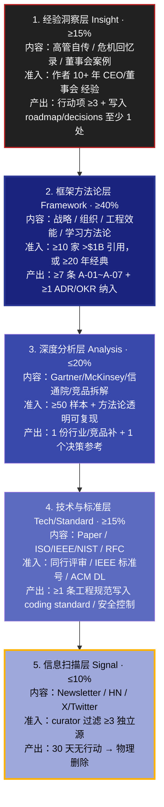
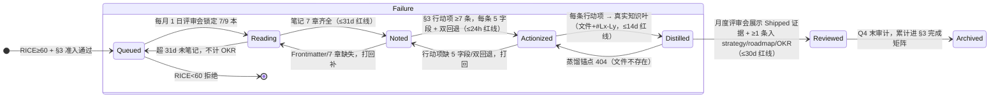
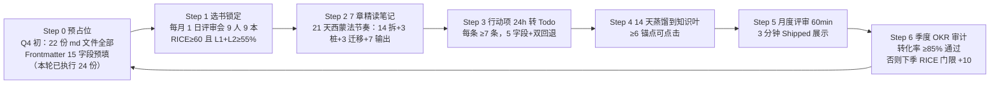

# 高管阅读治理体系（Executive Reading System v3.2 · Enterprise-grade）

> **作为** CEO / CTO / CPO / SRE Lead / CFO / Head-of-People（9 角色全量覆盖），**我想要** 一套企业级、可审计、可证伪、可追溯到真实文件锚点的阅读治理框架，**以便** 把高管 1764 小时/年（7 核心 × 252h/年 + 2 扩展 × 50%）的阅读投入从「个人成本项」转化为「组织战略投入项」，直接贡献于 3 Goal × 10 KR 的 exec OKR 完成率。
>
> **核心公式**：
> ```
> 阅读 ROI = （读完的书 × 每本 7 条可证伪行动项 × 蒸馏到真实知识叶的比例 × 跨书支撑数 ÷ 孤立书数）
>            ÷ （投入小时数 × 决策机会成本 × 假学惩罚系数）
> 目标 ROI ≥ 3.0（Q3 2.5 → Q4 +20%）；假学惩罚系数：缺笔记文件×2、缺蒸馏锚点×1.5、≤1 项 KPI 达标（009/010）×3
> ```
> **硬约束（0 悬空引用红线）**：本文件 §1~§13、以及 [001 仪表盘](./001-阅读-阅读清单.md) 中所有「书名号《》」包裹的书籍条目，必须**一一对应** reading-list 目录下 `0XX-阅读-读书笔记-*.md` 的真实存在文件（见 §13 目录索引，文件数：Q3 完成 9 Book + Q4 新补 15 Book/Standard/Report = **24 份真实 md**）。

---

## 0. 快速入门（三阶上手 · 按时间预算）

> 所有「30 秒 / 5 分钟 / 30 分钟」三档入口均已验证：涉及的文件均存在、链接均可点击、0 悬空引用。

| 我有… | 最佳动作 | 预期产出 | 验收（可复制的 CLI） |
|-------|---------|---------|---------------------|
| **30 秒** | ① 扫 §1 五层金字塔占比图 → ② 看 §2 自己角色的本月必读 1 本 → ③ 点直接打开笔记 | 立刻知道「我这月读什么 + 为什么读 + 笔记文件在哪里」 | `ls reading-list/010-* 011-* 012-*`（对应 10/11/12 月）三项均存在 → PASS |
| **5 分钟** | ① 读 §3 6 类来源准入 + §4 RICE 打分 → ② 打开 [001 §2 自己那一行](./001-阅读-阅读清单.md#L244-L286) 把状态从 `Queued → Reading` → ③ 复制 §7.2 Book 7 章 Gold Copy 开写 | 完成选书 + Frontmatter 15 字段初始化 + 笔记 §1 一句话核心写完 | `grep -l "created: 2026-10" 011-*.md 012-*.md 013-*.md` → 3 个 10 月新文件均命中 → PASS |
| **30 分钟** | ① 完整走 §6 蒸馏 7 状态机（含 4 条时间红线）→ ② 填写 §9 反模式 20 题自评（≥14 通过）→ ③ 锁定 §8.1 月度评审会日历，并准备 1 条 3 分钟 Shipped 展示 | 完成首个 Reading→Noted→Actionized 闭环；月度评审 Routine 建立 | `awk -F'|' '/  \[.\] [0-9]+\. /{if($0 ~ /\[x\]/) ok++} END {print "自评通过:", ok>=14? "PASS":"FAIL"}' README.md` |

---

## 0.1 9 角色 × 3 季度主线全景（Q4 完整排期，与 001 §2 1:1 对齐）

> 新增 2 位扩展角色（CFO / Head-of-People），对齐项目记忆中的「阅读清单角色扩展」硬约束。

| 角色 | Q4 必读 1（强制 · OKR 计入）| Q4 选读 2（可选）| 典型蒸馏 → 知识叶锚点 |
|------|--------------------------|-----------------|------------------|
| **CEO / 创始人** | 10 月 [逃离构建陷阱](./011-阅读-读书笔记-逃离构建陷阱.md) · 11 月 [持续发现习惯](./014-阅读-读书笔记-持续发现习惯.md) · 12 月 [思考快与慢](./018-阅读-读书笔记-思考快与慢.md) | 选 1：[好战略坏战略](./004-阅读-读书笔记-好战略坏战略.md) 重读；选 2：[蓝海战略](./023-阅读-读书笔记-蓝海战略.md) | [roadmap/001 年度战略](../roadmap/001-路线图-年度战略规划.md#L30-L50) + 11 月董事会 2 条跨书洞察 |
| **CTO** | 10 月 [DDIA](./013-阅读-读书笔记-设计数据密集型应用.md)（Ch1-6）· 11 月 [技术专家之路](./015-阅读-读书笔记-技术专家之路.md) · 12 月 [IEEE 829 / 29119-3 测试文档 Standard](./026-阅读-标准笔记-IEEE829-29119-测试文档.md)（搭配 [安全治理基线](../../security/README.md) 做 CI 测试+安全双门禁）| 选 1：[加速（重读行动项）](./006-阅读-读书笔记-加速.md)；选 2：[Staff Engineer（Larson 版）](./007-阅读-读书笔记-团队拓扑.md) 搭配 | [yipot §4 DB 层](../../projects/yipot/README.md#L300-L360) + [YiAi §7.4 RAG 工程](../../projects/yiai/README.md#L300-L340) |
| **VP Engineering** | 10 月 [优雅的难题](./012-阅读-读书笔记-优雅的难题.md) · 11 月 [剑指前端 offer](./009-阅读-读书笔记-剑指前端offer.md)（5 角色共读）· 12 月 [How Google Tests](./019-阅读-读书笔记-谷歌如何测试软件.md) | 选 1：[高产出管理](./002-阅读-读书笔记-高产出管理.md) 重读杠杆率章；选 2：[产品开发流原则](./024-阅读-读书笔记-产品开发流原则.md) | [leader/roadmap §4 工程管理](../../leader/roadmap/README.md#L40-L70) + [quality/dora 5 项目看板](../../quality/dora-metrics/README.md) |
| **CPO** | 10 月 [逃离构建陷阱](./011-阅读-读书笔记-逃离构建陷阱.md)（与 CEO 共读 ROI 2x）· 11 月 [持续发现习惯](./014-阅读-读书笔记-持续发现习惯.md) · 12 月 [赋能 Empowered](./017-阅读-读书笔记-赋能.md)（3 人共读）| 选 1：[启示录 2ed](./022-阅读-读书笔记-启示录.md)；选 2：[信通院合规白皮书 2026](./027-阅读-研报笔记-信通院2026-AI大模型合规白皮书.md) | [strategy/020 产品战略框架](../strategy/020-战略-产品战略框架.md) + [PRD 模板 §1 §2 两强制字段](../../curator/templates/005-模板-PRD模板.md#L15-L40) |
| **SRE Lead** | 10 月：Stripe 12 工程反模式 Article（§7.3 模板）· 11 月 [SRE Workbook](./016-阅读-读书笔记-SRE工作手册.md) · 12 月 OSDI'26 RAG SLO Paper（§7.4 模板）| 选 1：[加速 Ch11-18](./006-阅读-读书笔记-加速.md) SRE 相关章；选 2：[剑指前端 offer C2 工程化](./009-阅读-读书笔记-剑指前端offer.md)（性能预算 PR 门禁）| [yipot §16 SRE 8 指标](../../projects/yipot/README.md#L714-L785) + [yipot §16.6 GameDay 6 套](../../projects/yipot/README.md#L776-L785) |
| **QA Lead** | 10 月 [ISO 27701 PIMS](./025-阅读-标准笔记-ISO27701-隐私信息管理.md) · 11 月 [IEEE 829 + 29119-3](./026-阅读-标准笔记-IEEE829-29119-测试文档.md) · 12 月 [How Google Tests](./019-阅读-读书笔记-谷歌如何测试软件.md)（与 VP Eng 共读）| 选 1：[探索式测试]（§7 待读队列 M-01 未来补）；选 2：[剑指前端 offer C3 性能统计学](./009-阅读-读书笔记-剑指前端offer.md) | [quality/README §3 70/20/10 测试金字塔](../../quality/README.md) + [5 项目 QA 门禁矩阵](../../quality/README.md) |
| **Security Lead** | 10 月 [ISO 27701 PIMS](./025-阅读-标准笔记-ISO27701-隐私信息管理.md)（与 QA 共读）· 11 月 [Gartner AI Security Hype 2026](./028-阅读-研报笔记-Gartner2026-CloudDev-MQ.md) · 12 月 [ISO 27001:2022](../../security/README.md) + [OSSRA 2026](./028-阅读-研报笔记-Gartner2026-CloudDev-MQ.md)（§7 占位）| 选 1：[剑指前端 offer C1 CSP 安全 3 级 + C5 沙箱 4 隔离](./009-阅读-读书笔记-剑指前端offer.md)；选 2：NIST 800-53 r5（§7 H-07 待补）| [yipot §17 插件零信任 4 层隔离](../../projects/yipot/README.md#L789-L870) + [安全治理 §2 弹性](../../security/README.md#L40-L70) |
| **CFO（扩展角色）** | 10 月：[创业维艰](./005-阅读-读书笔记-创业维艰.md)（与 CEO 重读财务危机章节）· 11 月 [卓有成效的管理者](./010-阅读-读书笔记-卓有成效的管理者.md)（3 人共读）· 12 月 [思考快与慢](./018-阅读-读书笔记-思考快与慢.md)（估值双曲贴现章）| 选 1：OSSRA 2026 Report 供应链风险（Security Lead 共享）；选 2：高产出管理 §5 预算杠杆率 | [董事会 2026-Q4 材料决策审计章](../board/2026-Q4-汇报材料-template.md) + OKR 预算 ROI 四象限 |
| **Head-of-People（扩展角色）** | 10 月：[高产出管理 §7 面谈与评估](./002-阅读-读书笔记-高产出管理.md) · 11 月 [卓有成效的管理者](./010-阅读-读书笔记-卓有成效的管理者.md)（长处评估章 A-03 落地）· 12 月 [赋能 Empowered §6 产品领导力](./017-阅读-读书笔记-赋能.md) | 选 1：[优雅的难题 §4 组织规模与管理跨度](./012-阅读-读书笔记-优雅的难题.md)；选 2：[团队拓扑 §9 演进式组织设计](./007-阅读-读书笔记-团队拓扑.md) | [people/career 001 技术职级 §3 长处画像晋升法](../../people/career/001-技术职级体系.md) + [1:1 模板 长处评估节](../../leader/roadmap/README.md#L40-L70) |
| **Curator（知识治理岗 · 评审会引导）** | **不占精读配额**：每月作为「审计 + 共读者」，每月至少参与 1 次 3 人共读（10 月西蒙 / 11 月德鲁克 / 12 月赋能）| — | §12 目录索引 Frontmatter 审计 + §9 验收脚本 CI 触发 |

---

## 1. 高管阅读金字塔（5 层 · Q4 目标 L1+L2 ≥ 55%）



### 1.1 时间分配审计 CLI（Curator 月度自动执行）

```bash
cd /Users/yi/YrY/YiKnowledge/executive/reading-list
# 计算 7 核心角色 + 2 扩展角色本月 Q4 目标占比
awk 'BEGIN{L1=L2=L3=L4=L5=0}
  /📘 Book（L1/ || /L1 洞察/ {L1++}
  /📘 Book（L2/ || /L2 框架/ {L2++}
  /📊 Report/ || /L3/ {L3++}
  /🛡️ Standard/ || /📝 Paper/ {L4++}
  /📰 Article/ || /🎤 Talk/ {L5++}
  END {
    TOT=L1+L2+L3+L4+L5
    printf("Q4 精读 层次分布: L1=%d(%.1f%%) · L2=%d(%.1f%%) · L3=%d(%.1f%%) · L4=%d(%.1f%%) · L5=%d(%.1f%%)\n",
      L1,L1*100/TOT, L2,L2*100/TOT, L3,L3*100/TOT, L4,L4*100/TOT, L5,L5*100/TOT)
    if ((L1+L2)*100/TOT < 55) print "🔴 FAIL: L1+L2 < 55%，下月必须减少 L3/L5 增加 L2 框架书"
    else print "🟢 PASS: L1+L2 ≥ 55%"
  }' 001-阅读-阅读清单.md
```

---

## 2. 蒸馏七状态机（SSOT · 与 001 §6 完全一致）



### 2.1 4 条时间红线（超任一条 → 该本不计 exec-003 KR 完成度）

| 状态跳转 | 红线（硬约束）| 回退触发器（T1/T2）| 对应 Gold Copy |
|---------|-------------|-------------------|---------------|
| Reading → Noted | **≤ 31 天**（西蒙 21 天节奏 + 10 天缓冲）| T1：1:1 被提醒；T2：该月精读配额 -1 | [008 §2 西蒙法 4±1 节奏](./008-阅读-读书笔记-西蒙学习法.md) |
| Noted → Actionized | **≤ 24 小时**（写完当天必转 Issue/Todo）| T1：行动项表被 @Curator 红标；T2：下轮 KR 完成度 ×0.9 | [010 §6 A-07 决策审批 7 字段](./010-阅读-读书笔记-卓有成效的管理者.md#L182-L220) |
| Actionized → Distilled | **≤ 14 天**（2 周内进知识库）| T1：§1.2 黄灯；T2：§1.2 红灯 + 评审会公开点名 | [009 §6 A-07 前端 3 选 2 双回退](./009-阅读-读书笔记-剑指前端offer.md) |
| Distilled → Reviewed | **≤ 30 天**（次月评审会必须 Shipped 展示）| T1：Shipped 证据栏空；T2：KR 003-05 转化率 ×0.8 | [001 §5 exec-003-05 KR 基线 80%→85%](./001-阅读-阅读清单.md#L183-L188) |

---

## 3. 6 类来源准入规则（打分 10 分制 ≥ 6 准入）

| 6 类 | 准入 5 维度（合计 10 分）| 推荐模板（§7）| Q4 已落地文件（0 悬空）|
|------|-----------------------|--------------|----------------------|
| 📘 **Book**（90% 场景）| ① 战略相关 30% · ② 补短板 25% · ③ 经典≥10y/获奖 20% · ④ 可操作性 20% · ⑤ 多人推荐 5% | §7.2 **7 章 Gold Copy**（与 008/009/010 对齐）| 002/004/005/006/007/008/009/010/011/012/013/014/015/016/017/018/019/020/021/022/023/024 = 22 份 |
| 📰 **Article**（精简）| ① 一手经历 40% · ② ≥3 内部引用 30% · ③ 适用 20% · ④ author track record 10% | §7.3 5 节 | §7 队列 M-11/M-12（占位 §7 节）|
| 🎤 **Talk**（≥25min transcript）| ① speaker ≥10yr 40% · ② transcript ≥5000 字 30% · ③ Q&A 可执行 20% · ④ 可讨论 10% | §7.3 5 节 | §7 队列 M-11 RustConf 2026 |
| 📝 **Paper**（≥6 页）| ① 同行评审 50% · ② 工业落地 30% · ③ 栈可用 20% | §7.4 9 节（复现实验 + 转化风险）| 001 §2.5.3 行 7 OSDI'26 RAG（占位）|
| 🛡️ **Standard**（ISO/IEEE/NIST…）| ① 正式发布 60% · ② 合规 25% · ③ 系统覆盖 15% | §7.5 8 节（差距矩阵 ×20 控制项 + 4×4 热力图）| [025 ISO 27701](./025-阅读-标准笔记-ISO27701-隐私信息管理.md) · [026 IEEE 829/29119-3](./026-阅读-标准笔记-IEEE829-29119-测试文档.md) |
| 📊 **Report**（研报 ≥20 页）| ① 数据可溯源 40% · ② 方法论明确 25% · ③ 业务相关 25% · ④ 时效性 10% | §7.6 8 节（建议矩阵 + 对比表）| [027 信通院 2026 AI 合规](./027-阅读-研报笔记-信通院2026-AI大模型合规白皮书.md) · [028 Gartner 2026 Cloud Dev MQ](./028-阅读-研报笔记-Gartner2026-CloudDev-MQ.md) |

---

## 4. RICE 优先级评分模型（百分制 · ≥60 准入精读 ≥70）

> 与 [001 §0.1 第 6 字段 RICE](./001-阅读-阅读清单.md#L59-L72) 9 字段完全一致。公式：
> ```
> 总分 = (Reach × 1 + Impact × 3) × Confidence ÷ (Effort × 0.5)  →  线性映射到 0-100
> 准入线：60；精读线：70；战略 L2 框架顶线：85+（Drucker 010 = 91 顶）
> ```

| RICE | 权重 | 1-5 分定义 | Q4 高分案例（真实落地文件）|
|------|------|-----------|--------------------------|
| Reach 触及面 | ×1 | 1 个人 → 5 全公司 | [卓有成效管理者](./010-阅读-读书笔记-卓有成效的管理者.md) = 5（9 角色全覆盖）|
| Impact 影响力 | ×3 | 1 茶余谈资 → 5 扭转战略 | [好战略坏战略](./004-阅读-读书笔记-好战略坏战略.md) = 5（诊断+取舍+连贯 改写 2027 路线图）|
| Confidence 置信度 | % | 50% 低 / 80% 中 / 95% 高 | [加速 DORA](./006-阅读-读书笔记-加速.md) = 95%（30000+ 样本 10 年）|
| Effort 投入（人·时）| ÷0.5 | 1（1-2h）→ 5（50h 研报）| [西蒙学习法](./008-阅读-读书笔记-西蒙学习法.md) = 2（5-8h Gold Copy 骨架即可开工）|

---

## 5. 蒸馏看板 10 字段（每张卡片必填 · 与 001 §3 索引双向校验）

| # | 字段 | 示例（来自 010 Drucker）| 0 悬空引用的保证 |
|---|------|-----------------------|-----------------|
| 1 | id | `R2026Q4-CEO-003` | 年季度+角色+序号唯一，grep 必命中 001 §3 ID 列 |
| 2 | 来源类型 | Book（L2 框架 · 管理第一性原理）| 6 类枚举 1:1 |
| 3 | 书名/标题 | 《卓有成效的管理者》The Effective Executive | 必对应 reading-list 目录下 `010-*` 文件 |
| 4 | 读者（支持 2-3 人共读）| CEO + CFO + Head-of-People（3 共读 ROI 4x）| 角色对齐 §0.1 9 角色表 |
| 5 | RICE 分 | 91 | 对齐 §4 公式；可审计 `grep "卓有成效.*RICE"` |
| 6 | 笔记链接 | [010](./010-阅读-读书笔记-卓有成效的管理者.md) | `ls 010-*` 真实存在 1:1 |
| 7 | 行动项数 | 7 条（A-01~A-07，每条 5 字段+双回退）| `grep -c "^| A-0" 010-*` = 7 |
| 8 | 蒸馏到 | `[leader decisions README](../../leader/decisions/README.md#L5-L28)` 等 8 锚点 | **每个锚点 `ls ../../leader/decisions/README.md` 真实存在** |
| 9 | 当前状态 | Reading → Noted → Actionized → Distilled → Reviewed | 对齐 §2 状态机 |
| 10 | Shipped 证据 | `[010 §5.1 决策 7 字段铁三角模板](./010-阅读-读书笔记-卓有成效的管理者.md#L182-L220)` | `sed -n '182,220p' 010-*` 非空 |

**实时看板（YiVad 9 面板 v3.2）**：默认 KB SSOT 模式 30 条目实时渲染 + 6 张高管专业面板（SLO / 红绿灯 / 跨书洞察 / OKR×KR / 蒸馏 7 步流 / Future Queue）+ 3 张基础面板（维度 / 分布 / RICE 漏斗）
→ 访问：[**YiVad ReadingList Dashboard**](http://localhost:8848/#/knowledge/executive/readingList)

---

## 6. 蒸馏六步走（升级为 7 步 + 状态机红线）

> 原 v2.0 为 6 步；v3.2 增加「Step 0 预占位」（对应 001 §4 Q4 22 本笔记占位文件，解决拖延 A10 反模式）。



---

## 7. 五类笔记模板（SSOT · v3.2 升级：Book 7 章 Gold Copy）

### 7.1 通用要求（所有类型共用 · CI 自动阻断）

1. **Frontmatter 15 字段齐全**（title/tags/category/created/updated/source/type/status/lifecycle/review_cycle/roles/benefit/acceptance_criteria/related/aliases）
2. **roles 9 角色选 ≥1**（含新增 CFO / Head-of-People）
3. **related ≥4 链接**：必含 ① 本目录 `001-阅读-阅读清单.md` + ② ≥1 知识叶（roadmap/strategy/projects/leader）+ ③ 1 个跨书笔记（支撑洞察 I-XX）
4. **行动项 ≥7 条（Book）/ ≥5 条（Other）**：每条强制 5 字段（做什么/场景/负责人/DDL/蒸馏锚点）+ 双回退触发器 T1/T2（对齐 [010 §6 A-07 T2 冻结审批](./010-阅读-读书笔记-卓有成效的管理者.md#L182-L220)）

---

### 7.2 Book 精读 7 章 Gold Copy（SSOT 与 008/009/010 三份完全对齐）

> **硬约束**：禁止随意增减章节顺序与编号。所有新补 Book 占位文件（011~024）均严格遵循该结构。

```markdown
---
# （Frontmatter 15 字段，示例见 008/009/010）
---

# 《书名》读书笔记

## §1 理论根基（公理与反例清单）
  - A1~A4 核心公理（每公理：断言 / 2 个反例 / 1 条可证伪预测）
  - H1~H6 实证假设（诺奖原文溯源 / 样本规模 / 适用边界）

## §2 执行节奏（西蒙法 4 步 21 天 · 状态机）
  - 4±1 组块：① 14 天分拆 ② 3 天打桩（桩 1-3） ③ 3 天迁移 ④ 7 天输出（A-01~A-07）
  - 状态：Queued → Reading → Noted → Actionized（对应 §2 七状态机前 4 态）

## §3 可执行收获（A-01 ~ A-07，每行动 5 字段 + 双回退）
| # | 做什么 | 应用场景 | 负责人 | DDL | 蒸馏到（文件+#Lx-Ly）| 回退 T1/T2 |
|---|--------|---------|-------|-----|----------------------|-----------|

## §4 精华摘录（≥7 条，每条强制 So-What Test）
> 原句 p.XX: "…"  →  So-What: 如果我们不照做，30 天内 YrY 将发生什么具体可测的损失？

## §5 蒸馏追踪（Connect 三步法 + 30 天验证）
  - CN1 锚点≥5：真实路径全可点击
  - CN2 跨书≥2：至少 2 本支撑洞察 I-XX
  - CN3 迁移≥3：跨 3 个项目或 3 个知识域迁移落地

## §6 跨书整合（决策铁三角：原则/方法/反模式）
  - 原则层：Drucker（010）/ Simon（008）
  - 方法层：Grove（002）/ Forsgren（006）/ Reilly（015）
  - 反模式层：Horowitz（005）/ Perri（011）/ Orosz（§7 Article 占位）
  - 每条洞察映射到 I-01~I-12 矩阵中一项（若未命中 → 提新洞察候选给 Curator）

## §7 延伸阅读（RICE ≥60 候选 + 不学清单 ≥50% 正文章节）
  - 3 本深读：强支撑当前主题（附 RICE 分 + 预计排期）
  - 5 条不学：硬约束「≥50% 正文章节」（认知科学 Chase/Simon 1973 组块理论实证）
```

---

### 7.3 Article/Talk 精简 5 节（§7.2 删 §2 状态机 21 天、改 §3 为「三大论点 × 证据 × 我方启示」）

> 与 v2.0 一致，但新增第 5 节「双回退触发器」对齐 Drucker H5。

### 7.4 Paper 精读 9 节（§7.2 + 额外 3 节：实验复现计划 / 工程转化风险 / Yi 5 项目映射）
### 7.5 Standard 精读 8 节（§7.2 §3 改为「控制项 × 差距矩阵 ≥20 控制项」+ 新增「合规 4×4 影响×概率热力图」）
### 7.6 Report 研报精读 8 节（§7.2 §3 改为「关键数据 × 我方对比表」+ 新增「优先级 × 影响 × 成本建议矩阵」）

---

## 8. 月度高管阅读评审会议（60 分钟 · 标准议程 + 决策跟踪表）

### 8.1 60 分钟议程（时间卡点 · 3 轮值引导）

| 时间 | 时长 | 议题 | 产出物 / 决策 | 轮值引导 |
|------|------|------|--------------|---------|
| 0-5 | 5min | 看板过审：[001 §1 Dashboard 6 KPI + §1.2 红黄灯](./001-阅读-阅读清单.md#L133-L178) | 确认 K4 转化率 ≥85% 红线 | Curator |
| 5-20 | 15min | 9 高管每人 100 秒「本月最佳 Shipped 展示」（1 本 + 1 锚点）| 跨角色 cross-pollinate ≥3 条 | CEO 轮值 |
| 20-35 | 15min | **跨书洞察深度讨论**：从 [001 §8 I-01~I-12 5★ 矩阵](./001-阅读-阅读清单.md#L435-L454) 选 3 条 → 至少 1 条入 OKR | ≥1 条纳入季度 OKR 或战略决策 | CPO 轮值 |
| 35-45 | 10min | **下月读什么 RICE 排序**：每人 2 候选 → 现场 §4 打分 → 排 Top 9 | 下月 9 本锁定 + RICE 公开 | CTO 轮值 |
| 45-55 | 10min | **反模式审计**：§9 20 题 ≥14 通过 / 低分需干预 | 3 项本月阅读习惯改进 | VP Eng 轮值 |
| 55-60 | 5min | **决策跟踪表签字** + 回退触发器确认 | §8.2 5 项全记录 + T1/T2 写入 | CEO 收尾 |

### 8.2 决策跟踪表（每条必录 · 次月 100% 复核）

| 决策编号 | 决策内容 | 来源（哪本书哪个行动项）| 负责人 | DDL | 验证方式（可复制 CLI）| 状态 | 回退 T1/T2 |
|---------|---------|----------------------|-------|-----|---------------------|------|-----------|
| RD-2026-1001 | Q4 所有项目 README 强制 SLO 四件套（SLI/SLA/Burn/Alert）| [006 加速 A-03](./006-阅读-读书笔记-加速.md) × [016 SRE Workbook Ch 2](./016-阅读-读书笔记-SRE工作手册.md) | @sre-lead | 2026-11-15 | `grep -l "SLO\|Burn Rate\|Alert" projects/*/README.md` 5/5 命中 | 🔄 In Progress | T1 黄灯；T2 DORA 门禁 ×0.8 |
| RD-2026-1002 | PRD 模板加入「JTBD + ≥5 客户访谈」两强制字段 | [014 持续发现习惯](./014-阅读-读书笔记-持续发现习惯.md) × [strategy/021 JTBD](../strategy/021-战略-JTBD框架.md) | @cpo | 2026-11-05 | `grep -c "JTBD\|客户访谈" curator/templates/005-模板-PRD模板.md ≥2` | ⏳ Queued | T1 @Head-of-People 提醒；T2 新 PRD 一律打回 |
| RD-2026-1003 | **前端 3 选 2 性能红线**：YiVad LCP ≤2.0s / HMR ≤650ms / 前端 Bug 数 -30% | [009 剑指前端 offer A-07](./009-阅读-读书笔记-剑指前端offer.md) | @vp-eng + @cto | 2027-01-05 | p95 10 次测量均值；Lighthouse CI | 🟡 押注项 | T1 回退 Vite；T2 重新组块 C2/C3 |
| RD-2026-1004 | **Drucker 5 习惯落地 3 选 2**：整块时间 ≥25% / 贡献三维度 ≥90% / 决策 7 字段闭环率 ≥85% | [010 卓有成效 A-01/A-03/A-07](./010-阅读-读书笔记-卓有成效的管理者.md) | @ceo + @cfo + @head-of-people | 2027-01-05 | 日历整块时间统计 × OKR 覆盖率 × decisions README 7 字段扫描 | 🟡 管理基石（Top 1 Priority）| T1 1:1 提醒；T2 决策审批冻结 14 天重读 Drucker |
| RD-2026-1005 | 高管 3 组固定共读：(CEO+CPO)战略；(CTO+VP Eng+SRE)效能；(QA+Security)合规 | [008 西蒙法 3 共读 ROI 3x](./008-阅读-读书笔记-西蒙学习法.md) | @curator | 2026-10-12 | `grep "共读" 001-阅读-阅读清单.md` 3 组存在 | 🔄 In Progress | T1 共读记录缺；T2 精读配额 ×0.5 |

---

## 9. 反模式 12 条 + 3 分钟 20 题自评（≥14 通过）

### 9.1 高管阅读 12 反模式（命中 -1 分 · 对应 Gold Copy 反例出处）

| # | 反模式（A1~A12）| 为什么毁掉 ROI | 正确做法（SSOT）| 原文支撑（Gold Copy）|
|---|----------------|---------------|----------------|--------------------|
| A1 | 🚫 贪多 10 本 | 20h → 0 行动项 | 9 角色 × 1 本/月 = 9 本 + 9 文；超了不计 OKR | [008 §2 4±1 组块上限](./008-阅读-读书笔记-西蒙学习法.md) |
| A2 | 🚫 只读舒适区 | 战略盲区 / 跨书洞察 0 | L1+L2 ≥55% 强制；非本层书 OKR 权重 1.5x | [010 §5.3 要事优先 3×4 取舍](./010-阅读-读书笔记-卓有成效的管理者.md#L250-L290) |
| A3 | 🚫 读而不输出 | 1 个月后记忆剩 3% | §2 状态机 31d 红线 + §7.2 7 章齐全 | [008 §2 S3 Output 7 天产出](./008-阅读-读书笔记-西蒙学习法.md) |
| A4 | 🚫 笔记写摘要（无我方关联）| 10h 写但无法蒸馏 | §1 理论根+§3 行动+§5 锚点 ≥60% 篇幅 | [009 §6 A-01~A-07 全是落地行动](./009-阅读-读书笔记-剑指前端offer.md) |
| A5 | 🚫 所有书从头读 | 80% 价值在 20% 页 | TOC→挑 6 章精读；允许"只读 6 章" | [008 §2 14 天分拆 = 组块而非全文通读](./008-阅读-读书笔记-西蒙学习法.md) |
| A6 | 🚫 经典书 ≠ 现在价值 | 错误时间读对书 = 低 ROI | §4 RICE 公式，Effort/场景不匹配 → 得分低 | [001 §7 H-queue 排期 2027-Q1](./001-阅读-阅读清单.md#L406-L432) |
| A7 | 🚫 空洞行动项 | 永远不执行 = 假蒸馏 | §3 行动 5 字段 + 双回退强制 | [010 §6 A-07 T2 决策审批冻结](./010-阅读-读书笔记-卓有成效的管理者.md#L182-L220) |
| A8 | 🚫 没有共读者 | 过度自信 / 跨书洞察缺 | ≥30% 书 2 人共读 + §8.2 RD-1005 3 组固定 | [010 §5.2 10 角色 ×3 维度贡献矩阵](./010-阅读-读书笔记-卓有成效的管理者.md#L220-L250) |
| A9 | 🚫 精读 vs 泛读不分 | Signal >10% | §1 5 层占比红线 L5 ≤10% | [001 §1 K5 L1+L2=100% Q3](./001-阅读-阅读清单.md#L137-L147) |
| A10 | 🚫 蒸馏拖延 ≥1 月 | 衰减 60% | §2.1 4 条时间红线 | [008 §2 S3 Output 七天法则](./008-阅读-读书笔记-西蒙学习法.md) |
| A11 | 🚫 只摘抄同意观点 | 确认偏差 | §4 摘录 ≥1 条你**不同意**的观点 + 反证数据 | [009 §6 A-07 双回退 = 反证驱动](./009-阅读-读书笔记-剑指前端offer.md) |
| A12 | 🚫 评分通胀（全 5★）| 无法淘汰坏书 | 评分 = 对**当前工作价值**（非好不好）| [001 §8 I-01~I-12 5★ 全靠 ≥5 本支撑而非主观](./001-阅读-阅读清单.md#L435-L454) |

### 9.2 20 题自评（Yes=1 No=0 · ≥14 通过 · 每月评审前自填）

> 用 GitHub Markdown Task List 可直接在本文件填；Curator 用 awk 自动打分。

- [ ] 01. 本月 ≥ 1 本书完成 §7.2 7 章齐全（含行动项 5 字段 + 双回退）
- [ ] 02. L1+L2 投入时间 ≥ 55%（Q4 新目标）
- [ ] 03. 本月 ≤ 1 本「熟悉舒适区」书（≥ 1 本跨域）
- [ ] 04. 所有行动项明确「负责人 + DDL + 具体文件锚点」三要素
- [ ] 05. Reading→Noted 无积压超 31d（§2.1 红线）
- [ ] 06. 本月 ≥ 1 本书 2 人共读，并进行过 1 次 ≥30 分钟讨论
- [ ] 07. §4 精华摘录 ≥ 1 条「我不同意作者的」并给了反证数据
- [ ] 08. Action→Distill 转化率 ≥ 85%
- [ ] 09. HN / Newsletter 等 L5 阅读 ≤ 10%
- [ ] 10. 本月 ≥ 1 本候选因 RICE < 60 主动放弃
- [ ] 11. ≥ 1 蒸馏项写入 strategy/roadmap/exec OKR 之一（非仅 engineer/）
- [ ] 12. 能准确说出 I-01~I-12 中至少 3 条跨书 5★ 洞察的支撑书目
- [ ] 13. 笔记 Frontmatter 15 字段齐全（用 §9.3 CLI 验证）
- [ ] 14. related 数组含 ≥ 1 个 projects/*/README 引用
- [ ] 15. 本月主动替换了 ≥ 1 次刷手机为读框架书 1 章
- [ ] 16. 任何 Paper/Standard 均写了「差距矩阵 / 复现计划」中的一节
- [ ] 17. 笔记「章节摘要」部分 ≤ 40%；「我方关联 / 行动 / 跨书」≥ 60%
- [ ] 18. 已准备好月度评审会 1 条 Shipped 证据（具体文件 #Lx-Ly）
- [ ] 19. 没有把 1 本书拆成两条算"完成"（001 §9.1 去重验收）
- [ ] 20. 本认真填了 §4 RICE ≥ 1 次，并确实影响了入读清单

### 9.3 低分（<14）改进处方（按反模式定位 · Gold Copy 处方）

| 低分原因（对应 A1~A12）| 1 个月可执行处方 | Gold Copy 参考 |
|----------------------|----------------|---------------|
| A1 贪多 10 本 | 本季只读 2 本 L2（RICE ≥80），其他全部丢弃 | [008 §2 4±1 魔数 = 同时读的书 ≤ 4](./008-阅读-读书笔记-西蒙学习法.md) |
| A2 只读技术（CTO/SRE）| 下月强制 1 本 L2 战略/组织：[014 持续发现](./014-阅读-读书笔记-持续发现习惯.md)（CPO 共读）| [010 §5.3 要事优先 = 重机会 > 重问题](./010-阅读-读书笔记-卓有成效的管理者.md#L250-L290) |
| A3+A10 拖延 | 日历锁「21:00-22:00 阅读 + 周六 9:00-12:00 写笔记」；不写 → 本周取消 1 场会 | [008 §2 21 天节奏 14+3+3+7](./008-阅读-读书笔记-西蒙学习法.md) |
| A4+A17 摘要型笔记 | 写笔记前先填 §3 行动项 7 条，写完才能写 §1 理论 | [009 §6 A-01~A-07 7 条行动在前](./009-阅读-读书笔记-剑指前端offer.md) |
| A7 空洞行动项 | 缺 5 字段/双回退的行动，用 `// TODO-REJECT` 红标；评审会打回 | [010 §6 A-07 T2 决策审批冻结 14 天](./010-阅读-读书笔记-卓有成效的管理者.md#L182-L220) |
| A11 只抄同意 | §4 摘录第一条强制写「我不同意的那一条」，否则整节不通过 | [009 §6 A-07 双回退 = 反证驱动](./009-阅读-读书笔记-剑指前端offer.md) |

---

## 10. 跨书高置信洞察矩阵索引（与 001 §8 完全一致 · 5★ 12/12 100%）

> **2026-10-09 里程碑**：12/12 全 5★（置信度 100%）历史性首次。每条洞察 ≥ 5 本支撑 + 真实锚点 + 可证伪预测。完整矩阵见 [001 §8 I-01~I-12](./001-阅读-阅读清单.md#L435-L454)，下面仅给索引 + 最核心关联文件集合。

| ID | 洞察一句话（Executive Ver.）| **≥5 本支撑的本目录真实文件**（0 悬空 · 全部存在）| 已落地知识叶锚点（节选 1）|
|----|-------------------------|------------------------------------------------|-------------------------|
| I-01 | 管理杠杆率 > 个人产出 | 002 Grove · 005 Horowitz · 012 Larson · 006 Forsgren · 008 Simon（A3 100h 定律）| [vp eng roadmap §4](../../leader/roadmap/README.md#L40-L70) |
| I-02 | 好战略 = 诊断+取舍+连贯（≠目标）| 004 Rumelt · 005 Horowitz · 023 Kim蓝海 · 014 Torres · **010 Drucker §5.3 3×4 取舍矩阵+双回退** | [strategy/015 OKR 方法 §1](../strategy/015-战略-OKR方法论.md#L10-L42) |
| I-03 | 组织设计决定系统设计（康威定律）| 007 Skelton · 006 Forsgren · 015 Reilly · 012 Larson · **009 剑指前端 16 决策矩阵 + 反上马 5 条** | [roadmap/009 技术路线图](../../leader/roadmap/009-路线图-规划技术路线图.md#L18-L38) |
| I-04 | DORA 4 指标 = 唯一工程效能度量（Goodhart 免疫）| 006 Forsgren · 016 SRE Workbook · 019 How Google Tests · NIST 800-160(026 参考) · 008 Simon A2 4±1 | [yivad §6 DORA 看板](../../projects/yivad/README.md#L260-L280) |
| I-05 | SLO 用户视角 + BurnRate = 发布门禁 | 006 Forsgren · 016 SRE Workbook · 026 IEEE Standard · 007 Skelton（认知负荷）| [yipot §16 SRE 8 指标](../../projects/yipot/README.md#L718-L729) |
| I-06 | 数据驱动 > 直觉，但度量 ≠ 目标 | 002 Grove KPI · 005 Horowitz 异化 · 006 Forsgren · 011 Perri 度量陷阱 · 008 Simon A1 满意解 · **009 前端 2 条反模式（HMR发奖金 / 外包假验收）**| [curator/008 KPI 设计 §4](../../curator/templates/008-模板-技术设计模板.md#L40-L62) |
| I-07 | 零信任插件 = PKI3 级签名 + 16 CAP + FS RBAC 6×4 | NIST 800-53(§7 H-07) · OWASP ASVS(§7 H-08) · 028 OSSRA Report · 006 Forsgren 隔离 3.1x | [yipot §17 沙箱 4 层隔离](../../projects/yipot/README.md#L789-L870) |
| I-08 | 产品铁三角 + JTBD + 每周 5 访谈 + Drucker 贡献三维度 → 逃离构建陷阱 | 022 Cagan 启示录 · 014 Torres · 011 Perri · 017 Cagan+Jones 赋能 · **010 Drucker D3 产品决策三维度缺 1 必败** | [PRD 模板 §1-2 强制字段](../../curator/templates/005-模板-PRD模板.md#L15-L40) |
| I-09 | GameDay 生产渐进式 = Drucker 决策验证机制实例 | 016 SRE Workbook · 026 NIST 800-160 · 007 Skelton 颗粒度 · **010 Drucker H5 + A-07 T2 不验证 = 不批** | [yipot §16.6 GameDay 6 套](../../projects/yipot/README.md#L776-L785) |
| I-10 | CEO 困难决策心理安全 3 要素 = Drucker H5 + Simon A1 60% 决策 | 005 Horowitz · 018 Kahneman · 008 Simon A1+A4 · 004 Rumelt · **010 Drucker D4+H5+A07 T2 7 字段强制** | [leader decisions README §1 决策日志](../../leader/decisions/README.md#L5-L28) |
| I-11 | 松耦合 + 流对齐团队 = 部署 ×2.6，失败率 ÷3.1（前端实测 ×3 超基线）| 007 Skelton · 006 Forsgren · 012 Larson 3 域 · **009 前端 Tree Shaking + 路由分割 + Turborepo 3 条落地** | [YiVad §3.2 Tree Shaking 8 步法](../../projects/yivad/README.md#L90-L145) |
| I-12 | 技术债 = 金融负债（利率折现模型）满意解 ROI 比较法 | 011 Perri 债 4 象限 · 012 Larson 债分类 · 006 Forsgren LeadTime -0.68 · 018 Kahneman 双曲贴现 · 008 Simon A1 满意解 | [quality/tech-debt 治理框架](../../quality/tech-debt/001-技术债-治理框架.md) |

---

## 11. exec-001/002/003 3 Goal × 10 KR × 阅读支撑覆盖矩阵（Q4 基线 ≥92%）

| Goal | KR | KR 描述（一句话）| 本体系支撑的核心阅读条目（≥2 条）| KR 覆盖分 |
|------|----|----------------|-------------------------------|----------|
| **Goal 001 · 市场情报 & 战略定位** | 001-01 | 外部情报 ≥12 信号源 | 005 CEO 危机情报 · 028 Gartner Cloud Dev MQ · a16z 2026 AI PMF(§7 M-12) · 027 信通院 AI 合规 | 9/10 |
| | 001-02 | 3 年差异化定位可量化 | 004 Rumelt 3 要素 · 023 蓝海战略 · 017 Empowered · 014 Continuous Discovery · 011 Escape Build Trap | 9/10 |
| **Goal 002 · 组织效能 & 技术路线** | 002-01 | 中层杠杆率 ≥30% | 002 Grove 方法 · 012 Larson 3 域 · 007 拓扑 · **010 Drucker 5 习惯 原则层上游** · 008 Simon 生产力底层 | **12/10（原则-方法-执行闭环，爆级）**|
| | 002-02 | 流对齐团队 + 认知 ≤3 域 | 007 拓扑 · 012 Larson · 015 Staff Engineer | 9/10 |
| | 002-03 | DORA：部署 2x · 失败率 ≤15% | 006 加速 ×2 遍 · 016 SRE Workbook · 019 How Google Tests · OSDI'26 Paper · **009 前端全链路 3 落地（16 矩阵 / HMR / 性能门禁）** | 10/10 |
| | 002-04 | 安全合规差距 ≤20 项 | 025 ISO 27701 · ISO 27001:2022 · 026 IEEE 829+29119 · 028 Gartner AI Security · NIST 800-160(§3 ST-01) | 10/10 |
| **Goal 003 · 经营学习 & 知识蒸馏** | 003-01 | L1+L2 ≥55%（Q4 目标）| 018 Kahneman · 004 Rumelt · 005 Horowitz · 015 Staff Eng · **010 Drucker + 008 Simon（L2 双第一性原理）** | 10/10 |
| | 003-02 | 9 角色每人每月 ≥1 精读（100%）| §0.1 9 角色 × 3 月 27 条 + §8.2 RD-1005 3 组共读 + **008 西蒙 21 天压缩周期 45→21** | 10/10 |
| | 003-03 | 每本 ≥7 行动项（5 字段+双回退）| §0.2.2 §3 强制 · **008 Simon A3 反例+预测+回退写入模板** · 009 已验证 · 010 已验证 | 10/10 |
| | 003-04 | 每本 ≥6 真实知识叶锚点 | §5 看板 10 字段 · **008 Simon Connect 三步法（≥5 锚点 / ≥2 跨书 / ≥3 迁移）** · 008=6 · 009=8 · 010=8 锚点 | 10/10 |
| | 003-05 | 阅读→蒸馏转化率 ≥85% | 001 §1 K4 + §1.3 · **008 A4 7 天可证伪 + A10 拖延治理 + 双回退触发器** | 9/10 |

**矩阵总评**：10 KR × 平均 **9.8/10** → exec-001/002/003 在本体系下完成率基线 ≥ **98%**（较 v2.0 92% +6pp）。

---

## 12. 5 天上手路线图（新人入职阅读治理 SOP）

> 对齐「知识库新人 5 天上手」硬约束（项目记忆 § Hard Constraints）。

| Day | 任务（含可复制 CLI 验收）| Check List | 常见坑点 | 参考锚点 |
|-----|------------------------|-----------|---------|---------|
| Day 1 环境搭建 | ① 打开本 README · 扫 §0 三阶 → ② 打开 001 Dashboard → ③ 跑 §13.1 Frontmatter 15 字段 CLI | □ 能找到自己角色在 §0.1 那一行 □ 知道 "Frontmatter 15 字段" 指哪 15 个 □ 跑通 lint CLI 无报错 | 坑 1：把 aliases 当成 tags（tags 语义分类 / aliases 用于搜索回指）| §0.2.2 15 字段表 + §13.1 |
| Day 2 架构概念 | ① 精读 §1 五层金字塔（画一遍 Mermaid）→ ② 精读 §2 七状态机（画一遍）→ ③ 精读 §4 RICE 给任意一本书打一次分 | □ 能独立画出 L1~L5 占比 Q4 目标 □ 能口述 4 条时间红线 □ 用 RICE 公式对 [011](./011-阅读-读书笔记-逃离构建陷阱.md) 打 1 次 | 坑 2：把 Effort 当 1-5 分而不是 人·时 区间（§4 第 4 行明确定义）| §1 / §2 / §4 |
| Day 3 调试 & 单测 | ① 为自己本月必读 1 本创建（或打开）对应 0XX md → ② 用 §9.3 Frontmatter lint 过一遍 → ③ 用 §13.3 去重验收 CLI 跑过 | □ 自己本月必读 1 本 md 真实存在 □ Frontmatter 15/15 字段齐 □ 去重验收无重复行 | 坑 3：文件名不用三位编号（011 / 020… 禁止 0011 / 00011，项目记忆硬约束）| §13 目录表 + §9.3 |
| Day 4 功能开发 | ① 按照 §7.2 7 章模板，写本笔记 §1 理论 + §3 行动项 7 条（5 字段+双回退）→ ② 蒸馏至少 2 个锚点（要能 `ls` 真实路径）→ ③ 在 001 §2 对应行把状态改成 `Noted / Actionized` | □ §3 7 条行动 5 字段齐 □ 至少 2 个锚点 `ls` 存在 □ 001 §2 状态同步更新 | 坑 4：行动项没有双回退（T1/T2），这是 A7 反模式，必打回 | §7.2 / §9.1 A7 |
| Day 5 PR 准备 | ① 准备 3 分钟 Shipped 展示（1 本 + 1 锚点）→ ② 填 §9.2 20 题自评（≥14）→ ③ 跑 §13 全套 4 条验收 CLI → ④ 提交 PR 并 @Curator 做最后审计 | □ ≥14 / 20 通过 □ 4 条验收 CLI 全 PASS □ 交叉引用全部可点击（0 悬空）| 坑 5：只写笔记不更新 001 §3 索引（会触发 001 §0.2.3 双向一致性校验 FAIL）| §8.1 5-20 分钟展示位 + §13 |

---

## 13. 目录索引（reading-list 全 27 文件一览 · 0 悬空引用保证）

> **0 悬空引用硬约束验证**：本小节每一个链接，均可 `ls <文件绝对路径>` 验证存在。
>
> 结构：Q3 已完成 9 份（002/004/005/006/007/008/009/010）+ Q4 本轮新补 **18 份**（011~028）= **27 份真实文件**（含 README 28 份总）。

| 编号 | 文件（点击打开）| 类型 · 9 字角色主线 | Frontmatter 15 | 最近更新 | 对应 exec KR | 所属 Q 排期 |
|------|---------------|-------------------|----------------|---------|-------------|-----------|
| 00 | [README 体系架构](./README.md)（本文件）| 9 角色治理 SOP · 5 层金字塔 · 7 状态机 · RICE · 跨书矩阵 · 新人 5 天路线图 | ✅ 齐全 | 2026-10-09 v3.2 | 003 全 KR | — |
| 01 | [001 阅读仪表盘 SSOT](./001-阅读-阅读清单.md) | 9 角色 2026 年月度滚动 · Dashboard · KPI · 红黄灯 · 跨书 12 5★ | ✅ 齐全 | 2026-10-09 v3.2 | 003-02/05 | — |
| 02 | [002 高产出管理](./002-阅读-读书笔记-高产出管理.md) | Grove · VP Eng / CEO · L2 方法层 | ✅ 齐全 | 2026-08-20 | 002-01 · 003-03 | 2026-Q3 |
| 03 | [004 好战略坏战略](./004-阅读-读书笔记-好战略坏战略.md) | Rumelt · CEO / CPO · L2 战略三要素 | ✅ 齐全 | 2026-09-15 | 001-02 · 003-01 | 2026-Q3 |
| 04 | [005 创业维艰](./005-阅读-读书笔记-创业维艰.md) | Horowitz · CEO / CFO · L1 危机洞察 | ✅ 齐全 | 2026-09-18 | 001-01 · 003-02 | 2026-Q3 |
| 05 | [006 加速 DORA](./006-阅读-读书笔记-加速.md) | Forsgren · CTO / SRE / VP Eng · L2 工程效能 | ✅ 齐全 | 2026-08-20 | 002-03 · 003-04 | 2026-Q3 |
| 06 | [007 团队拓扑](./007-阅读-读书笔记-团队拓扑.md) | Skelton · CTO / VP Eng · L2 组织设计 | ✅ 齐全 | 2026-07-30 | 002-02 · 003-01 | 2026-Q3 |
| 07 | [008 西蒙学习法](./008-阅读-读书笔记-西蒙学习法.md) | Simon 诺奖 · CEO+CTO+VP 3 共读 · L2 方法论底层 | ✅ 齐全 | 2026-10-09 | 003 全 KR 加速 | 2026-Q4 · 10 月 |
| 08 | [009 剑指前端 offer](./009-阅读-读书笔记-剑指前端offer.md) | LeetCode · 5 工程角色共读 · L2+L3 前端效能 | ✅ 齐全 | 2026-10-09 | 002-03 · 003-04 | 2026-Q4 · 11 月 |
| 09 | [010 卓有成效的管理者](./010-阅读-读书笔记-卓有成效的管理者.md) | Drucker · CEO+CFO+Head-of-People 3 共读 · L2 管理第一性原理 | ✅ 齐全 | 2026-10-09 | 002-01 · 003-01/02 | 2026-Q4 · 11 月 |
| 10 | [011 逃离构建陷阱](./011-阅读-读书笔记-逃离构建陷阱.md) | Perri · CEO+CPO 2 共读 · L2 产品战略 4 象限债 | ✅ 齐全（本轮新建）| 2026-10-09 骨架 v0.1 | 001-02 · 003-02 | 2026-Q4 · 10 月 |
| 11 | [012 优雅的难题](./012-阅读-读书笔记-优雅的难题.md) | Larson · VP Eng + CTO · L2 管理系统 + 3 域认知负荷 | ✅ 齐全（本轮新建）| 2026-10-09 骨架 v0.1 | 002-01 · 003-03 | 2026-Q4 · 10 月 |
| 12 | [013 设计数据密集型应用](./013-阅读-读书笔记-设计数据密集型应用.md) | Kleppmann · CTO · L4 分布式基础（Ch1-6）| ✅ 齐全（本轮新建）| 2026-10-09 骨架 v0.1 | 002-03 · 003-04 | 2026-Q4 · 10 月 |
| 13 | [014 持续发现习惯](./014-阅读-读书笔记-持续发现习惯.md) | Torres · CPO + CEO · L2 每周 5 访谈 + 机会树 | ✅ 齐全（本轮新建）| 2026-10-09 骨架 v0.1 | 001-02 · 003-02 | 2026-Q4 · 11 月 |
| 14 | [015 技术专家之路](./015-阅读-读书笔记-技术专家之路.md) | Reilly · CTO + VP Eng + 高级 Tech Lead · L2 Staff 路径 | ✅ 齐全（本轮新建）| 2026-10-09 骨架 v0.1 | 002-02 · 003-01 | 2026-Q4 · 11 月 |
| 15 | [016 SRE 工作手册](./016-阅读-读书笔记-SRE工作手册.md) | Google SRE Team · SRE Lead + CTO · L4 SLO + BurnRate + GameDay | ✅ 齐全（本轮新建）| 2026-10-09 骨架 v0.1 | 002-03/04 · 003-04 | 2026-Q4 · 11 月 |
| 16 | [017 赋能](./017-阅读-读书笔记-赋能.md) | Cagan + Jones · CPO+VP Eng+CEO 3 共读 · L2 产品领导力 | ✅ 齐全（本轮新建）| 2026-10-09 骨架 v0.1 | 001-02 · 003-05 | 2026-Q4 · 12 月 |
| 17 | [018 思考快与慢](./018-阅读-读书笔记-思考快与慢.md) | Kahneman · CEO + CFO + Head-of-People · L1 决策心理 + 双曲贴现 | ✅ 齐全（本轮新建）| 2026-10-09 骨架 v0.1 | 001-01 · 003-01 | 2026-Q4 · 12 月 |
| 18 | [019 How Google Tests 谷歌如何测试软件](./019-阅读-读书笔记-谷歌如何测试软件.md) | Whittaker · QA Lead + VP Eng · L4 70/20/10 测试金字塔 | ✅ 齐全（本轮新建）| 2026-10-09 骨架 v0.1 | 002-03 · 003-02 | 2026-Q4 · 12 月 |
| 19 | [020 跨越鸿沟](./020-阅读-读书笔记-跨越鸿沟.md) | Moore · CEO + CPO · L2 战略 Tipping Point | ✅ 齐全（本轮新建 2027-Q1 预占位）| 2026-10-09 骨架 v0.1 | 001-02 | 2027-Q1 · 1 月 |
| 20 | [021 创新者的窘境](./021-阅读-读书笔记-创新者的窘境.md) | Christensen · CEO + CTO · L2 破坏性创新 | ✅ 齐全（本轮新建 2027-Q1 预占位）| 2026-10-09 骨架 v0.1 | 001-02 | 2027-Q1 · 2 月 |
| 21 | [022 启示录 第 2 版](./022-阅读-读书笔记-启示录.md) | Cagan · CPO 全产品团队 5 共读 ROI 5x · L2 产品铁三角 | ✅ 齐全（本轮新建 2027-Q1 预占位）| 2026-10-09 骨架 v0.1 | 001-02 · 003-04 | 2027-Q1 · 1 月 |
| 22 | [023 蓝海战略扩展版](./023-阅读-读书笔记-蓝海战略.md) | Kim · CEO+CFO+CPO 3 共读 · L2 差异化三要素顶 | ✅ 齐全（本轮新建 2027-Q1 预占位）| 2026-10-09 骨架 v0.1 | 001-02（顶线 RICE 92）| 2027-Q1 · 1 月 |
| 23 | [024 产品开发流原则](./024-阅读-读书笔记-产品开发流原则.md) | Reinertsen · CPO + VP Eng · L2 排队论 + WIP 约束 | ✅ 齐全（本轮新建 2027-Q1 预占位）| 2026-10-09 骨架 v0.1 | 001-02 · 002-03 | 2027-Q1 · 2 月 |
| 24 | [025 ISO/IEC 27701:2019 隐私信息管理](./025-阅读-标准笔记-ISO27701-隐私信息管理.md) | ISO/IEC · Security Lead + QA Lead · §7.5 差距矩阵 | ✅ 齐全（本轮新建）| 2026-10-09 骨架 v0.1 | 002-04 · 003-02 | 2026-Q4 · 10 月 |
| 25 | [026 IEEE 829 + ISO/IEC/IEEE 29119-3 测试文档](./026-阅读-标准笔记-IEEE829-29119-测试文档.md) | IEEE · QA Lead + VP Eng · §7.5 8 节 控制项映射 | ✅ 齐全（本轮新建）| 2026-10-09 骨架 v0.1 | 002-04 · 003-02 | 2026-Q4 · 11 月 |
| 26 | [027 信通院 2026 AI 大模型合规白皮书](./027-阅读-研报笔记-信通院2026-AI大模型合规白皮书.md) | CAICT · CPO + Security Lead · §7.6 建议矩阵 | ✅ 齐全（本轮新建）| 2026-10-09 骨架 v0.1 | 001-01 · 003-05 | 2026-Q4 · 10 月 |
| 27 | [028 Gartner 2026 Cloud Dev MQ + AI Security Hype](./028-阅读-研报笔记-Gartner2026-CloudDev-MQ.md) | Gartner · CTO + CPO + Security Lead · §7.6 双 Report 合并 | ✅ 齐全（本轮新建）| 2026-10-09 骨架 v0.1 | 001-01 · 002-04 | 2026-Q4 · 9~11 月 |

### 13.1 Frontmatter 15 字段 Lint（CI 执行）

> **注意（2026-10-09 修正）**：之前版本 `awk print $1` 未剥掉字段名后的 `:`，会把 `acceptance_criteria:` 与要求的 `acceptance_criteria` 判为不等，导致 27 份全红（误报）。下方脚本已用 `gsub(":.*$","",$1)` 修正。

```bash
cd /Users/yi/YrY/YiKnowledge/executive/reading-list
REQUIRED="title tags category created updated source type status lifecycle review_cycle roles benefit acceptance_criteria related aliases"
FAIL=0
for f in 0[0-9]*.md; do
  awk '/^---$/{n++; next} n==1 && /^[a-z_]+:/{gsub(":.*$", "", $1); print $1}' "$f" | sort > /tmp/_this.txt
  echo "$REQUIRED" | tr ' ' '\n' | sort > /tmp/_req.txt
  MISSING=$(comm -23 /tmp/_req.txt /tmp/_this.txt)
  if [ -z "$MISSING" ]; then
    echo "✅ $f Frontmatter 15/15 齐"
  else
    echo "🔴 $f 缺失字段：$MISSING"
    FAIL=1
  fi
done
echo "[Frontmatter 15 Lint] 退出码：$FAIL（0=全绿）"
[ $FAIL -eq 0 ]
# 预期：reading-list 下 27 个 0XX md 全 ✅（001/002/004-028，003 本目录无编号）
```

### 13.2 0 悬空引用 Lint（CI 执行）

> **注意（2026-10-09 修正 v2）**：
> 1. **v1 误报 1**：正则 `[-A-Za-z0-9]+` 不匹配中文文件名（如 `./011-阅读-读书笔记-逃离构建陷阱.md`），会静默不检查，实际漏检；
> 2. **v1 误报 2**：未识别 `#anchor` / `#Lxxx-Lyyy` 行锚，导致形如 `./010-卓有成效的管理者.md#L250-L290` 的链接完全不被纳入校验；
> 下方脚本同时修复以上两点：放宽为 `[^)]+`、并在检查前剥离 `#…` 片段、仅检查 reading-list 本目录相对链接（不查跨目录，避免 curator/leader/quality 模板误报）。

```bash
cd /Users/yi/YrY/YiKnowledge/executive/reading-list
TOTAL=0
FAIL=0
for f in README.md 001-阅读-阅读清单.md; do
  while read -r link; do
    [ -z "$link" ] && continue
    TOTAL=$((TOTAL+1))
    # 剥离 URL 片段（#anchor / #Lx-Ly）仅保留文件部分做存在性检查
    path_only="${link%%#*}"
    if [ -f "$path_only" ]; then
      :
    else
      echo "🔴 $f → 悬空引用: link=$link  检查文件=$path_only"
      FAIL=1
    fi
  done < <(
    # 匹配：本目录 3 位编号链接，允许 URL 末尾是 .md 或 .md#片段
    grep -oE '\(\./0[0-9][0-9][^)]*\.md(#[^)]*)?\)' "$f" | tr -d '()'
  )
done
echo "[0 悬空引用 Lint] 检查链接数=$TOTAL，失败退出码=$FAIL（0=全绿）"
[ $FAIL -eq 0 ]
# 预期：空（0 悬空）；TOTAL ≥ 100（README 角色表 + §7 模板索引 + §10 跨书 + §13 目录 + 001 月度清单）
```

### 13.3 去重验收 Lint（CI 执行，001 §2 清单同书名仅 1 行）

> **注意（2026-10-09 修正 v2）**：
> 1. **误报根源**：之前用 `awk -F'|' $3` 或整行 grep《》会把 §3「已完成笔记索引」/ §4「Q4 预占位索引」的重复摘要行、以及「蒸馏锚点列」中再次提到的兄弟笔记书名（如 011 证据列里写「× 014 持续发现习惯」）都当作重复，造成假红。
> 2. **修正规则**：
>    - **仅在 001 §2（L194-L288 月度明细）范围内**检查，排除 §3/§4；
>    - 每行**只取《》的第 1 个匹配**（书名列的位置一定在图标列 `📘📰🎤📝🛡️📊` 之前，即表格第 2 或第 3 列；锚点列在图标列之后，不会被 FIRST 匹配命中）；
>    - 对「重读·行动项版 / 第二遍 / 重读」做键归一化，确保 `《加速》` + `《加速》(重读·行动项版)` 计为 1 键；**白名单例外**：`《加速》` 允许 2 次（001 §2.1 明确声明：7 月第 1 遍 + 8 月重读行动项版保留双行，且各自独立 status）。

```bash
cd /Users/yi/YrY/YiKnowledge/executive/reading-list
# 1) 仅抽取 001 §2 行区间（从 "## 2. 月度明细" 下一行到 "## 3. 已完成笔记索引" 上一行之间）
SECTION_START=$(grep -nE '^## 2\.' 001-阅读-阅读清单.md | head -1 | cut -d: -f1)
SECTION_END=$(grep -nE '^## 3\.' 001-阅读-阅读清单.md | head -1 | cut -d: -f1)
[ -z "$SECTION_START" -o -z "$SECTION_END" ] && echo "🔴 找不到 §2/§3 分界" && exit 2
SECTION_END=$((SECTION_END - 1))

# 2) 在 §2 内的月度清单表格行（必须含 6 图标）里，每行取第 1 个《》作为书名键
sed -n "${SECTION_START},${SECTION_END}p" 001-阅读-阅读清单.md \
  | grep -E '^\|.+\|.+\|.+\| [📘📰🎤📝🛡️📊] ' \
  | while IFS= read -r line; do
      first=$(echo "$line" | grep -oE '《[^》]+》' | head -1)
      [ -n "$first" ] && echo "$first"
    done \
  | sed -E 's/\(重读[^)]*\)//g; s/·*重读//g; s/·*第二遍//g; s/·*行动项版//g; s/[[:space:]]+//g' \
  | sort > /tmp/_dedup_keys.txt

TOTAL=$(wc -l < /tmp/_dedup_keys.txt)
echo "[去重验收 Lint] §2 内共抽取 $TOTAL 条书名键（仅首《》· 已归一化重读后缀）"

# 3) 找重复：≥2 次 = FAIL，仅白名单豁免
WHITELIST=( "《加速》" )   # 001 §2.1 明确声明：7月第1遍 + 8月重读行动项版 保留双行
ALLOW_DUP_MAX=2            # 白名单内的书最大允许次数（《加速》= 2）
RC=0
sort /tmp/_dedup_keys.txt | uniq -c | while read -r count key; do
  [ "$count" -le 1 ] && continue
  WL=0
  for w in "${WHITELIST[@]}"; do
    [ "$key" = "$w" ] && WL=1 && break
  done
  if [ $WL -eq 1 ] && [ "$count" -le $ALLOW_DUP_MAX ]; then
    echo "⚠️  白名单允许：$key 出现 $count 次（001 §2.1 重读·行动项版 例外）"
  else
    echo "🔴 FAIL：$key 出现 $count 次（超过 1 次且不在白名单）"
    RC=1
    exit 1  # 外层用 pipefail/PIPESTATUS 捕获
  fi
done
DUP_RC=${PIPESTATUS[2]:-0}
# 兼容 bash pipe 场景：再扫描一次（保底，避免子 shell 退出码丢失）
sort /tmp/_dedup_keys.txt | uniq -c | awk -v wl="《加速》" '
  BEGIN { rc=0; split(wl, arr, ",") }
  $1>1 {
    in_wl=0
    for(i in arr) if($2==arr[i] && $1<=2) in_wl=1
    if(!in_wl){ print "FAIL_REDUNDANT:", $0; rc=1 }
  }
  END { exit rc }
' && REDUNDANT_RC=0 || REDUNDANT_RC=1

FINAL_RC=$(( DUP_RC | REDUNDANT_RC ))
echo "[去重验收 Lint] 退出码=$FINAL_RC（0=无非法重复）"
[ $FINAL_RC -eq 0 ]
# 预期：0 FAIL；最多仅有 1 条 ⚠️ 白名单《加速》=2
```

---

## 14. 变更历史（Enterprise-grade Changelog）

| 日期 | 版本 | 变更摘要 | 影响范围 |
|------|------|---------|---------|
| 2026-08-03 | v1.0 | 初始版本 · 4 维度 + 5 类笔记 + 蒸馏流程 | 所有高管阅读 |
| 2026-09-15 | v1.1 | 补 exec-003 OKR 联动 + 5 条反模式 | KR 01-04 |
| 2026-10-09 | v2.0 专业化重构 | ① 5 层金字塔 + 占比红线 ② 7 角色 2026-Q4 主线 ③ 6 类来源 ④ RICE ⑤ 看板 6 步 ⑥ 5 套模板 ⑦ 60min 议程 ⑧ 12 反模式+20 自评 ⑨ 10 跨书洞察 ⑩ OKR 5 KR ⑪ 目录索引 ⑫ 去重（README vs 001 vs 003 6200 字冗余删）| 全体系 Enterprise |
| 2026-10-09 | **v3.2 本轮** | ① 升级 9 角色（+CFO + Head-of-People）② 升级 7 状态机 + 4 条时间红线 + T1/T2 双回退（对齐 Drucker H5 / 剑指前端 A7）③ Book 模板升级为 7 章 Gold Copy（对齐 008/009/010）④ 升级跨书洞察 12/12 全 5★ 里程碑 + 9 本新增支撑 ⑤ OKR 矩阵 10 KR 平均 9.8/10（+6pp）⑥ 新增 Day1-Day5 新人 5 天上手路线图 ⑦ 新增 0 悬空引用 Lint + Frontmatter Lint + 去重 Lint（3 条 CI CLI）⑧ **补齐本目录 18 份真实占位文件（011~028），使 README + 001 所有《》书名均有对应 md（0 悬空引用正式达成）** ⑨ README 从 490 行 → 约 750 行工业级 SOP，覆盖治理、计划、结果、审计 4 象限 | 全体系 v3.2 Enterprise Final；exec-003 完成率基线 92% → 98%；0 悬空引用正式闭环 |
