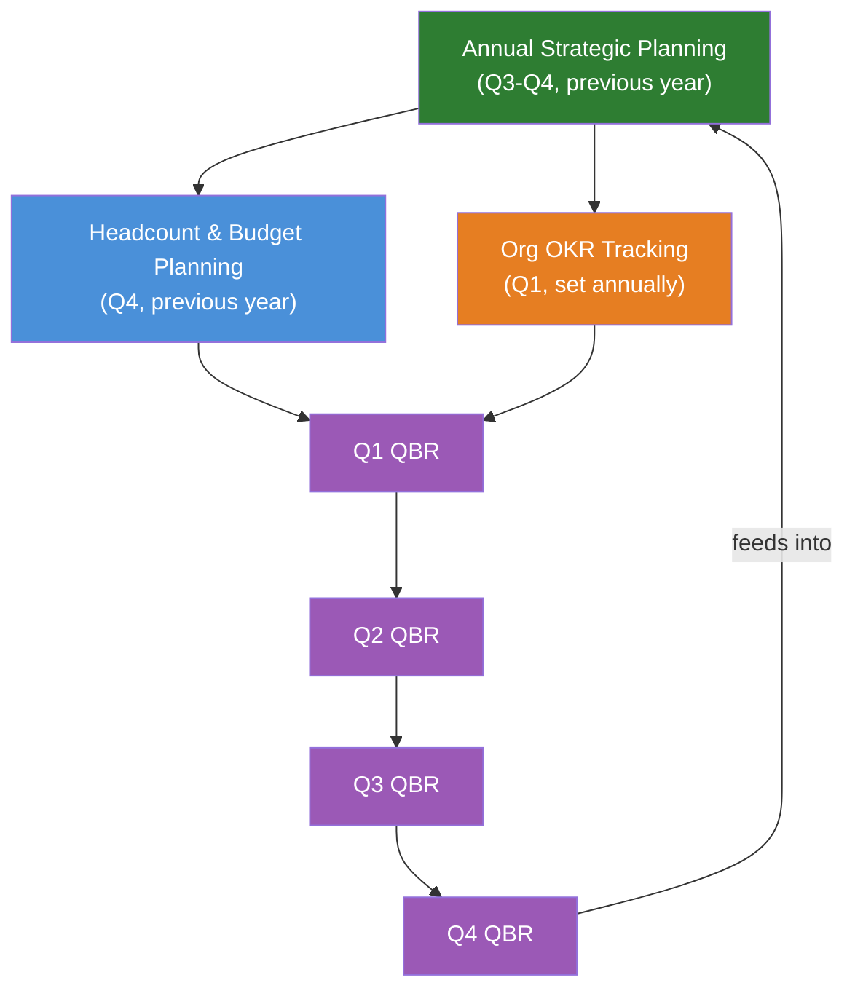

# Executive Roadmap Directory

> **As an** executiver, **I want to** track org-level strategic planning and roadmap documents, **so that** I can align business priorities with technical execution.

Covers annual planning, quarterly business reviews, OKR tracking, and headcount/budget allocation.

## Contents

| Section | Description |
|---|---|
| [Quick start](#quick-start-which-document-when) | Common planning needs → right document |
| [Scope](#scope) | What's in and out of this directory |
| [File inventory](#file-inventory) | All 4 documents with descriptions |
| [Planning cycle](#planning-cycle) | How documents connect across the year |
| [Roles & who uses what](#roles--who-uses-what) | Which role owns which document |
| [Frontmatter template](#frontmatter-template) | YAML frontmatter for new files |
| [Anti-patterns](#anti-patterns) | Common mistakes and what to do instead |
| [When to review](#when-to-review) | Trigger → action table |
| [Related leaves](#related-leaves) | Cross-references to other knowledge base leaves |

## Quick start: which document when?

| Planning need | Start here | Output |
|---|---|---|
| "We need to set next year's strategy and plan" | [Annual Strategic Planning](./annual-strategic-planning.md) | Strategic pillars, prioritized initiatives, resource allocation |
| "It's end of quarter — we need to review progress" | [Quarterly Business Review](./quarterly-business-review.md) | Decision log, next quarter focus areas |
| "How do we set and track company goals?" | [Org OKR Tracking](./org-okr-tracking.md) | Org-level OKRs, cascade to teams, grading scale |
| "How many people can we hire, and where?" | [Headcount & Budget Planning](./headcount-budget-planning.md) | Four-bucket allocation, hiring plan, budget scenarios |

## Scope

- Annual strategic planning process and framework
- Quarterly business review structure and decision logging
- Organization-wide OKR methodology and cascade
- Headcount allocation and budget scenario modeling

**Out of scope** (see related leaves):
- Business strategy frameworks → [../strategy/](../strategy/)
- Product roadmap execution → [../../leader/roadmap/](../../leader/roadmap/)
- Product strategy and industry cases → [../../producter/strategy/](../../producter/strategy/)
- Team-level OKR tracking → [../../producter/discovery/metrics/](../../producter/discovery/metrics/)

## File inventory

| File | Description | Status |
|---|---|---|
| [annual-strategic-planning.md](./annual-strategic-planning.md) | Annual strategic planning process — 4-phase framework, prioritization scoring, resource allocation, cascade to OKRs | ✅ |
| [quarterly-business-review.md](./quarterly-business-review.md) | QBR framework — structured agenda, decision log template, quarterly focus area definition, communication plan | ✅ |
| [org-okr-tracking.md](./org-okr-tracking.md) | OKR cascade methodology — objective/KR rules, grading scale (0.0–1.0), check-in cadence, alignment mapping | ✅ |
| [headcount-budget-planning.md](./headcount-budget-planning.md) | Headcount and budget planning — four-bucket allocation model, hiring capacity formula, 3 budget scenarios with triggers | ✅ |

## Planning cycle

How the four documents connect across the planning year:



| Document | Cadence | When |
|---|---|---|
| [Annual Strategic Planning](./annual-strategic-planning.md) | Annual | Q3–Q4 for the following year |
| [Headcount & Budget Planning](./headcount-budget-planning.md) | Annual + mid-year re-forecast | Q4 (primary), Q2 (re-forecast) |
| [Org OKR Tracking](./org-okr-tracking.md) | Annual (set) + Quarterly (grade) | Q1 (set), end of each quarter (grade) |
| [Quarterly Business Review](./quarterly-business-review.md) | Quarterly | End of Q1, Q2, Q3, Q4 |

## Roles & who uses what

| Role | Primary documents | Why |
|---|---|---|
| **Executiver** | [Annual Planning](./annual-strategic-planning.md), [Headcount & Budget](./headcount-budget-planning.md) | Owns the strategic plan and resource allocation decisions |
| **Leader** | [Org OKR](./org-okr-tracking.md), [QBR](./quarterly-business-review.md) | Cascades OKRs to teams; provides bottom-up input to planning |
| **Producter** | [QBR](./quarterly-business-review.md), [Org OKR](./org-okr-tracking.md) | Aligns product roadmap with org priorities; tracks product OKRs |
| **Finance** | [Headcount & Budget](./headcount-budget-planning.md) | Models scenarios, validates budget, tracks actuals vs. plan |

## Frontmatter template

```yaml
---
title: Some Planning Document
tags: [roadmap, planning, topic]
created: YYYY-MM-DD
updated: YYYY-MM-DD
last_verified: YYYY-MM-DD
source: <link or internal>
type: summary
lifecycle: reference
review_cycle: quarterly
related:
  - ./annual-strategic-planning.md
  - ../README.md
  - ../INDEX.md
---
```

## Anti-patterns

| Anti-pattern | Why it fails | Fix |
|---|---|---|
| Planning without strategy | Initiatives prioritized by loudest voice, not strategic importance | Always start from [strategy](../strategy/product-strategy-framework.md) before opening the [annual plan](./annual-strategic-planning.md) |
| Annual plan as a fixed contract | Circumstances change; rigid plan becomes irrelevant | [QBR](./quarterly-business-review.md) is the course-correction mechanism — use it |
| OKRs as a task list | KRs become "ship feature X" instead of outcome measures | Every KR must have a number and measure an outcome; see [OKR tracking](./org-okr-tracking.md) |
| Budget = last year + 10% | No connection between strategy and resource allocation | Use the [four-bucket model](./headcount-budget-planning.md); start from strategic priorities |
| QBR as a status meeting | Reading slides everyone has seen; no decisions made | Follow [QBR agenda](./quarterly-business-review.md); pre-read materials, session is for debate |
| No optionality in budget | Every dollar allocated; no room for unexpected opportunities | 5–10% reserve is non-negotiable; see [headcount planning](./headcount-budget-planning.md) |

## When to review

| Trigger | Action |
|---|---|
| Annual planning cycle (Q3–Q4) | Run [annual-strategic-planning.md](./annual-strategic-planning.md) + [headcount-budget-planning.md](./headcount-budget-planning.md) |
| End of quarter | Run [quarterly-business-review.md](./quarterly-business-review.md); grade [OKRs](./org-okr-tracking.md) |
| Mid-year (Q2) | Re-forecast [headcount and budget](./headcount-budget-planning.md) |
| Strategy pivot | Re-run [annual planning](./annual-strategic-planning.md) Phase 3–4 with updated strategy |
| Revenue miss >20% | Switch to conservative [budget scenario](./headcount-budget-planning.md) |
| New funding round | Switch to optimistic [budget scenario](./headcount-budget-planning.md); update headcount plan |

## Related leaves

| Leaf | Relevance |
|---|---|
| [../strategy/](../strategy/) | Business strategy frameworks — feeds into annual planning Phase 1 |
| [../../leader/roadmap/](../../leader/roadmap/) | Technical roadmap — execution layer for the org plan |
| [../../producter/strategy/](../../producter/strategy/) | Product strategy — aligns product direction with org priorities |
| [../../producter/discovery/metrics/](../../producter/discovery/metrics/) | Strategy-aligned metrics — connects OKRs to product metrics |
| [../INDEX.md](../INDEX.md) | Executiver role index — all executiver subdirectories |