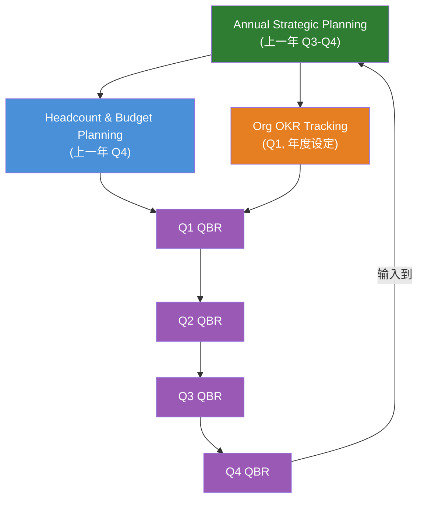

# 高管路线图目录

> **作为**高管，**我想要**追踪组织级战略规划和路线图文档，**以便**将业务优先级与技术执行对齐。

涵盖年度规划、季度业务评审、OKR 追踪和人员编制/预算分配。

## 目录

| Section | Description |
|---|---|
| [快速开始](#快速开始该用哪个文档) | 常见规划需求 → 对应文档 |
| [范围](#范围) | 本目录的包含和排除内容 |
| [文件清单](#文件清单) | 全部 4 份文档及描述 |
| [规划周期](#规划周期) | 文档在全年中的关联方式 |
| [角色与使用场景](#角色与使用场景) | 哪个角色负责哪个文档 |
| [Frontmatter 模板](#frontmatter-模板) | 新文件的 YAML frontmatter |
| [反模式](#反模式) | 常见错误及替代做法 |
| [何时审查](#何时审查) | 触发条件 → 行动表 |
| [相关叶子目录](#相关叶子目录) | 与其他知识库叶子目录的交叉引用 |

## 快速开始：该用哪个文档？

| 规划需求 | 从这里开始 | 产出 |
|---|---|---|
| "我们需要制定明年的战略和规划" | [Annual Strategic Planning](./annual-strategic-planning.md) | 战略支柱、优先级排序的举措、资源分配 |
| "季度末了 — 我们需要审查进展" | [Quarterly Business Review](./quarterly-business-review.md) | 决策日志、下季度重点领域 |
| "如何设定和追踪公司目标？" | [Org OKR Tracking](./org-okr-tracking.md) | 组织级 OKR、级联到团队、评分标准 |
| "我们能招多少人，招在哪里？" | [Headcount & Budget Planning](./headcount-budget-planning.md) | 四桶分配模型、招聘计划、预算方案 |

## 范围

- 年度战略规划流程和框架
- 季度业务评审结构和决策记录
- 组织级 OKR 方法论和级联
- 人员编制分配和预算方案建模

**范围外**（参见相关叶子目录）：
- 业务战略框架 → [../strategy/](../strategy/)
- 产品路线图执行 → [../../leader/roadmap/](../../leader/roadmap/)
- 产品战略和行业案例 → [../../producter/strategy/](../../producter/strategy/)
- 团队级 OKR 追踪 → [../../producter/discovery/metrics/](../../producter/discovery/metrics/)

## 文件清单

| File | Description | Status |
|---|---|---|
| [annual-strategic-planning.md](./annual-strategic-planning.md) | 年度战略规划流程 — 4 阶段框架、优先级评分、资源分配、级联到 OKR | ✅ |
| [quarterly-business-review.md](./quarterly-business-review.md) | QBR 框架 — 结构化议程、决策日志模板、季度重点领域定义、沟通计划 | ✅ |
| [org-okr-tracking.md](./org-okr-tracking.md) | OKR 级联方法论 — 目标/KR 规则、评分标准（0.0–1.0）、检查频率、对齐映射 | ✅ |
| [headcount-budget-planning.md](./headcount-budget-planning.md) | 人员编制和预算规划 — 四桶分配模型、招聘容量公式、3 种预算方案及触发条件 | ✅ |

## 规划周期

四份文档在规划年度中的关联方式：



| Document | Cadence | When |
|---|---|---|
| [Annual Strategic Planning](./annual-strategic-planning.md) | 年度 | Q3–Q4 为下一年 |
| [Headcount & Budget Planning](./headcount-budget-planning.md) | 年度 + 年中重新预测 | Q4（主）、Q2（重新预测） |
| [Org OKR Tracking](./org-okr-tracking.md) | 年度（设定） + 季度（评分） | Q1（设定）、每季度末（评分） |
| [Quarterly Business Review](./quarterly-business-review.md) | 季度 | Q1、Q2、Q3、Q4 末 |

## 角色与使用场景

| Role | Primary documents | Why |
|---|---|---|
| **Executiver** | [Annual Planning](./annual-strategic-planning.md), [Headcount & Budget](./headcount-budget-planning.md) | 负责战略规划和资源分配决策 |
| **Leader** | [Org OKR](./org-okr-tracking.md), [QBR](./quarterly-business-review.md) | 将 OKR 级联到团队；为规划提供自下而上的输入 |
| **Producter** | [QBR](./quarterly-business-review.md), [Org OKR](./org-okr-tracking.md) | 将产品路线图与组织优先级对齐；追踪产品 OKR |
| **Finance** | [Headcount & Budget](./headcount-budget-planning.md) | 建模方案、验证预算、追踪实际与计划 |

## Frontmatter 模板

```yaml
---
title: Some Planning Document
tags: [roadmap, planning, topic]
created: YYYY-MM-DD
updated: YYYY-MM-DD
last_verified: YYYY-MM-DD
source: <link or internal>
type: summary
lifecycle: reference
review_cycle: quarterly
related:
  - ./annual-strategic-planning.md
  - ../README.md
  - ../INDEX.md
---
```

## 反模式

| Anti-pattern | Why it fails | Fix |
|---|---|---|
| 无战略的规划 | 举措由声音最大的人排优先级，而非战略重要性 | 始终从 [strategy](../strategy/product-strategy-framework.md) 开始，再打开 [annual plan](./annual-strategic-planning.md) |
| 年度计划作为固定合同 | 环境变化；僵化的计划变得无关 | [QBR](./quarterly-business-review.md) 是纠偏机制 — 使用它 |
| OKR 作为任务清单 | KR 变成"上线功能 X"而非结果度量 | 每个 KR 必须有数字并度量结果；参见 [OKR tracking](./org-okr-tracking.md) |
| 预算 = 去年 + 10% | 战略与资源分配之间没有关联 | 使用 [四桶模型](./headcount-budget-planning.md)；从战略优先级出发 |
| QBR 作为状态汇报会 | 读大家已经看过的幻灯片；没有做出决策 | 遵循 [QBR 议程](./quarterly-business-review.md)；提前阅读材料，会议用于辩论 |
| 预算没有弹性 | 每一分钱都分配了；没有空间应对意外机会 | 5–10% 储备金是不可协商的；参见 [headcount planning](./headcount-budget-planning.md) |

## 何时审查

| Trigger | Action |
|---|---|
| 年度规划周期（Q3–Q4） | 执行 [annual-strategic-planning.md](./annual-strategic-planning.md) + [headcount-budget-planning.md](./headcount-budget-planning.md) |
| 季度末 | 执行 [quarterly-business-review.md](./quarterly-business-review.md)；对 [OKRs](./org-okr-tracking.md) 评分 |
| 年中（Q2） | 重新预测 [headcount and budget](./headcount-budget-planning.md) |
| 战略转向 | 用更新后的战略重新执行 [annual planning](./annual-strategic-planning.md) 阶段 3–4 |
| 收入未达预期 >20% | 切换到保守 [budget scenario](./headcount-budget-planning.md) |
| 新融资轮次 | 切换到乐观 [budget scenario](./headcount-budget-planning.md)；更新人员编制计划 |

## 相关叶子目录

| Leaf | Relevance |
|---|---|
| [../strategy/](../strategy/) | 业务战略框架 — 输入到年度规划阶段 1 |
| [../../leader/roadmap/](../../leader/roadmap/) | 技术路线图 — 组织规划的执行层 |
| [../../producter/strategy/](../../producter/strategy/) | 产品战略 — 将产品方向与组织优先级对齐 |
| [../../producter/discovery/metrics/](../../producter/discovery/metrics/) | 战略对齐指标 — 将 OKR 与产品指标关联 |
| [../INDEX.md](../INDEX.md) | Executiver 角色索引 — 所有 executiver 子目录 |