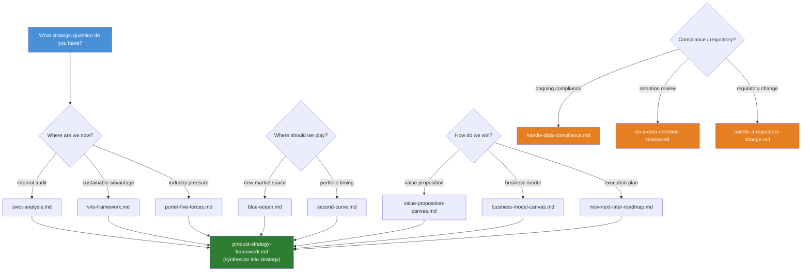
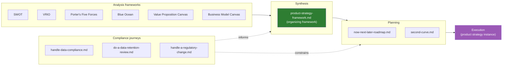

# Executive Strategy Directory

> **As an** executiver, **I want to** apply product strategy frameworks (positioning, business models, roadmaps) and navigate compliance journeys, **so that** product direction aligns with market opportunities and business goals.

Covers product strategy frameworks, roadmap design, business models, positioning methods, and regulatory/compliance strategy.

## Scope

- Product vision and positioning
- Business Model Canvas
- Roadmap design (Now / Next / Later)
- Competitive strategy (Blue Ocean, differentiation)
- Second curve and product portfolio management
- Data compliance and regulatory change journeys

## Strategy framework decision flow

Which framework to apply depends on the strategic question at hand. The diagram below maps common entry points to the right tool:



## Strategy lifecycle

Frameworks feed into analysis, which feeds into a concrete strategy instance, which drives execution:



## File types and naming

| Pattern | Purpose | Example |
|---|---|---|
| `{name}.md` | Strategy framework summary | `blue-ocean.md` |
| `{name}-roadmap.md` | Roadmap / planning artifact | `now-next-later-roadmap.md` |
| `{name}-canvas.md` | Canvas-based tool | `business-model-canvas.md` |
| `{name}-analysis.md` | Situational analysis framework | `swot-analysis.md` |
| `do-{task}.md` | Step-by-step operational journey | `do-a-data-retention-review.md` |
| `handle-{event}.md` | Event-driven response journey | `handle-a-regulatory-change.md` |

All naming uses English kebab-case.

## File inventory

### Strategy frameworks (8)

| File | Description |
|---|---|
| `product-strategy-framework.md` | Meta-framework: how to organize and synthesize multiple strategy inputs into a coherent product strategy |
| `business-model-canvas.md` | Business Model Canvas — 9 building blocks for describing, designing, and pivoting a business model |
| `blue-ocean.md` | Blue Ocean Strategy — create uncontested market space via value innovation and the ERRC grid |
| `porter-five-forces.md` | Porter's Five Forces — analyze industry structure through competitive rivalry, buyer/supplier power, threats of entry/substitution |
| `swot-analysis.md` | SWOT Analysis — internal (Strengths/Weaknesses) + external (Opportunities/Threats) situation audit |
| `vrio-framework.md` | VRIO Framework — assess resources for sustainable competitive advantage (Valuable, Rare, Inimitable, Organized) |
| `value-proposition-canvas.md` | Value Proposition Canvas — map customer jobs/pains/gains to product features/pain relievers/gain creators |
| `second-curve.md` | Second Curve — timing the leap from a maturing business to the next growth engine |

### Roadmap & planning (1)

| File | Description |
|---|---|
| `now-next-later-roadmap.md` | Now / Next / Later roadmap — outcome-based prioritization without fixed timelines |

### Compliance & regulatory journeys (3)

| File | Description |
|---|---|
| `handle-data-compliance.md` | Ongoing data compliance journey — PII handling, consent management, cross-border data flows |
| `do-a-data-retention-review.md` | Data retention review journey — audit retention policies, classify data lifecycle, implement purge schedules |
| `handle-a-regulatory-change.md` | Regulatory change response journey — monitor, assess impact, and adapt to new regulations |

## Frontmatter template

```yaml
---
title: Some Strategy Framework
tags: [strategy, product, topic]
created: YYYY-MM-DD
updated: YYYY-MM-DD
last_verified: YYYY-MM-DD
source: <link or internal>
type: summary
lifecycle: reference
review_cycle: quarterly
related:
  - ./blue-ocean.md
  - ./business-model-canvas.md
  - ../README.md
  - ../INDEX.md
---
```

## Recommended writing structure

### For framework files

1. Strategy framework definition
2. Applicable scenarios
3. Design steps
4. Key outputs
5. Anti-patterns
6. This product's landing instance

### For journey files (`do-*` / `handle-*`)

1. Trigger condition (when to use this journey)
2. Step-by-step walkthrough
3. Decision points and branching
4. Key deliverables at each stage
5. Anti-patterns and common pitfalls

## Related leaves

- [../../producter/discovery/metrics](../../producter/discovery/metrics) — Strategy-aligned metrics
- [../../producter/discovery/ux](../../producter/discovery/ux) — User perspective
- [../../curator/templates/thinking](../../curator/templates/thinking) — Mental models
- [../industry/competitors](../industry/competitors) — Competitive benchmarking
- [../../engineer/learn/lessons/learn-pm-frameworks.md](../../engineer/learn/lessons/learn-pm-frameworks.md) — Scenario entry
- [../../engineer/run/understand-competitors.md](../../engineer/run/understand-competitors.md) — Scenario entry