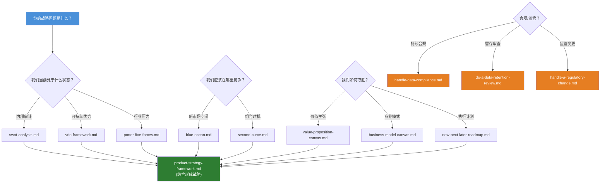
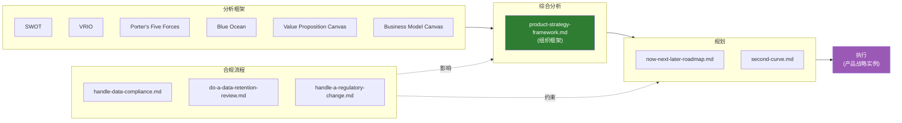

# 高管战略目录

> **作为**高管，**我想要**应用产品战略框架（定位、商业模式、路线图）并完成合规流程，**以便**产品方向与市场机会和业务目标对齐。

涵盖产品战略框架、路线图设计、商业模式、定位方法和监管/合规战略。

## 目录

| Section | Description |
|---|---|
| [快速开始](#快速开始该用哪个框架) | 常见战略问题 → 对应框架 |
| [范围](#范围) | 本目录的包含和排除内容 |
| [前置条件](#前置条件) | 应用框架前需要的数据和输入 |
| [文件清单](#文件清单) | 全部 12 个文件及描述和状态 |
| [框架对比](#框架对比) | 时间跨度、输入、最适用场景矩阵 |
| [决策流程](#战略框架决策流程) | Mermaid 图：问题 → 框架 |
| [战略生命周期](#战略生命周期) | 框架如何输入到综合分析和执行 |
| [战略节奏](#战略节奏) | 每个框架的回顾频率 |
| [角色与使用场景](#角色与使用场景) | 哪个角色负责哪个框架 |
| [产出与交付物](#产出与交付物) | 每个框架产生什么 |
| [战略文档模板](#战略文档模板) | 最终战略文档的具体大纲 |
| [文件类型与命名](#文件类型与命名) | 命名规范和模式 |
| [Frontmatter 模板](#frontmatter-模板) | 新文件的 YAML frontmatter |
| [推荐撰写结构](#推荐撰写结构) | 如何撰写框架和流程文件 |
| [反模式](#反模式) | 常见错误及替代做法 |
| [何时审查](#何时审查) | 触发条件 → 行动表 |
| [相关叶子目录](#相关叶子目录) | 与其他知识库叶子目录的交叉引用 |
| [术语表](#术语表) | 关键战略术语定义 |

## 快速开始：该用哪个框架？

| 战略问题 | 从这里开始 | 产出 |
|---|---|---|
| "我们当前处于什么状态？" | [SWOT](./swot-analysis.md) → [VRIO](./vrio-framework.md) | 形势审计 + 资源优势评估 |
| "这个行业有吸引力吗？" | [Porter's Five Forces](./porter-five-forces.md) | 行业结构分析 |
| "空白市场在哪里？" | [Blue Ocean](./blue-ocean.md) | 新市场机会地图 |
| "何时跳到下一个增长点？" | [Second Curve](./second-curve.md) | 组合时机决策 |
| "客户真正需要什么？" | [Value Proposition Canvas](./value-proposition-canvas.md) | 客户任务 → 产品功能映射 |
| "商业模式可行吗？" | [Business Model Canvas](./business-model-canvas.md) | 9 模块模型验证 |
| "先构建什么？" | [Now/Next/Later](./now-next-later-roadmap.md) | 按结果排序的路线图 |
| "我们合规吗？" | [Data Compliance](./handle-data-compliance.md) | 合规基线和差距报告 |
| "我们应该保留这些数据吗？" | [Data Retention Review](./do-a-data-retention-review.md) | 留存策略 + 清理计划 |
| "新法规刚刚出台" | [Regulatory Change](./handle-a-regulatory-change.md) | 影响评估 + 适应计划 |

对于多框架综合分析，使用 [product-strategy-framework.md](./product-strategy-framework.md) 作为组织元框架。

### 战略组合：哪些框架可以搭配使用？

| Stack | Frameworks | When to use |
|---|---|---|
| **形势审计** | [SWOT](./swot-analysis.md) + [VRIO](./vrio-framework.md) + [P5F](./porter-five-forces.md) | 年度战略刷新、董事会演示准备 |
| **市场进入** | [Blue Ocean](./blue-ocean.md) + [VPC](./value-proposition-canvas.md) + [BMC](./business-model-canvas.md) | 新产品发布、品类创建 |
| **增长审查** | [VPC](./value-proposition-canvas.md) + [BMC](./business-model-canvas.md) + [Second Curve](./second-curve.md) | 组合再平衡、投资分配 |
| **合规审计** | [Data Compliance](./handle-data-compliance.md) + [Data Retention](./do-a-data-retention-review.md) + [Regulatory Change](./handle-a-regulatory-change.md) | 监管截止日期临近、违规后审查 |

## 范围

- 产品愿景和定位
- 商业模式画布
- 路线图设计（Now / Next / Later）
- 竞争战略（Blue Ocean、差异化）
- 第二曲线和产品组合管理
- 数据合规和监管变更流程

**范围外**（参见相关叶子目录）：
- OKR 设计和指标树 → [producter/discovery/metrics](../../producter/discovery/metrics)
- 用户研究方法 → [producter/discovery/ux](../../producter/discovery/ux)
- 技术架构战略 → [leader/roadmap](../../leader/roadmap)
- 竞争对手数据收集 → [industry/competitors](../industry/competitors)

## 前置条件

在应用任何框架之前，收集以下输入：

| Input | Needed for | Source |
|---|---|---|
| 客户访谈记录 / 使用数据 | [VPC](./value-proposition-canvas.md), [Blue Ocean](./blue-ocean.md) | [producter/discovery/ux](../../producter/discovery/ux) |
| 竞争对手格局 | [P5F](./porter-five-forces.md), [Blue Ocean](./blue-ocean.md), [SWOT](./swot-analysis.md) | [industry/competitors](../industry/competitors) |
| 收入 / 成本结构数据 | [BMC](./business-model-canvas.md), [Second Curve](./second-curve.md) | 内部财务 |
| 当前产品积压 | [Now/Next/Later](./now-next-later-roadmap.md) | 工程 / 产品 |
| 监管清单 | [Data Compliance](./handle-data-compliance.md), [Regulatory Change](./handle-a-regulatory-change.md) | 法务 / 合规团队 |
| 内部资源/能力清单 | [VRIO](./vrio-framework.md), [SWOT](./swot-analysis.md) | 工程 / HR |

## 文件清单

状态图例：✅ 已存在 &nbsp; 🚧 计划中 &nbsp; 📝 存根

### 战略框架（8 个）

| File | Description | Status |
|---|---|---|
| [product-strategy-framework.md](./product-strategy-framework.md) | 元框架：如何组织和综合多个战略输入形成连贯的产品战略 | ✅ |
| [business-model-canvas.md](./business-model-canvas.md) | 商业模式画布 — 用于描述、设计和转型商业模式的 9 个构建模块 | ✅ |
| [blue-ocean.md](./blue-ocean.md) | 蓝海战略 — 通过价值创新和 ERRC 网格创造无竞争的市场空间 | ✅ |
| [porter-five-forces.md](./porter-five-forces.md) | Porter 五力模型 — 通过竞争激烈程度、买方/供应商议价能力、进入/替代威胁分析行业结构 | ✅ |
| [swot-analysis.md](./swot-analysis.md) | SWOT 分析 — 内部（优势/劣势）+ 外部（机会/威胁）形势审计 | ✅ |
| [vrio-framework.md](./vrio-framework.md) | VRIO 框架 — 评估资源是否具有可持续竞争优势（有价值、稀有、不可模仿、组织化） | ✅ |
| [value-proposition-canvas.md](./value-proposition-canvas.md) | 价值主张画布 — 将客户任务/痛点/收益映射到产品功能/痛点缓解/收益创造 | ✅ |
| [second-curve.md](./second-curve.md) | 第二曲线 — 把握从成熟业务跃迁到下一个增长引擎的时机 | ✅ |

### 路线图与规划（1 个）

| File | Description | Status |
|---|---|---|
| [now-next-later-roadmap.md](./now-next-later-roadmap.md) | Now / Next / Later 路线图 — 基于结果的优先级排序，无需固定时间线 | ✅ |

### 合规与监管流程（3 个）

| File | Description | Status |
|---|---|---|
| [handle-data-compliance.md](./handle-data-compliance.md) | 持续数据合规流程 — PII 处理、同意管理、跨境数据流动 | ✅ |
| [do-a-data-retention-review.md](./do-a-data-retention-review.md) | 数据留存审查流程 — 审计留存策略、分类数据生命周期、实施清理计划 | ✅ |
| [handle-a-regulatory-change.md](./handle-a-regulatory-change.md) | 监管变更响应流程 — 监控、评估影响并适应新法规 | ✅ |

## 框架对比

| Framework | Time horizon | Input needed | Best for | Complexity |
|---|---|---|---|---|
| SWOT | 当前（快照） | 内部 + 外部数据 | 形势认知、对齐工作坊 | 低 |
| VRIO | 当前 | 内部资源清单 | 基于能力的战略、自建 vs 外购决策 | 低 |
| Porter's Five Forces | 当前 → 3 年 | 行业数据、市场报告 | 市场进入/退出、竞争定位 | 中 |
| Blue Ocean | 3–5 年 | 市场分析、客户研究 | 新品类创建、颠覆战略 | 高 |
| Second Curve | 5–10 年 | 组合数据、趋势分析 | 组合管理、转型时机 | 高 |
| Value Proposition Canvas | 当前 → 1 年 | 客户访谈、使用数据 | 产品-市场匹配、功能优先级 | 低 |
| Business Model Canvas | 当前 → 3 年 | 业务数据、市场规模 | 商业模式设计、转型验证 | 中 |
| Now/Next/Later | 当前 → 2 年 | 积压需求、战略输入 | 执行规划、利益相关者对齐 | 低 |

## 战略框架决策流程

应用哪个框架取决于当前的战略问题。下图将常见入口映射到合适的工具：



## 战略生命周期

框架输入到分析，分析输入到具体战略实例，战略实例驱动执行：



## 战略节奏

每个框架应多久回顾一次：

| Framework | Cadence | Trigger for off-cycle review |
|---|---|---|
| [SWOT](./swot-analysis.md) | 每季度 | 重大竞争对手动作、组织重组 |
| [VRIO](./vrio-framework.md) | 每半年 | 关键人员入职/离职、新技术获取 |
| [Porter's Five Forces](./porter-five-forces.md) | 每年 | 新进入者、监管转变、供应商整合 |
| [Blue Ocean](./blue-ocean.md) | 每年或按项目 | 相邻市场进入、商品化信号 |
| [Second Curve](./second-curve.md) | 每年 | 收入平台期、颠覆性技术出现 |
| [Value Proposition Canvas](./value-proposition-canvas.md) | 每季度 | 流失激增、NPS 下降、竞品功能发布 |
| [Business Model Canvas](./business-model-canvas.md) | 每半年 | 定价变化、新渠道、成本结构变化 |
| [Now/Next/Later](./now-next-later-roadmap.md) | 每月 | 战略转向、严重 bug、依赖变更 |
| [Data Compliance](./handle-data-compliance.md) | 每季度 | 新数据类型、数据泄露、监管审计 |
| [Data Retention](./do-a-data-retention-review.md) | 每半年 | 引入新数据类型、法律保留 |
| [Regulatory Change](./handle-a-regulatory-change.md) | 事件驱动 | 法规发布、执法行动 |

## 角色与使用场景

| Role | Primary frameworks | Why |
|---|---|---|
| **Executiver** | [P5F](./porter-five-forces.md), [Blue Ocean](./blue-ocean.md), [Second Curve](./second-curve.md), [BMC](./business-model-canvas.md) | 市场级决策、组合分配、商业模式验证 |
| **Producter** | [VPC](./value-proposition-canvas.md), [BMC](./business-model-canvas.md), [Now/Next/Later](./now-next-later-roadmap.md), [SWOT](./swot-analysis.md) | 产品-市场匹配、功能优先级、路线图执行 |
| **Leader** | [VRIO](./vrio-framework.md), [SWOT](./swot-analysis.md), [Now/Next/Later](./now-next-later-roadmap.md) | 团队能力评估、技术战略对齐 |
| **Legal/Compliance** | [Data Compliance](./handle-data-compliance.md), [Data Retention](./do-a-data-retention-review.md), [Regulatory Change](./handle-a-regulatory-change.md) | 监管风险管理、数据治理 |
| **All roles** | [product-strategy-framework.md](./product-strategy-framework.md) | 综合分析 — 每个人都为统一战略做贡献 |

## 产出与交付物

每个框架正确应用后产生什么：

| Framework | Primary output | Format |
|---|---|---|
| [SWOT](./swot-analysis.md) | 2×2 矩阵，每个象限附带优先行动项 | 一页纸或幻灯片 |
| [VRIO](./vrio-framework.md) | 资源评估表，每个资源附带竞争影响 | 电子表格或表格 |
| [Porter's Five Forces](./porter-five-forces.md) | 逐项评估及整体行业吸引力评级 | 报告（2–3 页） |
| [Blue Ocean](./blue-ocean.md) | 战略画布 + ERRC 网格 + 新价值曲线 | 幻灯片（3–5 张） |
| [Second Curve](./second-curve.md) | S 曲线图，附带时机指标和转型计划 | 幻灯片或图表 |
| [Value Proposition Canvas](./value-proposition-canvas.md) | 填好的画布：客户画像 + 价值地图及匹配验证 | 一页纸 |
| [Business Model Canvas](./business-model-canvas.md) | 填好的 9 模块画布，附带假设验证注释 | 一页纸 |
| [product-strategy-framework.md](./product-strategy-framework.md) | 综合所有输入的连贯战略文档 | 文档（5–10 页） |
| [Now/Next/Later](./now-next-later-roadmap.md) | 3 列路线图，每列附带结果 | 一页纸或看板 |
| [Data Compliance](./handle-data-compliance.md) | 合规基线报告 + 差距分析 + 整改计划 | 报告 |
| [Data Retention](./do-a-data-retention-review.md) | 留存策略矩阵 + 清理计划 | 电子表格 + 策略文档 |
| [Regulatory Change](./handle-a-regulatory-change.md) | 影响评估 + 适应计划 + 时间线 | 报告 |

## 战略文档模板

通过 [product-strategy-framework.md](./product-strategy-framework.md) 将框架综合为最终战略文档时，使用此大纲：

1. **执行摘要** — 1 页战略方向综合
2. **当前状态** — SWOT + VRIO + P5F 发现
3. **市场机会** — Blue Ocean 战略画布 + 价值曲线
4. **客户价值** — Value Proposition Canvas 摘要
5. **商业模式** — BMC 及关键假设和验证状态
6. **战略选择** — 我们将做什么、不做什么、为什么
7. **路线图** — Now / Next / Later 及结果和成功标准
8. **组合视图** — 各产品线的 Second Curve 定位
9. **合规约束** — 监管边界和风险缓解
10. **假设与风险** — 关键赌注、重新评估的触发条件

## 文件类型与命名

| Pattern | Purpose | Example |
|---|---|---|
| `{name}.md` | 战略框架摘要 | [blue-ocean.md](./blue-ocean.md) |
| `{name}-roadmap.md` | 路线图 / 规划产物 | [now-next-later-roadmap.md](./now-next-later-roadmap.md) |
| `{name}-canvas.md` | 画布工具 | [business-model-canvas.md](./business-model-canvas.md) |
| `{name}-analysis.md` | 形势分析框架 | [swot-analysis.md](./swot-analysis.md) |
| `do-{task}.md` | 分步操作流程 | [do-a-data-retention-review.md](./do-a-data-retention-review.md) |
| `handle-{event}.md` | 事件驱动响应流程 | [handle-a-regulatory-change.md](./handle-a-regulatory-change.md) |

所有命名使用英文 kebab-case。

## Frontmatter 模板

```yaml
---
title: Some Strategy Framework
tags: [strategy, product, topic]
created: YYYY-MM-DD
updated: YYYY-MM-DD
last_verified: YYYY-MM-DD
source: <link or internal>
type: summary
lifecycle: reference
review_cycle: quarterly
related:
  - ./blue-ocean.md
  - ./business-model-canvas.md
  - ../README.md
  - ../INDEX.md
---
```

## 推荐撰写结构

### 框架文件

1. 战略框架定义
2. 适用场景
3. 设计步骤
4. 关键产出
5. 反模式
6. 本产品的落地实例

### 流程文件（`do-*` / `handle-*`）

1. 触发条件（何时使用此流程）
2. 分步操作指南
3. 决策点和分支
4. 每个阶段的关键交付物
5. 反模式和常见陷阱

## 反模式

| Anti-pattern | Why it fails | Do this instead |
|---|---|---|
| 一次性应用所有框架 | 分析瘫痪；框架在目的上重叠 | 每个战略周期最多选 2–3 个，使用 [决策流程](#战略框架决策流程) |
| 框架优先思维 | 框架成为目标，而非决策 | 从战略问题开始，再选工具 |
| 跳过综合分析 | 孤立的框架产出不能构成战略 | 始终通过 [product-strategy-framework.md](./product-strategy-framework.md) 路由 |
| 一次性战略 | 市场变化使假设失效 | 遵循 [节奏表](#战略节奏)；重大事件触发重新分析 |
| 合规作为事后想法 | 监管约束可能使后期战略无效 | 在战略综合的同时并行运行 [合规流程](#合规与监管流程-3-个) |
| SWOT 没有行动 | 产生清单而非战略 | 每个 SWOT 条目必须映射到 [Now/Next/Later](./now-next-later-roadmap.md) 中的战略举措 |
| BMC 没有验证 | 填好的画布 ≠ 经过验证的商业模式 | 将每个模块视为假设；用 [VPC](./value-proposition-canvas.md) 客户数据验证 |
| Second Curve 太晚 | 等到第一条曲线达到顶峰时，开始已经太晚了 | 在第一条曲线仍在增长阶段时就开始 [Second Curve](./second-curve.md) 探索 |

## 何时审查

| Trigger | Action |
|---|---|
| 季度审查（定期） | 重新验证所有框架假设；更新 `last_verified` |
| 重大竞争对手动作 | 重新执行 [Porter's Five Forces](./porter-five-forces.md) + [Blue Ocean](./blue-ocean.md) |
| 新法规发布 | 触发 [handle-a-regulatory-change.md](./handle-a-regulatory-change.md) |
| 产品-市场匹配信号变化 | 重新执行 [Value Proposition Canvas](./value-proposition-canvas.md) |
| 接近当前曲线顶峰 | 触发 [Second Curve](./second-curve.md) 分析 |
| 新融资轮次或预算周期 | 重新验证 [Business Model Canvas](./business-model-canvas.md) |

## 相关叶子目录

| Leaf | Relevance |
|---|---|
| [../industry/competitors](../industry/competitors) | 竞争基准和格局分析 — 输入到 [P5F](./porter-five-forces.md) 和 [Blue Ocean](./blue-ocean.md) |
| [../industry/reports](../industry/reports) | 第三方行业报告提供市场背景 — 输入到 [SWOT](./swot-analysis.md) 和 [P5F](./porter-five-forces.md) |
| [../../producter/discovery/metrics](../../producter/discovery/metrics) | 战略对齐指标和 OKR 追踪 — [Now/Next/Later](./now-next-later-roadmap.md) 的下游 |
| [../../producter/discovery/ux](../../producter/discovery/ux) | 用户研究输入到 [Value Proposition Canvas](./value-proposition-canvas.md) |
| [../../curator/templates/thinking](../../curator/templates/thinking) | 战略推理的心智模型 |
| [../../engineer/learn/lessons/learn-pm-frameworks.md](../../engineer/learn/lessons/learn-pm-frameworks.md) | 场景入口：学习 PM 框架 |
| [../../engineer/run/understand-competitors.md](../../engineer/run/understand-competitors.md) | 场景入口：竞争对手分析 |

## 术语表

| Term | Definition | See |
|---|---|---|
| **Blue Ocean** | 通过价值创新创造的无竞争市场空间，使竞争变得无关紧要 | [blue-ocean.md](./blue-ocean.md) |
| **BMC** | 商业模式画布 — 用于商业模式设计的 9 模块可视化框架 | [business-model-canvas.md](./business-model-canvas.md) |
| **ERRC grid** | 消除-减少-提升-创造网格 — 蓝海战略中用于重新定义价值的工具 | [blue-ocean.md](./blue-ocean.md) |
| **Now/Next/Later** | 基于结果的路线图，三个时间维度，无固定日期 | [now-next-later-roadmap.md](./now-next-later-roadmap.md) |
| **P5F** | Porter 五力模型 — 行业结构分析框架 | [porter-five-forces.md](./porter-five-forces.md) |
| **PSF** | 产品战略框架 — 用于综合多个战略输入的元框架 | [product-strategy-framework.md](./product-strategy-framework.md) |
| **Second Curve** | 在当前增长引擎成熟之前跳转到下一个增长引擎 | [second-curve.md](./second-curve.md) |
| **Strategy canvas** | 在关键竞争因素上对比竞争对手的可视化工具（蓝海战略） | [blue-ocean.md](./blue-ocean.md) |
| **Value innovation** | 同时追求差异化和低成本（蓝海战略核心概念） | [blue-ocean.md](./blue-ocean.md) |
| **VPC** | 价值主张画布 — 将客户任务/痛点/收益映射到产品功能 | [value-proposition-canvas.md](./value-proposition-canvas.md) |
| **VRIO** | 有价值、稀有、不可模仿、组织化 — 评估可持续优势的框架 | [vrio-framework.md](./vrio-framework.md) |