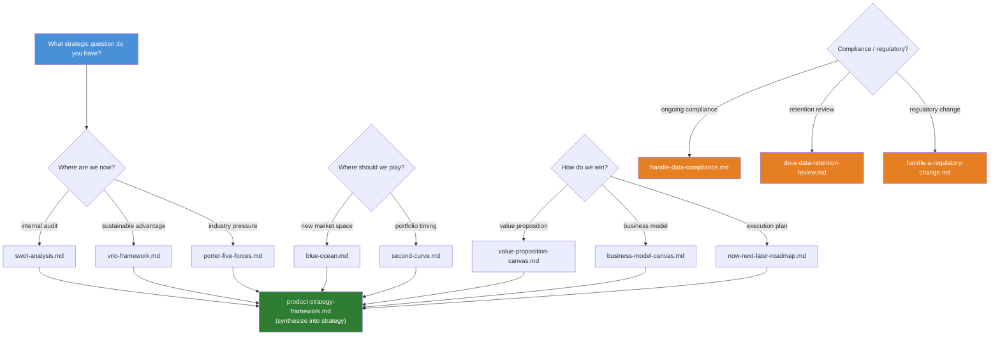
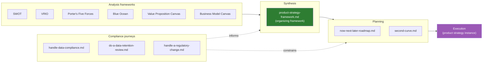

# Executive Strategy Directory

> **As an** executiver, **I want to** apply product strategy frameworks (positioning, business models, roadmaps) and navigate compliance journeys, **so that** product direction aligns with market opportunities and business goals.

Covers product strategy frameworks, roadmap design, business models, positioning methods, and regulatory/compliance strategy.

## Contents

| Section | Description |
|---|---|
| [Quick start](#quick-start-which-framework-when) | Common strategic questions → right framework |
| [Scope](#scope) | What's in and out of this directory |
| [Prerequisites](#prerequisites) | Data and inputs needed before applying frameworks |
| [File inventory](#file-inventory) | All 12 files with descriptions and status |
| [Framework comparison](#framework-comparison) | Time horizon, inputs, best-for matrix |
| [Decision flow](#strategy-framework-decision-flow) | Mermaid diagram: question → framework |
| [Strategy lifecycle](#strategy-lifecycle) | How frameworks feed into synthesis and execution |
| [Strategy cadence](#strategy-cadence) | How often to revisit each framework |
| [Roles & who uses what](#roles--who-uses-what) | Which role owns which framework |
| [Outputs & deliverables](#outputs--deliverables) | What each framework produces |
| [Strategy document template](#strategy-document-template) | Concrete outline for the final strategy artifact |
| [File types and naming](#file-types-and-naming) | Naming conventions and patterns |
| [Frontmatter template](#frontmatter-template) | YAML frontmatter for new files |
| [Recommended writing structure](#recommended-writing-structure) | How to write framework and journey files |
| [Anti-patterns](#anti-patterns) | Common mistakes and what to do instead |
| [When to review](#when-to-review) | Trigger → action table |
| [Related leaves](#related-leaves) | Cross-references to other knowledge base leaves |
| [Glossary](#glossary) | Key strategy terms defined |

## Quick start: which framework when?

| Strategic question | Start here | Output |
|---|---|---|
| "What's our current situation?" | [SWOT](./swot-analysis.md) → [VRIO](./vrio-framework.md) | Situation audit + resource advantage assessment |
| "Is this industry attractive?" | [Porter's Five Forces](./porter-five-forces.md) | Industry structure analysis |
| "Where's the whitespace?" | [Blue Ocean](./blue-ocean.md) | New market opportunity map |
| "When do we jump to the next thing?" | [Second Curve](./second-curve.md) | Portfolio timing decision |
| "What do customers actually need?" | [Value Proposition Canvas](./value-proposition-canvas.md) | Customer-job → product-feature map |
| "Does the business model work?" | [Business Model Canvas](./business-model-canvas.md) | 9-block model validation |
| "What do we build first?" | [Now/Next/Later](./now-next-later-roadmap.md) | Outcome-prioritized roadmap |
| "Are we compliant?" | [Data Compliance](./handle-data-compliance.md) | Compliance baseline and gap report |
| "Should we keep this data?" | [Data Retention Review](./do-a-data-retention-review.md) | Retention policy + purge schedule |
| "New regulation just dropped" | [Regulatory Change](./handle-a-regulatory-change.md) | Impact assessment + adaptation plan |

For multi-framework synthesis, use [product-strategy-framework.md](./product-strategy-framework.md) as the organizing meta-framework.

### Strategy stacks: which frameworks combine well?

| Stack | Frameworks | When to use |
|---|---|---|
| **Situation audit** | [SWOT](./swot-analysis.md) + [VRIO](./vrio-framework.md) + [P5F](./porter-five-forces.md) | Annual strategy refresh, board presentation prep |
| **Market entry** | [Blue Ocean](./blue-ocean.md) + [VPC](./value-proposition-canvas.md) + [BMC](./business-model-canvas.md) | New product launch, category creation |
| **Growth review** | [VPC](./value-proposition-canvas.md) + [BMC](./business-model-canvas.md) + [Second Curve](./second-curve.md) | Portfolio rebalancing, investment allocation |
| **Compliance audit** | [Data Compliance](./handle-data-compliance.md) + [Data Retention](./do-a-data-retention-review.md) + [Regulatory Change](./handle-a-regulatory-change.md) | Regulatory deadline approaching, post-breach review |

## Scope

- Product vision and positioning
- Business Model Canvas
- Roadmap design (Now / Next / Later)
- Competitive strategy (Blue Ocean, differentiation)
- Second curve and product portfolio management
- Data compliance and regulatory change journeys

**Out of scope** (see related leaves):
- OKR design and metric trees → [producter/discovery/metrics](../../producter/discovery/metrics)
- User research methods → [producter/discovery/ux](../../producter/discovery/ux)
- Technical architecture strategy → [leader/roadmap](../../leader/roadmap)
- Competitor data collection → [industry/competitors](../industry/competitors)

## Prerequisites

Before applying any framework, gather these inputs:

| Input | Needed for | Source |
|---|---|---|
| Customer interview transcripts / usage data | [VPC](./value-proposition-canvas.md), [Blue Ocean](./blue-ocean.md) | [producter/discovery/ux](../../producter/discovery/ux) |
| Competitor landscape | [P5F](./porter-five-forces.md), [Blue Ocean](./blue-ocean.md), [SWOT](./swot-analysis.md) | [industry/competitors](../industry/competitors) |
| Revenue / cost structure data | [BMC](./business-model-canvas.md), [Second Curve](./second-curve.md) | Internal finance |
| Current product backlog | [Now/Next/Later](./now-next-later-roadmap.md) | Engineering / product |
| Regulatory inventory | [Data Compliance](./handle-data-compliance.md), [Regulatory Change](./handle-a-regulatory-change.md) | Legal / compliance team |
| Internal resource/capability inventory | [VRIO](./vrio-framework.md), [SWOT](./swot-analysis.md) | Engineering / HR |

## File inventory

Status legend: ✅ exists &nbsp; 🚧 planned &nbsp; 📝 stub

### Strategy frameworks (8)

| File | Description | Status |
|---|---|---|
| [product-strategy-framework.md](./product-strategy-framework.md) | Meta-framework: how to organize and synthesize multiple strategy inputs into a coherent product strategy | ✅ |
| [business-model-canvas.md](./business-model-canvas.md) | Business Model Canvas — 9 building blocks for describing, designing, and pivoting a business model | ✅ |
| [blue-ocean.md](./blue-ocean.md) | Blue Ocean Strategy — create uncontested market space via value innovation and the ERRC grid | ✅ |
| [porter-five-forces.md](./porter-five-forces.md) | Porter's Five Forces — analyze industry structure through competitive rivalry, buyer/supplier power, threats of entry/substitution | ✅ |
| [swot-analysis.md](./swot-analysis.md) | SWOT Analysis — internal (Strengths/Weaknesses) + external (Opportunities/Threats) situation audit | ✅ |
| [vrio-framework.md](./vrio-framework.md) | VRIO Framework — assess resources for sustainable competitive advantage (Valuable, Rare, Inimitable, Organized) | ✅ |
| [value-proposition-canvas.md](./value-proposition-canvas.md) | Value Proposition Canvas — map customer jobs/pains/gains to product features/pain relievers/gain creators | ✅ |
| [second-curve.md](./second-curve.md) | Second Curve — timing the leap from a maturing business to the next growth engine | ✅ |

### Roadmap & planning (1)

| File | Description | Status |
|---|---|---|
| [now-next-later-roadmap.md](./now-next-later-roadmap.md) | Now / Next / Later roadmap — outcome-based prioritization without fixed timelines | ✅ |

### Compliance & regulatory journeys (3)

| File | Description | Status |
|---|---|---|
| [handle-data-compliance.md](./handle-data-compliance.md) | Ongoing data compliance journey — PII handling, consent management, cross-border data flows | ✅ |
| [do-a-data-retention-review.md](./do-a-data-retention-review.md) | Data retention review journey — audit retention policies, classify data lifecycle, implement purge schedules | ✅ |
| [handle-a-regulatory-change.md](./handle-a-regulatory-change.md) | Regulatory change response journey — monitor, assess impact, and adapt to new regulations | ✅ |

## Framework comparison

| Framework | Time horizon | Input needed | Best for | Complexity |
|---|---|---|---|---|
| SWOT | Now (snapshot) | Internal + external data | Situational awareness, alignment workshops | Low |
| VRIO | Now | Internal resource inventory | Capability-based strategy, build-vs-buy decisions | Low |
| Porter's Five Forces | Now → 3yr | Industry data, market reports | Market entry/exit, competitive positioning | Medium |
| Blue Ocean | 3–5yr | Market analysis, customer research | New category creation, disruption strategy | High |
| Second Curve | 5–10yr | Portfolio data, trend analysis | Portfolio management, transformation timing | High |
| Value Proposition Canvas | Now → 1yr | Customer interviews, usage data | Product-market fit, feature prioritization | Low |
| Business Model Canvas | Now → 3yr | Business data, market sizing | Business model design, pivot validation | Medium |
| Now/Next/Later | Now → 2yr | Backlog, strategy inputs | Execution planning, stakeholder alignment | Low |

## Strategy framework decision flow

Which framework to apply depends on the strategic question at hand. The diagram below maps common entry points to the right tool:



## Strategy lifecycle

Frameworks feed into analysis, which feeds into a concrete strategy instance, which drives execution:



## Strategy cadence

How often each framework should be revisited:

| Framework | Cadence | Trigger for off-cycle review |
|---|---|---|
| [SWOT](./swot-analysis.md) | Quarterly | Major competitor move, org restructure |
| [VRIO](./vrio-framework.md) | Bi-annual | Key hire/departure, new tech acquisition |
| [Porter's Five Forces](./porter-five-forces.md) | Annual | New entrant, regulatory shift, supplier consolidation |
| [Blue Ocean](./blue-ocean.md) | Annual or per-initiative | Adjacent market entry, commoditization signal |
| [Second Curve](./second-curve.md) | Annual | Revenue plateau, disruptive tech emergence |
| [Value Proposition Canvas](./value-proposition-canvas.md) | Quarterly | Churn spike, NPS drop, competitor feature launch |
| [Business Model Canvas](./business-model-canvas.md) | Bi-annual | Pricing change, new channel, cost structure shift |
| [Now/Next/Later](./now-next-later-roadmap.md) | Monthly | Strategy pivot, critical bug, dependency change |
| [Data Compliance](./handle-data-compliance.md) | Quarterly | New data type, breach, regulatory audit |
| [Data Retention](./do-a-data-retention-review.md) | Bi-annual | New data type introduced, legal hold |
| [Regulatory Change](./handle-a-regulatory-change.md) | Event-driven | Regulation announced, enforcement action |

## Roles & who uses what

| Role | Primary frameworks | Why |
|---|---|---|
| **Executiver** | [P5F](./porter-five-forces.md), [Blue Ocean](./blue-ocean.md), [Second Curve](./second-curve.md), [BMC](./business-model-canvas.md) | Market-level decisions, portfolio allocation, business model validation |
| **Producter** | [VPC](./value-proposition-canvas.md), [BMC](./business-model-canvas.md), [Now/Next/Later](./now-next-later-roadmap.md), [SWOT](./swot-analysis.md) | Product-market fit, feature prioritization, roadmap execution |
| **Leader** | [VRIO](./vrio-framework.md), [SWOT](./swot-analysis.md), [Now/Next/Later](./now-next-later-roadmap.md) | Team capability assessment, technical strategy alignment |
| **Legal/Compliance** | [Data Compliance](./handle-data-compliance.md), [Data Retention](./do-a-data-retention-review.md), [Regulatory Change](./handle-a-regulatory-change.md) | Regulatory risk management, data governance |
| **All roles** | [product-strategy-framework.md](./product-strategy-framework.md) | Synthesis — everyone contributes to the unified strategy |

## Outputs & deliverables

What each framework produces when applied correctly:

| Framework | Primary output | Format |
|---|---|---|
| [SWOT](./swot-analysis.md) | 2×2 matrix with prioritized actions per quadrant | One-pager or slide |
| [VRIO](./vrio-framework.md) | Resource evaluation table with competitive implication per resource | Spreadsheet or table |
| [Porter's Five Forces](./porter-five-forces.md) | Force-by-force assessment with overall industry attractiveness rating | Report (2–3 pages) |
| [Blue Ocean](./blue-ocean.md) | Strategy canvas + ERRC grid + new value curve | Slide deck (3–5 slides) |
| [Second Curve](./second-curve.md) | S-curve map with timing indicators and transition plan | Slide or diagram |
| [Value Proposition Canvas](./value-proposition-canvas.md) | Filled canvas: customer profile + value map with fit validation | One-pager |
| [Business Model Canvas](./business-model-canvas.md) | Filled 9-block canvas with hypothesis validation notes | One-pager |
| [product-strategy-framework.md](./product-strategy-framework.md) | Coherent strategy document synthesizing all inputs | Document (5–10 pages) |
| [Now/Next/Later](./now-next-later-roadmap.md) | 3-column roadmap with outcomes per column | One-pager or board |
| [Data Compliance](./handle-data-compliance.md) | Compliance baseline report + gap analysis + remediation plan | Report |
| [Data Retention](./do-a-data-retention-review.md) | Retention policy matrix + purge schedule | Spreadsheet + policy doc |
| [Regulatory Change](./handle-a-regulatory-change.md) | Impact assessment + adaptation plan + timeline | Report |

## Strategy document template

When synthesizing frameworks into a final strategy document via [product-strategy-framework.md](./product-strategy-framework.md), use this outline:

1. **Executive summary** — 1-page synthesis of strategic direction
2. **Current state** — SWOT + VRIO + P5F findings
3. **Market opportunity** — Blue Ocean strategy canvas + value curves
4. **Customer value** — Value Proposition Canvas summary
5. **Business model** — BMC with key assumptions and validation status
6. **Strategic choices** — What we will do, what we won't do, and why
7. **Roadmap** — Now / Next / Later with outcomes and success criteria
8. **Portfolio view** — Second Curve positioning across product lines
9. **Compliance constraints** — Regulatory boundaries and risk mitigations
10. **Assumptions & risks** — Key bets, triggers for re-evaluation

## File types and naming

| Pattern | Purpose | Example |
|---|---|---|
| `{name}.md` | Strategy framework summary | [blue-ocean.md](./blue-ocean.md) |
| `{name}-roadmap.md` | Roadmap / planning artifact | [now-next-later-roadmap.md](./now-next-later-roadmap.md) |
| `{name}-canvas.md` | Canvas-based tool | [business-model-canvas.md](./business-model-canvas.md) |
| `{name}-analysis.md` | Situational analysis framework | [swot-analysis.md](./swot-analysis.md) |
| `do-{task}.md` | Step-by-step operational journey | [do-a-data-retention-review.md](./do-a-data-retention-review.md) |
| `handle-{event}.md` | Event-driven response journey | [handle-a-regulatory-change.md](./handle-a-regulatory-change.md) |

All naming uses English kebab-case.

## Frontmatter template

```yaml
---
title: Some Strategy Framework
tags: [strategy, product, topic]
created: YYYY-MM-DD
updated: YYYY-MM-DD
last_verified: YYYY-MM-DD
source: <link or internal>
type: summary
lifecycle: reference
review_cycle: quarterly
related:
  - ./blue-ocean.md
  - ./business-model-canvas.md
  - ../README.md
  - ../INDEX.md
---
```

## Recommended writing structure

### For framework files

1. Strategy framework definition
2. Applicable scenarios
3. Design steps
4. Key outputs
5. Anti-patterns
6. This product's landing instance

### For journey files (`do-*` / `handle-*`)

1. Trigger condition (when to use this journey)
2. Step-by-step walkthrough
3. Decision points and branching
4. Key deliverables at each stage
5. Anti-patterns and common pitfalls

## Anti-patterns

| Anti-pattern | Why it fails | Do this instead |
|---|---|---|
| Applying all frameworks at once | Analysis paralysis; frameworks overlap in purpose | Pick 2–3 max per strategy cycle using the [decision flow](#strategy-framework-decision-flow) |
| Framework-first thinking | Framework becomes the goal, not the decision | Start with the strategic question, then pick the tool |
| Skipping synthesis | Isolated framework outputs don't add up to a strategy | Always route through [product-strategy-framework.md](./product-strategy-framework.md) |
| One-and-done strategy | Market shifts invalidate assumptions | Follow the [cadence table](#strategy-cadence); trigger re-analysis on major events |
| Compliance as afterthought | Regulatory constraints can invalidate a strategy late-stage | Run [compliance journeys](#compliance--regulatory-journeys-3) in parallel with strategy synthesis |
| SWOT without action | Produces a list, not a strategy | Every SWOT item must map to a strategic initiative in [Now/Next/Later](./now-next-later-roadmap.md) |
| BMC without validation | Filled canvas ≠ validated business model | Treat each block as a hypothesis; validate with [VPC](./value-proposition-canvas.md) customer data |
| Second Curve too late | By the time the first curve peaks, it's too late to start | Start [Second Curve](./second-curve.md) exploration when the first curve is still in growth phase |

## When to review

| Trigger | Action |
|---|---|
| Quarterly review (scheduled) | Re-validate all framework assumptions; update `last_verified` |
| Major competitor move | Re-run [Porter's Five Forces](./porter-five-forces.md) + [Blue Ocean](./blue-ocean.md) |
| New regulation announced | Trigger [handle-a-regulatory-change.md](./handle-a-regulatory-change.md) |
| Product-market fit signal change | Re-run [Value Proposition Canvas](./value-proposition-canvas.md) |
| Approaching current-curve peak | Trigger [Second Curve](./second-curve.md) analysis |
| New funding round or budget cycle | Re-validate [Business Model Canvas](./business-model-canvas.md) |

## Related leaves

| Leaf | Relevance |
|---|---|
| [../industry/competitors](../industry/competitors) | Competitive benchmarking and landscape analysis — feeds [P5F](./porter-five-forces.md) and [Blue Ocean](./blue-ocean.md) |
| [../industry/reports](../industry/reports) | Third-party industry reports for market context — feeds [SWOT](./swot-analysis.md) and [P5F](./porter-five-forces.md) |
| [../../producter/discovery/metrics](../../producter/discovery/metrics) | Strategy-aligned metrics and OKR tracking — downstream from [Now/Next/Later](./now-next-later-roadmap.md) |
| [../../producter/discovery/ux](../../producter/discovery/ux) | User research to feed [Value Proposition Canvas](./value-proposition-canvas.md) |
| [../../curator/templates/thinking](../../curator/templates/thinking) | Mental models for strategic reasoning |
| [../../engineer/learn/lessons/learn-pm-frameworks.md](../../engineer/learn/lessons/learn-pm-frameworks.md) | Scenario entry: learning PM frameworks |
| [../../engineer/run/understand-competitors.md](../../engineer/run/understand-competitors.md) | Scenario entry: competitor analysis |

## Glossary

| Term | Definition | See |
|---|---|---|
| **Blue Ocean** | Uncontested market space created by value innovation, making competition irrelevant | [blue-ocean.md](./blue-ocean.md) |
| **BMC** | Business Model Canvas — 9-block visual framework for business model design | [business-model-canvas.md](./business-model-canvas.md) |
| **ERRC grid** | Eliminate-Reduce-Raise-Create grid — Blue Ocean tool for redefining value | [blue-ocean.md](./blue-ocean.md) |
| **Now/Next/Later** | Outcome-based roadmap with three time horizons, no fixed dates | [now-next-later-roadmap.md](./now-next-later-roadmap.md) |
| **P5F** | Porter's Five Forces — industry structure analysis framework | [porter-five-forces.md](./porter-five-forces.md) |
| **PSF** | Product Strategy Framework — meta-framework for synthesizing multiple strategy inputs | [product-strategy-framework.md](./product-strategy-framework.md) |
| **Second Curve** | The next growth engine to jump to before the current one matures | [second-curve.md](./second-curve.md) |
| **Strategy canvas** | Visual tool comparing competitors on key competing factors (Blue Ocean) | [blue-ocean.md](./blue-ocean.md) |
| **Value innovation** | Simultaneous pursuit of differentiation and low cost (Blue Ocean core concept) | [blue-ocean.md](./blue-ocean.md) |
| **VPC** | Value Proposition Canvas — maps customer jobs/pains/gains to product features | [value-proposition-canvas.md](./value-proposition-canvas.md) |
| **VRIO** | Valuable, Rare, Inimitable, Organized — framework for assessing sustainable advantage | [vrio-framework.md](./vrio-framework.md) |