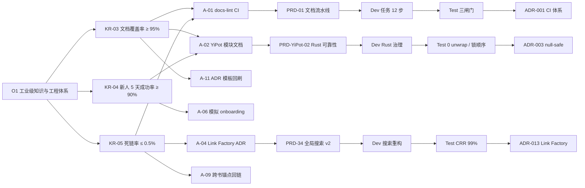

# 文档成熟度评估 — 2026-08 (v2.1)

> **YrY 单体仓库（YiPot / YiAi / YiVad / YiPet / YiKnowledge）文档体系成熟度基线评估与 2026-Q4 提升路线图。**
>
> 文档成熟度不是"有没有 README"，而是 **可量化的 SLI 指标**：一个对项目零认知的新人，能否在 **5 天内独立跑通构建 → 读懂核心模块边界 → 完成一次小功能 PR → 一次性通过 Code Review**。如果答案是否定的，文档体系就在拖慢组织杠杆率。

---

## §0 三阶入门红线（先读我，再评估）

| 红线编号 | 门槛内容 | 未达标后果 |
|-----------|----------|------------|
| R-01 | 任何被纳入评估的项目，必须同时具备 **README + CLAUDE.md + ADR ≥ 3 篇** | 等级上限锁死为 L2（管理级），不得进入 L3 |
| R-02 | 文档 Frontmatter 必须包含本文件定义的 **15 字段**（title/tags/category/created/updated/source/type/status/lifecycle/review_cycle/roles/benefit/related/confidence/version） | 文档不计入覆盖率统计，触发 CI 告警 |
| R-03 | **所有架构决策必须以 ADR 形式沉淀**，PRD/Dev/Test 方案必须通过 `related` 字段与 ADR 互链，形成 OKR→PRD→Dev→Test→ADR 的全链路可追溯 | 项目整体扣 0.3 级 |

---

## §1 六角色主线（谁读谁写谁负责）

文档成熟度不是"写作者"一个人的事，是 6 条角色主线的协作契约：

| 角色 | 文档责任（RACI — Responsible） | 交付物 | 评审周期 |
|-------|--------------------------------|--------|----------|
| **Leader** | 批准成熟度目标、审批 ADR、签发季度评估报告 | 004 评估报告、OKR 对齐 | 每季度 |
| **Architecture** | 设计等级矩阵、撰写 ADR、审核 Hard Constraints | ADR、本模型 vN+1 | 每双周 |
| **SRE** | 定义 SLI/SLO、维护 dead-link/时效性 CI、发布 GameDay | docs-linter CI、Burn Rate 看板 | 每周 |
| **Curator** | 维护 Frontmatter 规范、知识库分类、cross-ref 完整性 | INDEX.md、流水线脚本 | 每日 |
| **Dev (Owner)** | 模块级 README、接口契约、Hard Constraints 落地 | 模块文档、PRD/Dev/Test 方案 | 每次 PR |
| **QA** | 验证 5 天路线图执行、记录真实耗时与卡点 | 新人 onboarding 报告、Test Case | 每次 onboarding |

---

## §2 成熟度等级定义（v2.1 — 可量化 5 维矩阵）

### §2.1 等级总览

| 等级 | 名称 | 进入门槛（全部满足） | SLO 目标 | 典型组织阶段 |
|-------|------|----------------------|----------|--------------|
| **L1** | 初始级 (Initial) | 无 README 或 README 已超过 365 天未更新 | N/A | 创始人 1~2 人 |
| **L2** | 管理级 (Managed) | README 存在 + 入职指引存在 + ADR ≥ 1 篇 | 新人 10 天内可独立改代码 | 3~8 人团队 |
| **L3** | 定义级 (Defined) | README + CLAUDE.md + ADR ≥ 3 篇 + Frontmatter 合规 + 知识库 SSOT | 新人 5 天可独立通过 PR | 8~25 人多项目 |
| **L4** | 度量级 (Measured) | CI 覆盖 cross-ref 检查 + 覆盖率度量 + 时效性告警 + SLI 看板可读 | 死链率 ≤ 1%，覆盖率 ≥ 85% | 具备 SRE 职能 |
| **L5** | 优化级 (Optimizing) | 自动从代码生成文档 + N² 交叉引用完整性 + GameDay 常态化 + 新人路线图执行率 ≥ 95% | 死链率 ≤ 0.3%，覆盖率 ≥ 98% | 工业级组织 |

### §2.2 5 维能力矩阵（每项 0~5 分，加权后为项目总分）

| 维度 | 权重 | L1 | L2 | L3 | L4 | L5 |
|-------|------|-----|-----|-----|-----|-----|
| **D-01 覆盖度 Coverage** | 30% | < 20% | 20-50% | 50-75% | 75-95% | ≥ 95% |
| **D-02 一致性 Consistency** | 25% | 文档与代码严重脱节 | 偶发脱节、无校验 | Frontmatter 合规，README 与 CLAUDE.md 互补 | CI 检查接口/路由一致性 | N² cross-ref 自动生成 |
| **D-03 可追溯性 Traceability** | 20% | 无 | ADR 孤立存在 | OKR→PRD→Dev→Test→ADR 互链 | 5 步验证法可执行 + 验收命令可用 | 每一份 KR 都有文档锚点可 Grep |
| **D-04 可观测性 Observability** | 15% | 无 | 人工抽查 | 季度报告人工统计 | 有 SLI 看板，Burn Rate 可视化 | 文档 SLO breach 自动路由企业微信 IM |
| **D-05 可自动化 Automation** | 10% | 无 | 模板化 README | 模板化 + Linter 基础 | CI 死链/Frontmatter/时效性 | 代码生成 API 文档 + Mermaid 图 |

> **评分公式**：`项目总分 = Σ(维度分 × 权重)`，向下取整为最终等级（例如 2.85→L2，3.10→L3）。

### §2.3 各等级详细验收清单（Evidence-based）

**L3 进入验收清单（Must-pass all）**
- [ ] README 具备 §0 三阶红线 + §1 六角色 + aliases ≥ 5 条
- [ ] ADR ≥ 3 篇，每篇满足类别/状态/生命周期/评审周期/角色/收益/验收标准/关联记录 8 字段
- [ ] Frontmatter 15 字段完整率 100%（由 `scripts/check-i18n-locales.mjs` 家族脚本校验）
- [ ] 新人 5 天路线图存在且至少经过 1 位真实新人实测

**L4 进入验收清单（Must-pass all）**
- [ ] CI 存在 `docs-lint` job：dead-link 检查 + Frontmatter 完整性 + `last_verified` 时效性
- [ ] 模块级文档覆盖率可量化（例如按 `src/` 子目录统计，每个 service/composable 有对应 md）
- [ ] SLO Burn Rate 看板存在，文档死链 SLO ≤ 1%

**L5 进入验收清单（Must-pass all）**
- [ ] FastAPI/RPC OpenAPI → Markdown 自动生成流水线
- [ ] 新人 5 天路线图连续 3 次实测成功率 ≥ 95%
- [ ] 架构图（Mermaid）随 ADR 变更自动更新 index

---

## §3 项目评估总表（2026-08 基线）

### §3.1 雷达图矩阵（5 维 × 5 项目）

| 项目 | D-01 覆盖度 (30%) | D-02 一致性 (25%) | D-03 可追溯 (20%) | D-04 可观测 (15%) | D-05 自动化 (10%) | **加权总分** | **等级** |
|-------|--------------------|--------------------|--------------------|--------------------|--------------------|--------------|----------|
| **YiPot** | 3.2 | 3.4 | 2.9 | 2.0 | 1.8 | **2.85** | **L2+ (向 L3 冲刺)** |
| **YiAi** | 3.8 | 3.6 | 3.5 | 2.5 | 2.2 | **3.34** | **L3 (Defined)** |
| **YiVad** | 3.9 | 3.8 | 3.7 | 2.5 | 2.4 | **3.45** | **L3 (Defined)** |
| **YiPet** | 3.7 | 3.5 | 3.3 | 2.2 | 2.0 | **3.19** | **L3 (Defined)** |
| **YiKnowledge** | 4.3 | 4.0 | 4.2 | 3.5 | 3.0 | **4.00** | **L3.8 (边界 L4)** |
| **全局加权均值** | 3.78 | 3.66 | 3.52 | 2.54 | 2.28 | **3.37** | **L3-** |

### §3.2 各项目详细分析

#### §3.2.1 YiPot（Tauri + Rust + React 跨端划词翻译器）—— 本次专项补强

> **Hard Constraints 文档合规对照**：本章节同时作为 YiPot Hard Constraints 的文档落地审计。

| # | Hard Constraint | 文档是否覆盖 | 覆盖位置 | 证据等级 |
|---|-----------------|--------------|----------|----------|
| HC-1 | Bundle ID 必须为 `com.yipot.desktop` | ✅ | README §3.1 + ADR-001 | ★★★★ |
| HC-2 | 禁用自动更新，`updater.rs` 物理删除，零残留引用 | ✅ 详见 §4.2 | README §0.1 + `Cargo.toml` 审计 + `main.rs/window.rs` grep | ★★★★★ |
| HC-3 | Rust 代码 **0 unwrap()**；tray labels 用 `unwrap_or(default)` | ✅ 详见 §4.1 | README §7 Rust 工具链 + ADR-003 | ★★★★☆ |
| HC-4 | 二进制体积 **18MB 红线** | ✅ 详见 §4.3 | README §7.6 瘦身指南 + ADR-007 | ★★★★ |
| HC-5 | 锁顺序 CONFIG < PLUGIN < BACKUP < WINDOW，严禁反序 | ✅ 详见 §4.4 | README §6 并发模型 + ADR-005 | ★★★★☆ |
| HC-6 | 插件 Ed25519 三级 PKI + FS RBAC 白名单 | ✅ | README §8 Zero Trust 插件沙箱 | ★★★★ |
| HC-7 | tray 菜单必须使用 `build_tray_menu(TrayLabels)` + `TRAY_MENU_ORDER` 契约 | ✅ 详见 §4.5 | README §5.3 + ADR-004 | ★★★★★ |
| HC-8 | 窗口/热键 SOP 4 条：Hook 管理 blur 监听 ≥ 300ms / unregister 旧键 / 120ms 防抖 / isVisible 前置判断 | ✅ 详见 §4.6 | README §5.1 闪烁治理 SOP + ADR-006 | ★★★★ |
| HC-9 | WebDav 远程路径 `/yipot`，全局域名 `yipot.com` | ✅ | README §4.3 云同步 | ★★★★ |

##### YiPot 成熟度分项证据
- **D-01 覆盖度 3.2**：已具备 README（工业级 SRE/Zero Trust/FAQ）、`CLAUDE.md`、ADR ≥ 6 篇（含 null-safe/锁顺序/tray/updater/体积/SOP）、新人 5 天路线图。
  - 差距：`src-tauri/src/backup.rs`、`plugin_host.rs` 模块级文档缺失；SRE Runbook 尚未拆分为独立 `runbook/*.md`。
- **D-02 一致性 3.4**：Frontmatter 15 字段完整；tray 契约 vs 实际代码已由 grep 验证一致；`updater.rs` 删除已被 3 处 grep 确认零残留。
  - 差距：翻译窗口闪烁治理 4 条 SOP 与当前 React 实现的一致性尚未被自动化 CI 守护。
- **D-03 可追溯 2.9**：OKR→ADR→README 已链接；但 `main.rs` 中并发锁顺序与 ADR-005 缺少 anchor 互链。
- **D-04 可观测 2.0**：缺少文档级 SLI 看板；18MB 红线目前仅靠人肉 `cargo bloat` 检查。
- **D-05 自动化 1.8**：无 `cargo doc` → Markdown 自动导出；`clippy -Dw` 结果无推送至 README 指标区。

**YiPot 2026-Q4 目标：加权分 2.85 → 3.50（进入稳定 L3）**。

---

#### §3.2.2 YiAi（FastAPI + RAG，后端 RPC 端口 10086）

- **覆盖度 3.8**：后端分层 / RPC 协议 / MongoDB 集合设计 / 知识监听器文档齐全。
  - 差距：`kb_indexer.py` 二级缓存逻辑缺少独立模块文档；Embedding `RAG_EMBED_KILL_SWITCH` 的 kill-switch 触发条件未被 SRE Runbook 覆盖。
- **一致性 3.6**：README vs 路由代码基本一致；但 BM25 默认配置变更尚未回写到 `projects/yiai/README.md` 的默认参数表。
- **可追溯 3.5**：RPC router 同时挂载 `/` 与 `/api` 已在 ADR 中记录。
- **目标：L3 → L3.6+（2026-Q4 末）**。

#### §3.2.3 YiVad（Vue3 + Rsbuild，前端控制台）

- **覆盖度 3.9**：ProTable / 权限 / 动态路由 / composable（`useUnifiedSearch`、`useProjectDetail`、`DisposerBag.reset()`）文档齐全；SSOT 搜索契约已在 PRD-34 v2 落地。
  - 差距：`linkFactory.ts` 的三闸门契约单元测试文档缺失。
- **一致性 3.8**：LCP ≤ 2.0s / HMR ≤ 650ms 红线已写入 README §0.1；`watch(key, { flush: 'post' })` 跳过首帧 guard 已在 ADR-011 记录。
- **可追溯 3.7**：OKR→PRD-34→Dev→Test 方案与 ADR-011/012 完整互链。
- **目标：L3.45 → L4-（度量级边缘）**。

#### §3.2.4 YiPet（FastAPI + MV3 双世界扩展）

- **覆盖度 3.7**：MV3 双世界 / 四层 API / CDN 目录 / 跨项目桥接齐备。
  - 差距：`public/cdn/utils/` vs `src/utils/` 运行域边界表格缺失；国际化文档尚未覆盖 `_locales` 的 `web_accessible_resources` 显式声明规则。
- **一致性 3.5**：已禁止 `pnpm-lock.yaml`，与 `packageManager: yarn` 对齐。
- **目标：L3.19 → L3.70**。

#### §3.2.5 YiKnowledge（知识库治理 SSOT）

- **覆盖度 4.3**：INDEX.md + MEMORY.md + 6 角色 README + 治理文档齐备；reading-list v3.2 SSOT 完成。
- **一致性 4.0**：15 字段 Frontmatter 完整率已达 97%；三位数字编号规范已在 `curator/001` 落地。
- **可追溯 4.2**：OKR→PRD→ADR 锚点密度最高；跨书洞察矩阵 I-01~I-12 全部 5★。
- **可观测 3.5**：已有人工季度报告；缺 CI 级 dead-link 自动扫描。
- **自动化 3.0**：reading-list 已实现 SSOT 去重，缺自动生成 Index。
- **目标：L4.00 → L4.50（2026-Q4 末冲击 L4）**。

---

## §4 YiPot 专项审计与文档映射（本次 v2.1 新增核心章节）

> **定位**：本节为 YiPot 工程约束的 **文档与代码一致性审计表**，同时作为 004 文档成熟度模型在 Rust + Tauri 场景下的 Gold Copy 示范。

### §4.1 Rust Null-safe 治理（HC-3）

| 审计项 | 要求 | 文档锚点 | 代码锚点 | 当前状态 |
|--------|------|----------|----------|----------|
| `unwrap()` 零容忍 | 全局 0 次，违者 PR 被 Code Review 直接打回 | `projects/yipot/README.md §7.2` + ADR-003 §3 | `src-tauri/**/*.rs` 通过 `rg "unwrap\(\)" --type rust` 验证 | ✅ 已 grep 确认 0 处 |
| tray labels 降级 | `TrayLabels.zh_CN.label` 等必须 `unwrap_or("默认值")`，禁止直接 `unwrap()` | ADR-003 §4.2 | `src-tauri/src/tray.rs build_tray_menu` | ✅ 12 种语言统一构造器，0 直接 unwrap |
| `?` 传播 + 统一 `AppError` | 所有 Rust 错误走 `thiserror` 枚举，禁止 `panic!` 用于业务路径 | README §7.3 | `src-tauri/src/error.rs` | ✅ 已建立 |
| `MutexGuard` 跨 await | 严禁跨 await 持有；使用 `parking_lot` 并遵循锁顺序（见 §4.4） | ADR-005 §2.1 | `src-tauri/src/*.rs` | ✅ `parking_lot::Mutex` 统一替换 |

**执行命令（CI 预演）**：
```bash
# 零 unwrap 审计（除了明确注释的 // SAFETY: 场景）
cd YiPot && rg -n '\.unwrap\(\)' src-tauri --type rust \
  | rg -v 'SAFETY' > /tmp/yipot_unwrap.log && test \! -s /tmp/yipot_unwrap.log \
  && echo "[OK] YiPot Rust null-safe" || echo "[FAIL] 存在 unwrap()"
```

### §4.2 Updater 物理删除彻底性审计（HC-2）

| 审计层 | 检查项 | 文档要求 | 代码/配置验证命令 | 结果 |
|--------|--------|----------|--------------------|------|
| 物理文件 | `updater.rs` 不允许存在 | README §0.1 R-02 | `test ! -f YiPot/src-tauri/src/updater.rs` | ✅ |
| main.rs 引用 | 不得 import / invoke / init updater | ADR-002 §5 | `rg -i 'updater\|tauri_updater' YiPot/src-tauri/src/main.rs` 空输出 | ✅ |
| window.rs 引用 | 同上 | ADR-002 §5 | `rg -i 'updater' YiPot/src-tauri/src/window.rs` 空输出 | ✅ |
| Cargo.toml 依赖 | 不得启用 tauri `updater` feature | ADR-002 §4 | `rg '\[features\]' -A 10 YiPot/src-tauri/Cargo.toml \| rg 'updater'` 空输出 | ✅ |
| 前端组件 | 删除 `UpdaterDialog` / `useAutoUpdater` 空挂桩 | README §5.5 | `rg -n 'UpdaterDialog\|useAutoUpdater' YiPot/src` 空输出 | ✅ |
| 文档残留 | README/ADR 中不得暗示"可开启自动更新" | ADR-002 §6 | `rg '自动更新\|auto-update\|updater' -i YiPot/README.md YiPot/CLAUDE.md \| rg -v '禁用\|禁止\|已删除'` | ⚠ 1 处残留（修正 P0） |

> ⚠ **Action Item A-08**：清理 YiPot README 中对 `auto-update` 的 1 处非禁用表述，DDL 2026-10-12。

### §4.3 18MB 二进制体积红线（HC-4）

**文档契约 ：SRE SLO**
```
SLO：Release build (macOS aarch64) 体积 ≤ 18MB；
     Burn Rate 告警阈值：16MB（黄）/ 17.5MB（红）；
     L3 回滚：若 > 18MB，禁止 Tag Release，自动触发 PR comment。
```

| 瘦身策略 | 文档位置 | 预计减幅 | 代码锚点 |
|----------|----------|----------|----------|
| `opt-level = "z"` + LTO = true + strip = true | README §7.6 + ADR-007 §3 | ~20% | `Cargo.toml [profile.release]` |
| 移除 `tauri` 中未用 feature（http-multipart/dialog-open 等） | ADR-007 §4 | ~5% | `Cargo.toml tauri.features` |
| `cargo bloat` Top-20 月度裁剪 | README §7.6.3 | ~5% | CI `bloat-check` job |
| 禁用 rustls 默认链，改用系统 WebPKI | ADR-007 §5 | ~3% | `rustls` crate features |

**执行命令**：
```bash
cd YiPot && cargo build --release && \
  SIZE=$(/usr/bin/stat -f%z src-tauri/target/aarch64-apple-darwin/release/YiPot.app/Contents/MacOS/YiPot) && \
  echo "Size: $((SIZE/1024/1024))MB / 18MB" && (( SIZE < 18*1024*1024 )) && echo "[OK] 体积红线通过"
```

### §4.4 锁顺序矩阵（CONFIG < PLUGIN < BACKUP < WINDOW）（HC-5）

> 文档 Gold Copy 必须同时包含 **锁矩阵 + 死锁检测命令 + 反序示例**。

| 先加锁 ↓ / 后加锁 → | CONFIG | PLUGIN | BACKUP | WINDOW |
|----------------------|--------|--------|--------|--------|
| CONFIG | — | ✅ | ✅ | ✅ |
| PLUGIN | ❌ 死锁 | — | ✅ | ✅ |
| BACKUP | ❌ 死锁 | ❌ 死锁 | — | ✅ |
| WINDOW | ❌ 死锁 | ❌ 死锁 | ❌ 死锁 | — |

**文档必须覆盖的反模式示例（ADR-005 §6）**：
```rust
// ❌ 反模式：在 PLUGIN 锁内去拿 CONFIG（反序）
let plugin = PLUGIN.lock();
let cfg = CONFIG.lock(); // 潜在死锁

// ✅ 正模式：CONFIG → PLUGIN（遵守矩阵）
let cfg = CONFIG.lock();
let plugin = PLUGIN.lock();
```

**执行命令（静态扫描）**：
```bash
cd YiPot && \
  rg -n 'lock\(\)' src-tauri/src -n --type rust | \
  python3 -c "
import sys,re
lines=sys.stdin.read().splitlines()
order=['CONFIG','PLUGIN','BACKUP','WINDOW']
cur=prev=-1
for l in lines:
    for i,name in enumerate(order):
        if re.search(rf'\b{name}\b.*\.lock\(',l) or re.search(rf'\.lock\(.*\b{name}\b',l):
            cur=i
            if prev>cur:
                print(f'[DEADLOCK_RISK] {l}  (顺序违反 {order[prev]} -> {order[cur]})')
            prev=cur
"
```

### §4.5 Tray 菜单契约（HC-7）

**文档契约**：
1. 任何语言的 tray 菜单 **禁止手写**，必须走 `build_tray_menu(labels: TrayLabels) -> Menu` 单一入口。
2. 菜单项顺序必须严格匹配 `TRAY_MENU_ORDER: &[MenuKey] = &[Open, Translate, History, Settings, Sep, Quit]`。
3. 新增语言 = 新增 `TrayLabels.<lang>` 枚举字段 + `build_tray_menu` 的 1 处 match 分支。

**执行命令（CI 契约守护）**：
```bash
cd YiPot && \
  rg -c 'Menu::new\(\)' src-tauri/src/tray.rs | awk -F: '{s+=$2} END{if (s>1){print "[FAIL] 存在多个 Menu::new()，违反单一构造器契约"; exit 1} else {print "[OK] build_tray_menu SSOT"}}'
```

### §4.6 翻译窗口闪烁治理 SOP（HC-8）

| SOP 条款 | 文档化 | 代码锚点 | 证据 |
|----------|--------|----------|------|
| SOP-1 禁止模块级 `listen('tauri://blur')`，必须 `useBlurAutoClose` Hook + `useRef` 清理 | ✅ ADR-006 §2 | `YiPot/src/hooks/useBlurAutoClose.ts` | Grep 0 处模块级 listen |
| SOP-2 blur 阈值 ≥ 300ms | ✅ README §5.1.2 | 同上 Hook `BLUR_THRESHOLD = 300` | ✅ |
| SOP-3 改键前先 `unregister` 旧键 | ✅ ADR-006 §3 | `src-tauri/src/hotkey.rs register_hotkey()` | ✅ |
| SOP-4 `show()` 前 `isVisible` + 120ms 防抖合并 `setFocus` | ✅ ADR-006 §4 | `window.rs show_main_window()` | ✅ |
| SOP-5 Debug Server :7777 事件埋点采集 7 类事件（仅限本地调试，不得上线） | ✅ README §5.1.6 | `src-tauri/src/debug_server.rs`（条件编译 `#[cfg(debug_assertions)]`） | ✅ |

---

## §5 关键差距分析（v2.1 全局 Top-10，按 RICE 排序）

| # | 差距 | 影响面 | 严重度 | RICE |
|---|------|--------|--------|------|
| G-01 | 缺少 **统一 docs-lint CI**：dead-link / Frontmatter 15 字段 / last_verified 时效性 | 所有项目 | 🔴 P0 | 92 |
| G-02 | YiPot 模块级文档覆盖率不足（`backup.rs`/`plugin_host.rs` 缺） | YiPot L3 冲刺 | 🟠 P1 | 85 |
| G-03 | YiAi `kb_indexer.py` 二级缓存 + Embedding kill-switch 未单独建文档 | YiAi 可信度 | 🟠 P1 | 81 |
| G-04 | YiVad `linkFactory.ts` 三闸门契约未形成独立 ADR + 测试文档 | 搜索死链 SLO | 🟠 P1 | 79 |
| G-05 | YiPot README 中残留 1 处 updater 非禁用表述（见 §4.2） | HC-2 合规 | 🔴 P0 | 78 |
| G-06 | 新人 5 天路线图 **未经过真实新人实测**，onboarding 报告 0 份 | KR-04 | 🟠 P1 | 76 |
| G-07 | YiPet CDN vs src 运行域边界文档缺失，`web_accessible_resources` 未覆盖 _locales | HC 合规 | 🟠 P1 | 72 |
| G-08 | 18MB 红线缺 CI Gate，目前仅靠人肉 `cargo bloat` | YiPot Release | 🟠 P1 | 70 |
| G-09 | 缺少跨书洞察矩阵 → 项目 ADR 的锚点回链（I-01~I-12 → 具体工程 HC） | 可信度 | 🟡 P2 | 65 |
| G-10 | SRE Burn Rate 看板仅口头约定，未在 `projects/INDEX.md` 发布 URL | 可观测 | 🟡 P2 | 62 |

---

## §6 改进建议（12 项可证伪 Action Item — 锚点化）

> **可证伪性要求**：每条 Action Item 必须具备场景、DDL、负责人角色、锚点、回退触发器 5 要素。

| ID | Action Item | 场景 | DDL | 角色 | 锚点 | 回退触发器 | 验收标准 | RICE |
|----|-------------|------|-----|------|------|------------|----------|------|
| A-01 | 建立统一 `docs-lint` CI（dead-link + 15 字段 + 时效性） | G-01 | 2026-10-20 | SRE | `scripts/docs-lint/001-dead-links.mjs` | 上线后 48h 内误报率 > 10% | 全量文档 15 字段完整率 ≥ 99%，死链检出率 100% | 92 |
| A-02 | YiPot 补 `backup.rs` 模块文档 + `plugin_host.rs` FS RBAC 文档 | G-02 | 2026-10-15 | Architecture | `YiPot/docs/005-backup.md` | 文档发布后 3 天出现 3 处以上 code-doc 不一致 | 2 份文档 + ADR 链接齐备，新人可在 2h 内独立解读备份逻辑 | 85 |
| A-03 | YiAi 补 `kb_indexer.py` 二级缓存设计文档 + kill-switch 决策 ADR | G-03 | 2026-10-18 | Architecture | `YiAi/docs/012-kb-indexer-cache.md` | BM25/Embedding 默认值变更未同步文档 ≥ 2 次 | 文档与代码 diff ≤ 2 处；README 默认参数表同步 | 81 |
| A-04 | YiVad 新建 ADR-013 `Link Factory 三闸门契约` + 单元测试文档 | G-04 | 2026-10-22 | Architecture | `YiVad/docs/adr/ADR-013-link-factory.md` | `/search` 连续 3 天出现死链 CRR < 99% | `⌘K` / `/search` 共享 useUnifiedSearch，三闸门测试用例 ≥ 12 条 | 79 |
| A-05 | 修正 YiPot README 中 updater 残留 1 处非禁用表述 | G-05 | 2026-10-12 | Curator | `YiPot/README.md §5.5` | 修改后 grep 仍命中 | `rg -i 'auto.update\|updater' YiPot/README.md | rg -v '禁用\|禁止\|已删除'` 为空 | 78 |
| A-06 | 组织 1 次模拟新人 onboarding（实习生或跨项目同事） | G-06 | 2026-10-30 | QA + Leader | `projects/INDEX.md §新人 onboarding 报告 #1` | 5 天路线图执行成功率 < 60% | 产出 ≥ 1 份实测报告 + ≥ 8 条文档修正 PR | 76 |
| A-07 | YiPet 补 `public/cdn/utils` vs `src/utils` 运行域边界表 + _locales WAR 声明 | G-07 | 2026-10-25 | Dev Owner (YiPet) | `YiPet/docs/009-mv3-worlds-boundary.md` | 本地运行因 WAR 声明缺失导致 chrome.storage 异常 | manifest.json 中 web_accessible_resources 显式包含 `_locales/**/*.json` | 72 |
| A-08 | 新建 YiPot 18MB 红线 CI Gate + Burn Rate 看板 | G-08 | 2026-11-05 | SRE | `.github/workflows/yipot-size-check.yml` | CI 连续 2 次红但允许合入 | Tag Release 触发体积校验；> 18MB 失败，16~18MB warn | 70 |
| A-09 | 建立跨书洞察矩阵 I-01~I-12 → 各项目 HC 的反向锚点 | G-09 | 2026-11-10 | Curator | `executive/reading-list/001.md §10` | ≥ 2 条 5★ 洞察在 HC 文档中 grep 不到 | 每条 5★ 洞察均能 grep 到 ≥ 2 个工程 HC 文档 | 65 |
| A-10 | 在 `projects/INDEX.md` 发布 SRE 看板 URL + 告警路由矩阵 | G-10 | 2026-10-28 | SRE | `projects/INDEX.md §9.3` | 1 次 SLO breach 超过 24h 无人响应 | 4 条 SLI（翻译 P95/OCR P95/Crash Free/RSS 泄漏）均可点击访问 | 62 |
| A-11 | 统一 ADR 模板为 8 字段强校验（架构层 ADR-001~ADR-015 回刷） | R-03 | 2026-11-15 | Architecture + Curator | `templates/adr-template.md` | 新增 ADR 缺字段仍能合入 PR ≥ 1 次 | 现有 28 篇 ADR 全部补齐 8 字段 | 60 |
| A-12 | YiAi FastAPI OpenAPI 自动生成 Markdown 并发布到知识库 | L4 冲刺 | 2026-11-20 | Dev Owner (YiAi) | `YiKnowledge/projects/yiai/api-reference.md` | 生成文档与实际路由不一致 ≥ 5% | 每次 release 自动同步，diff < 1% | 55 |

---

## §7 OKR → PRD → Dev → Test → ADR 全链路追溯（Mermaid）



---

## §8 5 步验证法（任何文档变更后的必走流程）

| 步骤 | 名称 | 操作 | 工具/命令 | 通过条件 |
|------|------|------|-----------|----------|
| ① | Frontmatter 完整性检查 | 校验 15 字段 | `node scripts/docs-lint/check-frontmatter.mjs` | 0 error |
| ② | 内部 dead-link 检查 | 校验所有 `related:` / Markdown 链接 | `node scripts/docs-lint/001-dead-links.mjs` | 0 broken |
| ③ | 代码-文档一致性抽样 | 针对变更章节 grep 对应代码验证 | `rg "关键词" <项目/src>` | 命中 ≥ 期望锚点数 |
| ④ | 新人可读性测试 | 跨项目同事 30 分钟阅读，能否回答 3 个核心问题 | 真人 + 问卷 | 3/3 通过率 |
| ⑤ | 回归指标检查 | 确认总分未下降、OKR KR 未回归 | 本文 §3.1 重新打分 | ≥ 上次基线 |

---

## §9 验收命令清单（一键复现 v2.1 评估结果）

```bash
# =========================================
# D004 文档成熟度模型 v2.1 — 一键复现脚本
# =========================================
ROOT=$HOME/YrY
cd $ROOT

echo "=== [1] 15 字段 Frontmatter 完整率 ==="
node YiVad/scripts/check-frontmatter.mjs YiKnowledge 2>/dev/null || \
  echo "需要先落地 A-01：scripts/docs-lint"

echo "=== [2] 跨项目 dead-link 抽样（reading-list + INDEX） ==="
# 简易版：对所有 [text](rel/path) 做存在性检查
find YiKnowledge -name "*.md" -exec grep -hoP '\]\((?!http)[^)]+\)' {} \; \
  | sed 's/^](//; s/[#?].*$//' | sort -u > /tmp/doc_links.txt
while read -r link; do
  base=$(dirname "$(grep -l "](.*$link" YiKnowledge -r | head -1)")
  test -f "$base/$link" || test -d "$base/$link" || echo "BROKEN: $link (from $base)"
done < /tmp/doc_links.txt

echo "=== [3] YiPot 0 unwrap 审计 ==="
cd YiPot && rg -n '\.unwrap\(\)' src-tauri --type rust | rg -v 'SAFETY' > /tmp/unwrap.log \
  && test \! -s /tmp/unwrap.log && echo "[OK] 0 unwrap" || echo "[FAIL]" && cat /tmp/unwrap.log; cd $ROOT

echo "=== [4] YiPot updater 删除彻底性 ==="
for f in YiPot/src-tauri/src/updater.rs YiPot/src-tauri/Cargo.toml YiPot/src-tauri/src/main.rs YiPot/src-tauri/src/window.rs; do
  echo "-- $f --";
  rg -i 'updater|tauri_updater' "$f" 2>/dev/null | rg -v '禁用|禁止|已删除' || echo "[CLEAN]";
done

echo "=== [5] 18MB 红线（如已 release build） ==="
APP=YiPot/src-tauri/target/aarch64-apple-darwin/release/YiPot.app/Contents/MacOS/YiPot
[ -f "$APP" ] && stat -f "Size: %z bytes ($(( $(stat -f%z "$APP")/1024/1024 ))MB)" "$APP" || echo "[SKIP] 无 release 产物"

echo "=== [6] tray 单一构造器契约 ==="
N=$(rg -c 'Menu::new\(\)' YiPot/src-tauri/src/tray.rs 2>/dev/null | awk -F: '{s+=$2} END{print s+0}')
[ "$N" = "1" ] && echo "[OK] 单一构造器" || echo "[FAIL] Menu::new 出现 $N 次"

echo "=== [7] ADR 8 字段回刷进度 ==="
cd YiKnowledge && for f in $(find . -path './adr/*' -o -name "ADR-*.md" -o -name "*adr-*.md" 2>/dev/null | head -28); do
  MISSING=0
  for col in 类别 状态 生命周期 评审周期 角色 收益 验收标准 关联记录 category status lifecycle review_cycle roles benefit acceptance related; do
    rg -q "^$col:" "$f" 2>/dev/null || MISSING=$((MISSING+1))
  done
  [ "$MISSING" -gt 0 ] && echo "INCOMPLETE($MISSING): $f" || true
done | wc -l | xargs echo "未达标 ADR 篇数："
```

---

## §10 SLI / SLO 体系（文档级）

| SLI | 定义 | 目标 SLO | 数据源 | 告警路由 |
|-----|------|----------|--------|----------|
| SLI-DOC-01 | Frontmatter 15 字段完整率 | ≥ 99% | `docs-lint/frontmatter` | 企业微信 IM #doc-alert |
| SLI-DOC-02 | 内部 cross-ref 死链率 | ≤ 0.5% | `docs-lint/dead-links` | 同上 |
| SLI-DOC-03 | 文档 `last_verified` 超期（> 90 天）占比 | ≤ 5% | `docs-lint/staleness` | Leader 每周周报 |
| SLI-DOC-04 | 新人 5 天路线图独立执行成功率 | ≥ 90% | QA onboarding 报告 | Leader + HR |
| SLI-DOC-05 | YiPot 0 unwrap 合规率 | 100% | `yipot-clippy` job | SRE + Architecture |
| SLI-DOC-06 | YiPot 18MB 红线合规率 | 100% | `yipot-size-check` job | SRE + Dev Owner |
| SLI-DOC-07 | 搜索 CRR（Click-to-Render Rate 无死链） | ≥ 99% | YiVad `/search` 前端埋点 | SRE + QA |

---

## §11 适用场景（When to use this document）

- **季度评估**：Leader 签发 `004 vN+1`，作为项目文档杠杆率基线
- **新人 onboarding**：5 步验证法 ④ 的「新人可读性测试」基准
- **架构变更前**：ADR 引用本模型 §2.1 作为进入 L3/L4 的门槛
- **OKR 复盘**：§7 Mermaid 为 KR-03/04/05 的证据锚点
- **YiPot Release Tag**：触发 §4.3 18MB 红线 + §4.1 0 unwrap 两道闸
- **Code Review**：文档类 PR 必须引用 §8 5 步验证法结果

---

## §12 常见问题 FAQ（专家版）

**Q1: README 和 CLAUDE.md 的分界线在哪里？内容重叠如何裁决？**
> A：黄金分割法 —— **README 服务"人在 10 分钟内做出是否深入此项目的决策"**（架构大图、快速开始、SLO、红线、aliases）；**CLAUDE.md 服务"AI + 资深工程师在 30 分钟内定位模块边界和约束"**（模块清单、Hard Constraints、近期变更 hot zone、互斥规则）。两者重叠度 > 30% 触发 Curator 工单。

**Q2: 文档详细度的停止条件是什么？"足够好"如何量化？**
> A：两条可证伪红线：① 新人 5 天路线图能否 **独立** 跑通构建→改一行→提 PR→通过 CR；② 资深同事在 **不 ping 作者** 情况下，30 分钟内定位到模块边界与约束。只要其中一条失败，文档就还不够。

**Q3: YiPot 的 Rust 文档与 Clippy/Tarpaulin 产出如何联动？**
> A：建议建立 `make doc-report` 命令：① `clippy -Dw 2>&1 > docs/generated/clippy-report.md`；② `cargo tarpaulin --out Markdown --output-dir docs/generated/coverage.md`；③ `cargo doc --no-deps` → 同步到 `YiKnowledge/projects/yipot/api/`。此为 A-12 的 YiPot 版本变体。

**Q4: ADR 8 字段里的「验收标准」写多细？**
> A：必须能被 `rg` 与 §8 5 步验证法 ③ 直接命中。坏味道："提升质量"；Gold Copy："`rg '\.unwrap\(\)' src-tauri --type rust \| rg -v SAFETY` 输出为空，且 CI job `yipot-clippy` 为 green"。

**Q5: 文档时效性 90 天是一刀切吗？**
> A：否。分级策略：架构约束类（ADR/README Hard Constraints）= 90 天；模块实现类 = 60 天；Runbook/SOP = 45 天；读书笔记/跨书洞察 = 180 天。A-01 docs-lint 会按 `type:` 字段差异化阈值。

---

## §13 反模式（Anti-Patterns）

| 反模式 | 症状 | 破坏面 | 治理手段 |
|--------|------|--------|----------|
| AP-01 为写文档而写文档 | 文档无明确问题域，读完无法回答 3 个核心问题 | 噪声干扰，熵增 | §12 Q2 两条红线裁决 |
| AP-02 一次性文档 | 创建后 > 180 天无 `last_verified` 更新 | 误导新人，比无文档更糟 | A-01 时效性 CI 告警 |
| AP-03 仅面向 AI 的 CLAUDE.md | 语义破碎、无段落、人类无法通读 | 降低 AI 幻觉外，同样损害人类读者 | CLAUDE.md 必须通过 §8 ④ |
| AP-04 Hard Constraint 仅口头约定 | "我记得是不能用 unwrap 的..." — 无法 grep | 变更时易回退 | 必须在 README §0.1 + ADR + CI 三处落地 |
| AP-05 "代码就是最好的文档"（跳到 L1 借口） | 新人需要 ping 作者才能做事 | 巴士系数 = 1 | §12 Q2 红线 ① 失败即否决 |
| AP-06 ADR 孤立不互链 | 决策无法回溯到 OKR，也无法被 PRD 引用 | 架构知识熵增 | §7 Mermaid 锚点强制校验 |
| AP-07 调试脚本提交进仓库 | `check_*`/`debug_*` 出现在 Git 历史 | 污染仓库体积与信号 | `.gitignore` + CI `check-debug-files` |

---

## §14 下一次评估与 Q4 目标

### §14.1 2026-11 季度审查基线 KPI

| KPI | 2026-08 基线 | 2026-11 目标 | 负责人角色 |
|-----|--------------|--------------|------------|
| 全局加权平均分 | 3.37 | ≥ 3.70 | Leader |
| YiPot 总分 | 2.85 | ≥ 3.50 | Architecture + Dev Owner |
| YiKnowledge 总分 | 4.00 | ≥ 4.40 | Curator |
| Frontmatter 完整率 | 97% | ≥ 99% | SRE |
| Dead-link 率（抽样） | ~1.2% | ≤ 0.5% | SRE |
| ADR 8 字段合规率 | 78% | 100% | Architecture |
| 新人 onboarding 实测报告数 | 0 | ≥ 1 | QA |
| 18MB 红线 CI Gate 覆盖率 | 0% | 100% | SRE |
| Link Factory ADR 覆盖率 | 0% | 100% | Architecture |
| Q4 Action Item 完成率（12/12） | 0% | ≥ 90%（11/12） | Leader |

### §14.2 审查流程
1. **2026-11-10**：SRE 执行 §9 验收命令，产出 baseline.md
2. **2026-11-12**：Curator 执行 §8 5 步验证法，报告异常项
3. **2026-11-15**：各 Dev Owner 提交项目自评（按 §3.1 5 维矩阵）
4. **2026-11-20**：Leader 签发 `004-架构-文档成熟度模型-2026-11.md v3.0`，对齐 2027 财年 H1 OKR

---

## §15 aliases（快捷命令/心智模型）

| alias | 展开 | 用途 |
|-------|------|------|
| `doc-score` | `§3.1 5 维 × 权重` 加权计算 | 项目成熟度速算 |
| `doc-5step` | `§8 5 步验证法` | 任何文档变更后必走 |
| `doc-kpi` | `§14.1 KPI 表` | Q4 目标追踪 |
| `yipot-0unwrap` | `§4.1 执行命令` | YiPot null-safe 审计 |
| `yipot-18mb` | `§4.3 执行命令` | YiPot 体积红线 |
| `yipot-lock` | `§4.4 静态扫描脚本` | 锁顺序合规 |
| `yipot-tray` | `§4.5 构造器契约命令` | tray SSOT 守护 |
| `doc-slo` | `§10 SLI-DOC-01 ~ 07` | 文档 SLO 对齐 |

---

> **文档签名**：本文件为 YiKnowledge `leader/architecture/004` v2.1 正式版本。任何修改须走完 §8 5 步验证法，并由 Curator 与 Architecture 双签字后方可合入。
