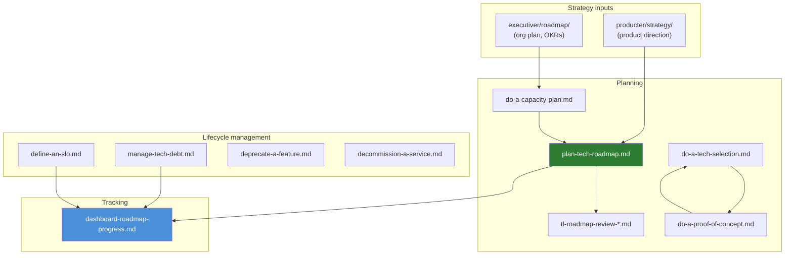

# Tech Lead — Roadmap

> **As a** tech lead, **I want to** find roadmap planning guides and tech debt management procedures, **so that** I can plan, prioritize, and execute the engineering roadmap.

Covers roadmap planning, capacity management, tech selection, PoCs, tech debt, SLOs, and service lifecycle management.

## Contents

| Section | Description |
|---|---|
| [Quick start](#quick-start-which-document-when) | Common planning needs → right document |
| [Scope](#scope) | What's in and out of this directory |
| [File inventory](#file-inventory) | All 10 documents with descriptions |
| [Document relationships](#document-relationships) | How documents connect across the planning lifecycle |
| [Roles & who uses what](#roles--who-uses-what) | Which role owns which document |
| [Frontmatter template](#frontmatter-template) | YAML frontmatter for new files |
| [Anti-patterns](#anti-patterns) | Common mistakes and what to do instead |
| [When to review](#when-to-review) | Trigger → action table |
| [Related leaves](#related-leaves) | Cross-references to other knowledge base leaves |

## Quick start: which document when?

| Planning need | Start here | Output |
|---|---|---|
| "We need to plan the engineering roadmap" | [Plan Tech Roadmap](./plan-tech-roadmap.md) | Sequenced roadmap with capacity allocation |
| "How much capacity do we actually have?" | [Do a Capacity Plan](./do-a-capacity-plan.md) | Person-week estimate with overhead breakdown |
| "Q4 planning is coming — what do I need?" | [TL Roadmap Review Q4 Preview](./tl-roadmap-review-2026-q4-preview.md) | Q3 actuals + Q4 preview template |
| "Should we use X or Y technology?" | [Do a Tech Selection](./do-a-tech-selection.md) | Weighted criteria matrix + PoC recommendation |
| "Can we do X? Let's test it quickly" | [Do a Proof of Concept](./do-a-proof-of-concept.md) | One-page PoC report with go/no-go |
| "Tech debt is slowing us down" | [Manage Tech Debt](./manage-tech-debt.md) | Classified, prioritized tech debt register |
| "We need reliability targets" | [Define an SLO](./define-an-slo.md) | SLIs, SLOs, error budget, alerting rules |
| "This feature is dead weight — let's remove it" | [Deprecate a Feature](./deprecate-a-feature.md) | Timeline, migration path, communication plan |
| "This service needs to be shut down" | [Decommission a Service](./decommission-a-service.md) | Dependency map, phased migration, cleanup |
| "Show me the big picture" | [Dashboard — Roadmap Progress](./dashboard-roadmap-progress.md) | Capacity, delivery, debt, SLO, risk at a glance |

## Scope

- Engineering roadmap planning and sequencing
- Capacity estimation and allocation
- Technology evaluation and selection
- Proof-of-concept spike methodology
- Tech debt identification, classification, and reduction
- Service Level Objective (SLO) definition
- Feature deprecation and service decommissioning

**Out of scope** (see related leaves):
- Architecture patterns and tech maturity models → [../architecture/](../architecture/)
- Architecture Decision Records (ADRs) → [../decisions/](../decisions/)
- Risk register and incident postmortems → [../risk/](../risk/)
- Executive-level planning and OKRs → [../../executiver/roadmap/](../../executiver/roadmap/)
- Product strategy and roadmaps → [../../producter/strategy/](../../producter/strategy/)

## File inventory

### Roadmap & planning (5)

| File | Description | Status |
|---|---|---|
| [plan-tech-roadmap.md](./plan-tech-roadmap.md) | Tech roadmap planning — 4-category work breakdown, sequencing, stakeholder communication | ✅ |
| [tl-roadmap-review-2026-q4-preview.md](./tl-roadmap-review-2026-q4-preview.md) | Q4 2026 roadmap preview — Q3 actuals template, capacity outlook, planning timeline | ✅ |
| [do-a-capacity-plan.md](./do-a-capacity-plan.md) | Capacity planning — raw-to-net calculation, overhead estimation, quarterly calibration | ✅ |
| [do-a-tech-selection.md](./do-a-tech-selection.md) | Technology selection — weighted criteria, PoC validation, ADR documentation | ✅ |
| [do-a-proof-of-concept.md](./do-a-proof-of-concept.md) | PoC spike methodology — time-boxed, success criteria, one-page report | ✅ |

### Tech debt & lifecycle (4)

| File | Description | Status |
|---|---|---|
| [manage-tech-debt.md](./manage-tech-debt.md) | Tech debt management — 5-type classification, cost quantification, ROI prioritization | ✅ |
| [define-an-slo.md](./define-an-slo.md) | SLO definition — SLI selection, error budget, burn-rate alerting | ✅ |
| [deprecate-a-feature.md](./deprecate-a-feature.md) | Feature deprecation — announce/warn/remove phases, migration path, communication plan | ✅ |
| [decommission-a-service.md](./decommission-a-service.md) | Service decommissioning — dependency discovery, 5-phase migration, cleanup checklist | ✅ |

### Dashboard (1)

| File | Description | Status |
|---|---|---|
| [dashboard-roadmap-progress.md](./dashboard-roadmap-progress.md) | Roadmap progress dashboard — capacity, delivery, tech debt, SLO, risk sections | ✅ |

## Document relationships



## Roles & who uses what

| Role | Primary documents | Why |
|---|---|---|
| **Leader (TL)** | [Plan Tech Roadmap](./plan-tech-roadmap.md), [Capacity Plan](./do-a-capacity-plan.md), [Manage Tech Debt](./manage-tech-debt.md) | Owns engineering planning and execution |
| **Leader (Infra)** | [Define an SLO](./define-an-slo.md), [Decommission a Service](./decommission-a-service.md) | Owns reliability and infrastructure lifecycle |
| **Leader + Producter** | [Tech Selection](./do-a-tech-selection.md), [PoC](./do-a-proof-of-concept.md), [Deprecate a Feature](./deprecate-a-feature.md) | Joint decisions on technology and feature lifecycle |
| **All roles** | [Dashboard](./dashboard-roadmap-progress.md) | Visibility into roadmap progress |

## Frontmatter template

```yaml
---
title: Some Roadmap Document
tags: [roadmap, topic, leader]
created: YYYY-MM-DD
updated: YYYY-MM-DD
last_verified: YYYY-MM-DD
source: <link or internal>
type: summary
lifecycle: reference
review_cycle: quarterly
related:
  - ./plan-tech-roadmap.md
  - ../README.md
  - ../INDEX.md
---
```

## Anti-patterns

| Anti-pattern | Why it fails | Fix |
|---|---|---|
| 100% feature work, 0% tech investment | Tech debt grows; velocity declines | [Plan Tech Roadmap](./plan-tech-roadmap.md): protect 20–30% for tech investment |
| Capacity plan assumes 100% utilization | No buffer; every surprise causes a miss | [Do a Capacity Plan](./do-a-capacity-plan.md): leave 10–15% buffer |
| Tech debt register with no prioritization | Backlog grows into a graveyard | [Manage Tech Debt](./manage-tech-debt.md): monthly review; delete items that will never be fixed |
| SLOs without error budgets | No mechanism to balance reliability vs. velocity | [Define an SLO](./define-an-slo.md): error budget policy is the core output |
| Deprecation without warning | Users are surprised and angry | [Deprecate a Feature](./deprecate-a-feature.md): minimum 30 days notice |
| Decommissioning without dependency discovery | Orphaned callers break after shutdown | [Decommission a Service](./decommission-a-service.md): spend 50% of project time on discovery |

## When to review

| Trigger | Action |
|---|---|
| Start of quarter | Run [do-a-capacity-plan.md](./do-a-capacity-plan.md) → [plan-tech-roadmap.md](./plan-tech-roadmap.md) |
| End of quarter | Run [tl-roadmap-review-*.md](./tl-roadmap-review-2026-q4-preview.md); update [dashboard](./dashboard-roadmap-progress.md) |
| Considering new technology | Run [do-a-tech-selection.md](./do-a-tech-selection.md) → [do-a-proof-of-concept.md](./do-a-proof-of-concept.md) |
| Velocity declining | Review [manage-tech-debt.md](./manage-tech-debt.md); check capacity allocation |
| New service to production | Run [define-an-slo.md](./define-an-slo.md) |
| Feature to be removed | Run [deprecate-a-feature.md](./deprecate-a-feature.md) |
| Service to be shut down | Run [decommission-a-service.md](./decommission-a-service.md) |
| Weekly | Update [dashboard](./dashboard-roadmap-progress.md) sections 1, 2, 5 |

## Related leaves

| Leaf | Relevance |
|---|---|
| [../../executiver/roadmap/](../../executiver/roadmap/) | Executive-level planning — feeds into tech roadmap |
| [../../executiver/strategy/](../../executiver/strategy/) | Business strategy frameworks — informs product priorities |
| [../../producter/strategy/](../../producter/strategy/) | Product strategy — aligns product direction with tech roadmap |
| [../architecture/](../architecture/) | Architecture patterns — referenced in tech selection and ADRs |
| [../decisions/](../decisions/) | ADRs — where tech selection decisions are documented |
| [../risk/](../risk/) | Risk management — incident postmortems feed into tech debt register |
| [../INDEX.md](../INDEX.md) | Leader role index — all leader subdirectories |