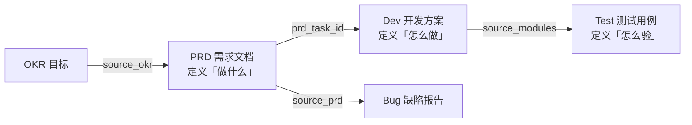

# 项目知识中心

> 4 个项目，1,200+ 知识文件。项目特定的需求、方案、测试、缺陷和规范均存放于此。本文档提供总览、导航和追溯模型。完整文件清单见 [INDEX.md](./INDEX.md)。

---

## 追溯模型

所有项目采用统一的 **OKR → PRD → Dev → Test** 全链路追溯，确保每个交付物可定位到其需求来源：



**规则：**
- 每个 **PRD** 的 `source_okr` 关联到 OKR 目标
- 每个 **Dev** 的 `prd_task_id` 关联到 PRD 需求编号
- 每个 **Bug** 的 `source_prd` 关联到来源 PRD
- 每个 **Test** 的 `source_modules` 关联到 Dev 模块

---

## 项目总览

| 项目 | 定位 | 技术栈 | 知识产物 |
|------|------|--------|---------|
| [YiVad](./yivad/) | Vue 3.5 管理后台 | Vue 3.5 + Rsbuild + Pinia + Element Plus | [OKR](./yivad/okrs/) · [PRD](./yivad/prds/) · [Dev](./yivad/devs/) · [Test](./yivad/tests/) · [Bug](./yivad/bugs/) · [Workflow](./yivad/workflows/) |
| [YiAi](./yiai/) | FastAPI 后端 | FastAPI + MongoDB + Ollama + llama_index | [PRD](./yiai/prds/) · [Dev](./yiai/devs/) · [Test](./yiai/tests/) · [Bug](./yiai/bugs/) · [Workflow](./yiai/workflows/) |
| [YiPet](./yipet/) | Chrome MV3 扩展 | Vue 3.5 + Chrome MV3 + Rsbuild | [PRD](./yipet/prds/) · [Dev](./yipet/devs/) · [Test](./yipet/tests/) · [Bug](./yipet/bugs/) · [Workflow](./yipet/workflows/) |
| [YiKnowledge](./yiknowledge/) | 知识库 | Markdown + YAML Frontmatter | [PRD](./yiknowledge/prds/) · [Bug](./yiknowledge/bugs/) · [Workflow](./yiknowledge/workflows/) |

### 项目职责

| 项目 | 核心职责 | 关键模块 |
|------|---------|---------|
| **YiVad** | 管理后台 SPA——ProTable 驱动、动态路由、按钮级权限，17 个功能页面 | 项目管理、Issue 追踪、Bug 看板、AI 聊天、知识库、RAG 检索、RSS、全局搜索 |
| **YiAi** | AI 后端——所有前端的唯一数据源，RPC 信封路由、SSE 流式、RAG 引擎、Agent 循环 | 聊天服务、数据服务、文件服务、知识库、RAG、RSS、Agent、认证 |
| **YiPet** | 浏览器扩展——页面注入交互式宠物伴侣，4 层 API 架构，跨项目桥接 YiVad | Content Script、Service Worker、聊天窗口、浮动宠物、Popup |
| **YiKnowledge** | 知识库——7 个角色目录、5 个流水线阶段，YiAi RAG 数据源 | 知识治理、工程实践、技术决策、产品需求、AI 赋能 |

---

## 近期动态（2026-09）

| 项目 | 状态 | 重点工作 |
|------|------|---------|
| **YiVad** | 活跃开发 | 项目页面全量重构（God Component → composable + 组件拆分），17 个子页面架构优化 |
| **YiAi** | 稳定迭代 | RAG 增量刷新缺陷修复、GraphQL 联邦层设计、Agent 可靠性增强 |
| **YiPet** | 稳定维护 | 安全合规加固、NativeMessaging 探索 |
| **YiKnowledge** | 活跃治理 | 跨项目模板标准化、知识生命周期治理、文件命名规范化 |

---

## 每项目知识结构

```
projects/<项目名>/
├── README.md           # 项目知识库索引（快速导航、约束速查、技术栈速查）
├── okrs/               # OKR 目标与关键结果（按季度归档）
│   └── {quarter}/
│       ├── README.md               # OKR → PRD 可追溯矩阵
│       └── goal-NNN-{描述}.md      # OKR 目标文件
├── prds/               # 产品需求 PRD（按月归档）
│   ├── 模板/                        # PRD 模板
│   └── {month}/
│       ├── 00-prd-{迭代总览}.md    # 迭代总览
│       └── NN-prd-{描述}.md        # 子需求 PRD
├── devs/               # 开发方案（按月归档）
│   ├── 模板/                        # Dev 模板
│   └── {month}/
│       └── NN-prd-task-{描述}.md   # 开发方案
├── tests/              # 测试用例（按月归档）
│   ├── 模板/                        # Test 模板
│   └── {month}/
│       └── NN-prd-test-{描述}.md   # 测试用例
├── bugs/               # 缺陷报告（按分类子目录归档）
│   ├── README.md                   # 缺陷索引
│   └── {分类}/
├── workflows/          # 开发指南 + 工作流（流程规范/操作指南/开发规范）
└── requires/           # 需求文档（原始需求，YiVad 专用）
```

---

## 文档模板

| 文档类型 | YiAi 模板 | YiVad 模板 | YiPet 模板 |
|---------|----------|-----------|-----------|
| PRD 需求文档 | [模板](./yiai/prds/模板/00-模板-需求文档.md) | YiVad 使用统一 PRD 格式 | [模板](./yipet/prds/模板/00-模板-需求文档.md) |
| Dev 开发方案 | [模板](./yiai/devs/模板/00-模板-开发方案.md) | — | [模板](./yipet/devs/模板/00-模板-开发方案.md) |
| Test 测试用例 | [模板](./yiai/tests/模板/00-模板-测试规格.md) | — | [模板](./yipet/tests/模板/00-模板-测试规格.md) |
| Bug 缺陷报告 | [模板](./yiai/bugs/2026-09/模板/00-模板-项目bug模板.md) | — | [模板](./yipet/bugs/2026-09/模板/00-模板-扩展bug模板.md) |

---

## 导航入口

| 入口 | 适用场景 |
|------|---------|
| [INDEX.md](./INDEX.md) | 查看所有项目完整文件清单（按项目 × 分类矩阵） |
| [yivad/README.md](./yivad/README.md) | YiVad 知识库：新人入门、日常开发、代码审查、约束速查 |
| [yiai/README.md](./yiai/README.md) | YiAi 知识库：新人入门、日常开发、代码审查、约束速查 |
| [yipet/README.md](./yipet/README.md) | YiPet 知识库：新人入门、日常开发、代码审查、约束速查 |
| [yiknowledge/README.md](./yiknowledge/README.md) | YiKnowledge 项目知识：知识治理、RAG 集成 |
| [../INDEX.md](../INDEX.md) | 知识库顶层索引（角色目录 + 流水线阶段） |

---

## 跨项目关联

- [../../CLAUDE.md](../../CLAUDE.md) — 单体仓库级 CLAUDE.md（RPC 协议、跨项目关系）
- [../../YiAi/CLAUDE.md](../../YiAi/CLAUDE.md) — YiAi 项目约束与近期变更
- [../../YiVad/CLAUDE.md](../../YiVad/CLAUDE.md) — YiVad 项目约束与近期变更
- [../../YiPet/CLAUDE.md](../../YiPet/CLAUDE.md) — YiPet 项目约束与近期变更
- [../engineer/learn/projects/](../engineer/learn/projects/) — 工程类项目文档（架构、开发规范、技术方案）
- [../leader/decisions/](../leader/decisions/) — 架构决策记录（按项目分组）