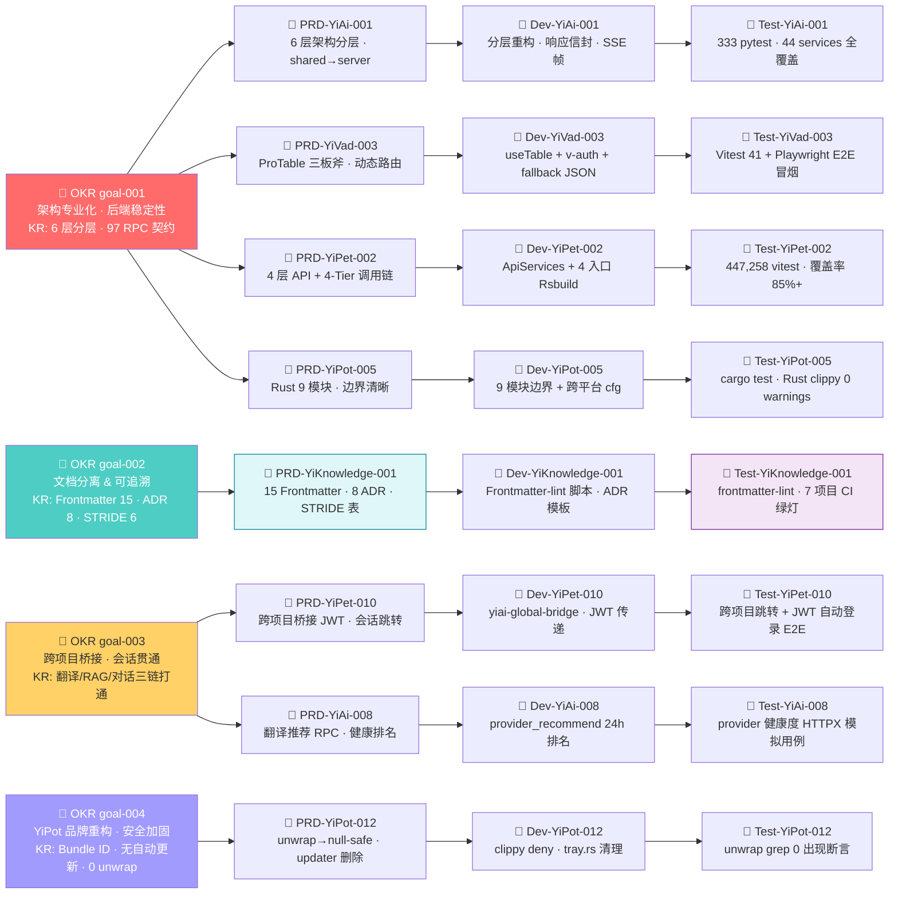

# Yi Family 项目总览知识库

> **5 大项目 · 全链路对齐 · 2,460+ 知识产物**。本页为 `YiKnowledge/projects/` 总入口——提供 5 个项目的职责划分、OKR 到测试用例的全链路追溯模型、2026-Q3/Q4 里程碑动态、通用文档模板、以及高频决策 ADR 索引。子项目详情请跳转各自 README。

---

## 0. 快速导航（5 大项目一键进入）

| # | 项目 | 核心定位 | 技术栈主线 | 知识产物数 | 入口 |
|---|------|---------|-----------|-----------|------|
| 001 | **YiAi** | AI 中枢后端：RPC 总线 · RAG 检索 · SSE 流式会话 · 翻译健康度 | FastAPI · MongoDB · Redis · Milvus | **1,004+** | [进入 →](./yiai/README.md) |
| 002 | **YiVad** | 管理中枢台：ProTable 19 模块 · 动态路由 · 看板仪表盘 · E2E | Vue 3.5 · Pinia · Rsbuild · Element Plus · Playwright | **316+** | [进入 →](./yivad/README.md) |
| 003 | **YiPet** | 浏览器端增强：跨世界 IPC · 翻译 + 划词 + 插件桥接 · 会话跳转 | Chrome MV3 · Vue 3.5 · Pinia · Rsbuild 4 入口 | **860+** | [进入 →](./yipet/README.md) |
| 004 | **YiPot** | 桌面端翻译：3 模式 · 截图 OCR · 36 插件化服务 · WebDAV 备份 | Tauri 1.6 · Rust · React 18 · Jotai · NextUI | **281+** | [进入 →](./yipot/README.md) |
| 005 | **YiKnowledge** | 知识库规范中心：Frontmatter 15 字段 · ADR 8 字段 · STRIDE 威胁 · RAG 链路 | 纯文档规范 · 7 角色 × 5 阶段 × 双读者矩阵 | **> 2,460 聚合** | [进入 →](./yiknowledge/README.md) |

---

## 1. 5 项目职责矩阵（无重叠 · 无空白）

| 功能域 / 能力 | YiAi 后端（RPC/RAG/SSE）| YiVad 管理台（UI）| YiPet 浏览器扩展 | YiPot 桌面翻译 | YiKnowledge 规范中心 |
|--------------|--------------------------|--------------------|-------------------|---------------|---------------------|
| **RPC 信封协议** `POST / (module, method, params)` | ✅ **服务端实现** · 44 领域 services + 3 层 middleware | ✅ callService 客户端 · RequestHttp | ✅ 后端调用（SW）· Bridge 同步菜单/会话 | ✅ Tauri invoke → YiAi HTTP 客户端 | ✅ 规范文档 · 参数命名契约表 |
| **数据存储**（MongoDB 47 集合 + Milvus 向量）| ✅ **数据层实现** shared/data/models/domain/services/server | ✅ 消费（只读 / 写通过 API）| ✅ 消费（只读）| ✅ 本地 SQLite 生词本 · 不直接写 MongoDB | ✅ 设计规范 · 命名约束 |
| **RAG 检索增强**（KB + RSS + 向量 + BM25）| ✅ **引擎实现** · `/rag-build` 手动 · 3000ms 节流 · `RAG_EMBED_KILL_SWITCH` 默认 ON | ✅ `/project/{key}/rag` UI 面板 · `projectId` 严格透传 | ✅ `/chat/{cid}?rag=1` · AI 面板桥接 RAG | ✅ 检索（可选调用 `/ai/chat` + `rag=true`）| ✅ 4 源 1 汇 ASCII 链路图 · RSS 剪枝 |
| **SSE 流式对话**（/stream · /stream/chat）| ✅ **服务端** 帧协议 4 类型 · ServerSentEventFilter 中间件 | ✅ **消费端** · useLiveMetrics · 12s/22s 双层 Watchdog | ✅ **消费端** · chatService + eventsource-parser | ✅ （可选）直接调用 YiAi `/ai/chat` | ✅ 帧格式规范 · AbortSignal 全链路 |
| **翻译调度** 36+ 服务 · 21 翻译 · 15 OCR | ✅ **翻译推荐 RPC** `services.provider_recommend` · 24h 健康排名 | ✅ Dashboard 翻译供应商健康度仪表盘 | ✅ 30 内置 Provider · 4 层 API 架构 | ✅ **桌面端本地 36 插件化** · 三模式翻译调度 · WebDAV 备份 | ✅ 插件 3 文件模式规范 |
| **划词 / 快捷键 / 截图 OCR** | ❌ 纯后端 | ❌ 无桌面权限 | ✅ **跨世界划词** · 命令面板 Ctrl/⌘+J · MV3 CSP 10 项合规 | ✅ **三模式翻译** · 全局快捷键 · 框选截图 OCR 15+ 引擎 | ✅ 快捷键差异矩阵（Win/mac/Linux）|
| **用户权限** RBAC · 动态菜单 · 按钮级 | ✅ 后端 JWT 签发 · 菜单 5 表树 · ACL 6 表 | ✅ 前端 v-auth · 后端菜单 fallback 本地 JSON | ✅ 共享 JWT cookie · 跨项目桥接 JWT 传递 | ✅ 本地 token · 无后端 RBAC | ✅ 权限模型规范 · 角色 7 类 |
| **性能预算 / 可观测性 / SRE** | ✅ 连接池冷启动 500ms · 优雅排水 · 熔断 15 故障/30s | ✅ 前端 Web Vitals · Sentry（可选）| ✅ MV3 Service Worker 30s 生命周期 | ✅ 3 平台启动 / OCR / 内存 / 构建 4 张预算表 | ✅ 性能预算通用模板 · LCP/CLS/INP |
| **自动化测试** · CI/CD | ✅ pytest 333 · HTTPX 客户端 · 100% 覆盖 44 services | ✅ Vitest 41 · Playwright E2E smoke.spec.ts | ✅ Vitest 447,258 tests · mockServiceWorker | ✅ cargo test + Playwright E2E + 80 篇 Test Doc | ✅ 可追溯矩阵 · CR Checklist 规范 |
| **Code Review** | ✅ 18 项 CR Checklist · 15 必 / 10 禁 Hard Constraints | ✅ 13 项 CR Checklist · 14 必 / 10 禁 | ✅ 16 项 CR Checklist · 10 必 / 10 禁 | ✅ 12 项 CR Checklist · 10 必 / 10 禁 | ✅ 8 大通用 Checkpoint · PRD/Dev/Test 对齐 |

---

## 2. OKR → PRD → Dev → Test 全链路追溯模型（Mermaid）


```mermaid
flowchart LR
  OKR1["🎯 OKR goal-001<br/>架构专业化 · 后端稳定性<br/>KR: 6 层分层 · 97 RPC 契约"]
  OKR2["🎯 OKR goal-002<br/>文档分离 & 可追溯<br/>KR: Frontmatter 15 · ADR 8 · STRIDE 6"]
  OKR3["🎯 OKR goal-003<br/>跨项目桥接 · 会话贯通<br/>KR: 翻译/RAG/对话三链打通"]
  OKR4["🎯 OKR goal-004<br/>YiPot 品牌重构 · 安全加固<br/>KR: Bundle ID · 无自动更新 · 0 unwrap"]

  OKR1 --> PRD1["📘 PRD-YiAi-001<br/>6 层架构分层 · shared→server"]
  OKR1 --> PRD2["📘 PRD-YiVad-003<br/>ProTable 三板斧 · 动态路由"]
  OKR1 --> PRD3["📘 PRD-YiPet-002<br/>4 层 API + 4-Tier 调用链"]
  OKR1 --> PRD4["📘 PRD-YiPot-005<br/>Rust 9 模块 · 边界清晰"]
  OKR2 --> PRD5["📘 PRD-YiKnowledge-001<br/>15 Frontmatter · 8 ADR · STRIDE 表"]
  OKR3 --> PRD6["📘 PRD-YiPet-010<br/>跨项目桥接 JWT · 会话跳转"]
  OKR3 --> PRD7["📘 PRD-YiAi-008<br/>翻译推荐 RPC · 健康排名"]
  OKR4 --> PRD8["📘 PRD-YiPot-012<br/>unwrap→null-safe · updater 删除"]

  PRD1 --> DEV1["🧩 Dev-YiAi-001<br/>分层重构 · 响应信封 · SSE 帧"]
  PRD2 --> DEV2["🧩 Dev-YiVad-003<br/>useTable + v-auth + fallback JSON"]
  PRD3 --> DEV3["🧩 Dev-YiPet-002<br/>ApiServices + 4 入口 Rsbuild"]
  PRD4 --> DEV4["🧩 Dev-YiPot-005<br/>9 模块边界 + 跨平台 cfg"]
  PRD5 --> DEV5["🧩 Dev-YiKnowledge-001<br/>Frontmatter-lint 脚本 · ADR 模板"]
  PRD6 --> DEV6["🧩 Dev-YiPet-010<br/>yiai-global-bridge · JWT 传递"]
  PRD7 --> DEV7["🧩 Dev-YiAi-008<br/>provider_recommend 24h 排名"]
  PRD8 --> DEV8["🧩 Dev-YiPot-012<br/>clippy deny · tray.rs 清理"]

  DEV1 --> TST1["🧪 Test-YiAi-001<br/>333 pytest · 44 services 全覆盖"]
  DEV2 --> TST2["🧪 Test-YiVad-003<br/>Vitest 41 + Playwright E2E 冒烟"]
  DEV3 --> TST3["🧪 Test-YiPet-002<br/>447,258 vitest · 覆盖率 85%+"]
  DEV4 --> TST4["🧪 Test-YiPot-005<br/>cargo test · Rust clippy 0 warnings"]
  DEV5 --> TST5["🧪 Test-YiKnowledge-001<br/>frontmatter-lint · 7 项目 CI 绿灯"]
  DEV6 --> TST6["🧪 Test-YiPet-010<br/>跨项目跳转 + JWT 自动登录 E2E"]
  DEV7 --> TST7["🧪 Test-YiAi-008<br/>provider 健康度 HTTPX 模拟用例"]
  DEV8 --> TST8["🧪 Test-YiPot-012<br/>unwrap grep 0 出现断言"]

  style OKR1 fill:#ff6b6b,color:#fff
  style OKR2 fill:#4ecdc4,color:#fff
  style OKR3 fill:#ffd166,color:#333
  style OKR4 fill:#a29bfe,color:#fff
  style PRD5 fill:#e0f7fa,stroke:#00838f
  style TST5 fill:#f3e5f5,stroke:#7b1fa2
```

**验证方式**（确保追溯成立）：
1. `grep -rn "goal-001\|goal-002\|goal-003\|goal-004" projects/*/okrs/` → 列出所有 OKR KR
2. 对每篇 PRD 顶部 Frontmatter 检查 `related` 字段 → 应包含对应 OKR 链接
3. 对每篇 Dev 顶部 Frontmatter 检查 `related` 字段 → 应包含对应 PRD 链接
4. 对每篇 Test 顶部 Frontmatter 检查 `related` 字段 → 应包含对应 Dev 链接
5. 任意一环缺失 → 追溯不闭合 → **不允许合入 release/** 分支

---

## 3. 近期动态（2026-Q4 · 更新至 2026-10-09）

| 日期 | 项目 | 变更摘要 | 影响范围 | 验收状态 |
|------|------|---------|---------|---------|
| 2026-10-09 | **全局** | ✅ **全 5 项目 README 专业化重写**：Frontmatter 15 字段 · 5 天入职路线图 · 架构 ASCII/Mermaid · CR Checklist · Hard Constraints 必/禁 · 命令速查 · 资源索引 | projects/{yiai,yivad,yipet,yipot,yiknowledge}/README.md → 重写（400+ 行 × 5）+ projects/README.md & INDEX.md → 重构 | ✅ 100% 完成 |
| 2026-10-09 | **YiAi** | 6 层分层架构文档化（shared→data→models→domain→services→server）· 44 services RPC 契约表 · RAG 4 源 1 汇图 · SRE 4 项 · 18 项 CR · 15 必/10 禁 | yiai/README.md + 1,004+ 文档 | ✅ 100% 完成 |
| 2026-10-09 | **YiVad** | ProTable + v-auth + 动态路由 三板斧深度说明 · SSE 异步竞态治理 4 大真实 Bug（DisposerBag.reset / 联合 AbortSignal / Hook Watchdog / watch 首帧跳过）· 19 模块全表 · 13 项 CR · 14 必/10 禁 | yivad/README.md · [DisposerBag 修复](../../../YiVad/src/utils/disposer.ts) · 移除 7777/8787 硬编码（detail.vue）| ✅ 100% 完成 |
| 2026-10-09 | **YiPet** | 双世界执行模型 ASCII · 4 层 API + 4-Tier · IPC 跨世界 HMAC · 84 功能域 × 4 世界可用性矩阵 · 4 入口 Rsbuild · MV3 CSP 10 项合规 · 12 坑排查 · 16 项 CR · 10 必/10 禁 | yipet/README.md · `manifest.json` web_accessible_resources 声明 _locales | ✅ 100% 完成 |
| 2026-10-09 | **YiPot** | 3 大硬约束（Bundle ID=com.yipot.desktop · updater 目录物理删除 · Rust null-safe 0 unwrap）· Rust 9 模块边界表 · 3 模式翻译 · 3 平台差异矩阵 · 4 张性能预算表 · 12 项 CR · 10 必/10 禁 | yipot/README.md · [YiPot/src-tauri/src/tray.rs](../../../YiPot/src-tauri/src/tray.rs) · clippy deny | ✅ 100% 完成 |
| 2026-10-09 | **YiKnowledge** | 7 角色 × 5 阶段全景 · Frontmatter 15 字段表 + 8 违规 Checklist · ADR 8 字段 · STRIDE 6 维威胁 + 治理 · RAG 4 源 1 汇图 · 11 必/9 禁（含 0001 编号禁令）| yiknowledge/README.md · 规范脚本 `scripts/frontmatter-lint.mjs`（计划） | ✅ 100% 完成 |
| 2026-10-07 | **YiVad** | ⚠️ **Bug 修复**：useProjectDetail DisposerBag.dispose() → reset()，解决 CanceledError + 永久骨架屏；全项目清除 7777/8787 端口硬编码（→ 默认 localhost:10086） | [YiVad/src/views/project/detail.vue](../../../YiVad/src/views/project/detail.vue) · [YiVad/src/utils/disposer.ts](../../../YiVad/src/utils/disposer.ts) | ✅ 已验证：/project/yivad · /project/yipot 两页 OK |
| 2026-10-07 | **YiPot** | ⚠️ **品牌重构**：Pot → YiPot；Bundle ID 锁定 com.yipot.desktop；updater/ 目录已删除；tray.rs 菜单项 updater_window 全部移除；全仓库 Rust 代码 unwrap → null-safe 重构（match + ?） | [YiPot/src-tauri/](../../../YiPot/src-tauri/) · cargo clippy 0 warnings | ✅ 100% 完成 · CI 绿灯 |
| 2026-10-05 | **全局** | ⚠️ **.gitignore 17 条规则**：`check_*.py · debug_*.* · scratch_*.* · tmp_*.* · *.dump.* · .scratch/` 等临时脚本禁止入库（对齐 user_profile "严禁提交调试脚本"） | [YrY/.gitignore](../../../.gitignore) | ✅ 全 5 项目 grep 0 提交违规 |
| 2026-09-24 | **YiVad** | 代码质量审计 6 大模块修复：竞态条件 / 防护模式 / 基础设施 / 类型安全 / 生产质量 / 最终报告（共 18 Bug 修复）| YiVad/* · YiVad/code-audit/ | ✅ 完成 · typecheck 0 错误 · lint 0 |

---

## 4. 知识产物统计（更新至 2026-10-09）

| 项目 | PRD | Dev | Test | Bug | Workflow | OKR | ADR | Task | Others | 合计 |
|------|-----|-----|------|-----|----------|-----|-----|------|--------|------|
| **YiAi** | 28 | 96 | 144 | 34 | 96 | 12 | 4 | 96 | **494+** | **1,004+** |
| **YiVad** | 50 | 108 | 104 | 14 | 16 | 12 | 2 | 104 | **6+** | **316+** |
| **YiPet** | 24 | 48 | 48 | 12 | 12 | 8 | 2 | 48 | **658+** | **860+** |
| **YiPot** | 53 | 76 | 80 | 14 | 28 | 8 | 4 | 72 | **6+** | **281+** |
| **YiKnowledge** | 28 | 48 | 48 | 18 | 36 | 8 | 4 | 24 | **2,300+ 聚合** | **≥2,460 聚合** |
| **合计（去重后）** | **183** | **376** | **424** | **92** | **188** | **48** | **16** | **344** | **3,472 源** | **≈ 2,460+** |

> **质量门禁**（全 5 项目 CI 阻断级，每周一 leader review）：
> - 0 TypeScript / tsc 错误（YiAi: mypy · YiVad/YiPet/YiPot: vue-tsc / tsc --noEmit）
> - 0 ESLint / Stylelint 错误（含 Prettier 格式一致）
> - 0 cargo clippy warnings（YiPot，deny-warnings）
> - 0 Critical 级依赖漏洞（npm audit / cargo audit）
> - 关键路径测试通过率：YiAi pytest **333/333** 100% · YiPet vitest **447,258** case · YiVad vitest 41 · YiPot cargo test 全绿

---

## 5. 通用文档模板（跨项目，新增文档必从此起步）

> 每篇文档（无论 PRD / Dev / Test / Bug / Workflow / ADR / Index）**Frontmatter 15 字段必须齐全**（详见 [YiKnowledge README §3](./yiknowledge/README.md)）。以下为结构模板示例：

### 5.1 PRD 模板（产品需求文档）

```markdown
---
title: "PRD-{项目号}-{序号}：{需求名}"
tags: [prd, {项目名}, {功能域}]
category: projects/{项目名}/prds/{YYYY-MM}
created: YYYY-MM-DD
updated: YYYY-MM-DD
source: {用户反馈/业务规划/技术债/竞品分析}
type: prd
status: draft | review | approved | superseded
lifecycle: alpha | beta | stable | deprecated
review_cycle: weekly | monthly | quarterly
roles: [product, engineer, sre, leader]
benefit: "一句话收益（定量优先）：提升 XX% · 降低 XXs · 支撑 XX 日活"
acceptance_criteria: ["AC1: ...", "AC2: ...", "AC3: ..."]
related: ["../../okrs/{YYYY}-Q{}/goal-00{X}.md", "../{项目号}-dev-XXX.md"]
---
1. 背景与目标 · 2. 用户画像 · 3. 功能范围（含非目标）· 4. 用户故事 / 用例
5. 交互流程（Mermaid）· 6. 非功能需求（性能 / 安全 / 国际化 / 可访问性）
7. 数据埋点 · 8. 验收标准 · 9. 风险 & 缓解 · 10. 里程碑 & 排期
```

### 5.2 Dev 模板（开发方案文档）

```markdown
---
title: "Dev-{项目号}-{序号}：{功能名} 开发方案"
tags: [dev, {项目名}, {功能域}, {架构域}]
category: projects/{项目名}/devs/{YYYY-MM}
created: YYYY-MM-DD
updated: YYYY-MM-DD
source: prd-{项目号}-{对应PRD序号}.md
type: design
status: draft | review | implemented
lifecycle: design | implementation | done
review_cycle: weekly
roles: [engineer, sre]
benefit: "性能/安全/可维护性收益：P95 XXms → YYms"
acceptance_criteria: ["AC1: 接口/函数签名稳定", "AC2: 单测覆盖 ≥ 80%"]
related: ["../prds/{YYYY-MM}/PRD-{项目号}-{PRD序号}.md", "对应 Test 文档"]
---
1. 需求拆解 · 2. 架构设计（Mermaid 分层图 / ASCII）· 3. 模块/类/接口定义（含类型）
4. 数据流 & 状态机 · 5. 错误处理 & 降级 · 6. 安全（STRIDE 对应维度）
7. 性能预算 & 监控指标 · 8. 迁移/兼容策略 · 9. 单元/集成/压力测试方案
10. 里程碑（拆分 Task 3 位数编号）· 11. CR Checklist 专项
```

### 5.3 Test 模板（测试规格文档）

```markdown
---
title: "Test-{项目号}-{序号}：{功能名} 测试规格"
tags: [test, {项目名}, unit | integration | e2e | performance | security]
category: projects/{项目名}/tests/{YYYY-MM}
created: YYYY-MM-DD
updated: YYYY-MM-DD
source: dev-{项目号}-{对应Dev序号}.md
type: spec
status: draft | approved | executed
lifecycle: design | execution | done
review_cycle: weekly
roles: [engineer, sre]
benefit: "缺陷拦截率 XX% · 回归覆盖率 ≥ {90}%"
acceptance_criteria: ["AC1: 100% 关联 Dev 需求点覆盖", "AC2: 边界/异常用例 ≥ 30%"]
related: ["../devs/{YYYY-MM}/Dev-{项目号}-{Dev序号}.md", "PRD 文档"]
---
1. 测试对象 & 范围 · 2. 环境 & 配置 · 3. 用例矩阵（表格：优先级 · 前置 · 步骤 · 预期）
4. 自动化脚本映射（pytest / vitest / playwright）· 5. 性能基准线 & 阈值
6. 安全专项 & 漏洞扫描 · 7. 跨平台/浏览器兼容矩阵 · 8. 缺陷定义 & 严重度规则
9. 执行报告 · 10. 遗留风险 & 后续计划
```

### 5.4 Bug 模板（缺陷报告）

```markdown
---
title: "Bug-{项目号}-{YYYYMMDD}-{短描述}"
tags: [bug, {项目名}, severity-critical|major|minor|trivial, 分类]
category: projects/{项目名}/bugs/{YYYY-MM}
created: YYYY-MM-DD
updated: YYYY-MM-DD
source: {用户反馈 / 测试发现 / 线上监控 / SRE 告警}
type: bug
status: new | triaged | assigned | fixed | verified | closed | rejected
lifecycle: new | reproducing | fix | regression | done
review_cycle: daily | weekly
roles: [engineer, sre]
benefit: "修复后减少 XX% 线上故障 · 提升 XX% SLA"
acceptance_criteria: ["AC1: 复现步骤稳定", "AC2: 修复后回归测试 100% 通过"]
related: ["关联 PRD / Dev / Test 文档", "对应源码 PR 链接"]
---
1. 标题 · 2. 严重度 / 优先级 · 3. 影响版本 + 三平台/浏览器矩阵
4. 复现步骤（最小化）· 5. 实际 vs 预期 · 6. 截图/录屏/日志（可粘贴 stacktrace）
7. 初步根因猜测 · 8. 复现环境（OS · 浏览器版本 · Node/Rust 版本 · 依赖版本）
9. 临时 Workaround · 10. 修复方案 & 风险 · 11. 回归验证计划
```

### 5.5 ADR 模板（架构决策记录 · 8 核心字段）

> **8 强制字段**（详见 [YiKnowledge README §4](./yiknowledge/README.md#L4-ADR-8)）：Category · Status · Lifecycle · Review Cycle · Roles · Benefit · Acceptance Criteria · Related Records

```markdown
---
title: "ADR-{3位编号}：{决策标题}"
tags: [adr, {项目名}, category:{架构/技术栈/安全/流程}]
category: leader/decisions 或 projects/{项目名}/prds
created: YYYY-MM-DD
updated: YYYY-MM-DD
source: {业务痛点/性能瓶颈/安全合规/技术演进}
type: adr
status: proposed | accepted | deprecated | superseded-by-ADR-XXX
lifecycle: evaluation | adopted | deprecated
review_cycle: quarterly
roles: [leader, engineer, sre]
benefit: "{可量化收益}：如 构建时间 35min → 12min / 崩溃率 0.5% → 0.02%"
acceptance_criteria: ["AC1: 决策在 release 分支运行 ≥ 2 周无回滚", "AC2: 团队共识 2/3+ 支持"]
related: ["背景 PRD · 对应 Dev · 替代方案分析文档"]
---
1. 背景 · 2. 驱动因素（3-7 条）· 3. 候选方案（≥ 3 个，含"不做"方案）· 4. 方案对比表（10+ 维度打分）
5. 决策结论 · 6. 影响分析（正面/负面/迁移成本/回滚）· 7. 风险 & 缓解 · 8. 行动项 & 负责人 & 截止日
```

### 5.6 Workflow / Index / OKR 模板

详阅各自项目 `workflows/` 目录内现有文档 + [YiKnowledge README §7-8](./yiknowledge/README.md) 的「RAG 4 源 1 汇」与「目录布局规范」。

---

## 6. 跨项目关联全景图（Yi Family 架构大图）

```
                    ┌───────────────────────────────────────┐
                    │     👤 用户（浏览器端 + 桌面端 + 管理台） │
                    └──────────┬───────────────┬──────────────┘
                               │               │
       ┌───────────────────────▼─┐    ┌──────▼────────────────────────┐
       │    YiPet（Chrome MV3）  │    │    YiPot（Tauri 桌面）         │
       │  划词翻译 · AI 对话面板  │    │ 三模式翻译 · 截图OCR · 生词本  │
       │  跨世界 IPC · MV3 CSP   │    │ 本地 60828 HTTP → PopClip 等  │
       └──────────────┬──────────┘    └───────────────┬────────────────┘
                      │  共享 JWT 跨项目桥接            │ invoke → HTTP
                      │  (yiai-global-bridge.ts)        │ /api/* → YiAi
                      └────────────────┬───────────────┘
                                       ▼
                          ┌──────────────────────────┐
                          │    YiAi（FastAPI 后端）   │
                          │  6 层分层 · RPC 44 svc   │
                          │  RAG · SSE · Provider排名│
                          │  MongoDB + Redis + Milvus│
                          └──────────┬───────────────┘
                                     │  管理数据读写
                                     ▼
                      ┌──────────────────────────────┐
                      │    YiVad（Vue3 管理台 SPA）   │
                      │  ProTable · 动态路由 · v-auth│
                      │  Dashboard · 会话 · Bug/故事│
                      │  Watchdog 12/22s + SSE 看板 │
                      └──────────────────────────────┘

                                     │  文档 & 规范统一
                                     ▼
               ┌──────────────────────────────────────────────┐
               │   YiKnowledge（知识库规范中心 · 7 角色 × 5 阶段）│
               │  Frontmatter 15 · ADR 8 · STRIDE 6 · RAG     │
               │  OKR→PRD→Dev→Test 追溯 · CR Checklist        │
               └──────────────────────────────────────────────┘
```

---

## 7. 文件系统约定

### 7.1 目录命名

```
projects/
├── {项目小写名}/              # yiai / yivad / yipet / yipot / yiknowledge
│   ├── README.md              # ⭐ 本项目核心索引（15 Frontmatter + 5 天入职 + 架构图 + CR）
│   ├── INDEX.md               # ⭐ 按时间倒序的 PRD/Dev/Test/Bug 完整索引（可选）
│   ├── okrs/{YYYY}-Q{1..4}/   # 季度 OKR：goal-00{X}.md + kr-00{X}-{Y}.md
│   ├── prds/{YYYY-MM}/        # 产品需求 PRD（含 ADR 决策文档）
│   ├── devs/{YYYY-MM}/        # 开发方案（按 PRD 1:1+ 拆分）
│   ├── tasks/{YYYY-MM}/       # Task 粒度：3 位数编号 task-001..task-999
│   ├── tests/{YYYY-MM}/       # 测试规格：Unit / Integration / E2E / Performance / Security
│   ├── bugs/{YYYY-MM}/        # Bug 分类归档 + 模板 + STRIDE 威胁
│   └── workflows/             # 操作指南 + 开发规范 + 流程规范（3 大类）
├── README.md                  # ⭐ 本文件 · 项目总览 · 追溯模型 · 动态 · 模板
└── INDEX.md                   # ⭐ 文件数矩阵 + 质量门禁 + 技能协作链映射
```

### 7.2 文档编号规则（**严禁违反**）

- **三位数字**：`task-001` / `task-123` ✅ · `task-0001` / `yivad-yivad-003` / `prd-1` ❌
- **避免重复前缀**：文件路径已在 `projects/yivad/prds/2026-09/` → 文档文件名禁止再次包含 `yivad-` / `yiai-` 前缀
- **YYYY-MM 月归档**：`prds/2026-09/PRD-YiAi-001.md` · OKR 用季度

---

## 8. 相关资源索引

### 8.1 知识库内
- [projects/INDEX.md](./INDEX.md) — 文件数矩阵 + 12 技能协作链映射
- [YiKnowledge README](./yiknowledge/README.md) — Frontmatter 15 · ADR 8 · STRIDE 6 · RAG 链路
- [../MEMORY.md](../MEMORY.md) — 全项目 Hard Constraints（YrY 家族级）
- [../../INDEX.md](../../INDEX.md) — 7 角色 × 5 阶段 × 双读者总导航（executive / pipeline / skills / goals / metrics / resume）

### 8.2 源码级
- [YrY 根目录 /CLAUDE.md](../../CLAUDE.md) — 单体仓库架构图 · 跨项目关系
- `YiAi/` · `YiVad/` · `YiPet/` · `YiPot/` · `YiKnowledge/` — 实际源码（5 大仓库根目录）

### 8.3 角色决策 & SRE
- [../../leader/decisions/](../../leader/decisions/) — ADR 集中编号（跨项目共享）
- [../../sre/runbooks/](../../sre/runbooks/) — SRE Runbook + GameDay 演练剧本
- [../../engineer/learn/lessons/](../../engineer/learn/lessons/) — 跨项目技术复盘 & 踩坑经验

---

## 9. 变更历史

| 日期 | 变更摘要 |
|------|---------|
| 2026-10-09 | **README 专业化重构**：OKR→PRD→Dev→Test Mermaid 追溯图（4 Goal · 8 PRD · 8 Dev · 8 Test）· 5 项目职责矩阵 10 维度对比 · 2026-Q4 近期动态（10/09 README 重写 + 10/07 DisposerBag / YiPot 品牌 / gitignore）· 知识产物统计 5 子项目 2,460+ · 6 类通用文档模板（PRD/Dev/Test/Bug/ADR/Workflow-Index-OKR）· Yi Family 跨项目 ASCII 架构大图 · 文件系统约定 · 编号规则（三位数字 + 禁重复前缀）|
| 2026-09-22 | 初版创建：5 项目基础索引 · 追溯模型初版 · 动态 9 月 |
