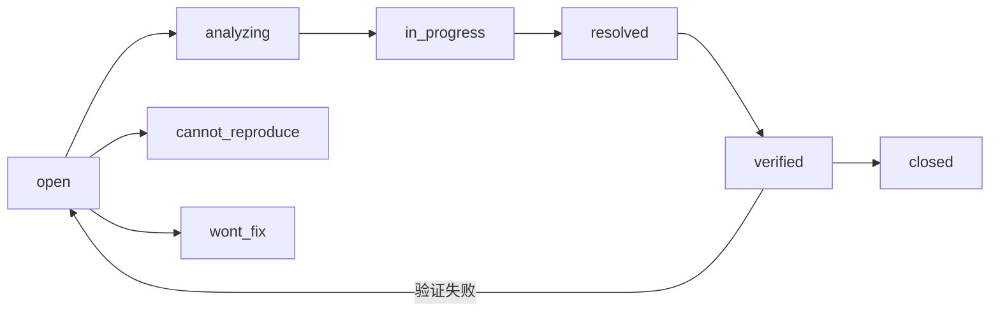

# 缺陷报告模板

> 使用此模板记录缺陷。每个缺陷只描述**一个问题**（单一职责）。如果多个问题共现，拆分为独立的缺陷报告。

---

## 命名规范

文件命名：`{序号}-{分类}-{简短描述}.md`

- **序号**：两位数字，同一分类内递增
- **分类**：缺陷所属模块或类别（如 `中间件`、`数据`、`认证`、`代码质量`）
- **描述**：5-15 字，动词短语，描述现象而非根因

示例：`01-中间件-异常处理器吞没真实错误.md`

---

## 严重度与优先级

| 严重度 | 定义 | 典型场景 |
|--------|------|---------|
| `critical` | 服务不可用、数据丢失、安全漏洞 | 数据库连接池耗尽、JWT Secret 硬编码 |
| `major` | 核心功能异常、数据错误 | RAG 检索结果为空、SSE 流式中断 |
| `minor` | 非核心功能异常、体验退化 | 日志级别不当、错误消息不清晰 |
| `trivial` | 代码风格、未使用导入、命名不规范 | ruff F401、变量命名模糊 |

| 优先级 | 定义 | 响应时间 |
|--------|------|---------|
| `p0` | 阻断生产 | 立即修复 |
| `p1` | 影响核心功能 | 当天修复 |
| `p2` | 影响非核心功能 | 本周修复 |
| `p3` | 可延后 | 下个迭代 |

---

## 生命周期



---

## 模板

### 一、现象

> **一句话描述**：什么情况下发生了什么问题。

**错误日志**（如有）：

```
# 完整堆栈或错误消息
Traceback (most recent call last):
  File "src/domain/rag/indexer.py", line 42, in build_index
    index.insert_documents(docs)
AttributeError: 'VectorStoreIndex' object has no attribute 'insert_documents'
```

### 二、复现步骤

1. 前置条件（环境、数据状态、配置）
2. 操作步骤（精确到 API 调用或 UI 操作）
3. 观察结果

**复现命令**（如有）：

```bash
curl -X POST http://localhost:10086/rag/build-index
# → {"code": 9999, "message": "Internal Server Error"}
```

### 三、根因分析

> 技术层面的根因，包含：
> - **问题代码位置**：`文件:行号`
> - **为什么出错**：逻辑缺陷或环境不匹配
> - **是否历史遗留**：重构残留、依赖升级等

**问题代码**：

```python
# src/domain/rag/indexer.py:42
index.insert_documents(docs)  # llama_index 0.13 已移除此方法
```

**根因**：llama_index 从 0.12 升级至 0.13 时，`VectorStoreIndex.insert_documents()` 被移除，改为 `index.insert()` 逐条插入。升级时未检查 CHANGELOG 中的 breaking changes。

### 四、修复方案

> 具体的代码变更，附修复前后对比。

**修复前**：

```python
index.insert_documents(docs)
```

**修复后**：

```python
for doc in docs:
    index.insert(doc)
```

### 五、验证方法

- [ ] 单元测试通过：`{test command}`
- [ ] API 端点返回正常：`{curl command} → {"code": 0}`
- [ ] 日志中无相关异常

### 六、影响范围

| 维度 | 评估 |
|------|------|
| 影响模块 | `{file path}` |
| 是否影响 API 契约 | 是/否 |
| 是否影响前端 (YiVad/YiPet) | 是/否 |
| 用户感知 | {用户可见的影响} |
| 数据完整性 | {是否涉及数据丢失或损坏} |

### 七、预防措施

| 层面 | 措施 |
|------|------|
| 代码 | {代码层面的防护} |
| 测试 | {测试层面的覆盖} |
| 流程 | {流程层面的改进} |
| CI | {CI 门禁的增强} |

### 八、追溯

| 关联 | 链接 |
|------|------|
| 来源 PRD | {PRD 链接，如适用} |
| 关联开发模块 | {Dev 链接，如适用} |
| 关联测试用例 | {Test 链接，如适用} |