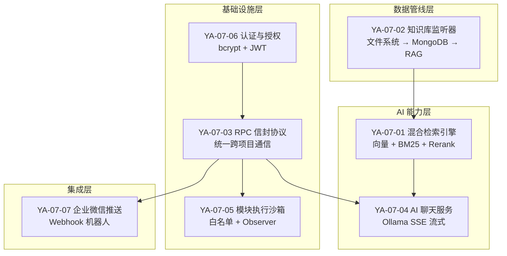
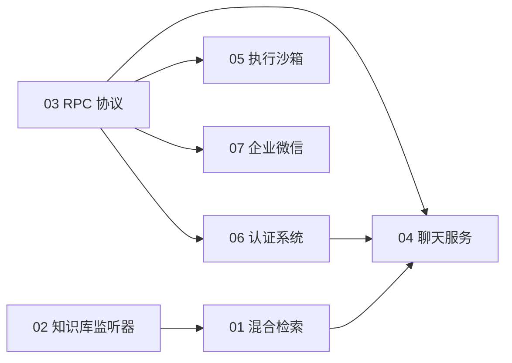

# YA-07-00: YiAi 七月迭代总览 — 7 大模块奠定后端基础架构 — 开发方案

> 来源 PRD：[00-需求总览.md](../../prds/2026-07/00-需求总览.md)
> 需求编号：YA-07-00 · 优先级：P0 · 人天：17.0d（实际）/ 24.0d（估算）
> 类型：迭代总览 · 状态：已完成

---

## 一、迭代概览

七月迭代是 YiAi 的**基础架构月**——从零构建了 RPC 通信协议、AI 聊天能力、知识库同步管线、RAG 检索引擎、认证体系、模块执行沙箱和企业微信集成。

### 1.1 模块全景

### 1.2 模块清单

| 编号 | 模块 | 优先级 | 人天 | 状态 |
|------|------|--------|------|------|
| YA-07-01 | [混合检索引擎](./01-prd-task-混合检索引擎.md) | P0 | 3.0 | 已完成 |
| YA-07-02 | [知识库监听器](./02-prd-task-知识库监听器.md) | P0 | 3.0 | 已完成 |
| YA-07-03 | [RPC 信封协议](./03-prd-task-RPC信封协议.md) | P0 | 2.25 | 已完成 |
| YA-07-04 | [AI 聊天服务](./04-prd-task-AI聊天服务.md) | P0 | 4.0 | 已完成 |
| YA-07-05 | [模块执行沙箱](./05-prd-task-模块执行沙箱.md) | P0 | 3.0 | 已完成 |
| YA-07-06 | [认证与授权系统](./06-prd-task-认证与授权系统.md) | P0 | 1.5 | 已完成 |
| YA-07-07 | [企业微信消息推送](./07-prd-task-企业微信消息推送.md) | P1 | 0.5 | 已完成 |
| **合计** | | | **17.25** | |

---

## 二、依赖关系

- **RPC 协议**是所有模块的通信基础——所有服务通过 RPC 信封暴露
- **知识库监听器**为 RAG 引擎提供索引数据源
- **RAG 引擎**为聊天服务提供检索增强能力
- **认证系统**为所有端点提供可选的安全层

---

## 三、新增文件总览

七月迭代共新增约 30 个源文件，分布在 4 个层级：

| 层级 | 新增文件数 | 关键模块 |
|------|-----------|---------|
| `domain/` | 15 | ai/chat、knowledge/*、rag/*、auth/core、execution/executor、wework/client |
| `services/` | 5 | ai/chat_service、knowledge/knowledge_service、rag/rag_service |
| `server/` | 7 | routes/auth、users、knowledge、rag、execution、wework、middleware |
| `shared/` | 1 | sse_utils |

---

## 四、关键架构决策

| 决策 | 选择 | 理由 |
|------|------|------|
| LLM 运行时 | Ollama 自托管 | 数据不出内网，无 API 费用 |
| RAG 框架 | llama_index | Python 生态最成熟的 RAG 框架 |
| 文件监听 | apscheduler 轮询 | macOS FSEvents 不可靠，轮询更稳定 |
| 认证方案 | bcrypt + JWT (HS256) | 简单够用，可选开启 |
| 跨项目通信 | RPC 信封 | 统一协议，前端不直接访问 MongoDB |
| 检索策略 | 向量 + BM25 混合 | 语义+关键词互补，覆盖更多查询类型 |

---

## 五、后续迭代

八月迭代（2026-08）在此基础上扩展：
- Multi-Provider LLM（支持 DeepSeek 等外部模型）
- GraphQL 联邦层
- OpenAI 兼容 API
- 文件管理服务、RSS 聚合、MCP 协议服务
- 测试覆盖率扩展、预写审计日志

九月迭代（2026-09）进入深度优化期：
- RAG 引擎稳定性修复、检索排序优化
- Agent 可靠性、RPC 契约测试
- 系统可观测性（TraceID、结构化日志、监控告警）
- 安全加固（密钥管理、请求签名、内容审核）

---

## 六、关联文档

- 需求：[00-需求总览.md](../../prds/2026-07/00-需求总览.md)
- 测试：[tests/README.md](../../tests/)
- 八月迭代：[../2026-08/00-prd-task-00-需求总览.md](../2026-08/00-prd-task-00-需求总览.md)