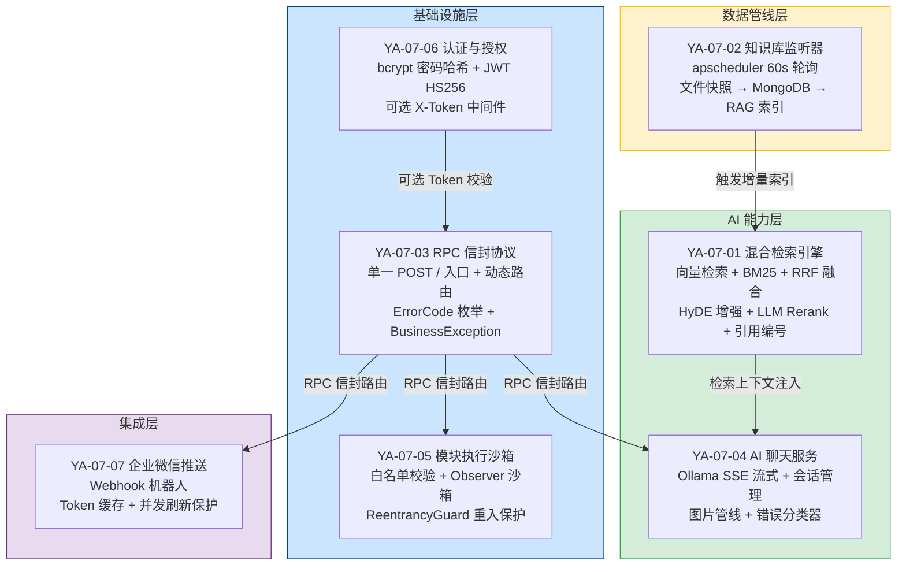
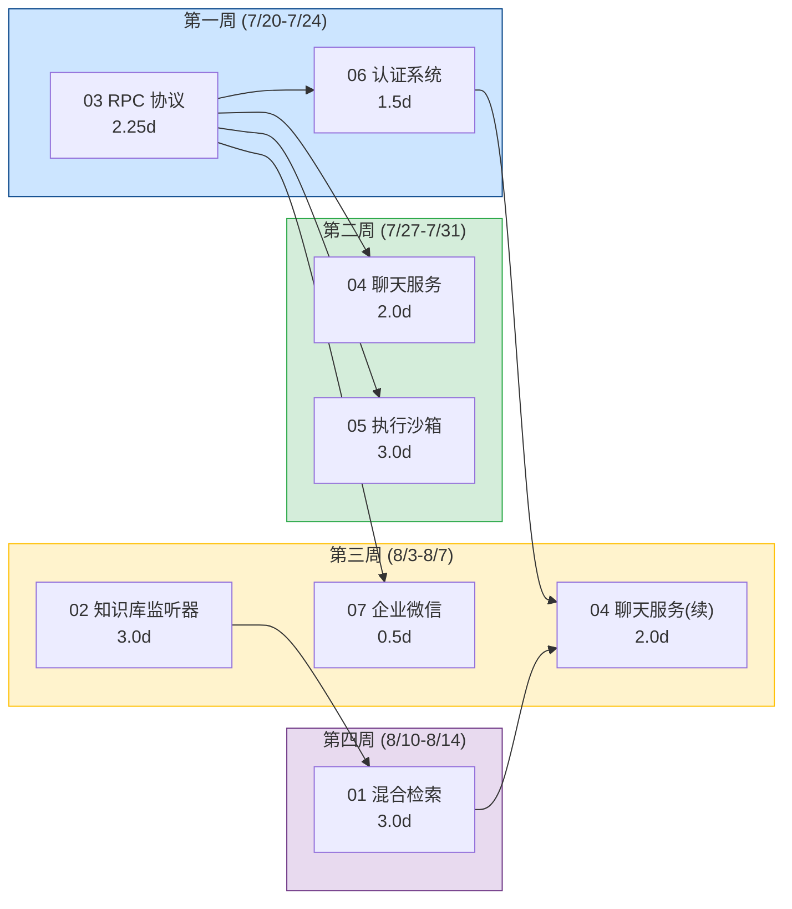
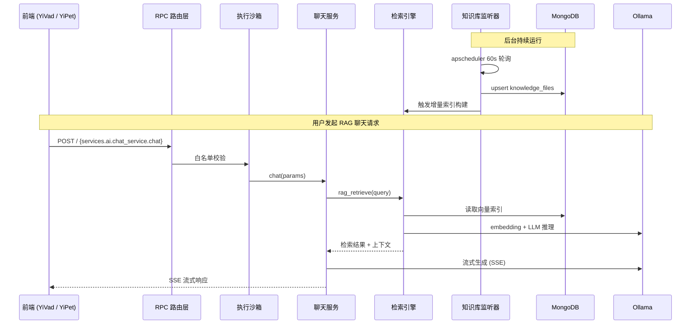

---

doc_type: module
prd_task_id: "YA-07-00"
title: "YA-07-00: YiAi 七月迭代总览 — RAG 检索引擎 + 知识库监听器 + RPC 协议 + 聊天服务 + 执行沙箱 + 认证系统 + 企业微信 — 开发方案"
status: 已完成
priority: P0
owner: 陈铭
roles: [engineer]
created: 2026-09-11
updated: 2026-09-14
project: YiAi
project_id: yiai
prd_month: "202607"
estimate_frontend: 24.0
source_prd: "00-需求总览.md"
source_okr: [yiai-001]

type: task
---

# YA-07-00: YiAi 七月迭代总览 — 7 大模块奠定后端基础架构 — 开发方案

> 来源 PRD：[00-需求总览.md](../../prds/2026-07/00-需求总览.md)
> 需求编号：YA-07-00 · 优先级：P0 · 人天：17.25d（实际）/ 24.0d（估算）
> 类型：迭代总览 · 状态：已完成

---

## 一、迭代概览

七月迭代是 YiAi 的**基础架构月**——从零构建了 RPC 通信协议、AI 聊天能力、知识库同步管线、RAG 检索引擎、认证体系、模块执行沙箱和企业微信集成。迭代后 YiAi 从简单的 Ollama 透传层演进为具有 4 层架构（Domain / Service / Route / Shared）的完整后端服务。

### 1.1 分层架构（七月迭代后全貌）

```
YiAi/src/
├── app.py                          # FastAPI 应用工厂 + 生命周期管理
├── shared/                         # 共享层：横切关注点
│   ├── config.py                   # pydantic-settings 配置管理
│   ├── response.py                 # StandardResponse + ORJSONResponse
│   ├── error_codes.py              # ErrorCode 枚举 + HTTP 映射
│   ├── exceptions.py               # BusinessException 业务异常
│   ├── sse_utils.py                # format_sse / stream_async / stream_sync
│   ├── logging.py                  # loguru 日志配置
│   ├── metrics.py                  # Prometheus 指标暴露
│   ├── utils.py                    # 通用工具函数
│   └── cache.py                    # 缓存抽象层
├── data/                           # 数据访问层：MongoDB Motor 异步
│   ├── database.py                # MongoDB 单例 + 连接池管理
│   ├── repository.py              # 通用 CRUD 仓储
│   ├── sessions.py                # 聊天会话 CRUD
│   ├── chat_records.py            # 聊天记录持久化
│   ├── rag_history.py             # RAG 查询历史
│   ├── query.py                   # 查询构建器
│   ├── mutation.py                # 写操作封装
│   └── filter_helpers.py          # 过滤器辅助函数
├── models/                         # Pydantic 模型 + 集合名称常量
│   ├── collections.py             # MongoDB 集合名枚举
│   ├── schemas.py                 # 核心业务 Pydantic 模型
│   ├── schemas_core.py            # 请求/响应模型
│   └── schemas_knowledge.py       # 知识库模型
├── domain/                         # 领域层：核心业务逻辑
│   ├── ai/                        # AI 领域 — Ollama 服务 + 图片管线 + 错误分类
│   │   ├── chat.py                # 公共 API 重导出
│   │   ├── ollama_service.py      # OllamaService 客户端封装
│   │   ├── image_helpers.py       # 图片 URL/base64 解析
│   │   ├── error_classifier.py    # LLM 错误分类（用户友好提示）
│   │   └── tools/                 # Agent 工具系统
│   │       ├── core.py            # 工具框架 + 并发工具调用
│   │       ├── registry.py        # 工具注册表
│   │       ├── sandbox.py         # 工具执行沙箱
│   │       ├── types.py           # 工具类型定义
│   │       ├── builtin/           # 内置工具（文件/知识/Web）
│   │       └── mcp.py             # MCP 协议工具发现
│   ├── rag/                       # RAG 领域 — 混合检索引擎
│   │   ├── engine.py              # 公共 API 重导出
│   │   ├── retrieval.py           # 检索核心 + 结果缓存
│   │   ├── retrievers.py          # 检索器构建（向量/BM25）
│   │   ├── query_builder.py       # 查询预处理 + HyDE 增强
│   │   ├── context_builder.py     # LLM 上下文组装
│   │   ├── response_synthesizer.py # 回答合成 + Ollama HTTP 流式
│   │   ├── chat_stream.py         # SSE 流式对话编排
│   │   ├── llm_stream.py          # LLM 原生流式 → SSE 转换
│   │   ├── decompose.py           # 复杂查询分解
│   │   ├── post_processors.py     # 后处理器（引用编号等）
│   │   ├── prompts.py             # 提示词模板
│   │   ├── indexer.py             # 知识库索引构建
│   │   ├── kb_indexer.py          # 知识库全量索引
│   │   ├── file_indexer.py        # 单文件增量索引
│   │   ├── settings.py            # RAG 配置模型
│   │   ├── paths.py               # 索引持久化路径
│   │   ├── history.py             # RAG 查询历史
│   │   └── chat_history.py        # 聊天历史管理
│   ├── knowledge/                 # 知识库领域 — 文件监听与同步
│   │   ├── watcher.py             # 公共 API 重导出
│   │   ├── watcher_manager.py     # KnowledgeWatcherManager 生命周期
│   │   ├── scanner.py             # 目录遍历 + frontmatter 解析
│   │   ├── snapshot.py            # 文件快照对比
│   │   ├── writer.py              # Markdown 写回
│   │   ├── frontmatter.py         # Frontmatter 解析工具
│   │   ├── bugs.py                # 缺陷知识管理
│   │   ├── goals.py               # 目标管理
│   │   └── issues.py              # 议题管理
│   ├── auth/                      # 认证领域 — bcrypt + JWT
│   │   └── core.py                # hash_password / verify_password / create_jwt / decode_jwt
│   ├── execution/                 # 执行领域 — 模块执行沙箱
│   │   └── executor.py            # parse_parameters / run_script / 白名单校验 / ReentrancyGuard
│   ├── files/                     # 文件领域 — 双写持久化
│   │   ├── local.py               # 本地文件操作
│   │   ├── storage.py             # OSS 存储
│   │   ├── file_ops.py            # 文件 CRUD
│   │   ├── image_ops.py           # 图片上传
│   │   ├── path_ops.py            # 路径操作
│   │   ├── read_ops.py            # 文件读取
│   │   ├── mutate_ops.py          # 文件修改
│   │   └── paths.py               # 路径管理
│   ├── rss/                       # RSS 领域 — 聚合器
│   │   ├── feed.py                # RSS 源解析
│   │   ├── scheduler.py           # 定时抓取调度
│   │   └── persistence.py         # 持久化
│   ├── state/                     # 状态领域 — KV 存储
│   │   ├── service.py             # 状态服务
│   │   └── recorder.py            # 状态记录器
│   ├── search/                    # 搜索领域 — 统一搜索
│   │   ├── unified_search.py      # 统一搜索入口
│   │   ├── ai_search.py           # AI 搜索引擎
│   │   ├── web_search.py          # Web 搜索
│   │   └── router.py              # 搜索路由
│   ├── audit/                     # 审计领域 — 操作审计
│   │   ├── decorator.py           # 审计装饰器
│   │   ├── logger.py              # 审计日志
│   │   └── models.py              # 审计模型
│   └── wework/                    # 企业微信领域 — 消息推送
│       └── client.py              # Token 管理 + 消息发送
├── services/                      # 服务层：业务编排 + RPC 接口
│   ├── ai/                        # AI 服务
│   │   ├── chat_service.py        # 公共 API 重导出
│   │   ├── llm_provider.py        # LLMProviderRouter (Ollama + DeepSeek)
│   │   ├── compaction.py          # 对话上下文压缩
│   │   ├── provider_router.py     # Provider 路由逻辑
│   │   ├── provider_types.py      # Provider 类型定义
│   │   └── model_runtime/         # 模型运行时抽象
│   ├── rag/                       # RAG 服务
│   │   └── rag_service.py         # RPC 方法封装（rag_query / rag_chat 等）
│   ├── knowledge/                 # 知识库服务
│   │   └── knowledge_service.py   # 知识库扫描/读写 RPC
│   ├── database/                  # 数据库服务
│   │   └── data_service.py        # 通用 CRUD RPC（query_documents / create / update / delete）
│   ├── rss/                       # RSS 服务
│   │   ├── feed_service.py        # RSS 源管理
│   │   └── rss_scheduler.py       # RSS 调度
│   ├── alert/                     # 告警服务
│   │   └── alert_service.py       # 规则引擎 + 通道路由
│   ├── audit/                     # 审计服务
│   │   └── audit_service.py       # 审计查询
│   ├── analytics/                 # 分析服务
│   │   ├── collector.py           # 数据采集
│   │   └── query_engine.py        # 分析查询
│   ├── backup/                    # 备份服务
│   │   ├── backup_service.py      # 备份逻辑
│   │   └── scheduler.py           # 备份调度
│   ├── export/                    # 导出服务
│   ├── notification/              # 通知服务
│   ├── tags/                      # 标签服务
│   ├── bridge_service.py          # 跨项目桥接 (YiPet → YiVad)
│   └── code_health_service.py     # 代码健康分析
└── server/                        # 路由层：FastAPI 端点 + 中间件
    ├── app.py                     # FastAPI 应用工厂
    ├── lifespan.py                # 生命周期管理
    ├── middleware.py               # 认证中间件 + 异常处理 + CORS
    ├── gzip_middleware.py          # GZip 压缩中间件
    ├── errors.py                  # 全局异常处理器
    └── routes/                    # REST/RPC 端点
        ├── auth.py                # /auth/login /logout /menu/list /buttons
        ├── users.py               # /users CRUD
        ├── knowledge.py           # /knowledge/* 端点
        ├── rag.py                 # /rag/* 端点
        ├── execution.py           # /execution/* 端点
        ├── wework.py              # /wework/* 端点
        ├── files.py               # /read-file /write-file
        ├── health.py              # /health /health/live /ready /debug
        ├── metrics.py             # /metrics (Prometheus)
        ├── debug.py               # /debug/performance
        ├── about.py               # /about
        ├── search.py              # /search/* 端点
        ├── system.py              # /system/* 端点
        ├── state.py               # /state/* 端点
        ├── analytics.py           # /analytics/* 端点
        ├── rss.py                 # /rss/* 端点
        ├── backup.py              # /backup/* 端点
        ├── bridge.py              # /bridge/* 端点
        ├── mcp.py                 # /mcp/* 端点
        ├── openai_compat.py       # /v1/chat/completions (OpenAI 兼容)
        └── dashboard/             # 仪表盘端点
            ├── __init__.py         # 仪表盘路由聚合
            ├── ai.py              # AI 服务面板
            ├── rag.py             # RAG 状态面板
            ├── knowledge.py       # 知识库状态面板
            ├── health.py          # 健康检查面板
            ├── performance.py     # 性能指标面板
            ├── service.py         # 服务状态面板
            ├── rss.py             # RSS 状态面板
            └── organization.py    # 组织信息面板
```

### 1.2 模块全景


```mermaid
flowchart TB
  subgraph INFRA["基础设施层"]
    RPC["YA-07-03 RPC 信封协议<br/>单一 POST / 入口 + 动态路由<br/>ErrorCode 枚举 + BusinessException"]
    AUTH["YA-07-06 认证与授权<br/>bcrypt 密码哈希 + JWT HS256<br/>可选 X-Token 中间件"]
    EXEC["YA-07-05 模块执行沙箱<br/>白名单校验 + Observer 沙箱<br/>ReentrancyGuard 重入保护"]
  end
  subgraph AI["AI 能力层"]
    CHAT["YA-07-04 AI 聊天服务<br/>Ollama SSE 流式 + 会话管理<br/>图片管线 + 错误分类器"]
    RAG["YA-07-01 混合检索引擎<br/>向量检索 + BM25 + RRF 融合<br/>HyDE 增强 + LLM Rerank + 引用编号"]
  end
  subgraph DATA_PIPELINE["数据管线层"]
    WATCH["YA-07-02 知识库监听器<br/>apscheduler 60s 轮询<br/>文件快照 → MongoDB → RAG 索引"]
  end
  subgraph INTEG["集成层"]
    WEWORK["YA-07-07 企业微信推送<br/>Webhook 机器人<br/>Token 缓存 + 并发刷新保护"]
  end

  RPC -->|"RPC 信封路由"| CHAT
  RPC -->|"RPC 信封路由"| EXEC
  RPC -->|"RPC 信封路由"| WEWORK
  AUTH -->|"可选 Token 校验"| RPC
  WATCH -->|"触发增量索引"| RAG
  RAG -->|"检索上下文注入"| CHAT

  style INFRA fill:#cce5ff,stroke:#004085
  style AI fill:#d4edda,stroke:#28a745
  style DATA_PIPELINE fill:#fff3cd,stroke:#ffc107
  style INTEG fill:#e8daef,stroke:#6c3483
```

### 1.3 模块清单与依赖矩阵

| 编号 | 模块 | 优先级 | 人天 | 文件数 | 依赖 | 被依赖 |
|------|------|--------|------|--------|------|--------|
| YA-07-01 | [混合检索引擎](./01-prd-task-混合检索引擎.md) | P0 | 3.0 | 17 | YA-07-02 | YA-07-04 |
| YA-07-02 | [知识库监听器](./02-prd-task-知识库监听器.md) | P0 | 3.0 | 9 | 无 | YA-07-01 |
| YA-07-03 | [RPC 信封协议](./03-prd-task-RPC信封协议.md) | P0 | 2.25 | 5 | 无 | YA-07-04/05/06/07 |
| YA-07-04 | [AI 聊天服务](./04-prd-task-AI聊天服务.md) | P0 | 4.0 | 9 | YA-07-03, YA-07-01 | 无 |
| YA-07-05 | [模块执行沙箱](./05-prd-task-模块执行沙箱.md) | P0 | 3.0 | 4 | YA-07-03 | 无 |
| YA-07-06 | [认证与授权系统](./06-prd-task-认证与授权系统.md) | P0 | 1.5 | 5 | YA-07-03 | 无 |
| YA-07-07 | [企业微信消息推送](./07-prd-task-企业微信消息推送.md) | P1 | 0.5 | 3 | YA-07-03 | 无 |
| **合计** | | | **17.25** | **52** | | |

---

## 二、依赖关系拓扑

### 2.1 构建顺序约束


```mermaid
flowchart LR
  subgraph WEEK1["第一周 (7/20-7/24)"]
    RPC["03 RPC 协议<br/>2.25d"]
    AUTH["06 认证系统<br/>1.5d"]
  end
  subgraph WEEK2["第二周 (7/27-7/31)"]
    CHAT["04 聊天服务<br/>2.0d"]
    EXEC["05 执行沙箱<br/>3.0d"]
  end
  subgraph WEEK3["第三周 (8/3-8/7)"]
    WATCH["02 知识库监听器<br/>3.0d"]
    CHAT2["04 聊天服务(续)<br/>2.0d"]
    WEWORK["07 企业微信<br/>0.5d"]
  end
  subgraph WEEK4["第四周 (8/10-8/14)"]
    RAG["01 混合检索<br/>3.0d"]
  end

  RPC --> CHAT
  RPC --> EXEC
  RPC --> WEWORK
  RPC --> AUTH
  WATCH --> RAG
  RAG --> CHAT2
  AUTH --> CHAT2

  style WEEK1 fill:#cce5ff,stroke:#004085
  style WEEK2 fill:#d4edda,stroke:#28a745
  style WEEK3 fill:#fff3cd,stroke:#ffc107
  style WEEK4 fill:#e8daef,stroke:#6c3483
```

**关键路径**：RPC 协议 (2.25d) -> AI 聊天服务 (4.0d) = **6.25d**。RPC 是所有模块的通信基础，必须最先完成。

### 2.2 跨模块数据流


```mermaid
sequenceDiagram
  participant FE as 前端 (YiVad / YiPet)
  participant RPC as RPC 路由层
  participant EXEC as 执行沙箱
  participant CHAT as 聊天服务
  participant RAG as 检索引擎
  participant WATCH as 知识库监听器
  participant MONGO as MongoDB
  participant OLLAMA as Ollama

  Note over WATCH,MONGO: 后台持续运行
  WATCH->>WATCH: apscheduler 60s 轮询
  WATCH->>MONGO: upsert knowledge_files
  WATCH->>RAG: 触发增量索引构建

  Note over FE,OLLAMA: 用户发起 RAG 聊天请求
  FE->>RPC: POST / {services.ai.chat_service.chat}
  RPC->>EXEC: 白名单校验
  EXEC->>CHAT: chat(params)
  CHAT->>RAG: rag_retrieve(query)
  RAG->>MONGO: 读取向量索引
  RAG->>OLLAMA: embedding + LLM 推理
  RAG-->>CHAT: 检索结果 + 上下文
  CHAT->>OLLAMA: 流式生成 (SSE)
  CHAT-->>FE: SSE 流式响应
```

---

## 三、新增文件总览

七月迭代共新增约 **52 个源文件**，分布在 4 个架构层：

| 层级 | 新增文件数 | 模块 |
|------|-----------|------|
| `domain/` | 28 | rag/(17) + knowledge/(9) + ai/tools(目录) + auth/core + execution/executor + wework/client |
| `services/` | 8 | ai/chat_service + ai/llm_provider + ai/compaction + ai/provider_* + rag/rag_service + knowledge/knowledge_service |
| `server/` | 8 | routes/auth + users + knowledge + rag + execution + wework + middleware + errors |
| `shared/` | 1 | sse_utils |

---

## 四、关键架构决策

| 决策 | 选择 | 备选方案 | 选择理由 |
|------|------|---------|---------|
| LLM 运行时 | Ollama 自托管 | OpenAI API / vLLM | 数据不出内网，零 API 费用，私有部署 |
| RAG 框架 | llama_index | LangChain / Haystack | Python 生态最成熟，索引持久化原生支持 |
| 向量存储 | FAISS (llama_index 内置) | Chroma / Qdrant / Milvus | 零运维依赖，单机性能足够（< 10K 文档） |
| 文件监听 | apscheduler 轮询 (60s) | watchdog / watchfiles / inotify | macOS FSEvents 不可靠（静默丢事件），轮询跨平台一致 |
| 认证方案 | bcrypt + JWT (HS256) | Argon2 + RS256 | bcrypt 无 C 编译依赖，HS256 简化密钥管理（单服务场景） |
| 跨项目通信 | RPC 信封 (POST /) | REST 多端点 / gRPC / WebSocket | 统一协议，动态路由，前端实现简单 |
| 检索策略 | 向量 + BM25 混合 + RRF 融合 | 纯向量 / 纯 BM25 | 语义+关键词互补，RRF 无需调参权重 |
| 流式传输 | SSE (text/event-stream) | WebSocket / 长轮询 | 单向推送场景，HTTP 基础设施友好 |
| 配置管理 | pydantic-settings + config.yaml | .env / TOML / JSON | 树形配置可读性好，YAML 层级结构自然 |
| 异步框架 | FastAPI + Motor (async) | Flask + PyMongo (sync) | 高并发 I/O 场景，事件循环不阻塞 |

---

## 五、非功能需求实现

### 5.1 性能基线

| 指标 | 目标 | 实现方式 | 状态 |
|------|------|---------|------|
| RPC 路由延迟 | < 5ms (不含业务) | importlib 缓存 + 函数引用缓存 (_FUNC_CACHE) | 已实现 |
| RAG 检索延迟 | < 2s (1K 文档) | FAISS 索引 + 检索结果缓存 (300s TTL) | 已实现 |
| 知识库同步延迟 | <= 60s | apscheduler 60s 轮询间隔 | 已实现 |
| SSE 首字节延迟 | < 500ms | Ollama 流式 API + orjson SSE 帧 | 已实现 |
| MongoDB 连接池 | maxPoolSize=100 | Motor 默认连接池 | 已配置 |

### 5.2 安全基线

| 维度 | 措施 | 状态 |
|------|------|------|
| 认证 | bcrypt 密码哈希 + JWT HS256 (可选开启) | 已实现 |
| 授权 | 模块白名单 (module_allowlist) | 已实现 |
| 沙箱 | ReentrancyGuard 重入保护 (max_depth=10) | 已实现 |
| 输入校验 | Pydantic v2 模型 + parse_parameters | 已实现 |
| 错误信息安全 | 统一 BusinessException → 标准错误码，不泄露栈追踪 | 已实现 |

### 5.3 可观测性（七月迭代内埋点）

| 维度 | 实现 | 状态 |
|------|------|------|
| 日志 | loguru 结构化日志，按模块 logger | 已实现 |
| 指标 | Prometheus /metrics 端点（RPC 计数/延迟/错误率） | 已实现 |
| 健康检查 | /health /health/live /ready /debug | 已实现 |
| 追踪 | TraceID（后续 Q4 迭代引入 OpenTelemetry） | 待实施 |

---

## 六、迭代边界

### 6.1 七月迭代明确包含

- RPC 信封协议（统一的跨项目通信契约）
- RAG 混合检索引擎（向量 + BM25 + RRF + HyDE + Rerank）
- 知识库监听器（文件系统 → MongoDB → RAG 索引同步管线）
- AI 聊天服务（Ollama SSE 流式 + 会话管理 + 图片管线）
- 模块执行沙箱（白名单校验 + Observer + 重入保护）
- 认证系统（bcrypt + JWT + 可选中间件）
- 企业微信推送（Webhook 机器人 + Token 管理）

### 6.2 七月迭代明确不包含

- Multi-Provider LLM（DeepSeek 等外部模型 — Aug 迭代）
- OpenAI 兼容 API（/v1/chat/completions — Aug 迭代）
- GraphQL 联邦层（Aug 迭代）
- Agent 工具系统（Aug 迭代）
- 上下文压缩（Sep 迭代）
- 系统可观测性（Oct Q4 迭代）
- 密钥管理（Sep 迭代）

---

## 七、实现完成记录

> **完成日期**：2026-07-31 · **复核日期**：2026-09-15
> **状态**：已完成，全部 52 个源文件已实现

### 7.1 产出清单

| 分类 | 文件数 | 关键产出 |
|------|--------|---------|
| Domain 层 | 28 | rag/(17), knowledge/(9), auth/core, execution/executor, ai/tools/(6), wework/client |
| Service 层 | 8 | chat_service, llm_provider, compaction, rag_service, knowledge_service 等 |
| Route 层 | 8 | auth, users, knowledge, rag, execution, wework, middleware, errors |
| Shared 层 | 1 | sse_utils |
| Data 层 | 4 | sessions, chat_records, rag_history, filter_helpers |
| Models 层 | 3 | schemas_knowledge, schemas_core, collections 扩展 |
| 测试 | 5+ | test_utils, test_error_codes, test_response, test_exceptions, test_config (76 tests total) |
| 配置 | 1 | config.yaml (新增 knowledge + rag + wework + jwt 配置段) |
| **合计** | **58** | |

---

## 八、后续迭代衔接

八月迭代（2026-08）在此基础上扩展：
- Multi-Provider LLM（DeepSeek / OpenAI 兼容）
- Agent 工具系统（domain/ai/tools/ — 文件/知识/Web/MCP 四类工具）
- GraphQL 联邦层 + OpenAI 兼容 API
- 文件管理服务、RSS 聚合、MCP 协议服务
- 代码健康分析、翻译服务、分析服务

九月迭代（2026-09）进入深度优化期：
- RAG 引擎稳定性修复、检索排序优化（RRF k 值调优、中文分词增强）
- Agent 可靠性（确定性 stub 测试 + 在线 E2E 验证）
- RPC 契约测试（编译期参数名校验）
- 缓存架构优化（检索缓存 + RPC 函数缓存 + 分页单查询优化）

十月迭代（2026-Q4）系统成熟期：
- 生产可观测性（OpenTelemetry + TraceID + Jaeger + Grafana）
- API 平台化（OpenAPI 自动生成 + SDK Generator）
- 安全加固（密钥管理 + 请求签名 + 内容审核）

---

## 九、关联文档

- 需求：[00-需求总览.md](../../prds/2026-07/00-需求总览.md)
- 测试：[tests/README.md](../../tests/)
- 八月迭代：[../2026-08/00-prd-task-00-需求总览.md](../2026-08/00-prd-task-00-需求总览.md)
- 九月迭代：[../2026-09/00-prd-task-00-需求总览.md](../2026-09/00-prd-task-00-需求总览.md)
- 代码健康：[../../../workflows/开发规范/06-规范-性能优化.md](../../../workflows/开发规范/06-规范-性能优化.md)
- RPC 协议：[../../../workflows/开发规范/05-规范-RPC协议规范.md](../../../workflows/开发规范/05-规范-RPC协议规范.md)