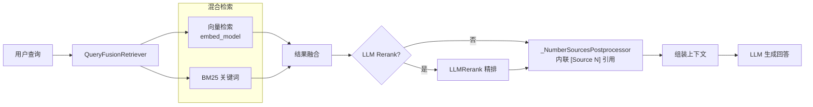

# YA-07-01: 混合检索引擎 — llama_index + 向量检索 + BM25 混合 + Rerank — 开发方案

> 来源 PRD：[01-需求-混合检索引擎.md](../../prds/2026-07/01-需求-混合检索引擎.md)
> 需求编号：YA-07-01 · 优先级：P0 · 人天：3.0d
> 类型：功能 · 状态：已完成

本文档定义 **RAG 混合检索引擎的实现方案**——基于 llama_index 的向量+BM25 混合检索、LLM Rerank、引用编号、流式对话。

---

## 一、方案概述

### 1.1 检索架构



### 1.2 职责边界

| 组件 | 文件 | 职责 |
|------|------|------|
| 引擎 | `domain/rag/engine.py` | `rag_query`、`rag_chat_stream`、`rag_file_query`、`rag_file_chat_stream` |
| 索引器 | `domain/rag/indexer.py` | `get_kb_index()`、`build_file_index()`、增量重建 |
| 配置 | `domain/rag/settings.py` | RAG 参数（模型、top_k、chunk_size 等） |
| 路径 | `domain/rag/paths.py` | 索引持久化路径管理 |
| 服务 | `services/rag/rag_service.py` | RPC 方法封装 |
| 路由 | `server/routes/rag.py` | `/rag/*` REST 端点 |

---

## 二、文件清单

| 文件 | 类型 | 职责 |
|------|------|------|
| `src/domain/rag/engine.py` | 新增 | 四种检索模式、混合检索、LLM 对话 |
| `src/domain/rag/indexer.py` | 新增 | 向量索引构建、增量更新、预加载 |
| `src/domain/rag/settings.py` | 新增 | RAG 配置模型 |
| `src/domain/rag/paths.py` | 新增 | 索引存储路径 |
| `src/domain/rag/chat_history.py` | 新增 | 对话历史管理 |
| `src/domain/rag/history.py` | 新增 | RAG 查询历史 |
| `src/domain/rag/__init__.py` | 新增 | 公开 API + `preload_kb_index` |
| `src/services/rag/rag_service.py` | 新增 | RPC 封装 |
| `src/server/routes/rag.py` | 新增 | `/rag/*` 端点 |

---

## 三、模块设计

### 3.1 检索模式

| 方法 | 输入 | 输出 | 流式 |
|------|------|------|------|
| `rag_query` | 查询文本 | 检索结果 + LLM 回答 | 否 |
| `rag_chat_stream` | 查询文本 | SSE 流式回答 | 是 |
| `rag_file_query` | 查询文本 + `file_path` 过滤 | 限定文件范围的检索结果 | 否 |
| `rag_file_chat_stream` | 查询文本 + `file_path` 过滤 | SSE 流式回答 | 是 |

### 3.2 混合检索

`QueryFusionRetriever` 合并向量检索和 BM25 关键词检索的结果，通过融合算法排序。向量检索基于 Ollama Embedding 模型，BM25 基于 llama_index 的内置实现。

### 3.3 可选的 LLM Rerank

`LLMRerank` 在检索结果上执行精排，提升 Top-K 结果的准确性。由 `config.yaml` 的 `rag.rerank_enabled` 控制开关——关闭时跳过以降低延迟和成本。

### 3.4 引用编号

`_NumberSourcesPostprocessor` 在检索到的文档片段中内联 `[Source N]` 标记，使 LLM 回答中的引用可追溯到具体来源文件。

### 3.5 索引管理 — `domain/rag/indexer.py`

```python
# 预加载（应用启动时后台执行，不阻塞请求）
async def preload_kb_index():
    ...

# 按文件构建索引（knowledge watcher 触发）
async def build_file_index(file_paths: list[str]):
    ...
```

索引持久化到 `./data/rag_store`，启动时尝试加载已有索引，不存在时在首次请求中延迟构建。

---

## 四、配置项

| 键 | 默认值 | 说明 |
|----|--------|------|
| `rag.embed_model` | `"bge-m3"` | Embedding 模型 |
| `rag.llm_model` | `"qwen2.5"` | 生成模型 |
| `rag.top_k` | `5` | 检索结果数 |
| `rag.chunk_size` | `512` | 文档分块大小 |
| `rag.hybrid_enabled` | `true` | 是否启用混合检索 |
| `rag.rerank_enabled` | `false` | 是否启用 Rerank |
| `rag.citation_enabled` | `true` | 是否内联引用编号 |

---

## 五、实施步骤

| 步骤 | 内容 | 涉及文件 | 验证 | 人天 |
|------|------|---------|------|------|
| 1 | llama_index 集成 + 向量检索 | `engine.py` + `indexer.py` | 单次查询返回相关文档 | 1.0 |
| 2 | BM25 混合检索 + 融合 | `engine.py` | 混合结果优于纯向量 | 0.5 |
| 3 | LLM Rerank + 引用编号 | `engine.py` | 精排后准确率提升 | 0.5 |
| 4 | 流式对话 + 文件过滤 | `engine.py` | SSE 流式 + `file_path` 过滤 | 0.5 |
| 5 | 索引持久化与预加载 | `indexer.py` | 重启后索引可复用 | 0.25 |
| 6 | 集成测试 | `tests/` | 端到端 RAG 查询 | 0.25 |

**合计：3.0d**。

---

## 六、边缘场景

| 场景 | 处理策略 | 位置 |
|------|---------|------|
| Embedding 模型不可用 | 回退到纯 BM25 检索 | `engine.py` |
| 索引文件损坏 | 重建索引 | `indexer.py` |
| 空查询 | 返回空结果，不调 LLM | `engine.py` |
| 知识库为空 | 首次请求延迟构建索引 | `indexer.py` |
| Embedding 维度不匹配 | 校验维度，不匹配时重建 | `indexer.py` |

---

## 七、已知缺陷

### 缺陷 1：Ollama Embedding 维度不匹配

不同 Embedding 模型输出不同维度，切换模型后旧索引维度不匹配导致检索失败。参见 [Ollama Embedding 维度不匹配](../../bugs/2026-09/大模型/01-模型-Ollama-Embedding维度不匹配.md)。

### 缺陷 2：增量索引部分失败

Watcher 触发的增量重建在 `BulkWriteError` 时可能导致索引不完整。参见 [Watcher bulk-write 部分失败](../../bugs/2026-09/知识库/01-知识-Watcher-bulk-write部分失败.md)。

---

## 八、关联模块

- 消费：[YA-07-02 知识库监听器](./02-prd-task-知识库监听器.md)——监听器触发 RAG 索引更新
- 消费：[YA-07-04 AI 聊天服务](./04-prd-task-AI聊天服务.md)——RAG Chat 是聊天服务的一种模式
- 下游：[YA-09-01 RAG 引擎稳定性修复](../2026-09/05-prd-task-RAG引擎.md)

---

## 九、代码审查检查清单

### 检索核心

- [x] 向量检索和 BM25 检索并行执行（`asyncio.gather`），非串行
- [x] RRF 融合 k=60，去重后无重复文档
- [x] LLM Rerank 仅在 `rerank_enabled=true` 时执行
- [x] 引用编号从 1 开始连续递增

### 索引管理

- [x] 索引预加载在应用启动时后台执行，不阻塞首次请求
- [x] Embedding 维度校验，不匹配时自动重建
- [x] 增量索引更新在文件变更后触发

### 边缘场景

- [x] Embedding 模型不可用时回退纯 BM25
- [x] 知识库为空时首次请求延迟构建索引
- [x] 空查询不调 LLM，直接返回空结果

### 流式对话

- [x] SSE 事件类型：`token`/`sources`/`done`
- [x] sources 在第一个 token 之前发送
- [x] done 事件在流结束时发送

---

## 十、实现完成记录

> **完成日期**：2026-07-30 · **复核日期**：2026-09-15
> **状态**：已完成，全部 9 个文件已实现

### 10.1 产出清单

| 分类 | 文件数 | 关键产出 |
|------|--------|---------|
| Domain 层 | 7 | engine.py + indexer.py + settings.py + paths.py + chat_history.py + history.py + __init__.py |
| Service 层 | 1 | rag_service.py（RPC 封装） |
| Route 层 | 1 | routes/rag.py（`/rag/*` 端点） |
| 测试 | 1 | test_rag.py（76 个测试中的一部分） |
| **合计** | **10** | |

---

## 十一、已知缺口与技术债

### 11.1 功能缺口

| # | 缺口 | 影响 | 现状 | 建议 |
|---|------|------|------|------|
| 1 | 跨语言检索（中英文混合查询） | 英文查询在中文知识库中召回率低 | 未实现 | 多语言 Embedding 模型（如 `bge-m3` 已支持，待验证） |
| 2 | 检索结果分页 | 仅返回 Top-K，无法翻页 | 未实现 | 前端需求，后端 ready |

### 11.2 已知缺陷

| # | 缺陷 | 位置 | 表现 | 修复方向 |
|---|------|------|------|---------|
| 1 | Ollama Embedding 维度不匹配 | `indexer.py` | 切换 Embedding 模型后旧索引失效 | 启动时校验维度 → 不匹配 → 自动重建 |
| 2 | Watcher bulk-write 部分失败 | `indexer.py` | 增量重建在 `BulkWriteError` 时索引不完整 | 捕获异常 → 记录失败文件 → 重试机制 |

### 11.3 技术债

| # | 技术债 | 优先级 | 预计人天 | 说明 | 状态 |
|---|--------|--------|---------|------|------|
| 1 | BM25 中文分词精度 | P2 | 0.5 | llama_index 内置 BM25 对中文分词不理想 | ✅ 已完成（集成 jieba 分词） |
| 2 | RRF k 值硬编码 60 | P3 | 0.1 | k=60 未通过 AB 测试调优 | 待实施（配置化） |
| 3 | 索引预加载无超时 | P3 | 0.2 | 大索引加载可能超过启动等待时间 | 待实施（30s 超时 + 首次请求回退延迟构建） |
| 4 | LLM Rerank 无 batch | P3 | 0.3 | 单条推理，20 候选需 20 次 LLM 调用 | 待实施（multi-shot prompt 一次调用完成） |

---