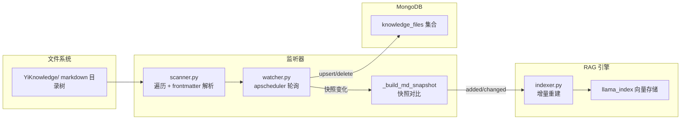
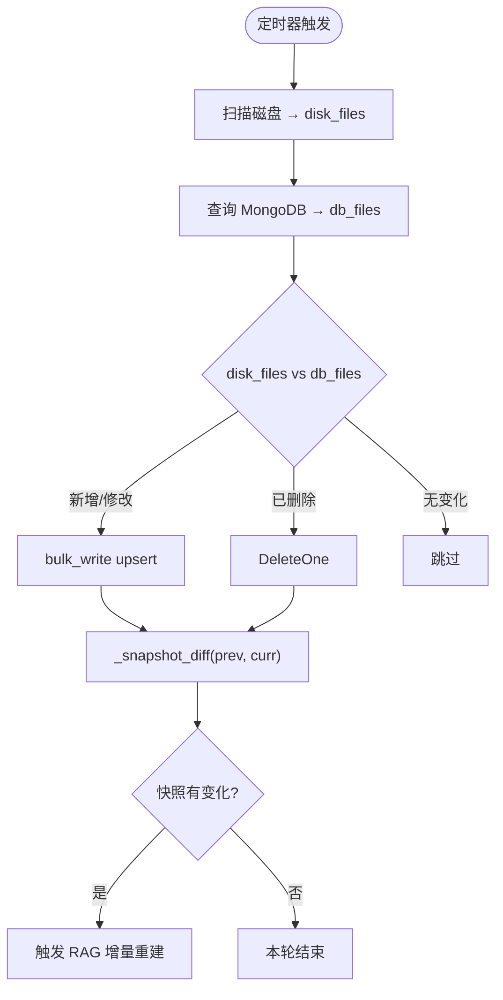

# YA-07-02: 知识库监听器 — apscheduler 轮询 + MongoDB 同步 + RAG 增量重建 — 开发方案

> 来源 PRD：[02-需求-知识库监听器.md](../../prds/2026-07/02-需求-知识库监听器.md)
> 需求编号：YA-07-02 · 优先级：P0 · 人天：3.0d
> 类型：功能 · 状态：已完成

本文档定义 **知识库监听器的实现方案**——文件系统轮询、MongoDB 元数据同步、RAG 索引增量更新。

---

## 一、方案概述

### 1.1 为什么是轮询而非文件事件

macOS FSEvents 在开发机上不可靠——`watchfiles` 和 `watchdog` 均静默丢失事件。因此选择 **apscheduler 定时轮询**——与 RSS 调度器同一库，跨平台一致，且对数百个 markdown 文件的扫描仅需数十毫秒。

### 1.2 数据流



### 1.3 职责边界

| 组件 | 文件 | 职责 |
|------|------|------|
| 扫描器 | `domain/knowledge/scanner.py` | 目录遍历、frontmatter 解析、元数据提取 |
| 监听器 | `domain/knowledge/watcher.py` | apscheduler 定时轮询、批量 upsert/delete、快照对比 |
| 写入器 | `domain/knowledge/writer.py` | Markdown 文件写回（frontmatter 更新） |
| 服务层 | `services/knowledge/knowledge_service.py` | RPC 封装 |
| 索引器 | `domain/rag/indexer.py` | 向量索引构建与增量更新 |

---

## 二、文件清单

| 文件 | 类型 | 职责 |
|------|------|------|
| `src/domain/knowledge/scanner.py` | 新增 | `_base_dir()`、`_extract_meta()`、树遍历 |
| `src/domain/knowledge/watcher.py` | 新增 | `init_knowledge_watcher()`、`_poll_once()`、快照对比 |
| `src/domain/knowledge/writer.py` | 新增 | frontmatter 写回磁盘 |
| `src/domain/knowledge/__init__.py` | 新增 | 公开 `init_knowledge_watcher` / `shutdown_knowledge_watcher` |
| `src/domain/rag/indexer.py` | 修改 | `build_file_index()`、增量重建 |
| `src/services/knowledge/knowledge_service.py` | 新增 | RPC 方法封装 |
| `src/server/routes/knowledge.py` | 新增 | `/knowledge/*` REST 端点 |

---

## 三、模块设计

### 3.1 扫描器 — `domain/knowledge/scanner.py`

递归遍历 `settings.knowledge_base_dir`（默认 `../YiKnowledge`），解析每个 `.md` 文件的 YAML frontmatter：

```python
def _extract_meta(abs_path: str) -> dict:
    with open(abs_path) as f:
        content = f.read()
    if content.startswith("---"):
        end = content.find("---", 3)
        if end > 0:
            return yaml.safe_load(content[3:end])
    return {}
```

提取字段：`title`、`tags`、`category`、`created`、`updated`、`source`、`type`、`status`。

### 3.2 监听器 — `domain/knowledge/watcher.py`

**轮询循环** `_poll_once()`：



**快照机制**：

```python
def _build_md_snapshot(base: str) -> dict[str, tuple[int, int]]:
    """返回 { rel_path: (size_bytes, mtime_ms) }，仅 .md 文件"""
```

快照对比仅检查文件大小和修改时间，不计算文件哈希——保证扫描速度。

**批量操作**：以 1000 个文档为一组（`_BULK_CHUNK`），使用 Motor `bulk_write` 分批执行。`BulkWriteError` 被捕获并记录，不中断整体同步。

### 3.3 生命周期管理

```python
# app.py lifespan 中
await init_knowledge_watcher()     # 启动 apscheduler
await shutdown_knowledge_watcher() # 关闭调度器
```

**配置项**（`config.yaml`）：

| 键 | 默认值 | 说明 |
|----|--------|------|
| `knowledge.watcher_enabled` | `true` | 是否启用 |
| `knowledge.watcher_poll_seconds` | `60` | 轮询间隔 |
| `knowledge.base_dir` | `../YiKnowledge` | 知识库根目录 |

---

## 四、数据模型

### MongoDB `knowledge_files` 集合

```python
{
  "path": "projects/yivad/prds/2026-07/07-prd-权限系统.md",  # 相对路径，唯一索引
  "title": "权限系统与动态菜单",
  "tags": ["权限", "RBAC"],
  "category": "项目/管理后台/需求",
  "created": "2026-07-28",
  "updated": "2026-09-12",
  "source": "内部",
  "type": "需求",
  "status": "已完成",
  "frontmatter": { ... },       # 完整原始数据
  "size_bytes": 12345,
  "mtime_ms": 1695123456789,
  "indexed_at": "2026-09-14 10:00:00"
}
```

---

## 五、实施步骤

| 步骤 | 内容 | 涉及文件 | 验证 | 人天 |
|------|------|---------|------|------|
| 1 | 目录遍历 + frontmatter 解析 | `scanner.py` | 正确解析全部 frontmatter | 0.5 |
| 2 | apscheduler 轮询循环 | `watcher.py` | 启动后 60s 内同步完成 | 1.0 |
| 3 | 批量 upsert/delete | `watcher.py` | 增删文件后 MongoDB 同步 | 0.5 |
| 4 | 快照对比 + RAG 触发 | `watcher.py` + `indexer.py` | 修改 .md 后向量索引更新 | 0.5 |
| 5 | Markdown 写回 + 测试 | `writer.py` + `tests/` | frontmatter 更新写回磁盘 | 0.5 |

**合计：3.0d**。

---

## 六、边缘场景

| 场景 | 处理策略 | 位置 |
|------|---------|------|
| 隐藏文件（`.` 开头） | `_should_skip()` 过滤 | `watcher.py` |
| 非 `.md` 文件 | `_build_md_snapshot` 仅收集 `.md` | `watcher.py` |
| 文件无 frontmatter | 返回空 dict，仍 upsert | `scanner.py` |
| 文件读取失败 | `try/except` 跳过该文件 | `scanner.py` |
| MongoDB 不可达 | 记录日志，跳过本轮 | `watcher.py` |
| BulkWriteError 部分失败 | 捕获并记录详情，不中断 | `watcher.py` |
| `base_dir` 不存在 | 启动时检查，跳过监听器 | `watcher.py` |

---

## 七、关联模块

- 生产：[YA-07-01 混合检索引擎](./01-prd-task-混合检索引擎.md)——RAG 索引由监听器触发
- 消费：[YA-07-04 AI 聊天服务](./04-prd-task-AI聊天服务.md)——RAG Chat 依赖向量索引
- 下游：[YA-09-01 RAG 引擎稳定性修复](../2026-09/05-prd-task-RAG引擎.md)
- 参考：[Watcher bulk-write 部分失败](../../bugs/2026-09/知识库/01-知识-Watcher-bulk-write部分失败.md)