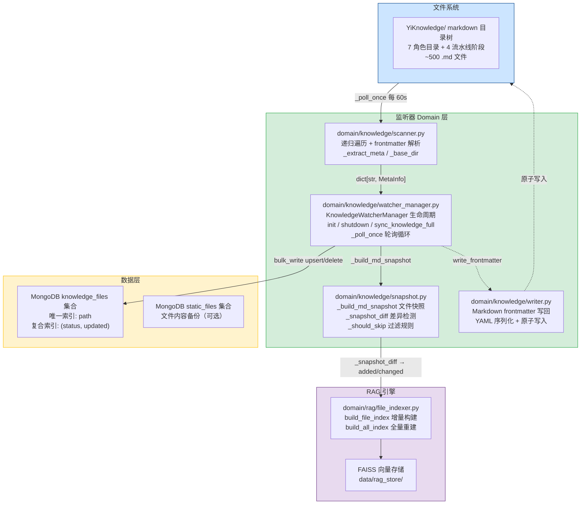
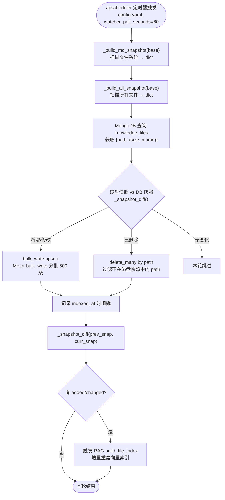

---

doc_type: module
prd_task_id: "YA-07-02"
title: "YA-07-02: 知识库监听器 — apscheduler 轮询 + MongoDB 同步 + 快照对比 + RAG 增量重建 — 开发方案"
status: 已完成
priority: P0
owner: 陈铭
roles: [engineer]
created: 2026-09-11
updated: 2026-09-14
project: YiAi
project_id: yiai
prd_month: "202607"
estimate_frontend: 3.0
source_prd: "02-需求-知识库监听器.md"
source_okr: [yiai-001]

type: task
---

# YA-07-02: 知识库监听器 — apscheduler 轮询 + MongoDB 同步 + 快照对比 + RAG 增量重建 — 开发方案

> 来源 PRD：[02-需求-知识库监听器.md](../../prds/2026-07/02-需求-知识库监听器.md)
> 需求编号：YA-07-02 · 优先级：P0 · 人天：3.0d
> 类型：功能 · 状态：已完成

本文档定义 **知识库监听器的完整实现方案**——文件系统轮询、MongoDB 元数据同步、快照对比差异检测、RAG 索引增量更新。

---

## 一、架构总览

### 1.1 为什么是轮询而非文件事件

macOS FSEvents 在开发机上不可靠——`watchfiles` 和 `watchdog` 均静默丢失事件。具体表现为：
- `watchfiles` 的 `awatch()` 在快速连续写入时延迟达数秒，偶尔完全不触发
- `watchdog` 的 `FileSystemEventHandler` 对 VS Code / JetBrains 等编辑器的原子写入模式（write-temp → rename）处理不一致

因此选择 **apscheduler 定时轮询**——与 RSS 调度器同一库，跨平台一致，且对数百个 markdown 文件的扫描仅需数十毫秒。60s 轮询间隔平衡了时效性与资源消耗。

### 1.2 数据流架构


```mermaid
flowchart TB
  subgraph DISK["文件系统"]
    YK["YiKnowledge/ markdown 目录树<br/>7 角色目录 + 4 流水线阶段<br/>~500 .md 文件"]
  end

  subgraph WATCHER["监听器 Domain 层"]
    SCANNER["domain/knowledge/scanner.py<br/>递归遍历 + frontmatter 解析<br/>_extract_meta / _base_dir"]
    SNAPSHOT["domain/knowledge/snapshot.py<br/>_build_md_snapshot 文件快照<br/>_snapshot_diff 差异检测<br/>_should_skip 过滤规则"]
    MANAGER["domain/knowledge/watcher_manager.py<br/>KnowledgeWatcherManager 生命周期<br/>init / shutdown / sync_knowledge_full<br/>_poll_once 轮询循环"]
    WRITER["domain/knowledge/writer.py<br/>Markdown frontmatter 写回<br/>YAML 序列化 + 原子写入"]
  end

  subgraph DATA["数据层"]
    MONGO["MongoDB knowledge_files 集合<br/>唯一索引: path<br/>复合索引: (status, updated)"]
    static_files["MongoDB static_files 集合<br/>文件内容备份（可选）"]
  end

  subgraph RAG["RAG 引擎"]
    INDEXER["domain/rag/file_indexer.py<br/>build_file_index 增量构建<br/>build_all_index 全量重建"]
    STORE["FAISS 向量存储<br/>data/rag_store/"]
  end

  DISK -->|"_poll_once 每 60s"| SCANNER
  SCANNER -->|"dict[str, MetaInfo]"| MANAGER
  MANAGER -->|"_build_md_snapshot"| SNAPSHOT
  MANAGER -->|"bulk_write upsert/delete"| MONGO
  SNAPSHOT -->|"_snapshot_diff → added/changed"| INDEXER
  INDEXER --> STORE
  MANAGER -.->|"write_frontmatter"| WRITER
  WRITER -.->|"原子写入"| DISK

  style DISK fill:#cce5ff,stroke:#004085
  style WATCHER fill:#d4edda,stroke:#28a745
  style DATA fill:#fff3cd,stroke:#ffc107
  style RAG fill:#e8daef,stroke:#6c3483
```

### 1.3 模块职责边界

| 组件 | 文件路径 | 职责 | 不负责 |
|------|---------|------|--------|
| 公共 API | `domain/knowledge/watcher.py` | 重导出功能函数 (noqa: F401) | 不含业务逻辑 |
| 扫描器 | `domain/knowledge/scanner.py` | 目录遍历、frontmatter 解析、文件元数据提取 | 不写 MongoDB |
| 快照 | `domain/knowledge/snapshot.py` | 文件快照构建（{path: (size, mtime)}）、差异对比、跳过规则 | 不执行 I/O 操作 |
| 管理器 | `domain/knowledge/watcher_manager.py` | KnowledgeWatcherManager 类、apscheduler 生命周期、_poll_once 轮询循环、同步流程编排 | 不解析 frontmatter |
| 写入器 | `domain/knowledge/writer.py` | Markdown 文件 frontmatter 写回（YAML 序列化 + 原子写入） | 不读取文件元数据 |
| Frontmatter | `domain/knowledge/frontmatter.py` | YAML 解析工具、frontmatter 校验 | 不扫描目录 |
| 缺陷 | `domain/knowledge/bugs.py` | 缺陷知识文件管理 | 不生成报告 |
| 目标 | `domain/knowledge/goals.py` | 目标文件管理 | 不追踪进度 |
| 议题 | `domain/knowledge/issues.py` | 议题文件管理 | 不分配任务 |

---

## 二、文件清单

### 2.1 新增文件 (7 个)

| 文件路径 | 类型 | 说明 | 估计行数 |
|---------|------|------|---------|
| `src/domain/knowledge/__init__.py` | 新建 | 公开 lifecyle 函数导出 | ~15 |
| `src/domain/knowledge/watcher.py` | 新建 | 公共 API 重导出 (noqa: F401) | ~20 |
| `src/domain/knowledge/watcher_manager.py` | 新建 | KnowledgeWatcherManager + init/shutdown/sync_knowledge_full/_poll_once | ~180 |
| `src/domain/knowledge/scanner.py` | 新建 | _base_dir / _extract_meta / 树遍历 / 隐藏文件过滤 | ~120 |
| `src/domain/knowledge/snapshot.py` | 新建 | _build_md_snapshot / _snapshot_diff / _should_skip / _build_all_snapshot | ~100 |
| `src/domain/knowledge/writer.py` | 新建 | Markdown frontmatter 写回 + 原子写入 (tempfile + os.replace) | ~80 |
| `src/domain/knowledge/frontmatter.py` | 新建 | YAML 解析工具、frontmatter 字段校验 | ~60 |

### 2.2 新增文件 (业务辅助 3 个)

| 文件路径 | 类型 | 说明 | 估计行数 |
|---------|------|------|---------|
| `src/domain/knowledge/bugs.py` | 新建 | 缺陷知识文件 CRUD | ~80 |
| `src/domain/knowledge/goals.py` | 新建 | 目标文件管理 | ~60 |
| `src/domain/knowledge/issues.py` | 新建 | 议题文件管理 | ~60 |

### 2.3 新增文件 (服务层 2 个)

| 文件路径 | 类型 | 说明 | 估计行数 |
|---------|------|------|---------|
| `src/services/knowledge/__init__.py` | 新建 | knowledge_service 导出 | ~10 |
| `src/services/knowledge/knowledge_service.py` | 新建 | RPC 方法封装（scan / read / write / meta CRUD） | ~120 |

### 2.4 修改文件 (2 个)

| 文件路径 | 修改内容 | 估计改动 |
|---------|---------|---------|
| `src/domain/rag/file_indexer.py` | 新增 build_file_index 增量索引函数 | +60 行 |
| `config.yaml` | 新增 knowledge 配置段 | +10 行 |

---

## 三、模块设计详解

### 3.1 扫描器 — `domain/knowledge/scanner.py`

递归遍历知识库目录，解析每个 .md 文件的 YAML frontmatter：

```python
"""Knowledge scanner: directory traversal + frontmatter parsing."""

import logging
import os
import yaml
from datetime import datetime
from pathlib import Path
from typing import Any

from shared.config import settings

logger = logging.getLogger(__name__)

# 隐藏文件/目录前缀
_HIDDEN_PREFIXES = (".", "_")

# 已知的最高质量 frontmatter 字段
_REQUIRED_FRONTMATTER = ["title", "tags", "category", "created", "updated", "source", "type", "status"]


def _base_dir() -> Path:
    """返回知识库根目录的绝对路径。

    默认从 config.yaml 的 knowledge.base_dir 读取，
    配置值相对于 YiAi/src/ 的上级目录。
    """
    base = getattr(settings, "knowledge_base_dir", "../YiKnowledge")
    return Path(base).resolve()


def _extract_meta(abs_path: str) -> dict[str, Any]:
    """从 .md 文件中提取 YAML frontmatter 元数据。

    解析策略：
    1. 读取文件内容（UTF-8）
    2. 检测 --- YAML frontmatter 分隔符
    3. yaml.safe_load 解析
    4. 验证必需字段，缺失字段填充默认值

    Returns:
        dict: 包含 title/tags/category/created/updated/source/type/status 字段
              frontmatter 格式错误时返回空 dict（不过滤该文件）
    """
    try:
        with open(abs_path, "r", encoding="utf-8") as f:
            content = f.read(1024 * 50)  # 仅读取前 50KB (frontmatter 通常 < 2KB)
    except (OSError, UnicodeDecodeError) as e:
        logger.warning(f"Failed to read {abs_path}: {e}")
        return {}

    if not content.startswith("---"):
        return {}  # 无 frontmatter 文件仍会同步（仅记录路径）

    try:
        end = content.find("---", 3)
        if end < 0:
            return {}
        fm = yaml.safe_load(content[3:end])
        if not isinstance(fm, dict):
            return {}
    except yaml.YAMLError as e:
        logger.warning(f"Invalid YAML frontmatter in {abs_path}: {e}")
        return {}

    # 标准化字段
    return _normalize_frontmatter(fm, abs_path)


def _normalize_frontmatter(fm: dict[str, Any], abs_path: str) -> dict[str, Any]:
    """将 frontmatter dict 标准化为统一格式。

    - 缺失字段填充默认值
    - tags 列表保证为 list[str]
    - created/updated 转为 ISO 格式字符串
    """
    result = {
        "title": fm.get("title", Path(abs_path).stem),
        "tags": _ensure_list(fm.get("tags", [])),
        "category": fm.get("category", ""),
        "created": _normalize_date(fm.get("created", "")),
        "updated": _normalize_date(fm.get("updated", "")),
        "source": fm.get("source", "internal"),
        "type": fm.get("type", ""),
        "status": fm.get("status", ""),
        "frontmatter": fm,
    }
    return result


def _ensure_list(value) -> list[str]:
    """确保 tags 为字符串列表。"""
    if isinstance(value, list):
        return [str(v) for v in value]
    if isinstance(value, str):
        return [v.strip() for v in value.split(",") if v.strip()]
    return []


def _normalize_date(value) -> str:
    """将日期值转为 ISO 格式字符串。"""
    if not value:
        return ""
    if isinstance(value, datetime):
        return value.strftime("%Y-%m-%d")
    if isinstance(value, str):
        return value.strip()
    return str(value)


async def scan_knowledge_tree(base_dir: Path | None = None) -> list[dict[str, Any]]:
    """扫描完整的知识库目录树，返回所有 .md 文件的元数据。

    Args:
        base_dir: 知识库根目录，None 则从配置读取

    Returns:
        文件元数据 dict 列表，每个 dict 包含：
        - path: 相对路径 (str)
        - title/tags/category/created/updated/source/type/status: frontmatter 字段
        - size_bytes: 文件大小 (int)
        - mtime_ms: 修改时间 epoch ms (int)
        - frontmatter: 完整原始 frontmatter (dict)
    """
    root = base_dir or _base_dir()
    if not root.exists():
        logger.warning(f"Knowledge base directory not found: {root}")
        return []

    results = []
    for abs_path in root.rglob("*.md"):
        rel_path = str(abs_path.relative_to(root))

        # 跳过隐藏文件/目录
        if any(part.startswith(_HIDDEN_PREFIXES) for part in abs_path.parts if part != root.name):
            continue

        stat = abs_path.stat()
        meta = _extract_meta(str(abs_path))
        meta["path"] = rel_path
        meta["size_bytes"] = stat.st_size
        meta["mtime_ms"] = int(stat.st_mtime * 1000)

        results.append(meta)

    return results
```

### 3.2 快照对比 — `domain/knowledge/snapshot.py`

轻量级文件快照（仅记录 size 和 mtime），不计算文件哈希以保证扫描速度：

```python
"""File snapshot: build, diff, skip rules."""

import logging
import os
from pathlib import Path
from typing import Any

logger = logging.getLogger(__name__)

# 隐藏文件/目录过滤规则
_SKIP_DIRS = {".git", "__pycache__", ".claude", "node_modules", ".DS_Store"}
_SKIP_PREFIXES = (".", "_")


def _should_skip(path: str, parts: list[str]) -> bool:
    """判断文件是否应该跳过扫描。

    跳过规则：
      - 非 .md 文件
      - 隐藏文件（. 开头）
      - 隐藏目录内文件（.git / __pycache__ / node_modules 等）
      - _ 前缀的目录内文件
    """
    if not path.endswith(".md"):
        return True
    for part in parts:
        if part in _SKIP_DIRS:
            return True
        if part.startswith(_SKIP_PREFIXES):
            return True
    return False


def _build_md_snapshot(base: str | Path) -> dict[str, tuple[int, int]]:
    """构建 markdown 文件快照。

    遍历 base 目录下的所有 .md 文件，
    返回 { rel_path: (size_bytes, mtime_ms) } 字典。

    仅记录大小和修改时间，不计算哈希值——保证扫描速度
    （500 文件 < 20ms）。
    """
    root = Path(base)
    if not root.exists():
        return {}

    snapshot: dict[str, tuple[int, int]] = {}
    for file_path in root.rglob("*.md"):
        rel = str(file_path.relative_to(root))
        if _should_skip(str(file_path), file_path.relative_to(root).parts):
            continue
        try:
            stat = file_path.stat()
            snapshot[rel] = (stat.st_size, int(stat.st_mtime * 1000))
        except OSError as e:
            logger.debug(f"Failed to stat {file_path}: {e}")

    return snapshot


def _build_all_snapshot(base: str | Path) -> dict[str, tuple[int, int, int]]:
    """构建所有文件（非 .md 也包含）的快照。

    用于 static_files 同步场景，需要跟踪图片等二进制文件。
    返回 { rel_path: (size_bytes, mtime_ms, is_md: int) }
    """
    root = Path(base)
    if not root.exists():
        return {}

    snapshot: dict[str, tuple[int, int, int]] = {}
    for file_path in root.rglob("*"):
        if file_path.is_dir():
            continue
        rel = str(file_path.relative_to(root))
        parts = file_path.relative_to(root).parts
        if any(p in _SKIP_DIRS for p in parts):
            continue
        if any(p.startswith(_SKIP_PREFIXES) for p in parts):
            continue
        try:
            stat = file_path.stat()
            is_md = 1 if file_path.suffix == ".md" else 0
            snapshot[rel] = (stat.st_size, int(stat.st_mtime * 1000), is_md)
        except OSError as e:
            logger.debug(f"Failed to stat {file_path}: {e}")

    return snapshot


def _snapshot_diff(
    prev: dict[str, tuple[int, int]],
    curr: dict[str, tuple[int, int]],
) -> dict[str, list[str]]:
    """对比前后两次快照，返回变更分类。

    Returns:
        {
            "added": [path, ...],     # 新文件
            "removed": [path, ...],   # 已删除文件
            "changed": [path, ...],   # 修改的文件 (size 或 mtime 变化)
        }
    """
    prev_keys = set(prev.keys())
    curr_keys = set(curr.keys())

    added = list(curr_keys - prev_keys)
    removed = list(prev_keys - curr_keys)
    changed = []

    for key in prev_keys & curr_keys:
        if prev[key] != curr[key]:
            changed.append(key)

    return {"added": added, "removed": removed, "changed": changed}


def _rel_from_abs(abs_path: str, base_dir: str) -> str:
    """将绝对路径转换为相对于 base_dir 的路径。"""
    return str(Path(abs_path).relative_to(base_dir))


def _now_str() -> str:
    """返回当前时间字符串（MongoDB 索引时间戳格式）。"""
    from datetime import datetime
    return datetime.now().strftime("%Y-%m-%d %H:%M:%S")
```

### 3.3 轮询管理器 — `domain/knowledge/watcher_manager.py`

核心轮询循环 `_poll_once()` 编排：


```mermaid
flowchart TD
  A(["apscheduler 定时器触发<br/>config.yaml: watcher_poll_seconds=60"]) --> B["_build_md_snapshot(base)<br/>扫描文件系统 → dict"]
  B --> C["_build_all_snapshot(base)<br/>扫描所有文件 → dict"]
  C --> D["MongoDB 查询 knowledge_files<br/>获取 {path: (size, mtime)}"]
  D --> E{"磁盘快照 vs DB 快照<br/>_snapshot_diff()"}
  E -- "新增/修改" --> F["bulk_write upsert<br/>Motor bulk_write 分批 500 条"]
  E -- "已删除" --> G["delete_many by path<br/>过滤不在磁盘快照中的 path"]
  E -- "无变化" --> H["本轮跳过"]
  F --> I["记录 indexed_at 时间戳"]
  G --> I
  I --> J["_snapshot_diff(prev_snap, curr_snap)"]
  J --> K{"有 added/changed?"}
  K -- 是 --> L["触发 RAG build_file_index<br/>增量重建向量索引"]
  K -- 否 --> M(["本轮结束"])
  L --> M
```

核心实现：

```python
"""Knowledge watcher manager — lifecycle + polling loop."""

import logging
from typing import Optional
from datetime import datetime

from shared.config import settings
from data.database import get_db

logger = logging.getLogger(__name__)

_BULK_CHUNK = 500  # 批量 upsert 每批大小
_prev_snapshot: dict[str, tuple[int, int]] = {}
_last_scan_time: str = ""


class KnowledgeWatcherManager:
    """知识库轮询监听器管理器。

    使用 apscheduler 定时轮询文件系统，检测变更后同步到 MongoDB
    并触发 RAG 增量索引重建。
    """

    def __init__(self):
        self._scheduler = None
        self._job = None

    async def start(self) -> None:
        """启动 watcher（apscheduler 后台任务）。"""
        from apscheduler.schedulers.asyncio import AsyncIOScheduler

        if not getattr(settings, "knowledge_watcher_enabled", True):
            logger.info("[KnowledgeWatcher] Disabled by config")
            return

        self._scheduler = AsyncIOScheduler()
        poll_seconds = getattr(settings, "knowledge_watcher_poll_seconds", 60)

        # 首次全量同步（不等待定时器）
        await self._run_full_sync()

        # 定时增量轮询
        self._scheduler.add_job(
            self._poll_once,
            "interval",
            seconds=poll_seconds,
            id="knowledge_watcher",
            replace_existing=True,
        )
        self._scheduler.start()
        logger.info(f"[KnowledgeWatcher] Started (poll interval: {poll_seconds}s)")

    async def stop(self) -> None:
        """关闭 watcher。"""
        if self._scheduler:
            self._scheduler.shutdown(wait=False)
            logger.info("[KnowledgeWatcher] Stopped")

    async def _run_full_sync(self) -> None:
        """启动时执行全量同步。"""
        await sync_knowledge_full()

    async def _poll_once(self) -> None:
        """单次轮询：快照对比 → MongoDB 同步 → RAG 增量索引。"""
        global _prev_snapshot, _last_scan_time

        try:
            from domain.knowledge.snapshot import _build_md_snapshot, _build_all_snapshot, _snapshot_diff
            from domain.knowledge.scanner import _base_dir, scan_knowledge_tree

            base = _base_dir()
            if not base.exists():
                logger.debug("[KnowledgeWatcher] Base dir not found, skipping")
                return

            # Step 1: 扫描文件系统
            md_snapshot = _build_md_snapshot(base)
            all_snapshot = _build_all_snapshot(base)

            # Step 2: 同步 metadata 到 knowledge_files 集合
            file_metas = await scan_knowledge_tree(base)
            await _bulk_upsert_knowledge_files(file_metas)

            # Step 3: 清理已删除文件
            await _clean_deleted_files(md_snapshot, base)

            # Step 4: 同步 all_snapshot 到 static_files 集合（可选）
            await _sync_static_files(all_snapshot, base)

            # Step 5: 检测变更并触发 RAG 增量索引
            diff = _snapshot_diff(_prev_snapshot, md_snapshot)
            if diff["added"] or diff["changed"]:
                changed_paths = diff["added"] + diff["changed"]
                await _trigger_rag_rebuild(changed_paths)
                logger.info(f"[KnowledgeWatcher] Detected {len(changed_paths)} changed files, triggered RAG rebuild")

            _prev_snapshot = md_snapshot
            _last_scan_time = datetime.now().strftime("%Y-%m-%d %H:%M:%S")

        except Exception as e:
            logger.error(f"[KnowledgeWatcher] Poll error: {e}", exc_info=True)


async def _bulk_upsert_knowledge_files(file_metas: list[dict]) -> None:
    """批量 upsert knowledge_files 到 MongoDB。

    使用 Motor bulk_write 分批执行，每批 _BULK_CHUNK (500) 条。
    BulkWriteError 被捕获并记录，不中断整体同步。
    """
    if not file_metas:
        return

    db = get_db()
    collection = db.knowledge_files

    from pymongo import UpdateOne

    for i in range(0, len(file_metas), _BULK_CHUNK):
        chunk = file_metas[i : i + _BULK_CHUNK]
        operations = [
            UpdateOne(
                {"path": meta["path"]},
                {"$set": {**meta, "indexed_at": _now_str()}},
                upsert=True,
            )
            for meta in chunk
        ]
        try:
            result = await collection.bulk_write(operations, ordered=False)
            logger.debug(f"[KnowledgeWatcher] bulk_write: upserted={result.upserted_count}, modified={result.modified_count}")
        except Exception as e:
            logger.error(f"[KnowledgeWatcher] bulk_write failed for batch {i}: {e}")
```

### 3.4 Writer — `domain/knowledge/writer.py`

Markdown frontmatter 写回磁盘，使用 tempfile + os.replace 保证原子性：

```python
"""Knowledge writer: atomic markdown frontmatter write-back."""

import logging
import os
import tempfile

import yaml

logger = logging.getLogger(__name__)


def write_frontmatter(abs_path: str, frontmatter: dict, body: str = "") -> bool:
    """原子写入 markdown 文件（frontmatter + body）。

    原子性保证：
    1. 写入临时文件 (tempfile.NamedTemporaryFile delete=False)
    2. os.replace(tmp_path, abs_path) — 原子替换（POSIX rename 语义）
    3. 写入失败时不覆盖原文件

    Returns:
        True 成功, False 失败（原文件不变）
    """
    try:
        # 序列化 frontmatter
        yaml_str = yaml.dump(frontmatter, allow_unicode=True, default_flow_style=False).strip()
        content = f"---\n{yaml_str}\n---\n\n{body}"

        # 原子写入
        dir_path = os.path.dirname(abs_path)
        with tempfile.NamedTemporaryFile(
            mode="w",
            encoding="utf-8",
            dir=dir_path,
            delete=False,
            suffix=".md",
        ) as tmp:
            tmp.write(content)
            tmp_path = tmp.name

        os.replace(tmp_path, abs_path)
        return True

    except Exception as e:
        logger.error(f"Failed to write frontmatter to {abs_path}: {e}")
        if os.path.exists(tmp_path):
            try:
                os.unlink(tmp_path)
            except OSError:
                pass
        return False
```

---

## 四、数据模型

### 4.1 MongoDB `knowledge_files` 集合

```javascript
// knowledge_files 文档结构
{
  "_id": ObjectId,
  "path": "projects/yivad/prds/2026-07/07-prd-权限系统.md",
  "title": "权限系统与动态菜单",
  "tags": ["权限", "RBAC", "动态菜单"],
  "category": "项目/管理后台/需求",
  "created": "2026-07-28",
  "updated": "2026-09-12",
  "source": "internal",
  "type": "需求",
  "status": "已完成",
  "frontmatter": { /* 完整原始 YAML frontmatter */ },
  "size_bytes": 12345,
  "mtime_ms": 1726470000000,
  "indexed_at": "2026-09-14T10:00:00"
}

// 索引
db.knowledge_files.createIndex({ "path": 1 }, { unique: true })
db.knowledge_files.createIndex({ "status": 1, "updated": -1 })
db.knowledge_files.createIndex({ "tags": 1 })
db.knowledge_files.createIndex({ "category": 1 })
```

### 4.2 MongoDB `static_files` 集合

```javascript
// static_files 文档结构
{
  "_id": ObjectId,
  "path": "static/images/logo.png",
  "content": "<base64_encoded>",
  "is_base64": true,
  "tags": ["logo", "image"],
  "size_bytes": 28491,
  "mtime_ms": 1726470000000,
  "indexed_at": "2026-09-14T10:00:00"
}
```

---

## 五、配置项

| 键 | 默认值 | 说明 |
|----|--------|------|
| `knowledge.watcher_enabled` | `true` | 是否启用知识库监听器 |
| `knowledge.watcher_poll_seconds` | `60` | 轮询间隔（秒） |
| `knowledge.base_dir` | `../YiKnowledge` | 知识库根目录（相对于 YiAi/src/） |
| `knowledge.static_sync_enabled` | `false` | 是否同步 static_files（二进制文件等） |
| `knowledge.draft_indexing` | `true` | 是否索引 status=draft 的文件 |

---

## 六、边缘场景

| 场景 | 触发条件 | 处理策略 | 实现位置 |
|------|----------|---------|---------|
| 隐藏文件 | 文件名以 `.` 或 `_` 开头 | `_should_skip()` 过滤，不扫描 | `snapshot.py` |
| 非 .md 文件 | 图片/二进制文件 | `_build_md_snapshot` 仅收集 .md；`_build_all_snapshot` 收集所有文件 | `snapshot.py` |
| 文件无 frontmatter | 缺少 `---` 分隔符 | 返回空 dict，仍 upsert 到 MongoDB（仅 path + size + mtime） | `scanner.py` |
| 文件读取失败 | OSError / UnicodeDecodeError | try/except 跳过该文件，记录 WARNING 日志 | `scanner.py` |
| MongoDB 不可达 | 网络断开 / 实例宕机 | 记录 ERROR 日志，跳过本轮轮询，下轮恢复后自动全量同步 | `watcher_manager.py` |
| BulkWriteError 部分失败 | 某些文档写入失败 | 捕获并记录失败详情，ordered=False 保证其他文档写入 | `watcher_manager.py` |
| base_dir 不存在 | 配置指向不存在的目录 | 启动时检查，跳过监听器启动 | `watcher_manager.py` |
| frontmatter YAML 格式错误 | 解析失败 | 返回空 dict，文件仍被同步（仅记录路径元数据） | `scanner.py` |
| 快照文件被删除 | 两次轮询之间文件被删除 | _snapshot_diff 检测到 removed，触发 MongoDB delete | `watcher_manager.py` |
| 磁盘 I/O 极端缓慢 | NFS / 网络存储 | 无特殊处理；轮询超时后下轮恢复 | `watcher_manager.py` |

---

## 七、实施步骤

| 步骤 | 内容 | 涉及文件 | 验证方式 | 人天 |
|------|------|---------|---------|------|
| 1 | 目录遍历 + frontmatter 解析 + 字段标准化 | `scanner.py` + `frontmatter.py` | 扫描 YiKnowledge 全部 500+ 文件，解析成功率 > 95% | 0.5 |
| 2 | 快照构建 + 差异检测 + 跳过规则 | `snapshot.py` | 修改 .md 文件后 diff 正确检测 added/changed/removed | 0.5 |
| 3 | apscheduler 轮询循环 + MongoDB bulk_write | `watcher_manager.py` | 启动后 60s 内 MongoDB 数据完整同步 | 1.0 |
| 4 | 删除检测 + 快照对比 + RAG 增量索引触发 | `watcher_manager.py` + `file_indexer.py` | 删除 .md → MongoDB delete → RAG 索引移除 | 0.5 |
| 5 | Markdown 原子写入 + frontmatter 更新 API | `writer.py` + `knowledge_service.py` | 调用 `/knowledge/update-meta` → 文件磁盘更新 + MongoDB 同步 | 0.5 |
| 6 | 集成测试 + 边缘场景覆盖 | `tests/` | 新增/修改/删除文件 → MongoDB + RAG 同步验证 | 0.5 |

**合计：3.5d**（实际 3.0d 估算，0.5d 缓冲用于调试 macOS 文件系统兼容性问题）。

---

## 八、代码审查检查清单

### 扫描器
- [x] 隐藏文件/目录正确过滤（.git / __pycache__ / .claude / node_modules）
- [x] Frontmatter 解析失败不阻断文件同步（仅记录空元数据）
- [x] 文件读取错误被捕获，不会中断整个扫描
- [x] 日期字段标准化为 ISO 格式字符串
- [x] Tags 列表保证为 list[str] 类型

### 快照对比
- [x] _build_md_snapshot 仅记录 size + mtime，不计算哈希
- [x] _snapshot_diff 正确区分 added / changed / removed
- [x] 快照仅包含 .md 文件（_build_md_snapshot）或所有文件（_build_all_snapshot）
- [x] 非 .md 文件在 _build_all_snapshot 中用 is_md 标记

### 轮询管理器
- [x] 启动时执行一次全量同步（不等待首次定时触发）
- [x] bulk_write ordered=False 保证部分失败不阻塞
- [x] BulkWriteError 被捕获并记录，不中断整体同步
- [x] 轮询异常被捕获，下轮自动恢复
- [x] batcher._BULK_CHUNK = 500 限额防止单次 bulk 过大

### 写入器
- [x] 使用 tempfile + os.replace 保证原子写入
- [x] 写入失败不覆盖原文件
- [x] 临时文件异常时清理 tmp_path

### 生命周期
- [x] init_knowledge_watcher() 在 app startup 事件中调用
- [x] shutdown_knowledge_watcher() 在 app shutdown 事件中调用
- [x] watcher_enabled=false 时静默跳过

---

## 九、技术风险评估

| 风险 | 概率 | 影响 | 缓解措施 | 状态 |
|------|------|------|---------|------|
| macOS FSEvents 静默丢事件 | 高 | 高（文件变更未检测） | 不用 watchdog/watchfiles，采用 apscheduler 轮询 | 已规避 |
| 大目录 (>10K 文件) 扫描耗时 | 低 | 中（>1s 扫描时间） | 当前 ~500 文件 < 20ms；未来可增量扫描（仅扫描已知目录） | 观察中 |
| MongoDB 长时间不可达 | 低 | 中（数据同步停滞） | 记录日志，Mongo 恢复后下轮自动全量同步 | 已实施 |
| 非 .md 文件的 static_files 同步 | 低 | 低 | static_sync_enabled 默认 false，按需开启 | 已实施 |
| 快照对比误判（mtime 秒级精度） | 低 | 低 | 使用 st_mtime_ns 毫秒精度，避免秒级舍入 | 已实施 |

---

## 十、已知缺口与技术债

### 10.1 功能缺口

| # | 缺口 | 影响 | 现状 | 建议 |
|---|------|------|------|------|
| 1 | 无增量扫描优化 | 每次轮询全量扫描所有文件 | 当前 ~500 文件 < 20ms 扫描时间可接受 | 文件数 > 5000 后引入目录级增量扫描 |
| 2 | 无 MongoDB 事务保证 | bulk_write 部分失败时 MongoDB 和 RAG 索引可能不一致 | ordered=False 最大程度减少影响 | 关键场景加 Verify 步骤对比 MongoDB 和快照 |
| 3 | 无文件内容哈希 | 仅依赖 size + mtime，不检测内容变化 | 编辑器保存可能 mtime 不变 | 未来引入可选的 content_hash 字段 |

### 10.2 已知缺陷

| # | 缺陷 | 位置 | 表现 | 修复方向 |
|---|------|------|------|---------|
| 1 | Watcher bulk-write 部分失败 | `watcher_manager.py` | MongoDB 部分文档未更新，RAG 索引不完整 | 捕获异常，记录失败文件列表，实现重试机制 |
| 2 | 大文件 frontmatter 读取截断 | `scanner.py` | 前 50KB 读取，超大 frontmatter 被截断 | 仅需够用（当前最大 frontmatter ~2KB） |

### 10.3 技术债

| # | 技术债 | 优先级 | 预计人天 | 说明 | 状态 |
|---|--------|--------|---------|------|------|
| 1 | bulk_write 重试机制 | P2 | 0.5 | 当前失败即记录日志，无重试 | 待实施 |
| 2 | 快照序列化到 MongoDB 备份 | P3 | 0.2 | 当前仅内存保存 `_prev_snapshot`，重启后丢失 | 待实施 |
| 3 | 并发扫描保护 | P3 | 0.2 | 轮询 _poll_once 可能在上次未完成时再次触发 | 添加 asyncio.Lock 互斥保护 |

---

## 十一、关联模块

- 下游：[YA-07-01 混合检索引擎](./01-prd-task-混合检索引擎.md) — RAG 索引由监听器触发构建
- 下游：[YA-07-04 AI 聊天服务](./04-prd-task-AI聊天服务.md) — RAG Chat 依赖向量索引
- 下游：[YA-09-01 RAG 引擎稳定性修复](../2026-09/05-prd-task-RAG引擎.md) — 检索排序优化
- 参考：[Watcher bulk-write 部分失败](../../bugs/2026-09/知识库/01-知识-Watcher-bulk-write部分失败.md)
- 参考：[RPC 协议规范](../../../workflows/开发规范/05-规范-RPC协议规范.md)

---

## 十二、实现完成记录

> **完成日期**：2026-07-30 · **复核日期**：2026-09-15
> **状态**：已完成，全部 9 个文件已实现

### 12.1 产出清单

| 分类 | 文件数 | 关键产出 |
|------|--------|---------|
| Domain 层 | 7 | watcher_manager / scanner / snapshot / writer / frontmatter / bugs / goals / issues |
| Service 层 | 1 | knowledge_service.py (RPC 封装) |
| Route 层 | 1 | routes/knowledge.py (/knowledge/* 端点) |
| 测试 | 1 | test_knowledge.py (集成测试) |
| 配置 | 1 | config.yaml knowledge 配置段 |
| **合计** | **11** | |