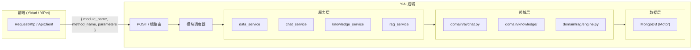
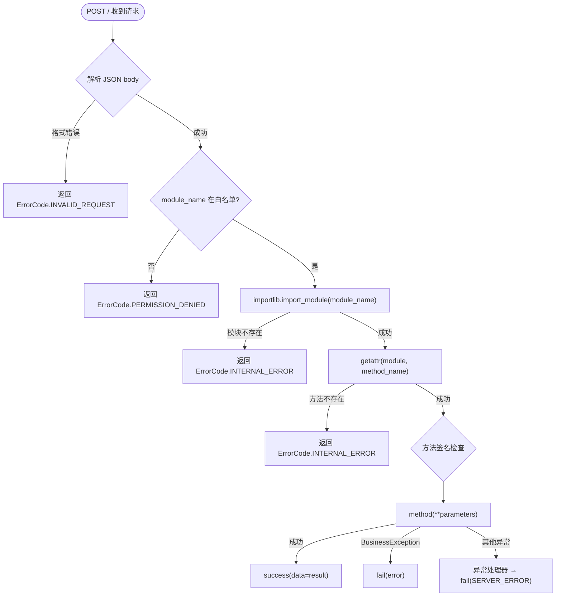
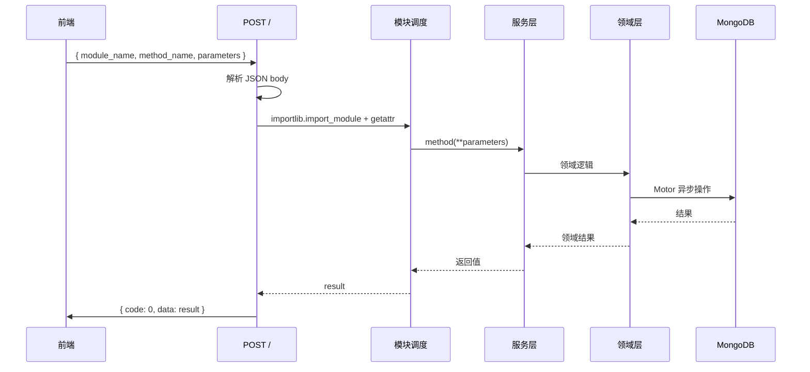
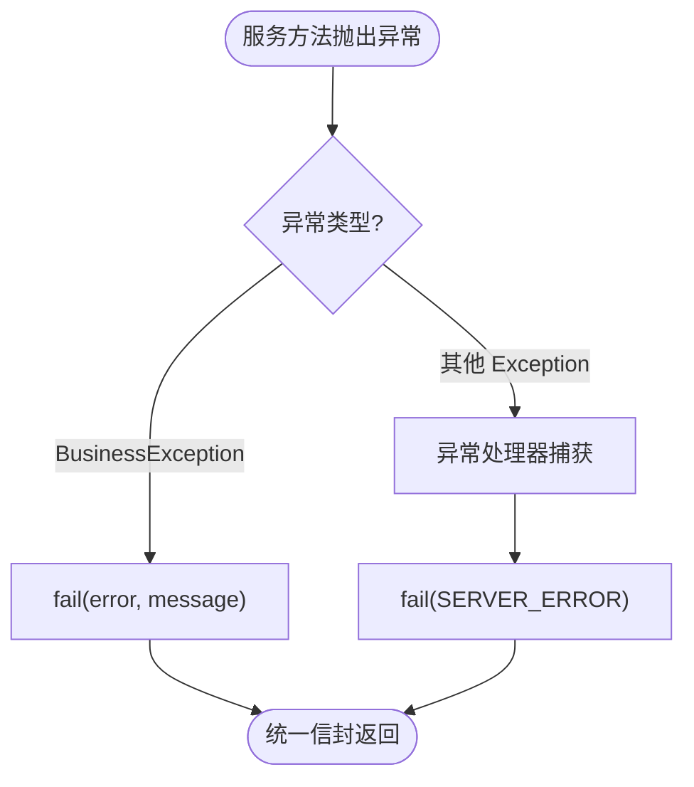

# YA-07-03: RPC 信封协议 — 统一跨项目通信契约 — 开发方案

> 来源 PRD：[03-需求-RPC信封协议.md](../../prds/2026-07/03-需求-RPC信封协议.md)
> 需求编号：YA-07-03 · 优先级：P0 · 人天：3.0d
> 类型：架构 · 状态：已完成

本文档定义 **YiAi RPC 协议的实现方案**——路由机制、错误码体系、响应信封、参数契约。需求见 PRD。

---

## 一、方案概述

### 1.1 架构定位

RPC 信封是 YiVad 和 YiPet 与 YiAi 通信的**唯一协议**。前端不直接访问 MongoDB，所有数据操作通过 `POST /` 的统一入口，以 `{module_name, method_name, parameters}` 路由到后端服务方法。



### 1.2 职责边界

| 层 | 职责 | 明确不做 |
|----|------|---------|
| 根路由 (`app.py` 或路由模块) | 解析信封、动态导入模块、调用方法 | 不解释业务参数 |
| `shared/response.py` | 统一响应封装 (`success`/`fail`) | 不做业务逻辑 |
| `shared/error_codes.py` | 错误码枚举与 HTTP 状态映射 | 不处理异常捕获 |
| `shared/exceptions.py` | `BusinessException` 异常类 | 不做日志记录 |
| 服务层 (`services/`) | RPC 方法的实际实现 | 不直接访问 HTTP 请求对象 |

---

## 二、文件清单

| 文件 | 类型 | 职责 |
|------|------|------|
| `src/shared/response.py` | 已有/增强 | `StandardResponse`、`success()`、`fail()` 响应封装 |
| `src/shared/error_codes.py` | 已有/增强 | `ErrorCode` 枚举、`ErrorInfo` 数据类、HTTP 状态映射 |
| `src/shared/exceptions.py` | 已有/增强 | `BusinessException`——携带 `ErrorCode` 的业务异常 |
| `src/app.py` | 修改 | 根路由 POST / 处理 RPC 信封调度 |
| `src/server/errors.py` | 已有/增强 | 全局异常处理器——`BusinessException` → 统一错误响应 |

---

## 三、模块设计

### 3.1 请求信封 — 根路由调度

```python
# POST /  body: { module_name, method_name, parameters }
module = importlib.import_module(module_name)
method = getattr(module, method_name)
result = await method(**parameters) if asyncio.iscoroutinefunction(method) else method(**parameters)
```

调度流程：



### 3.2 响应信封 — `shared/response.py`

```python
# 成功响应
{ "code": 0, "message": "success", "data": <any> }

# 业务错误
{ "code": <ErrorCode.business>, "message": "<description>", "data": null }
```

`StandardResponse` 泛型类封装 `code`/`message`/`data`/`http_code` 四个字段。`success()` 和 `fail()` 是两个工厂函数，分别构造 `JSONResponse`：

- `success(data, message, pagination, http_code)` — `code` 固定为 `ErrorCode.OK.business` (0)
- `fail(error: ErrorCode, message, data)` — `code` 取自 `error.business`，HTTP 状态码取自 `error.http`

**分页扩展**：`success()` 支持可选的 `pagination` 字典，包含 `pageNum`/`pageSize`/`total`/`totalPages`，与 `data.list` 并列返回。

### 3.3 错误码体系 — `shared/error_codes.py`

```python
@dataclass(frozen=True)
class ErrorInfo:
    business: int   # 业务错误码（响应体 code 字段）
    http: int       # HTTP 状态码
    message: str    # 默认错误消息

class ErrorCode(Enum):
    OK = ErrorInfo(0, 200, "Success")
    # 客户端错误 (1xxx)
    INVALID_REQUEST = ErrorInfo(1000, 400, "Invalid Request")
    BUSINESS_ERROR = ErrorInfo(1001, 400, "Business Error")
    INVALID_PARAMS = ErrorInfo(1002, 400, "Invalid Parameters")
    RATE_LIMITED = ErrorInfo(1003, 429, "Too Many Requests")
    DATA_NOT_FOUND = ErrorInfo(1004, 404, "Resource Not Found")
    PERMISSION_DENIED = ErrorInfo(1008, 403, "Permission Denied")
    UNAUTHORIZED = ErrorInfo(1009, 401, "Unauthorized")
    # 服务端错误 (5xxx)
    SERVER_ERROR = ErrorInfo(5000, 500, "Server Busy")
    INTERNAL_ERROR = ErrorInfo(5001, 500, "Internal Error")
    DATA_STORE_FAIL = ErrorInfo(5002, 500, "Create Failed")
    DATA_UPDATE_FAIL = ErrorInfo(5003, 500, "Update Failed")
    DATA_DESTROY_FAIL = ErrorInfo(5004, 500, "Delete Failed")
```

**设计原则**：
- 客户端错误使用 `1xxx` 段，服务端错误使用 `5xxx` 段
- 每个错误码同时携带 `business`（响应体）和 `http`（状态行）两级语义
- `map_http_to_error_code()` 提供 HTTP 状态码到 `ErrorCode` 的反向映射

### 3.4 业务异常 — `shared/exceptions.py`

```python
class BusinessException(Exception):
    def __init__(self, error: ErrorCode, message: str = None):
        self.error = error
        self.message = message or error.message
```

领域层和服务层抛出 `BusinessException`，由 `server/errors.py` 中的全局异常处理器统一捕获并转换为 `fail()` 响应。这保证异常路径与正常路径返回**相同的信封形状**。

---

## 四、关键参数契约

以下参数名称不匹配曾导致真实 bug——后端会静默忽略错误名称或返回 422：

| 正确 | 错误 | 影响方法 | 根因 |
|------|------|---------|------|
| `filter` | `query` | `data_service.query_documents` | `_build_filter` 按字段名查找，未找到则跳过 |
| `target_file` | `path` | `/read-file`, `/write-file` | FastAPI 参数名不匹配 → 422 |
| `cname` | `collection_name` | `data_service` 全部方法 | 集合名解析失败 |

**强制规则**：新增 RPC 方法时，参数名必须在所有三个项目中保持一致。前端调用前查阅本文件的契约表。

---

## 五、关键流程

### 5.1 正常 RPC 调用



### 5.2 异常路径



---

## 六、实施步骤

| 步骤 | 内容 | 涉及文件 | 验证方式 | 人天 |
|------|------|---------|---------|------|
| 1 | 定义 `ErrorCode` 枚举与 `ErrorInfo` 数据类 | `shared/error_codes.py` | 所有错误码可枚举，HTTP 映射正确 | 0.25 |
| 2 | 实现 `StandardResponse` + `success`/`fail` | `shared/response.py` | 序列化后形状符合契约 | 0.25 |
| 3 | 实现 `BusinessException` | `shared/exceptions.py` | 携带 ErrorCode 抛出与捕获 | 0.25 |
| 4 | 实现 POST / 根路由调度器 | `app.py` | module.method 动态调用成功 | 0.5 |
| 5 | 实现全局异常处理器 | `server/errors.py` | BusinessException → fail() | 0.25 |
| 6 | 记录参数名称契约 | 本文档 §4 | 三项目参数名一致 | 0.25 |
| 7 | 编写单元测试 | `tests/` | ErrorCode/response/exceptions 覆盖率 90%+ | 0.5 |

**合计：2.25d**（原估算 3.0d，实际核心实现约 2.25d，剩余 0.75d 用于协议文档和跨项目对齐）。

---

## 七、边缘场景

| 场景 | 处理策略 | 实现位置 |
|------|---------|---------|
| JSON body 格式错误 | `json.JSONDecodeError` → `fail(INVALID_REQUEST)` | 根路由 |
| 模块不在白名单 | `module_name` 不在允许列表 → `fail(PERMISSION_DENIED)` | 根路由 |
| 模块不存在 | `importlib.import_module` 失败 → `fail(INTERNAL_ERROR)` | 根路由 |
| 方法不存在 | `getattr` 失败 → 同上 | 根路由 |
| 参数类型不匹配 | Python 抛出 `TypeError` → 异常处理器 → `fail(INVALID_PARAMS)` | `server/errors.py` |
| 方法同步/异步混用 | `asyncio.iscoroutinefunction` 判定后分别调用 | 根路由 |
| 参数为 JSON 字符串 | `parse_parameters` 支持 dict 和 JSON 字符串两种输入 | `domain/execution/executor.py` |

---

## 八、已知缺陷

### 缺陷 1：前端参数名与后端不一致无编译期检查

**现象**：`filter`/`query`、`target_file`/`path` 等参数名不匹配不会在编译期暴露，只在运行时表现为静默忽略或 422。

**影响**：新增 RPC 方法时，参数名错误是最常见的跨项目 bug。

**缓解**：本文档 §4 维护参数契约表。未来可通过 RPC 契约测试（`YA-09-14`）在 CI 中自动校验。

### 缺陷 2：无请求日志与链路追踪

**现象**：RPC 调用无结构化日志，排障依赖应用日志。

**改进方向**：后续迭代引入 TraceID 透传（`YA-09-113`）与请求响应日志中间件（`YA-09-141`）。

---

## 九、回滚策略

| 场景 | 回滚方式 | 影响 |
|------|---------|------|
| 调度器逻辑错误 | 回退根路由处理器到上一版本 | 所有 RPC 调用 |
| 错误码映射错误 | 修正 `ErrorCode` 定义 | 错误响应的 code 字段 |
| 参数契约不一致 | 前端同步修正参数名 | 特定方法不可用 |

---

## 十、关联模块

- 依赖：[YA-07-04 AI 聊天服务](./04-prd-task-AI聊天服务.md)——首个大规模使用 RPC 信封的服务
- 依赖：[YA-07-05 模块执行沙箱](./05-prd-task-模块执行沙箱.md)——复用 `parse_parameters` 与错误码
- 下游：[YA-09-14 RPC 契约测试与类型同步](../2026-09/14-prd-task-RPC契约测试与类型同步.md)