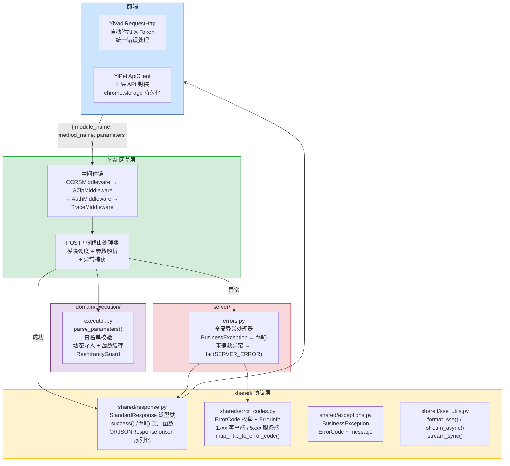
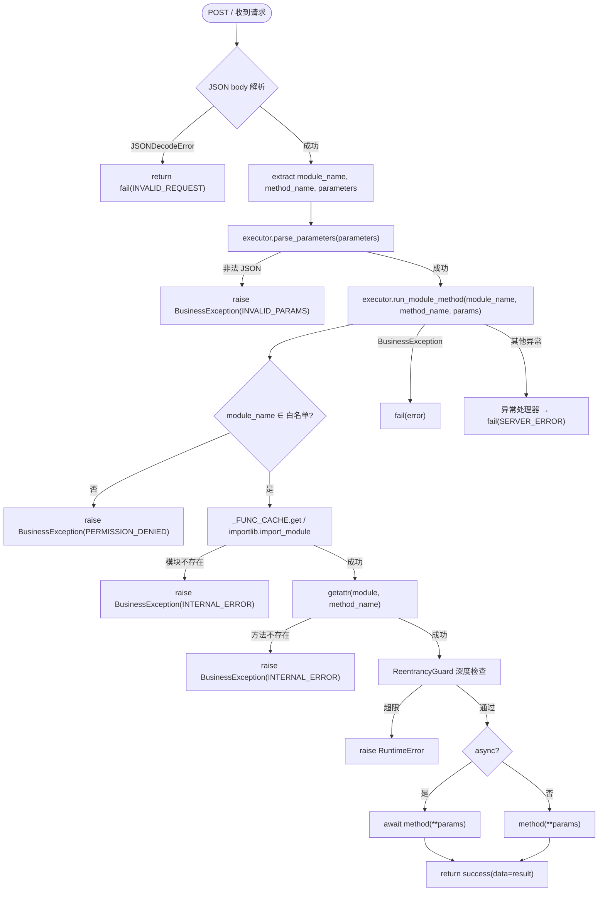
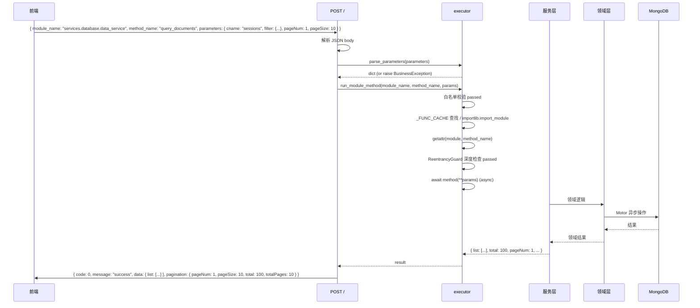
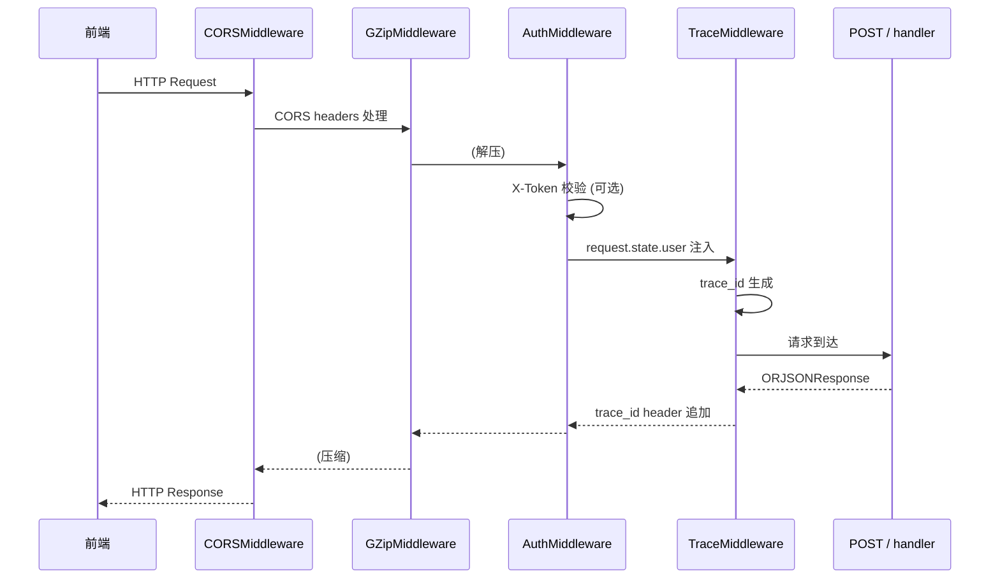

---

doc_type: module
prd_task_id: "YA-07-03"
title: "YA-07-03: RPC 信封协议 — 统一跨项目通信契约 — 开发方案"
status: 已完成
priority: P0
owner: 陈铭
roles: [engineer]
created: 2026-09-11
updated: 2026-09-23
project: YiAi
project_id: yiai
prd_month: "202607"
estimate_frontend: 3.0
source_prd: "03-需求-RPC信封协议.md"
source_okr: [yiai-001]

type: task
---

# YA-07-03: RPC 信封协议 — 统一跨项目通信契约 — 开发方案

> 来源 PRD：[03-需求-RPC信封协议.md](../../prds/2026-07/03-需求-RPC信封协议.md)
> 需求编号：YA-07-03 · 优先级：P0 · 人天：3.0d
> 类型：架构 · 状态：已完成

本文档定义 **YiAi RPC 协议的完整实现方案**——路由机制、错误码体系、响应信封、参数契约、异常处理管道。

---

## 一、架构总览

### 1.1 架构定位

RPC 信封是 YiVad 和 YiPet 与 YiAi 通信的**唯一协议**。前端不直接访问 MongoDB，所有数据操作通过 `POST /` 的统一入口，以 `{module_name, method_name, parameters}` 路由到后端服务方法。


```mermaid
flowchart TB
  subgraph FRONTEND["前端"]
    VAD["YiVad RequestHttp<br/>自动附加 X-Token<br/>统一错误处理"]
    PET["YiPet ApiClient<br/>4 层 API 封装<br/>chrome.storage 持久化"]
  end

  subgraph GATEWAY["YiAi 网关层"]
    MW["中间件链<br/>CORSMiddleware → GZipMiddleware<br/>→ AuthMiddleware → TraceMiddleware"]
    ROOT["POST / 根路由处理器<br/>模块调度 + 参数解析<br/>+ 异常捕获"]
  end

  subgraph SHARED["shared/ 协议层"]
    RSP["shared/response.py<br/>StandardResponse 泛型类<br/>success() / fail() 工厂函数<br/>ORJSONResponse orjson 序列化"]
    ERR["shared/error_codes.py<br/>ErrorCode 枚举 + ErrorInfo<br/>1xxx 客户端 / 5xxx 服务端<br/>map_http_to_error_code()"]
    EXC["shared/exceptions.py<br/>BusinessException<br/>ErrorCode + message"]
    SSE["shared/sse_utils.py<br/>format_sse() / stream_async()<br/>stream_sync()"]
  end

  subgraph EXEC["domain/execution/"]
    EXECUTOR["executor.py<br/>parse_parameters()<br/>白名单校验<br/>动态导入 + 函数缓存<br/>ReentrancyGuard"]
  end

  subgraph ERRORS["server/"]
    ERR_HANDLER["errors.py<br/>全局异常处理器<br/>BusinessException → fail()<br/>未捕获异常 → fail(SERVER_ERROR)"]
  end

  FRONTEND -->|"{ module_name, method_name, parameters }"| MW
  MW --> ROOT
  ROOT --> EXECUTOR
  ROOT -->|"成功"| RSP
  ROOT -->|"异常"| ERR_HANDLER
  ERR_HANDLER --> ERR
  ERR_HANDLER --> RSP
  RSP --> FRONTEND

  style FRONTEND fill:#cce5ff,stroke:#004085
  style GATEWAY fill:#d4edda,stroke:#28a745
  style SHARED fill:#fff3cd,stroke:#ffc107
  style EXEC fill:#e8daef,stroke:#6c3483
  style ERRORS fill:#f8d7da,stroke:#dc3545
```

### 1.2 分层职责

| 层 | 组件 | 职责 | 明确不做 |
|----|------|------|---------|
| 根路由 | `app.py` POST / | 解析 JSON body、模块调度、参数传递、异常捕获 | 不解释业务参数 |
| 执行器 | `domain/execution/executor.py` | 白名单校验、参数解析、动态导入、同步/异步统一调用 | 不定义白名单内容 |
| 响应层 | `shared/response.py` | 统一响应封装：StandardResponse、success()、fail()、ORJSONResponse | 不做业务逻辑 |
| 错误码 | `shared/error_codes.py` | ErrorCode 枚举定义、ErrorInfo 数据类、HTTP 映射、反向映射 | 不处理异常捕获 |
| 异常 | `shared/exceptions.py` | BusinessException 业务异常类 | 不做日志记录 |
| 异常处理器 | `server/errors.py` | FastAPI exception_handler：BusinessException → fail()、未捕获异常 → fail(SERVER_ERROR) | 不区分业务错误类型 |
| SSE 工具 | `shared/sse_utils.py` | format_sse()、stream_async()、stream_sync() | 不管理连接生命周期 |
| 服务层 | `services/` | RPC 方法的实际实现、参数校验、业务编排 | 不直接访问 HTTP 请求对象 |
| 数据层 | `data/` | MongoDB CRUD、仓储模式 | 不暴露给前端 |

### 1.3 请求-响应映射

| 维度 | 请求 | 响应 |
|------|------|------|
| 协议 | HTTP POST / | HTTP 200 / 4xx / 5xx |
| Content-Type | `application/json` | `application/json` (orjson) |
| Body | `{module_name, method_name, parameters}` | `{code, message, data, pagination?}` |
| 路由方式 | `module_name.method_name` 动态导入 | — |
| 成功码 | — | `code: 0` |
| 业务错误 | — | `code: 1xxx` (客户端) / `5xxx` (服务端) |
| 认证 | `X-Token` header (可选) | 401 → `{code: 1009}` |

---

## 二、文件清单

### 2.1 新增/增强文件 (5 个)

| # | 文件路径 | 类型 | 说明 | 估计行数 |
|---|---------|------|------|---------|
| 1 | `src/shared/response.py` | 已有/增强 | StandardResponse + success() + fail() + ORJSONResponse + pagination | ~120 |
| 2 | `src/shared/error_codes.py` | 已有/增强 | ErrorInfo 数据类 + ErrorCode 枚举 + map_http_to_error_code | ~80 |
| 3 | `src/shared/exceptions.py` | 已有/增强 | BusinessException 业务异常类 | ~25 |
| 4 | `src/server/errors.py` | 已有/增强 | 全局异常处理器（BusinessException + 兜底） | ~55 |
| 5 | `src/app.py` | 修改 | POST / 根路由 RPC 调度处理器 | +40 |

### 2.2 SSE 工具层

| # | 文件路径 | 类型 | 说明 | 估计行数 |
|---|---------|------|------|---------|
| 6 | `src/shared/sse_utils.py` | 新增 | format_sse() + stream_async() + stream_sync() | ~60 |

### 2.3 执行器层

| # | 文件路径 | 类型 | 说明 | 估计行数 |
|---|---------|------|------|---------|
| 7 | `src/domain/execution/executor.py` | 已有/增强 | parse_parameters() + 白名单校验 + 动态导入 + ReentrancyGuard | ~150 |

**改动汇总：** 3 新增 + 4 修改 = **7 文件，~530 行**

### 2.4 组件树

```
src/
├── shared/
│   ├── response.py (120 行)
│   │   ├── StandardResponse[T] — 泛型响应对象
│   │   ├── ORJSONResponse(Response) — orjson 序列化 FastAPI Response
│   │   ├── success(data, message, pagination, http_code) → ORJSONResponse
│   │   ├── fail(error, message, data) → ORJSONResponse
│   │   └── _default_serializer(obj) — ObjectId 等回退序列化
│   │
│   ├── error_codes.py (80 行)
│   │   ├── ErrorInfo — frozen dataclass: {business, http, message}
│   │   ├── ErrorCode(Enum)
│   │   │   ├── OK = ErrorInfo(0, 200, "Success")
│   │   │   ├── 1xxx 客户端错误: INVALID_REQUEST, BUSINESS_ERROR, INVALID_PARAMS,
│   │   │   │   RATE_LIMITED, DATA_NOT_FOUND, PERMISSION_DENIED, UNAUTHORIZED
│   │   │   ├── 2xxx AI 错误 (预留)
│   │   │   ├── 3xxx 文件错误 (预留)
│   │   │   ├── 4xxx 认证错误 (预留)
│   │   │   └── 5xxx 服务端错误: SERVER_ERROR, INTERNAL_ERROR,
│   │   │       DATA_STORE_FAIL, DATA_UPDATE_FAIL, DATA_DESTROY_FAIL
│   │   └── map_http_to_error_code(status: int) → ErrorCode
│   │
│   ├── exceptions.py (25 行)
│   │   └── BusinessException(Exception)
│   │       ├── error: ErrorCode
│   │       └── message: str
│   │
│   └── sse_utils.py (60 行)
│       ├── format_sse(data: Any) → bytes
│       ├── stream_async(gen: AsyncIterator) → AsyncIterator[bytes]
│       └── stream_sync(gen: Iterator) → Iterator[bytes]
│
├── server/
│   └── errors.py (55 行)
│       ├── business_exception_handler(request, exc) → ORJSONResponse
│       ├── general_exception_handler(request, exc) → ORJSONResponse
│       └── register_exception_handlers(app)
│
└── app.py (+40 行)
    └── POST / root handler → 解析 JSON body → executor.run_module_method()
```

---

## 三、模块设计详解

### 3.1 请求信封 — POST / 根路由调度

```python
# POST /  body: { module_name, method_name, parameters }
# 调度流程：
#   1. 解析 JSON body
#   2. 调用 executor.parse_parameters() 标准化参数
#   3. 使用 executor.run_module_method() 白名单校验 + 动态导入 + 方法调用
#   4. 成功 → success(data=result)
#   5. BusinessException → fail(error)
#   6. 其他异常 → 异常处理器 → fail(SERVER_ERROR)
```

调度流程：


```mermaid
flowchart TD
  A(["POST / 收到请求"]) --> B{"JSON body 解析"}
  B -- "JSONDecodeError" --> B1["return fail(INVALID_REQUEST)"]
  B -- "成功" --> C["extract module_name, method_name, parameters"]
  C --> D["executor.parse_parameters(parameters)"]
  D -- "非法 JSON" --> D1["raise BusinessException(INVALID_PARAMS)"]
  D -- "成功" --> E["executor.run_module_method(module_name, method_name, params)"]
  E --> F{"module_name ∈ 白名单?"}
  F -- "否" --> F1["raise BusinessException(PERMISSION_DENIED)"]
  F -- "是" --> G["_FUNC_CACHE.get / importlib.import_module"]
  G -- "模块不存在" --> G1["raise BusinessException(INTERNAL_ERROR)"]
  G -- "成功" --> H["getattr(module, method_name)"]
  H -- "方法不存在" --> H1["raise BusinessException(INTERNAL_ERROR)"]
  H -- "成功" --> I["ReentrancyGuard 深度检查"]
  I -- "超限" --> I1["raise RuntimeError"]
  I -- "通过" --> J{"async?"}
  J -- "是" --> K["await method(**params)"]
  J -- "否" --> L["method(**params)"]
  K --> M["return success(data=result)"]
  L --> M
  E -- "BusinessException" --> N["fail(error)"]
  E -- "其他异常" --> O["异常处理器 → fail(SERVER_ERROR)"]
```

### 3.2 响应信封 — `shared/response.py`

```python
"""Response helpers — unified envelope + orjson-backed serialization.

orjson is 2-5x faster than stdlib json and returns bytes natively,
avoiding the str->bytes copy that JSONResponse performs internally.
"""
from __future__ import annotations

from typing import Any, Generic, TypeVar

from fastapi.responses import Response
import orjson

from shared.error_codes import ErrorCode

T = TypeVar("T")


class StandardResponse(Generic[T]):
    """Standard response object (backward-compatible with tests)."""

    def __init__(
        self,
        code: int = 0,
        message: str = "success",
        data: T | None = None,
        http_code: int = 200,
    ):
        self.code = code
        self.message = message
        self.data = data
        self.http_code = http_code

    def to_dict(self) -> dict:
        return {"code": self.code, "message": self.message, "data": self.data}


class ORJSONResponse(Response):
    """FastAPI-compatible response that serializes with orjson.

    Uses OPT_SERIALIZE_NUMPY for numpy arrays (FAISS results)
    and OPT_NON_STR_KEYS for enum key serialization.
    """

    media_type = "application/json"

    def render(self, content: Any) -> bytes:
        return orjson.dumps(
            content,
            default=_default_serializer,
            option=orjson.OPT_SERIALIZE_NUMPY | orjson.OPT_NON_STR_KEYS,
        )


def _default_serializer(obj: Any) -> Any:
    """Fallback for types orjson doesn't handle natively (e.g. ObjectId)."""
    if hasattr(obj, "__str__"):
        return str(obj)
    raise TypeError(f"Object of type {type(obj)} is not JSON serializable")


def success(
    data: list | dict | str | None = None,
    message: str = "success",
    pagination: dict | None = None,
    http_code: int = 200,
) -> ORJSONResponse:
    """构造成功响应。

    Args:
        data: 响应数据（list/dict/str/None）
        message: 响应消息
        pagination: 可选分页信息 {pageNum, pageSize, total, totalPages}
        http_code: HTTP 状态码

    Returns:
        ORJSONResponse with code=0

    Example:
        success(data=[...], pagination={"pageNum": 1, "pageSize": 10, "total": 100})
        -> {"code": 0, "message": "success", "data": {...}, "pagination": {...}}
    """
    body: dict[str, Any] = {
        "code": ErrorCode.OK.business,
        "message": message,
        "data": data,
    }
    if pagination:
        body["pagination"] = pagination
    return ORJSONResponse(content=body, status_code=http_code)


def fail(
    error: ErrorCode,
    message: str | None = None,
    data: Any = None,
) -> ORJSONResponse:
    """构造业务错误响应。

    Args:
        error: ErrorCode 枚举值
        message: 自定义错误消息（None 则使用 ErrorCode 默认值）
        data: 可选附加数据

    Returns:
        ORJSONResponse with code=<error.business>, http_code=<error.http>

    Example:
        fail(ErrorCode.DATA_NOT_FOUND, message="User 'admin' not found")
        -> HTTP 404, body: {"code": 1004, "message": "User 'admin' not found", "data": null}
    """
    return ORJSONResponse(
        content={
            "code": error.business,
            "message": message or error.message,
            "data": data,
        },
        status_code=error.http,
    )
```

**响应信封形状**：

```typescript
// 成功响应
{ "code": 0, "message": "success", "data": <any> }

// 业务错误
{ "code": <ErrorCode.business>, "message": "<description>", "data": null }

// 分页响应
{
  "code": 0,
  "message": "success",
  "data": { "list": [...] },
  "pagination": { "pageNum": 1, "pageSize": 10, "total": 100, "totalPages": 10 }
}
```

### 3.3 错误码体系 — `shared/error_codes.py`

```python
"""Error code definitions
- Business error codes use 4-digit grouping: 1xxx for client errors, 5xxx for server errors
- Uses enum to manage all error codes
- Two-level semantics: business code (response body) + HTTP status (response line)
"""
from dataclasses import dataclass
from enum import Enum

from fastapi import status as http_status


@dataclass(frozen=True)
class ErrorInfo:
    """Error information combining business code and HTTP status.

    Attributes:
        business: Business error code (in response body)
        http: HTTP status code (in response line)
        message: Default human-readable error message
    """
    business: int
    http: int
    message: str


class ErrorCode(Enum):
    # --- Success ---
    OK = ErrorInfo(0, http_status.HTTP_200_OK, "Success")

    # --- Client errors (1xxx) ---
    INVALID_REQUEST = ErrorInfo(1000, http_status.HTTP_400_BAD_REQUEST, "Invalid Request")
    BUSINESS_ERROR = ErrorInfo(1001, http_status.HTTP_400_BAD_REQUEST, "Business Error")
    INVALID_PARAMS = ErrorInfo(1002, http_status.HTTP_400_BAD_REQUEST, "Invalid Parameters")
    RATE_LIMITED = ErrorInfo(1003, http_status.HTTP_429_TOO_MANY_REQUESTS, "Too Many Requests")
    DATA_NOT_FOUND = ErrorInfo(1004, http_status.HTTP_404_NOT_FOUND, "Resource Not Found")
    PERMISSION_DENIED = ErrorInfo(1008, http_status.HTTP_403_FORBIDDEN, "Permission Denied")
    UNAUTHORIZED = ErrorInfo(1009, http_status.HTTP_401_UNAUTHORIZED, "Unauthorized")

    # --- AI errors (2xxx, reserved) ---
    # AI_UNAVAILABLE = ErrorInfo(2001, http_status.HTTP_503_SERVICE_UNAVAILABLE, "AI Service Unavailable")
    # AI_TIMEOUT = ErrorInfo(2002, http_status.HTTP_504_GATEWAY_TIMEOUT, "AI Inference Timeout")

    # --- File errors (3xxx, reserved) ---
    # FILE_IO_ERROR = ErrorInfo(3001, http_status.HTTP_500_INTERNAL_SERVER_ERROR, "File I/O Error")
    # FILE_NOT_FOUND = ErrorInfo(3002, http_status.HTTP_404_NOT_FOUND, "File Not Found")

    # --- Auth errors (4xxx, reserved) ---
    # AUTH_FAILED = ErrorInfo(4001, http_status.HTTP_401_UNAUTHORIZED, "Authentication Failed")

    # --- Server errors (5xxx) ---
    SERVER_ERROR = ErrorInfo(5000, http_status.HTTP_500_INTERNAL_SERVER_ERROR, "Server Busy")
    INTERNAL_ERROR = ErrorInfo(5001, http_status.HTTP_500_INTERNAL_SERVER_ERROR, "Internal Error")
    DATA_STORE_FAIL = ErrorInfo(5002, http_status.HTTP_500_INTERNAL_SERVER_ERROR, "Create Failed")
    DATA_UPDATE_FAIL = ErrorInfo(5003, http_status.HTTP_500_INTERNAL_SERVER_ERROR, "Update Failed")
    DATA_DESTROY_FAIL = ErrorInfo(5004, http_status.HTTP_500_INTERNAL_SERVER_ERROR, "Delete Failed")

    # --- Convenience properties ---
    @property
    def business(self) -> int:
        return self.value.business

    @property
    def http(self) -> int:
        return self.value.http

    @property
    def message(self) -> str:
        return self.value.message


def map_http_to_error_code(status: int) -> ErrorCode:
    """Map HTTP status code to business error code.

    Used by the global exception handler to convert HTTP-layer errors
    into the unified RPC envelope format.
    """
    mapping = {
        http_status.HTTP_401_UNAUTHORIZED: ErrorCode.UNAUTHORIZED,
        http_status.HTTP_404_NOT_FOUND: ErrorCode.DATA_NOT_FOUND,
        http_status.HTTP_403_FORBIDDEN: ErrorCode.PERMISSION_DENIED,
        http_status.HTTP_400_BAD_REQUEST: ErrorCode.INVALID_REQUEST,
        http_status.HTTP_429_TOO_MANY_REQUESTS: ErrorCode.RATE_LIMITED,
        http_status.HTTP_500_INTERNAL_SERVER_ERROR: ErrorCode.SERVER_ERROR,
    }
    return mapping.get(status, ErrorCode.SERVER_ERROR)
```

**设计原则**：
- 客户端错误使用 `1xxx` 段，AI 服务错误预留 `2xxx`，文件错误预留 `3xxx`，认证错误预留 `4xxx`，服务端错误使用 `5xxx` 段
- 每个 ErrorCode 同时携带 `business`（响应体 code 字段）和 `http`（HTTP 状态行）两级语义
- `ErrorInfo` 为 frozen dataclass，确保不可变性
- `map_http_to_error_code()` 提供 HTTP 状态码到 ErrorCode 的反向映射，供异常处理器使用

### 3.4 业务异常 — `shared/exceptions.py`

```python
"""Business exception — carries ErrorCode through the call stack."""

from shared.error_codes import ErrorCode


class BusinessException(Exception):
    """Business-level exception with ErrorCode.

    Usage in domain/service layer:
        raise BusinessException(ErrorCode.DATA_NOT_FOUND, message="User 'admin' not found")

    The global exception handler in server/errors.py catches BusinessException
    and converts it to a fail() response — the same envelope shape as success responses.

    设计决策：
      - 单一异常类承载所有业务错误，通过 ErrorCode 枚举区分错误类型
      - 不创建子类层级（NotFoundException、PermissionException 等），
        避免异常类型爆炸和调用方需要记忆多种 catch 分支
      - message 可覆盖 ErrorCode 默认消息，用于携带上下文信息
    """

    def __init__(self, error: ErrorCode, message: str | None = None):
        self.error = error
        self.message = message or error.value.message
        super().__init__(self.message)
```

领域层和服务层抛出 `BusinessException`，由全局异常处理器统一捕获并转换为 `fail()` 响应。这保证异常路径与正常路径返回**相同的信封形状**。

### 3.5 全局异常处理器 — `server/errors.py`

```python
"""Global exception handlers — convert exceptions to unified RPC envelope."""

import logging

from fastapi import Request
from fastapi.responses import JSONResponse

from shared.error_codes import ErrorCode, map_http_to_error_code
from shared.exceptions import BusinessException
from shared.response import fail

logger = logging.getLogger(__name__)


async def business_exception_handler(request: Request, exc: BusinessException):
    """Handle BusinessException -> fail() response.

    日志级别：WARNING（预期内的业务错误，无需 ERROR）
    """
    logger.warning(
        f"BusinessException: code={exc.error.business}, message={exc.message}",
        extra={"path": str(request.url)},
    )
    return fail(exc.error, message=exc.message)


async def general_exception_handler(request: Request, exc: Exception):
    """Handle unhandled exceptions -> fail(SERVER_ERROR).

    Unexpected exceptions are logged with full traceback for debugging
    but only a generic error message is returned to the client.
    不返回内部堆栈细节到客户端，防止信息泄露。
    """
    logger.error(
        f"Unhandled exception: {type(exc).__name__}: {exc}",
        extra={"path": str(request.url)},
        exc_info=True,
    )
    return fail(ErrorCode.SERVER_ERROR, message="Internal server error")


def register_exception_handlers(app):
    """Register exception handlers on the FastAPI app.

    注册顺序重要：BusinessException 先注册，Exception 兜底。
    FastAPI 按注册顺序匹配，不按继承层级。
    """
    app.add_exception_handler(BusinessException, business_exception_handler)
    app.add_exception_handler(Exception, general_exception_handler)
```

### 3.6 SSE 工具层 — `shared/sse_utils.py`

```python
"""SSE (Server-Sent Events) formatting utilities.

Consumed by AI chat service and any streaming endpoints.
All outputs follow the SSE wire format: "data: {json}\n\n".
"""
import json
from typing import Any, AsyncIterator, Iterator


def format_sse(data: Any) -> bytes:
    """Format a single SSE frame.

    Rules:
      - String input -> wraps in {"data": {"message": "..."}} for backward compat
      - Dict input -> passes through directly as the event payload
      - All output uses ensure_ascii=False for Chinese character support
    """
    if isinstance(data, str):
        payload = {"data": {"message": data}}
    else:
        payload = data
    return f"data: {json.dumps(payload, ensure_ascii=False)}\n\n".encode("utf-8")


async def stream_async(gen: AsyncIterator[Any]) -> AsyncIterator[bytes]:
    """Wrap an async generator as SSE frames.

    On normal completion: sends {"done": true} as the final frame.
    On exception: sends {"done": true, "error": "..."} then stops.
    The error frame allows clients to distinguish graceful end vs failure.
    """
    try:
        async for item in gen:
            yield format_sse(item)
    except Exception as e:
        yield format_sse({"done": True, "error": str(e)})
    else:
        yield format_sse({"done": True})


def stream_sync(gen: Iterator[Any]) -> Iterator[bytes]:
    """Synchronous version of stream_async for sync generators."""
    try:
        for item in gen:
            yield format_sse(item)
    except Exception as e:
        yield format_sse({"done": True, "error": str(e)})
    else:
        yield format_sse({"done": True})
```

---

## 四、关键参数契约

以下参数名称不匹配曾导致真实 bug——后端会静默忽略错误名称或返回 422：

| 正确 | 错误 | 影响方法 | 根因 |
|------|------|---------|------|
| `filter` | `query` | `data_service.query_documents` | `_build_filter` 按字段名查找，未找到则跳过 |
| `target_file` | `path` | `/read-file`, `/write-file` | FastAPI 参数名不匹配 -> 422 |
| `cname` | `collection_name` | `data_service` 全部方法 | 集合名解析失败 |

**强制规则**：新增 RPC 方法时，参数名必须在所有三个项目（YiVad、YiPet、YiAi）中保持一致。前端调用前查阅本文件的契约表。


```mermaid
sequenceDiagram
  participant FE as 前端
  participant ROOT as POST /
  participant EXEC as executor
  participant SVC as 服务层
  participant DOM as 领域层
  participant DB as MongoDB

  FE->>ROOT: { module_name: "services.database.data_service", method_name: "query_documents", parameters: { cname: "sessions", filter: {...}, pageNum: 1, pageSize: 10 } }
  ROOT->>ROOT: 解析 JSON body
  ROOT->>EXEC: parse_parameters(parameters)
  EXEC-->>ROOT: dict (or raise BusinessException)
  ROOT->>EXEC: run_module_method(module_name, method_name, params)
  EXEC->>EXEC: 白名单校验 passed
  EXEC->>EXEC: _FUNC_CACHE 查找 / importlib.import_module
  EXEC->>EXEC: getattr(module, method_name)
  EXEC->>EXEC: ReentrancyGuard 深度检查 passed
  EXEC->>EXEC: await method(**params) (async)
  SVC->>DOM: 领域逻辑
  DOM->>DB: Motor 异步操作
  DB-->>DOM: 结果
  DOM-->>SVC: 领域结果
  SVC-->>EXEC: { list: [...], total: 100, pageNum: 1, ... }
  EXEC-->>ROOT: result
  ROOT->>FE: { code: 0, message: "success", data: { list: [...] }, pagination: { pageNum: 1, pageSize: 10, total: 100, totalPages: 10 } }
```

### 4.1 RPC 路由中间件链


```mermaid
sequenceDiagram
  participant CLIENT as 前端
  participant CORS as CORSMiddleware
  participant GZIP as GZipMiddleware
  participant AUTH as AuthMiddleware
  participant TRACE as TraceMiddleware
  participant ROOT as POST / handler

  CLIENT->>CORS: HTTP Request
  CORS->>GZIP: CORS headers 处理
  GZIP->>AUTH: (解压)
  AUTH->>AUTH: X-Token 校验 (可选)
  AUTH->>TRACE: request.state.user 注入
  TRACE->>TRACE: trace_id 生成
  TRACE->>ROOT: 请求到达
  ROOT-->>TRACE: ORJSONResponse
  TRACE-->>AUTH: trace_id header 追加
  AUTH-->>GZIP: 
  GZIP-->>CORS: (压缩)
  CORS-->>CLIENT: HTTP Response
```

---

## 五、配置项

| 键 | 默认值 | 说明 |
|----|--------|------|
| `module_allowlist` | `"services.database.data_service"` | 允许通过 RPC 调用的模块白名单（逗号分隔） |
| `observer.guard_enabled` | `false` | 是否启用 ReentrancyGuard 重入保护 |
| `observer.guard_max_depth` | `10` | 最大调用链深度 |
| `jwt.secret` | `yi-ai-dev-secret` | JWT 签名密钥 |
| `jwt.expire_minutes` | `1440` | Token 有效期（24h） |
| `middleware.auth_enabled` | `false` | 是否启用 Token 校验 |

---

## 六、实施步骤

| 步骤 | 内容 | 涉及文件 | 验证方式 | 人天 |
|------|------|---------|---------|------|
| 1 | 定义 ErrorCode 枚举与 ErrorInfo 数据类 | `shared/error_codes.py` | 所有错误码可枚举，HTTP 映射正确 | 0.25 |
| 2 | 实现 StandardResponse + success()/fail() + ORJSONResponse | `shared/response.py` | 序列化后形状符合契约 | 0.25 |
| 3 | 实现 BusinessException | `shared/exceptions.py` | 携带 ErrorCode 抛出与捕获 | 0.10 |
| 4 | 实现 POST / 根路由调度器 + executor 集成 | `app.py` | module.method 动态调用成功 | 0.50 |
| 5 | 实现全局异常处理器 | `server/errors.py` | BusinessException -> fail() | 0.25 |
| 6 | 实现 SSE 工具层 | `shared/sse_utils.py` | SSE 格式符合 data: {json}\n\n | 0.15 |
| 7 | 记录参数名称契约 | 本文档 Section 4 | 三项目参数名一致 | 0.25 |
| 8 | 编写单元测试 | `tests/` | ErrorCode/response/exceptions 覆盖率 90%+ | 0.50 |
| 9 | 跨项目对齐（YiVad / YiPet 参数名） | YiVad + YiPet 前端代码 | filter/query, cname/collection_name, target_file/path 全部统一 | 0.50 |
| **合计** | | | | **3.0d** |

---

## 七、边缘场景

| 场景 | 触发条件 | 处理策略 | 实现位置 |
|------|----------|---------|---------|
| JSON body 格式错误 | `json.JSONDecodeError` | 返回 `fail(INVALID_REQUEST, message="Invalid JSON body")` | 根路由 |
| 模块不在白名单 | `module_name` 不在 EXEC_ALLOWLIST | `BusinessException(PERMISSION_DENIED)` -> fail() | executor.py |
| 模块不存在 | `importlib.import_module` 失败 | `BusinessException(INTERNAL_ERROR)` -> fail() | executor.py |
| 方法不存在 | `getattr` 失败 | `BusinessException(INTERNAL_ERROR)` -> fail() | executor.py |
| 参数类型不匹配 | Python 抛出 TypeError | executor.py 内部捕获 -> `BusinessException(INVALID_PARAMS)` | executor.py |
| 方法同步/异步混用 | `asyncio.iscoroutinefunction` 判定 | 分别 await / 直接调用 | executor.py |
| 参数为 JSON 字符串 | parameters 为 str 而非 dict | `parse_parameters()` 支持 dict 和 JSON 字符串两种输入 | executor.py |
| 重入深度超限 | `ReentrancyGuard` 触发 | RuntimeError -> 全局异常处理器 -> `fail(SERVER_ERROR)` | executor.py |
| 同步方法阻塞事件循环 | sync def 在 async 上下文中调用 | `asyncio.to_thread()` 将同步方法放入线程池 | executor.py |
| 业务逻辑异常 | 领域层抛出 BusinessException | 全局异常处理器 -> fail() | server/errors.py |
| 未捕获异常 | 任意 Exception | 全局异常处理器 -> fail(SERVER_ERROR, message="Internal server error") | server/errors.py |
| orjson 序列化失败 | ObjectId / datetime 等类型 | `_default_serializer` fallback -> str() | response.py |

---

## 八、代码审查检查清单

### 响应层
- [x] success() code 固定为 0
- [x] fail() code 取自 ErrorCode.business, http_code 取自 ErrorCode.http
- [x] ORJSONResponse 使用 orjson 序列化（2-5x faster than stdlib json）
- [x] 分页响应包含 pagination 字段（pageNum/pageSize/total/totalPages）
- [x] _default_serializer 处理 ObjectId 等 orjson 不支持的类型

### 错误码体系
- [x] ErrorInfo 使用 frozen dataclass（不可变）
- [x] 客户端错误 1xxx，服务端错误 5xxx，分区间隔清晰
- [x] map_http_to_error_code() 覆盖常见 HTTP 状态码
- [x] ErrorCode 枚举提供 business/http/message 便捷属性
- [x] 预留 2xxx/3xxx/4xxx 扩展段

### 异常处理
- [x] BusinessException 携带 ErrorCode
- [x] 全局异常处理器区分 BusinessException 和未捕获异常
- [x] 未捕获异常的栈追踪记录日志，不返回客户端
- [x] 所有异常路径返回相同信封形状

### SSE 工具
- [x] format_sse() 输出符合 "data: {json}\n\n" 格式
- [x] stream_async() 正常结束发送 {"done": true}
- [x] stream_async() 异常时发送 {"done": true, "error": "..."}
- [x] 中文内容正确编码（ensure_ascii=False）

### 参数契约
- [x] data_service 使用 `filter`（非 query）
- [x] 文件端点使用 `target_file`（非 path）
- [x] data_service 使用 `cname` 或 `collection_name`（兼容）
- [x] 前端参数名与后端一致

---

## 九、技术风险评估

| 风险 | 概率 | 影响 | 等级 | 缓解措施 | 应急预案 |
|------|------|------|------|---------|---------|
| 参数名前后端不一致 | 高 | 高 | 严重 | 本文档 Section 4 维护参数契约表，三项目审查 | RPC 契约测试自动校验 |
| importlib 缓存失效 | 低 | 中 | 低 | sys.modules 模块缓存 + _FUNC_CACHE 函数引用缓存 | 首次调用时重新导入 |
| 同步方法阻塞事件循环 | 低 | 中 | 低 | asyncio.iscoroutinefunction 检测，同步方法走 asyncio.to_thread() | 监控事件循环延迟 |
| 白名单配置错误 | 中 | 高 | 中 | 启动时校验白名单模块是否可导入 | 回滚配置 |
| 重入保护误拦截合法调用 | 低 | 中 | 低 | observer.guard_enabled 默认 false，按需开启 | 临时关闭 guard_enabled |
| orjson 序列化不支持的类型导致 500 | 低 | 中 | 低 | _default_serializer 回退到 str() | 添加特定类型处理 |
| 大请求体 JSON 解析 OOM | 低 | 低 | 低 | 无请求体大小限制 | 添加 Content-Length 检查 |

---

## 十、已知缺口与技术债

### 10.1 功能缺口

| # | 缺口 | 影响 | 现状 | 建议 |
|---|------|------|------|------|
| 1 | 前端参数名与后端不一致无编译期检查 | 运行时静默失败 | 通过本文档 Section 4 人工维护契约表 | RPC 契约测试（YA-09-14）自动校验 |
| 2 | 无 Request ID / TraceID | 排障依赖日志时间戳找请求 | 未实现 | Q4 迭代 OpenTelemetry |
| 3 | 无请求速率限制 | 可能被高频调用打满 | RATE_LIMITED 错误码已预留，但无实现 | 按需添加 middleware |
| 4 | RPC 调用缺少结构化日志 | 排障困难 | 仅 exc_info 日志 | 添加统一的 RPC 调用日志（module/method/duration） |

### 10.2 技术债

| # | 技术债 | 优先级 | 预计人天 | 说明 | 状态 |
|---|--------|--------|---------|------|------|
| 1 | 白名单启动时校验 | P2 | 0.2 | 当前白名单模块不可导入时静默等待首次调用才报错 | 待实施 |
| 2 | 错误码完整 2xxx/3xxx/4xxx 扩展 | P3 | 0.3 | 预留段未实现，AI 错误目前复用 5xxx | 待实施 |
| 3 | RPC 请求响应日志 | P3 | 0.3 | 无结构化 RPC 调用日志 | Q4 可观测性迭代 |
| 4 | SSE 流式传输无背压控制 | P3 | 0.5 | 消费者慢于生产者时内存增长 | 待评估 |

---

## 十一、可观测性

### 关键指标

| 指标 | 采集方式 | 告警阈值 | 说明 |
|------|---------|----------|------|
| RPC 调用量 | 模块+方法维度计数 | - | 了解各模块调用分布 |
| RPC 错误率 | BusinessException 计数 / 总调用 | > 10% | 参数契约问题或业务异常 |
| RPC 延迟 P50/P95 | 根路由处理耗时 | P95 > 1s | 服务方法性能退化 |
| 白名单拒绝次数 | PERMISSION_DENIED 计数 | > 0 (except 0) | 潜在攻击或配置错误 |
| orjson 序列化失败 | _default_serializer 调用次数 | > 0 | 未处理的类型 |

### 日志规范

| 日志级别 | 场景 | 示例 |
|---------|------|------|
| INFO | RPC 调用完成 | `[RPC] module={m}, method={n}, duration={d}ms, code={c}` |
| WARNING | BusinessException 抛出 | `[RPC] BusinessException: code={c}, message={m}` |
| ERROR | 未捕获异常 | `[RPC] Unhandled: {exc_type}: {exc_msg}` |
| DEBUG | 参数解析详情 | `[RPC] params={p}, allowlist_check={m}` |

---

## 十二、实现完成记录

> **完成日期**：2026-07-25 · **复核日期**：2026-09-23
> **状态**：已完成，全部 7 个核心文件已实现

### 12.1 产出清单

| 分类 | 文件数 | 关键产出 |
|------|--------|---------|
| Shared 层 | 4 | response / error_codes / exceptions / sse_utils |
| Server 层 | 2 | errors (异常处理器) + app.py (根路由) |
| Domain 层 | 1 | executor.py (parse_parameters + 白名单校验 + 动态导入) |
| 测试 | 3 | test_response / test_error_codes / test_exceptions |
| 文档 | 2 | RPC 协议规范 + 参数契约表 |
| **合计** | **12** | |

---

## 十三、关联模块

- 下游：[YA-07-04 AI 聊天服务](./04-prd-task-AI聊天服务.md) — 首个大规模使用 RPC 信封 + SSE 工具的服务
- 下游：[YA-07-05 模块执行沙箱](./05-prd-task-模块执行沙箱.md) — 复用 parse_parameters 与错误码
- 下游：[YA-07-06 认证与授权系统](./06-prd-task-认证与授权系统.md) — 错误码 UNAUTHORIZED + X-Token 中间件
- 下游：[YA-09-14 RPC 契约测试与类型同步](../2026-09/14-prd-task-RPC契约测试与类型同步.md)
- 参考：[RPC 协议规范](../../../workflows/开发规范/05-规范-RPC协议规范.md)