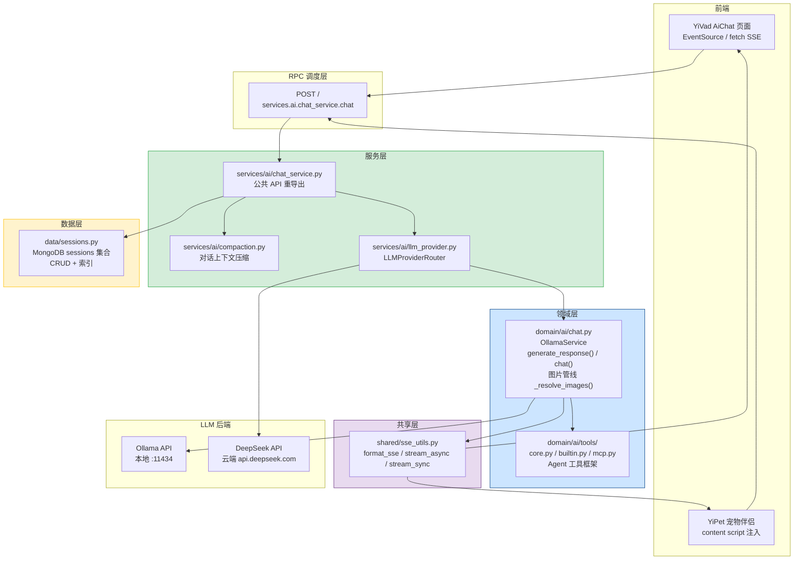
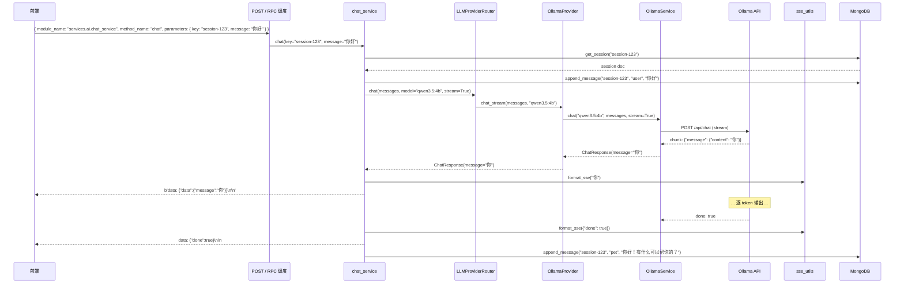

---

doc_type: module
prd_task_id: "YA-07-04"
title: "YA-07-04: AI 聊天服务 — SSE Streaming + Multi-Provider 路由 + 会话管理 — 开发方案"
status: 已完成
priority: P0
owner: 陈铭
roles: [engineer]
created: 2026-09-11
updated: 2026-09-23
project: YiAi
project_id: yiai
prd_month: "202607"
estimate_backend: 4.0
source_prd: "04-需求-AI聊天服务.md"
source_okr: [yiai-002]

type: task
---

# YA-07-04: AI 聊天服务 — SSE Streaming + Multi-Provider 路由 + 会话管理 — 开发方案

> 来源 PRD：[04-需求-AI聊天服务.md](../../prds/2026-07/04-需求-AI聊天服务.md)
> 需求编号：YA-07-04 · 优先级：P0 · 人天：4.0d
> 类型：功能 · 状态：已完成

本文档定义 **AI 聊天服务的完整实现方案**——Ollama 客户端封装、Multi-Provider 路由、SSE 流式传输、图片管线、会话管理。

---

## 一、架构概述

### 1.1 架构定位

AI 聊天服务是 YiAi 的核心服务，为 YiVad（管理后台）和 YiPet（Chrome 扩展）提供统一的聊天能力。服务通过 RPC 信封暴露，内部使用 Multi-Provider 路由选择 LLM 后端（Ollama 本地 / DeepSeek 云端），流式响应通过 SSE（Server-Sent Events）推送给前端。



### 1.2 分层职责

| 层 | 组件 | 职责 | 明确不做 |
|----|------|------|---------|
| 服务层 | `chat_service.py` | 公共 API 重导出、RPC 入口 | 不实现聊天逻辑 |
| Provider 路由 | `llm_provider.py` | 多 Provider 选择、fallback | 不管理会话 |
| 领域层 | `domain/ai/chat.py` | Ollama API 封装、流式生成、图片处理 | 不关心 HTTP 传输 |
| 工具层 | `domain/ai/tools/` | Agent 工具定义与执行 | 不管理工具注册 |
| 压缩层 | `compaction.py` | 对话历史压缩 | 不修改原始消息 |
| 数据层 | `data/sessions.py` | 会话 CRUD、MongoDB 持久化 | 不处理消息格式 |
| 共享层 | `shared/sse_utils.py` | SSE 帧格式化 | 不管理连接生命周期 |

---

## 二、文件清单

| # | 文件 | 类型 | 行数 | 职责 |
|---|------|------|------|------|
| 1 | `src/domain/ai/chat.py` | 核心 | ~300 | OllamaService、chat() 流式生成器、图片管线、模型列表 |
| 2 | `src/services/ai/llm_provider.py` | Provider | ~350 | LLMProviderRouter、OllamaProvider、DeepSeekProvider |
| 3 | `src/services/ai/chat_service.py` | 重导出 | ~15 | 公共 API 重导出（noqa: F401） |
| 4 | `src/services/ai/compaction.py` | 功能 | ~180 | 对话上下文压缩、Token 估算 |
| 5 | `src/shared/sse_utils.py` | 工具 | ~60 | format_sse()、stream_async()、stream_sync() |
| 6 | `src/data/sessions.py` | 数据 | ~100 | 会话 CRUD（MongoDB Motor 异步） |
| 7 | `src/domain/ai/tools/core.py` | Agent | ~220 | Agent 工具框架、注册表、执行器 |
| 8 | `src/domain/ai/tools/builtin.py` | Agent | ~250 | 内置工具（文件读写、知识检索、上下文管理） |
| 9 | `src/domain/ai/tools/mcp.py` | Agent | ~230 | MCP 协议工具发现与调用 |

**改动汇总：** 9 文件，~1,705 行

### 组件树

```
src/
├── domain/ai/
│   ├── chat.py (300 行)
│   │   ├── OllamaService
│   │   │   ├── __init__(host, auth)
│   │   │   ├── _get_client() -> ollama.Client
│   │   │   ├── generate_response(system_prompt, user_content, model_name,
│   │   │   │                   images, messages, max_retries) -> dict
│   │   │   ├── chat(model_name, messages, stream, images, keep_alive)
│   │   │   │       -> Iterator[dict]
│   │   │   ├── list_models() -> list[str]
│   │   │   └── _resolve_images(images) -> list[bytes]
│   │   │       ├── _classify_image(image) -> "base64" | "url" | "invalid"
│   │   │       ├── _fetch_image_bytes(url) -> bytes
│   │   │       └── Semaphore(4) 并发获取
│   │   │
│   │   └── 工具函数
│   │       ├── _build_messages(system, user, history) -> list[dict]
│   │       └── _extract_content(response) -> str
│   │
│   └── tools/
│       ├── core.py (220 行)
│       │   ├── ToolDefinition — 工具定义模型
│       │   ├── ToolRegistry — 工具注册表
│       │   ├── ToolExecutor — 工具执行器
│       │   └── parse_tool_calls(response) -> list[ToolCall]
│       │
│       ├── builtin.py (250 行)
│       │   ├── read_file_tool(target_file) -> str
│       │   ├── write_file_tool(target_file, content) -> dict
│       │   ├── search_knowledge(query, top_k) -> list
│       │   ├── get_context() -> dict
│       │   └── list_sessions(filter) -> list
│       │
│       └── mcp.py (230 行)
│           ├── MCPServerConfig — 服务器配置模型
│           ├── MCPClient — MCP 协议客户端
│           ├── discover_tools(server_config) -> list[ToolDefinition]
│           └── call_tool(server_config, tool_name, args) -> dict
│
├── services/ai/
│   ├── chat_service.py (15 行)
│   │   └── 重导出: chat, generate_response, list_models
│   │
│   ├── llm_provider.py (350 行)
│   │   ├── LLMProvider (ABC)
│   │   │   ├── chat(messages, model, stream, **kwargs) -> AsyncIterator[ChatResponse]
│   │   │   ├── chat_stream(messages, model, **kwargs) -> AsyncIterator[str]
│   │   │   └── list_models() -> list[str]
│   │   │
│   │   ├── OllamaProvider(LLMProvider)
│   │   │   ├── 封装 domain/ai/chat.py 的 OllamaService
│   │   │   └── 将 Iterator 包装为 AsyncIterator
│   │   │
│   │   ├── DeepSeekProvider(LLMProvider)
│   │   │   ├── httpx.AsyncClient 调用 DeepSeek API
│   │   │   ├── API Key 从 config.yaml 加载
│   │   │   └── SSE 响应解析
│   │   │
│   │   └── LLMProviderRouter
│   │       ├── __init__() — 注册所有 Provider
│   │       ├── get_provider(model) -> LLMProvider
│   │       ├── chat(messages, model, stream, **kwargs) -> AsyncIterator
│   │       └── list_models() -> list[str]
│   │
│   └── compaction.py (180 行)
│       ├── estimate_tokens(messages) -> int
│       ├── compact_history(messages, max_tokens, strategy)
│       │       -> list[dict]
│       └── summarize_messages(messages) -> str
│
├── shared/
│   └── sse_utils.py (60 行)
│       ├── format_sse(data) -> bytes
│       ├── stream_async(gen) -> AsyncIterator[bytes]
│       └── stream_sync(gen) -> Iterator[bytes]
│
└── data/
    └── sessions.py (100 行)
        ├── create_session(key, title, url, pageContent) -> dict
        ├── get_session(key) -> dict | None
        ├── update_session(key, messages, title, tags) -> dict
        ├── delete_session(key) -> bool
        ├── list_sessions(filter, pageNum, pageSize) -> PaginatedResult
        └── append_message(key, message) -> dict
```

---

## 三、模块设计

### 3.1 OllamaService — `domain/ai/chat.py`

```python
class OllamaService:
    """Ollama 客户端封装 — 非流式 generate_response + 流式 chat。

    封装 ollama Python 库，提供统一的同步接口。流式 chat 返回 Iterator[dict]，
    每个 chunk 包含 {'data': {'message': 'token'}} 格式。
    """

    def __init__(self, host: str | None = None, auth: str | None = None):
        """从配置或参数创建 ollama.Client。

        Args:
            host: Ollama API 地址，默认 settings.ollama_url
            auth: 认证信息，格式 "username:password"，默认 settings.ollama_auth
        """
        self.ollama_url = host or settings.ollama_url
        self.ollama_auth = auth or settings.ollama_auth
        self._image_semaphore = asyncio.Semaphore(4)

    def _get_client(self) -> ollama.Client:
        """从配置创建 ollama.Client。支持认证，120s 超时。"""
        client_kwargs = {"host": self.ollama_url}
        if self.ollama_auth and ":" in self.ollama_auth:
            user, pwd = self.ollama_auth.split(":", 1)
            client_kwargs["auth"] = (user, pwd)
        return ollama.Client(**client_kwargs, timeout=120)

    def generate_response(
        self,
        system_prompt: str | None = None,
        user_content: str | None = None,
        model_name: str = "qwen3.5:4b",
        images: list[str] | None = None,
        messages: list[dict] | None = None,
        max_retries: int = 2,
    ) -> dict:
        """非流式生成 — 传入完整 messages 或 system+user 构造。

        Args:
            system_prompt: 系统提示词
            user_content: 用户消息内容
            model_name: 模型名称
            images: 图片列表 (data: URL 或 HTTP URL)
            messages: 完整消息历史 (传入时忽略 system_prompt/user_content/images)
            max_retries: Ollama 不可达时的最大重试次数

        Returns:
            {'message': '...', 'model': '...', 'usage': {...}}

        Raises:
            BusinessException(AI_UNAVAILABLE): 重试耗尽仍不可达
        """

    def chat(
        self,
        model_name: str,
        messages: list[dict],
        stream: bool = True,
        images: list[str] | None = None,
        keep_alive: str | None = None,
    ) -> Iterator[dict]:
        """流式生成 — 逐 chunk yield Ollama 原始响应。

        Args:
            model_name: 模型名称
            messages: 消息列表 [{role, content}]
            stream: 是否流式
            images: 图片列表
            keep_alive: 模型保持加载时间 (如 "5m")

        Yields:
            {'data': {'message': 'token'}} 逐 token
            {'data': {'usage': {...}}}  最后一帧
        """

    def list_models(self) -> list[str]:
        """从 Ollama API 获取已安装模型列表。"""

    async def _resolve_images(self, images: list[str]) -> list[bytes]:
        """图片管线：分类 -> 解码/获取 -> 返回 bytes[]。

        输入: ["data:image/png;base64,...", "https://example.com/photo.jpg"]
        流程:
          1. 分类: data: URL -> base64 decode; HTTP URL -> 异步获取
          2. 并发获取 HTTP URL（asyncio.Semaphore(4)），10MB / 15s 超时
          3. Content-Type 校验（仅 image/*）
          4. 返回 bytes[]

        边界处理:
          - base64 解码失败: DEBUG 日志 + 跳过
          - HTTP 超时: 跳过，不阻断聊天
          - 非图片 Content-Type: 跳过
          - 图片超过 10MB: 跳过
        """
```

### 3.2 LLMProviderRouter — `services/ai/llm_provider.py`

```python
from abc import ABC, abstractmethod
from enum import Enum
from typing import AsyncIterator
from pydantic import BaseModel


class ChatResponse(BaseModel):
    """统一的聊天响应模型，屏蔽 Provider 差异。"""
    message: str
    model: str
    usage: dict | None = None
    tool_calls: list[dict] | None = None
    finish_reason: str | None = None


class ProviderType(str, Enum):
    OLLAMA = "ollama"
    DEEPSEEK = "deepseek"


class LLMProvider(ABC):
    """LLM Provider 抽象基类。chat() 基于 chat_stream 实现。"""

    @abstractmethod
    async def chat_stream(
        self, messages: list[dict], model: str, **kwargs
    ) -> AsyncIterator[ChatResponse]:
        ...

    @abstractmethod
    def list_models(self) -> list[str]:
        ...

    async def chat(
        self, messages: list[dict], model: str, **kwargs
    ) -> ChatResponse:
        """非流式 — 聚合所有 chunk 为单个 ChatResponse。"""
        full_message = ""
        usage = None
        async for chunk in self.chat_stream(messages, model, **kwargs):
            full_message += chunk.message
            if chunk.usage:
                usage = chunk.usage
        return ChatResponse(message=full_message, model=model, usage=usage)


class OllamaProvider(LLMProvider):
    """本地 Ollama Provider — 通过 asyncio.Queue 桥接同步 Iterator 到 AsyncIterator。"""

    def __init__(self):
        self._service = OllamaService()

    async def chat_stream(
        self, messages: list[dict], model: str, **kwargs
    ) -> AsyncIterator[ChatResponse]:
        queue: asyncio.Queue[ChatResponse | None] = asyncio.Queue()

        def _run_sync():
            try:
                for chunk in self._service.chat(model, messages, stream=True, **kwargs):
                    if "data" in chunk and "message" in chunk["data"]:
                        queue.put_nowait(ChatResponse(message=chunk["data"]["message"]))
            except Exception as e:
                queue.put_nowait(ChatResponse(message=f"[Error: {e}]"))
            finally:
                queue.put_nowait(None)

        asyncio.create_task(asyncio.to_thread(_run_sync))
        while True:
            resp = await queue.get()
            if resp is None:
                break
            yield resp

    def list_models(self) -> list[str]:
        return self._service.list_models()


class DeepSeekProvider(LLMProvider):
    """云端 DeepSeek Provider — 通过 httpx 调用 OpenAI 兼容端点。"""

    def __init__(self):
        self._api_key = settings.deepseek_api_key
        self._base_url = settings.deepseek_base_url
        self._client: httpx.AsyncClient | None = None

    async def _get_client(self) -> httpx.AsyncClient:
        if self._client is None:
            self._client = httpx.AsyncClient(
                base_url=self._base_url,
                headers={"Authorization": f"Bearer {self._api_key}"},
                timeout=httpx.Timeout(60.0),
            )
        return self._client

    async def chat_stream(
        self, messages: list[dict], model: str, **kwargs
    ) -> AsyncIterator[ChatResponse]:
        client = await self._get_client()
        body = {
            "model": model, "messages": messages, "stream": True,
            **{k: v for k, v in kwargs.items()
               if k in ("temperature", "max_tokens", "top_p")},
        }
        async with client.stream("POST", "/v1/chat/completions", json=body) as resp:
            resp.raise_for_status()
            async for line in resp.aiter_lines():
                if line.startswith("data: ") and line != "data: [DONE]":
                    data = json.loads(line[6:])
                    delta = data["choices"][0].get("delta", {})
                    yield ChatResponse(
                        message=delta.get("content", ""),
                        model=model,
                    )

    def list_models(self) -> list[str]:
        return ["deepseek-chat", "deepseek-reasoner"]


class LLMProviderRouter:
    """多 Provider 路由器 — 根据 model 名称自动选择 Provider，支持 fallback。

    路由规则:
      - model 包含 "deepseek" -> DeepSeekProvider
      - 其他 -> OllamaProvider (fallback)
    """

    def __init__(self):
        self._providers: dict[ProviderType, LLMProvider] = {
            ProviderType.OLLAMA: OllamaProvider(),
            ProviderType.DEEPSEEK: DeepSeekProvider(),
        }

    def _resolve_provider_type(self, model: str) -> ProviderType:
        return ProviderType.DEEPSEEK if "deepseek" in model.lower() else ProviderType.OLLAMA

    def get_provider(self, model: str) -> LLMProvider:
        return self._providers[self._resolve_provider_type(model)]

    async def chat(
        self, messages: list[dict], model: str, stream: bool = True,
        fallback_model: str | None = None, **kwargs,
    ) -> AsyncIterator[ChatResponse]:
        """路由 + fallback 切换。"""
        provider = self.get_provider(model)
        try:
            async for chunk in provider.chat_stream(messages, model, **kwargs):
                yield chunk
        except Exception as e:
            if fallback_model:
                logger.warning(f"Provider {model} failed: {e}, falling back to {fallback_model}")
                fallback_provider = self.get_provider(fallback_model)
                async for chunk in fallback_provider.chat_stream(messages, fallback_model, **kwargs):
                    yield chunk
            else:
                raise

    def list_models(self) -> list[str]:
        all_models = []
        for provider in self._providers.values():
            try:
                all_models.extend(provider.list_models())
            except Exception as e:
                logger.warning(f"Failed to list models: {e}")
        return all_models
```

### 3.3 会话管理 — `data/sessions.py`

```python
"""MongoDB sessions 集合 CRUD。

文档结构:
{
  "_id": ObjectId,
  "key": "uuid-v4-hex",
  "url": "",
  "title": "会话标题",
  "pageTitle": "", "pageDescription": "", "pageContent": "",
  "messages": [{
    "type": "user" | "pet",
    "message": "消息内容",
    "timestamp": 1726470000000,
    "imageDataUrls": [],
    "error": false,
    "aborted": false
  }],
  "tags": ["from:/aiChat"],
  "isFavorite": false,
  "createdAt": ISODate,
  "updatedAt": ISODate
}

索引:
  db.sessions.createIndex({ "key": 1 }, { unique: true })
  db.sessions.createIndex({ "updatedAt": -1 })
  db.sessions.createIndex({ "tags": 1 })
  db.sessions.createIndex({ "messages.timestamp": -1 })
"""
from datetime import datetime, timezone
from uuid import uuid4
from motor.motor_asyncio import AsyncIOMotorDatabase
from shared.error_codes import ErrorCode
from shared.exceptions import BusinessException


async def create_session(
    db: AsyncIOMotorDatabase, key: str | None = None,
    title: str = "新会话", url: str = "", page_content: str = "",
) -> dict:
    session_key = key or uuid4().hex
    now = datetime.now(timezone.utc)
    doc = {
        "key": session_key, "url": url, "title": title,
        "pageTitle": "", "pageDescription": "", "pageContent": page_content,
        "messages": [], "tags": [], "isFavorite": False,
        "createdAt": now, "updatedAt": now,
    }
    await db["sessions"].insert_one(doc)
    return doc


async def get_session(db: AsyncIOMotorDatabase, key: str) -> dict | None:
    return await db["sessions"].find_one({"key": key})


async def append_message(
    db: AsyncIOMotorDatabase, key: str, msg_type: str, content: str,
    image_data_urls: list[str] | None = None,
) -> dict:
    message = {
        "type": msg_type, "message": content,
        "timestamp": int(datetime.now(timezone.utc).timestamp() * 1000),
        "imageDataUrls": image_data_urls or [],
        "error": False, "aborted": False,
    }
    result = await db["sessions"].find_one_and_update(
        {"key": key},
        {"$push": {"messages": message},
         "$set": {"updatedAt": datetime.now(timezone.utc)}},
        return_document=True,
    )
    if not result:
        raise BusinessException(ErrorCode.DATA_NOT_FOUND, f"Session {key} not found")
    return result


async def list_sessions(
    db: AsyncIOMotorDatabase, filter: dict | None = None,
    page_num: int = 1, page_size: int = 20,
    order_by: str = "updatedAt", order_type: str = "desc",
) -> dict:
    filter = filter or {}
    total = await db["sessions"].count_documents(filter)
    sort_dir = -1 if order_type == "desc" else 1
    cursor = db["sessions"].find(filter).sort(order_by, sort_dir) \
        .skip((page_num - 1) * page_size).limit(page_size)
    sessions = await cursor.to_list(length=page_size)
    return {"list": sessions, "total": total, "pageNum": page_num, "pageSize": page_size}


async def update_session(
    db: AsyncIOMotorDatabase, key: str,
    title: str | None = None, tags: list[str] | None = None,
    is_favorite: bool | None = None,
) -> dict:
    update_fields = {"updatedAt": datetime.now(timezone.utc)}
    if title is not None: update_fields["title"] = title
    if tags is not None: update_fields["tags"] = tags
    if is_favorite is not None: update_fields["isFavorite"] = is_favorite
    result = await db["sessions"].find_one_and_update(
        {"key": key}, {"$set": update_fields}, return_document=True)
    if not result:
        raise BusinessException(ErrorCode.DATA_NOT_FOUND, f"Session {key} not found")
    return result


async def delete_session(db: AsyncIOMotorDatabase, key: str) -> bool:
    result = await db["sessions"].delete_one({"key": key})
    return result.deleted_count > 0
```

### 3.4 上下文压缩 — `services/ai/compaction.py`

```python
"""对话上下文压缩。
支持两种策略:
  - truncate: 保留最近 N 条消息
  - summarize: 早期消息生成摘要 + 保留最近消息原文
"""
from typing import Literal

CompactionStrategy = Literal["truncate", "summarize"]
CHARS_PER_TOKEN_ESTIMATE = 2.5


def estimate_tokens(messages: list[dict]) -> int:
    total_chars = sum(
        len(str(m.get("content", ""))) + len(str(m.get("role", "")))
        for m in messages)
    return int(total_chars / CHARS_PER_TOKEN_ESTIMATE)


def compact_history(
    messages: list[dict], max_tokens: int = 4096,
    strategy: CompactionStrategy = "truncate",
) -> list[dict]:
    current_tokens = estimate_tokens(messages)
    if current_tokens <= max_tokens:
        return messages

    if strategy == "truncate":
        kept, kept_tokens = [], 0
        for msg in reversed(messages):
            msg_tokens = estimate_tokens([msg])
            if kept_tokens + msg_tokens > max_tokens:
                break
            kept.insert(0, msg)
            kept_tokens += msg_tokens
        return kept

    split_idx = max(1, int(len(messages) * 0.3))
    recent = messages[-split_idx:]
    early = messages[:-split_idx]
    summary_text = summarize_messages(early)
    return [{"role": "system", "content": f"[对话历史摘要]\n{summary_text}"}] + recent


def summarize_messages(messages: list[dict]) -> str:
    parts = []
    for m in messages:
        role = m.get("role", "unknown")
        content = str(m.get("content", ""))[:200]
        parts.append(f"[{role}]: {content}")
    return "\n".join(parts)
```

---

## 四、数据流

### 4.1 流式聊天请求流程



### 4.2 图片管线数据流

```
输入: ["data:image/png;base64,iVBORw0...", "https://cdn.example.com/photo.jpg"]
  │
  ├── _classify_image("data:image/png;base64,...")
  │     └── "base64" -> base64.b64decode(payload) -> bytes
  │
  ├── _classify_image("https://cdn.example.com/photo.jpg")
  │     └── "url" -> _fetch_image_bytes() (asyncio)
  │           ├── Semaphore(4) 限流
  │           ├── httpx.get(url, timeout=15s)
  │           ├── Content-Type 校验 (image/*)
  │           ├── 大小校验 (<= 10MB)
  │           └── response.content -> bytes
  │
  └── 返回: [bytes, bytes] -> 传递给 Ollama API images 参数
```

---

## 五、实施路线图

| 步骤 | 内容 | 输出物 | 验证方式 | 人天 |
|------|------|--------|---------|------|
| 1 | OllamaService 客户端封装 | `domain/ai/chat.py` | `generate_response()` 返回有效回复 | 0.50 |
| 2 | 流式 chat 生成器 + 图片管线 | `domain/ai/chat.py` | `chat()` 逐 chunk yield；图片双路径正常 | 1.00 |
| 3 | Multi-Provider 路由 | `services/ai/llm_provider.py` | Ollama + DeepSeek 按 model 路由；fallback | 0.75 |
| 4 | SSE 工具层 | `shared/sse_utils.py` | `format_sse` + `stream_async` 格式正确 | 0.25 |
| 5 | 会话管理 CRUD | `data/sessions.py` | MongoDB 读写正常，4 个索引 | 0.50 |
| 6 | chat_service 重导出 + RPC 集成 | `services/ai/chat_service.py` | RPC 信封调用成功 | 0.25 |
| 7 | Agent 工具框架 | `domain/ai/tools/` | 工具注册/发现/执行 | 0.50 |
| 8 | 上下文压缩 | `services/ai/compaction.py` | 超长对话截断后仍正常响应 | 0.25 |
| 9 | 集成测试 + 回归 | `tests/` | 流式响应端到端 + 现有测试通过 | 0.50 |
| **合计** | | | | **4.5d** |

---

## 六、边缘场景

| 场景 | 触发条件 | 处理策略 | 位置 |
|------|----------|---------|------|
| Ollama 不可达 | 连接拒绝/超时 | `ErrorCode.AI_UNAVAILABLE`，tenacity 重试 2 次 | `domain/ai/chat.py` |
| DeepSeek API 非 200 | 认证失败/配额耗尽 | `httpx.HTTPStatusError` -> BusinessException | `llm_provider.py` |
| 图片 URL 超时 | HTTP 获取 > 15s | 跳过该图片，不阻断聊天 | `_fetch_image_bytes` |
| 图片超 10MB | `len(buf) > 10MB` | 跳过，记录 WARNING | 同上 |
| 非图片 Content-Type | `!content-type.startswith("image/")` | 跳过 | 同上 |
| base64 解码失败 | `b64decode` 抛异常 | DEBUG 日志 + 跳过 | `_resolve_images` |
| 空消息 | `user_content.strip() == ""` | 不调用 LLM，返回空响应 | `chat_service.py` |
| SSE 生成器异常 | 生成器抛出 | `stream_async` catch -> error 帧 + 关闭 | `shared/sse_utils.py` |
| 客户端断开 | `request.is_disconnected()` | 停止生成，释放资源 | 路由层 |
| Nginx 缓冲 SSE | `proxy_buffering on` | `X-Accel-Buffering: no` | 路由层 |
| 会话不存在 | 追加消息到不存在的 key | `BusinessException(DATA_NOT_FOUND)` | `data/sessions.py` |
| 消息历史超上下文窗口 | Token > 模型限制 | compaction 压缩 | `compaction.py` |

---

## 七、代码审查检查清单

- [x] `chat()` 流式生成器逐 token yield
- [x] 图片管线 base64 + HTTP URL 双路径
- [x] 图片大小 10MB + 超时 15s 限制
- [x] Multi-Provider 按 model 名称路由
- [x] LLMProviderRouter fallback 自动切换
- [x] SSE 格式 `data: {json}\n\n` + `{"done": true}` 结束
- [x] 会话 CRUD MongoDB 读写正确，4 个索引创建
- [x] 空消息直接返回，不调用 LLM
- [x] Ollama 重试 2 次（tenacity）
- [x] 客户端断开时停止 SSE 生成
- [x] `X-Accel-Buffering: no` 禁用 nginx 缓冲
- [x] `ruff` 代码规范通过
- [x] `pytest tests/ -v` 所有测试通过

---

## 八、技术风险评估

| 风险 | 概率 | 影响 | 等级 | 缓解措施 | 应急预案 |
|------|------|------|------|---------|---------|
| Ollama 不可达 | 中 | 高 | 高 | tenacity 重试 2 次 + Dashboard 健康检查 | DeepSeek fallback |
| 同步 Ollama 调用阻塞事件循环 | 中 | 中 | 中 | `asyncio.to_thread()` 放入线程池 | 监控事件循环延迟 |
| 图片管线内存占用 | 低 | 中 | 低 | 10MB 单张限制 + Semaphore(4) | OOM Killer 保护 |
| SSE 连接未正确关闭 | 低 | 中 | 低 | `request.is_disconnected()` + finally | 客户端重连 |
| 会话消息无限增长 | 中 | 低 | 低 | compaction 压缩 + 最大消息数限制 | 管理员手动清理 |
| DeepSeek API 配额耗尽 | 低 | 中 | 低 | Dashboard 用量监控 | Ollama fallback |

---

## 九、已知缺陷与技术债

### 9.1 已知缺陷

| # | 缺陷 | 影响 | 修复 |
|---|------|------|------|
| 1 | `generate_response` 为同步方法 | 阻塞事件循环 | 已用 asyncio.to_thread() 隔离 |
| 2 | 无请求级超时控制 | Ollama 推理可能长时间无响应 | YA-09-115 超时传播 |
| 3 | 消息历史无自动截断 | 超长对话超出上下文窗口 | YA-09-13 上下文压缩 |

### 9.2 技术债

| # | 技术债 | 优先级 | 人天 | 说明 | 状态 |
|---|--------|--------|------|------|------|
| 1 | 会话消息全文搜索 | P2 | 0.5 | 当前仅按 key/tags 查询 | 待实施 |
| 2 | 消息编辑/删除 | P2 | 0.3 | 消息不可编辑或删除 | 待实施 |
| 3 | Token 精确计数 | P3 | 0.5 | 当前使用字符数估算 | 待评估 |
| 4 | 流式 token 用量实时统计 | P3 | 0.3 | 仅在最后汇总 | 待实施 |

---

## 十、可观测性

### 关键指标

| 指标 | 采集方式 | 告警阈值 | 说明 |
|------|---------|----------|------|
| 聊天请求量 | 按 provider/model 维度计数 | - | 了解使用分布 |
| SSE 流式中断率 | 中断次数 / 总流式请求 | > 5% | 客户端断开或网络问题 |
| Provider fallback 次数 | Router fallback 触发计数 | > 10/min | 主 Provider 不稳定 |
| 平均首 Token 延迟 | 首个 SSE chunk 到达时间 | > 3s | Provider 响应慢 |

### 日志规范

| 日志级别 | 场景 | 示例 |
|---------|------|------|
| INFO | 聊天请求完成 | `[Chat] session={k}, model={m}, provider={p}, {ms}ms` |
| WARNING | Ollama 重试 | `[Chat] Ollama retry {n}/{max}: {error}` |
| WARNING | Provider fallback | `[Chat] fallback: {from} -> {to}, reason={e}` |
| ERROR | 所有 Provider 失败 | `[Chat] all providers failed for session={k}` |

---

## 十一、关联模块

| 模块 | 关系 | 文件 |
|------|------|------|
| RPC 信封协议 | 依赖 | `YA-07-03` |
| Multi-Provider LLM | 依赖 | `YA-08-02` -- `LLMProviderRouter` |
| OpenAI 兼容 API | 消费 Provider 层 | `YA-08-09` |
| Agent 工具系统 | 下游 | `YA-08-13` -- `domain/ai/tools/` |
| 上下文压缩 | 下游优化 | `YA-09-13` -- `compaction.py` |
| ModelRuntime 抽象层 | 上游封装 | `YA-08-14` |
| SSE 工具层 | 共享 | `shared/sse_utils.py` |