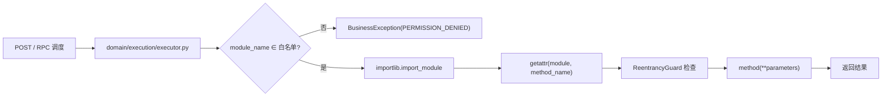

# YA-07-05: 模块执行沙箱 — 白名单校验 + 动态导入 + Observer 沙箱 + 重入保护 — 开发方案

> 来源 PRD：[05-需求-模块执行沙箱.md](../../prds/2026-07/05-需求-模块执行沙箱.md)
> 需求编号：YA-07-05 · 优先级：P0 · 人天：3.0d
> 类型：功能 · 状态：已完成

本文档定义 **模块执行沙箱的实现方案**——RPC 方法的参数解析、模块白名单、同步/异步统一调用、Observer 安全防护。

---

## 一、方案概述

### 1.1 定位

模块执行器是 RPC 信封的**实际调度引擎**——接收 `{module_name, method_name, parameters}`，校验白名单，动态导入模块并调用方法。同时也是 Observer 安全防护（沙箱、重入保护）的集成点。



### 1.2 职责边界

| 组件 | 职责 | 明确不做 |
|------|------|---------|
| `executor.py` | 白名单校验、参数解析、动态导入、方法调用 | 不定义白名单内容 |
| Observer 沙箱 | 资源限制、调用深度控制 | 不干预业务逻辑 |
| `config.yaml` | 定义白名单 (`module_allowlist`) | — |

---

## 二、文件清单

| 文件 | 类型 | 职责 |
|------|------|------|
| `src/domain/execution/executor.py` | 新增 | `parse_parameters()`、`run_script()`、白名单校验 |
| `src/domain/execution/__init__.py` | 新增 | 公开 API 导出 |
| `src/server/routes/execution.py` | 新增 | `/execution/*` REST 端点 |
| `config.yaml` | 修改 | `module_allowlist` 配置 |

---

## 三、模块设计

### 3.1 参数解析 — `parse_parameters()`

```python
def parse_parameters(parameters: Union[Dict[str, Any], str]) -> Dict[str, Any]:
    if isinstance(parameters, dict):
        return parameters
    try:
        parsed = json.loads(parameters)
    except json.JSONDecodeError as e:
        raise BusinessException(ErrorCode.INVALID_PARAMS, message=f"Invalid JSON: {e!s}")
    if not isinstance(parsed, dict):
        raise BusinessException(ErrorCode.INVALID_PARAMS, message="Parameters must be a JSON object")
    return parsed
```

支持 dict 和 JSON 字符串两种输入，使前端可以灵活选择传参方式。

### 3.2 白名单校验

```python
allowlist = settings.module_allowlist  # 从 config.yaml 加载
EXEC_ALLOWLIST = set(allowlist)

# 调用前校验
if module_name not in EXEC_ALLOWLIST:
    raise BusinessException(ErrorCode.PERMISSION_DENIED)
```

白名单在模块加载时从 `config.yaml` 读取，支持逗号分隔的字符串或 YAML 列表两种配置格式。

### 3.3 脚本执行 — `run_script()`

```python
async def run_script(script_path: str, timeout: int = 300) -> Dict[str, Any]:
    # 1. 读取脚本文件
    # 2. subprocess 执行（超时控制）
    # 3. 捕获 stdout/stderr
    # 4. 返回 { stdout, stderr, return_code }
```

### 3.4 Observer 集成

执行器延迟导入 Observer 组件（`ReentrancyGuard`），避免循环依赖：

```python
_guard = None

def _get_guard():
    global _guard
    if _guard is None and settings.observer_guard_enabled:
        from observer import ReentrancyGuard
        _guard = ReentrancyGuard(max_depth=settings.observer_guard_max_depth)
    return _guard
```

重入保护：同一调用链深度超过 `max_depth` 时拒绝执行，防止递归爆炸。

---

## 四、配置项

| 键 | 默认值 | 说明 |
|----|--------|------|
| `module_allowlist` | `"services.database.data_service"` | 允许调用的模块列表 |
| `observer.guard_enabled` | `false` | 是否启用重入保护 |
| `observer.guard_max_depth` | `10` | 最大调用深度 |

---

## 五、实施步骤

| 步骤 | 内容 | 涉及文件 | 验证 | 人天 |
|------|------|---------|------|------|
| 1 | 参数解析 + 白名单校验 | `executor.py` | 非法参数 → INVALID_PARAMS；非白名单模块 → PERMISSION_DENIED | 0.5 |
| 2 | 动态导入与同步/异步统一调用 | `executor.py` | `module.method(**params)` 正确执行 | 1.0 |
| 3 | Observer 沙箱 + 重入保护 | `executor.py` | 深度超限拒绝 | 0.5 |
| 4 | 脚本执行 (`run_script`) | `executor.py` | subprocess 超时控制 | 0.5 |
| 5 | 执行端点 + 测试 | `routes/execution.py` + `tests/` | 端到端 RPC 调用 | 0.5 |

**合计：3.0d**。

---

## 六、边缘场景

| 场景 | 处理策略 | 位置 |
|------|---------|------|
| 参数为非法 JSON 字符串 | `json.JSONDecodeError` → `INVALID_PARAMS` | `parse_parameters()` |
| 参数为 JSON 数组而非对象 | 类型检查拒绝 → `INVALID_PARAMS` | 同上 |
| 模块不在白名单 | `PERMISSION_DENIED` | 白名单校验 |
| 方法不存在 | `AttributeError` → `INTERNAL_ERROR` | 动态导入 |
| 同步/异步方法混用 | `asyncio.iscoroutinefunction` 分别调用 | `executor.py` |
| 重入深度超限 | `ReentrancyGuard` 拒绝 | Observer |
| 脚本执行超时 | `subprocess timeout` 终止进程 | `run_script()` |

---

## 七、关联模块

- 依赖：[YA-07-03 RPC 信封协议](./03-prd-task-RPC信封协议.md)——执行器是 RPC 的实际调度引擎
- 消费：[YA-07-04 AI 聊天服务](./04-prd-task-AI聊天服务.md)——Agent 工具调用走执行器
- 下游：[YA-09-07 Agent 可靠性](../2026-09/07-prd-task-Agent可靠性.md)