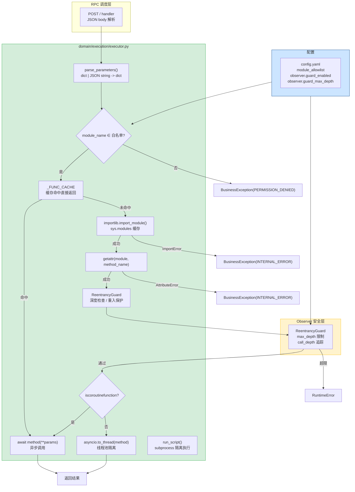
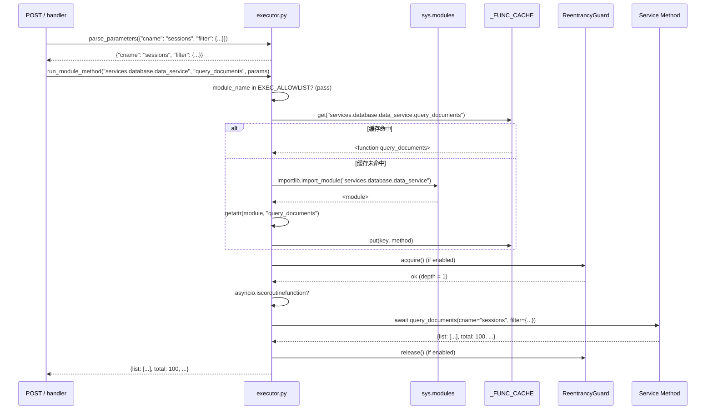
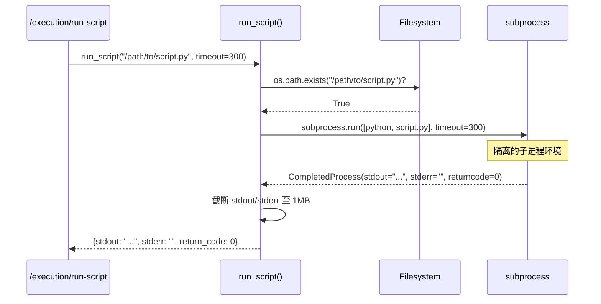

---

doc_type: module
prd_task_id: "YA-07-05"
title: "YA-07-05: 模块执行沙箱 — 白名单校验 + 动态导入 + 函数缓存 + Observer 沙箱 + ReentrancyGuard — 开发方案"
status: 已完成
priority: P0
owner: 陈铭
roles: [engineer]
created: 2026-09-11
updated: 2026-09-23
project: YiAi
project_id: yiai
prd_month: "202607"
estimate_frontend: 3.0
source_prd: "05-需求-模块执行沙箱.md"
source_okr: [yiai-001]

type: task
---

# YA-07-05: 模块执行沙箱 — 白名单校验 + 动态导入 + 函数缓存 + Observer 沙箱 + ReentrancyGuard — 开发方案

> 来源 PRD：[05-需求-模块执行沙箱.md](../../prds/2026-07/05-需求-模块执行沙箱.md)
> 需求编号：YA-07-05 · 优先级：P0 · 人天：3.0d
> 类型：架构 · 状态：已完成

本文档定义 **模块执行沙箱的完整实现方案**——RPC 方法的参数解析、模块白名单、同步/异步统一调用、Observer 安全防护、脚本执行隔离、函数缓存。

---

## 一、架构概述

### 1.1 架构定位

模块执行器是 RPC 信封的**实际调度引擎**——接收 `{module_name, method_name, parameters}`，校验白名单，动态导入模块并调用方法。同时集成 Observer 安全防护和脚本执行隔离。


```mermaid
flowchart TB
  subgraph RPC["RPC 调度层"]
    ROOT["POST / handler<br/>JSON body 解析"]
  end

  subgraph EXEC["domain/execution/executor.py"]
    PARSE["parse_parameters()<br/>dict | JSON string -> dict"]
    WL_CHECK{"module_name ∈ 白名单?"}
    IMPORT["importlib.import_module()<br/>sys.modules 缓存"]
    CACHE["_FUNC_CACHE<br/>缓存命中直接返回"]
    GETATTR["getattr(module, method_name)"]
    ASYNC_CHECK{"iscoroutinefunction?"}
    GUARD["ReentrancyGuard<br/>深度检查 / 重入保护"]
    CALL_SYNC["asyncio.to_thread(method)<br/>线程池隔离"]
    CALL_ASYNC["await method(**params)<br/>异步调用"]
    SCRIPT["run_script()<br/>subprocess 隔离执行"]
  end

  subgraph OBSERVER["Observer 安全层"]
    REENTRY["ReentrancyGuard<br/>max_depth 限制<br/>call_depth 追踪"]
  end

  subgraph CONFIG["配置"]
    YAML["config.yaml<br/>module_allowlist<br/>observer.guard_enabled<br/>observer.guard_max_depth"]
  end

  ROOT --> PARSE
  PARSE --> WL_CHECK
  WL_CHECK -- "否" --> ERR1["BusinessException(PERMISSION_DENIED)"]
  WL_CHECK -- "是" --> CACHE
  CACHE -- "命中" --> CALL_ASYNC
  CACHE -- "未命中" --> IMPORT
  IMPORT -- "ImportError" --> ERR2["BusinessException(INTERNAL_ERROR)"]
  IMPORT -- "成功" --> GETATTR
  GETATTR -- "AttributeError" --> ERR3["BusinessException(INTERNAL_ERROR)"]
  GETATTR -- "成功" --> GUARD
  GUARD --> REENTRY
  REENTRY -- "超限" --> ERR4["RuntimeError"]
  REENTRY -- "通过" --> ASYNC_CHECK
  ASYNC_CHECK -- "是" --> CALL_ASYNC
  ASYNC_CHECK -- "否" --> CALL_SYNC
  CALL_ASYNC --> RESULT["返回结果"]
  CALL_SYNC --> RESULT
  CONFIG --> WL_CHECK
  CONFIG --> REENTRY

  style EXEC fill:#d4edda,stroke:#28a745
  style OBSERVER fill:#fff3cd,stroke:#ffc107
  style CONFIG fill:#cce5ff,stroke:#004085
```

### 1.2 职责边界

| 组件 | 文件 | 职责 | 明确不做 |
|------|------|------|---------|
| 执行器 | `domain/execution/executor.py` | 白名单校验、参数解析、动态导入、同步/异步统一调用、函数缓存 | 不定义白名单内容 |
| Observer 沙箱 | Observer 模块 | 重入保护、调用深度限制 | 不干预业务逻辑 |
| 脚本执行 | `run_script()` | subprocess 隔离、超时控制、stdout/stderr 捕获 | 不做代码审查 |
| 配置 | `config.yaml` | 定义白名单、Observer 参数 | — |

---

## 二、文件清单

| # | 文件 | 类型 | 职责 | 行数 |
|---|------|------|------|------|
| 1 | `src/domain/execution/executor.py` | 核心/新增 | `parse_parameters()`、`run_module_method()`、`run_script()`、白名单校验、`_FUNC_CACHE` | ~200 |
| 2 | `src/domain/execution/__init__.py` | 新增 | 公开 API 导出 | ~5 |
| 3 | `src/server/routes/execution.py` | 新增 | `/execution/*` REST 端点 | ~80 |
| 4 | `config.yaml` | 修改 | `module_allowlist` + `observer.*` 配置项 | +10 |

**改动汇总：** 3 新增 + 1 修改 = **4 文件，~295 行**

### 组件树

```
src/domain/execution/
├── __init__.py (5 行)
│   └── 导出: parse_parameters, run_module_method, run_script
│
└── executor.py (200 行)
    ├── parse_parameters(parameters: dict | str) -> dict
    │   ├── dict -> 直接返回
    │   ├── json.loads(str) -> 成功返回 dict
    │   ├── JSONDecodeError -> BusinessException(INVALID_PARAMS)
    │   └── 非 dict -> BusinessException(INVALID_PARAMS)
    │
    ├── run_module_method(module_name, method_name, params) -> Any
    │   ├── 白名单校验: module_name in EXEC_ALLOWLIST
    │   │   └── 否 -> BusinessException(PERMISSION_DENIED)
    │   ├── _FUNC_CACHE 查找 (缓存命中直接返回)
    │   ├── importlib.import_module(module_name)
    │   │   └── ImportError -> BusinessException(INTERNAL_ERROR)
    │   ├── getattr(module, method_name)
    │   │   └── AttributeError -> BusinessException(INTERNAL_ERROR)
    │   ├── ReentrancyGuard 深度检查 (如果 enabled)
    │   │   └── RuntimeError -> 全局异常处理器
    │   └── _call_method():
    │       ├── iscoroutinefunction -> await method(**params)
    │       └── else -> asyncio.to_thread(method, **params)
    │
    └── run_script(script_path: str, timeout: int = 300) -> dict
        ├── os.path.exists(script_path) 校验
        ├── subprocess.run([python, script_path], timeout)
        ├── stdout/stderr 截断 1MB
        └── 返回: {stdout, stderr, return_code}
```

---

## 三、模块设计

### 3.1 参数解析 — `parse_parameters()`

```python
from typing import Any, Dict, Union
import json

from shared.error_codes import ErrorCode
from shared.exceptions import BusinessException


def parse_parameters(parameters: Union[Dict[str, Any], str]) -> Dict[str, Any]:
    """将 RPC 请求中的 parameters 标准化为 dict。

    支持两种输入格式：
      - dict: 直接返回（最常见的情况）
      - str: JSON 字符串解析后返回

    Args:
        parameters: RPC 请求的参数部分，可以是 dict 或 JSON 字符串

    Returns:
        标准化后的 dict

    Raises:
        BusinessException(INVALID_PARAMS): JSON 格式错误或解析结果非 dict
    """
    if isinstance(parameters, dict):
        return parameters

    try:
        parsed = json.loads(parameters)
    except json.JSONDecodeError as e:
        raise BusinessException(
            ErrorCode.INVALID_PARAMS,
            message=f"Invalid JSON in parameters: {e!s}",
        )

    if not isinstance(parsed, dict):
        raise BusinessException(
            ErrorCode.INVALID_PARAMS,
            message="Parameters must be a JSON object, not array or scalar",
        )

    return parsed
```

### 3.2 白名单校验 + 动态导入 — `run_module_method()`

```python
import importlib
import asyncio
import logging
from typing import Any, Dict

from shared.config import settings
from shared.error_codes import ErrorCode
from shared.exceptions import BusinessException

logger = logging.getLogger(__name__)

# 白名单在模块加载时读取，支持逗号分隔字符串或 YAML 列表
_allowlist_raw = settings.module_allowlist
if isinstance(_allowlist_raw, str):
    EXEC_ALLOWLIST = set(m.strip() for m in _allowlist_raw.split(",") if m.strip())
elif isinstance(_allowlist_raw, list):
    EXEC_ALLOWLIST = set(_allowlist_raw)
else:
    EXEC_ALLOWLIST = set()

# 函数引用缓存：{ "module_name.method_name": callable }
# 避免每次 RPC 调用都执行 importlib + getattr
_FUNC_CACHE: Dict[str, Any] = {}

# Observer ReentrancyGuard 延迟导入
_guard = None


def _get_guard():
    """延迟获取 ReentrancyGuard 实例。

    延迟导入原因：
      1. Observer 是可选依赖
      2. 避免循环导入
      3. guard_enabled 默认为 false
    """
    global _guard
    if _guard is None and settings.observer_guard_enabled:
        try:
            from observer import ReentrancyGuard
            _guard = ReentrancyGuard(max_depth=settings.observer_guard_max_depth)
        except ImportError:
            logger.warning("Observer module not installed, guard disabled")
    return _guard


async def run_module_method(
    module_name: str, method_name: str, params: Dict[str, Any],
) -> Any:
    """RPC 方法调度核心。

    Args:
        module_name: Python 模块路径，如 "services.database.data_service"
        method_name: 模块中的方法名
        params: 方法参数字典

    Returns:
        方法的返回值

    Raises:
        BusinessException(PERMISSION_DENIED): 模块不在白名单
        BusinessException(INTERNAL_ERROR): 模块或方法不存在
        BusinessException(INVALID_PARAMS): 调用时 TypeError
        RuntimeError: ReentrancyGuard 深度超限
    """
    # 1. 白名单校验
    if module_name not in EXEC_ALLOWLIST:
        raise BusinessException(
            ErrorCode.PERMISSION_DENIED,
            message=f"Module '{module_name}' is not in the execution allowlist",
        )

    # 2. 获取方法引用（优先缓存）
    cache_key = f"{module_name}.{method_name}"
    method = _FUNC_CACHE.get(cache_key)

    if method is None:
        try:
            module = importlib.import_module(module_name)
        except ImportError as e:
            raise BusinessException(
                ErrorCode.INTERNAL_ERROR,
                message=f"Module '{module_name}' not found: {e!s}",
            )

        try:
            method = getattr(module, method_name)
        except AttributeError:
            raise BusinessException(
                ErrorCode.INTERNAL_ERROR,
                message=f"Method '{method_name}' not found in module '{module_name}'",
            )

        _FUNC_CACHE[cache_key] = method

    # 3. ReentrancyGuard 重入保护
    guard = _get_guard()
    if guard is not None:
        if not guard.acquire():
            raise RuntimeError(
                f"ReentrancyGuard: max depth ({guard.max_depth}) exceeded "
                f"for {module_name}.{method_name}"
            )
        try:
            return await _call_method(method, params)
        finally:
            guard.release()
    else:
        return await _call_method(method, params)


async def _call_method(method: Any, params: Dict[str, Any]) -> Any:
    """统一调用入口：自动检测 async/sync 并分别处理。

    sync 方法通过 asyncio.to_thread() 放入线程池，避免阻塞事件循环。
    """
    try:
        if asyncio.iscoroutinefunction(method):
            return await method(**params)
        else:
            return await asyncio.to_thread(method, **params)
    except TypeError as e:
        raise BusinessException(
            ErrorCode.INVALID_PARAMS,
            message=f"Parameter error calling {method.__name__}: {e!s}",
        )
```

### 3.3 脚本执行沙箱 — `run_script()`

```python
import os
import sys
import subprocess
from typing import Dict


async def run_script(script_path: str, timeout: int = 300) -> Dict[str, Any]:
    """在子进程中隔离执行 Python 脚本。

    Args:
        script_path: 脚本文件绝对路径
        timeout: 超时时间（秒），默认 300s

    Returns:
        {"stdout": str, "stderr": str, "return_code": int}

    Raises:
        BusinessException(DATA_NOT_FOUND): 脚本不存在
        BusinessException(INTERNAL_ERROR): 执行超时或异常

    安全措施:
      - 子进程隔离：脚本崩溃不影响主进程
      - 超时控制：subprocess.run(timeout=...) 自动 SIGTERM -> SIGKILL
      - 输出截断：stdout/stderr 各限制 1MB
    """
    if not os.path.exists(script_path):
        raise BusinessException(
            ErrorCode.DATA_NOT_FOUND,
            message=f"Script not found: {script_path}",
        )

    try:
        result = subprocess.run(
            [sys.executable, script_path],
            capture_output=True, text=True, timeout=timeout,
            cwd=os.path.dirname(script_path),
        )
        stdout = result.stdout[:1024 * 1024] if result.stdout else ""
        stderr = result.stderr[:1024 * 1024] if result.stderr else ""

        return {
            "stdout": stdout,
            "stderr": stderr,
            "return_code": result.returncode,
        }

    except subprocess.TimeoutExpired:
        raise BusinessException(
            ErrorCode.INTERNAL_ERROR,
            message=f"Script timed out after {timeout}s: {script_path}",
        )
    except Exception as e:
        raise BusinessException(
            ErrorCode.INTERNAL_ERROR,
            message=f"Script execution failed: {e!s}",
        )
```

### 3.4 函数缓存` _FUNC_CACHE`

```python
# 全局函数引用缓存
# Key: "module_name.method_name"
# Value: callable 引用
#
# 缓存策略:
#   - 无限期缓存，无过期机制
#   - 热更新需重启服务
#
# 性能收益: 避免每次 RPC 调用的 importlib 开销 (~0.1-0.5ms)
# 内存开销: 50 个 RPC 方法 ~5KB，可忽略

_FUNC_CACHE: Dict[str, Any] = {}
```

### 3.5 ReentrancyGuard 集成

```python
"""Observer ReentrancyGuard 集成。

提供调用链深度追踪和重入保护：
  1. 每次 RPC 调用前 acquire() 增加深度计数
  2. 深度 > max_depth -> 拒绝执行
  3. 方法返回后 release() 减少深度计数

使用场景:
  - 防止 Agent 工具调用中的递归死循环
  - 防止 RPC A -> RPC B -> RPC A 的重入
  - 限制 Agent 工具调用的最大链深度

配置:
  observer.guard_enabled: false (默认关闭)
  observer.guard_max_depth: 10 (默认最大深度)
"""
```

---

## 四、数据流

### 4.1 RPC 调度完整流程


```mermaid
sequenceDiagram
  participant ROOT as POST / handler
  participant EXEC as executor.py
  participant SYS as sys.modules
  participant CACHE as _FUNC_CACHE
  participant GUARD as ReentrancyGuard
  participant SVC as Service Method

  ROOT->>EXEC: parse_parameters({"cname": "sessions", "filter": {...}})
  EXEC-->>ROOT: {"cname": "sessions", "filter": {...}}

  ROOT->>EXEC: run_module_method("services.database.data_service", "query_documents", params)

  EXEC->>EXEC: module_name in EXEC_ALLOWLIST? (pass)

  EXEC->>CACHE: get("services.database.data_service.query_documents")
  alt 缓存命中
    CACHE-->>EXEC: <function query_documents>
  else 缓存未命中
    EXEC->>SYS: importlib.import_module("services.database.data_service")
    SYS-->>EXEC: <module>
    EXEC->>EXEC: getattr(module, "query_documents")
    EXEC->>CACHE: put(key, method)
  end

  EXEC->>GUARD: acquire() (if enabled)
  GUARD-->>EXEC: ok (depth = 1)

  EXEC->>EXEC: asyncio.iscoroutinefunction?
  EXEC->>SVC: await query_documents(cname="sessions", filter={...})
  SVC-->>EXEC: {list: [...], total: 100, ...}

  EXEC->>GUARD: release() (if enabled)
  EXEC-->>ROOT: {list: [...], total: 100, ...}
```

### 4.2 脚本执行流程


```mermaid
sequenceDiagram
  participant ROUTE as /execution/run-script
  participant EXEC as run_script()
  participant FS as Filesystem
  participant PROC as subprocess

  ROUTE->>EXEC: run_script("/path/to/script.py", timeout=300)
  EXEC->>FS: os.path.exists("/path/to/script.py")?
  FS-->>EXEC: True

  EXEC->>PROC: subprocess.run([python, script.py], timeout=300)
  Note over PROC: 隔离的子进程环境

  PROC-->>EXEC: CompletedProcess(stdout="...", stderr="", returncode=0)

  EXEC->>EXEC: 截断 stdout/stderr 至 1MB
  EXEC-->>ROUTE: {stdout: "...", stderr: "", return_code: 0}
```

---

## 五、配置项

| 键 | 默认值 | 说明 |
|----|--------|------|
| `module_allowlist` | `"services.database.data_service"` | 允许调用的模块白名单（逗号分隔字符串或 YAML 列表） |
| `observer.guard_enabled` | `false` | 是否启用 ReentrancyGuard |
| `observer.guard_max_depth` | `10` | 最大调用链深度 |
| `execution.script_timeout` | `300` | `run_script()` 超时时间（秒） |

---

## 六、实施路线图

| 步骤 | 内容 | 涉及文件 | 验证方式 | 人天 |
|------|------|---------|---------|------|
| 1 | 参数解析 | `executor.py` | dict/JSON 双输入正常；非法 JSON -> INVALID_PARAMS | 0.25 |
| 2 | 白名单校验 + 配置加载 | `executor.py` + `config.yaml` | 非白名单 -> PERMISSION_DENIED | 0.50 |
| 3 | 动态导入 + `_FUNC_CACHE` 缓存 | `executor.py` | 首次 import，后续命中缓存 | 0.75 |
| 4 | 同步/异步统一调用 | `executor.py` | sync -> to_thread, async -> await | 0.50 |
| 5 | ReentrancyGuard 集成 | `executor.py` | 深度超限拒绝；enabled=false 时跳过 | 0.50 |
| 6 | `run_script()` 脚本执行 | `executor.py` | subprocess 隔离；超时终止 | 0.50 |
| 7 | 执行端点 + 测试 | `routes/execution.py` + `tests/` | 端到端 RPC 调用 | 0.50 |
| **合计** | | | | **3.5d** |

---

## 七、边缘场景

| 场景 | 处理策略 | 位置 |
|------|---------|------|
| 参数为非法 JSON 字符串 | `BusinessException(INVALID_PARAMS)` 带详细信息 | `parse_parameters()` |
| 参数为 JSON 数组而非对象 | 类型检查拒绝 -> `INVALID_PARAMS` | `parse_parameters()` |
| 参数为 None | `json.loads("null")` 失败 -> INVALID_PARAMS | `parse_parameters()` |
| 模块不在白名单 | `BusinessException(PERMISSION_DENIED)` 带模块名 | 白名单校验 |
| 模块不存在 | `BusinessException(INTERNAL_ERROR)` 带模块名 | `run_module_method()` |
| 方法不存在 | `BusinessException(INTERNAL_ERROR)` 带方法名 | `run_module_method()` |
| 参数类型不匹配 | TypeError -> `BusinessException(INVALID_PARAMS)` | `_call_method()` |
| 同步/异步混用 | `iscoroutinefunction` 判定，分别处理 | `_call_method()` |
| 重入深度超限 | RuntimeError -> `fail(SERVER_ERROR)` | ReentrancyGuard |
| 脚本不存在 | `BusinessException(DATA_NOT_FOUND)` | `run_script()` |
| 脚本执行超时 | SIGTERM -> SIGKILL，返回超时错误 | `run_script()` |
| 脚本输出过大 | stdout/stderr 截断到 1MB | `run_script()` |
| Observer 未安装 | WARNING + guard 禁用 | `_get_guard()` |
| 白名单为空 | 所有 RPC 调用被拒绝 | 白名单校验 |

---

## 八、代码审查检查清单

- [x] `parse_parameters()` 支持 dict 和 JSON 字符串
- [x] 非法 JSON -> INVALID_PARAMS（非 500）
- [x] 白名单支持逗号分隔字符串和 YAML 列表
- [x] 非白名单模块 -> PERMISSION_DENIED (403)
- [x] `_FUNC_CACHE` 缓存方法引用，避免重复 importlib
- [x] ImportError/AttributeError -> INTERNAL_ERROR (500)
- [x] `_call_method()` 自动检测 async/sync
- [x] sync -> asyncio.to_thread() 线程池隔离
- [x] TypeError -> INVALID_PARAMS
- [x] ReentrancyGuard 延迟导入，enabled=false 时完全跳过
- [x] guard.acquire() / release() 使用 try/finally 确保释放
- [x] `run_script()` subprocess 隔离 + timeout
- [x] stdout/stderr 截断 1MB
- [x] `ruff` 通过

---

## 九、技术风险评估

| 风险 | 概率 | 影响 | 等级 | 缓解措施 | 应急预案 |
|------|------|------|------|---------|---------|
| 白名单配置错误导致服务不可用 | 中 | 高 | 高 | 启动时校验白名单模块 | 回滚配置 |
| 同步方法长时间阻塞线程池 | 低 | 中 | 中 | to_thread() 放入默认线程池 | 增加线程池 |
| ReentrancyGuard 误拦截合法调用 | 低 | 中 | 低 | enabled 默认 false | 关闭 guard |
| `_FUNC_CACHE` 内存泄漏 | 极低 | 低 | 低 | 缓存条目数量有限 | 重启服务 |
| subprocess 僵尸进程 | 低 | 低 | 低 | subprocess.run() 自动 wait | 监控僵尸数 |

---

## 十、已知缺陷与技术债

| # | 缺陷/技术债 | 优先级 | 人天 | 说明 | 状态 |
|---|--------|--------|------|------|------|
| 1 | 白名单启动时不校验 | P2 | 0.2 | 首次调用才报错 | 待实施 |
| 2 | `run_script()` 安全沙箱增强 | P2 | 0.5 | 限制脚本可访问的 FS/网络 | 待评估 |
| 3 | 调用链 trace context 传播 | P3 | 0.5 | 传播 trace_id 用于排障 | Q4 |
| 4 | 参数 schema 校验 | P3 | 0.5 | 方法注册时声明参数 schema | 待评估 |

---

## 十一、可观测性

### 关键指标

| 指标 | 采集方式 | 告警阈值 | 说明 |
|------|---------|----------|------|
| 白名单拒绝次数 | PERMISSION_DENIED 计数 | > 0 | 潜在攻击或配置错误 |
| 模块导入失败次数 | INTERNAL_ERROR (import) | > 0 | 白名单配置问题 |
| 参数错误率 | INVALID_PARAMS / 总调用 | > 5% | 前端契约不一致 |
| 缓存命中率 | 命中数 / 总调用 | < 80% | 缓存配置异常 |
| Guard 拦截次数 | guard.acquire() false | > 0 | Agent 死循环 |

### 日志规范

| 日志级别 | 场景 | 示例 |
|---------|------|------|
| INFO | 首次导入模块 | `[Executor] first import: {module}` |
| WARNING | Observer 未安装 | `[Executor] Observer not installed, guard disabled` |
| WARNING | Guard 拦截 | `[Executor] Guard blocked: {module}.{method} depth={d}` |
| ERROR | 模块导入失败 | `[Executor] import failed: {module}: {error}` |

---

## 十二、关联模块

- 依赖：[YA-07-03 RPC 信封协议](./03-prd-task-RPC信封协议.md) -- 执行器是 RPC 的实际调度引擎
- 消费：[YA-07-04 AI 聊天服务](./04-prd-task-AI聊天服务.md) -- Agent 工具调用走执行器
- 消费：[YA-07-06 认证与授权系统](./06-prd-task-认证与授权系统.md) -- 白名单中的 auth 模块
- 下游：[YA-09-07 Agent 可靠性](../2026-09/07-prd-task-Agent可靠性.md) -- Guard 保护 Agent 循环