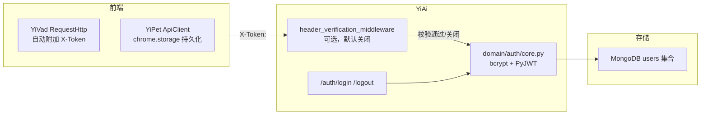
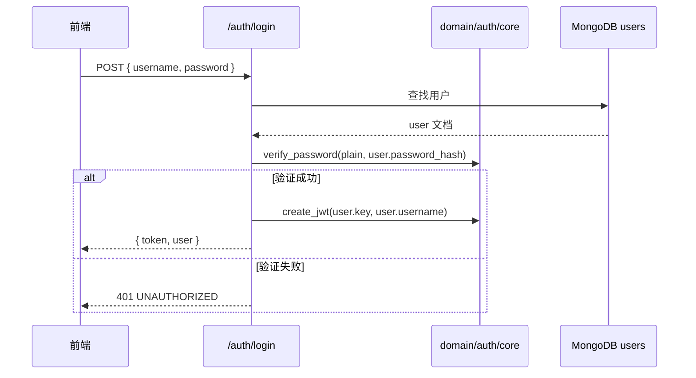

# YA-07-06: 认证与授权系统 — bcrypt + JWT + 可选的 X-Token 中间件 — 开发方案

> 来源 PRD：[06-需求-认证与授权系统.md](../../prds/2026-07/06-需求-认证与授权系统.md)
> 需求编号：YA-07-06 · 优先级：P0 · 人天：1.5d
> 类型：功能 · 状态：已完成

本文档定义 **认证与授权系统的实现方案**——密码哈希、JWT 签发/验证、可选的 Token 中间件、用户管理。

---

## 一、方案概述

### 1.1 认证模型

认证是**可选**的（由 `config.yaml` 的 `middleware.auth_enabled` 控制）。默认关闭以简化开发环境，生产环境按需开启。



### 1.2 职责边界

| 组件 | 文件 | 职责 |
|------|------|------|
| 领域层 | `domain/auth/core.py` | 密码哈希、JWT 签发/解码 |
| 中间件 | `server/middleware.py` | HTTP 层 Token 提取与校验 |
| 路由 | `server/routes/auth.py` | 登录/登出/菜单/按钮权限下发 |
| 用户路由 | `server/routes/users.py` | 用户 CRUD |

---

## 二、文件清单

| 文件 | 类型 | 职责 |
|------|------|------|
| `src/domain/auth/core.py` | 新增 | `hash_password`、`verify_password`、`create_jwt`、`decode_jwt` |
| `src/domain/auth/__init__.py` | 新增 | 公开 API 导出 |
| `src/server/middleware.py` | 新增 | `header_verification_middleware` |
| `src/server/routes/auth.py` | 新增 | `/auth/login`、`/auth/logout`、`/auth/menu/list`、`/auth/buttons` |
| `src/server/routes/users.py` | 新增 | 用户 CRUD 端点 |

---

## 三、模块设计

### 3.1 密码哈希 — `domain/auth/core.py`

```python
def hash_password(plain: str) -> str:
    return bcrypt.hashpw(plain.encode("utf-8"), bcrypt.gensalt()).decode("utf-8")

def verify_password(plain: str, stored: str) -> bool:
    if not plain or not stored:
        return False
    try:
        return bcrypt.checkpw(plain.encode("utf-8"), stored.encode("utf-8"))
    except (ValueError, TypeError):
        # 空/损坏的哈希 → 视为不匹配，不崩溃
        return False
```

`verify_password` 永不抛异常——损坏的哈希返回 `False` 而非 500。

### 3.2 JWT 管理

```python
_JWT_ALGORITHM = "HS256"

def create_jwt(user_id: str, username: str) -> str:
    payload = {
        "sub": user_id, "username": username,
        "iat": datetime.now(timezone.utc),
        "exp": datetime.now(timezone.utc) + timedelta(minutes=expire_minutes),
    }
    return jwt.encode(payload, secret, algorithm=_JWT_ALGORITHM)

def decode_jwt(token: str) -> dict | None:
    try:
        return jwt.decode(token, secret, algorithms=[_JWT_ALGORITHM])
    except jwt.PyJWTError:
        return None
```

**配置项**（`config.yaml`）：

| 键 | 默认值 | 说明 |
|----|--------|------|
| `middleware.auth_enabled` | `false` | 是否启用 Token 校验 |
| `jwt.secret` | `yi-ai-dev-secret` | JWT 签名密钥 |
| `jwt.expire_minutes` | `1440` | Token 有效期（24h） |

### 3.3 Token 中间件 — `server/middleware.py`

```python
async def header_verification_middleware(request, call_next):
    if request.url.path in WHITELIST:
        return await call_next(request)
    token = request.headers.get("X-Token")
    if not token or not decode_jwt(token):
        return JSONResponse(status_code=401, content=fail(UNAUTHORIZED))
    request.state.user = decode_jwt(token)
    return await call_next(request)
```

白名单路径：`/auth/login`、`/health`、`/about`、静态文件。

### 3.4 登录流程



---

## 四、接口契约

| 端点 | 方法 | 参数 | 认证 |
|------|------|------|------|
| `/auth/login` | POST | `{ username, password }` | 否（白名单） |
| `/auth/logout` | POST | — | 是 |
| `/auth/menu/list` | GET | — | 是（按角色返回菜单树） |
| `/auth/buttons` | GET | — | 是（按角色返回按钮权限） |
| `/users` | GET/POST | `{ filter? }` / `{ username, password, roles }` | 是 |

---

## 五、实施步骤

| 步骤 | 内容 | 涉及文件 | 验证 | 人天 |
|------|------|---------|------|------|
| 1 | bcrypt 哈希 + JWT 签发/验证 | `domain/auth/core.py` | 单元测试：hash → verify 往返 | 0.5 |
| 2 | HTTP 中间件 | `server/middleware.py` | curl 无 Token → 401 | 0.25 |
| 3 | 登录/登出端点 | `server/routes/auth.py` | curl 登录 → 获取 Token → 访问受保护端点 | 0.5 |
| 4 | 用户 CRUD + 菜单/按钮下发 | `server/routes/auth.py` + `users.py` | 按角色返回不同菜单树 | 0.25 |

**合计：1.5d**。

---

## 六、边缘场景

| 场景 | 处理策略 | 位置 |
|------|---------|------|
| 损坏的密码哈希 | `verify_password` 捕获异常，返回 `False` | `core.py` |
| JWT 过期 | `decode_jwt` → `None` → 中间件返回 401 | `middleware.py` |
| JWT 密钥未配置 | 使用默认开发密钥（生产需替换） | `config.yaml` |
| 中间件关闭 | `auth_enabled=false` → 跳过所有校验 | `middleware.py` |
| 用户不存在 | 登录返回 401（不区分原因） | `routes/auth.py` |

---

## 七、已知缺陷

### 缺陷 1：JWT Secret 硬编码默认值

生产部署时必须替换 `yi-ai-dev-secret`，否则 Token 可被伪造。后续通过 `YA-09-139`（密钥管理）解决。

### 缺陷 2：无 Token 刷新机制

Token 过期后需重新登录，无 refresh token。后续按需引入。

### 缺陷 3：认证默认关闭

`auth_enabled` 默认为 `false`——属于配置风险，非代码缺陷。

---

## 八、关联模块

- 依赖：[YA-07-03 RPC 信封协议](./03-prd-task-RPC信封协议.md)——错误码 `UNAUTHORIZED`
- 下游：[YV-07-07 权限系统与动态菜单](../../yivad/devs/2026-07/07-prd-task-权限系统与动态菜单.md)——消费 `/auth/menu/list` 和 `/auth/buttons`
- 下游：[YA-09-139 密钥管理与凭证轮换](../2026-09/139-prd-task-密钥管理与凭证轮换.md)