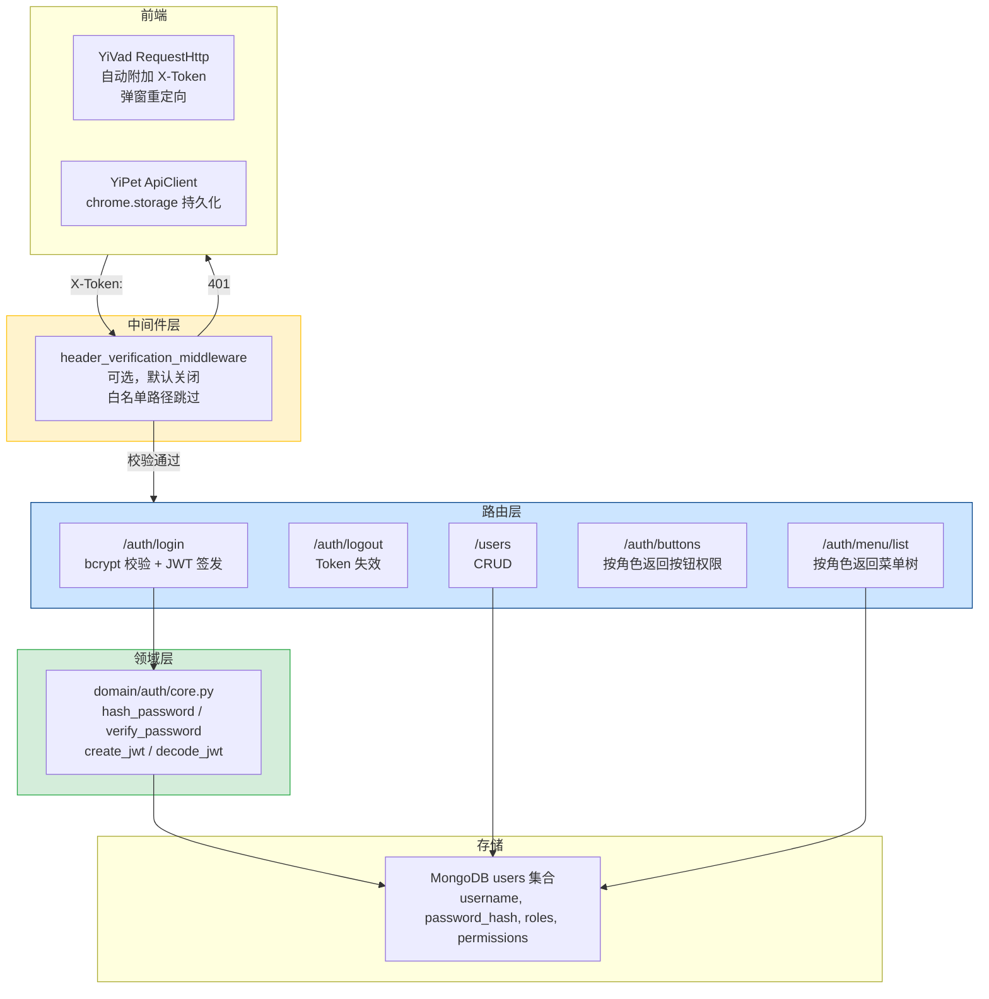
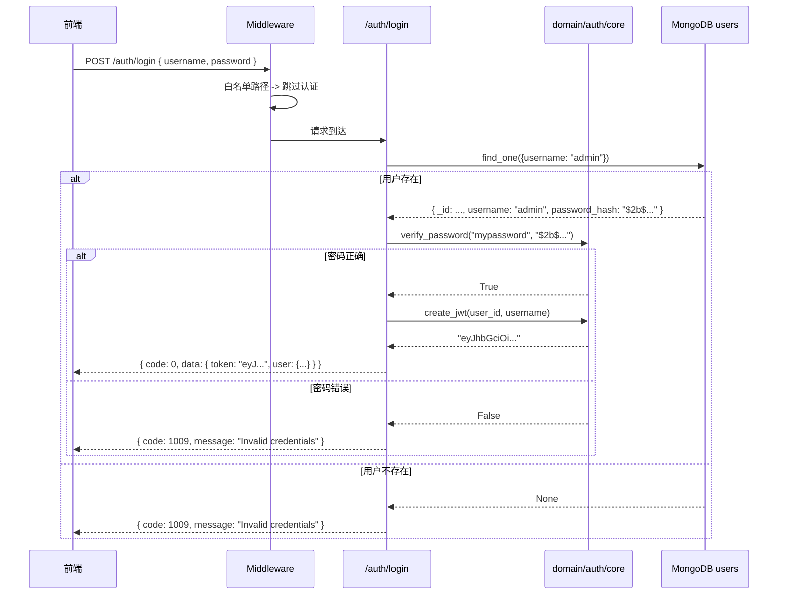
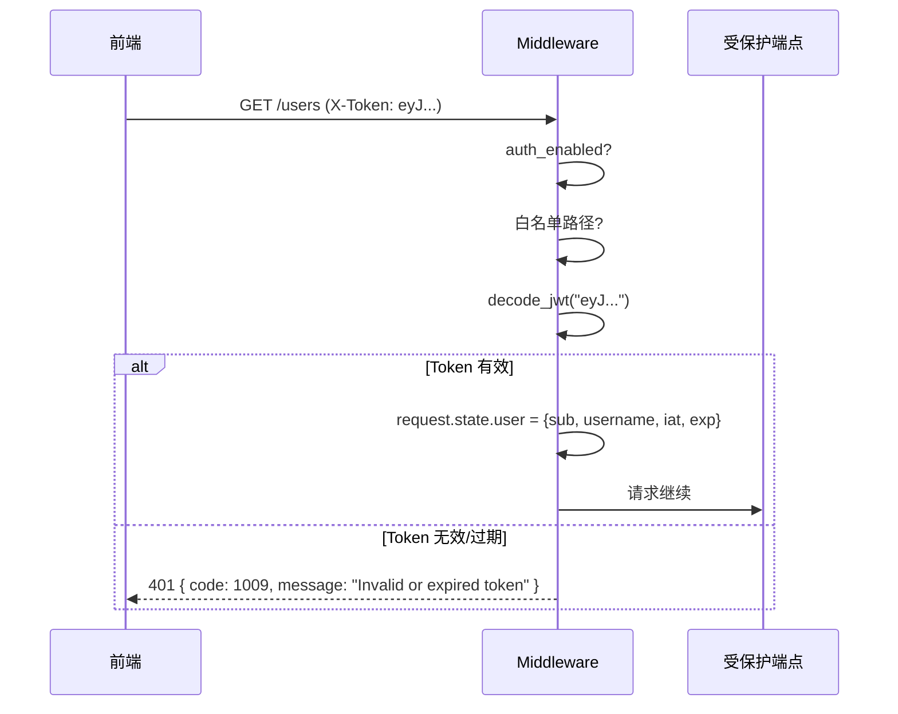

---

doc_type: module
prd_task_id: "YA-07-06"
title: "YA-07-06: 认证与授权系统 — bcrypt + JWT + X-Token 中间件 + 权限模型 — 开发方案"
status: 已完成
priority: P0
owner: 陈铭
roles: [engineer]
created: 2026-09-11
updated: 2026-09-23
project: YiAi
project_id: yiai
prd_month: "202607"
estimate_frontend: 1.5
source_prd: "06-需求-认证与授权系统.md"
source_okr: [yiai-001]

type: task
---

# YA-07-06: 认证与授权系统 — bcrypt + JWT + X-Token 中间件 + 权限模型 — 开发方案

> 来源 PRD：[06-需求-认证与授权系统.md](../../prds/2026-07/06-需求-认证与授权系统.md)
> 需求编号：YA-07-06 · 优先级：P0 · 人天：1.5d
> 类型：功能 · 状态：已完成

本文档定义 **认证与授权系统的完整实现方案**——bcrypt 密码哈希、JWT 签发/验证、可选 X-Token 中间件、用户管理、权限下发。

---

## 一、架构概述

### 1.1 架构定位

认证与授权系统为 YiAi 提供可选的 Token 安全层。认证默认关闭以简化开发环境，生产环境通过 `config.yaml` 的 `middleware.auth_enabled` 开启。


```mermaid
graph TD
  subgraph FE["前端"]
    VAD["YiVad RequestHttp<br/>自动附加 X-Token<br/>弹窗重定向"]
    PET["YiPet ApiClient<br/>chrome.storage 持久化"]
  end

  subgraph MW["中间件层"]
    AUTH_MW["header_verification_middleware<br/>可选，默认关闭<br/>白名单路径跳过"]
  end

  subgraph ROUTES["路由层"]
    LOGIN["/auth/login<br/>bcrypt 校验 + JWT 签发"]
    LOGOUT["/auth/logout<br/>Token 失效"]
    MENU["/auth/menu/list<br/>按角色返回菜单树"]
    BUTTONS["/auth/buttons<br/>按角色返回按钮权限"]
    USERS["/users<br/>CRUD"]
  end

  subgraph DOMAIN["领域层"]
    CORE["domain/auth/core.py<br/>hash_password / verify_password<br/>create_jwt / decode_jwt"]
  end

  subgraph DB["存储"]
    MONGO["MongoDB users 集合<br/>username, password_hash, roles, permissions"]
  end

  FE -->|"X-Token: <jwt>"| AUTH_MW
  AUTH_MW -->|"校验通过"| ROUTES
  AUTH_MW -->|"401"| FE
  LOGIN --> CORE --> MONGO
  USERS --> MONGO
  MENU --> MONGO

  style DOMAIN fill:#d4edda,stroke:#28a745
  style MW fill:#fff3cd,stroke:#ffc107
  style ROUTES fill:#cce5ff,stroke:#004085
```

### 1.2 职责边界

| 组件 | 文件 | 职责 | 明确不做 |
|------|------|------|---------|
| 领域层 | `domain/auth/core.py` | bcrypt 哈希、JWT 签发/解码 | 不处理 HTTP 请求 |
| 中间件 | `server/middleware.py` | HTTP 层 Token 提取与校验 | 不做用户管理 |
| 路由 | `server/routes/auth.py` | 登录/登出/菜单/按钮权限下发 | 不直接操作数据库 |
| 用户路由 | `server/routes/users.py` | 用户 CRUD 端点 | 不做权限判定 |

---

## 二、文件清单

| # | 文件 | 类型 | 职责 | 行数 |
|---|------|------|------|------|
| 1 | `src/domain/auth/core.py` | 新增 | `hash_password`、`verify_password`、`create_jwt`、`decode_jwt` | ~80 |
| 2 | `src/domain/auth/__init__.py` | 新增 | 公开 API 导出 | ~5 |
| 3 | `src/server/middleware.py` | 新增 | `header_verification_middleware` | ~60 |
| 4 | `src/server/routes/auth.py` | 新增 | `/auth/login`、`/auth/logout`、`/auth/menu/list`、`/auth/buttons` | ~120 |
| 5 | `src/server/routes/users.py` | 新增 | 用户 CRUD 端点 | ~80 |

**改动汇总：** 5 文件，~345 行

### 组件树

```
src/
├── domain/auth/
│   ├── __init__.py (5 行)
│   │   └── 导出: hash_password, verify_password, create_jwt, decode_jwt
│   │
│   └── core.py (80 行)
│       ├── hash_password(plain: str) -> str
│       │   └── bcrypt.hashpw + gensalt
│       ├── verify_password(plain: str, stored: str) -> bool
│       │   └── bcrypt.checkpw, 损坏哈希返回 False (不崩溃)
│       ├── create_jwt(user_id: str, username: str) -> str
│       │   └── payload: {sub, username, iat, exp}
│       └── decode_jwt(token: str) -> dict | None
│           └── jwt.decode, PyJWTError -> None
│
└── server/
    ├── middleware.py (60 行)
    │   └── header_verification_middleware(request, call_next)
    │       ├── 白名单路径: /auth/login, /health, /about, /static
    │       ├── auth_enabled=false -> 跳过
    │       ├── 提取 X-Token header
    │       ├── decode_jwt(token) -> None -> 401
    │       └── request.state.user = decoded
    │
    ├── routes/auth.py (120 行)
    │   ├── POST /auth/login
    │   │   ├── 查找用户 (MongoDB users 集合)
    │   │   ├── verify_password(plain, stored_hash)
    │   │   └── create_jwt + 返回 token + user info
    │   ├── POST /auth/logout
    │   │   └── 清除 token (当前为无状态 JWT，前端丢弃)
    │   ├── GET /auth/menu/list
    │   │   └── 按 request.state.user.roles 返回菜单树
    │   └── GET /auth/buttons
    │       └── 按角色返回按钮权限列表
    │
    └── routes/users.py (80 行)
        ├── GET /users — 用户列表
        ├── POST /users — 创建用户
        ├── PUT /users/{id} — 更新用户
        └── DELETE /users/{id} — 删除用户
```

---

## 三、模块设计

### 3.1 密码哈希 — `domain/auth/core.py`

```python
"""Authentication core — bcrypt password hashing + JWT management."""
from datetime import datetime, timedelta, timezone

import bcrypt
import jwt

from shared.config import settings

_JWT_ALGORITHM = "HS256"


def hash_password(plain: str) -> str:
    """使用 bcrypt 对明文密码进行哈希。

    gensalt() 自动生成随机 salt，默认 work factor = 12。
    返回的是包含算法版本、salt、哈希值的完整字符串（60 字符）。
    """
    return bcrypt.hashpw(
        plain.encode("utf-8"),
        bcrypt.gensalt(),
    ).decode("utf-8")


def verify_password(plain: str, stored: str) -> bool:
    """验证明文密码与存储的 bcrypt 哈希是否匹配。

    设计决策：永不抛异常。
    损坏的哈希（非 bcrypt 格式、空字符串等）返回 False 而非 500。
    """
    if not plain or not stored:
        return False
    try:
        return bcrypt.checkpw(
            plain.encode("utf-8"),
            stored.encode("utf-8"),
        )
    except (ValueError, TypeError):
        # 损坏的哈希 / 非 bcrypt 格式 -> 视为不匹配
        return False
```

### 3.2 JWT 管理

```python
def create_jwt(user_id: str, username: str) -> str:
    """签发 JWT Token。

    Payload:
      - sub: 用户 ID (subject)
      - username: 用户名
      - iat: 签发时间 (UTC)
      - exp: 过期时间 (iat + expire_minutes)

    Token 用于 X-Token header，不存储于服务端（无状态 JWT）。
    """
    now = datetime.now(timezone.utc)
    payload = {
        "sub": user_id,
        "username": username,
        "iat": now,
        "exp": now + timedelta(minutes=settings.jwt_expire_minutes),
    }
    return jwt.encode(
        payload,
        settings.jwt_secret,
        algorithm=_JWT_ALGORITHM,
    )


def decode_jwt(token: str) -> dict | None:
    """解码并验证 JWT Token。

    Returns:
        解码后的 payload dict（验证通过）
        None（Token 无效、过期、签名不匹配）

    不抛异常：所有 PyJWTError 子类（ExpiredSignatureError、InvalidTokenError 等）
    统一返回 None，由中间件转换为 401。
    """
    try:
        return jwt.decode(
            token,
            settings.jwt_secret,
            algorithms=[_JWT_ALGORITHM],
        )
    except jwt.PyJWTError:
        return None
```

### 3.3 Token 中间件 — `server/middleware.py`

```python
"""HTTP Middleware — optional X-Token header verification."""
import logging
from fastapi import Request
from fastapi.responses import JSONResponse

from domain.auth.core import decode_jwt
from shared.config import settings
from shared.error_codes import ErrorCode
from shared.response import fail

logger = logging.getLogger(__name__)

# 白名单路径：无需 Token 即可访问
_AUTH_WHITELIST = {
    "/auth/login",
    "/health",
    "/about",
    "/docs",
    "/openapi.json",
    "/redoc",
}


async def header_verification_middleware(request: Request, call_next):
    """可选的 X-Token 验证中间件。

    行为：
      - auth_enabled=false -> 跳过所有校验（开发环境默认）
      - 白名单路径 -> 跳过校验
      - 无 X-Token header -> 401
      - Token 解码失败 -> 401
      - 校验通过 -> request.state.user = decoded payload
    """
    # 配置关闭 -> 直接放行
    if not settings.middleware_auth_enabled:
        return await call_next(request)

    # 白名单路径 -> 跳过
    if request.url.path in _AUTH_WHITELIST or request.url.path.startswith("/static"):
        return await call_next(request)

    # 提取 Token
    token = request.headers.get("X-Token")
    if not token:
        return JSONResponse(
            status_code=401,
            content={
                "code": ErrorCode.UNAUTHORIZED.business,
                "message": "Missing X-Token header",
                "data": None,
            },
        )

    # 校验 Token
    payload = decode_jwt(token)
    if payload is None:
        return JSONResponse(
            status_code=401,
            content={
                "code": ErrorCode.UNAUTHORIZED.business,
                "message": "Invalid or expired token",
                "data": None,
            },
        )

    # 注入用户信息
    request.state.user = payload
    return await call_next(request)
```

### 3.4 登录流程 — `server/routes/auth.py`

```python
"""Auth routes — login, logout, menu, buttons."""
from fastapi import APIRouter, Request

from domain.auth.core import verify_password, create_jwt
from shared.error_codes import ErrorCode
from shared.response import success, fail

router = APIRouter()


@router.post("/auth/login")
async def login(request: Request):
    """POST /auth/login — 用户名密码登录。

    Request: { "username": "admin", "password": "..." }
    Response: { "code": 0, "data": { "token": "...", "user": {...} } }

    安全注意事项:
      - 用户名不存在和密码错误返回相同的 401 错误
      - 不区分失败原因，防止用户名枚举攻击
    """
    body = await request.json()
    username = body.get("username", "")
    password = body.get("password", "")

    if not username or not password:
        return fail(ErrorCode.INVALID_PARAMS, message="Username and password required")

    # 查找用户
    db = request.app.state.db
    user = await db["users"].find_one({"username": username})
    if not user:
        return fail(ErrorCode.UNAUTHORIZED, message="Invalid credentials")

    # 校验密码
    if not verify_password(password, user.get("password_hash", "")):
        return fail(ErrorCode.UNAUTHORIZED, message="Invalid credentials")

    # 签发 JWT
    token = create_jwt(str(user["_id"]), username)

    return success(data={
        "token": token,
        "user": {
            "id": str(user["_id"]),
            "username": user["username"],
            "roles": user.get("roles", []),
            "permissions": user.get("permissions", []),
        },
    })


@router.post("/auth/logout")
async def logout(request: Request):
    """POST /auth/logout — 登出。

    当前 JWT 为无状态 Token，登出仅由前端丢弃 Token 即可。
    端点保留用于扩展（如 Token 黑名单）。
    """
    return success(message="Logged out")


@router.get("/auth/menu/list")
async def menu_list(request: Request):
    """GET /auth/menu/list — 按角色返回菜单树。

    从 MongoDB menus 集合查询用户角色的菜单项，构造树形结构。
    """
    user = getattr(request.state, "user", {})
    roles = user.get("roles", [])
    db = request.app.state.db

    menus = await db["menus"].find(
        {"roles": {"$in": roles}} if roles else {}
    ).to_list(length=500)

    tree = _build_menu_tree(menus)
    return success(data=tree)


@router.get("/auth/buttons")
async def buttons(request: Request):
    """GET /auth/buttons — 按角色返回按钮权限列表。

    返回格式: ["user:create", "user:edit", "user:delete", ...]
    前端通过 v-auth 指令消费此列表实现按钮级权限控制。
    """
    user = getattr(request.state, "user", {})
    permissions = user.get("permissions", [])
    return success(data=permissions)
```

### 3.5 用户 CRUD — `server/routes/users.py`

```python
"""User management routes."""
from fastapi import APIRouter, Request
from bson import ObjectId

from domain.auth.core import hash_password
from shared.error_codes import ErrorCode
from shared.response import success, fail

router = APIRouter()


@router.get("/users")
async def list_users(request: Request):
    """GET /users — 用户列表（分页）。"""
    db = request.app.state.db
    query_params = dict(request.query_params)
    page_num = int(query_params.pop("pageNum", 1))
    page_size = int(query_params.pop("pageSize", 20))

    filter_dict = {k: v for k, v in query_params.items()
                   if k not in ("fields", "orderBy")}
    total = await db["users"].count_documents(filter_dict)
    cursor = db["users"].find(filter_dict) \
        .skip((page_num - 1) * page_size).limit(page_size)
    users = await cursor.to_list(length=page_size)

    # 脱敏：不返回 password_hash
    for u in users:
        u.pop("password_hash", None)
        u["_id"] = str(u["_id"])

    return success(data={"list": users, "total": total})


@router.post("/users")
async def create_user(request: Request):
    """POST /users — 创建用户。"""
    body = await request.json()
    username = body.get("username")
    password = body.get("password")

    if not username or not password:
        return fail(ErrorCode.INVALID_PARAMS, message="Username and password required")

    db = request.app.state.db
    existing = await db["users"].find_one({"username": username})
    if existing:
        return fail(ErrorCode.BUSINESS_ERROR, message=f"User '{username}' already exists")

    user = {
        "username": username,
        "password_hash": hash_password(password),
        "roles": body.get("roles", []),
        "permissions": body.get("permissions", []),
    }
    result = await db["users"].insert_one(user)
    user["_id"] = str(result.inserted_id)
    user.pop("password_hash", None)

    return success(data=user)
```

### 3.6 配置项

| 键 | 默认值 | 说明 |
|----|--------|------|
| `middleware.auth_enabled` | `false` | 是否启用 Token 校验 |
| `jwt.secret` | `yi-ai-dev-secret` | JWT 签名密钥（生产必须替换） |
| `jwt.expire_minutes` | `1440` | Token 有效期（24h） |

---

## 四、数据流

### 4.1 登录流程


```mermaid
sequenceDiagram
  participant FE as 前端
  participant MW as Middleware
  participant LOGIN as /auth/login
  participant CORE as domain/auth/core
  participant DB as MongoDB users

  FE->>MW: POST /auth/login { username, password }
  MW->>MW: 白名单路径 -> 跳过认证
  MW->>LOGIN: 请求到达

  LOGIN->>DB: find_one({username: "admin"})
  alt 用户存在
    DB-->>LOGIN: { _id: ..., username: "admin", password_hash: "$2b$..." }
    LOGIN->>CORE: verify_password("mypassword", "$2b$...")
    alt 密码正确
      CORE-->>LOGIN: True
      LOGIN->>CORE: create_jwt(user_id, username)
      CORE-->>LOGIN: "eyJhbGciOi..."
      LOGIN-->>FE: { code: 0, data: { token: "eyJ...", user: {...} } }
    else 密码错误
      CORE-->>LOGIN: False
      LOGIN-->>FE: { code: 1009, message: "Invalid credentials" }
    end
  else 用户不存在
    DB-->>LOGIN: None
    LOGIN-->>FE: { code: 1009, message: "Invalid credentials" }
  end
```

### 4.2 请求认证流程


```mermaid
sequenceDiagram
  participant FE as 前端
  participant MW as Middleware
  participant ROUTE as 受保护端点

  FE->>MW: GET /users (X-Token: eyJ...)
  MW->>MW: auth_enabled?
  MW->>MW: 白名单路径?
  MW->>MW: decode_jwt("eyJ...")
  alt Token 有效
    MW->>MW: request.state.user = {sub, username, iat, exp}
    MW->>ROUTE: 请求继续
  else Token 无效/过期
    MW-->>FE: 401 { code: 1009, message: "Invalid or expired token" }
  end
```

---

## 五、实施路线图

| 步骤 | 内容 | 涉及文件 | 验证方式 | 人天 |
|------|------|---------|---------|------|
| 1 | bcrypt 哈希 + JWT 签发/验证 | `domain/auth/core.py` | 单元测试：hash -> verify 往返；JWT encode -> decode | 0.50 |
| 2 | HTTP 中间件 | `server/middleware.py` | curl 无 Token -> 401；auth_enabled=false -> 放行 | 0.25 |
| 3 | 登录/登出端点 | `server/routes/auth.py` | curl 登录 -> 获取 Token -> 访问受保护端点 | 0.25 |
| 4 | 用户 CRUD + 菜单/按钮下发 | `routes/auth.py` + `users.py` | 按角色返回不同菜单树和按钮权限 | 0.25 |
| 5 | 集成测试 | `tests/` | 完整登录流程 + 权限验证 | 0.25 |
| **合计** | | | | **1.5d** |

---

## 六、边缘场景

| 场景 | 处理策略 | 位置 |
|------|---------|------|
| 损坏的密码哈希 | `verify_password` 捕获 ValueError/TypeError，返回 False | `core.py` |
| 空密码或空哈希 | `not plain or not stored` -> False | `core.py` |
| JWT 过期 | `decode_jwt` -> None -> 中间件返回 401 | `middleware.py` |
| JWT 签名不匹配 | PyJWTError -> None -> 401 | `middleware.py` |
| JWT 密钥未配置 | 使用默认开发密钥（生产需替换） | `config.yaml` |
| 中间件关闭 | `auth_enabled=false` -> 跳过所有校验 | `middleware.py` |
| 用户不存在（登录） | 返回 401（不区分原因，防用户枚举） | `routes/auth.py` |
| 密码错误（登录） | 返回 401（同上） | `routes/auth.py` |
| 创建重复用户 | `BUSINESS_ERROR` 带用户名信息 | `routes/users.py` |
| 无 X-Token header | 中间件返回 401 | `middleware.py` |

---

## 七、代码审查检查清单

- [x] bcrypt.gensalt() 使用默认 work factor 12
- [x] `verify_password` 永不抛异常（损坏哈希 -> False）
- [x] JWT payload 包含 iat + exp，使用 UTC 时间
- [x] `decode_jwt` 返回 None 而非抛异常
- [x] 中间件 `auth_enabled=false` 时完全跳过
- [x] 白名单路径 `/auth/login` `/health` 等不校验 Token
- [x] 中间件校验失败返回统一信封格式（非纯文本 401）
- [x] 登录失败不区分用户名不存在 vs 密码错误
- [x] 用户列表 API 不返回 password_hash
- [x] 创建用户时检查重名
- [x] `ruff` 通过

---

## 八、技术风险评估

| 风险 | 概率 | 影响 | 等级 | 缓解措施 | 应急预案 |
|------|------|------|------|---------|---------|
| JWT Secret 默认值暴露 | 高 | 高 | 高 | 文档标注生产必须替换；密钥从环境变量读取 | 紧急更换密钥 |
| Token 无刷新机制 | 中 | 中 | 中 | 24h 有效期可接受；文档提示用户体验影响 | 添加 refresh token |
| auth_enabled=false 默认值 | 低 | 高 | 低 | 配置风险，非代码缺陷；部署 checklist 提醒 | 启动时 WARNING 日志 |
| 用户枚举攻击 | 低 | 中 | 低 | 登录失败统一返回 401 | — |
| 无 Token 黑名单 | 低 | 低 | 低 | 当前不做服务端登出；Token 泄露窗口 24h | 添加黑名单 |

---

## 九、已知缺陷与技术债

### 9.1 已知缺陷

| # | 缺陷 | 影响 | 修复 |
|---|------|------|------|
| 1 | JWT Secret 硬编码默认值 | 生产未替换则 Token 可被伪造 | 部署 checklist + YA-09-139 密钥管理 |
| 2 | 无 Token 刷新机制 | Token 过期后需重新登录 | 按需引入 refresh token |
| 3 | 认证默认关闭 | `auth_enabled=false` 属于配置风险 | 启动 WARNING + 部署 checklist |

### 9.2 技术债

| # | 技术债 | 优先级 | 人天 | 说明 | 状态 |
|---|--------|--------|------|------|------|
| 1 | Token 黑名单 | P2 | 0.3 | 登出后 Token 仍有效至过期 | 待实施 |
| 2 | 密码强度校验 | P2 | 0.2 | 无最小长度/复杂度要求 | 待实施 |
| 3 | 登录失败限流 | P2 | 0.3 | 无暴力破解防护 | 待实施 |
| 4 | 多因素认证 | P3 | 1.0 | — | 待评估 |

---

## 十、可观测性

### 关键指标

| 指标 | 采集方式 | 告警阈值 | 说明 |
|------|---------|----------|------|
| 登录成功/失败比 | 按 username 维度计数 | 失败率 > 80% | 暴力破解迹象 |
| Token 401 响应次数 | 中间件 401 计数 | 突然激增 | Token 配置问题 |
| Token 即将过期调用 | 过期前 1h 内调用 | - | 客户端未刷新 |
| auth_enabled 状态 | 启动日志 | false 且非开发 | 安全风险 |

### 日志规范

| 日志级别 | 场景 | 示例 |
|---------|------|------|
| INFO | 用户登录 | `[Auth] login: username={u}, roles={r}` |
| WARNING | 登录失败 | `[Auth] login failed: username={u}` |
| WARNING | Token 校验失败 | `[Auth] invalid token from {ip}` |
| WARNING | auth_enabled=false | `[Auth] WARNING: auth is DISABLED` |

---

## 十一、关联模块

- 依赖：[YA-07-03 RPC 信封协议](./03-prd-task-RPC信封协议.md) -- 错误码 UNAUTHORIZED
- 下游：[YV-07-07 权限系统与动态菜单](../../yivad/devs/2026-07/07-prd-task-权限系统与动态菜单.md) -- 消费 `/auth/menu/list` 和 `/auth/buttons`
- 下游：[YA-09-139 密钥管理与凭证轮换](../2026-09/139-prd-task-密钥管理与凭证轮换.md)
