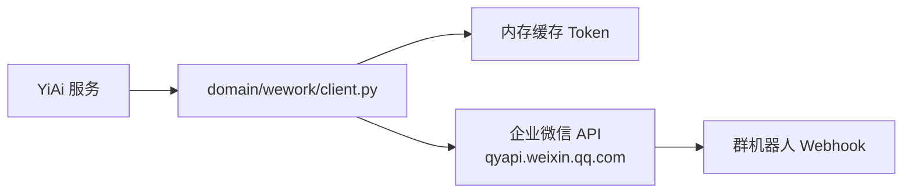

# YA-07-07: 企业微信消息推送 — Webhook 机器人 + Token 刷新 + 并发保护 — 开发方案

> 来源 PRD：[07-需求-企业微信消息推送.md](../../prds/2026-07/07-需求-企业微信消息推送.md)
> 需求编号：YA-07-07 · 优先级：P1 · 人天：0.5d
> 类型：功能 · 状态：已完成

本文档定义 **企业微信消息推送的实现方案**——Webhook 机器人集成、Access Token 管理、消息发送。

---

## 一、方案概述

### 1.1 架构

通过企业微信群机器人 Webhook 发送消息通知。Access Token 由企业微信 API 签发，本地缓存并定时刷新。



### 1.2 职责边界

| 组件 | 文件 | 职责 |
|------|------|------|
| 领域层 | `domain/wework/client.py` | HTTP 请求封装、Token 管理 |
| 公开 API | `domain/wework/__init__.py` | 导出 `send_message` |
| 路由 | `server/routes/wework.py` | RPC 端点 |

---

## 二、文件清单

| 文件 | 类型 | 职责 |
|------|------|------|
| `src/domain/wework/client.py` | 新增 | Token 获取/刷新、消息发送 |
| `src/domain/wework/__init__.py` | 新增 | 公开 `send_message` |
| `src/server/routes/wework.py` | 新增 | `/wework/*` RPC 端点 |

---

## 三、模块设计

### 3.1 消息发送 — `domain/wework/client.py`

```python
async def send_message(content: str, msg_type: str = "text") -> dict:
    token = await _get_access_token()
    url = f"https://qyapi.weixin.qq.com/cgi-bin/webhook/send?key={webhook_key}"
    payload = {"msgtype": msg_type, msg_type: {"content": content}}
    async with aiohttp.ClientSession() as session:
        async with session.post(url, json=payload) as resp:
            return await resp.json()
```

### 3.2 Token 管理

Token 缓存在内存中，过期前自动刷新。通过 `asyncio.Lock` 保护并发刷新：

```python
_token_lock = asyncio.Lock()
_cached_token: dict = {"token": "", "expires_at": 0}

async def _get_access_token() -> str:
    if time.time() < _cached_token["expires_at"] - 60:  # 60s 提前量
        return _cached_token["token"]
    async with _token_lock:
        # 双重检查——可能在等待锁期间已被其他协程刷新
        if time.time() < _cached_token["expires_at"] - 60:
            return _cached_token["token"]
        return await _refresh_token()
```

### 3.3 公开 API

```python
# domain/wework/__init__.py
from .client import send_message

__all__ = ["send_message"]
```

调用方只需 `from domain.wework import send_message`，不感知内部实现。

---

## 四、配置项

| 键 | 默认值 | 说明 |
|----|--------|------|
| `wework.corp_id` | — | 企业 ID |
| `wework.corp_secret` | — | 应用 Secret |
| `wework.webhook_key` | — | 群机器人 Webhook Key |

---

## 五、实施步骤

| 步骤 | 内容 | 涉及文件 | 验证 | 人天 |
|------|------|---------|------|------|
| 1 | Token 获取与缓存刷新 | `client.py` | Token 有效期管理正确 | 0.15 |
| 2 | 消息发送（text/markdown） | `client.py` | 企业微信群收到消息 | 0.15 |
| 3 | 公开 API + 路由 | `__init__.py` + `routes/wework.py` | RPC 调用成功 | 0.1 |
| 4 | 并发刷新保护 + 测试 | `client.py` + `tests/` | 并发获取 Token 仅请求一次 | 0.1 |

**合计：0.5d**。

---

## 六、边缘场景

| 场景 | 处理策略 | 位置 |
|------|---------|------|
| Token 过期 | 提前 60s 刷新，避免边界过期 | `_get_access_token()` |
| 并发刷新 Token | `asyncio.Lock` + 双重检查 | 同上 |
| API 返回错误 | 抛出 `BusinessException` | `send_message()` |
| 网络超时 | aiohttp 超时 → 异常上抛 | `client.py` |
| Webhook Key 未配置 | 启动时检查，未配置则跳过 | `client.py` |

---

## 七、已知缺陷

### 缺陷 1：Token 刷新无并发保护

早期版本缺少并发刷新保护，存在 Token 被多次请求的风险（`asyncio.Lock` 已在后续迭代中加入）。参见 [企微 Token 刷新无并发保护](../../bugs/2026-09/企业微信/01-企微-Token刷新无并发保护.md)。

---

## 八、关联模块

- 依赖：[YA-07-03 RPC 信封协议](./03-prd-task-RPC信封协议.md)
- 消费：Agent 通知、系统告警等场景通过 `send_message()` 推送企业微信消息