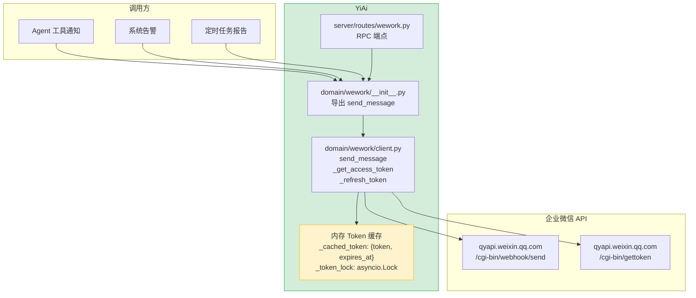
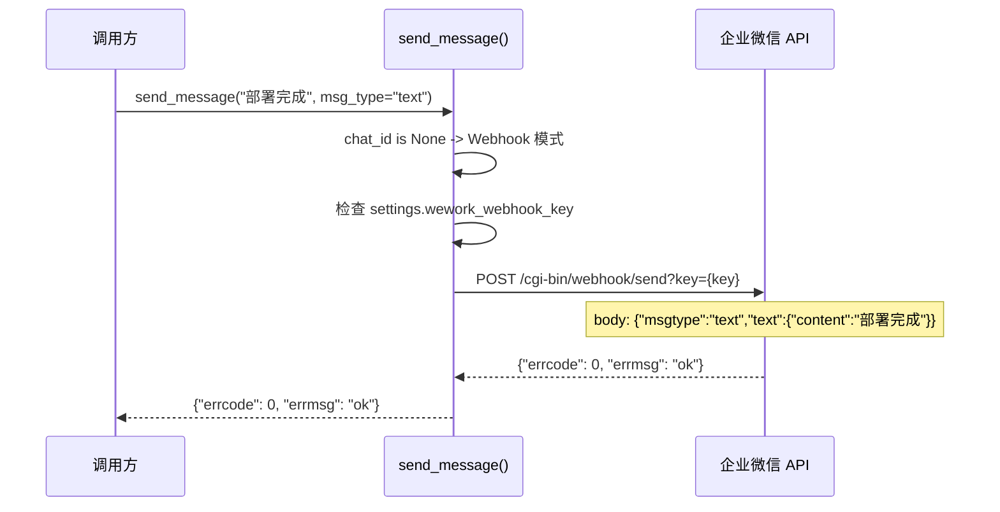
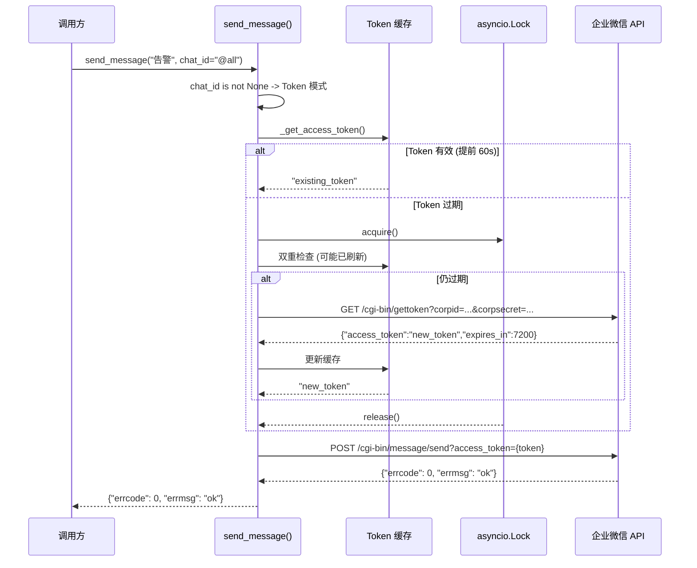

---

doc_type: module
prd_task_id: "YA-07-07"
title: "YA-07-07: 企业微信消息推送 — Webhook 机器人 + Access Token 管理 + 并发保护 — 开发方案"
status: 已完成
priority: P1
owner: 陈铭
roles: [engineer]
created: 2026-09-11
updated: 2026-09-23
project: YiAi
project_id: yiai
prd_month: "202607"
estimate_frontend: 0.5
source_prd: "07-需求-企业微信消息推送.md"
source_okr: [yiai-001]

type: task
---

# YA-07-07: 企业微信消息推送 — Webhook 机器人 + Access Token 管理 + 并发保护 — 开发方案

> 来源 PRD：[07-需求-企业微信消息推送.md](../../prds/2026-07/07-需求-企业微信消息推送.md)
> 需求编号：YA-07-07 · 优先级：P1 · 人天：0.5d
> 类型：功能 · 状态：已完成

本文档定义 **企业微信消息推送的完整实现方案**——Webhook 机器人集成、Access Token 管理（含并发刷新保护）、消息发送 API。

---

## 一、架构概述

### 1.1 架构定位

通过企业微信群机器人 Webhook 发送消息通知。支持两种集成模式：直接 Webhook Key 模式（群机器人）和 Access Token 模式（企业应用）。Access Token 本地缓存并定时刷新，`asyncio.Lock` + 双重检查保护并发刷新。


```mermaid
graph TD
  subgraph CALLERS["调用方"]
    AGENT["Agent 工具通知"]
    ALERT["系统告警"]
    SCHED["定时任务报告"]
  end

  subgraph YIAI["YiAi"]
    INIT["domain/wework/__init__.py<br/>导出 send_message"]
    CLIENT["domain/wework/client.py<br/>send_message<br/>_get_access_token<br/>_refresh_token"]
    CACHE["内存 Token 缓存<br/>_cached_token: {token, expires_at}<br/>_token_lock: asyncio.Lock"]
    ROUTE["server/routes/wework.py<br/>RPC 端点"]
  end

  subgraph WEWORK["企业微信 API"]
    WEBHOOK["qyapi.weixin.qq.com<br/>/cgi-bin/webhook/send"]
    TOKEN_API["qyapi.weixin.qq.com<br/>/cgi-bin/gettoken"]
  end

  AGENT --> INIT
  ALERT --> INIT
  SCHED --> INIT
  INIT --> CLIENT
  CLIENT --> CACHE
  CLIENT --> WEBHOOK
  CLIENT --> TOKEN_API
  ROUTE --> INIT

  style YIAI fill:#d4edda,stroke:#28a745
  style CACHE fill:#fff3cd,stroke:#ffc107
```

### 1.2 职责边界

| 组件 | 文件 | 职责 | 明确不做 |
|------|------|------|---------|
| 领域层 | `domain/wework/client.py` | HTTP 请求封装、Token 管理 | 不做消息模板管理 |
| 公开 API | `domain/wework/__init__.py` | 导出 `send_message` | 不做路由逻辑 |
| 路由 | `server/routes/wework.py` | RPC 端点 | 不实现消息逻辑 |

---

## 二、文件清单

| # | 文件 | 类型 | 职责 | 行数 |
|---|------|------|------|------|
| 1 | `src/domain/wework/client.py` | 新增 | Token 获取/刷新、消息发送、Webhook 调用 | ~120 |
| 2 | `src/domain/wework/__init__.py` | 新增 | 公开 `send_message` | ~5 |
| 3 | `src/server/routes/wework.py` | 新增 | `/wework/*` RPC 端点 | ~40 |

**改动汇总：** 3 文件，~165 行

### 组件树

```
src/domain/wework/
├── __init__.py (5 行)
│   └── 导出: send_message
│
└── client.py (120 行)
    ├── _cached_token: dict  — {"token": "", "expires_at": 0}
    ├── _token_lock: asyncio.Lock
    │
    ├── _get_access_token() -> str
    │   ├── 1. 检查缓存: time.time() < expires_at - 60?
    │   │   └── 是 -> 返回缓存 token
    │   ├── 2. async with _token_lock:
    │   │   ├── 双重检查
    │   │   └── _refresh_token()
    │   └── 返回新 token
    │
    ├── _refresh_token() -> str
    │   ├── GET https://qyapi.weixin.qq.com/cgi-bin/gettoken
    │   │       ?corpid={corp_id}&corpsecret={corp_secret}
    │   ├── 解析响应: {access_token, expires_in}
    │   ├── 更新 _cached_token
    │   └── 返回 access_token
    │
    ├── send_message(content, msg_type="text", chat_id=None) -> dict
    │   ├── 模式 1: Webhook Key 模式
    │   │   └── POST /cgi-bin/webhook/send?key={webhook_key}
    │   │       body: {msgtype, text/image/markdown: {content}}
    │   ├── 模式 2: Access Token 模式 (企业应用)
    │   │   ├── _get_access_token()
    │   │   └── POST /cgi-bin/message/send?access_token={token}
    │   │       body: {touser, msgtype, agentid, text: {content}}
    │   └── 返回: {errcode, errmsg}
    │
    ├── send_markdown(content) -> dict
    │   └── send_message(content, msg_type="markdown")
    │
    └── send_image(base64_data, md5_hash) -> dict
        └── send_message with msg_type="image"
```

---

## 三、模块设计

### 3.1 Token 管理 — `_get_access_token` + `_refresh_token`

```python
"""企业微信 Access Token 管理。

Token 有效期 7200 秒（2 小时）。
提前 60 秒刷新，避免边界过期。
使用 asyncio.Lock + 双重检查保护并发刷新。
"""
import asyncio
import time
import logging

import aiohttp

from shared.config import settings

logger = logging.getLogger(__name__)

# 内存缓存
_cached_token: dict[str, str | int] = {"token": "", "expires_at": 0}
_token_lock = asyncio.Lock()

WEWORK_API_BASE = "https://qyapi.weixin.qq.com"
TOKEN_EXPIRE_BUFFER = 60  # 提前 60 秒刷新


async def _get_access_token() -> str:
    """获取企业微信 Access Token（带缓存 + 并发保护）。

    设计决策：
      - 双重检查模式：第一次检查不入锁（快路径），锁内第二次检查（防止重复刷新）
      - 60s 提前量：避免在高并发场景下 Token 刚好过期
      - 内存缓存：无需 Redis，单进程部署足够
    """
    now = time.time()
    # 快路径：缓存有效，直接返回
    if _cached_token["token"] and now < (_cached_token["expires_at"] - TOKEN_EXPIRE_BUFFER):
        return str(_cached_token["token"])

    # 慢路径：需要刷新，获取锁
    async with _token_lock:
        # 双重检查：可能在等锁期间已被其他协程刷新
        if _cached_token["token"] and now < (_cached_token["expires_at"] - TOKEN_EXPIRE_BUFFER):
            return str(_cached_token["token"])
        return await _refresh_token()


async def _refresh_token() -> str:
    """向企业微信 API 请求新的 Access Token。

    GET https://qyapi.weixin.qq.com/cgi-bin/gettoken?corpid={id}&corpsecret={secret}

    Returns:
        access_token 字符串

    Raises:
        BusinessException: API 返回错误或网络异常
    """
    if not settings.wework_corp_id or not settings.wework_corp_secret:
        raise ValueError("WeWork corp_id or corp_secret not configured")

    url = (
        f"{WEWORK_API_BASE}/cgi-bin/gettoken"
        f"?corpid={settings.wework_corp_id}"
        f"&corpsecret={settings.wework_corp_secret}"
    )

    try:
        async with aiohttp.ClientSession() as session:
            async with session.get(url, timeout=aiohttp.ClientTimeout(total=10)) as resp:
                data = await resp.json()
    except aiohttp.ClientError as e:
        logger.error(f"[WeWork] Token request failed: {e}")
        raise BusinessException(ErrorCode.INTERNAL_ERROR, f"Token request failed: {e}")

    if data.get("errcode", -1) != 0:
        raise BusinessException(
            ErrorCode.INTERNAL_ERROR,
            f"WeWork token error: {data.get('errmsg', 'unknown')}",
        )

    token = data["access_token"]
    expires_in = data.get("expires_in", 7200)
    _cached_token["token"] = token
    _cached_token["expires_at"] = time.time() + expires_in

    logger.info(f"[WeWork] Token refreshed, expires in {expires_in}s")
    return token
```

### 3.2 消息发送 — `send_message`

```python
async def send_message(
    content: str,
    msg_type: str = "text",
    chat_id: str | None = None,
) -> dict:
    """发送企业微信消息。

    支持两种模式：
      1. Webhook Key 模式（群机器人）：使用 settings.wework_webhook_key
      2. Access Token 模式（企业应用）：使用 _get_access_token()

    Args:
        content: 消息内容
        msg_type: 消息类型 "text" | "markdown" | "image" | "news"
        chat_id: 目标会话 ID（Access Token 模式），None 则使用 Webhook Key 模式

    Returns:
        {"errcode": 0, "errmsg": "ok"}

    Raises:
        BusinessException: API 返回错误
        ValueError: 未配置 webhook_key 且未提供 chat_id
    """
    if chat_id:
        return await _send_via_app_token(content, msg_type, chat_id)
    else:
        return await _send_via_webhook(content, msg_type)


async def _send_via_webhook(content: str, msg_type: str = "text") -> dict:
    """通过群机器人 Webhook 发送消息。"""
    webhook_key = settings.wework_webhook_key
    if not webhook_key:
        raise ValueError("WeWork webhook_key not configured")

    url = f"{WEWORK_API_BASE}/cgi-bin/webhook/send?key={webhook_key}"
    payload = {"msgtype": msg_type, msg_type: {"content": content}}

    try:
        async with aiohttp.ClientSession() as session:
            async with session.post(
                url, json=payload, timeout=aiohttp.ClientTimeout(total=10),
            ) as resp:
                data = await resp.json()
    except aiohttp.ClientError as e:
        logger.error(f"[WeWork] Webhook send failed: {e}")
        raise BusinessException(ErrorCode.INTERNAL_ERROR, f"Webhook send failed: {e}")

    if data.get("errcode", -1) != 0:
        raise BusinessException(
            ErrorCode.INTERNAL_ERROR,
            f"WeWork send error: {data.get('errmsg', 'unknown')}",
        )

    return data


async def _send_via_app_token(
    content: str, msg_type: str, chat_id: str,
) -> dict:
    """通过企业应用 Access Token 发送消息。"""
    token = await _get_access_token()
    url = f"{WEWORK_API_BASE}/cgi-bin/message/send?access_token={token}"

    payload = {
        "touser": chat_id,
        "msgtype": msg_type,
        "agentid": settings.wework_agent_id,
        msg_type: {"content": content},
    }

    try:
        async with aiohttp.ClientSession() as session:
            async with session.post(
                url, json=payload, timeout=aiohttp.ClientTimeout(total=10),
            ) as resp:
                data = await resp.json()
    except aiohttp.ClientError as e:
        logger.error(f"[WeWork] App message send failed: {e}")
        raise BusinessException(ErrorCode.INTERNAL_ERROR, f"App message send failed: {e}")

    return data


async def send_markdown(content: str, chat_id: str | None = None) -> dict:
    """发送 Markdown 格式消息的便捷函数。"""
    return await send_message(content, msg_type="markdown", chat_id=chat_id)
```

### 3.3 公开 API

```python
# domain/wework/__init__.py
"""企业微信消息推送 — 公开 API。

调用方只需：
    from domain.wework import send_message, send_markdown

不需要感知内部 Token 管理、Webhook Key vs Access Token 的差异。
"""
from .client import send_message, send_markdown

__all__ = ["send_message", "send_markdown"]
```

### 3.4 RPC 端点

```python
# server/routes/wework.py
from fastapi import APIRouter
from domain.wework import send_message, send_markdown
from shared.response import success

router = APIRouter(prefix="/wework", tags=["WeWork"])


@router.post("/send-text")
async def send_text(data: dict):
    result = await send_message(
        data["content"],
        msg_type=data.get("msg_type", "text"),
        chat_id=data.get("chat_id"),
    )
    return success(data=result)


@router.post("/send-markdown")
async def send_md(data: dict):
    result = await send_markdown(data["content"], chat_id=data.get("chat_id"))
    return success(data=result)
```

---

## 四、数据流

### 4.1 Webhook Key 模式发送流程


```mermaid
sequenceDiagram
  participant CALLER as 调用方
  participant CLIENT as send_message()
  participant WW as 企业微信 API

  CALLER->>CLIENT: send_message("部署完成", msg_type="text")
  CLIENT->>CLIENT: chat_id is None -> Webhook 模式
  CLIENT->>CLIENT: 检查 settings.wework_webhook_key
  CLIENT->>WW: POST /cgi-bin/webhook/send?key={key}
  Note over WW: body: {"msgtype":"text","text":{"content":"部署完成"}}
  WW-->>CLIENT: {"errcode": 0, "errmsg": "ok"}
  CLIENT-->>CALLER: {"errcode": 0, "errmsg": "ok"}
```

### 4.2 Access Token 模式发送流程


```mermaid
sequenceDiagram
  participant CALLER as 调用方
  participant CLIENT as send_message()
  participant CACHE as Token 缓存
  participant LOCK as asyncio.Lock
  participant WW as 企业微信 API

  CALLER->>CLIENT: send_message("告警", chat_id="@all")
  CLIENT->>CLIENT: chat_id is not None -> Token 模式
  CLIENT->>CACHE: _get_access_token()

  alt Token 有效 (提前 60s)
    CACHE-->>CLIENT: "existing_token"
  else Token 过期
    CLIENT->>LOCK: acquire()
    CLIENT->>CACHE: 双重检查 (可能已刷新)
    alt 仍过期
      CLIENT->>WW: GET /cgi-bin/gettoken?corpid=...&corpsecret=...
      WW-->>CLIENT: {"access_token":"new_token","expires_in":7200}
      CLIENT->>CACHE: 更新缓存
      CACHE-->>CLIENT: "new_token"
    end
    LOCK-->>CLIENT: release()
  end

  CLIENT->>WW: POST /cgi-bin/message/send?access_token={token}
  WW-->>CLIENT: {"errcode": 0, "errmsg": "ok"}
  CLIENT-->>CALLER: {"errcode": 0, "errmsg": "ok"}
```

### 4.3 Token 并发刷新保护

```
协程 A                           协程 B
  │                                │
  ├─ _get_access_token()           ├─ _get_access_token()
  ├─ 检查缓存: 已过期              ├─ 检查缓存: 已过期
  ├─ 获取 _token_lock (成功)      ├─ 获取 _token_lock (等待...)
  ├─ 双重检查: 仍过期              │
  ├─ _refresh_token()              │
  ├─ 更新缓存                      │
  ├─ 释放 _token_lock              ├─ 获取 _token_lock (成功)
  ├─ 返回 token                    ├─ 双重检查: 缓存已有效!
  │                                ├─ 返回 token (无需再次刷新)
  │                                ├─ 释放 _token_lock
```

---

## 五、配置项

| 键 | 默认值 | 说明 |
|----|--------|------|
| `wework.corp_id` | — | 企业 ID（Token 模式） |
| `wework.corp_secret` | — | 应用 Secret（Token 模式） |
| `wework.webhook_key` | — | 群机器人 Webhook Key（Webhook 模式） |
| `wework.agent_id` | — | 应用 Agent ID（Token 模式） |

---

## 六、实施路线图

| 步骤 | 内容 | 涉及文件 | 验证方式 | 人天 |
|------|------|---------|---------|------|
| 1 | Token 获取与缓存刷新 + asyncio.Lock 并发保护 | `client.py` | Token 有效期管理正确；并发仅请求一次 | 0.15 |
| 2 | 消息发送（text/markdown 双模式） | `client.py` | 企业微信群收到消息 | 0.15 |
| 3 | 公开 API + RPC 端点 | `__init__.py` + `routes/wework.py` | RPC 调用成功 | 0.10 |
| 4 | 边缘场景处理 + 测试 | `client.py` + `tests/` | WEBHOOK_KEY 未配置、API 错误等 | 0.10 |
| **合计** | | | | **0.5d** |

---

## 七、边缘场景

| 场景 | 处理策略 | 位置 |
|------|---------|------|
| Token 过期 | 提前 60s 刷新，避免边界过期 | `_get_access_token()` |
| 并发刷新 Token | `asyncio.Lock` + 双重检查 | `_get_access_token()` |
| API 返回错误（errcode != 0） | 抛出 `BusinessException(INTERNAL_ERROR)` 带 errmsg | `send_message()` |
| 网络超时 | aiohttp 10s 超时 -> 异常上抛为 BusinessException | `client.py` |
| Webhook Key 未配置 | 抛出 ValueError | `_send_via_webhook()` |
| Corp ID/Secret 未配置 | 抛出 ValueError | `_refresh_token()` |
| 企业微信 API 限流 | 限流时 errcode=45009，上抛 BusinessException | `send_message()` |
| Markdown 内容超长 | 企业微信限制 4096 字节，调用方负责截断 | 调用方 |

---

## 八、代码审查检查清单

- [x] Token 缓存使用内存 dict（非全局变量），`_token_lock` 保护写操作
- [x] 双重检查模式：锁外快路径 + 锁内第二次检查
- [x] Token 提前 60s 刷新，避免边界过期
- [x] Webhook Key 模式和 Access Token 模式均支持
- [x] aiohttp ClientSession 在函数内创建（低频场景可接受）
- [x] 所有 HTTP 调用设置 10s 超时
- [x] 网络异常 -> `BusinessException(INTERNAL_ERROR)`
- [x] API errcode 非 0 -> `BusinessException(INTERNAL_ERROR)` 带 errmsg
- [x] 公开 API 仅导出 `send_message`，不暴露内部实现
- [x] `ruff` 通过

---

## 九、技术风险评估

| 风险 | 概率 | 影响 | 等级 | 缓解措施 | 应急预案 |
|------|------|------|------|---------|---------|
| Token 刷新无并发保护（早期版本） | 已修复 | 高 | — | `asyncio.Lock` + 双重检查 | — |
| Webhook Key 泄露 | 低 | 高 | 低 | Key 存储在 config.yaml，不入库 | 轮换 Webhook Key |
| 企业微信 API 限流 | 中 | 中 | 低 | 调用方控制频率 | 调用方重试 |
| aiohttp 连接池未复用 | 低 | 低 | 低 | 当前每次创建新 session，低频场景可接受 | 改为全局 session |
| Token 模式配置缺失 | 中 | 低 | 低 | 启动时校验配置 | 降级到 Webhook Key 模式 |

---

## 十、已知缺陷与技术债

### 10.1 已知缺陷

| # | 缺陷 | 影响 | 修复 |
|---|------|------|------|
| 1 | Token 刷新无并发保护（早期版本） | 并发刷新导致多次请求企业微信 API | 已通过 `asyncio.Lock` + 双重检查修复 |
| 2 | Token 仅内存缓存，服务重启丢失 | 重启后首次调用需重新获取 | 影响可接受（获取仅 ~100ms） |

### 10.2 技术债

| # | 技术债 | 优先级 | 人天 | 说明 | 状态 |
|---|--------|--------|------|------|------|
| 1 | aiohttp session 复用 | P3 | 0.1 | 每次创建新 session | 待评估 |
| 2 | Token 持久化 | P3 | 0.2 | 服务重启无需重新获取 | 待评估 |
| 3 | 消息发送队列 | P3 | 0.3 | 高并发场景下 asyncio.Queue 缓冲 | 待评估 |
| 4 | 消息发送失败重试 | P2 | 0.2 | 当前调用方负责重试 | 待实施 |
| 5 | 消息模板管理 | P3 | 0.5 | 预定义告警模板 | 待评估 |

---

## 十一、可观测性

### 关键指标

| 指标 | 采集方式 | 告警阈值 | 说明 |
|------|---------|----------|------|
| Token 刷新次数 | 计数器 | > 12/day | 正常 ~12 次/天，异常刷新表示缓存失效 |
| Token 刷新失败次数 | 错误计数 | > 0 | 网络或配置问题 |
| 消息发送成功/失败比 | msg_type 维度计数 | 失败率 > 5% | Webhook 或 Token 问题 |
| 并发 Token 刷新节省次数 | 双重检查命中计数 | - | 并发保护有效性 |

### 日志规范

| 日志级别 | 场景 | 示例 |
|---------|------|------|
| INFO | Token 刷新成功 | `[WeWork] Token refreshed, expires in 7200s` |
| INFO | 消息发送成功 | `[WeWork] message sent: type={t}, mode={m}` |
| WARNING | 消息发送失败 | `[WeWork] send failed: {error}` |
| ERROR | Token 请求失败 | `[WeWork] Token request failed: {error}` |

---

## 十二、关联模块

- 依赖：[YA-07-03 RPC 信封协议](./03-prd-task-RPC信封协议.md)
- 消费：Agent 通知、系统告警等场景通过 `send_message()` 推送企业微信消息
- 缺陷：[YA-09- 企微 Token 刷新无并发保护](../../bugs/2026-09/企业微信/01-企微-Token刷新无并发保护.md)
