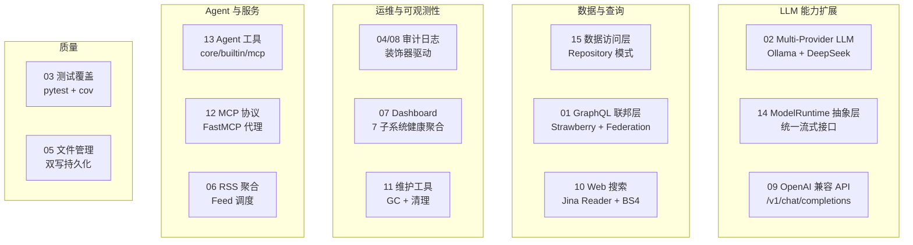
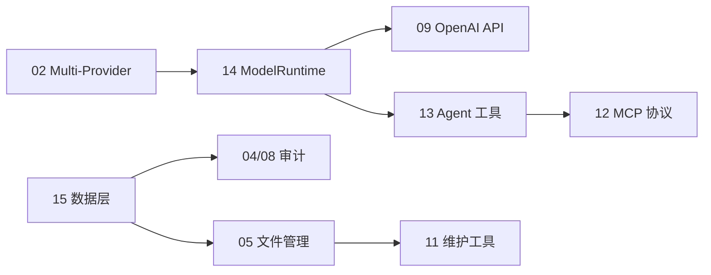

# YA-08-00: YiAi 八月迭代总览 — 15 大模块扩展后端能力边界 — 开发方案

> 来源 PRD：[00-需求总览.md](../../prds/2026-08/00-需求总览.md)
> 需求编号：YA-08-00 · 优先级：P0 · 人天：29.5d（已实现核心）
> 类型：迭代总览 · 状态：已完成

---

## 一、迭代概览

八月迭代在七月基础架构之上，扩展了 **LLM 多 Provider 支持**、**GraphQL 联邦查询**、**数据审计**、**系统可观测性**和**服务集成能力**。关键词：从"能用"到"好用"。

### 1.1 模块全景

### 1.2 模块清单

| 编号 | 模块 | 优先级 | 人天 | 状态 |
|------|------|--------|------|------|
| YA-08-01 | [GraphQL 联邦层](./01-prd-task-GraphQL联邦层.md) | P2 | 8.0 | 已完成 |
| YA-08-02 | [Multi-Provider LLM](./02-prd-task-Multi-Provider-LLM.md) | P1 | 4.0 | 已完成 |
| YA-08-03 | [测试覆盖率扩展](./03-prd-task-测试覆盖率扩展.md) | P2 | 3.0 | 已完成 |
| YA-08-04 | [预写审计日志](./04-prd-task-预写审计日志.md) | P0 | 2.0 | 已完成 |
| YA-08-05 | [文件管理服务](./05-prd-task-文件管理服务.md) | P0 | 2.5 | 已完成 |
| YA-08-06 | [RSS 聚合服务](./06-prd-task-RSS聚合服务.md) | P1 | 2.0 | 已完成 |
| YA-08-07 | [Dashboard 健康聚合](./07-prd-task-Dashboard健康聚合API.md) | P1 | 2.0 | 已完成 |
| YA-08-08 | [审计日志系统](./08-prd-task-预写审计日志系统.md) | P1 | 1.5 | 已完成 |
| YA-08-09 | [OpenAI 兼容 API](./09-prd-task-OpenAI兼容API.md) | P1 | 1.0 | 已完成 |
| YA-08-10 | [Web 搜索](./10-prd-task-Web搜索与内容提取.md) | P1 | 1.0 | 已完成 |
| YA-08-11 | [维护工具](./11-prd-task-维护工具服务.md) | P2 | 0.5 | 已完成 |
| YA-08-12 | [MCP 协议服务](./12-prd-task-MCP协议服务.md) | P2 | 1.0 | 已完成 |
| YA-08-13 | [Agent 工具系统](./13-prd-task-Agent工具系统.md) | P1 | 1.5 | 已完成 |
| YA-08-14 | [ModelRuntime 抽象层](./14-prd-task-ModelRuntime抽象层.md) | P1 | 1.5 | 已完成 |
| YA-08-15 | [数据访问层](./15-prd-task-数据访问层.md) | P1 | 1.5 | 已完成 |

---

## 二、依赖关系

---

## 三、新增文件总览

| 层级 | 新增文件数 | 关键模块 |
|------|-----------|---------|
| `domain/` | 8 | audit/*、rss/*、files/*、ai/tools/* |
| `services/` | 10 | ai/llm_provider、rss/*、audit/*、backup/*、analytics/* |
| `server/` | 12 | routes/dashboard/*、openai_compat、search、mcp、maintenance、mcp_server |
| `data/` | 1 | repository 增强 |

---

## 四、关键架构决策

| 决策 | 选择 | 理由 |
|------|------|------|
| LLM Provider 抽象 | `LLMProvider` → `OllamaProvider` / `DeepSeekProvider` | 策略模式，新增 Provider 无需改调用方 |
| 审计方案 | Python 装饰器 `@audit_log` | 零侵入，AOP 风格 |
| 文件持久化 | 磁盘（主）+ MongoDB（备份）双写 | 磁盘不可用时 MongoDB 兜底 |
| GraphQL | Strawberry + Federation | Python 原生，类型安全 |
| MCP 集成 | FastMCP 代理模式 | 复用现有 RPC 方法，不重复实现 |
| Dashboard | 子模块路由 `dashboard/*` | 按子系统拆分，独立部署 |

---

## 五、与七月迭代的关系

七月奠定了 RPC 协议、AI 聊天、RAG 引擎、知识库管线四大基础。八月在此基础上：
- **扩展 LLM 能力**：从单一 Ollama 到多 Provider
- **补齐运维能力**：审计日志、Dashboard、维护工具
- **开放接口**：OpenAI 兼容 API、GraphQL、MCP
- **提升质量**：测试覆盖率从 0 到 76 个用例

---

## 六、关联文档

- 上游：[七月迭代总览](../2026-07/00-prd-task-00-需求总览.md)
- 下游：[九月迭代总览](../2026-09/README.md)
- 需求：[00-需求总览.md](../../prds/2026-08/00-需求总览.md)