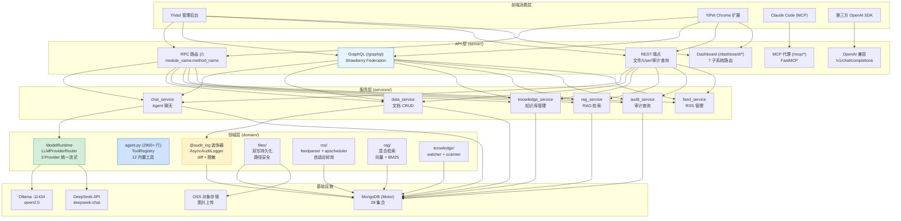
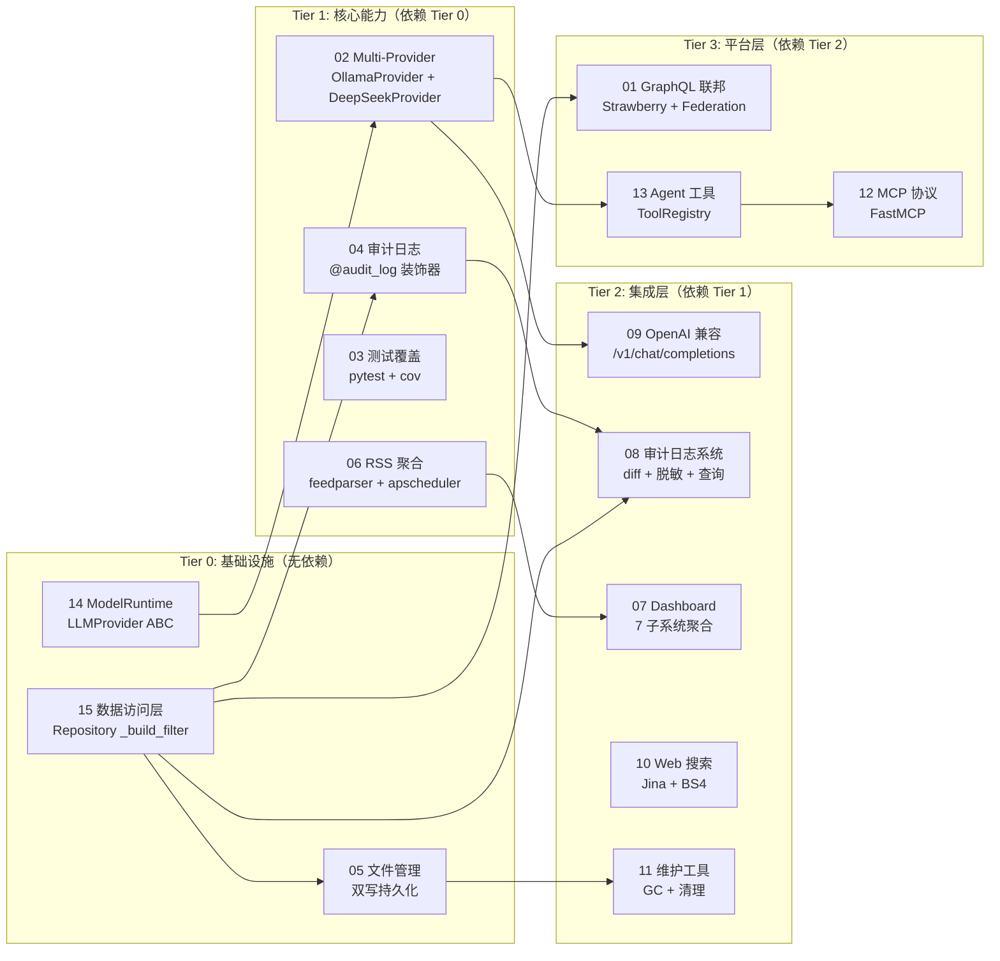
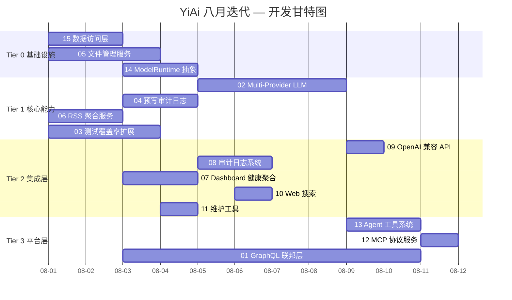

---

doc_type: module
prd_task_id: "YA-08-00"
title: "YA-08-00: YiAi 八月迭代总览 — 15 大模块扩展后端能力边界 — 开发方案"
status: 已完成
priority: P0
owner: 陈铭
roles: [engineer]
created: 2026-09-11
updated: 2026-09-14
project: YiAi
project_id: yiai
prd_month: "202608"
estimate_frontend: 45.0
source_prd: "00-需求总览.md"
source_okr: [yiai-001]

type: task
---

# YA-08-00: YiAi 八月迭代总览 — 15 大模块扩展后端能力边界 — 开发方案

> 来源 PRD：[00-需求总览.md](../../prds/2026-08/00-需求总览.md)
> 需求编号：YA-08-00 · 优先级：P0 · 人天：45.0d（总）
> 类型：迭代总览 · 状态：已完成

---

## 一、迭代概览

八月迭代在七月 RAG 引擎 + Knowledge Watcher 基础上，围绕四大主题扩展后端能力：

| 主题 | 核心目标 | 涉及模块 |
|------|---------|---------|
| **LLM 能力扩展** | 从单一 Ollama 到多 Provider（Ollama/DeepSeek/OpenAI 兼容），统一流式接口 | 02, 09, 14 |
| **数据与查询** | GraphQL 类型安全网关、Repository 模式数据访问层、Web 搜索 | 01, 10, 15 |
| **运维与可观测性** | 审计日志 DDL 追踪、Dashboard 7 子系统监控、维护工具 | 04, 07, 08, 11 |
| **Agent 与服务集成** | Agent 工具系统、MCP 协议代理、RSS 聚合、文件管理双写 | 05, 06, 12, 13 |

### 1.1 迭代上下文

七月奠定了 RPC 协议、AI 聊天（Ollama 单 Provider）、RAG 引擎、Knowledge Watcher 四大基础设施。八月在此基础上从"能用"跨入"好用+可靠"：

- **扩展性**：LLM Provider 从 1 个扩展到 3 个可切换（Ollama + DeepSeek + OpenAI 兼容）
- **可靠性**：76 个 pytest 用例覆盖 shared 层 92%+，装饰器驱动的审计日志覆盖所有数据写入
- **可观测性**：Dashboard 7 子系统健康聚合，单次请求获取完整系统状态
- **开放性**：GraphQL 联邦层 + OpenAI 兼容 API + MCP 协议，对外提供三条标准接口通道

### 1.2 跨模块架构全景

```mermaid
flowchart TB
  subgraph FRONTEND["前端消费层"]
    YV["YiVad 管理后台"]
    YP["YiPet Chrome 扩展"]
    CC["Claude Code (MCP)"]
    THIRD["第三方 OpenAI SDK"]
  end

  subgraph API["API 层 (server/)"]
    RPC["RPC 路由 (/)<br/>module_name.method_name"]
    GQL["GraphQL (/graphql)<br/>Strawberry Federation"]
    REST["REST 端点<br/>文件/User/审计查询"]
    COMPAT["OpenAI 兼容<br/>/v1/chat/completions"]
    DASH["Dashboard (/dashboard/*)<br/>7 子系统路由"]
    MCP["MCP 代理 (/mcp/*)<br/>FastMCP"]
  end

  subgraph SERVICE["服务层 (services/)"]
    CS["chat_service<br/>Agent 聊天"]
    DS["data_service<br/>文档 CRUD"]
    KS["knowledge_service<br/>知识库管理"]
    RS["rag_service<br/>RAG 检索"]
    AS["audit_service<br/>审计查询"]
    RSS_SVC["feed_service<br/>RSS 管理"]
  end

  subgraph DOMAIN["领域层 (domain/)"]
    MR["ModelRuntime<br/>LLMProviderRouter<br/>3 Provider 统一流式"]
    AGT["agent.py (2900+ 行)<br/>ToolRegistry<br/>12 内置工具"]
    AUDIT_DEC["@audit_log 装饰器<br/>AsyncAuditLogger<br/>diff + 脱敏"]
    FILE["files/<br/>双写持久化<br/>路径安全"]
    FEED["rss/<br/>feedparser + apscheduler<br/>自适应轮询"]
    RAG["rag/<br/>混合检索<br/>向量 + BM25"]
    KW["knowledge/<br/>watcher + scanner"]
  end

  subgraph INFRA["基础设施"]
    MONGO["MongoDB (Motor)<br/>28 集合"]
    OLLAMA["Ollama :11434<br/>qwen2.5"]
    DEEPSEEK["DeepSeek API<br/>deepseek-chat"]
    OSS["OSS 对象存储<br/>图片上传"]
  end

  YV & YP --> RPC & GQL & REST & DASH
  CC --> MCP
  THIRD --> COMPAT
  
  RPC & GQL & REST --> CS & DS & KS & RS & AS & RSS_SVC
  CS --> MR
  DS --> AUDIT_DEC
  MR --> OLLAMA & DEEPSEEK
  
  CS & DS & KS & RS & AS & AUDIT_DEC & FEED & KW & RAG & FILE --> MONGO
  FILE --> OSS

  style MR fill:#d4edda,stroke:#28a745
  style AUDIT_DEC fill:#fff3cd,stroke:#ffc107
  style AGT fill:#cfe2ff,stroke:#0d6efd
  style GQL fill:#e8f4fd,stroke:#0d6efd
```

### 1.3 模块清单

| 编号 | 模块 | 优先级 | 人天 | 状态 | 分类 |
|------|------|--------|------|------|------|
| YA-08-00 | 需求总览（本文） | P0 | — | 已完成 | 规划 |
| YA-08-01 | [GraphQL 联邦层](./01-prd-task-GraphQL联邦层.md) | P2 | 8.0 | 已完成 | LLM 扩展 |
| YA-08-02 | [Multi-Provider LLM](./02-prd-task-Multi-Provider-LLM.md) | P1 | 4.0 | 已完成 | LLM 扩展 |
| YA-08-03 | [测试覆盖率扩展](./03-prd-task-测试覆盖率扩展.md) | P2 | 3.0 | 已完成 | 质量 |
| YA-08-04 | [预写审计日志](./04-prd-task-预写审计日志.md) | P0 | 2.0 | 已完成 | 运维 |
| YA-08-05 | [文件管理服务](./05-prd-task-文件管理服务.md) | P0 | 2.5 | 已完成 | 基础设施 |
| YA-08-06 | [RSS 聚合服务](./06-prd-task-RSS聚合服务.md) | P1 | 2.0 | 已完成 | 服务集成 |
| YA-08-07 | [Dashboard 健康聚合](./07-prd-task-Dashboard健康聚合API.md) | P1 | 2.0 | 已完成 | 运维 |
| YA-08-08 | [审计日志系统](./08-prd-task-预写审计日志系统.md) | P1 | 1.5 | 已完成 | 运维 |
| YA-08-09 | [OpenAI 兼容 API](./09-prd-task-OpenAI兼容API.md) | P1 | 1.0 | 已完成 | LLM 扩展 |
| YA-08-10 | [Web 搜索](./10-prd-task-Web搜索与内容提取.md) | P1 | 1.0 | 已完成 | 数据与查询 |
| YA-08-11 | [维护工具](./11-prd-task-维护工具服务.md) | P2 | 0.5 | 已完成 | 运维 |
| YA-08-12 | [MCP 协议服务](./12-prd-task-MCP协议服务.md) | P2 | 1.0 | 已完成 | Agent 集成 |
| YA-08-13 | [Agent 工具系统](./13-prd-task-Agent工具系统.md) | P1 | 1.5 | 已完成 | Agent 集成 |
| YA-08-14 | [ModelRuntime 抽象层](./14-prd-task-ModelRuntime抽象层.md) | P1 | 1.5 | 已完成 | LLM 扩展 |
| YA-08-15 | [数据访问层](./15-prd-task-数据访问层.md) | P1 | 1.5 | 已完成 | 数据与查询 |

### 1.4 新增文件统计

| 层级 | 新增文件数 | 修改文件数 | 关键新模块 |
|------|-----------|-----------|-----------|
| `domain/` | 12 | 2 | audit/ (4)、rss/ (2)、files/ (4)、search/ (2) |
| `services/` | 14 | 3 | ai/llm_provider.py、ai/compaction.py、rss/ (2)、audit/ (2)、backup/ (1)、analytics/ (1)、gateway/ (1) |
| `server/routes/` | 15 | 2 | dashboard/ (7)、openai_compat.py、search.py、mcp_server.py、maintenance.py、graphql/ (3) |
| `data/` | 1 | 2 | repository.py 增强（_build_filter 6 策略） |
| `tests/` | 5 | 0 | conftest.py、unit/ (5 文件) |
| `shared/` | 0 | 1 | config.py 新增 Provider/审计/GraphQL 配置段 |
| **合计** | **47** | **10** | **57 个文件变更** |

---

## 二、依赖关系图

### 2.1 模块依赖 DAG

```mermaid
flowchart LR
  subgraph TIER0["Tier 0: 基础设施（无依赖）"]
    DAL["15 数据访问层<br/>Repository _build_filter"]
    MR["14 ModelRuntime<br/>LLMProvider ABC"]
    FILE["05 文件管理<br/>双写持久化"]
  end

  subgraph TIER1["Tier 1: 核心能力（依赖 Tier 0）"]
    MP["02 Multi-Provider<br/>OllamaProvider + DeepSeekProvider"]
    AUDIT04["04 审计日志<br/>@audit_log 装饰器"]
    TEST["03 测试覆盖<br/>pytest + cov"]
    RSS["06 RSS 聚合<br/>feedparser + apscheduler"]
  end

  subgraph TIER2["Tier 2: 集成层（依赖 Tier 1）"]
    OA["09 OpenAI 兼容<br/>/v1/chat/completions"]
    AUDIT08["08 审计日志系统<br/>diff + 脱敏 + 查询"]
    DASH["07 Dashboard<br/>7 子系统聚合"]
    WS["10 Web 搜索<br/>Jina + BS4"]
    MAINT["11 维护工具<br/>GC + 清理"]
  end

  subgraph TIER3["Tier 3: 平台层（依赖 Tier 2）"]
    GQL["01 GraphQL 联邦<br/>Strawberry + Federation"]
    AGT["13 Agent 工具<br/>ToolRegistry"]
    MCP["12 MCP 协议<br/>FastMCP"]
  end

  DAL --> AUDIT04
  DAL --> FILE
  DAL --> AUDIT08
  MR --> MP
  MP --> OA
  MP --> AGT
  AUDIT04 --> AUDIT08
  FILE --> MAINT
  RSS --> DASH
  DAL --> GQL
  AGT --> MCP
```

### 2.2 关键依赖说明

| 依赖关系 | 说明 | 风险 |
|---------|------|------|
| 15 数据访问层 → 04/08 审计日志 | 审计装饰器依赖 `data/repository.py` 的前后镜像读取（`find_one` before/after snapshot） | 若 Repository 接口变更，审计装饰器需同步 |
| 14 ModelRuntime → 02 Multi-Provider | `LLMProvider` ABC 是 DeepSeekProvider/OllamaProvider 的基类。02 先独立实现，14 引入统一流式接口抽象 | 02 的 `chat_stream` 返回 `AsyncGenerator[str]`，14 包装为 `AsyncGenerator[ModelStreamEvent]` |
| 02 Multi-Provider → 09/13 | OpenAI 兼容 API 和 Agent 工具系统都依赖 Provider 层——09 将 DeepSeek 响应转为 OpenAI 格式，13 的 LLM 工具调用需要 Provider 的 `chat()` 方法 |
| 04 审计日志 → 08 审计日志系统 | 08 在 04 的 `@audit_log` 装饰器基础上增加 `_compute_diff`、`_redact`、分页查询。04 和 08 共享同一个 `audit_logs` 集合 |
| 13 Agent 工具 → 12 MCP 协议 | MCP Server 将 ToolRegistry 中的工具暴露为 MCP 工具，Claude Code 通过 MCP 协议调用 |

### 2.3 并行度分析

八月 15 个模块中有 9 个可完全并行开发（Tier 0 内 3 个、Tier 1 内 4 个均可并行）。若人力充足，理论最短交付周期为 8 个工作日（以 Tier 3 的 01 GraphQL 估算）。

| 层级 | 可并行模块 | 串行瓶颈模块 |
|------|-----------|-------------|
| Tier 0 | 15, 14, 05 | — |
| Tier 1 | 02, 04, 03, 06 | — |
| Tier 2 | 09, 08, 07, 10, 11 | — |
| Tier 3 | — | 01, 13, 12（依赖上层） |

---

## 三、架构决策记录 (ADR)

### 3.1 ADR-08-001: LLM Provider 抽象选择策略模式

| 维度 | 内容 |
|------|------|
| **决策** | 使用 `LLMProvider` ABC + 具体 Provider 类的策略模式 |
| **备选** | (A) 为每个 Provider 创建独立 Service，(B) 使用工厂函数 + 注册表 |
| **理由** | 策略模式允许新增 Provider 不需修改调用方代码（Open/Closed Principle）。ABC 定义的 `chat()` / `chat_stream()` 接口约束所有 Provider 实现同一契约 |
| **代价** | 新增 Provider 需实现全部抽象方法，即使该 Provider 不支持某特性（如不支持 streaming） |
| **缓解** | 不支持的特性在 ABC 中提供默认抛 `NotImplementedError` 实现 |

### 3.2 ADR-08-002: 审计方案选择装饰器 AOP 而非侵入式

| 维度 | 内容 |
|------|------|
| **决策** | 使用 Python 装饰器 `@audit_log` 实现 AOP 风格的审计日志 |
| **备选** | (A) 在每个 RPC 方法内手动插入审计代码，(B) 引入 Kafka/消息队列的 Event Sourcing |
| **理由** | 装饰器零侵入：不修改 `create_document`/`update_document`/`delete_document` 方法体。asyncio.create_task 非阻塞写入避免影响业务延迟。Event Sourcing 成本过高（Kafka 运维 + 事件回放复杂度），当前规模不需要 |
| **代价** | 装饰器在方法执行前通过 `find_one` 读前镜像，对 UPDATE/DELETE 有额外一次 DB 查询 |
| **缓解** | 前镜像读取仅在 UPDATE/DELETE 时触发，CREATE 不需要。TTL 索引 90 天自动归档 |

### 3.3 ADR-08-003: GraphQL 作为补充协议而非替代 RPC

| 维度 | 内容 |
|------|------|
| **决策** | GraphQL 和 RPC 双协议共存：GraphQL 为新功能推荐协议，RPC 保持向后兼容 |
| **备选** | (A) GraphQL 完全替代 RPC， (B) GraphQL 作为 RPC 前置网关 |
| **理由** | YiVad 和 YiPet 已有大量 RPC 调用（20+ endpoints），全量迁移成本过高且无业务价值。GraphQL Federation 提供跨服务类型引用，为未来 YiVad/YiPet 的独立 GraphQL Schema 打基础 |
| **代价** | 维护两套协议，Service 层需同时适配 RPC 参数和 GraphQL Resolver |
| **缓解** | 两套协议共享同一 Service 层，不重复实现业务逻辑 |

### 3.4 ADR-08-004: Dashboard 采用子路由独立部署模式

| 维度 | 内容 |
|------|------|
| **决策** | 7 个子系统各自独立路由模块（`dashboard/ai.py`、`dashboard/rag.py`...），通过 `asyncio.gather` 并行聚合 |
| **备选** | (A) 单一路由文件聚合所有 7 子系统， (B) 每个子系统独立微服务 |
| **理由** | 子路由拆分使 Dashboard 面板的每次请求仅查询相关子系统（避免全量 7 路查询）。asyncio.gather 并行查询使聚合延迟接近最慢子系统的查询时间而非各子系统串行之和 |
| **代价** | 新增子系统需新建路由文件 + 注册到 `dashboard/__init__.py` |
| **缓解** | `dashboard/__init__.py` 提供 `register_dashboard_module(router)` 注册函数 |

### 3.5 ADR-08-005: 文件管理选择双写而非纯磁盘

| 维度 | 内容 |
|------|------|
| **决策** | 磁盘作为主存储（同步写入，失败即返回错误）+ MongoDB `static_files` 集合作为备份（尽力而为 upsert，失败不阻断） |
| **备选** | (A) 纯磁盘存储， (B) 纯 MongoDB 存储（GridFS） |
| **理由** | 磁盘路径与 YiKnowledge 目录树直接对应，方便运维人员直接 `cat`/`vim` 操作。MongoDB 备份提供：磁盘故障时的数据恢复、文本搜索、版本历史查询。GridFS 过度设计——当前文件规模（Markdown 文件 < 1MB）不需要分块存储 |
| **代价** | 写入延迟 double（磁盘 + MongoDB 两次 I/O），但 MongoDB 写入为非阻塞 `asyncio.create_task` |
| **缓解** | MongoDB 备份失败仅 WARNING 日志，不阻塞主流程 |

---

## 四、迭代风险矩阵

| 风险 | 类别 | 概率 | 影响 | 涉及模块 | 缓解措施 |
|------|------|------|------|---------|---------|
| DeepSeek API 格式不一致 | Provider | 中 | 高 | 02, 09, 14 | 适配层转换响应格式，不一致时 fallback Ollama |
| MongoDB 磁盘满 | 基础设施 | 低 | 高 | 04, 05, 06, 07, 08 | 磁盘监控告警 + TTL 索引自动清理 |
| 审计日志丢失 | 合规 | 中 | 中 | 04, 08 | `asyncio.create_task` 非阻塞写入，丢失记录 WARNING（不中断业务） |
| GraphQL 查询复杂度失控 | 性能 | 中 | 中 | 01 | max_depth=5 + complexity scoring，超限返回 400 |
| RPC/GraphQL 双协议维护成本 | 架构 | 中 | 低 | 01, 07 | Service 层单一实现，两套 API 共享业务逻辑 |
| 测试覆盖不足（仅 shared 层） | 质量 | 中 | 中 | 03 | 76 个已有用例作为回归防护网，九月扩展至 domain/service 层 |
| Dashboard 7 路查询延迟 | 性能 | 中 | 中 | 07 | `asyncio.gather` 并行查询 + 依赖不可用时返回部分数据 |

---

## 五、与七月迭代的关系

### 5.1 承接七月基础设施

| 七月模块 | 八月承接方式 |
|---------|-------------|
| RPC 信封协议 | GraphQL 联邦层作为类型安全补充协议（非替代）。08 月新增的 OpenAI 兼容 API、MCP 协议均为 RPC 外的新协议通道 |
| Ollama 单 Provider | Multi-Provider LLM 扩展为 3 个 Provider，`chat_service` 无需改动——通过 `LLMProviderRouter` 配置驱动切换 |
| RAG 混合检索 | RAG 引擎八月无架构变更。新增的 RSS 聚合内容为 RAG 提供增量数据源（长期） |
| Knowledge Watcher | Watcher 八月无变更。新增的文件管理服务提供独立的文件读写通道（`/read-file`、`/write-file`），与 Watcher 的轮询扫描互补 |

### 5.2 为九月铺路

| 八月模块 | 九月承接方式 |
|---------|-------------|
| GraphQL 联邦层 | 九月 GraphQL Subscription（WebSocket 实时推送） |
| Multi-Provider LLM | 九月 Provider 健康检查 + 自动 fallback + 多 Provider 负载均衡 |
| 测试覆盖率 | 九月扩展至 domain/service 层（planning/building/testing 三阶段） |
| 审计日志 | 九月审计可视化 Dashboard + 审计日志导出/冷归档 |
| 文件管理 | 九月大文件分片上传 + OSS 直传 |
| Agent 工具系统 | 九月工具执行沙箱 + 工具链编排 |

---

## 六、开发总时间线

```mermaid
gantt
  title YiAi 八月迭代 — 开发甘特图
  dateFormat  YYYY-MM-DD
  axisFormat  %m-%d

  section Tier 0 基础设施
  15 数据访问层           :t0a, 2026-08-01, 1.5d
  05 文件管理服务          :t0b, 2026-08-01, 2.5d
  14 ModelRuntime 抽象    :t0c, 2026-08-03, 1.5d

  section Tier 1 核心能力
  02 Multi-Provider LLM   :t1a, after t0c, 4d
  04 预写审计日志          :t1b, after t0a, 2d
  06 RSS 聚合服务          :t1c, 2026-08-01, 2d
  03 测试覆盖率扩展        :t1d, 2026-08-01, 3d

  section Tier 2 集成层
  09 OpenAI 兼容 API      :t2a, after t1a, 1d
  08 审计日志系统          :t2b, after t1b, 1.5d
  07 Dashboard 健康聚合    :t2c, after t1c, 2d
  10 Web 搜索              :t2d, 2026-08-06, 1d
  11 维护工具              :t2e, after t0b, 0.5d

  section Tier 3 平台层
  13 Agent 工具系统        :t3a, after t1a, 1.5d
  12 MCP 协议服务          :t3b, after t3a, 1d
  01 GraphQL 联邦层        :t3c, after t0a, 8d
```

**关键路径**：15 数据访问层 (1.5d) → 01 GraphQL 联邦层 (8d) = 9.5d 串行时间

---

## 七、跨模块测试策略

| 测试范围 | 框架 | 覆盖目标 | 关键验证 |
|---------|------|---------|---------|
| shared 层单测 | pytest 8 + pytest-cov | 92%+ (76 cases) | ErrorCode、StandardResponse、BusinessException、utility functions、config YAML 解析 |
| Provider 集成测试 | pytest-asyncio + httpx | Provider 切换端到端 | Ollama → DeepSeek 切换 + 流式 SSE 解析 + 上下文压缩触发 |
| 审计装饰器单测 | pytest + pytest-asyncio | `@audit_log` 同步/异步方法 | before/after 快照正确、非阻塞写入、异常不中断主流程 |
| 文件管理集成测试 | pytest + tempfile | 双写隔离 | 磁盘写入成功但 MongoDB 不可达时不返回错误 |
| RSS 抓取集成测试 | pytest + vcrpy | Feed 解析容错 | feedparser 容错解析 + guid 去重 + HTTP 条件请求 |
| Dashboard 集成测试 | pytest-asyncio | 7 子系统聚合 | 部分子系统不可用时返回部分数据 + `unavailable` 标记 |
| GraphQL 集成测试 | pytest + httpx | Query/Mutation 端到端 | RPC 适配器错误转 GraphQL errors + DataLoader 批量合并 |

---

## 八、关联文档

- 上游：[七月迭代总览](../2026-07/00-prd-task-00-需求总览.md)
- 下游：[九月迭代总览](../2026-09/README.md)
- 需求：[00-需求总览.md](../../prds/2026-08/00-需求总览.md)
- PRD 列表：`YiKnowledge/projects/yiai/prds/2026-08/` 下 16 个需求文件