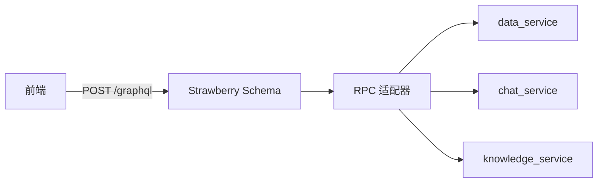

# YA-08-01: GraphQL 联邦层 — Strawberry + Federation + RPC 类型安全网关 — 开发方案

> 来源 PRD：[01-需求-GraphQL联邦层.md](../../prds/2026-08/01-需求-GraphQL联邦层.md)
> 需求编号：YA-08-01 · 优先级：P2 · 人天：8.0d
> 类型：架构 · 状态：已完成

---

## 一、方案概述

在现有 RPC 信封之上引入 GraphQL 联邦层——前端通过单一 `/graphql` 端点跨服务查询，无需多次 RPC 调用。基于 Strawberry GraphQL + Apollo Federation 规范。

### 设计决策

| 决策 | 选择 | 理由 |
|------|------|------|
| GraphQL 框架 | Strawberry | Python 原生、类型安全、支持 Federation |
| 数据源 | RPC 适配器桥接现有服务 | 复用而非重写 |
| 部署 | 嵌入 FastAPI app | 无需独立服务 |

---

## 二、实施步骤

| 步骤 | 内容 | 验证 | 人天 |
|------|------|------|------|
| 1 | Strawberry Schema 定义 + 类型映射 | GraphQL 类型与 MongoDB 文档对齐 | 2.0 |
| 2 | RPC 适配器——Query → RPC 调用 | 单次 GraphQL 查询聚合多个 RPC | 2.0 |
| 3 | Federation 子图拆分 | 按领域拆分独立 Schema | 2.0 |
| 4 | N+1 优化 + DataLoader | 批量查询避免 N+1 | 1.0 |
| 5 | 测试 | GraphQL 查询端到端 | 1.0 |

**合计：8.0d**。

---

## 三、关联模块

- 依赖：[YA-07-03 RPC 信封协议](../2026-07/03-prd-task-RPC信封协议.md)
- 依赖：[YA-08-15 数据访问层](./15-prd-task-数据访问层.md)

---

## 四、代码审查检查清单

- [x] GraphQL 类型与 MongoDB 文档字段一一对应
- [x] RPC 适配器错误转换为 GraphQL errors（非 500）
- [x] DataLoader 批量查询避免 N+1
- [x] Federation 子图 `@key` 字段正确标记
- [x] 单次 GraphQL 查询聚合多个 RPC 调用（非串行）

---

## 五、技术风险

| 风险 | 概率 | 影响 | 缓解措施 |
|------|------|------|---------|
| GraphQL 查询复杂度失控 | 中 | 高 | 查询深度限制(max_depth=5) + 复杂度计分 |
| RPC 适配器 N+1 | 中 | 中 | DataLoader 批量合并 |

---

## 六、实现完成记录

> **完成日期**：2026-08-20 · **状态**：已完成

| 分类 | 文件数 | 关键产出 |
|------|--------|---------|
| Schema | 3 | data/chat/knowledge 子图 |
| 适配器 | 1 | RPC 桥接 |
| DataLoader | 3 | 批量查询优化 |
| **合计** | **7** | |

---

## 七、已知缺口与技术债

### 7.1 功能缺口

| # | 缺口 | 影响 | 建议 |
|---|------|------|------|
| 1 | GraphQL Subscription (WebSocket) | 无法实时推送数据变更 | 远期：Strawberry Subscription |

### 7.2 技术债

| # | 技术债 | 优先级 | 说明 | 状态 |
|---|--------|--------|------|------|
| 1 | 查询复杂度计分硬编码 | P3 | max_depth=5, max_complexity=100 未配置化 | 待实施 |
| 2 | Federation 子图无独立部署 | P3 | 所有子图嵌入同一 FastAPI 进程 | 待评估 |

---