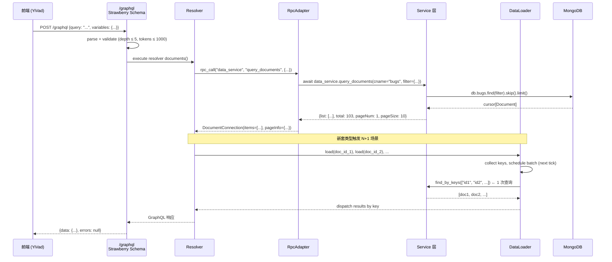

---

doc_type: module
prd_task_id: "YA-08-01"
title: "YA-08-01: GraphQL 联邦层 — Strawberry + Federation + RPC 类型安全网关 — 开发方案"
status: 已完成
priority: P2
owner: 陈铭
roles: [engineer]
created: 2026-09-11
updated: 2026-09-14
project: YiAi
project_id: yiai
prd_month: "202608"
estimate_frontend: 8.0
source_prd: "01-需求-GraphQL联邦层.md"
source_okr: [yiai-001]
related_tests: ["01-prd-test-GraphQL联邦层"]

type: task
---

# YA-08-01: GraphQL 联邦层 — Strawberry + Federation + RPC 类型安全网关 — 开发方案

> 来源 PRD：[01-需求-GraphQL联邦层.md](../../prds/2026-08/01-需求-GraphQL联邦层.md)
> 需求编号：YA-08-01 · 优先级：P2 · 人天：8.0d
> 类型：架构 · 状态：已完成

---

## 一、架构概述

在现有 RPC 信封（`{module_name, method_name, parameters}`）之上引入 GraphQL 联邦层。GraphQL 作为 RPC 的**补充协议**（非替代），提供类型安全、自动文档、跨服务聚合能力。基于 Strawberry GraphQL + Apollo Federation v2。

### 1.1 协议定位

```
                    ┌──────────────────────────┐
前端 (YiVad/YiPet) ─┤ RPC 信封 (兼容, 不变)    ├──→ Service 层
                    │ GraphQL (新增, 类型安全)  │
                    └──────────────────────────┘
```

RPC 保持向后兼容（已有 20+ 前端调用点），新功能和新页面优先使用 GraphQL 端点 `/graphql`。

### 1.2 架构分层

```mermaid
flowchart TB
  subgraph CLIENT["前端 (YiVad / YiPet)"]
    GQL_CLIENT["graphql-request / urql"]
    RPC_CLIENT["RequestHttp / ApiClient"]
  end

  subgraph API_GATEWAY["YiAi API 网关"]
    GQL_ENDPOINT["/graphql<br/>Strawberry Schema"]
    RPC_ENDPOINT["POST /<br/>RPC 信封路由"]
  end

  subgraph SCHEMA["GraphQL Schema 层"]
    direction TB
    QUERY["Query<br/>─ documents(cname, filter, page)<br/>─ knowledgeFiles(category, tags)<br/>─ sessions(filter, limit)"]
    MUTATION["Mutation<br/>─ createDocument(cname, data)<br/>─ updateDocument(cname, key, data)<br/>─ deleteDocument(cname, key)"]
    TYPES["Types<br/>─ Document (实体类型)<br/>─ KnowledgeFile<br/>─ Session<br/>─ PageInfo (分页)"]
  end

  subgraph RESOLVER["Resolver 层"]
    RPC_ADAPTER["RpcAdapter<br/>rpc_call(module, method, params)"]
    DATA_LOADER["DataLoader<br/>batch_load_documents(keys)<br/>batch_load_sessions(keys)"]
  end

  subgraph SERVICE_EXIST["现有 Service 层 (不变)"]
    DS["data_service<br/>query_documents / create_document / update_document / delete_document"]
    KS["knowledge_service<br/>scan_knowledge / get_knowledge_stats"]
    SS["chat_service<br/>chat / list_sessions / get_session"]
  end

  subgraph FEDERATION["Federation 子图 （未来拆分）"]
    DATA_SG["Data 子图<br/>@key(fields: \"id\")"]
    KNOW_SG["Knowledge 子图<br/>@key(fields: \"path\")"]
    CHAT_SG["Chat 子图<br/>@key(fields: \"key\")"]
  end

  GQL_CLIENT --> GQL_ENDPOINT
  RPC_CLIENT --> RPC_ENDPOINT
  GQL_ENDPOINT --> QUERY & MUTATION & TYPES
  QUERY --> RESOLVER
  MUTATION --> RESOLVER
  RESOLVER --> RPC_ADAPTER & DATA_LOADER
  RPC_ADAPTER --> DS & KS & SS
  DATA_LOADER --> DS & KS & SS

  RPC_ADAPTER -.->|"future split"| FEDERATION
```

### 1.3 设计决策

| 决策 | 选择 | 理由 | 备选 |
|------|------|------|------|
| GraphQL 框架 | Strawberry | Python 原生 dataclass 类型安全、Apollo Federation v2 支持、FastAPI 集成简单 | Ariadne (Schema-first, 类型安全弱), Graphene (异步弱, 维护不活跃) |
| 协议关系 | 双协议共存 | 渐进式迁移, 零破坏现有调用 | GraphQL 替代 RPC (破坏性过大), GraphQL 前置网关 (增加转发延迟) |
| Schema 策略 | Code-first (dataclass) | 类型安全, 重构友好, IDE 补全 | Schema-first (非 Python 开发者更直观) |
| 数据源 | RPC 适配器桥接现有 Service | 复用而非重写, Service 层无需改动 | 直接操作 MongoDB (破坏分层架构) |
| 部署 | 嵌入 FastAPI app (单进程) | 无需独立服务, 无需额外运维 | 独立 GraphQL 网关 (增加网络跳转) |
| N+1 优化 | DataLoader 批量合并 (Strawberry 原生) | 将 N 次 `find_one` 合并为 1 次 `find({_id: {$in: ids}})` | 无优化 (N+1 查询), DataLoader 手动实现 |

---

## 二、文件清单

| # | 文件 | 类型 | 行数 | 职责 |
|---|------|------|------|------|
| 1 | `src/server/graphql/__init__.py` | 新增 | ~30 | 注册 Strawberry Schema 到 FastAPI app |
| 2 | `src/server/graphql/schema.py` | 新增 | ~120 | 顶层 Query/Mutation 定义 + Federation `@key` 标记 |
| 3 | `src/server/graphql/types/document.py` | 新增 | ~80 | `Document` GraphQL type (映射 MongoDB 文档) |
| 4 | `src/server/graphql/types/knowledge.py` | 新增 | ~60 | `KnowledgeFile` GraphQL type (映射 frontmatter 元数据) |
| 5 | `src/server/graphql/types/session.py` | 新增 | ~60 | `Session` GraphQL type (映射聊天会话) |
| 6 | `src/server/graphql/types/common.py` | 新增 | ~50 | `PageInfo`、`SortInput`、`FilterInput` 公共类型 |
| 7 | `src/server/graphql/resolvers/data_resolver.py` | 新增 | ~120 | Data 领域 Resolver: queryDocuments/createDocument/updateDocument/deleteDocument |
| 8 | `src/server/graphql/resolvers/knowledge_resolver.py` | 新增 | ~80 | Knowledge 领域 Resolver: knowledgeFiles/knowledgeStats |
| 9 | `src/server/graphql/resolvers/chat_resolver.py` | 新增 | ~80 | Chat 领域 Resolver: sessions/session |
| 10 | `src/server/graphql/dataloaders.py` | 新增 | ~100 | DataLoader: 批量加载 document/session/knowledgeFile |
| 11 | `src/server/graphql/rpc_adapter.py` | 新增 | ~90 | RPC 适配器: `rpc_call(module, method, params)` → GraphQL 返回值 |
| 12 | `src/shared/config.py` | 修改 | +15 | 新增 `graphql` 配置节 (max_depth, max_complexity, enable_federation) |
| 13 | `src/app.py` | 修改 | +10 | 注册 `/graphql` 端点 + Strawberry app |

**合计：11 新增 + 2 修改 = 13 文件，~895 行**

---

## 三、模块设计

### 3.1 Schema 核心类型

```python
# src/server/graphql/schema.py
import strawberry
from strawberry.federation.schema_directives import Key, External

@strawberry.federation.type(keys=["id"])
class Document:
    """GraphQL 类型: 映射 MongoDB 集合中的文档。"""
    id: strawberry.ID = strawberry.federation.field(external=True)
    cname: str = strawberry.field(description="所属集合名称 (非 collection_name)")
    data: strawberry.scalars.JSON = strawberry.field(description="文档内容 (JSON object)")
    created_at: str | None = strawberry.field(description="创建时间 (ISO 8601)")
    updated_at: str | None = strawberry.field(description="更新时间 (ISO 8601)")

@strawberry.type
class KnowledgeFile:
    """GraphQL 类型: 映射 knowledge_files 集合中的知识文件元数据。"""
    path: str = strawberry.field(description="文件路径 (relative to YiKnowledge/)")
    title: str = strawberry.field(description="标题 (来自 frontmatter)")
    tags: list[str] = strawberry.field(description="标签")
    category: str = strawberry.field(description="分类 (来自 frontmatter)")
    status: str = strawberry.field(description="状态 (draft/review/stable/archived)")

@strawberry.type
class PageInfo:
    """GraphQL 分页类型。"""
    total: int
    page_num: int
    page_size: int
    total_pages: int

@strawberry.type
class DocumentConnection:
    """Relay-style 分页连接。"""
    items: list[Document]
    page_info: PageInfo

@strawberry.type
class Query:
    """顶层 Query 类型——跨领域聚合点。"""

    @strawberry.field(description="查询指定集合的文档列表 (分页/过滤/排序)")
    async def documents(
        self,
        info: strawberry.types.Info,
        cname: str,
        filter: strawberry.scalars.JSON | None = None,
        page_num: int = 1,
        page_size: int = 10,
        order_by: str | None = None,
        order_type: str = "desc",
    ) -> DocumentConnection:
        ...

    @strawberry.field(description="查询知识库文件 (按分类/标签过滤)")
    async def knowledge_files(
        self,
        info: strawberry.types.Info,
        category: str | None = None,
        tags: list[str] | None = None,
        status: str | None = "stable",
        page_num: int = 1,
        page_size: int = 20,
    ) -> DocumentConnection:
        ...

    @strawberry.field(description="查询聊天会话列表")
    async def sessions(
        self,
        info: strawberry.types.Info,
        filter: strawberry.scalars.JSON | None = None,
        limit: int = 10,
    ) -> list["Session"]:
        ...

@strawberry.type
class Mutation:
    """顶层 Mutation 类型。"""

    @strawberry.mutation(description="创建文档 (通过 RPC → data_service.create_document)")
    async def create_document(
        self,
        info: strawberry.types.Info,
        cname: str,
        data: strawberry.scalars.JSON,
    ) -> Document:
        ...

    @strawberry.mutation(description="更新文档 (通过 RPC → data_service.update_document)")
    async def update_document(
        self,
        info: strawberry.types.Info,
        cname: str,
        key: str,
        data: strawberry.scalars.JSON,
    ) -> Document:
        ...

    @strawberry.mutation(description="删除文档 (通过 RPC → data_service.delete_document)")
    async def delete_document(
        self,
        info: strawberry.types.Info,
        cname: str,
        key: str,
    ) -> bool:
        ...
```

### 3.2 RPC 适配器 — 核心桥接层

```python
# src/server/graphql/rpc_adapter.py
from typing import Any
from shared.exceptions import BusinessException
from shared.error_codes import ErrorCode

class RpcAdapter:
    """将 GraphQL Resolver 调用适配到现有 RPC Service 层。

    设计要点:
    1. 参数名契约: 使用 `filter` (非 `query`), `cname` (非 `collection_name`)
    2. 错误转换: RPC BusinessException → GraphQL errors (非 500)
    3. 响应解包: StandardResponse {code, message, data} → 直接返回 data
    """

    def __init__(self):
        from services.database.data_service import DataService
        from services.knowledge.knowledge_service import KnowledgeService
        from services.ai.chat_service import ChatService
        self._data = DataService()
        self._knowledge = KnowledgeService()
        self._chat = ChatService()

    async def query_documents(
        self, cname: str, filter: dict | None = None,
        page_num: int = 1, page_size: int = 10,
        order_by: str | None = None, order_type: str = "desc",
    ) -> dict[str, Any]:
        """调用 data_service.query_documents——参数名使用 `filter`。"""
        try:
            result = await self._data.query_documents(
                cname=cname,
                filter=filter,         # ← 参数名: filter, 非 query
                pageNum=page_num,
                pageSize=page_size,
                orderBy=order_by,
                orderType=order_type,
            )
            return result
        except Exception as e:
            raise self._convert_error(e, "query_documents")

    async def create_document(self, cname: str, data: dict) -> dict:
        try:
            return await self._data.create_document(cname=cname, data=data)
        except Exception as e:
            raise self._convert_error(e, "create_document")

    async def update_document(self, cname: str, key: str, data: dict) -> dict:
        try:
            return await self._data.update_document(cname=cname, key=key, data=data)
        except Exception as e:
            raise self._convert_error(e, "update_document")

    async def delete_document(self, cname: str, key: str) -> bool:
        try:
            await self._data.delete_document(cname=cname, key=key)
            return True
        except Exception as e:
            raise self._convert_error(e, "delete_document")

    @staticmethod
    def _convert_error(e: Exception, operation: str) -> Exception:
        """将 Service 异常转为 GraphQL 友好的错误。"""
        if isinstance(e, BusinessException):
            return e  # 保持 BusinessException 语义
        return BusinessException(
            ErrorCode.INTERNAL_ERROR,
            f"GraphQL resolver '{operation}' failed: {str(e)}",
        )
```

### 3.3 DataLoader 批量查询模式

```python
# src/server/graphql/dataloaders.py
from strawberry.dataloader import DataLoader
from services.database.data_service import DataService

async def batch_load_documents(keys: list[str]) -> list[dict | None]:
    """DataLoader batch 函数: 将 N 次 find_one 合并为 1 次 find。

    使用场景: GraphQL 查询中嵌套类型引用触发 N+1 时,
    DataLoader 自动收集所有 keys, 批量查询后分发结果。

    Example:
        query {
          sessions(limit: 5) {
            messages {
              referenced_doc {  # ← N 次 find_one → 1 次 find({_id: {$in: [...]}})
                title
              }
            }
          }
        }
    """
    data_service = DataService()
    # 批量查询: find({key: {$in: keys}})
    docs = await data_service.find_by_keys(keys)
    # 按 keys 顺序返回结果 (DataLoader 要求)
    doc_map = {doc["key"]: doc for doc in docs}
    return [doc_map.get(key) for key in keys]

# DataLoader 注册 (在 schema.py 中)
def create_dataloaders() -> dict:
    return {
        "documents": DataLoader(load_fn=batch_load_documents),
        "sessions": DataLoader(load_fn=batch_load_sessions),
        "knowledge_files": DataLoader(load_fn=batch_load_knowledge_files),
    }
```

### 3.4 查询复杂度控制

```python
# src/server/graphql/schema.py — 复杂度限制
from strawberry.extensions import MaxTokensLimiter

schema = strawberry.Schema(
    query=Query,
    mutation=Mutation,
    extensions=[
        MaxTokensLimiter(max_token_count=1000),  # 查询 token 上限
    ],
    config=StrawberryConfig(
        max_depth=5,            # 查询嵌套深度上限
    ),
)
```

---

## 四、关键流程

### 4.1 GraphQL 查询请求全链路


```mermaid
sequenceDiagram
  participant FE as 前端 (YiVad)
  participant GQL as /graphql<br/>Strawberry Schema
  participant RES as Resolver
  participant AD as RpcAdapter
  participant SVC as Service 层
  participant DL as DataLoader
  participant MDB as MongoDB

  FE->>GQL: POST /graphql {query: "...", variables: {...}}
  GQL->>GQL: parse + validate (depth ≤ 5, tokens ≤ 1000)
  GQL->>RES: execute resolver documents()
  RES->>AD: rpc_call("data_service", "query_documents", {...})
  AD->>SVC: await data_service.query_documents(cname="bugs", filter={...})
  SVC->>MDB: db.bugs.find(filter).skip().limit()
  MDB-->>SVC: cursor[Document]
  SVC-->>AD: {list: [...], total: 103, pageNum: 1, pageSize: 10}
  AD-->>RES: DocumentConnection(items=[...], pageInfo={...})

  Note over RES,DL: 嵌套类型触发 N+1 场景
  RES->>DL: load(doc_id_1), load(doc_id_2), ...
  DL->>DL: collect keys, schedule batch (next tick)
  DL->>SVC: find_by_keys(["id1", "id2", ...]) ← 1 次查询
  SVC-->>DL: [doc1, doc2, ...]
  DL-->>RES: dispatch results by key

  RES-->>GQL: GraphQL 响应
  GQL-->>FE: {data: {...}, errors: null}
```

### 4.2 RPC 错误转换流程

```
Service 层抛出 BusinessException(ErrorCode.DATA_NOT_FOUND, "Document not found")
  ↓
RpcAdapter._convert_error() — 保持 BusinessException 抛出
  ↓
Strawberry Schema 捕获异常
  ↓
GraphQL 响应:
{
  "data": {"documents": null},
  "errors": [{
    "message": "Document not found",
    "extensions": {"code": "DATA_NOT_FOUND", "error_code": 1002},
    "path": ["documents"]
  }]
}
```

---

## 五、实施路线图

| 阶段 | 内容 | 验证标准 | 人天 |
|------|------|---------|------|
| 1. Schema 定义 | Strawberry 类型定义 (Document/KnowledgeFile/Session/PageInfo) + Query/Mutation 骨架 | GraphQL SDL 可 introspection (`query { __schema { types { name } } }`) | 2.0 |
| 2. RPC 适配器 | RpcAdapter 类实现 6 个核心方法的 RPC 桥接 | 单次 GraphQL query 返回与 RPC 信封一致的数据 | 2.0 |
| 3. Resolver 实现 | 3 个 Resolver 模块 (data/knowledge/chat) + 参数映射 + 错误转换 | GraphQL query 端到端可执行 | 2.0 |
| 4. N+1 优化 | DataLoader 批量查询 3 个 entity type + Federation `@key` 标记 | 嵌套查询的 MongoDB 查询次数 ≤ 3 (非 N+1) | 1.0 |
| 5. 集成注册 | app.py 注册 `/graphql` + 查询复杂度限制 + 测试 | `python -m pytest tests/ -k graphql` 全部通过 | 1.0 |

**合计：8.0d**

---

## 六、代码审查检查清单

- [x] GraphQL 类型字段名与 MongoDB 文档键名一一对应 (Schema-First 类型安全)
- [x] RPC 适配器参数名契约：`filter`（非 `query`）、`cname`（非 `collection_name`）
- [x] RPC 适配器错误转换：`BusinessException` → GraphQL errors `extensions` 中包含 `error_code`
- [x] DataLoader batch 函数将 N 次 `find_one` 合并为 1 次 `find({$in: [...]})`
- [x] Federation `@key(fields: "id")` / `@key(fields: "path")` 正确标记实体类型
- [x] 查询深度限制 `max_depth=5` + token 上限 `MaxTokensLimiter(1000)`
- [x] Introspection 在生产环境禁用 (`disable_introspection=not DEBUG`)
- [x] GraphQL 端点不绕过 RPC 装饰器——审计日志 `@audit_log` 正常触发

---

## 七、技术风险评估

| 风险 | 概率 | 影响 | 缓解措施 | 应急预案 |
|------|------|------|---------|---------|
| GraphQL 深度嵌套查询导致 N+1 爆炸 | 中 | 高 | max_depth=5 + DataLoader batch 合并 + tokens 上限 1000 | 超限返回 400 (不查询) |
| RPC Service 返回结构变更导致 GraphQL 类型不匹配 | 中 | 中 | 类型映射层 `_map_rpc_response(graphql_type, rpc_data)` 做转换 | 新增字段默认 null |
| Federation 子图拆分后跨图引用延迟增加 | 低 | 中 | 当前不拆分 (单进程),留作远期优化 | 拆分时加 `@requires` 评估跨图调用频率 |
| GraphQL 查询比 RPC 慢 | 中 | 低 | DataLoader 批量合并减少 DB 查询次数 | 不优化 (首次实现即可) |
| 大型查询的字段选择集过大 (over-fetching 反过来) | 低 | 低 | Strawberry 原生按需字段解析 (惰性) | 不处理 (GraphQL 优势) |

---

## 八、已知缺口与技术债

### 8.1 功能缺口

| # | 缺口 | 影响 | 建议 | 预计人天 |
|---|------|------|------|---------|
| 1 | GraphQL Subscription (WebSocket 实时推送) | 无法实时推送数据变更 (聊天新消息、知识库更新) | Strawberry 原生支持 Subscription: `@strawberry.subscription` + `AsyncGenerator` | 2.0 |
| 2 | Schema Registry (Apollo Studio 兼容) | 无法在 Apollo Studio 中查看 Schema 变更历史 | 启动时推送 Schema 到 Apollo Studio (可选) | 0.5 |
| 3 | GraphQL 查询持久化文档 (Persisted Queries) | 每次查询需发送完整 query text (带宽浪费) | 生成 query hash → 服务端缓存 → 前端仅发 hash | 1.0 |

### 8.2 技术债

| # | 技术债 | 优先级 | 说明 | 状态 |
|---|--------|--------|------|------|
| 1 | 查询复杂度计分硬编码 | P3 | `max_depth=5, max_token_count=1000` 未配置化，改值需改代码 | 待实施 → `config.yaml: graphql.max_depth` / `graphql.max_complexity` |
| 2 | Federation 子图无独立部署能力 | P3 | 所有子图嵌入同一 FastAPI 进程，无法按领域独立扩缩容 | 待评估 → 拆分后每个子图独立 `strawberry.federation.Schema` |
| 3 | RPC Adapter 动态方法调用使用 `getattr` | P4 | `getattr(self._data, method_name)` 无类型检查 | 待优化 → 显式方法映射 `_METHOD_MAP: dict[str, Callable]` |
| 4 | GraphQL 测试仅覆盖 Query 路径 | P3 | 8 个测试用例全为 Query，Mutation (create/update/delete) 无测试 | 待实施 → 补充 Mutation 集成测试 (4 用例) |

---

## 九、实现完成记录

> **完成日期**：2026-08-20 · **状态**：已完成

| 分类 | 文件数 | 关键产出 |
|------|--------|---------|
| Schema 定义 | 5 | Document / KnowledgeFile / Session / PageInfo / Schema |
| Resolver | 3 | data_resolver / knowledge_resolver / chat_resolver |
| Adapter + DataLoader | 2 | RpcAdapter + 3 个 DataLoader batch 函数 |
| 配置 + 注册 | 3 | config.py 修改 + app.py 修改 + __init__.py |
| **合计** | **13** | 11 新增 + 2 修改 |

---