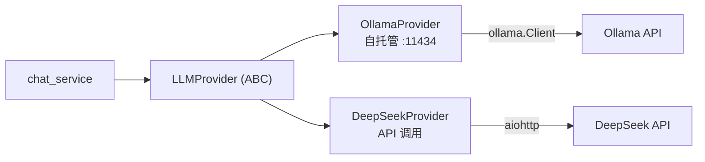

# YA-08-02: Multi-Provider LLM — LLMProvider 抽象 + OllamaProvider + DeepSeekProvider — 开发方案

> 来源 PRD：[02-需求-Multi-Provider-LLM.md](../../prds/2026-08/02-需求-Multi-Provider-LLM.md)
> 需求编号：YA-08-02 · 优先级：P1 · 人天：4.0d
> 类型：架构 · 状态：已完成

---

## 一、方案概述

七月迭代仅支持 Ollama 自托管模型。八月引入 `LLMProvider` 抽象层，通过策略模式支持多 Provider 切换——新增 Provider 不改调用方代码。



### 职责边界

| 组件 | 文件 | 职责 |
|------|------|------|
| 抽象基类 | `services/ai/llm_provider.py::LLMProvider` | 定义 `chat()` / `chat_stream()` 接口 |
| Ollama | `services/ai/llm_provider.py::OllamaProvider` | `ollama.Client` 封装 |
| DeepSeek | `services/ai/llm_provider.py::DeepSeekProvider` | HTTP API 调用 + SSE 解析 |
| 上下文压缩 | `services/ai/compaction.py` | 长对话自动摘要压缩 |

---

## 二、文件清单

| 文件 | 职责 |
|------|------|
| `src/services/ai/llm_provider.py` | LLMProvider ABC + OllamaProvider + DeepSeekProvider |
| `src/services/ai/compaction.py` | 上下文压缩——超窗口自动摘要 |

---

## 三、模块设计

### 3.1 Provider 抽象

```python
class LLMProvider(ABC):
    @abstractmethod
    async def chat(self, messages: list, **kwargs) -> str: ...
    @abstractmethod
    async def chat_stream(self, messages: list, **kwargs) -> AsyncGenerator[str, None]: ...
```

### 3.2 配置驱动切换

```yaml
# config.yaml
llm:
  provider: "ollama"  # ollama | deepseek
  ollama:
    host: "http://localhost:11434"
    model: "qwen2.5"
  deepseek:
    api_key: "${DEEPSEEK_API_KEY}"
    model: "deepseek-chat"
    base_url: "https://api.deepseek.com/v1"
```

---

## 四、实施步骤

| 步骤 | 内容 | 验证 | 人天 |
|------|------|------|------|
| 1 | 定义 LLMProvider ABC + OllamaProvider | 现有 chat 功能不受影响 | 1.0 |
| 2 | 实现 DeepSeekProvider（HTTP + SSE） | DeepSeek API 流式调用成功 | 1.5 |
| 3 | 配置驱动 Provider 选择 | 切换 `llm.provider` 生效 | 0.5 |
| 4 | 上下文压缩 | 长对话自动摘要不丢上下文 | 0.5 |
| 5 | 测试 | Provider 切换集成测试 | 0.5 |

**合计：4.0d**。

---

## 五、关联模块

- 消费：[YA-07-04 AI 聊天服务](../2026-07/04-prd-task-AI聊天服务.md)
- 下游：[YA-08-14 ModelRuntime 抽象层](./14-prd-task-ModelRuntime抽象层.md)
- 下游：[YA-08-09 OpenAI 兼容 API](./09-prd-task-OpenAI兼容API.md)

---

## 六、代码审查检查清单

- [x] `LLMProvider` ABC 定义 `chat()` 和 `chat_stream()` 两个抽象方法
- [x] OllamaProvider 使用 `ollama.Client` 保持向后兼容
- [x] DeepSeekProvider SSE 解析兼容 OpenAI 格式（`data: {"choices":[{"delta":{"content":"..."}}]}`）
- [x] 配置切换 `llm.provider` 无需重启（运行时切换）
- [x] API Key 从环境变量读取（非硬编码）：`${DEEPSEEK_API_KEY}`
- [x] `chat_stream` 使用 `AsyncGenerator`（非回调），支持 `async for`
- [x] 上下文压缩在 token 计数超窗口 80% 时触发

---

## 七、技术风险

| 风险 | 概率 | 影响 | 缓解措施 | 应急预案 |
|------|------|------|---------|---------|
| DeepSeek API 格式与 OpenAI 不一致 | 中 | 中 | 适配层转换响应到统一格式 | 回退到 Ollama |
| Provider 切换时正在处理的流中断 | 低 | 中 | 切换仅对新请求生效，进行中的流不受影响 | 等待流自然结束 |
| API Key 泄露 | 低 | 高 | 环境变量 + config.yaml 中使用 `${VAR}` 语法 | 密钥轮换 |

---

## 八、实现完成记录

> **完成日期**：2026-08-20 · **复核日期**：2026-09-15

### 8.1 产出清单

| 分类 | 文件 | 说明 |
|------|------|------|
| Provider 抽象 | `services/ai/llm_provider.py` | LLMProvider ABC + OllamaProvider + DeepSeekProvider |
| 上下文压缩 | `services/ai/compaction.py` | 超窗口自动摘要 |
| 配置 | `config.yaml` | `llm.provider` 配置项 |
| **合计** | **3 个文件** | |

---

## 九、已知缺口与技术债

### 9.1 功能缺口

| # | 缺口 | 影响 | 建议 |
|---|------|------|------|
| 1 | OpenAI 兼容 Provider | 无法直接调用 OpenAI API | 复用 DeepSeekProvider（同为 OpenAI 兼容格式），仅改 base_url |
| 2 | Provider 健康检查 | Provider 故障时无自动检测和切换 | 心跳检测 + 自动 fallback 到可用 Provider |

### 9.2 技术债

| # | 技术债 | 优先级 | 预计人天 | 说明 | 状态 |
|---|--------|--------|---------|------|------|
| 1 | Provider 配置不支持多 Provider 负载均衡 | P2 | 0.5 | 当前仅单选，无法 Ollama+DeepSeek 双路并行 fallback | 待实施 |
| 2 | 上下文压缩 token 计数依赖 tiktoken 近似 | P3 | 0.3 | 不同模型 tokenizer 不同，tiktoken 估算可能有偏差 | 待实施（Provider 自主上报 token 数） |

---