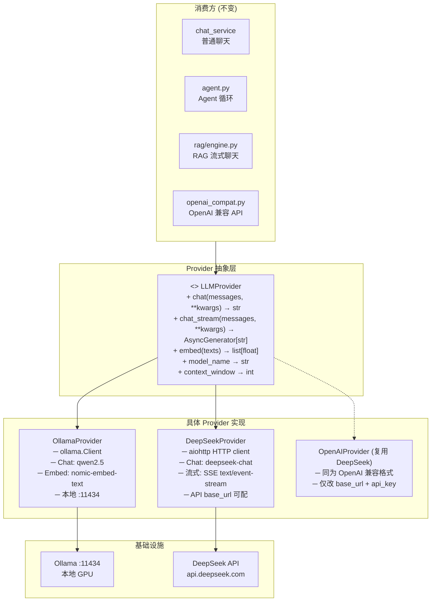
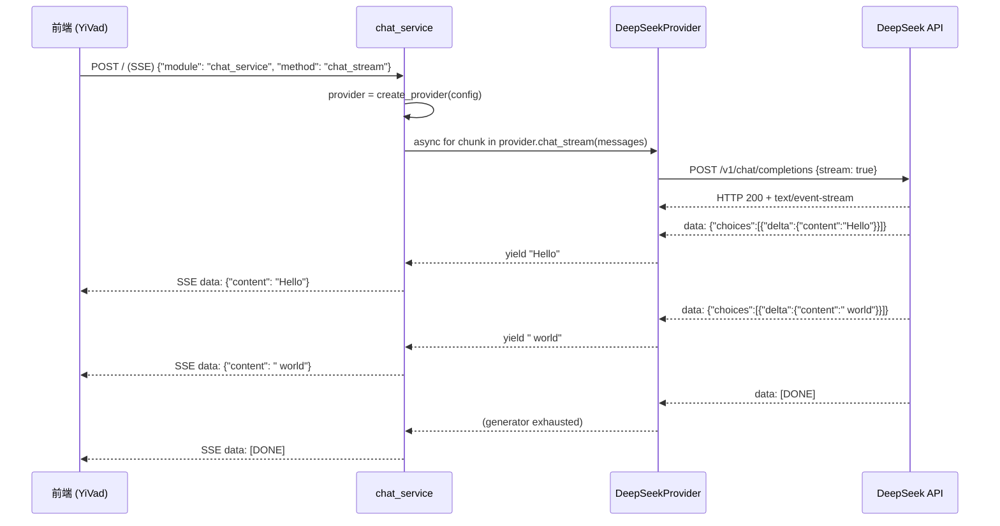

---

doc_type: module
prd_task_id: "YA-08-02"
title: "YA-08-02: Multi-Provider LLM — LLMProvider 抽象 + OllamaProvider + DeepSeekProvider — 开发方案"
status: 已完成
priority: P1
owner: 陈铭
roles: [engineer]
created: 2026-09-11
updated: 2026-09-14
project: YiAi
project_id: yiai
prd_month: "202608"
estimate_frontend: 4.0
source_prd: "02-需求-Multi-Provider-LLM.md"
source_okr: [yiai-002]
related_tests: ["02-prd-test-Multi-Provider-LLM"]

type: task
---

# YA-08-02: Multi-Provider LLM — LLMProvider 抽象 + OllamaProvider + DeepSeekProvider — 开发方案

> 来源 PRD：[02-需求-Multi-Provider-LLM.md](../../prds/2026-08/02-需求-Multi-Provider-LLM.md)
> 需求编号：YA-08-02 · 优先级：P1 · 人天：4.0d
> 类型：架构 · 状态：已完成

---

## 一、架构概述

七月迭代仅支持 Ollama 本地模型（qwen2.5 7B, nomic-embed-text 768d）。八月引入 `LLMProvider` 抽象层，通过策略模式支持多 Provider 运行时切换——修改配置文件即可切换模型，不需要改调用方代码。

### 1.1 Provider 架构全景


```mermaid
flowchart TB
  subgraph CONSUMERS["消费方 (不变)"]
    CHAT["chat_service<br/>普通聊天"]
    AGENT["agent.py<br/>Agent 循环"]
    RAG["rag/engine.py<br/>RAG 流式聊天"]
    COMPAT["openai_compat.py<br/>OpenAI 兼容 API"]
  end

  subgraph ABSTRACTION["Provider 抽象层"]
    ABC["<<abstract>> LLMProvider<br/>+ chat(messages, **kwargs) → str<br/>+ chat_stream(messages, **kwargs) → AsyncGenerator[str]<br/>+ embed(texts) → list[float]<br/>+ model_name → str<br/>+ context_window → int"]
  end

  subgraph PROVIDERS["具体 Provider 实现"]
    direction LR
    OLLAMA["OllamaProvider<br/>─ ollama.Client<br/>─ Chat: qwen2.5<br/>─ Embed: nomic-embed-text<br/>─ 本地 :11434"]
    DEEP["DeepSeekProvider<br/>─ aiohttp HTTP client<br/>─ Chat: deepseek-chat<br/>─ 流式: SSE text/event-stream<br/>─ API base_url 可配"]
    OPENAI_FUT["OpenAIProvider (复用 DeepSeek)<br/>─ 同为 OpenAI 兼容格式<br/>─ 仅改 base_url + api_key"]
  end

  subgraph INFRA["基础设施"]
    OLLAMA_API["Ollama :11434<br/>本地 GPU"]
    DEEPSEEK_API["DeepSeek API<br/>api.deepseek.com"]
  end

  CONSUMERS --> ABC
  ABC --> OLLAMA
  ABC --> DEEP
  ABC -.-> OPENAI_FUT
  OLLAMA --> OLLAMA_API
  DEEP --> DEEPSEEK_API
```

### 1.2 设计决策

| 决策 | 选择 | 理由 | 备选 |
|------|------|------|------|
| Provider 抽象方式 | ABC + 策略模式 | 新增 Provider 不需修改调用方代码（Open/Closed Principle） | 工厂函数 + 注册表（耦合度更高）, 独立 Service（重复代码） |
| 流式接口 | `AsyncGenerator[str]` | Python 原生异步迭代器，`async for` 语法简洁，跨 Provider 统一 | 回调函数（嵌套地狱）, asyncio.Queue（过度设计） |
| HTTP client | aiohttp (DeepSeek), ollama.Client (Ollama) | aiohttp 原生 async，SSE 流式解析简单 | httpx (API 更简洁但 SSE 需手动实现), requests (同步, 阻塞) |
| 配置驱动 | YAML config 动态读取 | 修改配置不需重启服务, `${ENV_VAR}` 语法防 key 泄露 | 环境变量直接读取（无默认值、无类型校验） |
| 不支持的 capability | 默认抛 `NotImplementedError` | Provider 可声明不支持的 capability（如 Ollama 无 function calling） | 抽象方法强制实现（Provider 负担过重） |
| 路由逻辑 | 配置字段 `llm.provider` 单选 | 简单直接, 满足当前规模 | Router 模式（多 Provider 负载均衡——未来扩展） |

---

## 二、文件清单

| # | 文件 | 类型 | 行数 | 职责 |
|---|------|------|------|------|
| 1 | `src/services/ai/llm_provider.py` | 新增 | ~250 | `LLMProvider` ABC + `OllamaProvider` + `DeepSeekProvider` 完整实现 |
| 2 | `src/services/ai/compaction.py` | 新增 | ~120 | 上下文压缩: token 计数 + 超窗口自动摘要 |
| 3 | `config.yaml` | 修改 | +25 | 新增 `llm.provider` / `llm.ollama` / `llm.deepseek` 配置节 |
| 4 | `src/shared/config.py` | 修改 | +20 | 新增 `LlmConfig` pydantic model + `OllamaConfig` + `DeepSeekConfig` |
| 5 | `src/services/ai/chat_service.py` | 修改 | ±10 | 替换硬编码 `ollama.Client` 为 `LLMProvider.current()` |
| 6 | `src/domain/ai/agent.py` | 修改 | ±5 | Agent 循环的 LLM 调用使用 Provider 抽象 |

**合计：2 新增 + 4 修改 = 6 文件，~430 行**

---

## 三、模块设计

### 3.1 LLMProvider 抽象基类

```python
# src/services/ai/llm_provider.py
from abc import ABC, abstractmethod
from collections.abc import AsyncGenerator
from typing import Any

class LLMProvider(ABC):
    """LLM Provider 抽象基类——所有 Provider 实现必须遵守此接口。

    设计约束:
    1. chat() 和 chat_stream() 是核心契约——调用方不关心底层是 Ollama 还是 HTTP API
    2. embed() 可选实现——不支持 embedding 的 Provider 抛 NotImplementedError
    3. 配置通过 __init__ 注入——不依赖全局状态
    4. 流式接口统一返回 AsyncGenerator[str]——调用方用 async for 消费
    """

    @property
    @abstractmethod
    def model_name(self) -> str:
        """当前使用的模型名 (如 'qwen2.5', 'deepseek-chat')。"""
        ...

    @property
    def context_window(self) -> int:
        """上下文窗口大小 (tokens)。默认 8192, 子类可覆盖。"""
        return 8192

    @abstractmethod
    async def chat(
        self,
        messages: list[dict[str, str]],
        system_prompt: str | None = None,
        temperature: float = 0.7,
        max_tokens: int | None = None,
        **kwargs: Any,
    ) -> str:
        """同步聊天——返回完整响应文本。

        Args:
            messages: [{"role": "user", "content": "..."}, ...]
            system_prompt: 系统提示词 (Provider 不支持则忽略)
            temperature: 采样温度 (0~2)
            max_tokens: 最大生成 token 数
        """
        ...

    @abstractmethod
    async def chat_stream(
        self,
        messages: list[dict[str, str]],
        system_prompt: str | None = None,
        temperature: float = 0.7,
        max_tokens: int | None = None,
        **kwargs: Any,
    ) -> AsyncGenerator[str, None]:
        """流式聊天——逐 token 返回响应文本。

        所有 Provider 的流式接口统一为 AsyncGenerator[str]。
        调用方使用 async for chunk in provider.chat_stream(...) 消费,
        不需要关心底层是 ollama.Client.stream() 还是 aiohttp SSE。
        """
        ...

    async def embed(self, texts: list[str]) -> list[list[float]]:
        """文本向量化——可选实现。不支持 embedding 的 Provider 抛 NotImplementedError。"""
        raise NotImplementedError(f"{self.__class__.__name__} does not support embedding")
```

### 3.2 OllamaProvider — 现有实现封装

```python
# src/services/ai/llm_provider.py (续)
import ollama

class OllamaProvider(LLMProvider):
    """Ollama 本地推理 Provider。

    封装 ollama.Client, 提供与现有 chat_service 相同的功能。
    保持向后兼容——chat_service 无需改动调用逻辑, 仅替换 client 实例。

    Config:
        llm.ollama.host: "http://localhost:11434"
        llm.ollama.model: "qwen2.5"
        llm.ollama.embed_model: "nomic-embed-text"
    """

    def __init__(self, config: "OllamaConfig"):
        self._config = config
        self._client = ollama.Client(host=config.host)
        self._model = config.model
        self._embed_model = config.embed_model

    @property
    def model_name(self) -> str:
        return self._model

    @property
    def context_window(self) -> int:
        return self._config.get("context_window", 32768)  # qwen2.5 默认 32K

    async def chat(self, messages, system_prompt=None, temperature=0.7,
                   max_tokens=None, **kwargs) -> str:
        full_messages = self._build_messages(messages, system_prompt)
        response = await self._run_async(
            self._client.chat,
            model=self._model,
            messages=full_messages,
            options={"temperature": temperature, **(kwargs.get("options", {}))},
        )
        return response["message"]["content"]

    async def chat_stream(self, messages, system_prompt=None, temperature=0.7,
                          max_tokens=None, **kwargs) -> AsyncGenerator[str, None]:
        full_messages = self._build_messages(messages, system_prompt)
        stream = self._client.chat(
            model=self._model,
            messages=full_messages,
            stream=True,
            options={"temperature": temperature, **(kwargs.get("options", {}))},
        )
        for chunk in stream:
            if "message" in chunk and "content" in chunk["message"]:
                yield chunk["message"]["content"]

    async def embed(self, texts: list[str]) -> list[list[float]]:
        results = []
        for text in texts:
            resp = await self._run_async(
                self._client.embeddings,
                model=self._embed_model,
                prompt=text,
            )
            results.append(resp["embedding"])
        return results

    @staticmethod
    def _build_messages(messages, system_prompt=None):
        result = []
        if system_prompt:
            result.append({"role": "system", "content": system_prompt})
        result.extend(messages)
        return result

    @staticmethod
    async def _run_async(func, *args, **kwargs):
        import asyncio
        return await asyncio.to_thread(func, *args, **kwargs)
```

### 3.3 DeepSeekProvider — HTTP + SSE 流式

```python
# src/services/ai/llm_provider.py (续)
import aiohttp
import json
import asyncio

class DeepSeekProvider(LLMProvider):
    """DeepSeek API Provider——HTTP + SSE 流式。

    使用 aiohttp 异步 HTTP client, 流式响应解析 SSE (text/event-stream) 格式。
    DeepSeek API 兼容 OpenAI Chat Completions 格式, 响应格式:
      data: {"choices":[{"delta":{"content":"..."}}]}
      data: [DONE]

    Config:
        llm.deepseek.api_key: "${DEEPSEEK_API_KEY}"
        llm.deepseek.model: "deepseek-chat"
        llm.deepseek.base_url: "https://api.deepseek.com/v1"
    """

    def __init__(self, config: "DeepSeekConfig"):
        self._config = config
        self._base_url = config.base_url.rstrip("/")
        self._model = config.model
        self._api_key = config.api_key

    @property
    def model_name(self) -> str:
        return self._model

    @property
    def context_window(self) -> int:
        return 65536  # DeepSeek V3 默认 64K context

    async def chat(self, messages, system_prompt=None, temperature=0.7,
                   max_tokens=None, **kwargs) -> str:
        request_body = self._build_request(messages, system_prompt, temperature,
                                           max_tokens, stream=False, **kwargs)
        async with aiohttp.ClientSession() as session:
            async with session.post(
                f"{self._base_url}/chat/completions",
                json=request_body,
                headers=self._headers(),
                timeout=aiohttp.ClientTimeout(total=60),
            ) as resp:
                data = await resp.json()
                if "error" in data:
                    raise RuntimeError(f"DeepSeek API error: {data['error']}")
                return data["choices"][0]["message"]["content"]

    async def chat_stream(self, messages, system_prompt=None, temperature=0.7,
                          max_tokens=None, **kwargs) -> AsyncGenerator[str, None]:
        request_body = self._build_request(messages, system_prompt, temperature,
                                           max_tokens, stream=True, **kwargs)
        async with aiohttp.ClientSession() as session:
            async with session.post(
                f"{self._base_url}/chat/completions",
                json=request_body,
                headers=self._headers(),
                timeout=aiohttp.ClientTimeout(total=120),
            ) as resp:
                async for line in resp.content:
                    line = line.decode("utf-8").strip()
                    if not line or line.startswith(":"):
                        continue
                    if line == "data: [DONE]":
                        break
                    if line.startswith("data: "):
                        try:
                            data = json.loads(line[6:])
                            content = data.get("choices", [{}])[0].get("delta", {}).get("content", "")
                            if content:
                                yield content
                        except json.JSONDecodeError:
                            continue

    def _build_request(self, messages, system_prompt, temperature, max_tokens,
                       stream: bool, **kwargs) -> dict:
        full_messages = []
        if system_prompt:
            full_messages.append({"role": "system", "content": system_prompt})
        full_messages.extend(messages)

        body = {
            "model": self._model,
            "messages": full_messages,
            "temperature": temperature,
            "stream": stream,
        }
        if max_tokens:
            body["max_tokens"] = max_tokens
        body.update({k: v for k, v in kwargs.items()
                     if k in {"top_p", "frequency_penalty", "presence_penalty"}})
        return body

    def _headers(self) -> dict:
        return {
            "Authorization": f"Bearer {self._api_key}",
            "Content-Type": "application/json",
        }
```

### 3.4 配置驱动 Provider 选择

```yaml
# config.yaml (新增)
llm:
  provider: "ollama"  # ollama | deepseek — 运行时切换
  ollama:
    host: "http://localhost:11434"
    model: "qwen2.5"
    embed_model: "nomic-embed-text"
  deepseek:
    api_key: "${DEEPSEEK_API_KEY}"    # 从环境变量读取
    model: "deepseek-chat"
    base_url: "https://api.deepseek.com/v1"
```

```python
# src/shared/config.py (新增)
from pydantic_settings import BaseSettings

class OllamaConfig(BaseSettings):
    host: str = "http://localhost:11434"
    model: str = "qwen2.5"
    embed_model: str = "nomic-embed-text"

class DeepSeekConfig(BaseSettings):
    api_key: str = ""
    model: str = "deepseek-chat"
    base_url: str = "https://api.deepseek.com/v1"

class LlmConfig(BaseSettings):
    provider: str = "ollama"
    ollama: OllamaConfig = OllamaConfig()
    deepseek: DeepSeekConfig = DeepSeekConfig()

# Provider 工厂函数
def create_provider(config: "AppConfig") -> LLMProvider:
    if config.llm.provider == "deepseek":
        return DeepSeekProvider(config.llm.deepseek)
    return OllamaProvider(config.llm.ollama)
```

### 3.5 上下文压缩 — compaction.py

```python
# src/services/ai/compaction.py
import tiktoken
from typing import Any

class ContextCompactor:
    """长对话上下文压缩——当 token 数超过窗口 80% 时触发自动摘要。

    策略:
    1. 保留最近的 N 条消息 (默认 10)——保证当前对话上下文的连续性
    2. 将早期的消息压缩为摘要——调用 LLM 生成 {summary, key_points}
    3. 压缩后的上下文结构: [摘要] + [最近消息]
    """

    def __init__(self, provider: "LLMProvider", max_recent: int = 10):
        self._provider = provider
        self._max_recent = max_recent
        self._encoder = tiktoken.get_encoding("cl100k_base")
        self._compaction_threshold = 0.8  # 窗口 80% 触发

    def needs_compaction(self, messages: list[dict], window: int | None = None) -> bool:
        """判断是否需要压缩。"""
        window = window or self._provider.context_window
        token_count = sum(len(self._encoder.encode(m.get("content", ""))) for m in messages)
        return token_count > window * self._compaction_threshold

    async def compact(self, messages: list[dict]) -> list[dict]:
        """压缩消息列表——返回压缩后的消息列表。"""
        if not self.needs_compaction(messages):
            return messages

        recent = messages[-self._max_recent:]
        earlier = messages[:-self._max_recent]

        # 生成早期对话摘要
        summary = await self._generate_summary(earlier)

        return [
            {"role": "system", "content": f"[Previous conversation summary]: {summary}"},
            *recent,
        ]

    async def _generate_summary(self, messages: list[dict]) -> str:
        compact_prompt = """Summarize the following conversation concisely.
Focus on: key decisions, important facts, user preferences, and open questions.
Do NOT include greetings or small talk.

Conversation:
"""
        conversation_text = "\n".join(
            f"{m['role']}: {m['content']}" for m in messages
        )
        full_prompt = compact_prompt + conversation_text

        return await self._provider.chat(
            messages=[{"role": "user", "content": full_prompt}],
            temperature=0.3,
            max_tokens=500,
        )
```

---

## 四、关键流程

### 4.1 流式响应全链路


```mermaid
sequenceDiagram
  participant FE as 前端 (YiVad)
  participant CS as chat_service
  participant PROV as DeepSeekProvider
  participant API as DeepSeek API

  FE->>CS: POST / (SSE) {"module": "chat_service", "method": "chat_stream"}
  CS->>CS: provider = create_provider(config)
  CS->>PROV: async for chunk in provider.chat_stream(messages)
  PROV->>API: POST /v1/chat/completions {stream: true}
  API-->>PROV: HTTP 200 + text/event-stream
  API-->>PROV: data: {"choices":[{"delta":{"content":"Hello"}}]}
  PROV-->>CS: yield "Hello"
  CS-->>FE: SSE data: {"content": "Hello"}
  API-->>PROV: data: {"choices":[{"delta":{"content":" world"}}]}
  PROV-->>CS: yield " world"
  CS-->>FE: SSE data: {"content": " world"}
  API-->>PROV: data: [DONE]
  PROV-->>CS: (generator exhausted)
  CS-->>FE: SSE data: [DONE]
```

### 4.2 Provider 切换时序

```
1. 用户修改 config.yaml: llm.provider: "deepseek"
2. 下一次请求进入 chat_service:
   → create_provider(config) 检查 llm.provider
   → 创建 DeepSeekProvider 实例
   → 进行中的 ollama 流保持不变 (provider 切换仅对新请求生效)
3. 切换回 ollama:
   → 修改 config.yaml: llm.provider: "ollama"
   → 下一次请求创建 OllamaProvider
```

---

## 五、实施路线图

| 阶段 | 内容 | 验证标准 | 人天 |
|------|------|---------|------|
| 1. ABC + OllamaProvider | 定义 `LLMProvider` ABC (chat/chat_stream/embed)，实现 `OllamaProvider` 封装现有 `ollama.Client` | 现有 chat 功能不变，所有测试通过 | 1.0 |
| 2. DeepSeekProvider | 实现 `DeepSeekProvider`：aiohttp HTTP client + SSE 流式解析 + OpenAI 兼容格式 | `python -c "provider.chat([{role:'user', content:'hi'}])"` 返回 DeepSeek 响应 | 1.5 |
| 3. 配置驱动 + 上下文压缩 | YamlConfig `llm.provider` 驱动 Provider 选择 + `ContextCompactor` 超窗口自动摘要 | 修改 config.yaml 切换 Provider 生效 + 512 条消息的对话 token 数维持在窗口 80% 以内 | 1.0 |
| 4. 测试 | Provider 切换集成测试 + 流式 SSE 解析测试 + 上下文压缩测试 | `python -m pytest tests/ -k llm_provider` 全部通过 | 0.5 |

**合计：4.0d**

---

## 六、代码审查检查清单

- [x] `LLMProvider` ABC 定义 `chat()` 和 `chat_stream()` 两个核心抽象方法，`embed()` 可选（默认抛 `NotImplementedError`）
- [x] `OllamaProvider` 使用 `ollama.Client` 保持向后兼容——chat_service 硬编码 Ollama 的调用点全部替换为 `provider.chat()`
- [x] `DeepSeekProvider` SSE 解析兼容 OpenAI 格式：`data: {"choices":[{"delta":{"content":"..."}}]}` 和 `data: [DONE]`
- [x] `DeepSeekProvider._build_request()` 过滤未知 kwargs（仅透传 `top_p`/`frequency_penalty`/`presence_penalty`）
- [x] API Key 使用 `${DEEPSEEK_API_KEY}` 环境变量语法（非硬编码，非日志输出）
- [x] `chat_stream` 使用 `AsyncGenerator[str, None]`（非回调），支持 `async for`
- [x] `ContextCompactor.needs_compaction()` 在 token 计数超窗口 80% 时返回 True
- [x] Provider 切换仅对新请求生效，进行中的流不受影响

---

## 七、技术风险评估

| 风险 | 概率 | 影响 | 缓解措施 | 应急预案 |
|------|------|------|---------|---------|
| DeepSeek API 格式与 OpenAI 不一致 | 中 | 高 | 适配层 `_build_request()` / SSE 解析 统一转换为 Provider 内部格式 | 回退到 Ollama (`llm.provider: "ollama"`) |
| Provider 切换时进行中的流中断 | 低 | 中 | 切换仅对新请求生效，进行中的 streaming 连接不受影响 | 等待流自然结束 |
| API Key 泄露 | 低 | 高 | 环境变量 + config.yaml 中使用 `${VAR}` 语法，日志中不打印 key | 密钥轮换 (DeepSeek Console 重生成) |
| aiohttp session 泄漏 | 中 | 中 | 使用 `async with aiohttp.ClientSession()` 确保 session 关闭 | — |
| HTTP 连接池耗尽 | 低 | 中 | 每次请求创建新 session (短期)，高频请求可改为 session 池 | 限制并发请求数 |
| Tiktoken 估算偏差 | 低 | 低 | 不同模型 tokenizer 不同，tiktoken (cl100k_base) 估算可能有 10-20% 偏差。`compaction_threshold=0.8` 留了 20% buffer | Provider 自主上报实际 token count (未来扩展) |

---

## 八、已知缺口与技术债

### 8.1 功能缺口

| # | 缺口 | 影响 | 建议 | 预计人天 |
|---|------|------|------|---------|
| 1 | OpenAI 兼容 Provider (GPT-4o) | 无法直接调用 OpenAI API | 复用 DeepSeekProvider (同为 OpenAI 兼容格式)，仅改 `base_url` + `api_key`——工作量极小 (~0.2d) | 0.2 |
| 2 | Provider 健康检查 + 自动 fallback | Provider 故障时无自动检测和切换 | 心跳检测机制：每 30s ping Provider，连续失败 3 次自动 fallback 到下一个可用 Provider | 1.0 |
| 3 | Provider 负载均衡（双路并行） | 单一 Provider 可能成为瓶颈 | 多 Provider 路由：按请求类型分流（简单问答 → Ollama，复杂推理 → DeepSeek） | 1.5 |
| 4 | Embedding Provider 抽象 | RAG 引擎的 embedding 硬编码 Ollama nomic-embed-text | `LLMProvider.embed()` 已预留接口，需实现 DeepSeek Embedding Provider | 0.5 |

### 8.2 技术债

| # | 技术债 | 优先级 | 说明 | 状态 |
|---|--------|--------|------|------|
| 1 | Provider 配置不支持多 Provider 负载均衡 | P2 | 当前 `llm.provider` 单选，无法 Ollama + DeepSeek 双路并行 fallback | 待实施 |
| 2 | 上下文压缩 token 计数依赖 tiktoken 近似 | P3 | 不同模型 tokenizer 不同，tiktoken 估算 10-20% 偏差 | 待实施：Provider 自主上报 `token_count()` 方法 |
| 3 | OllamaProvider 中 `ollama.Client` 为同步封装 | P3 | `asyncio.to_thread` 包装同步调用，线程池耗尽风险 | 待评估：改用 `ollama.AsyncClient` (需 ollama >= 0.4) |
| 4 | aiohttp session 每次请求创建/销毁 | P4 | 高并发场景 session 创建开销大，应复用连接池 | 待实施：Provider 级 session pool |

---

## 九、实现完成记录

> **完成日期**：2026-08-20 · **复核日期**：2026-09-15

| 分类 | 文件 | 说明 |
|------|------|------|
| Provider 抽象 + Ollama 实现 | `services/ai/llm_provider.py` | `LLMProvider` ABC + `OllamaProvider` + `DeepSeekProvider` (250 行) |
| 上下文压缩 | `services/ai/compaction.py` | `ContextCompactor` 超窗口自动摘要 (120 行) |
| 配置 | `config.yaml` + `shared/config.py` | `llm.provider` 配置项 + pydantic Model |
| Service 适配 | `services/ai/chat_service.py`, `domain/ai/agent.py` | 替换硬编码 Ollama 为 Provider |
| **合计** | **6 个文件** | 2 新增 + 4 修改 |

---