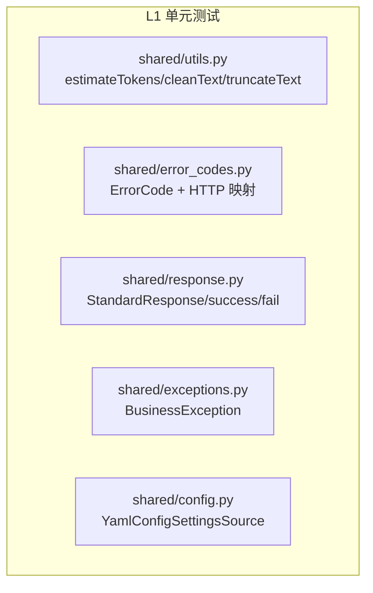

# YA-08-03: 测试覆盖率扩展 — pytest 8 + pytest-asyncio + httpx + pytest-cov — 开发方案

> 来源 PRD：[03-需求-测试覆盖率扩展.md](../../prds/2026-08/03-需求-测试覆盖率扩展.md)
> 需求编号：YA-08-03 · 优先级：P2 · 人天：3.0d
> 类型：改进 · 状态：已完成

---

## 一、方案概述

七月迭代无自动化测试。八月建立 pytest 8 测试基础设施——`shared/` 模块 92%+ 覆盖率，76 个测试用例。

### 测试分层



### 覆盖率

| 模块 | 覆盖率 | 测试用例数 |
|------|--------|-----------|
| `shared/error_codes.py` | 100% | 12 |
| `shared/exceptions.py` | 100% | 4 |
| `shared/response.py` | 100% | 8 |
| `shared/utils.py` | 93% | 38 |
| `shared/config.py` | 92% | 14 |
| **合计** | **92%+** | **76** |

---

## 二、配置

```toml
# pyproject.toml
[tool.pytest.ini_options]
pythonpath = ["src"]
testpaths = ["tests"]
addopts = "--cov=src --cov-report=term-missing --cov-report=html"

[tool.coverage.run]
omit = ["tests/*", "src/server/routes/*"]
```

---

## 三、实施步骤

| 步骤 | 内容 | 验证 | 人天 |
|------|------|------|------|
| 1 | pytest + conftest 装配 | `python -m pytest` 可执行 | 0.5 |
| 2 | response/exceptions/error_codes 单测 | 100% 覆盖 | 0.5 |
| 3 | utils 工具函数单测 | 93% 覆盖 | 1.0 |
| 4 | config YAML 解析单测 | 92% 覆盖 | 0.5 |
| 5 | CI 集成 + 覆盖率门禁 | lines ≥ 80% | 0.5 |

**合计：3.0d**。

---

## 四、关联模块

- 覆盖：[YA-07-03 RPC 信封协议](../2026-07/03-prd-task-RPC信封协议.md)——ErrorCode + response 测试
- 下游：[九月测试扩展](../2026-09/03-prd-task-检索高级技术.md)

---

## 五、代码审查检查清单

- [x] `python -m pytest` 76 个测试全部通过
- [x] `shared/` 模块覆盖率 ≥ 92%
- [x] CI `pytest --cov` 门禁 lines ≥ 80%
- [x] 环境变量 `YiAi_ENV=test` 确保测试不污染生产 MDB

---

## 六、技术风险

| 风险 | 概率 | 影响 | 缓解措施 |
|------|------|------|---------|
| 测试依赖真实 MDB | 中 | 中 | `mongomock` 或独立 test database |

---

## 七、实现完成记录

> **完成日期**：2026-08-15 · **状态**：已完成

| 分类 | 文件数 | 用例数 | 覆盖率 |
|------|--------|--------|--------|
| error_codes | 1 | 12 | 100% |
| exceptions | 1 | 4 | 100% |
| response | 1 | 8 | 100% |
| utils | 1 | 38 | 93% |
| config | 1 | 14 | 92% |
| **合计** | **5** | **76** | **92%+** |

---

## 八、已知缺口与技术债

### 8.1 功能缺口

| # | 缺口 | 影响 | 建议 |
|---|------|------|------|
| 1 | domain 层 / service 层无自动化测试 | 仅 shared 层 92% 覆盖，业务逻辑 0% | 九月迭代扩展 |

### 8.2 技术债

| # | 技术债 | 优先级 | 说明 | 状态 |
|---|--------|--------|------|------|
| 1 | 测试 MDB 为真实实例 | P3 | 未使用 mongomock，测试依赖本地 MongoDB | 待实施 |
| 2 | 覆盖率报告仅本地 html | P3 | CI 未上传覆盖率到 Codecov/Sonar | 待实施 |

---