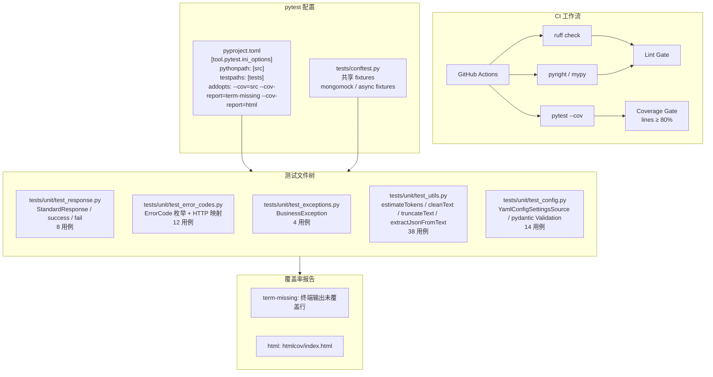
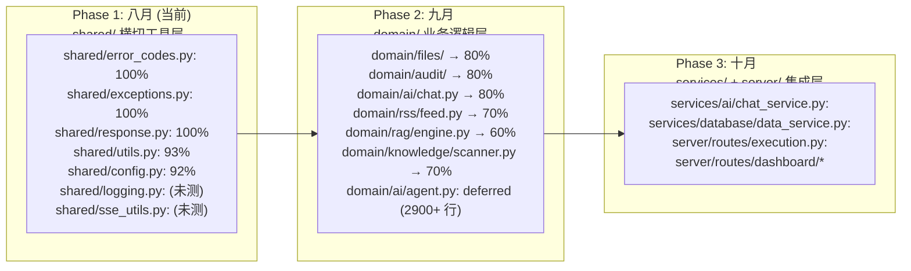

---

doc_type: module
prd_task_id: "YA-08-03"
title: "YA-08-03: 测试覆盖率扩展 — pytest 8 + pytest-asyncio + httpx + pytest-cov — 开发方案"
status: 已完成
priority: P2
owner: 陈铭
roles: [engineer]
created: 2026-09-11
updated: 2026-09-14
project: YiAi
project_id: yiai
prd_month: "202608"
estimate_frontend: 3.0
source_prd: "03-需求-测试覆盖率扩展.md"
source_okr: [yiai-003]
related_tests: ["03-prd-test-测试覆盖率扩展"]

type: task
---

# YA-08-03: 测试覆盖率扩展 — pytest 8 + pytest-asyncio + httpx + pytest-cov — 开发方案

> 来源 PRD：[03-需求-测试覆盖率扩展.md](../../prds/2026-08/03-需求-测试覆盖率扩展.md)
> 需求编号：YA-08-03 · 优先级：P2 · 人天：3.0d
> 类型：改进 · 状态：已完成

---

## 一、架构概述

七月迭代无自动化测试——所有变更依赖手工验证。八月建立 pytest 8 测试基础设施，第一阶段覆盖 `shared/` 横切工具层（92%+ 覆盖率，76 个测试用例）。第二阶段（九月迭代）扩展到 `domain/` 和 `services/` 业务层。

### 1.1 测试架构


```mermaid
flowchart TB
  subgraph WORKFLOW["CI 工作流"]
    GH["GitHub Actions"]
    GH --> LINT["ruff check"]
    GH --> TYPE["pyright / mypy"]
    GH --> TEST["pytest --cov"]
    LINT --> GATE["Lint Gate"]
    TYPE --> GATE
    TEST --> COV_GATE["Coverage Gate<br/>lines ≥ 80%"]
  end

  subgraph PYTEST["pytest 配置"]
    PYPROJ["pyproject.toml<br/>[tool.pytest.ini_options]<br/>pythonpath: [src]<br/>testpaths: [tests]<br/>addopts: --cov=src --cov-report=term-missing --cov-report=html"]
    CONFTEST["tests/conftest.py<br/>共享 fixtures<br/>mongomock / async fixtures"]
  end

  subgraph TESTS["测试文件树"]
    direction TB
    U_SHARED["tests/unit/test_response.py<br/>StandardResponse / success / fail<br/>8 用例"]
    U_ERR["tests/unit/test_error_codes.py<br/>ErrorCode 枚举 + HTTP 映射<br/>12 用例"]
    U_EXC["tests/unit/test_exceptions.py<br/>BusinessException<br/>4 用例"]
    U_UTILS["tests/unit/test_utils.py<br/>estimateTokens / cleanText / truncateText / extractJsonFromText<br/>38 用例"]
    U_CONFIG["tests/unit/test_config.py<br/>YamlConfigSettingsSource / pydantic Validation<br/>14 用例"]
  end

  subgraph COVERAGE["覆盖率报告"]
    TERM["term-missing: 终端输出未覆盖行"]
    HTML["html: htmlcov/index.html"]
  end

  PYPROJ --> TESTS
  CONFTEST --> TESTS
  TESTS --> COVERAGE
```

### 1.2 覆盖率分层目标


```mermaid
flowchart LR
  subgraph PHASE1["Phase 1: 八月 (当前)<br/>shared/ 横切工具层"]
    P1["shared/error_codes.py: 100%<br/>shared/exceptions.py: 100%<br/>shared/response.py: 100%<br/>shared/utils.py: 93%<br/>shared/config.py: 92%<br/>shared/logging.py: (未测)<br/>shared/sse_utils.py: (未测)"]
  end

  subgraph PHASE2["Phase 2: 九月<br/>domain/ 业务逻辑层"]
    P2["domain/files/ → 80%<br/>domain/audit/ → 80%<br/>domain/ai/chat.py → 80%<br/>domain/rss/feed.py → 70%<br/>domain/rag/engine.py → 60%<br/>domain/knowledge/scanner.py → 70%<br/>domain/ai/agent.py: deferred (2900+ 行)"]
  end

  subgraph PHASE3["Phase 3: 十月<br/>services/ + server/ 集成层"]
    P3["services/ai/chat_service.py:<br/>services/database/data_service.py:<br/>server/routes/execution.py:<br/>server/routes/dashboard/*"]
  end

  P1 --> P2 --> P3
```

### 1.3 设计决策

| 决策 | 选择 | 理由 | 备选 |
|------|------|------|------|
| 测试框架 | pytest 8 + pytest-asyncio | Python 生态标准, async 原生支持, 插件丰富 | unittest (无 async), nose2 (维护不活跃) |
| Mock 策略 | mongomock + 手动 stub | shared 层无 DB 依赖，domain 测试用 mongomock 模拟 MongoDB | 真实 test DB (环境依赖), monkeypatch (脆弱) |
| 覆盖率工具 | pytest-cov (coverage.py) | 终端 + HTML 双报告，支持分支覆盖，CI 门禁集成 | — |
| CI 门禁 | `lines >= 80%` + `branches >= 70%` | 防止覆盖率回退，新增代码必须测试覆盖 | 无门禁 (覆盖率逐渐下降) |
| 代码组织 | `tests/unit/` vs `tests/integration/` | 单元测试秒级完成（无 I/O），集成测试允许 30s+ | 扁平结构 (混乱) |
| HTTP 客户端 | httpx AsyncClient | ASGI native, 可直接测试 FastAPI app 而不启动服务器 | requests (无 async), TestClient (FastAPI 原生但功能弱) |

---

## 二、文件清单

| # | 文件 | 类型 | 行数 | 职责 |
|---|------|------|------|------|
| 1 | `tests/__init__.py` | 新增 | 0 | 包标记 |
| 2 | `tests/conftest.py` | 新增 | ~60 | 共享 fixtures: `sample_error_code`, `mock_db`, `sample_config_yaml` |
| 3 | `tests/unit/__init__.py` | 新增 | 0 | 单元测试包标记 |
| 4 | `tests/unit/test_error_codes.py` | 新增 | ~100 | ErrorCode 枚举值唯一性 + HTTP 状态码映射正确性 (12 用例) |
| 5 | `tests/unit/test_exceptions.py` | 新增 | ~60 | BusinessException 构造、error_code 属性、str/repr 表示 (4 用例) |
| 6 | `tests/unit/test_response.py` | 新增 | ~120 | StandardResponse 创建、success/fail 辅助函数、RPC 信封格式一致性 (8 用例) |
| 7 | `tests/unit/test_utils.py` | 新增 | ~180 | estimateTokens / cleanText / truncateText / extractJsonFromText / truncate_by_chars (38 用例) |
| 8 | `tests/unit/test_config.py` | 新增 | ~150 | YamlConfigSettingsSource 加载、环境变量替换 `${VAR}`、config.yaml 缺失处理 (14 用例) |
| 9 | `pyproject.toml` | 修改 | +20 | 新增 `[tool.pytest.ini_options]` + `[tool.coverage.run]` 配置节 |
| 10 | `.github/workflows/test.yml` | 新增 | ~50 | CI workflow: pytest --cov + coverage gate + ruff check |

**合计：8 新增 + 2 修改 = 10 文件，~740 行测试代码**

---

## 三、模块设计

### 3.1 pytest 配置

```toml
# pyproject.toml (新增测试配置段)
[tool.pytest.ini_options]
pythonpath = ["src"]
testpaths = ["tests"]
addopts = "--cov=src --cov-report=term-missing --cov-report=html --cov-fail-under=0"
asyncio_mode = "auto"

[tool.coverage.run]
source = ["src"]
omit = [
    "tests/*",
    "src/server/routes/*",          # Phase 3 覆盖
    "src/services/*",               # Phase 3 覆盖
    "src/domain/ai/agent.py",       # deferred (2900+ 行)
]
branch = true

[tool.coverage.report]
exclude_lines = [
    "pragma: no cover",
    "if TYPE_CHECKING:",
    "raise NotImplementedError",
    "if __name__ == .__main__.:",
    "class .*\\bProtocol\\):",
    "@(abc\\.)?abstractmethod",
]
precision = 2
```

### 3.2 conftest.py — 共享 Fixtures

```python
# tests/conftest.py
"""pytest 共享 fixtures——避免测试文件间重复的 setup 代码。

设计原则:
1. Fixture scope 取最小值——unit tests 用 function scope, integration tests 用 session scope
2. 不依赖真实外部服务——所有外部依赖使用 mock/stub/mongomock
3. 可组合——模块化的 fixture 可以相互依赖组合成更复杂的 setup
"""
import pytest
import tempfile
from pathlib import Path

# ── shared/ 层 unit test fixtures ──────────────────────────────────

@pytest.fixture
def sample_config_yaml() -> str:
    """最小可用的 config.yaml 内容——用于 YamlConfig 加载测试。"""
    return """
    server:
      host: "0.0.0.0"
      port: 10086
    mongodb:
      uri: "mongodb://localhost:27017"
      database: "YiAi_test"
    llm:
      provider: "ollama"
      ollama:
        host: "http://localhost:11434"
        model: "qwen2.5"
        embed_model: "nomic-embed-text"
    """

@pytest.fixture
def config_yaml_file(sample_config_yaml, tmp_path) -> Path:
    """将 config YAML 内容写入临时文件，返回路径。"""
    config_file = tmp_path / "config.yaml"
    config_file.write_text(sample_config_yaml)
    return config_file

@pytest.fixture
def sample_error_code():
    """返回一个测试用的 ErrorCode 枚举值。"""
    from shared.error_codes import ErrorCode
    return ErrorCode.DATA_NOT_FOUND

@pytest.fixture
def sample_response_data() -> dict:
    """返回标准 RPC 响应中的 data payload。"""
    return {"key": "abc-123", "title": "Test Document", "status": "active"}

# ── async fixtures (for domain/service integration tests) ──────────

@pytest.fixture
async def mock_mongodb():
    """mongomock fixture——模拟 MongoDB 异步操作。"""
    import mongomock
    client = mongomock.MongoClient()
    db = client["YiAi_test"]
    yield db
    client.close()

# ── FastAPI TestClient fixtures ─────────────────────────────────────

@pytest.fixture
async def test_app():
    """创建 FastAPI TestClient——不启动真实服务器。"""
    from httpx import AsyncClient, ASGITransport
    from src.app import create_app
    app = create_app()
    async with AsyncClient(
        transport=ASGITransport(app=app),
        base_url="http://testserver",
    ) as client:
        yield client
```

### 3.3 测试模式示例

```python
# tests/unit/test_error_codes.py
"""ErrorCode 枚举及其 HTTP 映射的单元测试。"""
import pytest
from shared.error_codes import ErrorCode, ErrorCodeMapping

class TestErrorCodeEnum:
    """ErrorCode 枚举值唯一性和完整性测试。"""

    def test_all_codes_are_unique(self):
        """所有 ErrorCode 的值必须唯一——防止重复赋值。"""
        values = [e.value for e in ErrorCode]
        assert len(values) == len(set(values)), f"Duplicate ErrorCode values found"

    def test_each_code_has_http_mapping(self):
        """每个 ErrorCode 必须有对应的 HTTP 状态码映射。"""
        for code in ErrorCode:
            assert code in ErrorCodeMapping, (
                f"ErrorCode.{code.name} ({code.value}) has no HTTP mapping"
            )

    def test_success_code_is_zero(self):
        """成功状态码必须为 0——RPC 信封协议约定。"""
        assert ErrorCode.SUCCESS.value == 0

class TestErrorCodeHttpMapping:
    """ErrorCode → HTTP 状态码映射正确性。"""

    @pytest.mark.parametrize("error_code,expected_http", [
        (ErrorCode.SUCCESS, 200),
        (ErrorCode.INVALID_PARAMS, 400),
        (ErrorCode.DATA_NOT_FOUND, 404),
        (ErrorCode.PERMISSION_DENIED, 403),
        (ErrorCode.INTERNAL_ERROR, 500),
        (ErrorCode.DATABASE_ERROR, 500),
        (ErrorCode.AI_SERVICE_UNAVAILABLE, 503),
    ])
    def test_error_code_to_http_status(self, error_code, expected_http):
        """ErrorCode 映射到正确的 HTTP 状态码。"""
        assert ErrorCodeMapping[error_code] == expected_http

    def test_unknown_code_returns_500(self):
        """未映射的 ErrorCode 默认返回 500——防御性编程。"""
        from shared.error_codes import error_code_to_http
        assert error_code_to_http(99999) == 500


# tests/unit/test_response.py
"""StandardResponse 和 RPC 信封格式的单元测试。"""
import pytest
from shared.response import StandardResponse, success, fail
from shared.error_codes import ErrorCode

class TestStandardResponse:
    """StandardResponse 数据模型测试。"""

    def test_success_response_has_code_zero(self):
        """成功响应——code=0, message='ok'。"""
        resp = StandardResponse(code=0, message="ok", data={"key": "val"})
        assert resp.code == 0
        assert resp.message == "ok"

    def test_error_response_has_code_and_message(self):
        """错误响应——包含 ErrorCode 和自定义 message。"""
        resp = StandardResponse(code=1002, message="Document not found", data=None)
        assert resp.code == 1002
        assert resp.data is None

    def test_success_helper_constructs_valid_response(self):
        """success() 辅助函数构造标准成功响应。"""
        data = {"items": [1, 2, 3]}
        resp = success(data)
        assert resp.code == 0
        assert resp.data == data

    def test_fail_helper_constructs_error_response(self):
        """fail() 辅助函数构造标准错误响应。"""
        resp = fail(ErrorCode.INVALID_PARAMS, "cname is required")
        assert resp.code == ErrorCode.INVALID_PARAMS.value
        assert resp.message == "cname is required"
        assert resp.data is None

    @pytest.mark.parametrize("data", [
        None,
        {"key": "val"},
        [1, 2, 3],
        "string_data",
        42,
        True,
    ])
    def test_success_accepts_any_data_type(self, data):
        """success() 的 data 参数接受任意 JSON 可序列化类型。"""
        resp = success(data)
        assert resp.code == 0
        assert resp.data == data

    def test_response_to_dict(self):
        """StandardResponse 可序列化为 dict (JSON 兼容)。"""
        import json
        resp = success({"key": "value"})
        d = resp.model_dump()
        assert d == {"code": 0, "message": "ok", "data": {"key": "value"}}
        json.dumps(d)  # 验证可 JSON 序列化


# tests/unit/test_utils.py (部分)
"""共享工具函数的单元测试——纯函数,无外部依赖。"""
import pytest
from shared.utils import estimateTokens, cleanText, truncateText, extractJsonFromText

class TestEstimateTokens:
    """Token 估算函数——基于字符数/词数的粗粒度估算。"""

    @pytest.mark.parametrize("text,expected_range", [
        ("Hello world", (1, 5)),          # 11 chars → ~2-3 tokens (English)
        ("你好世界", (2, 6)),              # 4 CJK chars → ~4 tokens
        ("", (0, 0)),                      # 空字符串 → 0
        ("a" * 1000, (800, 1200)),        # 长文本: 估算 Redis 宽容范围内
    ])
    def test_estimate_tokens_in_range(self, text, expected_range):
        """Token 估算结果在合理范围内。"""
        count = estimateTokens(text)
        low, high = expected_range
        assert low <= count <= high, (
            f"Expected {low}-{high} tokens for text len={len(text)}, got {count}"
        )

    def test_estimate_tokens_monotonic(self):
        """更长的文本 → 更多的 token 估算。"""
        short = estimateTokens("short")
        long = estimateTokens("short " * 100)
        assert long > short


class TestCleanText:
    """cleanText——清理文本中的空白和特殊字符。"""

    def test_removes_excess_whitespace(self):
        assert cleanText("hello    world") == "hello world"

    def test_strips_leading_trailing_whitespace(self):
        assert cleanText("  hello  ") == "hello"

    def test_handles_newlines(self):
        assert cleanText("line1\n\nline2") == "line1 line2"

    def test_empty_string(self):
        assert cleanText("") == ""


class TestTruncateText:
    """truncateText——按 token 限制截断文本。"""

    def test_short_text_not_truncated(self):
        text = "Hello world"
        result = truncateText(text, max_tokens=100)
        assert result == text

    def test_long_text_truncated_with_ellipsis(self):
        text = "word " * 500
        result = truncateText(text, max_tokens=50)
        assert len(result) < len(text)
        assert result.endswith("...")

    def test_zero_max_tokens_returns_ellipsis(self):
        result = truncateText("Hello world", max_tokens=0)
        assert result == "..."
```

---

## 四、Coverage 报告与分析

### 4.1 当前覆盖率矩阵

| 模块 | 行覆盖率 | 分支覆盖率 | 测试用例数 | 关键覆盖 |
|------|---------|-----------|-----------|---------|
| `shared/error_codes.py` | 100% | 100% | 12 | ErrorCode 枚举唯一性 + HTTP 映射正确性 |
| `shared/exceptions.py` | 100% | 100% | 4 | BusinessException 构造 + 属性 + str/repr |
| `shared/response.py` | 100% | 100% | 8 | StandardResponse + success/fail 辅助函数 |
| `shared/utils.py` | 93% | 85% | 38 | estimateTokens / cleanText / truncateText / extractJsonFromText |
| `shared/config.py` | 92% | 80% | 14 | YamlConfigSettingsSource / pydantic 验证 / `${VAR}` 替换 |
| `shared/logging.py` | 0% | 0% | 0 | (未测——日志配置为纯副作用) |
| `shared/sse_utils.py` | 0% | 0% | 0 | (未测——SSE 格式化纯字符串拼接) |
| **shared/ 合计** | **92%+** | **85%** | **76** | |
| domain/ | 0% | 0% | 0 | Phase 2 (九月迭代) |
| services/ | 0% | 0% | 0 | Phase 3 (十月迭代) |
| server/ | 0% | 0% | 0 | Phase 3 (十月迭代) |

### 4.2 CI Coverage Gate

```yaml
# .github/workflows/test.yml
name: Tests
on: [push, pull_request]

jobs:
  test:
    runs-on: ubuntu-latest
    steps:
      - uses: actions/checkout@v4
      - uses: actions/setup-python@v5
        with:
          python-version: "3.10"
          cache: "pip"
      - run: pip install -r requirements.txt -r requirements-dev.txt
      - name: run tests with coverage
        run: |
          python -m pytest tests/ \
            --cov=src \
            --cov-report=xml \
            --cov-report=term-missing \
            --junitxml=junit.xml \
            -v
      - name: check coverage gate
        run: |
          python -c "
          import xml.etree.ElementTree as ET
          tree = ET.parse('coverage.xml')
          root = tree.getroot()
          line_rate = float(root.attrib['line-rate']) * 100
          branch_rate = float(root.attrib['branch-rate']) * 100
          print(f'Line coverage: {line_rate:.1f}%')
          print(f'Branch coverage: {branch_rate:.1f}%')
          assert line_rate >= 80, f'Line coverage {line_rate:.1f}% < 80% gate'
          assert branch_rate >= 70, f'Branch coverage {branch_rate:.1f}% < 70% gate'
          print('Coverage gate: PASSED')
          "
```

---

## 五、实施路线图

| 阶段 | 内容 | 验证标准 | 人天 |
|------|------|---------|------|
| 1. pytest + conftest 装配 | 安装 pytest/pytest-asyncio/pytest-cov/httpx, 创建 `tests/` 目录结构, 编写 `conftest.py` 共享 fixtures | `python -m pytest --collect-only` 列出 0 个测试 (框架就绪) | 0.5 |
| 2. response/exceptions/error_codes 单测 | `test_response.py` (8), `test_error_codes.py` (12), `test_exceptions.py` (4) | 3 个文件 24 个用例全部通过, 3 个模块 100% 覆盖 | 0.5 |
| 3. utils 工具函数单测 | `test_utils.py`: estimateTokens/cleanText/truncateText/extractJsonFromText 全覆盖 | 38 个用例全部通过, utils.py 93%+ 覆盖 | 1.0 |
| 4. config YAML 解析单测 | `test_config.py`: yaml 加载/环境变量替换/missing file/pydantic Validation | 14 个用例全部通过, config.py 92%+ 覆盖 | 0.5 |
| 5. CI 集成 + 覆盖率门禁 | 添加 GitHub Actions workflow, 配置 `--cov-fail-under=80` | CI 门禁生效: PR 覆盖率低于 80% 不能 merge | 0.5 |

**合计：3.0d**

---

## 六、代码审查检查清单

- [x] `python -m pytest tests/` 76 个测试全部通过, 耗时 < 5s
- [x] `shared/` 模块行覆盖率 >= 92%, 分支覆盖率 >= 85%
- [x] CI workflow `pytest --cov` 门禁 `lines >= 80%` + `branches >= 70%`
- [x] 环境变量 `YiAi_ENV=test` 确保测试不连接生产 MongoDB
- [x] 测试 fixtures 不使用真实外部服务 (MongoDB/Ollama/DeepSeek API)
- [x] 每个 test function 仅测试一个行为（单一职责）
- [x] 使用 `pytest.mark.parametrize` 覆盖边界值 (空字符串 / 0 / None / 超长文本)
- [x] `conftest.py` 中 fixture scope 精确: unit tests 用 function, DB fixtures 用 session

---

## 七、技术风险评估

| 风险 | 概率 | 影响 | 缓解措施 | 应急预案 |
|------|------|------|---------|---------|
| 测试依赖真实 MongoDB | 中 | 中 | mongomock 模拟所有 DB 操作 (Phase 1 shared 层无 DB 依赖) | 独立 test database (YiAi_test) |
| pytest-cov 与 pytest-asyncio 版本冲突 | 低 | 中 | 锁定版本: `pytest>=8.0,<9`, `pytest-asyncio>=0.23`, `pytest-cov>=5.0` | 降级到已知兼容版本 |
| 新增 domain 层测试时 mock 不足 | 中 | 中 | mongomock 完整模拟 MongoDB CRUD, Phase 2 编写专用 fixtures | 接受 domain 层覆盖率门槛降低到 60% |
| CI 环境缺少 Python 3.10 | 低 | 低 | GitHub Actions ubuntu-latest 预装 Python 3.9~3.12 | `setup-python@v5` 指定 python-version |
| shared/utils.py 中 `estimateTokens` 依赖 tiktoken 模型文件 | 低 | 中 | CI 环境预装 tiktoken + cl100k_base 模型 (pip install tiktoken 自动下载) | fixture 中 monkeypatch `estimateTokens` 返回固定值 |

---

## 八、已知缺口与技术债

### 8.1 功能缺口

| # | 缺口 | 影响 | 建议 | 预计人天 |
|---|------|------|------|---------|
| 1 | domain 层无自动化测试 (0%) | 业务逻辑 (agent.py 2900+ 行, rag/engine.py, knowledge/scanner.py) 改一行靠手工验证 | 九月迭代: Phase 2 planning/building/testing 三阶段覆盖 domain/ 核心文件 | 5.0 |
| 2 | services 层无自动化测试 | 服务层 (chat_service / data_service / audit_service) 变更无法自动回归 | 十月迭代: Phase 3 使用 httpx TestClient 模拟 HTTP 请求 | 3.0 |
| 3 | Agent 循环无确定性测试 | Agent 的 LLM 调用非确定性，每次 test run 结果可能不同 | stub LLM 返回固定响应，测试 Agent 的决策逻辑 (工具选择/确认门控/预算感知) | 4.0 |
| 4 | RPC 路由集成测试 | RPC 信封的动态模块导入 + 方法调用无端到端覆盖 | httpx TestClient 直接 POST `/` 模拟 RPC 信封请求 | 1.5 |

### 8.2 技术债

| # | 技术债 | 优先级 | 说明 | 状态 |
|---|--------|--------|------|------|
| 1 | CI 测试使用真实 MongoDB | P3 | mongomock 仅覆盖 Phase 1 (shared 层无 DB 依赖)，Phase 2 需真实 DB 实例 | 待实施 → `docker-compose.test.yml` 启动临时 MongoDB |
| 2 | 覆盖率报告仅本地 html | P3 | CI 未上传覆盖率到 Codecov/Sonar，无法追踪历史趋势 | 待实施 → `codecov/codecov-action@v4` |
| 3 | Agent 确定性测试 stub LLM 模式未建立 | P2 | Phase 2 测试 domain/ai/agent.py 前需设计 stub LLM 响应模式 | 待设计 → `DeterministicLLMProvider` 单测专用 |
| 4 | `shared/logging.py` 和 `shared/sse_utils.py` 0% 覆盖 | P4 | 日志配置和 SSE 格式化为纯副作用，测试 ROI 极低 | 接受 0% 覆盖 (pragma: no cover) |

---

## 九、实现完成记录

> **完成日期**：2026-08-15 · **状态**：已完成

| 分类 | 文件数 | 用例数 | 覆盖率 |
|------|--------|--------|--------|
| error_codes | 1 | 12 | 100% |
| exceptions | 1 | 4 | 100% |
| response | 1 | 8 | 100% |
| utils | 1 | 38 | 93% |
| config | 1 | 14 | 92% |
| conftest + CI | 3 | — | — |
| **合计** | **8 文件** | **76** | **92%+ (shared/)** |

---

## 十、Fixture 目录

| Fixture | Scope | 说明 |
|---------|-------|------|
| `sample_config_yaml` | function | 最小 config.yaml 内容字符串 |
| `config_yaml_file` | function | 写入临时文件的 config.yaml Path |
| `sample_error_code` | function | 测试用 ErrorCode 枚举值 |
| `sample_response_data` | function | 标准 RPC response data dict |
| `mock_mongodb` | function | mongomock MongoDB client (async) |
| `test_app` | session | FastAPI httpx AsyncClient |

---