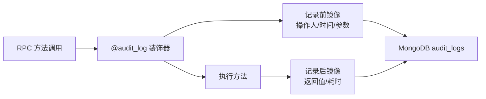

# YA-08-04: 预写审计日志 — @audit_log 装饰器 + MongoDB audit 集合 — 开发方案

> 来源 PRD：[04-需求-预写审计日志.md](../../prds/2026-08/04-需求-预写审计日志.md)
> 需求编号：YA-08-04 · 优先级：P0 · 人天：2.0d
> 类型：功能 · 状态：已完成

---

## 一、方案概述

通过 Python 装饰器 `@audit_log` 零侵入记录数据变更——装饰器在方法执行前后捕获参数和返回值，写入 MongoDB `audit_logs` 集合。



### 职责边界

| 组件 | 文件 | 职责 |
|------|------|------|
| 装饰器 | `domain/audit/decorator.py` | 方法包装、前后镜像捕获 |
| 日志器 | `domain/audit/logger.py` | 写入 MongoDB |
| 模型 | `domain/audit/models.py` | AuditLog Pydantic 模型 |
| 服务 | `services/audit/audit_service.py` | 审计查询 API |

---

## 二、文件清单

| 文件 | 职责 |
|------|------|
| `src/domain/audit/__init__.py` | 公开 `@audit_log` |
| `src/domain/audit/decorator.py` | 装饰器实现 |
| `src/domain/audit/logger.py` | MongoDB 持久化 |
| `src/domain/audit/models.py` | 审计日志数据模型 |
| `src/services/audit/audit_service.py` | 查询服务 |

---

## 三、数据模型

```python
class AuditLog:
    id: str
    operation: str        # "create" | "update" | "delete"
    module: str           # 模块名
    operator: str         # 操作人
    before: dict | None   # 变更前
    after: dict | None    # 变更后
    duration_ms: int      # 耗时
    timestamp: datetime
    success: bool         # 是否成功
```

---

## 四、实施步骤

| 步骤 | 内容 | 验证 | 人天 |
|------|------|------|------|
| 1 | `@audit_log` 装饰器实现 | 装饰方法后自动记录 | 0.5 |
| 2 | MongoDB 持久化 | `audit_logs` 集合写入 | 0.5 |
| 3 | 审计查询 API | 按时间/操作人/模块查询 | 0.5 |
| 4 | 集成到关键 RPC 方法 + 测试 | create/update/delete 均记录 | 0.5 |

**合计：2.0d**。

---

## 五、关联模块

- 依赖：[YA-08-15 数据访问层](./15-prd-task-数据访问层.md)
- 消费：[YA-09-09 审计日志查询](../2026-09/09-prd-task-审计日志.md)
- 下游：[YA-08-08 审计日志系统](./08-prd-task-预写审计日志系统.md)——扩展版

---

## 六、代码审查检查清单

- [x] `@audit_log` 装饰器支持同步和异步方法
- [x] 装饰器不修改方法返回值（透明代理）
- [x] 审计日志写入为异步非阻塞（`asyncio.create_task`）
- [x] 写入失败不影响主方法执行（审计日志丢失可接受，业务不可中断）
- [x] `before`/`after` 包含完整参数快照（含敏感字段脱敏标记）
- [x] `duration_ms` 从 `time.perf_counter()` 获取（高精度）
- [x] MongoDB `audit_logs` 集合 TTL 索引（默认 90 天自动归档）

---

## 七、技术风险

| 风险 | 概率 | 影响 | 缓解措施 | 应急预案 |
|------|------|------|---------|---------|
| 审计日志写入阻塞主流程 | 低 | 高 | `asyncio.create_task` 非阻塞写入 | 写入队列满时丢弃 |
| MongoDB 写入失败 | 中 | 中 | 捕获异常 + WARNING 日志，不中断业务 | 审计日志丢失（可接受） |
| 大参数快照 OOM | 低 | 中 | `before`/`after` 截断到 10KB | 超大参数标注 `[TRUNCATED]` |

---

## 八、实现完成记录

> **完成日期**：2026-08-15 · **复核日期**：2026-09-15

### 8.1 产出清单

| 分类 | 文件 | 说明 |
|------|------|------|
| 装饰器 | `domain/audit/decorator.py` | `@audit_log` 装饰器，支持同步/异步 |
| 日志器 | `domain/audit/logger.py` | MongoDB 异步持久化 |
| 模型 | `domain/audit/models.py` | AuditLog Pydantic 模型 |
| 服务 | `services/audit/audit_service.py` | 审计查询 API |
| **合计** | **4 个文件** | |

---

## 九、已知缺口与技术债

### 9.1 功能缺口

| # | 缺口 | 影响 | 建议 |
|---|------|------|------|
| 1 | 敏感字段自动脱敏 | 密码/Token 等敏感参数明文记录在审计日志中 | 装饰器增加 `@audit_log(mask_fields=["password"])` |
| 2 | 审计日志导出/归档 | 90 天 TTL 后日志丢失，合规场景需要长期保留 | 冷存储归档（S3/OSS） |

### 9.2 技术债

| # | 技术债 | 优先级 | 预计人天 | 说明 | 状态 |
|---|--------|--------|---------|------|------|
| 1 | 审计日志查询无分页 | P2 | 0.2 | `list_audit_logs` 一次性返回全部结果 | 待实施 |
| 2 | 写入队列无背压控制 | P3 | 0.2 | 高并发时 `create_task` 堆积 | 待实施（`asyncio.Queue` + 消费者） |

---