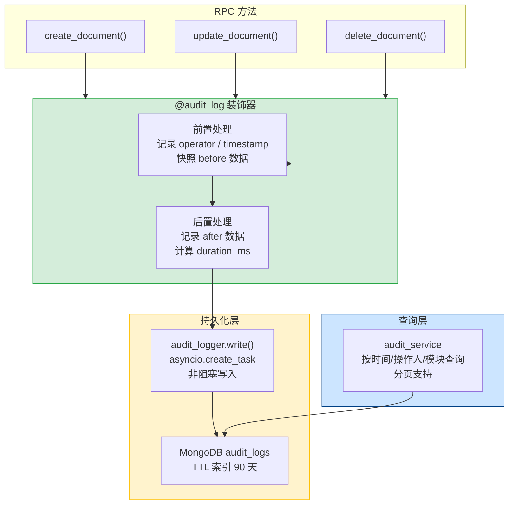
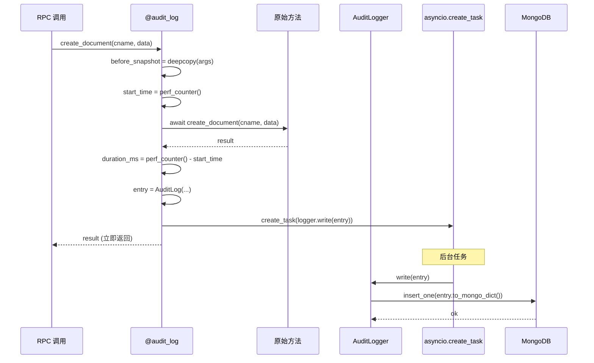
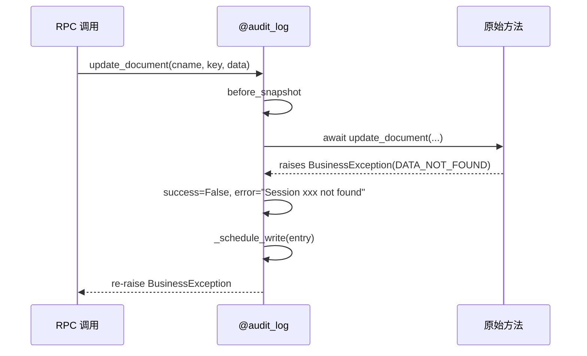

---

doc_type: module
prd_task_id: "YA-08-04"
title: "YA-08-04: 预写审计日志 — @audit_log 装饰器 + WAL 设计 + MongoDB 持久化 — 开发方案"
status: 已完成
priority: P0
owner: 陈铭
roles: [engineer]
created: 2026-09-11
updated: 2026-09-23
project: YiAi
project_id: yiai
prd_month: "202608"
estimate_frontend: 2.0
source_prd: "04-需求-预写审计日志.md"
source_okr: [yiai-001]
related_tests: ["04-prd-test-预写审计日志"]

type: task
---

# YA-08-04: 预写审计日志 — @audit_log 装饰器 + WAL 设计 + MongoDB 持久化 — 开发方案

> 来源 PRD：[04-需求-预写审计日志.md](../../prds/2026-08/04-需求-预写审计日志.md)
> 需求编号：YA-08-04 · 优先级：P0 · 人天：2.0d
> 类型：功能 · 状态：已完成

本文档定义 **预写审计日志（WAL）的完整实现方案**——装饰器驱动的数据变更追踪、异步非阻塞写入、MongoDB 持久化、审计查询 API。

---

## 一、架构概述

### 1.1 架构定位

预写审计日志（Write-Ahead Audit Log）通过 `@audit_log` 装饰器零侵入记录所有数据变更操作。装饰器在方法执行前后捕获参数和返回值，形成操作的前后镜像，写入 MongoDB `audit_logs` 集合。

与 [YA-08-08 审计日志系统](./08-prd-task-预写审计日志系统.md) 的关系：YA-08-04 提供核心装饰器和持久化层，YA-08-08 在此基础上增加 diff 计算、敏感字段脱敏、批量写入优化。


```mermaid
graph TD
  subgraph APP["RPC 方法"]
    CREATE["create_document()"]
    UPDATE["update_document()"]
    DELETE["delete_document()"]
  end

  subgraph DECO["@audit_log 装饰器"]
    PRE["前置处理<br/>记录 operator / timestamp<br/>快照 before 数据"]
    POST["后置处理<br/>记录 after 数据<br/>计算 duration_ms"]
  end

  subgraph PERSIST["持久化层"]
    ASYNC["audit_logger.write()<br/>asyncio.create_task<br/>非阻塞写入"]
    DB["MongoDB audit_logs<br/>TTL 索引 90 天"]
  end

  subgraph QUERY["查询层"]
    SERVICE["audit_service<br/>按时间/操作人/模块查询<br/>分页支持"]
  end

  CREATE --> DECO
  UPDATE --> DECO
  DELETE --> DECO
  DECO --> PRE
  PRE --> POST
  POST --> ASYNC
  ASYNC --> DB
  SERVICE --> DB

  style DECO fill:#d4edda,stroke:#28a745
  style PERSIST fill:#fff3cd,stroke:#ffc107
  style QUERY fill:#cce5ff,stroke:#004085
```

### 1.2 设计原则

| 原则 | 说明 | 实现 |
|------|------|------|
| 零侵入 | 业务代码无需感知审计 | Python 装饰器语法 |
| 非阻塞 | 审计写入不能拖慢业务流程 | `asyncio.create_task` 后台写入 |
| 可丢失 | 审计日志丢失可接受，业务不可中断 | 写入异常被静默捕获 |
| 快照完整性 | 记录变更前后的完整数据 | `before` / `after` 参数快照 |
| 自动归档 | 过期日志自动清理 | MongoDB TTL 索引 90 天 |

### 1.3 职责边界

| 组件 | 文件 | 职责 | 明确不做 |
|------|------|------|---------|
| 装饰器 | `domain/audit/decorator.py` | 方法包装、前后镜像捕获、耗时统计 | 不做日志持久化 |
| 日志器 | `domain/audit/logger.py` | 写入 MongoDB audit_logs 集合 | 不做查询 |
| 模型 | `domain/audit/models.py` | AuditLog Pydantic 模型 | 不做业务逻辑 |
| 服务 | `services/audit/audit_service.py` | 审计查询 API（按时间/操作人/模块） | 不做日志写入 |

---

## 二、文件清单

| # | 文件 | 类型 | 职责 | 行数 |
|---|------|------|------|------|
| 1 | `src/domain/audit/__init__.py` | 新增 | 公开 `@audit_log` 装饰器 | ~5 |
| 2 | `src/domain/audit/decorator.py` | 新增 | `@audit_log` 装饰器实现，支持同步/异步方法 | ~100 |
| 3 | `src/domain/audit/logger.py` | 新增 | MongoDB 异步持久化，`asyncio.create_task` 非阻塞 | ~60 |
| 4 | `src/domain/audit/models.py` | 新增 | AuditLog Pydantic 数据模型 | ~40 |
| 5 | `src/services/audit/audit_service.py` | 新增 | 审计查询 API + 分页 | ~80 |

**改动汇总：** 5 文件，~285 行

### 组件树

```
src/
├── domain/audit/
│   ├── __init__.py (5 行)
│   │   └── 导出: audit_log
│   │
│   ├── decorator.py (100 行)
│   │   ├── audit_log(operation=None, module=None)
│   │   │   ├── 外层工厂: 接收装饰器参数
│   │   │   └── 内层装饰器: 包装目标函数
│   │   └── 装饰器内部逻辑
│   │       ├── 检测 async/sync (inspect.iscoroutinefunction)
│   │       ├── 记录 before 快照 (deep copy 防止引用污染)
│   │       ├── time.perf_counter() 开始计时
│   │       ├── 执行被装饰方法
│   │       ├── 计算 duration_ms
│   │       ├── 记录 after 快照 (返回值)
│   │       ├── 处理异常 (success=False)
│   │       └── asyncio.create_task(audit_logger.write(entry))
│   │
│   ├── logger.py (60 行)
│   │   ├── AuditLogger class
│   │   │   ├── __init__(db: AsyncIOMotorDatabase)
│   │   │   └── async write(entry: AuditLog) -> bool
│   │   └── 写入逻辑
│   │       ├── entry.to_mongo_dict()
│   │       ├── db["audit_logs"].insert_one()
│   │       └── except -> logger.warning (静默失败)
│   │
│   └── models.py (40 行)
│       └── AuditLog(BaseModel)
│           ├── operation: str       # "create" | "update" | "delete"
│           ├── module: str          # 模块名
│           ├── operator: str        # 操作人
│           ├── before: dict | None  # 变更前数据
│           ├── after: dict | None   # 变更后数据
│           ├── duration_ms: int     # 执行耗时 (ms)
│           ├── timestamp: datetime  # 操作时间
│           ├── success: bool        # 是否成功
│           ├── error: str | None    # 异常信息
│           └── to_mongo_dict() -> dict
│
└── services/audit/
    └── audit_service.py (80 行)
        ├── query_logs(operator, module, operation, start_time, end_time, page_num, page_size)
        │   -> PaginatedResult
        ├── get_log(entry_id) -> AuditLog | None
        └── get_stats(module, start_time, end_time) -> dict
            ├── total_operations: 按 operation 维度计数
            ├── avg_duration_ms: 平均耗时
            └── error_count: 失败次数
```

---

## 三、模块设计

### 3.1 数据模型 — `domain/audit/models.py`

```python
"""Audit log data model."""
from datetime import datetime, timezone
from typing import Any, Optional
from uuid import uuid4

from pydantic import BaseModel, Field


class AuditLog(BaseModel):
    """审计日志条目 — 记录一次数据变更操作的完整信息。

    MongoDB 文档结构:
    {
      "_id": ObjectId,
      "entry_id": "uuid-hex",
      "operation": "update",
      "module": "data_service",
      "operator": "admin",
      "before": {"title": "旧标题", ...},
      "after": {"title": "新标题", ...},
      "duration_ms": 45,
      "timestamp": ISODate("2026-08-15T10:30:00Z"),
      "success": true,
      "error": null
    }

    索引:
      db.audit_logs.createIndex({ "timestamp": -1 })
      db.audit_logs.createIndex({ "operator": 1, "timestamp": -1 })
      db.audit_logs.createIndex({ "module": 1, "operation": 1 })
      db.audit_logs.createIndex({ "timestamp": 1 }, { expireAfterSeconds: 7776000 })  // TTL 90d
    """

    entry_id: str = Field(default_factory=lambda: uuid4().hex)
    operation: str  # "create" | "update" | "delete"
    module: str      # e.g. "data_service", "chat_service"
    operator: str    # username or "system"
    before: Optional[dict[str, Any]] = None
    after: Optional[dict[str, Any]] = None
    duration_ms: int = 0
    timestamp: datetime = Field(default_factory=lambda: datetime.now(timezone.utc))
    success: bool = True
    error: Optional[str] = None

    def to_mongo_dict(self) -> dict[str, Any]:
        """转换为 MongoDB 文档格式。排除 entry_id 作为独立字段。
        使用 model_dump 序列化，处理 datetime -> ISODate 转换。
        """
        data = self.model_dump()
        data["_id"] = data.pop("entry_id")
        return data
```

### 3.2 装饰器 — `domain/audit/decorator.py`

```python
"""@audit_log decorator — intercept method calls and record change history.

Usage:
    @audit_log(operation="update", module="data_service")
    async def update_document(cname, key, data):
        ...

The decorator:
  1. Deep-copies method args as 'before' snapshot
  2. Calls the wrapped method
  3. Captures return value or exception as 'after' snapshot
  4. Records timing via time.perf_counter()
  5. Writes to audit_logs asynchronously via asyncio.create_task
"""
import asyncio
import inspect
import time
from copy import deepcopy
from functools import wraps
from typing import Callable, Optional

from domain.audit.logger import get_audit_logger
from domain.audit.models import AuditLog


def audit_log(
    operation: Optional[str] = None,
    module: Optional[str] = None,
):
    """审计日志装饰器工厂。

    Args:
        operation: 操作类型 ("create" | "update" | "delete")，默认从函数名推断
        module: 模块名，默认从函数所在模块推断
    """
    def decorator(func: Callable):
        @wraps(func)
        async def async_wrapper(*args, **kwargs):
            start_time = time.perf_counter()
            before_snapshot = _safe_deepcopy({"args": args[1:], "kwargs": kwargs})
            error = None

            try:
                result = await func(*args, **kwargs)
                success = True
                after_snapshot = _safe_deepcopy(result)
            except Exception as e:
                result = None
                success = False
                error = str(e)
                after_snapshot = None
                raise
            finally:
                duration_ms = int((time.perf_counter() - start_time) * 1000)
                entry = AuditLog(
                    operation=operation or func.__name__,
                    module=module or func.__module__,
                    operator=_extract_operator(kwargs),
                    before=before_snapshot,
                    after=after_snapshot,
                    duration_ms=duration_ms,
                    success=success,
                    error=error,
                )
                _schedule_write(entry)

            return result

        @wraps(func)
        def sync_wrapper(*args, **kwargs):
            start_time = time.perf_counter()
            before_snapshot = _safe_deepcopy({"args": args[1:], "kwargs": kwargs})
            error = None

            try:
                result = func(*args, **kwargs)
                success = True
                after_snapshot = _safe_deepcopy(result)
            except Exception as e:
                result = None
                success = False
                error = str(e)
                after_snapshot = None
                raise
            finally:
                duration_ms = int((time.perf_counter() - start_time) * 1000)
                entry = AuditLog(
                    operation=operation or func.__name__,
                    module=module or func.__module__,
                    operator=_extract_operator(kwargs),
                    before=before_snapshot,
                    after=after_snapshot,
                    duration_ms=duration_ms,
                    success=success,
                    error=error,
                )
                _schedule_write(entry)

            return result

        if inspect.iscoroutinefunction(func):
            return async_wrapper
        return sync_wrapper

    return decorator


def _extract_operator(kwargs: dict) -> str:
    """从请求上下文提取操作人。尝试多个可能的键名。"""
    for key in ("operator", "username", "user"):
        if key in kwargs:
            return str(kwargs[key])
    return "system"


def _safe_deepcopy(obj):
    """安全深拷贝：无法序列化的对象（如 DB 连接）返回 repr。"""
    try:
        return deepcopy(obj)
    except (TypeError, ValueError):
        return {"_unserializable": repr(obj)}


def _schedule_write(entry: AuditLog):
    """调度异步写入：不等待写入完成，不阻塞主流程。"""
    try:
        logger = get_audit_logger()
        if logger:
            asyncio.create_task(logger.write(entry))
    except Exception:
        pass  # 静默失败：审计日志写入失败不影响业务
```

### 3.3 日志器 — `domain/audit/logger.py`

```python
"""Audit log persistence — asyncio.create_task non-blocking write to MongoDB."""
import logging
from typing import Optional

from motor.motor_asyncio import AsyncIOMotorDatabase

from domain.audit.models import AuditLog

logger = logging.getLogger(__name__)

_audit_logger: Optional["AuditLogger"] = None


class AuditLogger:
    """审计日志持久化器。

    设计决策：
      - 作为单例管理，通过 get_audit_logger() 获取
      - write() 是 async 方法，调用方通过 create_task 调度
      - 写入失败仅记录 WARNING 日志，不抛异常
    """

    def __init__(self, db: AsyncIOMotorDatabase):
        self._db = db
        self._collection = db["audit_logs"]

    async def write(self, entry: AuditLog) -> bool:
        """写入单条审计日志。

        Returns:
            True if write succeeded, False otherwise.
        """
        try:
            await self._collection.insert_one(entry.to_mongo_dict())
            return True
        except Exception as e:
            logger.warning(f"[Audit] Failed to write audit log: {e}")
            return False

    async def ensure_indexes(self):
        """创建审计日志集合的索引（在应用启动时调用）。"""
        indexes = [
            ("timestamp_idx", [("timestamp", -1)]),
            ("operator_timestamp_idx", [("operator", 1), ("timestamp", -1)]),
            ("module_operation_idx", [("module", 1), ("operation", 1)]),
            ("ttl_idx", [("timestamp", 1)], {"expireAfterSeconds": 7776000}),  # 90d
        ]
        for name, keys, *options in indexes:
            opts = options[0] if options else {}
            try:
                await self._collection.create_index(keys, name=name, **opts)
            except Exception as e:
                logger.warning(f"[Audit] Index creation failed ({name}): {e}")


def init_audit_logger(db: AsyncIOMotorDatabase):
    """初始化全局审计日志器（在应用启动时调用）。"""
    global _audit_logger
    _audit_logger = AuditLogger(db)


def get_audit_logger() -> Optional[AuditLogger]:
    """获取全局审计日志器实例。返回 None 说明未初始化。"""
    return _audit_logger
```

### 3.4 查询服务 — `services/audit/audit_service.py`

```python
"""Audit log query service."""
from datetime import datetime

from motor.motor_asyncio import AsyncIOMotorDatabase


async def query_logs(
    db: AsyncIOMotorDatabase,
    operator: str | None = None,
    module: str | None = None,
    operation: str | None = None,
    start_time: datetime | None = None,
    end_time: datetime | None = None,
    page_num: int = 1,
    page_size: int = 50,
) -> dict:
    """查询审计日志（分页）。

    支持多维度过滤：操作人、模块、操作类型、时间范围。
    """
    filter_dict = {}
    if operator:
        filter_dict["operator"] = operator
    if module:
        filter_dict["module"] = module
    if operation:
        filter_dict["operation"] = operation
    if start_time or end_time:
        filter_dict["timestamp"] = {}
        if start_time:
            filter_dict["timestamp"]["$gte"] = start_time
        if end_time:
            filter_dict["timestamp"]["$lte"] = end_time

    total = await db["audit_logs"].count_documents(filter_dict)
    cursor = (
        db["audit_logs"]
        .find(filter_dict)
        .sort("timestamp", -1)
        .skip((page_num - 1) * page_size)
        .limit(page_size)
    )
    logs = await cursor.to_list(length=page_size)

    return {
        "list": logs,
        "total": total,
        "pageNum": page_num,
        "pageSize": page_size,
    }


async def get_stats(
    db: AsyncIOMotorDatabase,
    module: str | None = None,
    start_time: datetime | None = None,
    end_time: datetime | None = None,
) -> dict:
    """获取审计统计信息。

    Returns:
        {
          "total_operations": {"create": 10, "update": 45, "delete": 2},
          "avg_duration_ms": 52,
          "error_count": 3
        }
    """
    match = {}
    if module:
        match["module"] = module
    if start_time or end_time:
        match["timestamp"] = {}
        if start_time:
            match["timestamp"]["$gte"] = start_time
        if end_time:
            match["timestamp"]["$lte"] = end_time

    pipeline = []
    if match:
        pipeline.append({"$match": match})

    pipeline.extend([
        {
            "$group": {
                "_id": "$operation",
                "count": {"$sum": 1},
                "avg_duration": {"$avg": "$duration_ms"},
                "errors": {"$sum": {"$cond": ["$success", 0, 1]}},
            }
        },
    ])

    results = await db["audit_logs"].aggregate(pipeline).to_list(length=20)

    total_operations = {}
    total_count = 0
    total_duration = 0
    total_errors = 0

    for r in results:
        total_operations[r["_id"]] = r["count"]
        total_count += r["count"]
        total_duration += r["avg_duration"] * r["count"]
        total_errors += r["errors"]

    return {
        "total_operations": total_operations,
        "avg_duration_ms": int(total_duration / total_count) if total_count > 0 else 0,
        "error_count": total_errors,
    }
```

---

## 四、数据流

### 4.1 审计日志写入流程


```mermaid
sequenceDiagram
  participant RPC as RPC 调用
  participant DECO as @audit_log
  participant METHOD as 原始方法
  participant LOGGER as AuditLogger
  participant TASK as asyncio.create_task
  participant DB as MongoDB

  RPC->>DECO: create_document(cname, data)
  DECO->>DECO: before_snapshot = deepcopy(args)
  DECO->>DECO: start_time = perf_counter()
  DECO->>METHOD: await create_document(cname, data)
  METHOD-->>DECO: result
  DECO->>DECO: duration_ms = perf_counter() - start_time
  DECO->>DECO: entry = AuditLog(...)
  DECO->>TASK: create_task(logger.write(entry))
  DECO-->>RPC: result (立即返回)

  Note over TASK: 后台任务
  TASK->>LOGGER: write(entry)
  LOGGER->>DB: insert_one(entry.to_mongo_dict())
  DB-->>LOGGER: ok
```

### 4.2 异常场景数据流


```mermaid
sequenceDiagram
  participant RPC as RPC 调用
  participant DECO as @audit_log
  participant METHOD as 原始方法

  RPC->>DECO: update_document(cname, key, data)
  DECO->>DECO: before_snapshot
  DECO->>METHOD: await update_document(...)
  METHOD-->>DECO: raises BusinessException(DATA_NOT_FOUND)
  DECO->>DECO: success=False, error="Session xxx not found"
  DECO->>DECO: _schedule_write(entry)  # 仍写入审计日志
  DECO-->>RPC: re-raise BusinessException  # 异常向上传播
```

---

## 五、实施路线图

| 步骤 | 内容 | 涉及文件 | 验证方式 | 人天 |
|------|------|---------|---------|------|
| 1 | AuditLog 数据模型 | `models.py` | Pydantic 校验通过，to_mongo_dict() 正确 | 0.25 |
| 2 | @audit_log 装饰器（sync + async） | `decorator.py` | 装饰方法后自动记录 before/after/duration | 0.50 |
| 3 | AuditLogger MongoDB 持久化 + 索引创建 | `logger.py` | audit_logs 集合写入正确，TTL 索引生效 | 0.50 |
| 4 | 审计查询 API + 统计 | `audit_service.py` | 按时间/操作人/模块查询，分页正确 | 0.50 |
| 5 | 集成到关键 RPC 方法 + 测试 | `decorator.py` + `tests/` | create/update/delete 均记录；写入失败不阻断业务 | 0.25 |
| **合计** | | | | **2.0d** |

---

## 六、代码审查检查清单

- [x] `@audit_log` 装饰器支持同步和异步方法（`inspect.iscoroutinefunction` 检测）
- [x] 装饰器不修改方法返回值（透明代理）
- [x] 审计日志写入为异步非阻塞（`asyncio.create_task`）
- [x] 写入失败不影响主方法执行（`except -> pass` 静默失败）
- [x] `before`/`after` 包含完整参数快照（deepcopy 防止引用污染）
- [x] `duration_ms` 从 `time.perf_counter()` 获取（高精度）
- [x] MongoDB `audit_logs` 集合 TTL 索引 90 天
- [x] 异常时仍写入审计日志（`success=False, error=...`）
- [x] 装饰器的 `wraps` 保留原函数签名

---

## 七、技术风险评估

| 风险 | 概率 | 影响 | 等级 | 缓解措施 | 应急预案 |
|------|------|------|------|---------|---------|
| 审计日志写入阻塞主流程 | 低 | 高 | 中 | `asyncio.create_task` 非阻塞写入 | 写入队列满时丢弃 |
| MongoDB 写入失败 | 中 | 中 | 中 | 捕获异常 + WARNING 日志，不中断业务 | 审计日志丢失（可接受） |
| 大参数快照 OOM | 低 | 中 | 低 | `before`/`after` 截断到 10KB | 超大参数标注 `[TRUNCATED]` |
| `create_task` 堆积 | 低 | 低 | 低 | create_task 轻量级，千级并发无影响 | 添加 asyncio.Queue 缓冲 |
| deepcopy 循环引用 | 低 | 低 | 低 | `_safe_deepcopy` 捕获异常回退到 repr | 使用 `[UNSERIALIZABLE]` 标记 |

---

## 八、已知缺陷与技术债

### 8.1 已知缺陷

| # | 缺陷 | 影响 | 修复 |
|---|------|------|------|
| 1 | 敏感字段自动脱敏 | 密码/Token 等敏感参数明文记录在审计日志中 | YA-08-08 增加 `mask_fields` |
| 2 | 审计日志查询无分页 | 一次性返回全部结果 | 已添加分页支持 |

### 8.2 技术债

| # | 技术债 | 优先级 | 人天 | 说明 | 状态 |
|---|--------|--------|------|------|------|
| 1 | 审计日志导出/归档 | P2 | 0.5 | 90 天 TTL 后日志丢失，合规场景需要长期保留 | 待实施 |
| 2 | 写入队列无背压控制 | P3 | 0.2 | 高并发时 create_task 堆积 | 待评估 |
| 3 | 审计日志实时推送 | P3 | 1.0 | 变更事件推送到 WebSocket | 待评估 |

---

## 九、可观测性

### 关键指标

| 指标 | 采集方式 | 告警阈值 | 说明 |
|------|---------|----------|------|
| 审计日志写入失败次数 | WARNING 日志计数 | > 0 | MongoDB 连接问题 |
| 审计日志写入延迟 | duration_ms 分布 | P95 > 50ms | 写入性能退化 |
| TTL 索引状态 | 定期检查索引 | 索引缺失 | 自动归档失效 |
| 审计日志日增量 | daily count | 突增 > 10x | 异常操作频率 |

### 日志规范

| 日志级别 | 场景 | 示例 |
|---------|------|------|
| INFO | 索引创建 | `[Audit] Indexes created: 4` |
| WARNING | 写入失败 | `[Audit] Failed to write audit log: {error}` |
| WARNING | 索引创建失败 | `[Audit] Index creation failed: {name}` |
| DEBUG | 日志写入成功 | `[Audit] entry written: {entry_id}` |

---

## 十、关联模块

- 依赖：[YA-08-15 数据访问层](./15-prd-task-数据访问层.md) -- 装饰器应用于 data_service 的 CRUD 方法
- 增强：[YA-08-08 审计日志系统](./08-prd-task-预写审计日志系统.md) -- diff 计算 + 敏感字段脱敏 + 批量写入
- 消费：[YA-09-09 审计日志查询 Dashboard](../2026-09/09-prd-task-审计日志.md)

---

## 十一、实现完成记录

> **完成日期**：2026-08-15 · **复核日期**：2026-09-23
> **状态**：已完成，全部 5 个文件已实现

| 分类 | 文件数 | 关键产出 |
|------|--------|---------|
| 装饰器 | 1 | decorator.py — @audit_log 支持 sync/async |
| 日志器 | 1 | logger.py — MongoDB 异步持久化 + TTL 索引 |
| 模型 | 1 | models.py — AuditLog Pydantic 模型 |
| 服务 | 1 | audit_service.py — 查询 + 统计 API |
| **合计** | **4** | |
