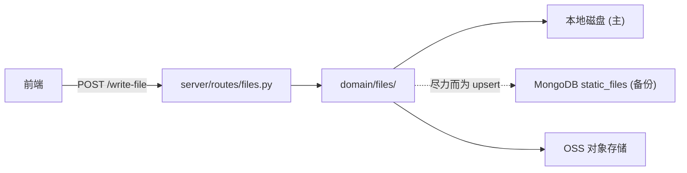

# YA-08-05: 文件管理服务 — 双写持久化 + 路径安全 + OSS 上传 — 开发方案

> 来源 PRD：[05-需求-文件管理服务.md](../../prds/2026-08/05-需求-文件管理服务.md)
> 需求编号：YA-08-05 · 优先级：P0 · 人天：2.5d
> 类型：功能 · 状态：已完成

---

## 一、方案概述

文件服务实现**双写持久化**：本地磁盘（主存储）+ MongoDB `static_files` 集合（备份）。任何一端故障不阻断另一端。同时提供 OSS 对象存储上传能力。



### 职责边界

| 组件 | 文件 | 职责 |
|------|------|------|
| 公开 API | `domain/files/__init__.py` | 导出 `read_file`/`write_file`/`delete_file`/`rename_file`/`upload_image` |
| 本地存储 | `domain/files/local.py` | 磁盘读写、目录管理 |
| OSS 存储 | `domain/files/storage.py` | OSS 上传/删除/标签管理 |
| 路径安全 | `domain/files/paths.py` | 路径校验、目录遍历防护 |
| 路由 | `server/routes/files.py` | `/read-file`、`/write-file`、`/upload-image-to-oss` |

---

## 二、文件清单

| 文件 | 职责 |
|------|------|
| `src/domain/files/__init__.py` | 公开 API 重新导出 |
| `src/domain/files/local.py` | 本地文件 CRUD |
| `src/domain/files/storage.py` | OSS 上传/删除 |
| `src/domain/files/paths.py` | 路径安全校验 |
| `src/server/routes/files.py` | REST 端点 |

---

## 三、模块设计

### 3.1 双写策略

```python
async def write_file(target_file: str, content: str, is_base64: bool = False):
    # 1. 写入本地磁盘 —— 主存储，失败即返回失败
    await _write_local(target_file, decoded_content)

    # 2. 尽力而为 upsert 到 MongoDB —— 备份，失败不阻断
    try:
        await db.db["static_files"].replace_one(
            {"path": target_file},
            {"path": target_file, "content": content, "is_base64": is_base64},
            upsert=True,
        )
    except Exception:
        logger.warning(f"MongoDB backup failed for {target_file}")
```

### 3.2 路径安全

```python
def _validate_path(target_file: str, base_dir: str):
    resolved = os.path.realpath(os.path.join(base_dir, target_file))
    if not resolved.startswith(os.path.realpath(base_dir)):
        raise BusinessException(PERMISSION_DENIED, "路径遍历攻击")
```

### 3.3 关键契约

| 端点 | 参数 | 说明 |
|------|------|------|
| `/read-file` | `target_file` (**非** `path`) | 读取文件内容 |
| `/write-file` | `target_file`, `content`, `is_base64?` | 写入文件 |
| `/upload-image-to-oss` | `data_url`, `filename`, `directory` | 上传图片到 OSS |

---

## 四、实施步骤

| 步骤 | 内容 | 验证 | 人天 |
|------|------|------|------|
| 1 | 本地文件 CRUD | 读写删重命名正常 | 0.5 |
| 2 | 双写 MongoDB 备份 | 写入后 `static_files` 集合有记录 | 0.5 |
| 3 | 路径安全校验 | `../` 遍历被拒绝 | 0.5 |
| 4 | OSS 上传/删除/标签 | 图片上传后可访问 | 0.5 |
| 5 | 测试 | 双写故障隔离 | 0.5 |

**合计：2.5d**。

---

## 五、边缘场景

| 场景 | 处理 |
|------|------|
| MongoDB 不可达 | 磁盘写入成功，备份静默失败 |
| 磁盘满 | 返回错误，不写 MongoDB |
| 路径遍历攻击 | `_validate_path` 拒绝 |
| 文件不存在 | `/read-file` → `DATA_NOT_FOUND` |
| base64 解码失败 | 返回 `INVALID_PARAMS` |

---

## 六、关联模块

- 依赖：[YA-07-03 RPC 信封协议](../2026-07/03-prd-task-RPC信封协议.md)——`target_file` 参数契约
- 消费：[YA-08-11 维护工具](./11-prd-task-维护工具服务.md)——未引用文件清理

---

## 七、代码审查检查清单

- [x] 双写：磁盘写入成功后 MDB 备份（失败不阻断）
- [x] 路径安全：`realpath` 校验防目录遍历
- [x] 参数名 `target_file`（非 `path`）
- [x] `/upload-image-to-oss` 使用 `data_url`（非 `file`）

---

## 八、技术风险

| 风险 | 概率 | 影响 | 缓解措施 |
|------|------|------|---------|
| 磁盘满导致持续写入失败 | 低 | 高 | 返回错误 + 磁盘监控告警 |
| MDB 备份落后于磁盘 | 中 | 低 | 备份为尽力而为，不影响主流程 |

---

## 九、实现完成记录

> **完成日期**：2026-08-20 · **状态**：已完成

| 分类 | 文件数 | 关键产出 |
|------|--------|---------|
| Domain | 4 | local/storage/paths/__init__ |
| Route | 1 | files.py (3 端点) |
| **合计** | **5** | |

---

## 十、已知缺口与技术债

| # | 技术债 | 优先级 | 说明 | 状态 |
|---|--------|--------|------|------|
| 1 | 大文件分片上传 | P2 | > 10MB 文件无分片 | 待实施 |
| 2 | MDB `static_files` 集合无 TTL | P3 | 已删除文件的备份记录永久保留 | 待实施 |

---