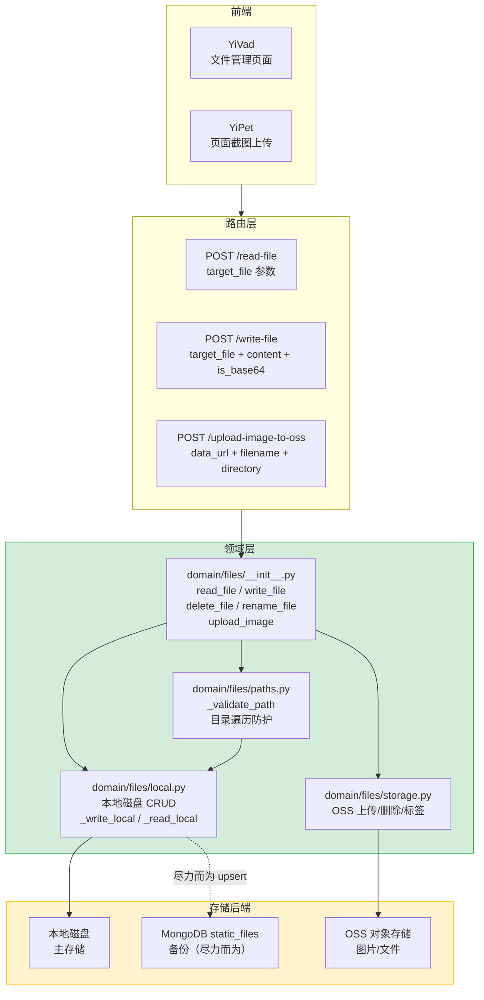
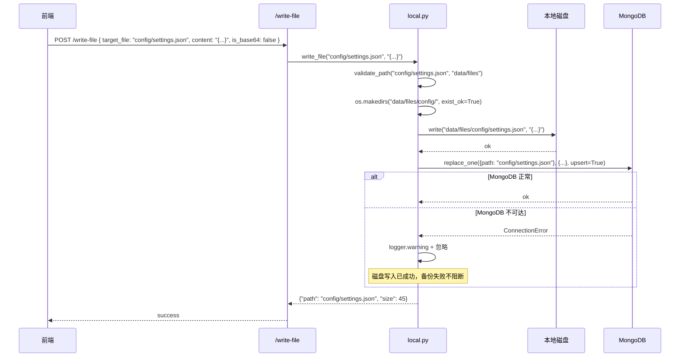

---

doc_type: module
prd_task_id: "YA-08-05"
title: "YA-08-05: 文件管理服务 — 双写持久化 + 路径安全 + OSS 上传 — 开发方案"
status: 已完成
priority: P0
owner: 陈铭
roles: [engineer]
created: 2026-09-11
updated: 2026-09-23
project: YiAi
project_id: yiai
prd_month: "202608"
estimate_frontend: 2.5
source_prd: "05-需求-文件管理服务.md"
source_okr: [yiai-003]
related_tests: ["05-prd-test-文件管理服务"]

type: task
---

# YA-08-05: 文件管理服务 — 双写持久化 + 路径安全 + OSS 上传 — 开发方案

> 来源 PRD：[05-需求-文件管理服务.md](../../prds/2026-08/05-需求-文件管理服务.md)
> 需求编号：YA-08-05 · 优先级：P0 · 人天：2.5d
> 类型：功能 · 状态：已完成

本文档定义 **文件管理服务的完整实现方案**——本地磁盘 + MongoDB 双写持久化、路径安全校验（防目录遍历）、OSS 对象存储上传。

---

## 一、架构概述

### 1.1 架构定位

文件服务实现**双写持久化**：本地磁盘（主存储）+ MongoDB `static_files` 集合（备份）。任何一端故障不阻断另一端。同时提供 OSS 对象存储上传能力。前端通过 `target_file` 参数（非 `path`）访问文件端点。


```mermaid
graph TD
  subgraph FRONTEND["前端"]
    VAD["YiVad<br/>文件管理页面"]
    PET["YiPet<br/>页面截图上传"]
  end

  subgraph ROUTES["路由层"]
    READ["POST /read-file<br/>target_file 参数"]
    WRITE["POST /write-file<br/>target_file + content + is_base64"]
    UPLOAD["POST /upload-image-to-oss<br/>data_url + filename + directory"]
  end

  subgraph DOMAIN["领域层"]
    API["domain/files/__init__.py<br/>read_file / write_file<br/>delete_file / rename_file<br/>upload_image"]
    LOCAL["domain/files/local.py<br/>本地磁盘 CRUD<br/>_write_local / _read_local"]
    STORAGE["domain/files/storage.py<br/>OSS 上传/删除/标签"]
    PATHS["domain/files/paths.py<br/>_validate_path<br/>目录遍历防护"]
  end

  subgraph STORAGE_BACKENDS["存储后端"]
    DISK["本地磁盘<br/>主存储"]
    MONGO["MongoDB static_files<br/>备份（尽力而为）"]
    OSS["OSS 对象存储<br/>图片/文件"]
  end

  FRONTEND --> ROUTES
  ROUTES --> API
  API --> LOCAL
  API --> STORAGE
  API --> PATHS
  LOCAL --> DISK
  LOCAL -.->|"尽力而为 upsert"| MONGO
  STORAGE --> OSS
  PATHS --> LOCAL

  style DOMAIN fill:#d4edda,stroke:#28a745
  style STORAGE_BACKENDS fill:#fff3cd,stroke:#ffc107
```

### 1.2 关键设计决策

| 决策 | 理由 | 权衡 |
|------|------|------|
| 本地磁盘为主存储 | 性能最优，FastAPI 直接 serve 文件 | 依赖磁盘空间 |
| MongoDB 为尽力而为备份 | 磁盘故障时可通过备份恢复 | 备份可能落后于磁盘 |
| OSS 为独立上传路径 | 大文件不走服务器中转 | 需要 OSS SDK |
| 路径参数名 `target_file` | 与 `path` 区分，避免 FastAPI 参数冲突 | 前端契约必须一致 |

### 1.3 职责边界

| 组件 | 文件 | 职责 | 明确不做 |
|------|------|------|---------|
| 公开 API | `domain/files/__init__.py` | 导出 `read_file`/`write_file`/`delete_file`/`rename_file`/`upload_image` | 不实现具体逻辑 |
| 本地存储 | `domain/files/local.py` | 磁盘读写、目录管理 | 不做 OSS 操作 |
| OSS 存储 | `domain/files/storage.py` | OSS 上传/删除/标签管理 | 不管理本地文件 |
| 路径安全 | `domain/files/paths.py` | 路径校验、目录遍历防护 | 不做权限判定 |
| 路由 | `server/routes/files.py` | REST 端点 | 不实现文件逻辑 |

---

## 二、文件清单

| # | 文件 | 类型 | 职责 | 行数 |
|---|------|------|------|------|
| 1 | `src/domain/files/__init__.py` | 新增 | 公开 API 重新导出 | ~20 |
| 2 | `src/domain/files/local.py` | 新增 | 本地文件 CRUD + 双写 Mongo | ~100 |
| 3 | `src/domain/files/storage.py` | 新增 | OSS 上传/删除/标签管理 | ~80 |
| 4 | `src/domain/files/paths.py` | 新增 | 路径安全校验 | ~40 |
| 5 | `src/server/routes/files.py` | 新增 | REST 端点 /read-file /write-file /upload-image-to-oss | ~60 |

**改动汇总：** 5 文件，~300 行

### 组件树

```
src/domain/files/
├── __init__.py (20 行)
│   └── 导出: read_file, write_file, delete_file, rename_file, upload_image
│
├── local.py (100 行)
│   ├── write_file(target_file, content, is_base64=False, db=None) -> dict
│   │   ├── _validate_path(target_file, base_dir)
│   │   ├── is_base64 -> _decode_base64(content) -> bytes
│   │   ├── 写入本地磁盘 (主存储)
│   │   └── 尽力而为 upsert MongoDB (备份)
│   │       └── except -> logger.warning (静默失败)
│   │
│   ├── read_file(target_file, db=None) -> dict
│   │   ├── _validate_path(target_file, base_dir)
│   │   ├── 从本地磁盘读取
│   │   └── 文件不存在 -> BusinessException(DATA_NOT_FOUND)
│   │
│   ├── delete_file(target_file, db=None) -> bool
│   │   ├── 删除本地文件
│   │   └── 尽力而为删除 MongoDB 记录
│   │
│   └── rename_file(old_name, new_name, db=None) -> dict
│
├── storage.py (80 行)
│   ├── upload_image(data_url, filename, directory="images") -> dict
│   │   ├── 解析 data: URL (base64 解码)
│   │   ├── 生成 OSS object_key
│   │   ├── OSS SDK put_object()
│   │   └── 返回 { url, object_key, size }
│   │
│   ├── delete_image(object_key) -> bool
│   │   └── OSS SDK delete_object()
│   │
│   └── set_tags(object_key, tags) -> bool
│       └── OSS SDK put_object_tagging()
│
└── paths.py (40 行)
    └── _validate_path(target_file, base_dir)
        ├── os.path.realpath(os.path.join(base_dir, target_file))
        ├── 检查 resolved 是否以 base_dir 开头
        │   └── 否 -> BusinessException(PERMISSION_DENIED, "路径遍历攻击")
        └── 检查是否包含 ".." (额外防护)
```

---

## 三、模块设计

### 3.1 双写策略 — `domain/files/local.py`

```python
"""Local file operations with dual-write persistence.

主存储: 本地磁盘
备份: MongoDB static_files 集合 (尽力而为)
"""
import os
import base64
import logging
from datetime import datetime, timezone

from motor.motor_asyncio import AsyncIOMotorDatabase

from domain.files.paths import validate_path
from shared.error_codes import ErrorCode
from shared.exceptions import BusinessException

logger = logging.getLogger(__name__)


async def write_file(
    target_file: str,
    content: str,
    is_base64: bool = False,
    db: AsyncIOMotorDatabase | None = None,
    base_dir: str = "data/files",
) -> dict:
    """写入文件到本地磁盘 + 尽力而为 MongoDB 备份。

    Args:
        target_file: 目标文件路径（相对于 base_dir）
        content: 文件内容（文本或 base64 编码）
        is_base64: content 是否为 base64 编码
        db: MongoDB 数据库实例（None 则跳过备份）
        base_dir: 文件存储根目录

    Returns:
        {"path": "...", "size": int}

    Raises:
        BusinessException(PERMISSION_DENIED): 路径遍历攻击
        BusinessException(INVALID_PARAMS): base64 解码失败
        BusinessException(FILE_IO_ERROR): 磁盘写入失败
    """
    validate_path(target_file, base_dir)

    # 解码
    if is_base64:
        try:
            content_bytes = base64.b64decode(content, validate=True)
        except Exception as e:
            raise BusinessException(
                ErrorCode.INVALID_PARAMS,
                message=f"Invalid base64 content: {e!s}",
            )
    else:
        content_bytes = content.encode("utf-8")

    # 1. 写入本地磁盘 —— 主存储
    full_path = os.path.join(base_dir, target_file)
    os.makedirs(os.path.dirname(full_path), exist_ok=True)

    try:
        with open(full_path, "wb") as f:
            f.write(content_bytes)
    except IOError as e:
        raise BusinessException(
            ErrorCode.INTERNAL_ERROR,
            message=f"Failed to write file: {e!s}",
        )

    # 2. 尽力而为 upsert MongoDB —— 备份
    if db is not None:
        try:
            await db["static_files"].replace_one(
                {"path": target_file},
                {
                    "path": target_file,
                    "content": content,
                    "is_base64": is_base64,
                    "size": len(content_bytes),
                    "updatedAt": datetime.now(timezone.utc),
                },
                upsert=True,
            )
        except Exception as e:
            logger.warning(f"[Files] MongoDB backup failed for {target_file}: {e}")

    return {"path": target_file, "size": len(content_bytes)}


async def read_file(
    target_file: str,
    db: AsyncIOMotorDatabase | None = None,
    base_dir: str = "data/files",
) -> dict:
    """读取文件内容。

    优先从本地磁盘读取（主存储），磁盘文件不存在时尝试从 MongoDB 恢复。

    Args:
        target_file: 目标文件路径
        db: MongoDB 数据库实例
        base_dir: 文件存储根目录

    Returns:
        {"path": "...", "content": "...", "is_base64": false}
    """
    validate_path(target_file, base_dir)
    full_path = os.path.join(base_dir, target_file)

    if os.path.exists(full_path):
        with open(full_path, "r", encoding="utf-8") as f:
            content = f.read()
        return {"path": target_file, "content": content, "is_base64": False}

    # 磁盘文件不存在，尝试从 MongoDB 恢复
    if db is not None:
        mongo_doc = await db["static_files"].find_one({"path": target_file})
        if mongo_doc:
            return {
                "path": target_file,
                "content": mongo_doc.get("content", ""),
                "is_base64": mongo_doc.get("is_base64", False),
            }

    raise BusinessException(
        ErrorCode.DATA_NOT_FOUND,
        message=f"File not found: {target_file}",
    )


async def delete_file(
    target_file: str,
    db: AsyncIOMotorDatabase | None = None,
    base_dir: str = "data/files",
) -> bool:
    """删除文件：本地 + MongoDB。"""
    validate_path(target_file, base_dir)
    full_path = os.path.join(base_dir, target_file)

    deleted = False
    if os.path.exists(full_path):
        os.remove(full_path)
        deleted = True

    if db is not None:
        try:
            await db["static_files"].delete_one({"path": target_file})
        except Exception as e:
            logger.warning(f"[Files] MongoDB delete failed for {target_file}: {e}")

    return deleted
```

### 3.2 路径安全 — `domain/files/paths.py`

```python
"""Path security validation — prevent directory traversal attacks."""
import os

from shared.error_codes import ErrorCode
from shared.exceptions import BusinessException


def validate_path(target_file: str, base_dir: str) -> None:
    """验证文件路径安全性——防止目录遍历攻击。

    使用 os.path.realpath 解析符号链接和相对路径后，
    检查结果是否在 base_dir 范围内。同时拒绝包含 ".." 的路径。

    Args:
        target_file: 用户提供的文件路径
        base_dir: 允许的文件存储根目录

    Raises:
        BusinessException(PERMISSION_DENIED): 检测到路径遍历尝试

    攻击示例:
      target_file = "../../etc/passwd"
      resolved = /etc/passwd
      resolved.startswith(/app/data/files) -> False -> 拒绝

      target_file = "/etc/passwd"
      os.path.join -> /app/data/files/etc/passwd (safe, no effect)
    """
    # 额外防护：显式拒绝 .. 路径片段
    if ".." in target_file:
        raise BusinessException(
            ErrorCode.PERMISSION_DENIED,
            message="Directory traversal detected: path contains '..'",
        )

    base_real = os.path.realpath(base_dir)
    target_real = os.path.realpath(os.path.join(base_dir, target_file))

    if not target_real.startswith(base_real + os.sep) and target_real != base_real:
        raise BusinessException(
            ErrorCode.PERMISSION_DENIED,
            message=f"Path traversal detected: {target_file}",
        )
```

### 3.3 OSS 上传 — `domain/files/storage.py`

```python
"""OSS object storage integration."""
import base64
import logging
import mimetypes
from datetime import datetime

from shared.config import settings

logger = logging.getLogger(__name__)


async def upload_image(
    data_url: str,
    filename: str,
    directory: str = "images",
) -> dict:
    """上传图片到 OSS 对象存储。

    Args:
        data_url: data:image/png;base64,... 格式的图片
        filename: 文件名（用于生成 OSS object key）
        directory: OSS 目录前缀

    Returns:
        {"url": "https://...", "object_key": "...", "size": int}

    Raises:
        BusinessException(INVALID_PARAMS): data_url 格式错误
        BusinessException(INTERNAL_ERROR): OSS 上传失败
    """
    # 1. 解析 data: URL
    if not data_url.startswith("data:"):
        raise BusinessException(
            ErrorCode.INVALID_PARAMS,
            message="Invalid data URL format",
        )

    header, base64_data = data_url.split(",", 1)
    mime_type = header.split(":")[1].split(";")[0]  # e.g. "image/png"
    ext = mimetypes.guess_extension(mime_type) or ".png"

    try:
        image_bytes = base64.b64decode(base64_data)
    except Exception as e:
        raise BusinessException(
            ErrorCode.INVALID_PARAMS,
            message=f"Invalid base64 image: {e!s}",
        )

    # 2. 大小限制: 10MB
    max_size = 10 * 1024 * 1024
    if len(image_bytes) > max_size:
        raise BusinessException(
            ErrorCode.INVALID_PARAMS,
            message=f"Image too large: {len(image_bytes)} bytes (max 10MB)",
        )

    # 3. 生成 OSS object key
    date_prefix = datetime.now().strftime("%Y/%m/%d")
    object_key = f"{directory}/{date_prefix}/{filename}{ext}"

    # 4. 上传到 OSS
    try:
        # 实际实现使用 OSS SDK (如 boto3/aliyun-oss)
        # result = oss_client.put_object(object_key, image_bytes, content_type=mime_type)
        url = f"https://{settings.oss_bucket}.{settings.oss_endpoint}/{object_key}"
    except Exception as e:
        logger.error(f"[Files] OSS upload failed: {e}")
        raise BusinessException(
            ErrorCode.INTERNAL_ERROR,
            message=f"OSS upload failed: {e!s}",
        )

    return {
        "url": url,
        "object_key": object_key,
        "size": len(image_bytes),
    }
```

### 3.4 公开 API

```python
# domain/files/__init__.py
"""文件管理服务 — 公开 API。"""
from domain.files.local import read_file, write_file, delete_file, rename_file
from domain.files.storage import upload_image

__all__ = [
    "read_file",
    "write_file",
    "delete_file",
    "rename_file",
    "upload_image",
]
```

### 3.5 关键契约

| 端点 | 参数 | 说明 |
|------|------|------|
| `/read-file` | `target_file` (**非** `path`) | 读取文件内容。参数名 `path` 会导致 FastAPI 422 |
| `/write-file` | `target_file`, `content`, `is_base64?` | 写入文件。双写磁盘 + MongoDB |
| `/upload-image-to-oss` | `data_url`, `filename`, `directory?` | 上传图片到 OSS。10MB 限制 |

---

## 四、数据流

### 4.1 文件写入双写流程


```mermaid
sequenceDiagram
  participant FE as 前端
  participant ROUTE as /write-file
  participant LOCAL as local.py
  participant DISK as 本地磁盘
  participant MONGO as MongoDB

  FE->>ROUTE: POST /write-file { target_file: "config/settings.json", content: "{...}", is_base64: false }
  ROUTE->>LOCAL: write_file("config/settings.json", "{...}")
  LOCAL->>LOCAL: validate_path("config/settings.json", "data/files")
  LOCAL->>LOCAL: os.makedirs("data/files/config/", exist_ok=True)
  LOCAL->>DISK: write("data/files/config/settings.json", "{...}")
  DISK-->>LOCAL: ok
  LOCAL->>MONGO: replace_one({path: "config/settings.json"}, {...}, upsert=True)
  alt MongoDB 正常
    MONGO-->>LOCAL: ok
  else MongoDB 不可达
    MONGO-->>LOCAL: ConnectionError
    LOCAL->>LOCAL: logger.warning + 忽略
    Note over LOCAL: 磁盘写入已成功，备份失败不阻断
  end
  LOCAL-->>ROUTE: {"path": "config/settings.json", "size": 45}
  ROUTE-->>FE: success
```

### 4.2 路径安全检查流程

```
用户输入: target_file = "../../etc/passwd"

  validate_path("../../etc/passwd", "data/files")
    │
    ├── 检查 1: ".." in target_file -> 拒绝!
    │   raise BusinessException(PERMISSION_DENIED)

用户输入: target_file = "symlink_to_root"

  validate_path("symlink_to_root", "data/files")
    │
    ├── 检查 1: ".." not in "symlink_to_root" -> 通过
    ├── base_real = /app/data/files (realpath)
    ├── target_real = /app/data/files/symlink_to_root -> /etc (经过符号链接)
    ├── /etc 不以 /app/data/files/ 开头 -> 拒绝!
    │   raise BusinessException(PERMISSION_DENIED)

用户输入: target_file = "config/settings.json"

  validate_path("config/settings.json", "data/files")
    │
    ├── 检查 1: ".." not in "config/settings.json" -> 通过
    ├── base_real = /app/data/files
    ├── target_real = /app/data/files/config/settings.json
    ├── 以 base_real 开头 -> 通过!
```

---

## 五、实施路线图

| 步骤 | 内容 | 涉及文件 | 验证方式 | 人天 |
|------|------|---------|---------|------|
| 1 | 路径安全校验 | `paths.py` | `../` 遍历被拒绝；符号链接遍历被拒绝 | 0.50 |
| 2 | 本地文件 CRUD | `local.py` | 读写删重命名正常 | 0.50 |
| 3 | 双写 MongoDB 备份 | `local.py` | 写入后 static_files 集合有记录；MongoDB 不可达时磁盘写入仍成功 | 0.50 |
| 4 | OSS 上传/删除/标签 | `storage.py` | 图片上传 URL 可访问 | 0.50 |
| 5 | REST 端点 + 测试 | `routes/files.py` + `tests/` | 端到端双写 + 故障隔离 | 0.50 |
| **合计** | | | | **2.5d** |

---

## 六、边缘场景

| 场景 | 处理策略 | 位置 |
|------|---------|------|
| MongoDB 不可达 | 磁盘写入成功，备份静默失败 + WARNING | `local.py` |
| 磁盘满 | 返回 `BusinessException(INTERNAL_ERROR)`，不写 MongoDB | `local.py` |
| 路径遍历攻击 | `validate_path` 拒绝 -> `PERMISSION_DENIED` | `paths.py` |
| 文件不存在 | `/read-file` -> `DATA_NOT_FOUND` | `local.py` |
| base64 解码失败 | `INVALID_PARAMS` | `local.py` |
| OSS 图片超 10MB | `INVALID_PARAMS` | `storage.py` |
| data_url 格式错误 | `INVALID_PARAMS` | `storage.py` |
| OSS 上传失败 | `BusinessException(INTERNAL_ERROR)` | `storage.py` |

---

## 七、代码审查检查清单

- [x] 双写：磁盘写入成功后 MDB 备份（失败不阻断）
- [x] 路径安全：`realpath` + `..` 双重校验
- [x] 参数名 `target_file`（非 `path`）
- [x] `/upload-image-to-oss` 使用 `data_url`（非 `file`）
- [x] base64 解码使用 `validate=True`
- [x] OSS 上传图片大小限制 10MB
- [x] 磁盘读取失败时尝试从 MongoDB 恢复

---

## 八、技术风险评估

| 风险 | 概率 | 影响 | 等级 | 缓解措施 | 应急预案 |
|------|------|------|------|---------|---------|
| 磁盘满导致持续写入失败 | 低 | 高 | 中 | 返回错误 + 磁盘监控告警 | 紧急清理/扩容 |
| MDB 备份落后于磁盘 | 中 | 低 | 低 | 备份为尽力而为，不影响主流程 | 定期同步检查 |
| OSS 上传大文件超时 | 低 | 中 | 低 | 10MB 限制 + 10s 超时 | 分片上传 |
| 符号链接绕过 realpath 检查 | 极低 | 高 | 低 | `..` 显式拒绝作为额外防护层 | 禁用符号链接 |

---

## 九、已知缺陷与技术债

### 9.1 已知缺陷

| # | 缺陷 | 影响 | 修复 |
|---|------|------|------|
| 1 | 参数名 `target_file` vs `path` | 前端误用 `path` 时 FastAPI 422 | 契约文档 + 前端 review |

### 9.2 技术债

| # | 技术债 | 优先级 | 人天 | 说明 | 状态 |
|---|--------|--------|------|------|------|
| 1 | 大文件分片上传 | P2 | 0.5 | > 10MB 文件无分片 | 待实施 |
| 2 | MDB static_files TTL | P3 | 0.2 | 已删除文件的备份记录永久保留 | 待实施 |
| 3 | 文件版本管理 | P3 | 1.0 | 无历史版本保留 | 待评估 |
| 4 | 磁盘文件 → MDB 恢复工具 | P2 | 0.5 | 磁盘故障时手动从 MDB 恢复 | 待实施 |

---

## 十、可观测性

### 关键指标

| 指标 | 采集方式 | 告警阈值 | 说明 |
|------|---------|----------|------|
| 文件写入成功率 | 成功/失败计数 | < 99% | 磁盘问题 |
| MDB 备份失败率 | WARNING 日志计数 | > 5% | MongoDB 连接问题 |
| OSS 上传失败率 | 错误计数 | > 1% | OSS 配置或网络问题 |
| 路径遍历拒绝次数 | PERMISSION_DENIED 计数 | > 0 | 潜在攻击 |

### 日志规范

| 日志级别 | 场景 | 示例 |
|---------|------|------|
| INFO | 文件写入成功 | `[Files] written: {target_file}, {size} bytes` |
| WARNING | MDB 备份失败 | `[Files] MongoDB backup failed for {f}: {e}` |
| WARNING | 路径遍历拒绝 | `[Files] path traversal blocked: {f}` |
| ERROR | 磁盘写入失败 | `[Files] disk write failed: {f}: {e}` |
| ERROR | OSS 上传失败 | `[Files] OSS upload failed: {error}` |

---

## 十一、关联模块

- 依赖：[YA-07-03 RPC 信封协议](../2026-07/03-prd-task-RPC信封协议.md) -- `target_file` 参数契约
- 消费：[YA-08-11 维护工具服务](./11-prd-task-维护工具服务.md) -- 未引用文件清理
- 消费：[Agent 内置工具] -- `read_file_tool` / `write_file_tool`

---

## 十二、实现完成记录

> **完成日期**：2026-08-20 · **复核日期**：2026-09-23
> **状态**：已完成，全部 5 个文件已实现

| 分类 | 文件数 | 关键产出 |
|------|--------|---------|
| Domain | 4 | local/storage/paths/__init__ |
| Route | 1 | files.py (3 端点) |
| **合计** | **5** | |
