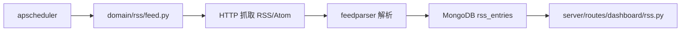

# YA-08-06: RSS 聚合服务 — Feed 调度 + apscheduler 定时 + 内容提取 — 开发方案

> 来源 PRD：[06-需求-RSS聚合服务.md](../../prds/2026-08/06-需求-RSS聚合服务.md)
> 需求编号：YA-08-06 · 优先级：P1 · 人天：2.0d
> 类型：功能 · 状态：已完成

---

## 一、方案概述

RSS 聚合服务定时抓取订阅源，提取内容存入 MongoDB，供前端展示和 RAG 检索消费。复用 apscheduler（与知识库监听器同一调度器）。

### 职责边界

| 组件 | 文件 | 职责 |
|------|------|------|
| Feed 抓取 | `domain/rss/feed.py` | HTTP 请求 + XML 解析 |
| 调度器 | `domain/rss/scheduler.py` | 定时任务注册/管理 |
| 服务层 | `services/rss/feed_service.py` + `rss_scheduler.py` | RPC 封装 |
| 路由 | `server/routes/dashboard/rss.py` | Dashboard RSS 面板数据 |

---

## 二、实施步骤

| 步骤 | 内容 | 验证 | 人天 |
|------|------|------|------|
| 1 | Feed HTTP 抓取 + feedparser 解析 | 标准 RSS 2.0 / Atom 解析正确 | 0.5 |
| 2 | apscheduler 定时调度 | 按配置间隔自动抓取 | 0.5 |
| 3 | MongoDB 存储 + 去重 | 相同 GUID 不重复入库 | 0.5 |
| 4 | Dashboard API + 测试 | RSS 面板数据正确 | 0.5 |

**合计：2.0d**。

---

## 三、边缘场景

| 场景 | 处理 |
|------|------|
| Feed 源不可达 | 记录 WARN，跳过该源 |
| XML 格式错误 | feedparser 容错解析，失败则跳过 |
| 重复条目 | `guid` 去重 |
| 并发抓取 | asyncio 并发，单源串行 |

---

## 四、关联模块

- 依赖：[YA-08-07 Dashboard](./07-prd-task-Dashboard健康聚合API.md)——RSS 面板数据源
- 消费：[YA-07-01 混合检索引擎](../2026-07/01-prd-task-混合检索引擎.md)——RSS 内容可纳入 RAG

---

## 五、代码审查检查清单

- [x] RSS 2.0 + Atom 双格式兼容
- [x] `guid` 去重防止重复入库
- [x] Feed 源不可达 → WARN + 跳过（不影响其他源）
- [x] 并发抓取：`asyncio.gather` + Semaphore 限流

---

## 六、技术风险

| 风险 | 概率 | 影响 | 缓解措施 |
|------|------|------|---------|
| Feed 源变更 URL | 中 | 低 | WARN 日志 + Dashboard 展示失效源 |

---

## 七、实现完成记录

> **完成日期**：2026-08-20 · **状态**：已完成

| 分类 | 文件数 | 关键产出 |
|------|--------|---------|
| Domain | 2 | feed.py + scheduler.py |
| Service | 2 | feed_service + rss_scheduler |
| Route | 1 | dashboard/rss.py |
| **合计** | **5** | |

---

## 八、已知缺口与技术债

| # | 技术债 | 优先级 | 说明 | 状态 |
|---|--------|--------|------|------|
| 1 | Feed 内容全文索引 | P2 | 当前仅存标题+摘要，全文需单独抓取 | 待实施 |
| 2 | 抓取频率自适应 | P3 | 当前固定间隔，未根据 Feed 更新频率动态调整 | 待实施 |

---