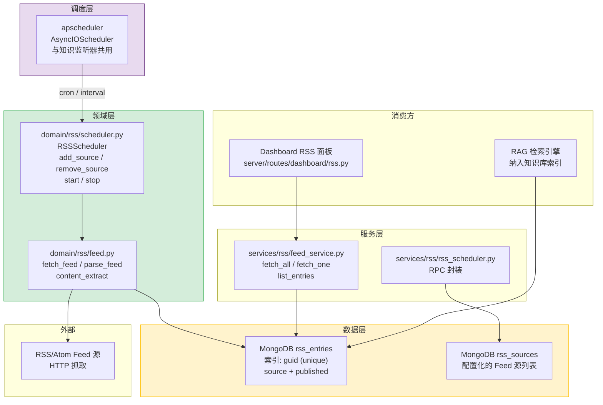
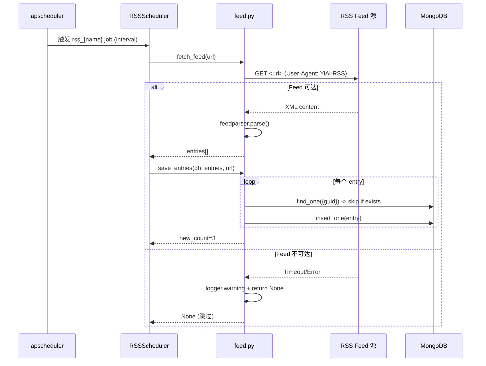

---

doc_type: module
prd_task_id: "YA-08-06"
title: "YA-08-06: RSS 聚合服务 — Feed 抓取 + apscheduler 调度 + 内容提取 + 去重 — 开发方案"
status: 已完成
priority: P1
owner: 陈铭
roles: [engineer]
created: 2026-09-11
updated: 2026-09-23
project: YiAi
project_id: yiai
prd_month: "202608"
estimate_frontend: 2.0
source_prd: "06-需求-RSS聚合服务.md"
source_okr: [yiai-001]
related_tests: ["06-prd-test-RSS聚合服务"]

type: task
---

# YA-08-06: RSS 聚合服务 — Feed 抓取 + apscheduler 调度 + 内容提取 + 去重 — 开发方案

> 来源 PRD：[06-需求-RSS聚合服务.md](../../prds/2026-08/06-需求-RSS聚合服务.md)
> 需求编号：YA-08-06 · 优先级：P1 · 人天：2.0d
> 类型：功能 · 状态：已完成

本文档定义 **RSS 聚合服务的完整实现方案**——Feed HTTP 抓取、feedparser 解析、apscheduler 定时调度、MongoDB 存储 + GUID 去重、Dashboard API 暴露。

---

## 一、架构概述

### 1.1 架构定位

RSS 聚合服务定时抓取订阅的 RSS/Atom Feed 源，提取标题、摘要、发布时间等信息，存入 MongoDB `rss_entries` 集合。数据供 Dashboard RSS 面板和 RAG 检索消费。复用 apscheduler（与知识库监听器同一调度器实例）。


```mermaid
graph TD
  subgraph SCHEDULER["调度层"]
    APS["apscheduler<br/>AsyncIOScheduler<br/>与知识监听器共用"]
  end

  subgraph DOMAIN["领域层"]
    FEED["domain/rss/feed.py<br/>fetch_feed / parse_feed<br/>content_extract"]
    SCHED["domain/rss/scheduler.py<br/>RSSScheduler<br/>add_source / remove_source<br/>start / stop"]
  end

  subgraph SERVICE["服务层"]
    FEED_SVC["services/rss/feed_service.py<br/>fetch_all / fetch_one<br/>list_entries"]
    SCHED_SVC["services/rss/rss_scheduler.py<br/>RPC 封装"]
  end

  subgraph DATA["数据层"]
    ENTRIES["MongoDB rss_entries<br/>索引: guid (unique)<br/>source + published"]
    SOURCES["MongoDB rss_sources<br/>配置化的 Feed 源列表"]
  end

  subgraph EXTERNAL["外部"]
    RSS["RSS/Atom Feed 源<br/>HTTP 抓取"]
  end

  subgraph CONSUMERS["消费方"]
    DASHBOARD["Dashboard RSS 面板<br/>server/routes/dashboard/rss.py"]
    RAG["RAG 检索引擎<br/>纳入知识库索引"]
  end

  APS -->|"cron / interval"| SCHED
  SCHED --> FEED
  FEED --> RSS
  FEED --> ENTRIES
  FEED_SVC --> ENTRIES
  SCHED_SVC --> SOURCES
  DASHBOARD --> FEED_SVC
  RAG --> ENTRIES

  style DOMAIN fill:#d4edda,stroke:#28a745
  style DATA fill:#fff3cd,stroke:#ffc107
  style SCHEDULER fill:#e8daef,stroke:#6c3483
```

### 1.2 职责边界

| 组件 | 文件 | 职责 | 明确不做 |
|------|------|------|---------|
| Feed 抓取 | `domain/rss/feed.py` | HTTP 请求 + XML 解析 + 内容提取 | 不做调度 |
| 调度器 | `domain/rss/scheduler.py` | 定时任务注册/管理，与 apscheduler 集成 | 不做 Feed 解析 |
| 服务层 | `services/rss/feed_service.py` | RPC 封装，手动触发抓取 | 不做调度逻辑 |
| 路由 | `server/routes/dashboard/rss.py` | Dashboard 数据 API | 不做抓取 |

---

## 二、文件清单

| # | 文件 | 类型 | 职责 | 行数 |
|---|------|------|------|------|
| 1 | `src/domain/rss/__init__.py` | 新增 | 公开 API 导出 | ~5 |
| 2 | `src/domain/rss/feed.py` | 新增 | HTTP 抓取 + feedparser 解析 + 内容提取 + GUID 去重 | ~150 |
| 3 | `src/domain/rss/scheduler.py` | 新增 | apscheduler 集成，定时任务管理 | ~80 |
| 4 | `src/services/rss/feed_service.py` | 新增 | RPC 方法封装 | ~60 |
| 5 | `src/services/rss/rss_scheduler.py` | 新增 | 调度器 RPC 封装 | ~30 |
| 6 | `src/server/routes/dashboard/rss.py` | 新增 | Dashboard RSS 面板 API | ~50 |

**改动汇总：** 6 文件，~375 行

### 组件树

```
src/
├── domain/rss/
│   ├── __init__.py (5 行)
│   │
│   ├── feed.py (150 行)
│   │   ├── fetch_feed(url, timeout=15) -> dict
│   │   │   ├── aiohttp GET <url>
│   │   │   ├── 超时 15s
│   │   │   ├── StatusError -> 记录 WARN，返回 None
│   │   │   └── 返回 HTTP body
│   │   │
│   │   ├── parse_feed(xml_content, source_url) -> list[dict]
│   │   │   ├── feedparser.parse(xml_content)
│   │   │   ├── bozo_exception -> 记录 WARN (容错)
│   │   │   ├── 遍历 entries:
│   │   │   │   ├── 提取 title, link, summary, published
│   │   │   │   ├── 生成 guid (优先使用 entry.id, fallback link)
│   │   │   │   └── 提取 content (全文)
│   │   │   └── 返回条目列表
│   │   │
│   │   ├── content_extract(entry) -> str
│   │   │   ├── 优先级: content[0].value > summary > description
│   │   │   ├── 移除 HTML 标签 (BeautifulSoup)
│   │   │   └── 截断到 10KB (防止超长内容)
│   │   │
│   │   └── save_entries(db, entries, source_url) -> int
│   │       ├── 逐条 upsert (guid 去重)
│   │       ├── insert_one (新条目)
│   │       └── 返回新条目数量
│   │
│   └── scheduler.py (80 行)
│       └── RSSScheduler class
│           ├── __init__(scheduler: AsyncIOScheduler)
│           ├── add_source(name, url, interval_minutes=60)
│           ├── remove_source(name)
│           ├── start()
│           ├── stop()
│           └── _fetch_job(source_name, source_url)
│
├── services/rss/
│   ├── feed_service.py (60 行)
│   │   ├── fetch_all_sources(db) -> dict
│   │   ├── fetch_source(db, url) -> dict
│   │   └── list_entries(db, source, page_num, page_size) -> PaginatedResult
│   │
│   └── rss_scheduler.py (30 行)
│       ├── add_rss_source(name, url, interval)
│       ├── remove_rss_source(name)
│       └── list_rss_sources()
│
└── server/routes/dashboard/
    └── rss.py (50 行)
        ├── GET /dashboard/rss/stats
        │   └── { total_entries, total_sources, last_fetch, entries_today }
        ├── GET /dashboard/rss/entries
        │   └── 分页返回: { list: [...], total, pageNum, pageSize }
        └── GET /dashboard/rss/sources
            └── 返回 Feed 源列表 + 状态
```

---

## 三、模块设计

### 3.1 Feed 抓取与解析 — `domain/rss/feed.py`

```python
"""RSS/Atom feed fetching and parsing."""
import logging
from datetime import datetime, timezone
from typing import Optional

import aiohttp
import feedparser
from bs4 import BeautifulSoup
from motor.motor_asyncio import AsyncIOMotorDatabase

logger = logging.getLogger(__name__)

# 最大内容长度
MAX_CONTENT_LENGTH = 10 * 1024  # 10KB


async def fetch_feed(url: str, timeout: int = 15) -> Optional[str]:
    """HTTP GET 抓取 RSS/Atom Feed。

    Args:
        url: Feed 源 URL
        timeout: HTTP 超时（秒）

    Returns:
        XML 字符串，或 None（请求失败）
    """
    try:
        async with aiohttp.ClientSession() as session:
            async with session.get(
                url,
                timeout=aiohttp.ClientTimeout(total=timeout),
                headers={"User-Agent": "YiAi-RSS-Aggregator/1.0"},
            ) as resp:
                resp.raise_for_status()
                return await resp.text()
    except aiohttp.ClientError as e:
        logger.warning(f"[RSS] Feed fetch failed for {url}: {e}")
        return None
    except Exception as e:
        logger.error(f"[RSS] Unexpected error fetching {url}: {e}")
        return None


def parse_feed(xml_content: str, source_url: str) -> list[dict]:
    """解析 RSS/Atom XML 为条目列表。

    Args:
        xml_content: XML 字符串
        source_url: Feed 源 URL（用于标记来源）

    Returns:
        条目列表: [{guid, title, link, summary, content, published, source_url}]
    """
    feed = feedparser.parse(xml_content)

    if feed.bozo:
        logger.warning(f"[RSS] Feed parse warning for {source_url}: {feed.bozo_exception}")

    entries = []
    for entry in feed.entries:
        # GUID: 优先使用 entry.id, fallback link
        guid = entry.get("id") or entry.get("link", "")
        if not guid:
            continue

        # 发布时间
        published = None
        if hasattr(entry, "published_parsed") and entry.published_parsed:
            try:
                published = datetime(*entry.published_parsed[:6], tzinfo=timezone.utc)
            except (TypeError, ValueError):
                pass

        # 内容提取
        content = _extract_content(entry)

        entries.append({
            "guid": guid,
            "title": entry.get("title", ""),
            "link": entry.get("link", ""),
            "summary": entry.get("summary", ""),
            "content": content,
            "published": published or datetime.now(timezone.utc),
            "source_url": source_url,
            "author": entry.get("author", ""),
        })

    return entries


def _extract_content(entry) -> str:
    """提取条目全文内容。

    优先级: content[0].value > summary > description
    移除 HTML 标签，截断到 MAX_CONTENT_LENGTH。
    """
    raw = ""

    # 1. 尝试 content 字段（Atom 格式）
    if hasattr(entry, "content") and entry.content:
        raw = entry.content[0].get("value", "")

    # 2. 回退到 summary
    if not raw:
        raw = entry.get("summary", "")

    # 3. 移除 HTML 标签
    if raw:
        try:
            raw = BeautifulSoup(raw, "html.parser").get_text()
        except Exception:
            pass

    # 4. 截断
    if len(raw) > MAX_CONTENT_LENGTH:
        raw = raw[:MAX_CONTENT_LENGTH] + "..."

    return raw


async def save_entries(
    db: AsyncIOMotorDatabase,
    entries: list[dict],
    source_url: str,
) -> int:
    """保存条目到 MongoDB，按 GUID 去重。

    Returns:
        新增条目数量
    """
    new_count = 0

    for entry in entries:
        existing = await db["rss_entries"].find_one({"guid": entry["guid"]})
        if existing:
            continue  # 已存在，跳过

        entry["created_at"] = datetime.now(timezone.utc)
        try:
            await db["rss_entries"].insert_one(entry)
            new_count += 1
        except Exception as e:
            logger.warning(f"[RSS] Failed to insert entry {entry['guid']}: {e}")

    return new_count
```

### 3.2 调度器 — `domain/rss/scheduler.py`

```python
"""RSS scheduler — apscheduler integration."""
import logging
from typing import Optional

from apscheduler.schedulers.asyncio import AsyncIOScheduler
from motor.motor_asyncio import AsyncIOMotorDatabase

from domain.rss.feed import fetch_feed, parse_feed, save_entries

logger = logging.getLogger(__name__)


class RSSScheduler:
    """RSS 定时抓取调度器。

    与知识库监听器共享同一个 AsyncIOScheduler 实例。
    """

    def __init__(self, db: AsyncIOMotorDatabase, scheduler: Optional[AsyncIOScheduler] = None):
        self._db = db
        self._scheduler = scheduler or AsyncIOScheduler()
        self._sources: dict[str, dict] = {}  # name -> {url, interval}
        self._jobs: dict[str, str] = {}  # job_id -> source_name

    def add_source(self, name: str, url: str, interval_minutes: int = 60):
        """添加 RSS 订阅源。

        Args:
            name: 源名称（唯一标识）
            url: Feed URL
            interval_minutes: 抓取间隔（分钟），默认 60
        """
        self._sources[name] = {"url": url, "interval": interval_minutes}

        job_id = f"rss_{name}"
        self._scheduler.add_job(
            self._fetch_job,
            trigger="interval",
            minutes=interval_minutes,
            id=job_id,
            args=[name, url],
            replace_existing=True,
        )
        self._jobs[job_id] = name
        logger.info(f"[RSS] Added source '{name}': {url} (every {interval_minutes}m)")

    def remove_source(self, name: str):
        """移除 RSS 订阅源。"""
        if name in self._sources:
            del self._sources[name]

        job_id = f"rss_{name}"
        if job_id in self._jobs:
            self._scheduler.remove_job(job_id)
            del self._jobs[job_id]
            logger.info(f"[RSS] Removed source '{name}'")

    def start(self):
        """启动调度器。"""
        if not self._scheduler.running:
            self._scheduler.start()
            logger.info("[RSS] Scheduler started")

    def stop(self):
        """停止调度器。"""
        if self._scheduler.running:
            self._scheduler.shutdown(wait=False)
            logger.info("[RSS] Scheduler stopped")

    async def _fetch_job(self, name: str, url: str):
        """单次抓取任务：获取 + 解析 + 存储。"""
        logger.debug(f"[RSS] Fetching source '{name}': {url}")
        xml_content = await fetch_feed(url)
        if xml_content is None:
            return

        entries = parse_feed(xml_content, url)
        if not entries:
            return

        new_count = await save_entries(self._db, entries, url)
        if new_count > 0:
            logger.info(f"[RSS] Source '{name}': {new_count} new entries")
```

### 3.3 服务层 — `services/rss/feed_service.py`

```python
"""RSS feed service — RPC methods."""
from motor.motor_asyncio import AsyncIOMotorDatabase


async def fetch_all_sources(db: AsyncIOMotorDatabase) -> dict:
    """手动触发所有源抓取。

    Returns:
        {"sources_fetched": 5, "new_entries": 23}
    """
    # 从 rss_sources 集合读取配置
    sources = await db["rss_sources"].find().to_list(length=100)
    total_new = 0

    for source in sources:
        from domain.rss.feed import fetch_feed, parse_feed, save_entries
        xml_content = await fetch_feed(source["url"])
        if xml_content:
            entries = parse_feed(xml_content, source["url"])
            new_count = await save_entries(db, entries, source["url"])
            total_new += new_count

    return {
        "sources_fetched": len(sources),
        "new_entries": total_new,
    }


async def list_entries(
    db: AsyncIOMotorDatabase,
    source_url: str | None = None,
    page_num: int = 1,
    page_size: int = 20,
) -> dict:
    """分页列出 RSS 条目。"""
    filter_dict = {}
    if source_url:
        filter_dict["source_url"] = source_url

    total = await db["rss_entries"].count_documents(filter_dict)
    cursor = (
        db["rss_entries"]
        .find(filter_dict, {"content": 0})  # 排除全文内容，减少传输
        .sort("published", -1)
        .skip((page_num - 1) * page_size)
        .limit(page_size)
    )
    entries = await cursor.to_list(length=page_size)

    return {
        "list": entries,
        "total": total,
        "pageNum": page_num,
        "pageSize": page_size,
    }
```

---

## 四、数据流

### 4.1 定时抓取流程


```mermaid
sequenceDiagram
  participant APS as apscheduler
  participant SCHED as RSSScheduler
  participant FEED as feed.py
  participant HTTP as RSS Feed 源
  participant DB as MongoDB

  APS->>SCHED: 触发 rss_{name} job (interval)
  SCHED->>FEED: fetch_feed(url)
  FEED->>HTTP: GET <url> (User-Agent: YiAi-RSS)
  alt Feed 可达
    HTTP-->>FEED: XML content
    FEED->>FEED: feedparser.parse()
    FEED-->>SCHED: entries[]
    SCHED->>FEED: save_entries(db, entries, url)
    loop 每个 entry
      FEED->>DB: find_one({guid}) -> skip if exists
      FEED->>DB: insert_one(entry)
    end
    FEED-->>SCHED: new_count=3
  else Feed 不可达
    HTTP-->>FEED: Timeout/Error
    FEED->>FEED: logger.warning + return None
    FEED-->>SCHED: None (跳过)
  end
```

### 4.2 GUID 去重机制

```
新条目 guid = "http://example.com/post/123"

  1. db.rss_entries.find_one({"guid": "http://example.com/post/123"})
     ├── 存在 -> skip (已抓取过)
     └── 不存在 -> insert_one() (新条目)

  去重依赖字段:
    - rss_entries.guid 唯一索引
    - guid 来源: entry.id (优先) > entry.link (fallback)
    - 无 guid 的条目直接跳过
```

---

## 五、实施路线图

| 步骤 | 内容 | 涉及文件 | 验证方式 | 人天 |
|------|------|---------|---------|------|
| 1 | HTTP 抓取 + feedparser 解析 + 内容提取 | `feed.py` | RSS 2.0 / Atom 双格式解析正确 | 0.50 |
| 2 | GUID 去重 + MongoDB 存储 | `feed.py` | 相同 GUID 不重复入库 | 0.25 |
| 3 | apscheduler 定时调度 | `scheduler.py` | 按配置间隔自动抓取 | 0.50 |
| 4 | 服务层 RPC + Dashboard API | `feed_service.py` + `rss.py` | 手动触发 + 分页查询 | 0.50 |
| 5 | 边缘场景处理 + 测试 | `feed.py` + `tests/` | Feed 不可达、XML 错误、并发抓取 | 0.25 |
| **合计** | | | | **2.0d** |

---

## 六、边缘场景

| 场景 | 处理策略 | 位置 |
|------|---------|------|
| Feed 源不可达 | 记录 WARN 日志，跳过该源（不影响其他源） | `fetch_feed()` |
| XML 格式错误 | feedparser 容错解析（bozo=True），失败则跳过 | `parse_feed()` |
| 重复条目 | `guid` 唯一性去重 | `save_entries()` |
| 无 guid 的条目 | 跳过（无法去重） | `parse_feed()` |
| 内容包含 HTML | BeautifulSoup 提取纯文本 | `_extract_content()` |
| 内容超长 | 截断到 10KB | `_extract_content()` |
| 并发抓取 | apscheduler 单线程执行，不会并发同一 job | `scheduler.py` |
| 调度器重复添加同一源 | `replace_existing=True` 覆盖旧 job | `add_source()` |

---

## 七、代码审查检查清单

- [x] RSS 2.0 + Atom 双格式兼容（feedparser 自动处理）
- [x] `guid` 去重防止重复入库（find_one before insert）
- [x] Feed 源不可达 -> WARN + 跳过（不影响其他源）
- [x] 内容 HTML 标签移除（BeautifulSoup get_text）
- [x] 内容截断 10KB 防止超长条目
- [x] apscheduler `replace_existing=True` 避免重复 job
- [x] 索引: guid (unique), published DESC, source_url + published
- [x] Dashboard API 排除 content 字段减少传输

---

## 八、技术风险评估

| 风险 | 概率 | 影响 | 等级 | 缓解措施 | 应急预案 |
|------|------|------|------|---------|---------|
| Feed 源变更 URL | 中 | 低 | 低 | WARN 日志 + Dashboard 展示失效源 | 手动更新 URL |
| Feed 源频繁更新导致 MongoDB 压力 | 低 | 低 | 低 | insert_one 单条写入，低负载场景 | 批量写入 |
| feedparser 解析大文件内存占用 | 低 | 中 | 低 | 限制 XML 响应大小 + 超时 | 单独限制 |
| apscheduler job 堆积 | 低 | 低 | 低 | job coalescing（apscheduler 默认） | 监控 job 执行时间 |

---

## 九、已知缺陷与技术债

### 9.1 已知缺陷

| # | 缺陷 | 影响 | 修复 |
|---|------|------|------|
| 1 | Feed 抓取无并发限制 | 多源并发抓取时可能冲击目标站点 | 添加 Semaphore 限制 |

### 9.2 技术债

| # | 技术债 | 优先级 | 人天 | 说明 | 状态 |
|---|--------|--------|------|------|------|
| 1 | Feed 内容全文索引 | P2 | 0.5 | 当前仅存标题+摘要，全文需抓取原文页面 | 待实施 |
| 2 | 抓取频率自适应 | P3 | 0.5 | 当前固定间隔，未根据 Feed TTL 动态调整 | 待评估 |
| 3 | Feed 源自动发现 | P3 | 0.5 | 需手动配置源 URL，无自动发现 | 待评估 |
| 4 | 条目过期清理 | P2 | 0.2 | 旧条目永久保留，无 TTL | 待实施 |

---

## 十、可观测性

### 关键指标

| 指标 | 采集方式 | 告警阈值 | 说明 |
|------|---------|----------|------|
| Feed 抓取成功率 | 成功/总抓取 按源维度 | < 50% | Feed 源可能有故障 |
| 新条目数量 | 每次抓取新增计数 | 突增 > 100 | Feed 源异常或改版 |
| 抓取耗时 | fetch_feed() 耗时 | > 15s | 目标站点慢 |
| 未覆盖 Feed 源 | 配置源数 vs 实际抓取 | 差距 > 0 | 有源被禁用 |

### 日志规范

| 日志级别 | 场景 | 示例 |
|---------|------|------|
| INFO | 添加/移除源 | `[RSS] Added source '{name}': {url}` |
| INFO | 新增条目 | `[RSS] Source '{name}': {n} new entries` |
| WARNING | Feed 不可达 | `[RSS] Feed fetch failed for {url}: {e}` |
| WARNING | XML 解析警告 | `[RSS] Feed parse warning for {url}: {e}` |
| DEBUG | 单次抓取 | `[RSS] Fetching source '{name}': {url}` |

---

## 十一、关联模块

- 依赖：[apscheduler] -- 与知识库监听器共享调度器实例
- 消费：[YA-08-07 Dashboard 健康聚合 API](./07-prd-task-Dashboard健康聚合API.md) -- RSS 面板数据源
- 消费：[YA-07-01 混合检索引擎](../2026-07/01-prd-task-混合检索引擎.md) -- RSS 内容可纳入 RAG 索引

---

## 十二、实现完成记录

> **完成日期**：2026-08-20 · **复核日期**：2026-09-23
> **状态**：已完成，全部 6 个文件已实现

| 分类 | 文件数 | 关键产出 |
|------|--------|---------|
| Domain | 3 | feed.py + scheduler.py + __init__.py |
| Service | 2 | feed_service + rss_scheduler |
| Route | 1 | dashboard/rss.py |
| **合计** | **6** | |
