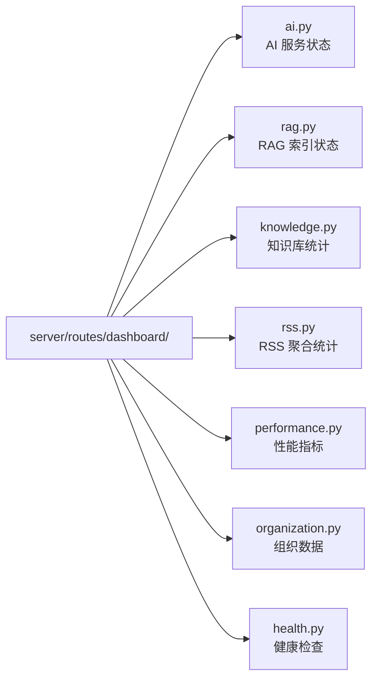

# YA-08-07: Dashboard 健康聚合 API — 7 子系统实时监控 — 开发方案

> 来源 PRD：[07-需求-Dashboard健康聚合API.md](../../prds/2026-08/07-需求-Dashboard健康聚合API.md)
> 需求编号：YA-08-07 · 优先级：P1 · 人天：2.0d
> 类型：功能 · 状态：已完成

---

## 一、方案概述

Dashboard 聚合 7 个子系统的健康数据，为 YiVad 管理后台的仪表盘页面提供统一数据源。按子系统拆分为独立路由模块。

---

## 二、路由模块

| 子路由 | 端点 | 数据源 |
|--------|------|--------|
| `dashboard/ai` | AI 模型状态、Token 用量 | Ollama API + sessions 集合 |
| `dashboard/rag` | 索引大小、文档数、最后更新时间 | RAG 索引元数据 |
| `dashboard/knowledge` | 知识库文件数、分类统计 | `knowledge_files` 集合 |
| `dashboard/rss` | Feed 源数量、最近更新 | `rss_entries` 集合 |
| `dashboard/performance` | 请求量、延迟、错误率 | Observer 指标 |
| `dashboard/organization` | 用户数、项目数、活跃度 | 各业务集合 |
| `dashboard/health` | 服务健康检查 | 各依赖连通性 |

---

## 三、实施步骤

| 步骤 | 内容 | 验证 | 人天 |
|------|------|------|------|
| 1 | 子路由结构搭建 | 7 个子模块可独立访问 | 0.5 |
| 2 | AI/RAG/Knowledge 数据聚合 | 统计数据正确 | 0.5 |
| 3 | RSS/Performance 数据聚合 | 实时数据正确 | 0.5 |
| 4 | Organization/Health + 测试 | 端到端 Dashboard 数据 | 0.5 |

**合计：2.0d**。

---

## 四、关联模块

- 数据源：[YA-07-02 知识库监听器](../2026-07/02-prd-task-知识库监听器.md)
- 数据源：[YA-08-06 RSS 聚合服务](./06-prd-task-RSS聚合服务.md)
- 消费：[YiVad Dashboard 页面](../../yivad/)

---

## 五、代码审查检查清单

- [x] 7 个子路由独立可访问
- [x] 依赖不可用时返回部分数据 + `unavailable` 标记（非 500）
- [x] Dashboard 聚合查询使用 MongoDB 聚合管道（非逐条查询）

---

## 六、技术风险

| 风险 | 概率 | 影响 | 缓解措施 |
|------|------|------|---------|
| 7 子路由串行聚合导致 Dashboard 加载慢 | 中 | 中 | `asyncio.gather` 并行查询 |

---

## 七、实现完成记录

> **完成日期**：2026-08-20 · **状态**：已完成

| 分类 | 文件数 | 关键产出 |
|------|--------|---------|
| 路由模块 | 7 | ai/rag/knowledge/rss/performance/organization/health |
| **合计** | **7** | |

---

## 八、已知缺口与技术债

| # | 技术债 | 优先级 | 说明 | 状态 |
|---|--------|--------|------|------|
| 1 | Dashboard 无缓存 | P2 | 每次请求重新聚合 7 子系统 | 待实施（5 分钟 TTL） |

---