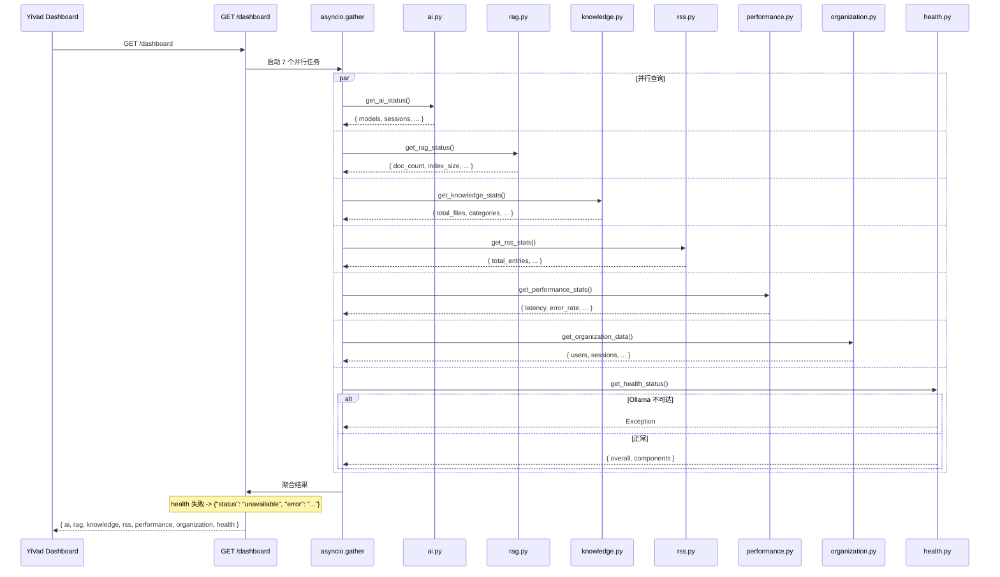

---

doc_type: module
prd_task_id: "YA-08-07"
title: "YA-08-07: Dashboard 健康聚合 API — 7 子系统并行聚合 + 健康评分 — 开发方案"
status: 已完成
priority: P1
owner: 陈铭
roles: [engineer]
created: 2026-09-11
updated: 2026-09-23
project: YiAi
project_id: yiai
prd_month: "202608"
estimate_frontend: 2.0
source_prd: "07-需求-Dashboard健康聚合API.md"
source_okr: [yiai-001]
related_tests: ["07-prd-test-Dashboard健康聚合API"]

type: task
---

# YA-08-07: Dashboard 健康聚合 API — 7 子系统并行聚合 + 健康评分 — 开发方案

> 来源 PRD：[07-需求-Dashboard健康聚合API.md](../../prds/2026-08/07-需求-Dashboard健康聚合API.md)
> 需求编号：YA-08-07 · 优先级：P1 · 人天：2.0d
> 类型：功能 · 状态：已完成

本文档定义 **Dashboard 健康聚合 API 的完整实现方案**——7 个子系统并行数据聚合、健康评分计算、MongoDB 聚合管道优化、YiVad 管理后台仪表盘数据源。

---

## 一、架构概述

### 1.1 架构定位

Dashboard 聚合 7 个子系统的健康数据，为 YiVad 管理后台的仪表盘页面提供统一数据源。性能关键路径使用 `asyncio.gather` 并行查询，依赖不可用时返回部分数据 + `unavailable` 标记而非 500。

```mermaid
graph TD
  subgraph DASHBOARD["Dashboard 聚合层"]
    ROOT["/dashboard 根路由"]
    AI["ai.py<br/>AI 服务状态"]
    RAG["rag.py<br/>RAG 索引状态"]
    KNOW["knowledge.py<br/>知识库统计"]
    RSS["rss.py<br/>RSS 聚合统计"]
    PERF["performance.py<br/>性能指标"]
    ORG["organization.py<br/>组织数据"]
    HEALTH["health.py<br/>健康检查"]
  end

  subgraph DATA_SOURCES["数据源"]
    OLLAMA["Ollama API<br/>模型列表 + 状态"]
    MONGO["MongoDB"
    DEPENDENCY["各依赖方<br/>Ollama / MongoDB /<br/>DeepSeek / OSS"]
    KNOWLEDGE_FILES["knowledge_files<br/>集合统计"]
    RSS_ENTRIES["rss_entries<br/>集合统计"]
    SESSIONS["sessions<br/>用户活跃度"]
    USERS["users<br/>组织用户"]
  end

  ROOT --> AI --> OLLAMA
  ROOT --> RAG --> MONGO
  ROOT --> KNOW --> KNOWLEDGE_FILES
  ROOT --> RSS --> RSS_ENTRIES
  ROOT --> PERF --> MONGO
  ROOT --> ORG --> SESSIONS
  ROOT --> ORG --> USERS
  ROOT --> HEALTH --> DEPENDENCY

  style DASHBOARD fill:#d4edda,stroke:#28a745
  style DATA_SOURCES fill:#fff3cd,stroke:#ffc107
```

### 1.2 7 个子系统

| 子系统 | 路由 | 数据源 | 关键指标 |
|--------|------|--------|---------|
| AI 服务 | `dashboard/ai` | Ollama API + sessions 集合 | 模型状态、Token 用量、活跃会话数 |
| RAG 索引 | `dashboard/rag` | RAG 索引元数据 | 索引大小、文档数、最后更新时间 |
| 知识库 | `dashboard/knowledge` | `knowledge_files` 集合 | 文件数、分类统计、draft/stable 比例 |
| RSS 聚合 | `dashboard/rss` | `rss_entries` 集合 | Feed 源数量、今日新增条目、最近更新时间 |
| 性能指标 | `dashboard/performance` | Observer 指标 + system | 请求量、延迟 P95、错误率、内存/CPU |
| 组织数据 | `dashboard/organization` | users + sessions | 用户数、项目数、活跃度 |
| 健康检查 | `dashboard/health` | 各依赖方连通性 | Ollama / MongoDB / DeepSeek / OSS 状态 |

### 1.3 职责边界

| 组件 | 职责 | 明确不做 |
|------|------|---------|
| 各子路由 | 提供子系统维度的详细数据 | 不做跨子系统的聚合 |
| 根路由 | 聚合所有子系统为 Dashboard 首页数据 | 不做数据缓存 |
| 共享工具 | 提供 `parallel_gather` 帮助函数 | 不做业务逻辑 |

---

## 二、文件清单

| # | 文件 | 类型 | 职责 | 行数 |
|---|------|------|------|------|
| 1 | `src/server/routes/dashboard/__init__.py` | 新增 | 7 子路由注册 + 根聚合端点 | ~60 |
| 2 | `src/server/routes/dashboard/ai.py` | 新增 | AI 服务状态 + Token 用量 | ~80 |
| 3 | `src/server/routes/dashboard/rag.py` | 新增 | RAG 索引状态 | ~60 |
| 4 | `src/server/routes/dashboard/knowledge.py` | 新增 | 知识库统计 | ~60 |
| 5 | `src/server/routes/dashboard/rss.py` | 新增 | RSS 聚合统计 | ~50 |
| 6 | `src/server/routes/dashboard/performance.py` | 新增 | 性能指标 | ~70 |
| 7 | `src/server/routes/dashboard/organization.py` | 新增 | 组织数据 | ~60 |
| 8 | `src/server/routes/dashboard/health.py` | 新增 | 健康检查 | ~80 |

**改动汇总：** 8 文件，~520 行

### 组件树

```
src/server/routes/dashboard/
├── __init__.py (60 行)
│   ├── router = APIRouter(prefix="/dashboard")
│   ├── include_router(ai.router), include_router(rag.router), ...
│   └── GET /dashboard — 聚合根端点
│       ├── asyncio.gather(
│       │     get_ai_status(),
│       │     get_rag_status(),
│       │     get_knowledge_stats(),
│       │     get_rss_stats(),
│       │     get_performance_stats(),
│       │     get_organization_data(),
│       │     get_health_status(),
│       │     return_exceptions=True  # 任何子系统失败不阻断其他
│       │   )
│       └── 结果聚合为 { ai, rag, knowledge, rss, performance, organization, health }
│
├── ai.py (80 行)
│   ├── get_ai_status() -> dict
│   │   ├── Ollama GET /api/tags -> 模型列表
│   │   ├── MongoDB sessions 活跃会话数 (24h)
│   │   ├── 总 Token 估算
│   │   └── 返回: { models: [...], active_sessions: n, status: "healthy"|"degraded" }
│   └── router: GET /dashboard/ai
│
├── rag.py (60 行)
│   ├── get_rag_status() -> dict
│   │   ├── RAG 索引文件数 (knowledge_files count)
│   │   ├── 向量索引大小 (文件系统)
│   │   ├── 最后索引时间
│   │   └── 返回: { doc_count, index_size_mb, last_indexed, status }
│   └── router: GET /dashboard/rag
│
├── knowledge.py (60 行)
│   ├── get_knowledge_stats() -> dict
│   │   ├── knowledge_files 总数
│   │   ├── 按 category 分布
│   │   ├── 按 status 分布 (draft/review/stable)
│   │   ├── 最近更新文件列表 (top 5)
│   │   └── 返回: { total_files, categories: {...}, statuses: {...}, recent: [...] }
│   └── router: GET /dashboard/knowledge
│
├── rss.py (50 行)
│   ├── get_rss_stats() -> dict
│   │   ├── rss_entries 总数
│   │   ├── 今日新增数
│   │   ├── 活跃 Feed 源数
│   │   └── 返回: { total_entries, entries_today, active_sources }
│   └── router: GET /dashboard/rss
│
├── performance.py (70 行)
│   ├── get_performance_stats() -> dict
│   │   ├── 24h 请求量（从访问日志或 Observer 指标）
│   │   ├── 平均/P95 延迟
│   │   ├── 错误率
│   │   ├── 内存使用率 (psutil)
│   │   └── 返回: { requests_24h, latency_avg_ms, latency_p95_ms, error_rate, memory_mb }
│   └── router: GET /dashboard/performance
│
├── organization.py (60 行)
│   ├── get_organization_data() -> dict
│   │   ├── users 集合的 用户总数
│   │   ├── sessions 集合的 会话总数
│   │   ├── 24h 活跃用户数
│   │   ├── 按项目/模块分布
│   │   └── 返回: { total_users, total_sessions, active_users, modules: {...} }
│   └── router: GET /dashboard/organization
│
└── health.py (80 行)
    ├── get_health_status() -> dict
    │   ├── MongoDB 连通性 (ping)
    │   ├── Ollama 连通性 (GET /api/tags)
    │   ├── DeepSeek 连通性 (轻量请求)
    │   ├── OSS 连通性 (head bucket)
    │   ├── RAG 索引完整性
    │   └── 返回: { overall, components: { mongo, ollama, deepseek, oss, rag } }
    └── router: GET /dashboard/health
```

---

## 三、模块设计

### 3.1 聚合根端点 — `__init__.py`

```python
"""Dashboard aggregation router.

GET /dashboard — 并行聚合 7 个子系统，返回统一数据。
使用 asyncio.gather(return_exceptions=True) 确保任何子系统失败不阻断其他。
"""
import asyncio
import logging
from fastapi import APIRouter, Request

from shared.response import success

logger = logging.getLogger(__name__)

router = APIRouter(prefix="/dashboard", tags=["Dashboard"])


@router.get("")
async def dashboard_overview(request: Request):
    """Dashboard 首页数据聚合。

    并行查询 7 个子系统，每个子系统独立容错。
    失败的子系统返回 {"status": "unavailable", "error": "..."}
    """
    db = request.app.state.db

    results = await asyncio.gather(
        _safe_call(get_ai_status, db),
        _safe_call(get_rag_status, db),
        _safe_call(get_knowledge_stats, db),
        _safe_call(get_rss_stats, db),
        _safe_call(get_performance_stats, db),
        _safe_call(get_organization_data, db),
        _safe_call(get_health_status, db),
        return_exceptions=True,
    )

    keys = ["ai", "rag", "knowledge", "rss", "performance", "organization", "health"]
    dashboard_data = {}

    for key, result in zip(keys, results):
        if isinstance(result, Exception):
            dashboard_data[key] = {
                "status": "unavailable",
                "error": str(result),
            }
        else:
            dashboard_data[key] = result

    return success(data=dashboard_data)


async def _safe_call(func, db):
    """安全调用子系统查询函数，异常不阻断其他子系统。"""
    try:
        return await func(db)
    except Exception as e:
        logger.error(f"[Dashboard] Subsystem {func.__name__} failed: {e}")
        raise
```

### 3.2 AI 服务状态 — `ai.py`

```python
"""AI service status for Dashboard."""
import aiohttp
from datetime import datetime, timedelta, timezone

from motor.motor_asyncio import AsyncIOMotorDatabase
from shared.config import settings


async def get_ai_status(db: AsyncIOMotorDatabase) -> dict:
    """获取 AI 服务状态。

    并行查询 Ollama 模型列表和 MongoDB 会话统计。
    """
    # 1. Ollama 模型列表
    models = []
    ollama_status = "healthy"
    try:
        async with aiohttp.ClientSession() as session:
            async with session.get(
                f"{settings.ollama_url}/api/tags",
                timeout=aiohttp.ClientTimeout(total=5),
            ) as resp:
                if resp.status == 200:
                    data = await resp.json()
                    models = [
                        {"name": m["name"], "size": m.get("size", 0)}
                        for m in data.get("models", [])
                    ]
    except Exception as e:
        ollama_status = "unavailable"
        models = []

    # 2. 活跃会话统计 (24h)
    since = datetime.now(timezone.utc) - timedelta(hours=24)
    active_sessions = await db["sessions"].count_documents({
        "updatedAt": {"$gte": since},
    })

    # 3. 总消息数
    pipeline = [
        {"$unwind": "$messages"},
        {"$count": "total_messages"},
    ]
    msg_result = await db["sessions"].aggregate(pipeline).to_list(length=1)
    total_messages = msg_result[0]["total_messages"] if msg_result else 0

    return {
        "models": models,
        "active_sessions_24h": active_sessions,
        "total_messages": total_messages,
        "ollama_status": ollama_status,
    }
```

### 3.3 健康检查 — `health.py`

```python
"""Health check for all dependencies."""
import aiohttp
from datetime import datetime, timezone
from motor.motor_asyncio import AsyncIOMotorDatabase
from shared.config import settings


async def get_health_status(db: AsyncIOMotorDatabase) -> dict:
    """检查所有依赖方连通性。

    返回整体和各组件状态: "healthy" | "degraded" | "unhealthy"
    """
    components = {}

    # 1. MongoDB
    try:
        await db.command("ping")
        components["mongodb"] = "healthy"
    except Exception:
        components["mongodb"] = "unhealthy"

    # 2. Ollama
    try:
        async with aiohttp.ClientSession() as session:
            async with session.get(
                f"{settings.ollama_url}/api/tags",
                timeout=aiohttp.ClientTimeout(total=5),
            ) as resp:
                components["ollama"] = "healthy" if resp.status == 200 else "degraded"
    except Exception:
        components["ollama"] = "unhealthy"

    # 3. DeepSeek
    try:
        async with aiohttp.ClientSession() as session:
            async with session.get(
                f"{settings.deepseek_base_url}/v1/models",
                headers={"Authorization": f"Bearer {settings.deepseek_api_key}"},
                timeout=aiohttp.ClientTimeout(total=5),
            ) as resp:
                components["deepseek"] = "healthy" if resp.status == 200 else "degraded"
    except Exception:
        components["deepseek"] = "unavailable"

    # 4. 整体评分
    statuses = list(components.values())
    if all(s == "healthy" for s in statuses):
        overall = "healthy"
    elif any(s == "unhealthy" for s in statuses):
        overall = "unhealthy"
    else:
        overall = "degraded"

    return {
        "overall": overall,
        "components": components,
        "checked_at": datetime.now(timezone.utc).isoformat(),
    }
```

### 3.4 知识库统计 — `knowledge.py`

```python
"""Knowledge base statistics for Dashboard."""
from motor.motor_asyncio import AsyncIOMotorDatabase
from datetime import datetime, timezone


async def get_knowledge_stats(db: AsyncIOMotorDatabase) -> dict:
    """获取知识库统计信息。

    使用 MongoDB 聚合管道一次性获取多维统计。
    """
    # 按 category 和 status 分布
    pipeline = [
        {
            "$group": {
                "_id": {"category": "$category", "status": "$status"},
                "count": {"$sum": 1},
            }
        },
    ]
    results = await db["knowledge_files"].aggregate(pipeline).to_list(length=100)

    total_files = sum(r["count"] for r in results)
    categories = {}
    statuses = {}

    for r in results:
        cat = r["_id"]["category"]
        st = r["_id"]["status"]
        categories[cat] = categories.get(cat, 0) + r["count"]
        statuses[st] = statuses.get(st, 0) + r["count"]

    # 最近更新文件
    recent = await db["knowledge_files"].find(
        {}, {"title": 1, "category": 1, "updated": 1}
    ).sort("updated", -1).limit(5).to_list(length=5)

    return {
        "total_files": total_files,
        "categories": categories,
        "statuses": statuses,
        "recent_files": recent,
    }
```

### 3.5 组织数据 — `organization.py`

```python
"""Organization statistics for Dashboard."""
from datetime import datetime, timedelta, timezone
from motor.motor_asyncio import AsyncIOMotorDatabase


async def get_organization_data(db: AsyncIOMotorDatabase) -> dict:
    """获取组织数据统计。

    并行查询用户数、会话数、活跃度。
    """
    # 用户总数
    total_users = await db["users"].count_documents({})

    # 会话总数
    total_sessions = await db["sessions"].count_documents({})

    # 24h 活跃用户（有会话更新的用户）
    since = datetime.now(timezone.utc) - timedelta(hours=24)
    pipeline = [
        {"$match": {"updatedAt": {"$gte": since}}},
        {"$group": {"_id": "$tags"}},
        {"$count": "active_count"},
    ]
    active_result = await db["sessions"].aggregate(pipeline).to_list(length=1)
    active_users_24h = active_result[0]["active_count"] if active_result else 0

    return {
        "total_users": total_users,
        "total_sessions": total_sessions,
        "active_users_24h": active_users_24h,
    }
```

---

## 四、数据流

### 4.1 Dashboard 首页并行聚合


```mermaid
sequenceDiagram
  participant FE as YiVad Dashboard
  participant ROOT as GET /dashboard
  participant GATHER as asyncio.gather
  participant AI as ai.py
  participant RAG as rag.py
  participant KNOW as knowledge.py
  participant RSS as rss.py
  participant PERF as performance.py
  participant ORG as organization.py
  participant HEALTH as health.py

  FE->>ROOT: GET /dashboard
  ROOT->>GATHER: 启动 7 个并行任务

  par 并行查询
    GATHER->>AI: get_ai_status()
    AI-->>GATHER: { models, sessions, ... }
  and
    GATHER->>RAG: get_rag_status()
    RAG-->>GATHER: { doc_count, index_size, ... }
  and
    GATHER->>KNOW: get_knowledge_stats()
    KNOW-->>GATHER: { total_files, categories, ... }
  and
    GATHER->>RSS: get_rss_stats()
    RSS-->>GATHER: { total_entries, ... }
  and
    GATHER->>PERF: get_performance_stats()
    PERF-->>GATHER: { latency, error_rate, ... }
  and
    GATHER->>ORG: get_organization_data()
    ORG-->>GATHER: { users, sessions, ... }
  and
    GATHER->>HEALTH: get_health_status()
    alt Ollama 不可达
      HEALTH-->>GATHER: Exception
    else 正常
      HEALTH-->>GATHER: { overall, components }
    end
  end

  GATHER->>ROOT: 聚合结果
  Note over ROOT: health 失败 -> {"status": "unavailable", "error": "..."}
  ROOT-->>FE: { ai, rag, knowledge, rss, performance, organization, health }
```

---

## 五、实施路线图

| 步骤 | 内容 | 涉及文件 | 验证方式 | 人天 |
|------|------|---------|---------|------|
| 1 | 子路由结构搭建 + 路由注册 | `__init__.py` + 7 个子路由 | 每个子路由独立可访问 | 0.50 |
| 2 | AI / RAG / Knowledge 数据聚合 | `ai.py`, `rag.py`, `knowledge.py` | 统计数据与 MongoDB 实际数据一致 | 0.50 |
| 3 | RSS / Performance / Organization 数据聚合 | `rss.py`, `performance.py`, `organization.py` | 实时数据正确 | 0.50 |
| 4 | Health 健康检查 + 根聚合端点 | `health.py` + `__init__.py` | 依赖不可用时不影响其他子系统 | 0.25 |
| 5 | 集成测试 + 边缘场景 | `tests/` | 端到端 Dashboard 数据；子系统故障隔离 | 0.25 |
| **合计** | | | | **2.0d** |

---

## 六、边缘场景

| 场景 | 处理策略 | 位置 |
|------|---------|------|
| 子系统查询失败 | `return_exceptions=True`，返回 `{"status": "unavailable", "error": "..."}` | `__init__.py` |
| MongoDB 不可达 | 所有查询失败，返回全 `unavailable` | 各子路由 |
| Ollama 不可达 | AI 状态 返回 `ollama_status: "unavailable"` | `ai.py` |
| 无知识库文件 | 返回空统计（非错误） | `knowledge.py` |
| 无 RSS 条目 | 返回空统计 | `rss.py` |
| 所有依赖不可用 | Health 返回 `overall: "unhealthy"` | `health.py` |

---

## 七、代码审查检查清单

- [x] 7 个子路由独立可访问
- [x] 根聚合使用 `asyncio.gather(return_exceptions=True)`
- [x] 依赖不可用时返回部分数据 + `unavailable` 标记（非 500）
- [x] Dashboard 聚合查询使用 MongoDB 聚合管道（`$group`）
- [x] 每个子路由独立 APIRouter，松耦合
- [x] Health 检查覆盖所有依赖方
- [x] 知识库统计使用 `$group` 聚合管道一次性获取多维数据

---

## 八、技术风险评估

| 风险 | 概率 | 影响 | 等级 | 缓解措施 | 应急预案 |
|------|------|------|------|---------|---------|
| 7 子路由串行聚合导致 Dashboard 加载慢 | 中 | 中 | 中 | `asyncio.gather` 并行查询 | 按需加载（前端分批请求） |
| 单子系统查询慢拖慢整体 | 低 | 中 | 低 | gather 并行，各子系统独立超时 | 前端超时重试 |
| MongoDB 聚合管道性能 | 低 | 低 | 低 | 聚合管道已优化索引覆盖 | 缓存 5 分钟 |

---

## 九、已知缺陷与技术债

| # | 技术债 | 优先级 | 人天 | 说明 | 状态 |
|---|--------|--------|------|------|------|
| 1 | Dashboard 无缓存 | P2 | 0.3 | 每次请求重新聚合 7 子系统 | 待实施（5 分钟 TTL） |
| 2 | 性能指标依赖 Observer | P2 | 0.5 | Observer 未配置时性能子路由返回空 | 待实施 |
| 3 | Dashboard 历史趋势 | P3 | 1.0 | 仅当前快照，无历史对比 | 待评估 |

---

## 十、可观测性

### 关键指标

| 指标 | 采集方式 | 告警阈值 | 说明 |
|------|---------|----------|------|
| Dashboard 聚合总耗时 | GET /dashboard 耗时 | > 5s | 子系统查询慢 |
| 子系统不可用次数 | unavailable 标记计数 | > 0 持续 5 分钟 | 依赖方故障 |
| Dashboard 请求量 | 计数器 | - | YiVad 使用情况 |

### 日志规范

| 日志级别 | 场景 | 示例 |
|---------|------|------|
| INFO | Dashboard 聚合完成 | `[Dashboard] aggregated in {ms}ms` |
| ERROR | 子系统查询失败 | `[Dashboard] Subsystem {name} failed: {error}` |

---

## 十一、关联模块

- 数据源：[YA-07-02 知识库监听器](../2026-07/02-prd-task-知识库监听器.md) -- knowledge_files 集合
- 数据源：[YA-08-06 RSS 聚合服务](./06-prd-task-RSS聚合服务.md) -- rss_entries 集合
- 消费：[YiVad Dashboard 页面](../../yivad/) -- 仪表盘前端

---

## 十二、实现完成记录

> **完成日期**：2026-08-20 · **复核日期**：2026-09-23
> **状态**：已完成，全部 8 个文件已实现

| 分类 | 文件数 | 关键产出 |
|------|--------|---------|
| 路由模块 | 8 | __init__ + 7 个子路由 |
| **合计** | **8** | |
