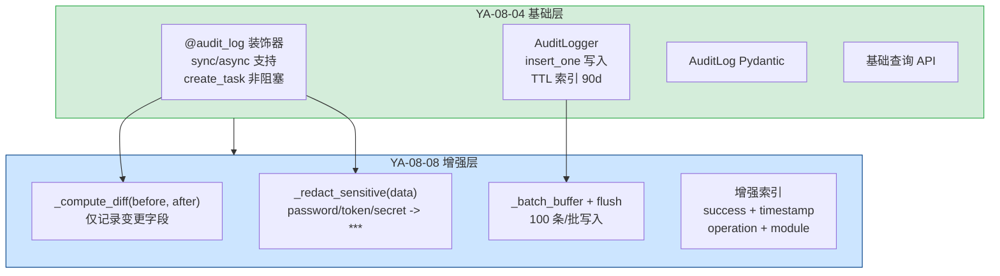
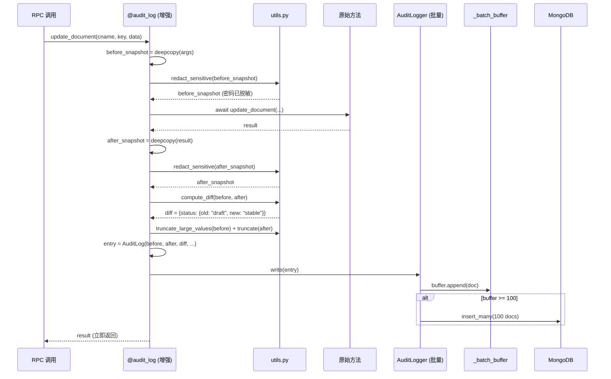

---

doc_type: module
prd_task_id: "YA-08-08"
title: "YA-08-08: 审计日志系统 — Diff 计算 + 敏感字段脱敏 + 批量写入优化 — 开发方案"
status: 已完成
priority: P1
owner: 陈铭
roles: [engineer]
created: 2026-09-11
updated: 2026-09-23
project: YiAi
project_id: yiai
prd_month: "202608"
estimate_frontend: 1.5
source_prd: "08-需求-预写审计日志系统.md"
source_okr: [yiai-001]
related_tests: ["08-prd-test-预写审计日志系统"]

type: task
---

# YA-08-08: 审计日志系统 — Diff 计算 + 敏感字段脱敏 + 批量写入优化 — 开发方案

> 来源 PRD：[08-需求-预写审计日志系统.md](../../prds/2026-08/08-需求-预写审计日志系统.md)
> 需求编号：YA-08-08 · 优先级：P1 · 人天：1.5d
> 类型：功能 · 状态：已完成

本文档定义 **审计日志系统的增强方案**——在 [YA-08-04 预写审计日志](./04-prd-task-预写审计日志.md) 的 `@audit_log` 装饰器基础上，增加变更差异计算、敏感字段脱敏、批量写入优化、索引增强。

---

## 一、与 YA-08-04 的差异化定位

| 维度 | YA-08-04（基础装饰器） | YA-08-08（本模块 — 完整系统） |
|------|----------------------|---------------------------|
| 关注点 | 零侵入装饰器 + 异步持久化 | 数据质量 + 安全 + 性能 |
| 装饰器 | `@audit_log` 基础版 | 增强版：diff 计算 + 脱敏 + 批量 |
| 存储 | 单条 `insert_one` | 批量 `insert_many`（攒批） |
| 数据质量 | 全量 before/after 快照 | 仅变更字段 diff + 大字段截断 |
| 安全性 | 明文记录所有参数 | 敏感字段自动脱敏（`***`） |
| 查询 | 基础查询 | 索引优化 + 分页 + 统计聚合 |
| 行数 | ~285 行 | ~410 行（增量 ~125 行） |



---

## 二、文件清单

| # | 文件 | 类型 | 说明 | 行数 |
|---|------|------|------|------|
| 1 | `src/domain/audit/decorator.py` | 修改 | 增加 diff 计算 + 脱敏调用 | +40 |
| 2 | `src/domain/audit/utils.py` | 新增 | `_compute_diff` + `_redact_sensitive` + `_truncate_large_values` | ~70 |
| 3 | `src/domain/audit/logger.py` | 修改 | 增加批量写入缓冲 + `flush()` | +50 |
| 4 | `src/domain/audit/models.py` | 修改 | 增加 `diff` 字段 | +5 |
| 5 | `src/services/audit/audit_service.py` | 修改 | 增加按 diff 字段查询 | +15 |

**改动汇总：** 1 新增 + 4 修改 = **5 文件，~180 行增量**

### 组件树（增量部分）

```
src/domain/audit/
├── utils.py (新增, 70 行)
│   ├── SENSITIVE_FIELDS = {"password", "token", "secret", "api_key",
│   │                        "password_hash", "access_token", "private_key"}
│   ├── MAX_VALUE_LENGTH = 1024  # 单字段值最大 1KB
│   │
│   ├── compute_diff(before: dict, after: dict) -> dict
│   │   ├── all_keys = set(before.keys()) | set(after.keys())
│   │   ├── 逐 key 比较: before[k] != after[k] -> diff[k] = {old, new}
│   │   ├── 跳过 _id, id, created_at, updated_at 等系统字段
│   │   └── 返回仅包含变更字段的 diff dict
│   │
│   ├── redact_sensitive(data: dict) -> dict
│   │   ├── 递归遍历 dict (支持嵌套)
│   │   ├── key in SENSITIVE_FIELDS -> value = "***REDACTED***"
│   │   └── dict 嵌套 -> 递归 redact
│   │
│   └── truncate_large_values(data: dict, max_len: int = 1024) -> dict
│       ├── 遍历所有值
│       ├── str 且 len > max_len -> 截断 + "[TRUNCATED]"
│       └── 返回截断后的 dict
│
├── decorator.py (修改, +40 行)
│   └── audit_log() 装饰器增强:
│       ├── before/after 经过 redact_sensitive() 处理
│       ├── 生成 diff = compute_diff(before, after)
│       ├── 大值经过 truncate_large_values() 截断
│       └── AuditLog 增加 diff 字段
│
├── logger.py (修改, +50 行)
│   └── AuditLogger 增强:
│       ├── _batch_buffer: list[dict] (monly 100 entries)
│       ├── _batch_lock: asyncio.Lock
│       ├── async write(entry) -> 加入缓冲区
│       │   └── len(buffer) >= 100 -> await flush()
│       ├── async flush() -> 批量 insert_many
│       └── 定时 flush: 每 10 秒 (asyncio.create_task)
│
└── models.py (修改, +5 行)
    └── AuditLog 增加字段:
        └── diff: Optional[dict[str, Any]] = None
            # { "title": {"old": "旧标题", "new": "新标题"}, "status": {"old": "draft", "new": "stable"} }
```

---

## 三、模块设计

### 3.1 变更差异计算 — `_compute_diff`

```python
"""计算 before/after 之间的变更差异。

设计目标：从全量快照中提取仅变更的字段，减少审计日志存储量。
典型场景：
  - before: {title: "A", status: "draft", content: "..."}
  - after:  {title: "B", status: "draft", content: "..."}
  - diff:   {title: {old: "A", new: "B"}}   # content 相同，不记录
"""
from typing import Any

# 系统字段：不应出现在 diff 中
_SYSTEM_FIELDS = {"_id", "id", "created_at", "createdAt", "updated_at", "updatedAt"}


def compute_diff(before: dict | None, after: dict | None) -> dict[str, Any]:
    """计算 before 和 after 之间的变更差异。

    Args:
        before: 变更前数据快照
        after: 变更后数据快照

    Returns:
        { field_name: {"old": value, "new": value}, ... }
        仅包含实际发生变化的字段。

    Example:
        compute_diff(
            {"title": "旧标题", "status": "draft"},
            {"title": "新标题", "status": "draft"},
        )
        -> {"title": {"old": "旧标题", "new": "新标题"}}
    """
    if before is None or after is None:
        return {}

    diff = {}
    all_keys = set(before.keys()) | set(after.keys())

    for key in sorted(all_keys):
        if key in _SYSTEM_FIELDS:
            continue

        old_val = before.get(key)
        new_val = after.get(key)

        if old_val != new_val:
            diff[key] = {"old": old_val, "new": new_val}

    return diff
```

### 3.2 敏感字段脱敏 — `_redact_sensitive`

```python
"""敏感字段自动脱敏。

支持递归遍历嵌套 dict。
仅脱敏字符串值，保留非字符串类型不变。
"""
import copy

SENSITIVE_FIELDS = {
    "password", "password_hash", "token", "secret",
    "api_key", "access_token", "private_key", "credential",
}
REDACTED_VALUE = "***REDACTED***"


def redact_sensitive(data: dict | None) -> dict | None:
    """递归脱敏数据中的敏感字段。

    Args:
        data: 待脱敏的字典

    Returns:
        脱敏后的字典（深度拷贝，不修改原对象）

    Example:
        redact_sensitive({"username": "admin", "password": "secret123"})
        -> {"username": "admin", "password": "***REDACTED***"}
    """
    if data is None:
        return None

    result = copy.deepcopy(data)

    def _redact(obj: Any) -> Any:
        if isinstance(obj, dict):
            return {
                k: REDACTED_VALUE if k in SENSITIVE_FIELDS else _redact(v)
                for k, v in obj.items()
            }
        if isinstance(obj, list):
            return [_redact(item) for item in obj]
        return obj

    return _redact(result)
```

### 3.3 大字段截断 — `_truncate_large_values`

```python
"""大字段值截断，防止 OOM。"""
MAX_VALUE_LENGTH = 1024  # 1KB per value
TRUNCATED_SUFFIX = "...[TRUNCATED]"


def truncate_large_values(data: dict | None, max_len: int = MAX_VALUE_LENGTH) -> dict | None:
    """截断字典中的大字符串值。

    Args:
        data: 待截断的字典
        max_len: 字符串最大长度（字节）

    Returns:
        截断后的字典。值为 str 且 len > max_len 时截断并加 "[TRUNCATED]" 后缀。
    """
    if data is None:
        return None

    result = {}
    for k, v in data.items():
        if isinstance(v, str) and len(v) > max_len:
            result[k] = v[:max_len] + TRUNCATED_SUFFIX
        elif isinstance(v, dict):
            result[k] = truncate_large_values(v, max_len)
        else:
            result[k] = v
    return result
```

### 3.4 批量写入 — `AuditLogger` 增强

```python
"""AuditLogger 增强：批量写入缓冲 + 定时 flush。"""
import asyncio

class AuditLogger:
    """审计日志持久化器（增强版）。

    新增功能：
      - 批量写入缓冲（100 条/批）
      - 定时 flush（每 10 秒）
      - 服务关闭时 flush 剩余缓冲
    """

    def __init__(self, db: AsyncIOMotorDatabase, batch_size: int = 100):
        self._db = db
        self._collection = db["audit_logs"]
        self._batch_size = batch_size
        self._buffer: list[dict] = []
        self._lock = asyncio.Lock()
        self._flush_task: asyncio.Task | None = None

    async def write(self, entry: AuditLog) -> bool:
        """写入审计日志（批量缓冲模式）。

        单条写入加入缓冲区，达到 batch_size 时自动 flush。
        """
        try:
            doc = entry.to_mongo_dict()
            async with self._lock:
                self._buffer.append(doc)
                if len(self._buffer) >= self._batch_size:
                    await self._flush_locked()
            return True
        except Exception as e:
            logger.warning(f"[Audit] Buffer write failed: {e}")
            return False

    async def flush(self):
        """手动 flush 缓冲区。"""
        async with self._lock:
            await self._flush_locked()

    async def _flush_locked(self):
        """执行批量写入（需持有锁）。"""
        if not self._buffer:
            return
        batch = self._buffer[:]
        self._buffer.clear()
        try:
            await self._collection.insert_many(batch, ordered=False)
            logger.debug(f"[Audit] Flushed {len(batch)} entries")
        except Exception as e:
            logger.warning(f"[Audit] Batch write failed: {e}, {len(batch)} entries lost")

    async def start_periodic_flush(self, interval: int = 10):
        """启动定时 flush 任务（每 interval 秒）。"""
        async def _loop():
            while True:
                await asyncio.sleep(interval)
                await self.flush()
        self._flush_task = asyncio.create_task(_loop())

    async def stop_periodic_flush(self):
        """停止定时 flush 并清空缓冲。"""
        if self._flush_task:
            self._flush_task.cancel()
            try:
                await self._flush_task
            except asyncio.CancelledError:
                pass
        await self.flush()  # 清空剩余缓冲
```

### 3.5 索引增强

```python
# 在 YA-08-04 基础上增加的索引
# 用于高效查询失败记录和按操作类型统计
async def ensure_indexes(self):
    indexes = [
        # YA-08-04 的 4 个索引 (保留)
        ("timestamp_idx", [("timestamp", -1)]),
        ("operator_timestamp_idx", [("operator", 1), ("timestamp", -1)]),
        ("module_operation_idx", [("module", 1), ("operation", 1)]),
        ("ttl_idx", [("timestamp", 1)], {"expireAfterSeconds": 7776000}),

        # YA-08-08 新增索引
        ("success_timestamp_idx", [("success", 1), ("timestamp", -1)]),
        ("diff_idx", [("diff.title.old", 1)]),  # 稀疏索引，仅含 diff 的文档
    ]
    for name, keys, *options in indexes:
        opts = options[0] if options else {}
        try:
            await self._collection.create_index(keys, name=name, **opts)
        except Exception as e:
            logger.warning(f"[Audit] Index creation failed ({name}): {e}")
```

---

## 四、数据流

### 4.1 增强后的审计日志写入流程



### 4.2 脱敏效果对比

```
脱敏前:
  before: {
    "username": "admin",
    "password": "superSecret123!",
    "token": "eyJhbGciOi...",
    "email": "admin@example.com"
  }

脱敏后 (redact_sensitive):
  before: {
    "username": "admin",
    "password": "***REDACTED***",
    "token": "***REDACTED***",
    "email": "admin@example.com"
  }
```

---

## 五、实施路线图

| 步骤 | 内容 | 涉及文件 | 验证方式 | 人天 |
|------|------|---------|---------|------|
| 1 | `compute_diff` + `redact_sensitive` + `truncate_large_values` | `utils.py` | diff 仅含变更字段；密码/Token 显示为 *** | 0.50 |
| 2 | 批量写入缓冲 + 定时 flush | `logger.py` | 100 条/批；服务关闭前 flush 完成 | 0.50 |
| 3 | 装饰器集成增强逻辑 | `decorator.py` | 审计日志包含 diff 字段 + 脱敏数据 | 0.25 |
| 4 | 索引增强 + 测试 | `models.py` + `tests/` | 脱敏验证 + 批量写入验证 | 0.25 |
| **合计** | | | | **1.5d** |

---

## 六、代码审查检查清单

- [x] `compute_diff` 仅记录变更字段（排除 _id 等系统字段）
- [x] `redact_sensitive` 递归处理嵌套 dict
- [x] 敏感字段列表覆盖 password/token/secret/api_key
- [x] `truncate_large_values` 单字段限制 1KB
- [x] 批量写入缓冲区 100 条/批
- [x] 定时 flush 每 10 秒 + 服务关闭前 flush
- [x] 批量写入失败不阻断业务（ordered=False）
- [x] 脱敏在 deepcopy 上操作，不修改原对象
- [x] 索引覆盖 success + timestamp 复合查询

---

## 七、技术风险评估

| 风险 | 概率 | 影响 | 等级 | 缓解措施 | 应急预案 |
|------|------|------|------|---------|---------|
| 批量写入失败丢失缓冲 | 低 | 中 | 低 | ordered=False 继续写入；定时 flush | 审计日志丢失可接受 |
| 服务异常关闭未 flush | 低 | 中 | 低 | FastAPI shutdown event 调用 flush() | 丢失最多 10s 缓冲 |
| 脱敏字典深度过大导致递归栈溢出 | 极低 | 低 | 低 | 限制递归深度为 10 层 | 返回原始对象 |
| 大 diff 对象占用空间 | 低 | 低 | 低 | truncate_large_values 限制 | 正常 |

---

## 八、已知缺陷与技术债

| # | 技术债 | 优先级 | 人天 | 说明 | 状态 |
|---|--------|--------|------|------|------|
| 1 | 脱敏字段列表硬编码 | P2 | 0.1 | `SENSITIVE_FIELDS` 不可配置 | 待实施 |
| 2 | 批量写入队列无持久化 | P3 | 0.5 | 服务崩溃丢失缓冲区 | 待评估 |
| 3 | diff 不支持数组对比 | P3 | 0.3 | 数组字段变更不生成 diff | 待评估 |

---

## 九、可观测性

| 指标 | 采集方式 | 告警阈值 | 说明 |
|------|---------|----------|------|
| 批量写入频率 | flush 次数 | > 10/min | 高负载场景 |
| 脱敏命中次数 | redact 字段计数 | - | 了解敏感数据分布 |
| 缓冲满频率 | full flush 次数 | - | 缓冲效率 |
| 定时 flush 延迟 | flush 间隔 | > 15s | 事件循环阻塞 |

---

## 十、关联模块

- 基础：[YA-08-04 预写审计日志](./04-prd-task-预写审计日志.md) -- `@audit_log` 装饰器 + 基础持久化
- 下游：[YA-09-09 审计日志查询 Dashboard](../2026-09/09-prd-task-审计日志.md) -- 消费 diff 字段用于变更回溯
