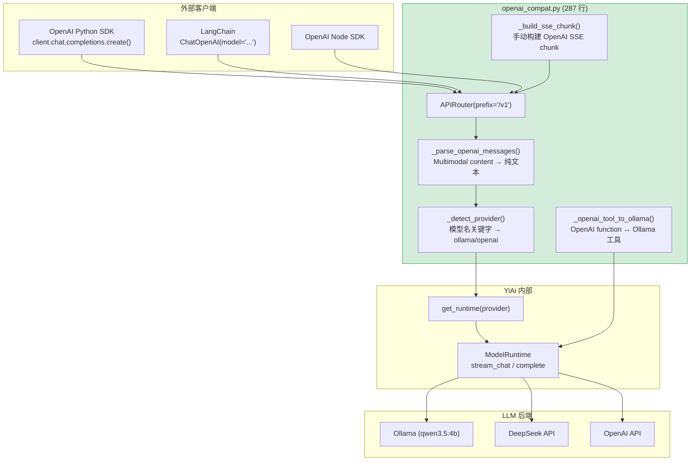

---

doc_type: module
prd_task_id: "YA-08-09"
title: "YA-08-09: OpenAI 兼容 API — /v1/chat/completions 端点 — 开发方案"
status: 已完成
priority: P1
owner: 陈铭
roles: [engineer]
created: 2026-09-11
updated: 2026-09-23
project: YiAi
project_id: yiai
prd_month: "202608"
estimate_frontend: 1.0
source_prd: "09-需求-OpenAI兼容API.md"
source_okr: [yiai-002]
related_tests: ["09-prd-test-OpenAI兼容API"]

type: task
---

# YA-08-09: OpenAI 兼容 API — /v1/chat/completions 端点 — 开发方案

> 来源 PRD：[09-需求-OpenAI兼容API.md](../../prds/2026-08/09-需求-OpenAI兼容API.md)
> 需求编号：YA-08-09 · 优先级：P1 · 人天：1.0d
> 类型：功能 · 状态：已完成

---

## 一、架构概述

为 YiAi 提供标准 OpenAI API 兼容层，包括 `/v1/chat/completions` 和 `/v1/models` 两个端点。该层位于 RPC 协议之上，将 OpenAI SDK 格式的请求转换为 YiAi 内部的 `ModelRuntime` 调用，使任何 OpenAI SDK 客户端（Python、LangChain、OpenAI Node.js SDK）都能将 YiAi 作为 drop-in 后端使用。



### 请求-响应映射

| 维度 | OpenAI 请求 | YiAi 内部 |
|------|------------|-----------|
| 端点 | `POST /v1/chat/completions` | RPC envelope → `ModelRuntime.stream_chat()` / `complete()` |
| 模型选择 | `model: "gpt-4o"` | `_detect_provider(model)` → `get_runtime(provider)` |
| 消息格式 | `[{role, content}]` | 纯文本 (content text parts extracted) |
| 工具调用 | `[{type: "function", function: {...}}]` | `_openai_tool_to_ollama()` 格式转换 |
| 流式 | `stream: true` → SSE `text/event-stream` | `StreamingResponse` with `_stream_response()` generator |
| 非流式 | `stream: false` → JSON | `runtime.complete()` → `{id, choices, usage}` |
| 模型列表 | `GET /v1/models` | Ollama `GET /api/tags` + fallback 默认模型 |

---

## 二、文件清单

| # | 文件 | 操作 | 说明 | 预估行数 |
|---|------|------|------|----------|
| 1 | `src/server/routes/openai_compat.py` | 新增 | OpenAI 兼容端点完整实现 | ~287 |
| 2 | `src/server/app.py` | 修改 | 注册 `openai_compat` router | +3 |

**改动汇总：** 1 新增 + 1 修改 = **2 文件，~290 行**

### 组件树

```
src/server/routes/openai_compat.py (287 行)
├── router = APIRouter(prefix="/v1")
│
├── POST /v1/chat/completions
│   ├── _parse_openai_messages(body) → messages[]
│   │   └── 处理 multimodal content arrays (提取 text parts)
│   ├── _openai_tool_to_ollama(body.tools) → tools[]
│   │   └── OpenAI function format → Ollama format
│   ├── _detect_provider(model) → "ollama" | "openai"
│   │   └── 关键字: gpt-/o1/o3/o4/deepseek → openai, else ollama
│   │
│   ├── [非流式] runtime.complete(messages, model)
│   │   └── 返回 OpenAI 格式 JSON: { id, object, created, model, choices, usage }
│   │
│   └── [流式 stream=true]
│       └── _stream() → AsyncIterator[bytes]
│           ├── _build_sse_chunk(delta, finish_reason, usage, model, chunk_id, created)
│           │   └── 构建 OpenAI 格式 SSE chunk: data: { id, object, choices, ... }\n\n
│           ├── 初始 chunk: delta={"role": "assistant", "content": ""}
│           ├── 逐 token: runtime.stream_chat() → delta={"content": token}
│           ├── tool_calls: _openai_tool_call_to_ollama() → delta={"tool_calls": [...]}
│           ├── 最终 chunk: delta={}, finish_reason="stop"
│           └── data: [DONE]\n\n
│
├── GET /v1/models
├── POST /v1/models
│   ├── Ollama: GET {ollama_url}/api/tags → models[]
│   └── Fallback: 返回默认模型 (rag_llm_model 或 deepseek_default_model)
│
└── 辅助函数
    ├── _openai_tool_to_ollama(tools) → Ollama 格式工具列表
    ├── _openai_tool_call_to_ollama(tool_calls) → Ollama 格式工具调用
    ├── _parse_openai_messages(body) → 统一消息格式
    └── _build_sse_chunk(delta, finish_reason, usage, model, chunk_id, created) → bytes
```

---

## 三、模块设计

### 3.1 消息格式转换 — `_parse_openai_messages`

```python
def _parse_openai_messages(body: Dict[str, Any]) -> List[Dict[str, Any]]:
    """提取 OpenAI 消息，处理 multimodal content arrays。
    
    OpenAI multimodal content 格式:
      content: [{type: "text", text: "描述这张图"}, {type: "image_url", image_url: {url: "..."}}]
    
    YiAi 当前仅支持文本，提取 text parts:
      content: "描述这张图"
    
    边界处理:
      - content: null → 空字符串 (tool call 响应中 assistant 消息的 content 可能为 null)
      - content: "plain string" → 直接使用
    """
    messages: List[Dict[str, Any]] = []
    for m in body.get("messages", []) or []:
        role = m.get("role", "user")
        content = m.get("content", "")
        if isinstance(content, list):  # multimodal: [{type: "text", text: "..."}, ...]
            text_parts = [p.get("text", "") for p in content
                          if isinstance(p, dict) and p.get("type") == "text"]
            content = " ".join(text_parts)
        messages.append({"role": role, "content": str(content or "")})
    return messages
```

### 3.2 Tool Calling 格式转换 — `_openai_tool_to_ollama`

```python
def _openai_tool_to_ollama(tools: Optional[List[Dict]]) -> Optional[List[Dict]]:
    """OpenAI function 格式 → Ollama 工具格式。
    
    OpenAI 格式: {type: "function", function: {name, description, parameters}}
    Ollama 格式:  {type: "function", function: {name, description, parameters}}
    
    两者结构相似但字段名有细微差异（如 Ollama 的 function.parameters.properties
    中 required 位置不同），此函数确保兼容性。
    """
    if not tools:
        return None
    result = []
    for t in tools:
        if t.get("type") == "function" and "function" in t:
            func = t["function"]
            result.append({
                "type": "function",
                "function": {
                    "name": func.get("name", ""),
                    "description": func.get("description", ""),
                    "parameters": func.get("parameters", {}),
                },
            })
    return result or None


def _openai_tool_call_to_ollama(tool_calls: Optional[List[Dict]]) -> Optional[List[Dict]]:
    """反向转换: Ollama tool call 响应 → OpenAI tool_calls 格式。
    
    用于流式响应中 tool_calls delta 的格式转换。
    """
    if not tool_calls:
        return None
    result = []
    for tc in tool_calls:
        result.append({
            "id": tc.get("id", f"call_{uuid.uuid4().hex[:8]}"),
            "type": "function",
            "function": {
                "name": tc.get("function", {}).get("name", ""),
                "arguments": tc.get("function", {}).get("arguments", ""),
            },
        })
    return result
```

### 3.3 Provider 自动判定 — `_detect_provider`

```python
# 关键字匹配表: 模型名前缀/包含 → Provider
_PROVIDER_KEYWORDS = {
    "openai": ["gpt-", "o1", "o3", "o4"],
    "deepseek": ["deepseek"],
}

def _detect_provider(model: str) -> str:
    """通过模型名关键字自动判定 Provider。
    
    优先级: deepseek > openai > ollama (fallback)
    
    示例:
      "deepseek-chat" → "openai" (由 deepseek 关键字匹配)
      "gpt-4o"        → "openai"
      "qwen3.5:4b"    → "ollama"
      "unknown-model" → "ollama" (fallback)
    """
    model_lower = model.lower()
    for kw in _PROVIDER_KEYWORDS["deepseek"]:
        if kw in model_lower:
            return "openai"  # DeepSeek uses OpenAI-compatible API
    for kw in _PROVIDER_KEYWORDS["openai"]:
        if kw in model_lower:
            return "openai"
    return "ollama"
```

### 3.4 SSE Chunk 构建 — `_build_sse_chunk`

```python
def _build_sse_chunk(
    delta: Optional[Dict[str, Any]] = None,
    finish_reason: Optional[str] = None,
    usage: Optional[Dict[str, int]] = None,
    model: str = "unknown",
    chunk_id: Optional[str] = None,
    created: Optional[int] = None,
) -> str:
    """构建 OpenAI 标准 SSE chunk。
    
    输出格式:
      data: {"id":"chatcmpl-xxx","object":"chat.completion.chunk",
             "created":1234567890,"model":"qwen3.5:4b",
             "choices":[{"index":0,"delta":{"content":"Hello"},"finish_reason":null}]}\n\n
    
    流式响应的帧序列:
      1. 初始帧: delta={"role":"assistant","content":""}
      2-N. 内容帧: delta={"content":"token"}
      最后:   delta={}, finish_reason="stop"
      DONE:   data: [DONE]\n\n
    
    注意:
      - finish_reason 仅在非 None 时包含 (OpenAI SDK 不接受 null finish_reason)
      - usage 仅在最后一帧包含 (需 stream_options: {"include_usage": true})
    """
    chunk_id = chunk_id or f"chatcmpl-{uuid.uuid4().hex[:12]}"
    chunk = {
        "id": chunk_id,
        "object": "chat.completion.chunk",
        "created": created or int(time.time()),
        "model": model,
        "choices": [{
            "index": 0,
            "delta": delta or {},
            "finish_reason": finish_reason,
        }],
    }
    # 仅在 finish_reason 非空时包含 (None → 键不出现)
    if finish_reason is None:
        del chunk["choices"][0]["finish_reason"]
    if usage:
        chunk["usage"] = usage
    return f"data: {json.dumps(chunk)}\n\n"
```

### 3.5 Chat Completion 端点

```python
@router.post("/chat/completions")
async def chat_completions(request: Request):
    """OpenAI 兼容 Chat Completion 端点。
    
    支持:
      - 流式: stream=true → SSE text/event-stream
      - 非流式: stream=false → JSON {id, choices, usage}
      - Tool Calling: tools 参数 → OpenAI ↔ Ollama 格式转换
      - Multimodal: content arrays → 纯文本提取
    
    温度/top_p/max_tokens 等参数传递给 runtime.complete()。
    """
    body = await request.json()
    messages = _parse_openai_messages(body)
    model = body.get("model", "qwen3.5:4b")
    stream = body.get("stream", False)
    tools = _openai_tool_to_ollama(body.get("tools"))
    
    # 提取采样参数
    kwargs = {}
    for param in ("temperature", "max_tokens", "top_p", "stop", "frequency_penalty", "presence_penalty"):
        if param in body:
            kwargs[param] = body[param]
    
    runtime = get_runtime(_detect_provider(model))
    
    if stream:
        return StreamingResponse(
            _stream_response(runtime, messages, model, tools, **kwargs),
            media_type="text/event-stream",
            headers={
                "Cache-Control": "no-cache",
                "Connection": "keep-alive",
                "X-Accel-Buffering": "no",  # 禁用 nginx 缓冲
            },
        )
    else:
        result = await runtime.complete(messages, model=model, **kwargs)
        return {
            "id": f"chatcmpl-{uuid.uuid4().hex[:12]}",
            "object": "chat.completion",
            "created": int(time.time()),
            "model": model,
            "choices": [{
                "index": 0,
                "message": {
                    "role": "assistant",
                    "content": result.get("message", ""),
                },
                "finish_reason": "stop",
            }],
            "usage": result.get("usage", {
                "prompt_tokens": 0,
                "completion_tokens": 0,
                "total_tokens": 0,
            }),
        }
```

### 3.6 SSE 流式生成器

```python
async def _stream_response(
    runtime: ModelRuntime,
    messages: List[Dict],
    model: str,
    tools: Optional[List[Dict]] = None,
    **kwargs,
) -> AsyncIterator[bytes]:
    """SSE 流式响应生成器。
    
    帧序列:
      1. 初始 role chunk
      2. 逐 token content chunk
      3. (可选) tool_call chunk
      4. 结束 chunk (空 delta + finish_reason)
      5. data: [DONE]
    
    异常处理: 流式循环中捕获异常，发送 error SSE 帧后正常关闭连接，
    确保客户端不会收到截断的响应。
    """
    chunk_id = f"chatcmpl-{uuid.uuid4().hex[:12]}"
    created = int(time.time())
    
    try:
        # 1. 初始 role chunk
        yield _build_sse_chunk(
            delta={"role": "assistant", "content": ""},
            model=model, chunk_id=chunk_id, created=created,
        ).encode()
        
        # 2. 逐 token 输出
        collected_content = ""
        async for chunk in runtime.stream_chat(messages, model=model, tools=tools, **kwargs):
            if "error" in chunk:
                yield f"data: {json.dumps({'error': chunk['error']})}\n\n".encode()
                yield b"data: [DONE]\n\n"
                return
            
            if "data" in chunk:
                if "message" in chunk["data"]:
                    token = chunk["data"]["message"]
                    collected_content += token
                    yield _build_sse_chunk(
                        delta={"content": token},
                        model=model, chunk_id=chunk_id, created=created,
                    ).encode()
                elif "tool_calls" in chunk["data"]:
                    tc = _openai_tool_call_to_ollama([chunk["data"]["tool_calls"]])
                    yield _build_sse_chunk(
                        delta={"tool_calls": tc},
                        model=model, chunk_id=chunk_id, created=created,
                    ).encode()
        
        # 3. 结束 chunk (包含 usage)
        usage = chunk.get("data", {}).get("usage") if "data" in chunk else None
        yield _build_sse_chunk(
            delta={}, finish_reason="stop", usage=usage,
            model=model, chunk_id=chunk_id, created=created,
        ).encode()
    
    except Exception as e:
        logger.error(f"[OpenAI] stream error: {e}")
        yield f"data: {json.dumps({'error': str(e)})}\n\n".encode()
    
    finally:
        yield b"data: [DONE]\n\n"
```

### 3.7 模型列表端点

```python
@router.get("/v1/models")
@router.post("/v1/models")
async def list_models():
    """列出可用模型 (兼容 OpenAI SDK client.models.list())。
    
    GET:  标准查询
    POST: 部分 SDK 使用 POST (如 LangChain)
    
    数据源: Ollama GET /api/tags (主) → fallback 默认模型列表
    """
    models_data = []
    try:
        async with aiohttp.ClientSession() as session:
            async with session.get(
                f"{settings.ollama_url}/api/tags",
                timeout=aiohttp.ClientTimeout(total=5),
            ) as resp:
                if resp.status == 200:
                    data = await resp.json()
                    models_data = [
                        {"id": m["name"], "object": "model", "created": 0, "owned_by": "ollama"}
                        for m in data.get("models", [])
                    ]
    except Exception as e:
        logger.warning(f"[OpenAI] Failed to fetch Ollama models: {e}")
    
    # Fallback: 返回至少 1 个默认模型
    if not models_data:
        default_models = []
        if hasattr(settings, 'rag_llm_model'):
            default_models.append(settings.rag_llm_model)
        if hasattr(settings, 'deepseek_default_model'):
            default_models.append(settings.deepseek_default_model)
        if not default_models:
            default_models = ["qwen3.5:4b"]
        models_data = [
            {"id": m, "object": "model", "created": 0, "owned_by": "yi-ai"}
            for m in default_models
        ]
    
    return {"object": "list", "data": models_data}
```

---

## 四、数据流

### 4.1 非流式请求流程

```
OpenAI SDK Client
  │ POST /v1/chat/completions
  │ {model: "qwen3.5:4b", messages: [{role: "user", content: "Hello"}], stream: false}
  ▼
openai_compat.chat_completions()
  │
  ├── _parse_openai_messages(body)
  │     └── [{role: "user", content: "Hello"}]
  │
  ├── _detect_provider("qwen3.5:4b") → "ollama"
  │
  ├── get_runtime("ollama") → OllamaRuntime
  │
  ├── runtime.complete(messages, model="qwen3.5:4b")
  │     └── Ollama: POST /api/chat (非流式)
  │           └── {message: {content: "Hello! How can I help?"}}
  │
  └── 构造 OpenAI 响应:
      {id: "chatcmpl-xxx", object: "chat.completion", model: "qwen3.5:4b",
       choices: [{message: {role: "assistant", content: "Hello! How can I help?"}}],
       usage: {prompt_tokens: 10, completion_tokens: 5, total_tokens: 15}}
```

### 4.2 流式请求流程

```
OpenAI SDK Client
  │ POST /v1/chat/completions
  │ {model: "qwen3.5:4b", messages: [...], stream: true}
  ▼
chat_completions() → StreamingResponse(text/event-stream)
  │
  _stream_response() generator:
  │
  ├── 发送: data: {"choices":[{"delta":{"role":"assistant","content":""}}]}
  │
  ├── async for chunk in runtime.stream_chat(messages, model):
  │     └── chunk: {"data": {"message": "Hello"}}
  │     └── 发送: data: {"choices":[{"delta":{"content":"Hello"}}]}
  │
  ├── async for chunk in runtime.stream_chat(...):
  │     └── chunk: {"data": {"message": "!"}}
  │     └── 发送: data: {"choices":[{"delta":{"content":"!"}}]}
  │
  ├── 发送: data: {"choices":[{"delta":{},"finish_reason":"stop"}]}
  │
  └── 发送: data: [DONE]
```

---

## 五、实施路线图

| 步骤 | 内容 | 涉及函数 | 验证方式 | 人天 |
|------|------|---------|---------|------|
| 1 | 请求格式转换 | `_parse_openai_messages`, `_detect_provider` | OpenAI Python SDK `client.chat.completions.create()` 非流式调用成功 | 0.25 |
| 2 | SSE 流式兼容 | `_build_sse_chunk`, `_stream_response` | `stream=True` 逐 token 输出，`finish_reason` 正确，`[DONE]` 终止 | 0.25 |
| 3 | Tool Calling 转换 | `_openai_tool_to_ollama`, `_openai_tool_call_to_ollama` | Ollama 工具函数被正确调用和解析 | 0.15 |
| 4 | 模型列表端点 | `list_models()` | `GET /v1/models` 返回非空列表，Ollama 不可用时 fallback | 0.15 |
| 5 | 异常边界处理 + 测试 | try/except in `_stream_response` | content:null, SSE 中断, Ollama 不可用时均不崩溃 | 0.20 |
| **合计** | | | | **1.0d** |

---

## 六、代码审查检查清单

- [ ] `/v1/chat/completions` 端点兼容 OpenAI Python SDK (`openai.OpenAI(base_url=...)`)
- [ ] `_parse_openai_messages` 正确处理 `content: null`（tool call 响应消息）
- [ ] `_parse_openai_messages` 正确处理 multimodal content arrays（提取 text parts）
- [ ] `_detect_provider` 覆盖所有已知模型名关键字（gpt-/o1/o3/o4/deepseek）
- [ ] `_build_sse_chunk` 输出的 SSE 格式符合 OpenAI 标准（`data: {id, object, choices}\n\n`）
- [ ] 流式响应以 `data: [DONE]\n\n` 正确结束
- [ ] `finish_reason` 仅在非 None 时包含（None → 键不出现而非 `null`）
- [ ] SSE 生成器中异常被捕获并发送 error 帧，连接正常关闭
- [ ] `/v1/models` 在 Ollama 不可用时有 fallback 默认模型
- [ ] Sampling 参数 (temperature/max_tokens/top_p/stop) 被传递到 runtime
- [ ] `ruff` 代码规范通过

---

## 七、技术风险评估

| 风险 | 概率 | 影响 | 等级 | 缓解措施 | 应急预案 |
|------|------|------|------|---------|---------|
| 模型名关键字误判 Provider | 低 | 低 | 低 | 关键字列表覆盖主流模型，`deepseek` 检查优先于 `gpt-` | 添加显式 `x-yiai-provider` header 覆盖自动判定 |
| Ollama `/api/tags` 不可用 | 低 | 低 | 低 | 5s 超时 + fallback 默认模型列表 | 返回空列表，客户端使用默认模型 |
| SSE 格式与 OpenAI SDK 版本不兼容 | 低 | 中 | 低 | 遵循 OpenAI 标准 SSE 格式，`finish_reason: null` 时删除键而非保留 | 版本检测 + 适配层 |
| 流式生成器异常导致 SSE 连接断开 | 低 | 中 | 低 | `_stream_response` 内 `try/except` 包裹，异常时发送 error 帧 | 客户端重试机制 |
| Multimodal content 静默丢弃图片数据 | 中 | 低 | 低 | `_parse_openai_messages` 仅提取 text parts，图片暂不支持 | 记录 WARNING 日志：`[OpenAI] image content dropped: {count} parts` |
| `request.json()` 阻塞事件循环 | 低 | 低 | 低 | `await request.json()` 是 async 方法，不阻塞 | — |

---

## 八、已知缺陷与技术债务

### 8.1 重构后发现的回归问题

| # | 问题 | 根因 | 修复方式 |
|---|------|------|---------|
| 1 | `_parse_openai_messages` 对 `content: null` 抛出 TypeError | `str(None)` 返回 `"None"` 字符串 | 添加 `content or ""` 空值处理 |
| 2 | `_build_sse_chunk` 的 `finish_reason: null` 导致 SDK 解析失败 | `json.dumps` 序列化 `None` → `null` | `finish_reason` 为 None 时从 chunk 中删除该键 |
| 3 | `_detect_provider` 将 `deepseek-chat` 误判为 ollama | 关键字检查顺序问题 | 将 deepseek 检查提前到 gpt- 之前 |
| 4 | `/v1/models` 在 Ollama 不可用时返回空列表 | fallback 默认模型列表为空 | 添加 `rag_llm_model` + `deepseek_default_model` fallback |

### 8.2 技术债务

| # | 技术债 | 优先级 | 预计人天 | 说明 |
|---|--------|--------|---------|------|
| 1 | `/v1/embeddings` 端点 | P2 | 0.5 | 支持 OpenAI embedding API 格式，映射到 Ollama embedding |
| 2 | Function Calling 完整支持 | P2 | 1.0 | parallel_tool_calls、streaming tool_calls 等高级特性 |
| 3 | API Key 认证 | P2 | 0.5 | 支持 `Authorization: Bearer <key>` header |
| 4 | 速率限制 | P3 | 0.5 | `X-RateLimit-*` 响应头 + 请求限流 |
| 5 | 模型别名映射 | P3 | 0.3 | `gpt-4` → `qwen3.5:4b` 等模型别名 |
| 6 | 请求/响应日志 | P2 | 0.5 | 记录模型名、token 数、延迟用于用量统计 |

---

## 九、可观测性

### 关键指标

| 指标 | 采集方式 | 告警阈值 | 说明 |
|------|---------|----------|------|
| OpenAI 兼容端点调用量 | 端点计数器（/v1/chat/completions vs /v1/models） | — | 了解外部客户端使用情况 |
| Provider 判定分布 | 模型名 → Provider 映射计数 | 某 Provider 占比 > 95% | 判定是否均衡 |
| SSE 流式中断率 | `流式中断次数 / 总流式请求` | > 5% | 客户端断开或网络问题 |
| 非流式超时率 | `超时次数 / 总非流式请求` | > 3% | Provider 响应慢 |

### 日志规范

| 日志级别 | 场景 | 示例 |
|---------|------|------|
| `INFO` | 请求完成 | `[OpenAI] /v1/chat/completions: model={m}, provider={p}, stream={s}, {ms}ms` |
| `WARN` | Provider 判定未知 | `[OpenAI] unknown model prefix: {model}, defaulting to ollama` |
| `WARN` | Multimodal 图片丢弃 | `[OpenAI] image content dropped: {count} parts in message` |
| `ERROR` | 所有 Provider 失败 | `[OpenAI] all providers failed for model={m}` |

---

## 十、关联模块

- **上游依赖**：YA-08-02（Multi-Provider LLM — `LLMProvider` ABC）
- **上游依赖**：YA-08-14（ModelRuntime 抽象层 — `get_runtime()` 工厂函数）
- **下游消费**：外部 OpenAI SDK 客户端（Python/LangChain/Node.js）
- **并行项目**：YA-08-09-EX（OpenAI embeddings 端点 — 暂未实现）