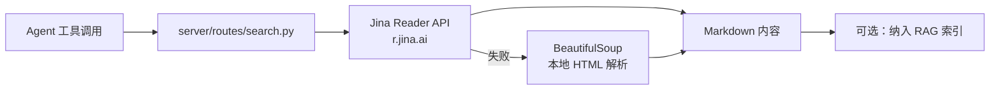

# YA-08-10: Web 搜索与内容提取 — Jina Reader + BeautifulSoup 双层管线 — 开发方案

> 来源 PRD：[10-需求-Web搜索与内容提取.md](../../prds/2026-08/10-需求-Web搜索与内容提取.md)
> 需求编号：YA-08-10 · 优先级：P1 · 人天：1.0d
> 类型：功能 · 状态：已完成

---

## 一、方案概述

为 Agent 提供 Web 搜索和内容提取能力。双层管线：优先 Jina Reader API（结构化提取），失败回退 BeautifulSoup（直接解析 HTML）。

---

## 二、实施步骤

| 步骤 | 内容 | 验证 | 人天 |
|------|------|------|------|
| 1 | Jina Reader API 集成 | URL → Markdown 提取成功 | 0.25 |
| 2 | BeautifulSoup 回退 | JS 渲染页面降级解析 | 0.25 |
| 3 | Agent 工具注册 + 搜索端点 | `web_search(url)` 工具可用 | 0.25 |
| 4 | 测试 | 双层管线切换验证 | 0.25 |

**合计：1.0d**。

---

## 三、关联模块

- 消费：[YA-08-13 Agent 工具系统](./13-prd-task-Agent工具系统.md)——作为 Agent 内置工具