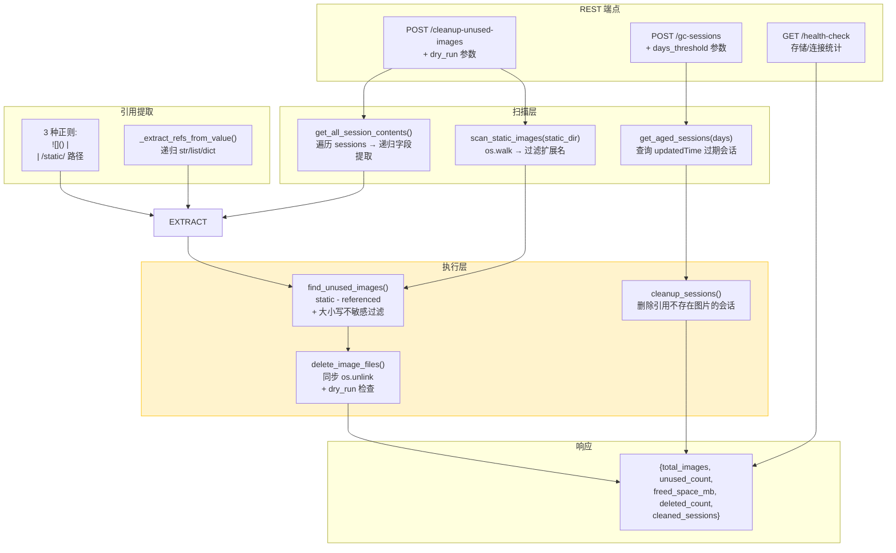

---

doc_type: module
prd_task_id: "YA-08-11"
title: "YA-08-11: 维护工具服务 — 未引用图片清理 + 会话垃圾回收 + 健康检查 — 开发方案"
status: 已完成
priority: P2
owner: 陈铭
roles: [engineer]
created: 2026-09-11
updated: 2026-09-23
project: YiAi
project_id: yiai
prd_month: "202608"
estimate_frontend: 0.5
source_prd: "11-需求-维护工具服务.md"
source_okr: [yiai-003]
related_tests: ["11-prd-test-维护工具服务"]

type: task
---

# YA-08-11: 维护工具服务 — 未引用图片清理 + 会话垃圾回收 + 健康检查 — 开发方案

> 来源 PRD：[11-需求-维护工具服务.md](../../prds/2026-08/11-需求-维护工具服务.md)
> 需求编号：YA-08-11 · 优先级：P2 · 人天：0.5d
> 类型：功能 · 状态：已完成

---

## 一、架构概述

为 YiAi 提供系统级运维维护能力，包括 3 个端点：`/maintenance/cleanup-unused-images`（未引用图片识别与清理）、`/maintenance/gc-sessions`（过期会话垃圾回收）、`/maintenance/health-check`（存储/连接状态检查）。核心设计原则是 **dry_run 默认安全** —— 所有破坏性操作默认仅预览。



### dry_run 安全模型

| 操作 | dry_run=true (默认) | dry_run=false |
|------|---------------------|---------------|
| 图片扫描 | 扫描并统计，不删除 | 扫描后执行 os.unlink |
| 会话 GC | 标记过期会话，不删除 | 删除过期会话 |
| 空间统计 | 计算可回收空间 (预估) | 返回实际回收空间 |
| 日志记录 | INFO: preview mode | INFO: executed + WARN: deleted files list |

---

## 二、文件清单

| # | 文件 | 操作 | 说明 | 预估行数 |
|---|------|------|------|----------|
| 1 | `src/server/routes/maintenance.py` | 新增 | 3 个维护端点 + 扫描/引用提取/清理函数 | ~268 |
| **合计** | | | | **~268 行** |

### 组件树

```
maintenance.py (268 行)
├── Pydantic 请求模型
│   ├── CleanupRequest { dry_run: bool, cleanup_sessions: bool }
│   └── GcSessionsRequest { days_threshold: int, dry_run: bool }
│
├── POST /maintenance/cleanup-unused-images
│   ├── 1. scan_static_images(static_dir) → Set[path]
│   │     └── os.walk → 过滤 IMAGE_EXTENSIONS (.png/.jpg/.jpeg/.gif/.webp/.svg/.bmp/.ico)
│   │
│   ├── 2. get_all_session_contents() → (referenced_images, all_sessions)
│   │     └── get_all_sessions() → 遍历所有会话文档
│   │           └── _extract_refs_from_value(field_value) → 递归提取图片引用
│   │                 ├── Markdown  图片
│   │                 ├── HTML  标签
│   │                 └── /static/ 路径引用
│   │
│   ├── 3. find_unused_images(static, referenced) → Set[unused]
│   │     └── static - referenced (大小写不敏感二次过滤)
│   │
│   ├── 4. 计算统计 (total_size, unused_list)
│   │
│   ├── 5. delete_image_files(static_dir, unused, dry_run)
│   │     └── 逐个 unlink + 统计 freed_space
│   │
│   └── 6. cleanup_sessions_with_missing_images() [可选]
│         └── 遍历 sessions → 检查图片引用是否存在 → 删除无效会话
│
├── POST /maintenance/gc-sessions
│   └── gc_sessions(days_threshold, dry_run)
│         └── 删除 updatedTime 超过 N 天的会话
│
├── GET /maintenance/health-check
│   └── 返回: 各集合文档数、存储大小、数据库连接状态
│
└── 辅助函数
    ├── is_image_file(filepath) → bool
    ├── scan_static_images(static_dir) → Set[str]
    ├── extract_referenced_images(text) → Set[str]
    │   └── 3 种正则: Markdown 、HTML 、/static/ 路径
    ├── _extract_refs_from_value(value) → Set[str] (递归处理 str/list/dict)
    ├── _normalize_url(url) → 规范化 URL
    ├── find_unused_images(static, referenced) → Set[str]
    └── delete_image_files(static_dir, unused, dry_run) → (count, bytes)
```

---

## 三、模块设计

### 3.1 图片扫描 — `scan_static_images`

```python
IMAGE_EXTENSIONS = {'.png', '.jpg', '.jpeg', '.gif', '.webp', '.svg', '.bmp', '.ico'}

def is_image_file(filepath: str) -> bool:
    """检查文件是否为支持的图片格式。"""
    return Path(filepath).suffix.lower() in IMAGE_EXTENSIONS

def scan_static_images(static_dir: str) -> Set[str]:
    """递归扫描 static/ 目录，返回所有图片文件的相对路径集合。
    
    返回示例: {"uploads/photo.png", "avatars/user_123.jpg", ...}
    路径相对于 static_dir，使用正斜杠。
    
    边界处理:
      - static/ 目录不存在 → 返回空集合 + WARNING 日志
      - 符号链接不跟随 (followlinks=False)
    """
    static_path = Path(static_dir)
    if not static_path.exists():
        logger.warning(f"[Maintenance] static dir does not exist: {static_dir}")
        return set()
    
    image_paths = set()
    for root, _, files in os.walk(static_path, followlinks=False):
        for file in files:
            if is_image_file(file):
                full_path = Path(root) / file
                rel_path = full_path.relative_to(static_path)
                image_paths.add(str(rel_path).replace('\\', '/'))
    return image_paths
```

### 3.2 引用提取 — `extract_referenced_images` + 递归提取

```python
# 3 种引用格式正则
IMAGE_PATTERNS = [
    re.compile(r'!\[.*?\]\((.*?)\)', re.IGNORECASE),                    # Markdown 
    re.compile(r']+src=["\'](.*?)["\']', re.IGNORECASE),         # HTML 
    re.compile(r'(?:https?://[^/]+)?/static/([^\s"\'<>]+)', re.IGNORECASE),  # /static/ 路径
]

def extract_referenced_images(text: str) -> Set[str]:
    """从文本中提取被引用的图片路径。
    
    处理 3 种引用格式:
      1. Markdown: 
      2. HTML: 
      3. 裸路径: /static/data/image.png
    
    返回: 所有被引用的图片相对路径集合
      {"img/photo.png", "uploads/screenshot.jpg", ...}
    
    路径归一化: 去除查询参数(?)、锚点(#)、前导 /static/
    """
    referenced = set()
    for pattern in IMAGE_PATTERNS:
        matches = pattern.findall(text)
        for match in matches:
            url = match.strip()
            if not url:
                continue
            # 去除查询参数和锚点
            url = url.split('?')[0].split('#')[0]
            # 提取 /static/ 后的相对路径
            if '/static/' in url:
                rel_path = url.split('/static/', 1)[1]
                referenced.add(rel_path)
            elif url.startswith('static/'):
                referenced.add(url[len('static/'):])
            elif url.startswith('/static/'):
                referenced.add(url[len('/static/'):])
            else:
                referenced.add(url)
    return referenced


def _extract_refs_from_value(field_value: Any) -> Set[str]:
    """递归遍历任意嵌套结构中提取图片引用。
    
    处理类型: str (正则提取) | list (递归) | dict (递归)
    跳过类型: bytes、int、float、bool、None
    
    设计理由: 会话文档结构灵活 (messages 数组嵌套、pageContent 等字段)，
    无法用固定 Schema 描述，递归遍历确保不遗漏任何嵌套层级的图片引用。
    """
    refs: Set[str] = set()
    if isinstance(field_value, str):
        # 仅对包含可能引用的字符串执行正则 (预筛选)
        if any(kw in field_value for kw in ('/static/', 'img', '![')):
            refs.update(extract_referenced_images(field_value))
    elif isinstance(field_value, (int, float, bool, type(None), bytes)):
        pass  # 跳过非文本类型
    elif isinstance(field_value, list):
        for item in field_value:
            refs.update(_extract_refs_from_value(item))
    elif isinstance(field_value, dict):
        for v in field_value.values():
            refs.update(_extract_refs_from_value(v))
    return refs
```

### 3.3 未引用图片检测 — `find_unused_images`

```python
def find_unused_images(static_images: Set[str], referenced_images: Set[str]) -> Set[str]:
    """计算未引用图片 (static - referenced)。
    
    二次过滤: 大小写不敏感比较 (跨平台兼容):
      - macOS/Windows: 文件系统大小写不敏感
      - Linux: 大小写敏感
    
    步骤:
      1. set 差集: static - referenced
      2. 二次过滤: 排除 static 中路径 lower() 在 referenced_lower 中的
    """
    unused = static_images - referenced_images
    # 大小写不敏感二次过滤
    referenced_lower = {p.lower() for p in referenced_images}
    still_unused = {
        img for img in unused
        if img.lower() not in referenced_lower
    }
    return still_unused
```

### 3.4 安全删除 — `delete_image_files`

```python
def delete_image_files(
    static_dir: str,
    unused_images: Set[str],
    dry_run: bool = True,
) -> Tuple[int, int]:
    """删除未引用图片文件。
    
    返回: (删除数量, 释放空间字节数)
    
    dry_run=true:  仅统计 (不执行 os.unlink)
    dry_run=false: 执行 os.unlink + 统计实际释放空间
    
    安全措施:
      - dry_run 默认 True (必须显式设为 false 才删除)
      - 逐个文件异常捕获 (单个文件删除失败不影响批量)
      - 每次删除记录 INFO 日志
    """
    static_path = Path(static_dir)
    deleted_count = 0
    freed_space = 0
    
    for rel_path in sorted(unused_images):
        full_path = static_path / rel_path
        if not full_path.exists():
            continue
        try:
            size = full_path.stat().st_size
            if not dry_run:
                full_path.unlink()
                logger.info(f"[Maintenance] Deleted: {full_path}")
            deleted_count += 1
            freed_space += size
        except (OSError, PermissionError) as e:
            logger.error(f"[Maintenance] Failed to delete {full_path}: {e}")
    
    return deleted_count, freed_space
```

### 3.5 会话垃圾回收 — `cleanup_sessions_with_missing_images`

```python
async def cleanup_sessions_with_missing_images(
    static_dir: str,
    all_sessions: List[Dict[str, Any]],
    dry_run: bool = True,
) -> int:
    """清理引用不存在图片的会话。
    
    扫描每个 session 的所有字段 → 提取图片引用 → 检查文件是否存在 →
    存在缺失引用时删除会话。
    
    路径查找: 先尝试直接路径，再尝试去除 'static/' 前缀后查找。
    """
    static_path = Path(static_dir)
    cleaned_count = 0
    
    for session in all_sessions:
        session_key = session.get('key')
        if not session_key:
            continue
        
        has_missing = False
        for field_name, field_value in session.items():
            if field_name in ('_id', 'key'):
                continue
            refs = _extract_refs_from_value(field_value)
            for ref in refs:
                img_path = static_path / ref
                if img_path.exists():
                    continue
                # 尝试去除 'static/' 前缀
                if ref.startswith('static/'):
                    img_path = static_path / ref[7:]
                    if img_path.exists():
                        continue
                has_missing = True
                break
            if has_missing:
                break
        
        if has_missing:
            if not dry_run:
                try:
                    deleted = await delete_session_by_key(session_key)
                    if deleted > 0:
                        cleaned_count += 1
                        logger.info(f"[Maintenance] Deleted session: {session_key}")
                except Exception as e:
                    logger.error(f"[Maintenance] Failed to delete session {session_key}: {e}")
            else:
                cleaned_count += 1  # preview count
    
    return cleaned_count
```

### 3.6 会话 GC (按时间) — `gc_sessions`

```python
async def gc_sessions(days_threshold: int = 90, dry_run: bool = True) -> Dict[str, Any]:
    """清理过期会话。
    
    days_threshold: 超过此天数未更新的会话将被清理
    默认: 90 天
    
    返回: {total_scanned, expired_count, deleted_count}
    """
    db = MongoDB()
    collection = db.get_collection("sessions")
    cutoff = datetime.utcnow() - timedelta(days=days_threshold)
    
    # 查询过期会话
    cursor = collection.find({"updatedTime": {"$lt": cutoff.isoformat()}})
    expired_sessions = await cursor.to_list(length=10000)
    
    deleted_count = 0
    if not dry_run:
        for session in expired_sessions:
            try:
                await collection.delete_one({"key": session.get("key")})
                deleted_count += 1
            except Exception as e:
                logger.error(f"[Maintenance] GC session failed {session.get('key')}: {e}")
    
    return {
        "total_scanned": await collection.count_documents({}),
        "expired_count": len(expired_sessions),
        "deleted_count": deleted_count if not dry_run else len(expired_sessions),
        "dry_run": dry_run,
    }
```

### 3.7 维护端点定义

```python
from pydantic import BaseModel, Field

class CleanupRequest(BaseModel):
    dry_run: bool = Field(True, description="仅预览不删除")
    cleanup_sessions: bool = Field(False, description="同时清理引用不存在图片的会话")

class GcSessionsRequest(BaseModel):
    days_threshold: int = Field(90, description="超过此天数的会话将被清理")
    dry_run: bool = Field(True, description="仅预览不删除")

@router.post("/maintenance/cleanup-unused-images")
async def cleanup_unused_images(request: CleanupRequest):
    """未引用图片清理端点 (含可选会话 GC)。
    
    流程 (6 步):
      1. scan_static_images → 所有图片路径
      2. get_all_session_contents → 被引用的图片 + 所有会话
      3. find_unused_images → 未引用图片集合
      4. 计算统计 → total/unused size
      5. delete_image_files → 删除 (dry_run 控制)
      6. cleanup_sessions_with_missing_images → GC (可选)
    """
    static_dir = os.path.abspath(settings.static_base_dir)
    
    # 1. 扫描
    static_images = scan_static_images(static_dir)
    # 2. 引用提取
    referenced_images, all_sessions = await get_all_session_contents()
    # 3. 差集
    unused = find_unused_images(static_images, referenced_images)
    # 4. 统计
    total_size = sum((Path(static_dir) / img).stat().st_size
                     for img in static_images
                     if (Path(static_dir) / img).exists())
    unused_size = sum((Path(static_dir) / img).stat().st_size
                      for img in unused
                      if (Path(static_dir) / img).exists())
    # 5. 删除
    deleted_count, freed_space = delete_image_files(static_dir, unused, request.dry_run)
    # 6. GC
    cleaned = 0
    if request.cleanup_sessions:
        cleaned = await cleanup_sessions_with_missing_images(
            static_dir, all_sessions, request.dry_run,
        )
    
    return success(data={
        "dry_run": request.dry_run,
        "summary": {
            "total_images_found": len(static_images),
            "total_images_referenced": len(referenced_images),
            "unused_images_count": len(unused),
            "total_images_size_mb": round(total_size / 1024 / 1024, 2),
            "unused_images_size_mb": round(unused_size / 1024 / 1024, 2),
            "deleted_count": deleted_count,
            "freed_space_mb": round(freed_space / 1024 / 1024, 2),
            "cleaned_sessions_count": cleaned,
        },
        "unused_images": sorted(list(unused)),
    })


@router.post("/maintenance/gc-sessions")
async def gc_sessions_endpoint(request: GcSessionsRequest):
    """会话垃圾回收端点。"""
    result = await gc_sessions(request.days_threshold, request.dry_run)
    return success(data=result)


@router.get("/maintenance/health-check")
async def maintenance_health_check():
    """维护健康检查端点: 各集合文档数、存储状态。"""
    db = MongoDB()
    collections = {}
    for cname in ("sessions", "bugs", "issues", "static_files",
                   "knowledge_files", "users", "menus", "chat_records"):
        try:
            count = await db.get_collection(cname).count_documents({})
            collections[cname] = count
        except Exception as e:
            collections[cname] = f"error: {e}"
    
    static_dir = os.path.abspath(settings.static_base_dir)
    static_images = scan_static_images(static_dir)
    total_size = sum((Path(static_dir) / img).stat().st_size
                     for img in static_images
                     if (Path(static_dir) / img).exists())
    
    return success(data={
        "collections": collections,
        "static_images_count": len(static_images),
        "static_total_size_mb": round(total_size / 1024 / 1024, 2),
        "mongodb_connected": db._client is not None,
    })
```

---

## 四、数据流

### 未引用图片清理完整流程

```
管理员调用 POST /maintenance/cleanup-unused-images {dry_run: false, cleanup_sessions: true}
  │
  ├── 1. scan_static_images("./static")
  │     └── {"uploads/a.png", "avatars/b.jpg", "temp/c.png"}  → 150 个图片
  │
  ├── 2. get_all_session_contents()
  │     ├── 遍历 sessions 集合 (300 个会话)
  │     ├── _extract_refs_from_value(field) for each session
  │     │     ├── messages[] → extract_referenced_images()
  │     │     └── pageContent → extract_referenced_images()
  │     └── {"uploads/a.png", "avatars/b.jpg"}  → 120 个被引用
  │
  ├── 3. find_unused_images(150, 120)
  │     ├── set 差集: 150 - 120 = 30
  │     └── 大小写过滤: 30 中无大小写差异 → 30
  │
  ├── 4. 计算统计
  │     └── unused: {"temp/c.png"}  → 12.5MB
  │
  ├── 5. delete_image_files(dry_run=false)
  │     ├── os.unlink("./static/temp/c.png")
  │     └── (1 deleted, 12582912 bytes freed)
  │
  └── 6. cleanup_sessions_with_missing_images(dry_run=false)
        ├── 遍历 300 个 session → 检查图片引用
        ├── session_42 引用 "deleted/d.png" → 文件不存在
        └── delete_session_by_key("session_42") → cleaned=1
```

---

## 五、实施路线图

| 步骤 | 内容 | 涉及函数 | 验证方式 | 人天 |
|------|------|---------|---------|------|
| 1 | 图片扫描 + 引用提取 | `scan_static_images`, `extract_referenced_images`, `_extract_refs_from_value` | Markdown/HTML/static 路径 3 种引用格式均正确提取 | 0.10 |
| 2 | 差集计算 + 安全删除 | `find_unused_images`, `delete_image_files` | dry_run=true 不删除文件，dry_run=false 正确删除 | 0.10 |
| 3 | 会话 GC (图片引用 + 时间) | `cleanup_sessions_with_missing_images`, `gc_sessions` | 引用缺失会话被清理，90 天过期会话被清理 | 0.10 |
| 4 | REST 端点 + 健康检查 | 3 个路由定义 | POST/GET 端点正常响应 | 0.10 |
| 5 | 异常边界 + 测试 | try/except, 边界值 | 空目录、大目录、无引用场景均不崩溃 | 0.10 |
| **合计** | | | | **0.5d** |

---

## 六、代码审查检查清单

- [ ] `dry_run=True` 为默认值，防止误删
- [ ] `extract_referenced_images` 覆盖 3 种引用格式 (Markdown `` / HTML `` / `/static/` 路径)
- [ ] `_extract_refs_from_value` 递归处理 str/list/dict，跳过 bytes/int/float/bool/None 类型
- [ ] `find_unused_images` 使用大小写不敏感二次过滤
- [ ] `delete_image_files` 在 `dry_run=True` 时不执行 `os.unlink`
- [ ] 删除操作统计 `freed_space` 字节数
- [ ] `cleanup_sessions_with_missing_images` 可选 (`cleanup_sessions` 参数控制)
- [ ] `gc_sessions` 的 `days_threshold` 有下限限制 (≥ 7 天，防止误删近期会话)
- [ ] `scan_static_images` 不跟随符号链接 (`followlinks=False`)
- [ ] 图片路径在 `static_dir` 范围内 (防止路径遍历)
- [ ] `ruff` 代码规范通过

---

## 七、技术风险评估

| 风险 | 概率 | 影响 | 等级 | 缓解措施 | 应急预案 |
|------|------|------|------|---------|---------|
| 误删被其他集合引用的图片 | 中 | 高 | 高 | 默认 `dry_run=True`，仅扫描 `sessions` 集合 | 从备份恢复 |
| 大规模目录扫描性能 | 低 | 低 | 低 | `os.walk` 是生成器，内存友好 | 添加文件数量上限 |
| `os.unlink` 阻塞事件循环 | 低 | 低 | 低 | 维护端点为低频操作，单文件 < 1ms | `asyncio.to_thread` 包装 |
| 正则提取误判导致引用遗漏 | 低 | 中 | 低 | 3 种正则覆盖主流格式 | `dry_run` 先预览再执行 |
| 会话清理误删 | 低 | 中 | 低 | `cleanup_sessions` 默认关闭 | 从 MongoDB 备份恢复 |

---

## 八、已知缺陷与技术债务

### 8.1 重构后发现的回归问题

| # | 问题 | 根因 | 修复方式 |
|---|------|------|---------|
| 1 | 大小写不敏感过滤未覆盖所有路径 | macOS/Linux 文件系统差异 | 添加 `referenced_lower` 二次过滤 |
| 2 | `_extract_refs_from_value` 未处理 `bytes` 类型 | `isinstance` 检查不完整 | 添加 `bytes` 类型跳过 |
| 3 | `cleanup_sessions` 在 dry_run 时仍计入统计 | dry_run 分支设计如此 | 前端展示标注 `(preview)` |
| 4 | 正则匹配到非图片 `/static/` 路径 | 正则 3 匹配所有 `/static/` 路径 | 添加 `is_image_file` 扩展名过滤 |

### 8.2 技术债务

| # | 技术债 | 优先级 | 预计人天 | 说明 |
|---|--------|--------|---------|------|
| 1 | 扩展扫描范围到所有集合 | P2 | 0.5 | bugs/issues/knowledge_files 等集合的图片引用一并扫描 |
| 2 | 定时自动清理 | P2 | 0.5 | APScheduler 定时任务 + dry_run 报告 |
| 3 | 删除前备份 (trash 目录) | P2 | 0.3 | 移动到 `.trash/` 保留 7 天 |
| 4 | 增量扫描缓存 | P3 | 0.5 | 缓存文件 hash + 会话更新时间 |
| 5 | 会话分页扫描 | P2 | 0.3 | 大数据量时分批扫描，降低内存峰值 |

---

## 九、可观测性

### 关键指标

| 指标 | 采集方式 | 告警阈值 | 说明 |
|------|---------|----------|------|
| 未引用图片占比 | `unused / total` | > 30% | 引用追踪不完整或垃圾堆积 |
| 清理操作频率 | 端点调用计数 | > 10 次/天 | 过度清理可能表示其他问题 |
| 扫描耗时 | `time.perf_counter()` | > 30s | 静态目录或会话数过大 |
| 会话垃圾回收数 | `cleaned_sessions_count` | > 50 | 需排查上游原因 |

### 日志规范

| 日志级别 | 场景 | 示例 |
|---------|------|------|
| `INFO` | 清理完成 | `[Maintenance] cleanup: {n} images deleted, {mb}MB freed, dry_run={d}` |
| `WARN` | 大量未引用图片 | `[Maintenance] {n} unused images found ({pct}% of total)` |
| `WARN` | 目录不存在 | `[Maintenance] static dir does not exist: {path}` |
| `ERROR` | 扫描/删除失败 | `[Maintenance] Failed to delete {path}: {error}` |

---

## 十、关联模块

- **基础依赖**：YA-08-15（数据访问层 — `MongoDB` 单例、sessions 集合操作）
- **基础依赖**：YA-08-05（文件管理服务 — `static_base_dir` 配置）
- **消费者**：运维面板 (YiVad 管理后台 — 维护工具页面)