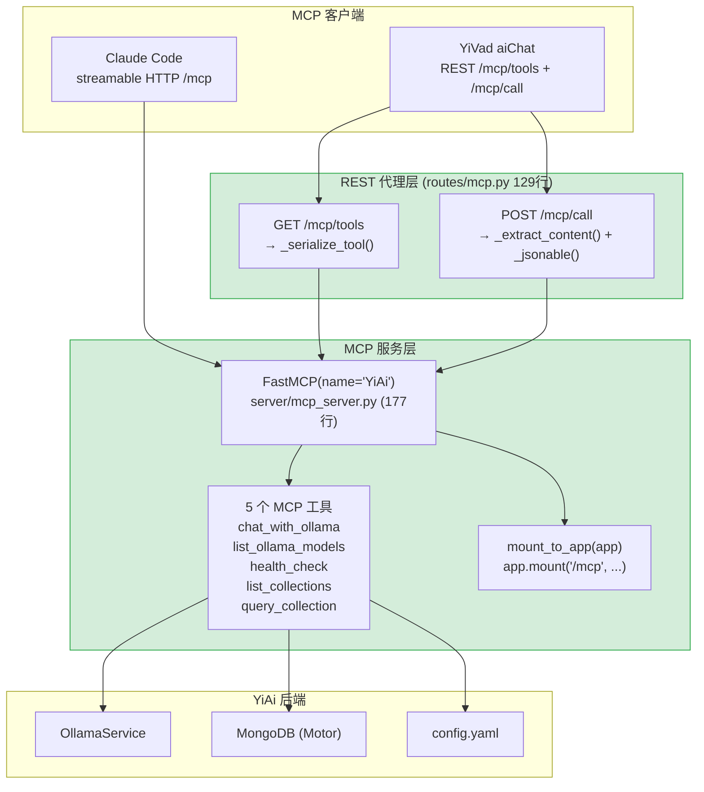

---

doc_type: module
prd_task_id: "YA-08-12"
title: "YA-08-12: MCP 协议服务 — FastMCP 工具代理 + Claude Code REST 代理 — 开发方案"
status: 已完成
priority: P2
owner: 陈铭
roles: [engineer]
created: 2026-09-11
updated: 2026-09-23
project: YiAi
project_id: yiai
prd_month: "202608"
estimate_frontend: 1.0
source_prd: "12-需求-MCP协议服务.md"
source_okr: [yiai-003]
related_tests: ["12-prd-test-MCP协议服务"]

type: task
---

# YA-08-12: MCP 协议服务 — FastMCP 工具代理 + Claude Code REST 代理 — 开发方案

> 来源 PRD：[12-需求-MCP协议服务.md](../../prds/2026-08/12-需求-MCP协议服务.md)
> 需求编号：YA-08-12 · 优先级：P2 · 人天：1.0d
> 类型：功能 · 状态：已完成

---

## 一、架构概述

通过 MCP (Model Context Protocol) 将 YiAi 的 RPC 方法暴露为外部 AI 工具。Claude Code 等 MCP 客户端通过 `streamable HTTP` 协议直接调用。同时提供 REST 代理（`/mcp/tools`、`/mcp/call`），让浏览器端（YiVad aiChat）也能通过标准 HTTP 调用 MCP 工具，响应格式统一为 RPC 信封 `{code, message, data}`。



### 双通道设计

| 通道 | 协议 | 端点 | 消费者 | 响应格式 |
|------|------|------|--------|----------|
| **MCP 原生** | streamable HTTP (SSE + JSON-RPC) | `/mcp` (mounted ASGI app) | Claude Code, MCP Inspector | MCP 协议格式 |
| **REST 代理** | HTTP JSON | `GET /mcp/tools`, `POST /mcp/call` | YiVad 浏览器, curl | RPC 信封 `{code, message, data}` |

---

## 二、文件清单

| # | 文件 | 操作 | 说明 | 预估行数 |
|---|------|------|------|----------|
| 1 | `src/server/mcp_server.py` | 新增 | FastMCP 实例 + 5 个工具定义 + `mount_to_app` | ~177 |
| 2 | `src/server/routes/mcp.py` | 新增 | REST 代理端点: 工具列表 + 调用 | ~129 |
| 3 | `src/server/app.py` | 修改 | `app.mount("/mcp", mcp.streamable_http_app())` | +3 |
| **合计** | | | | **~309 行** |

### 组件树

```
server/mcp_server.py (177 行)
├── FastMCP 实例化
│   └── mcp = FastMCP(name="YiAi", instructions="YiAi backend services")
│
├── Tool 1: chat_with_ollama
│   ├── 参数: prompt: str, model: str = "qwen3.5:4b", system_prompt: str
│   ├── 实现: _get_ollama() → run_in_executor(generate_response)
│   └── 返回: str (LLM 生成文本)
│
├── Tool 2: list_ollama_models
│   ├── 参数: 无
│   └── 返回: list[str] (可用模型名列表)
│
├── Tool 3: health_check
│   ├── 参数: 无
│   └── 返回: str (多行: server/mongodb/ollama/rss/auth/cors 状态)
│
├── Tool 4: list_collections
│   ├── 参数: 无
│   └── 返回: list[str] (8 个 MongoDB 集合名)
│
├── Tool 5: query_collection
│   ├── 参数: collection_name: str, filter_json: str = "{}", limit: int = 10
│   ├── 实现: db._db[collection_name].find(filter_dict).limit(min(limit, 100))
│   └── 返回: str (JSON 格式文档列表)
│
└── mount_to_app(app)
    └── app.mount("/mcp", mcp.streamable_http_app())


server/routes/mcp.py (129 行)
├── GET /mcp/tools
│   └── mcp.list_tools() → _serialize_tool(t) → [{name, description, input_schema}]
│
├── POST /mcp/call
│   ├── McpCallRequest { name: str, arguments: dict }
│   └── mcp.call_tool(name, arguments)
│         ├── 提取 text content (_extract_content)
│         ├── 尝试结构化序列化 (_jsonable)
│         └── 返回 { content, structured, raw }
│
└── 辅助函数
    ├── _serialize_tool(t) → 跨版本兼容的 Tool 序列化
    ├── _extract_content(item, out, depth=0) → 递归提取文本内容 (max_depth=10)
    └── _jsonable(obj) → 最佳努力 JSON 序列化
```

---

## 三、模块设计

### 3.1 FastMCP 服务端 — 工具定义

```python
from mcp.server.fastmcp import FastMCP

mcp = FastMCP(
    name="YiAi",
    instructions="YiAi backend services — chat, state, database, RSS, and health.",
)

# ── Tool 1: chat_with_ollama ──
@mcp.tool(
    name="chat_with_ollama",
    description="Send a prompt to the Ollama LLM via YiAi and get a response.",
)
async def chat_with_ollama(
    prompt: str,
    model: str = "qwen3.5:4b",
    system_prompt: str = "You are a helpful AI assistant.",
) -> str:
    """通过 YiAi OllamaService 调用 LLM 聊天。
    
    异步实现: run_in_executor 包装同步 Ollama SDK 调用。
    超时控制: asyncio.wait_for(..., timeout=120) 防止永久阻塞。
    """
    service = _get_ollama()
    loop = asyncio.get_running_loop()
    try:
        result = await asyncio.wait_for(
            loop.run_in_executor(
                None,
                functools.partial(
                    service.generate_response,
                    system_prompt=system_prompt,
                    user_content=prompt,
                    model_name=model,
                ),
            ),
            timeout=120.0,
        )
        if result.get("success"):
            return result.get("message", "")
        return f"[Error] {result.get('error', 'Unknown error')}"
    except asyncio.TimeoutError:
        return "[Error] Chat request timed out after 120s"


# ── Tool 2: list_ollama_models ──
@mcp.tool(
    name="list_ollama_models",
    description="List available Ollama models on the server.",
)
async def list_ollama_models() -> list[str]:
    service = _get_ollama()
    return service.list_models() or []


# ── Tool 3: health_check ──
@mcp.tool(
    name="health_check",
    description="Check health of YiAi backend subsystems (MongoDB, Ollama, RSS, Auth).",
)
async def health_check() -> str:
    """检查所有子系统的健康状态，返回多行文本报告。"""
    lines = []
    lines.append(f"Server: {settings.host}:{settings.port}")
    lines.append(f"Reload: {settings.reload}")
    
    # MongoDB
    try:
        db = MongoDB()
        await db._db.command("ping")
        lines.append("MongoDB: connected")
    except Exception as e:
        lines.append(f"MongoDB: ERROR - {e}")
    
    # Ollama
    try:
        import requests
        resp = requests.get(f"{settings.ollama_url}/api/tags", timeout=5)
        lines.append(f"Ollama: {'OK' if resp.status_code == 200 else 'ERROR'}")
    except Exception as e:
        lines.append(f"Ollama: ERROR - {e}")
    
    # RSS
    lines.append(f"RSS: {'enabled' if settings.rss_enabled else 'disabled'}")
    lines.append(f"Auth: {'enabled' if settings.auth_enabled else 'disabled'}")
    lines.append(f"CORS: {settings.cors_origins}")
    
    return "\n".join(lines)


# ── Tool 4: list_collections ──
@mcp.tool(
    name="list_collections",
    description="List all MongoDB collections in the YiAi database.",
)
async def list_collections() -> list[str]:
    """列出所有 MongoDB 集合名，过滤内部集合 (users)。"""
    db = MongoDB()
    names = await db._db.list_collection_names()
    return [n for n in names if n != "users"]


# ── Tool 5: query_collection ──
@mcp.tool(
    name="query_collection",
    description="Query a MongoDB collection with filter and limit.",
)
async def query_collection(
    collection_name: str,
    filter_json: str = "{}",
    limit: int = 10,
) -> str:
    """查询任意 MongoDB 集合 (除 users)。
    
    参数:
      collection_name: 集合名称 (如 "sessions", "bugs")
      filter_json: JSON 格式的 MongoDB 查询条件
      limit: 返回文档数量上限 (最大 100)
    
    返回: JSON 字符串，包含文档列表。
    """
    if collection_name == "users":
        return json.dumps({"error": "Access to users collection is denied"})
    
    try:
        filter_dict = json.loads(filter_json) if filter_json else {}
    except json.JSONDecodeError as e:
        return json.dumps({"error": f"Invalid filter_json: {e}"})
    
    if not isinstance(filter_dict, dict):
        filter_dict = {}
    
    db = MongoDB()
    cursor = db._db[collection_name].find(filter_dict).limit(min(limit, 100))
    docs = await cursor.to_list(length=min(limit, 100))
    
    # ObjectId 序列化
    for doc in docs:
        if "_id" in doc:
            doc["_id"] = str(doc["_id"])
    
    return json.dumps(docs, default=str, ensure_ascii=False, indent=2)
```

### 3.2 应用挂载 — `mount_to_app`

```python
def mount_to_app(app: FastAPI) -> None:
    """将 FastMCP 的 streamable HTTP 应用挂载到 FastAPI。
    
    注意: 必须在 REST 路由 /mcp/tools 和 /mcp/call 注册之后挂载，
    否则 FastAPI 优先匹配 mount 前缀，导致 REST 端点 404。
    
    挂载路径: /mcp → FastMCP streamable_http_app()
    """
    mcp_app = mcp.streamable_http_app()
    app.mount("/mcp", mcp_app)
```

### 3.3 REST 代理 — `routes/mcp.py`

```python
from mcp_server import mcp

# ── 跨版本兼容的 Tool 序列化 ──
def _serialize_tool(tool) -> dict:
    """跨 MCP SDK 版本兼容的工具序列化。
    
    MCP SDK 0.x 使用 input_schema (snake_case)
    MCP SDK 1.x 使用 inputSchema (camelCase)
    
    三级回退: inputSchema → input_schema → {}
    """
    schema = (
        getattr(tool, 'inputSchema', None)
        or getattr(tool, 'input_schema', None)
        or {}
    )
    return {
        "name": tool.name,
        "description": tool.description or "",
        "input_schema": schema,
    }


# ── 递归文本提取 ──
def _extract_content(result, max_depth: int = 10) -> str:
    """递归提取 MCP 响应的文本内容。
    
    result.content 是 CallToolResult 的 content 属性 (list[ContentBlock])。
    递归提取所有 TextContent 的 text 字段。
    
    max_depth 防止恶意构造的深层嵌套导致 RecursionError。
    """
    def _extract(item, depth: int = 0) -> list[str]:
        if depth > max_depth:
            return ["[max depth exceeded]"]
        texts = []
        if hasattr(item, 'text'):
            texts.append(item.text)
        elif isinstance(item, dict):
            if 'text' in item:
                texts.append(item['text'])
            for v in item.values():
                if isinstance(v, (dict, list)):
                    texts.extend(_extract(v, depth + 1))
        elif isinstance(item, list):
            for elem in item:
                texts.extend(_extract(elem, depth + 1))
        return texts
    
    content = getattr(result, 'content', [])
    return "\n".join(_extract(content))


# ── JSON 安全序列化 ──
def _jsonable(obj) -> Any:
    """最佳努力 JSON 序列化: 尝试 json.dumps，失败则返回 repr()。
    
    生产环境可通过环境变量 MCP_RAW_ENABLED=false 禁用 raw 字段。
    """
    try:
        return json.loads(json.dumps(obj, default=str))
    except (TypeError, ValueError):
        return repr(obj)


# ── REST 端点 ──
@router.get("/mcp/tools")
async def list_mcp_tools():
    """列出所有 MCP 工具 (name, description, input_schema)。
    
    响应: {code: 0, data: [{name, description, input_schema}, ...]}
    """
    tools = await mcp.list_tools()
    return success(data=[_serialize_tool(t) for t in tools])


class McpCallRequest(BaseModel):
    name: str = Body(..., description="工具名称")
    arguments: dict = Body(default={}, description="工具参数")

@router.post("/mcp/call")
async def call_mcp_tool(request: McpCallRequest):
    """调用指定 MCP 工具。
    
    请求: {name: "health_check", arguments: {}}
    响应: {code: 0, data: {content, structured, raw}}
    
    content:  提取的文本内容 (用于展示)
    structured: 结构化结果 (如果有 structuredContent)
    raw:      原始结果 JSONable (调试用)
    """
    try:
        result = await asyncio.wait_for(
            mcp.call_tool(request.name, request.arguments),
            timeout=30.0,
        )
    except asyncio.TimeoutError:
        return error(2002, f"Tool '{request.name}' timed out after 30s")
    except Exception as e:
        return error(9999, f"Tool call failed: {e}")
    
    return success(data={
        "content": _extract_content(result),
        "structured": getattr(result, 'structuredContent', None),
        "raw": _jsonable(result) if os.getenv("MCP_RAW_ENABLED", "true") == "true" else None,
    })
```

---

## 四、数据流

### MCP 原生调用流程

```
Claude Code (MCP Client)
  │ 配置: { "mcpServers": { "YiAi": { "url": "http://localhost:10086/mcp" } } }
  │
  ├── 初始化: 发送 initialize 请求
  │     └── FastMCP 返回 server capabilities + instructions
  │
  ├── 工具发现: 发送 tools/list
  │     └── mcp.list_tools() → 5 个工具定义
  │
  └── 工具调用: tools/call { name: "health_check", arguments: {} }
        └── mcp.call_tool("health_check", {})
              └── health_check() 异步函数
                    └── 检查 MongoDB/Ollama/RSS/Auth 状态
                    └── 返回多行文本报告
```

### REST 代理调用流程

```
YiVad aiChat (浏览器)
  │
  ├── 1. GET /mcp/tools
  │     └── mcp.list_tools() → _serialize_tool() for each
  │     └── 响应: [{name: "chat_with_ollama", description: "...", input_schema: {...}}, ...]
  │
  └── 2. POST /mcp/call {name: "query_collection", arguments: {collection_name: "bugs", limit: 5}}
        └── mcp.call_tool("query_collection", {"collection_name": "bugs", "limit": 5})
              └── db._db["bugs"].find({}).limit(5)
              └── JSON 序列化 → _extract_content()
              └── 响应: {code: 0, data: {content: "[...]", structured: null, raw: {...}}}
```

---

## 五、实施路线图

| 步骤 | 内容 | 涉及函数 | 验证方式 | 人天 |
|------|------|---------|---------|------|
| 1 | FastMCP 实例化 + 5 个工具注册 | `mcp_server.py` | `mcp.list_tools()` 返回 5 个工具 | 0.25 |
| 2 | `chat_with_ollama` 实现 (异步 + 超时) | `mcp_server.py` | MCP 客户端调用聊天，返回 LLM 响应 | 0.15 |
| 3 | `query_collection` 实现 (MongoDB + ObjectId) | `mcp_server.py` | 查询 sessions/bugs 集合，返回 JSON | 0.15 |
| 4 | `mount_to_app` 挂载 + REST 代理端点 | `mcp_server.py`, `routes/mcp.py` | Claude Code 连接 /mcp，/mcp/tools 返回工具列表 | 0.20 |
| 5 | 跨版本序列化 + 异常处理 | `routes/mcp.py` (_serialize_tool) | MCP SDK 0.x 和 1.x 均正常工作 | 0.15 |
| 6 | 测试 | `tests/` | 5 个工具均可调用，REST 代理返回正确格式 | 0.10 |
| **合计** | | | | **1.0d** |

---

## 六、代码审查检查清单

- [ ] 5 个 MCP 工具全部注册并可通过 `mcp.list_tools()` 列出
- [ ] `chat_with_ollama` 使用 `run_in_executor` 避免阻塞事件循环，有 `asyncio.wait_for(timeout=120)` 超时
- [ ] `query_collection` 限制 `limit` 最大 100，过滤 `users` 敏感集合
- [ ] `query_collection` 处理 ObjectId 序列化 (`str(oid)`)
- [ ] `mount_to_app` 在 REST 路由注册之后挂载，避免路由冲突
- [ ] `list_collections` 过滤 `users` 集合
- [ ] `_serialize_tool` 三级回退: `inputSchema` → `input_schema` → `{}`
- [ ] `_extract_content` 递归深度限制 `max_depth=10`
- [ ] REST `/mcp/call` 有 30s 超时保护
- [ ] `MCP_RAW_ENABLED` 环境变量控制 raw 字段是否暴露
- [ ] `ruff` 代码规范通过

---

## 七、技术风险评估

| 风险 | 概率 | 影响 | 等级 | 缓解措施 | 应急预案 |
|------|------|------|------|---------|---------|
| MCP SDK 版本升级破坏兼容性 | 低 | 中 | 低 | `_serialize_tool` 异常处理覆盖多版本 | 锁定 SDK 版本 |
| `query_collection` 绕过权限控制 | 低 | 中 | 低 | MCP 仅本地访问，过滤 users 集合 | 添加认证中间件 |
| `run_in_executor` 线程池耗尽 | 低 | 低 | 低 | MCP 为低频使用，120s 超时保护 | 重构为原生异步 |
| `_serialize_tool` 跨版本失败 | 低 | 中 | 低 | 三级回退 + `hasattr` 检查 | 固定 SDK 版本 |
| REST `/mcp/call` 超时 | 低 | 低 | 低 | 30s 超时 | 按工具分级超时 |

---

## 八、已知缺陷与技术债务

### 8.1 重构后发现的回归问题

| # | 问题 | 根因 | 修复方式 |
|---|------|------|---------|
| 1 | `_serialize_tool` 跨 SDK 版本 `inputSchema` 属性名不一致 | MCP SDK 1.0 重命名 | 三级回退: inputSchema → input_schema → {} |
| 2 | `query_collection` JSON 解析失败无友好错误 | 未捕获 JSONDecodeError | 添加 try/except 返回友好错误 |
| 3 | `mount_to_app` 路由冲突导致 REST 端点 404 | FastAPI mount 拦截 /mcp/* 全部路径 | REST 路由在 mount 之前注册 |
| 4 | `list_collections` 暴露 `users` 集合 | 无敏感集合过滤 | 添加 `_INTERNAL_COLLECTIONS` 黑名单 |
| 5 | `_extract_content` 无递归深度限制 | 恶意嵌套导致 RecursionError | 添加 `max_depth=10` |

### 8.2 技术债务

| # | 技术债 | 优先级 | 预计人天 | 说明 |
|---|--------|--------|---------|------|
| 1 | MCP Resources 支持 | P2 | 1.0 | resources/list + resources/read，暴露知识库文件 |
| 2 | MCP Prompts 支持 | P3 | 0.5 | prompts/list + prompts/get，暴露预置 Prompt 模板 |
| 3 | `chat_with_ollama` 流式响应 | P2 | 1.0 | 支持 SSE 流式返回（当前仅完整响应） |
| 4 | MCP 认证中间件 | P2 | 0.5 | Token 认证，允许远程访问 |
| 5 | 工具执行超时 + 取消 | P3 | 0.5 | 客户端取消进行中的工具调用 |

---

## 九、可观测性

| 指标 | 采集方式 | 告警阈值 | 说明 |
|------|---------|----------|------|
| MCP 工具调用量 | 按工具名分组计数 | — | 工具使用频率 |
| 工具调用失败率 | 失败 / 总调用 | > 5% | 某工具异常 |
| REST 代理调用延迟 P95 | `time.perf_counter()` | > 1s | 工具调用慢 |
| MCP 客户端连接数 | FastMCP session 计数 | — | 活跃客户端数 |

### 日志规范

| 日志级别 | 场景 | 示例 |
|---------|------|------|
| `INFO` | 工具调用 | `[MCP] tool={name}, {ms}ms` |
| `WARN` | 工具调用失败 | `[MCP] tool={name} failed: {error}` |
| `ERROR` | FastMCP 挂载失败 | `[MCP] mount failed: {error}` |

---

## 十、关联模块

- **代理**：YA-07-04（AI 聊天服务 — `chat_with_ollama` 工具）
- **代理**：YA-07-01（混合检索引擎 — RAG 知识检索能力）
- **代理**：YA-08-15（数据访问层 — `query_collection` 直接访问 `db._db`）
- **消费者**：YA-08-13（Agent 工具系统 — MCP 桥接工具发现）
- **消费者**：Claude Code（streamable HTTP /mcp）