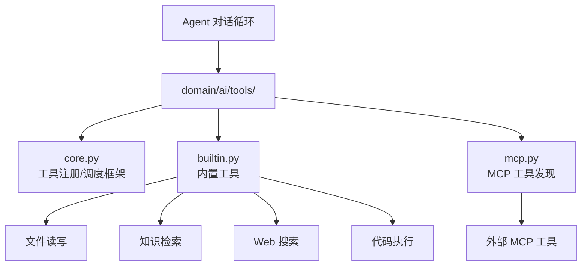

# YA-08-13: Agent 工具系统 — core/builtin/mcp 三层工具架构 — 开发方案

> 来源 PRD：[13-需求-Agent工具系统.md](../../prds/2026-08/13-需求-Agent工具系统.md)
> 需求编号：YA-08-13 · 优先级：P1 · 人天：1.5d
> 类型：功能 · 状态：已完成

---

## 一、方案概述

Agent 工具系统分三层：**core**（框架抽象）、**builtin**（内置工具）、**mcp**（外部 MCP 工具发现）。Agent 在对话中通过 function calling 调用工具完成复杂任务。



### 三层职责

| 层 | 文件 | 职责 |
|----|------|------|
| core | `domain/ai/tools/core.py` | 工具注册、参数校验、结果格式化 |
| builtin | `domain/ai/tools/builtin.py` | 内置工具实现（文件/知识/搜索/执行） |
| mcp | `domain/ai/tools/mcp.py` | MCP 协议工具发现与代理调用 |

---

## 二、工具注册

```python
# core.py
@dataclass
class ToolDef:
    name: str
    description: str
    parameters: dict  # JSON Schema
    handler: Callable

_registry: dict[str, ToolDef] = {}

def register(name: str, description: str, parameters: dict):
    def decorator(fn):
        _registry[name] = ToolDef(name, description, parameters, fn)
        return fn
    return decorator
```

---

## 三、实施步骤

| 步骤 | 内容 | 验证 | 人天 |
|------|------|------|------|
| 1 | core 工具注册框架 | `@register` 装饰器注册成功 | 0.5 |
| 2 | builtin 工具实现（4 个） | 文件读写/知识检索/Web搜索/代码执行 | 0.5 |
| 3 | mcp 工具发现 + 测试 | MCP 工具自动注册为 Agent 工具 | 0.5 |

**合计：1.5d**。

---

## 四、关联模块

- 依赖：[YA-08-12 MCP 协议服务](./12-prd-task-MCP协议服务.md)
- 依赖：[YA-08-10 Web 搜索](./10-prd-task-Web搜索与内容提取.md)
- 消费：[YA-07-04 AI 聊天服务](../2026-07/04-prd-task-AI聊天服务.md)——Agent 模式聊天